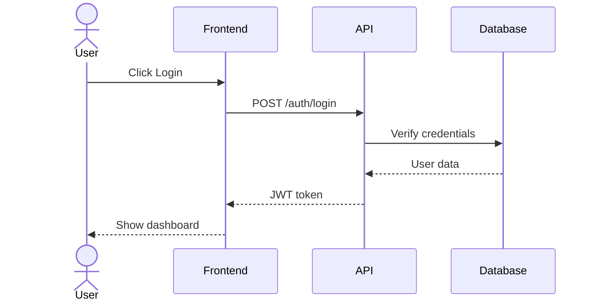
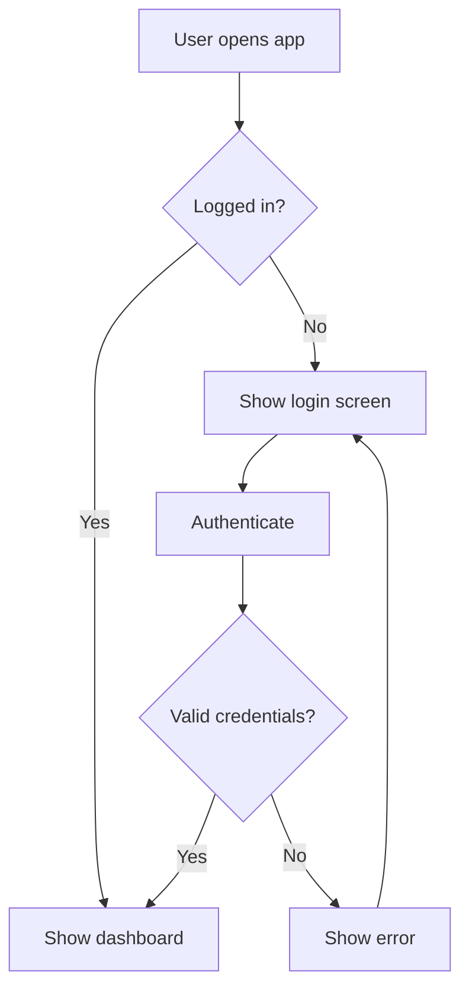
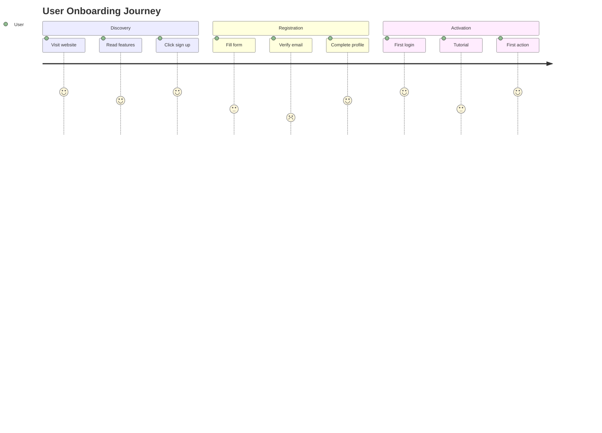
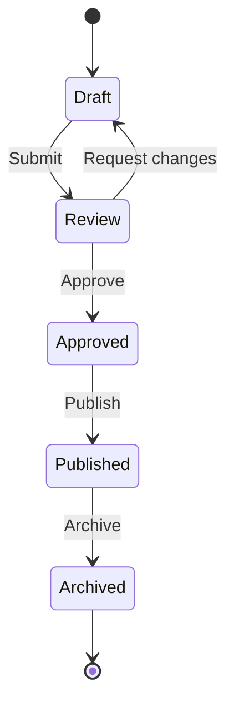
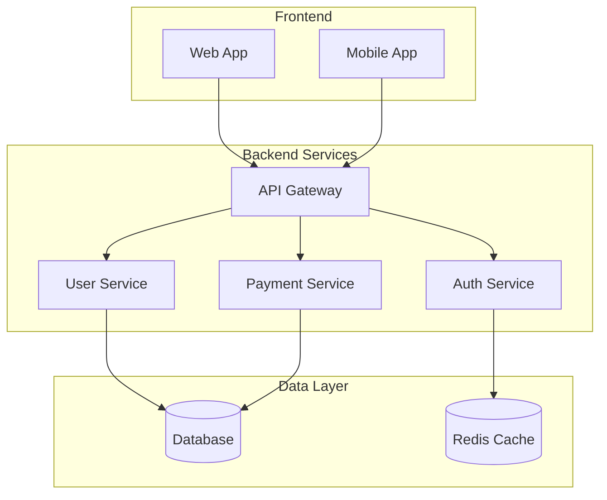
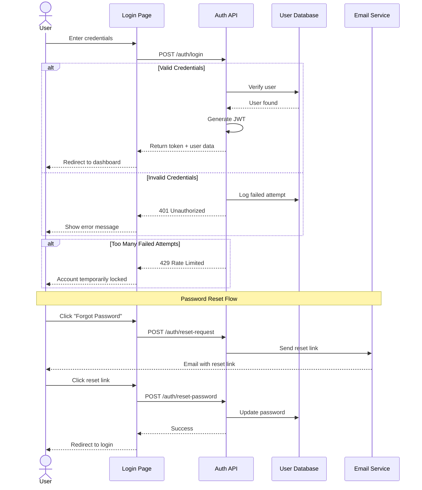
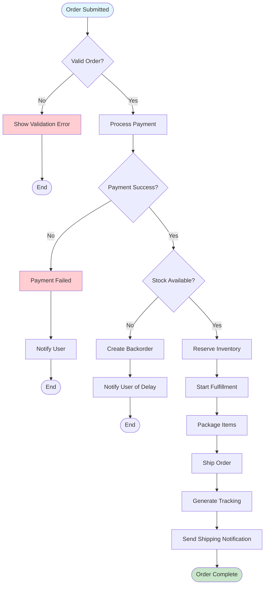
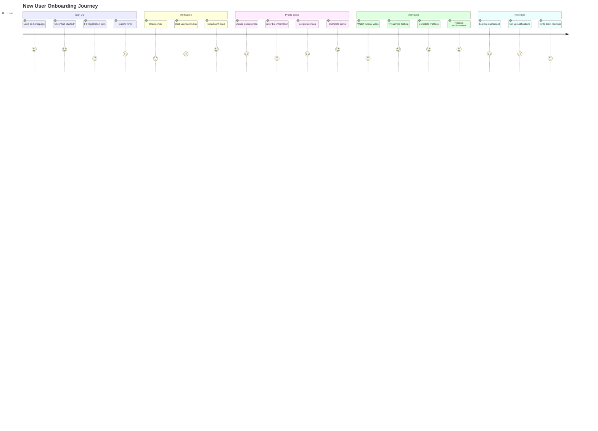
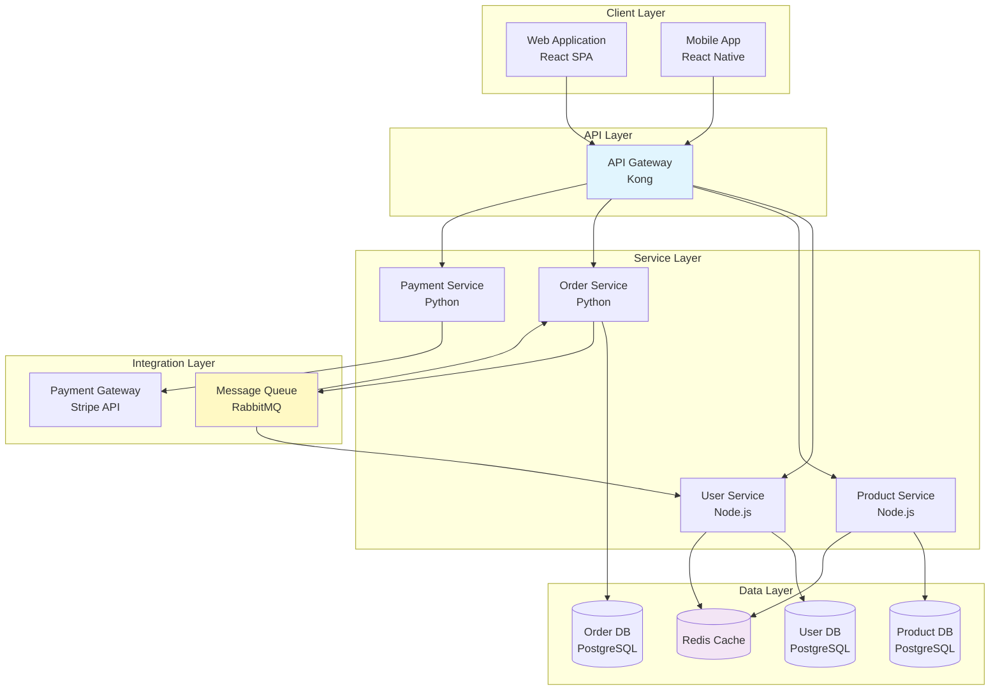
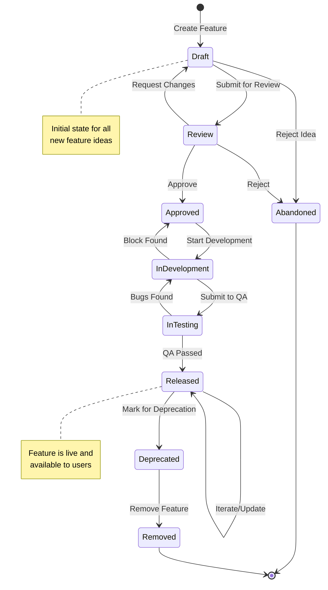

# PRD Diagram Creator

## Overview
This skill helps product managers transform textual PRD content into professional, clear diagrams that communicate complex workflows, system interactions, and user journeys effectively.

## When to Use This Skill

Use this skill when you need to:
- **Visualize user workflows** from user stories or requirements
- **Document system interactions** and API flows
- **Map business processes** for stakeholder communication
- **Illustrate user journeys** across touchpoints
- **Show data flows** between system components
- **Create architecture diagrams** for technical teams
- **Sequence interactions** between actors and systems

**Trigger keywords**: diagram, flowchart, sequence, process flow, user journey, architecture, visualization, mermaid, visualize, illustrate, map

## Core Capabilities

### 1. Sequence Diagrams
Perfect for showing interactions between users, systems, and services over time.

**Use cases:**
- API authentication flows
- User login/registration processes
- Payment processing workflows
- Multi-step user interactions
- System-to-system communication

### 2. Business Process Flows (Flowcharts)
Ideal for decision trees and process workflows.

**Use cases:**
- User decision paths
- Approval workflows
- Error handling processes
- Feature activation logic
- Conditional business rules

### 3. User Journey Maps
Visualize the user's experience across different stages.

**Use cases:**
- End-to-end user experience
- Multi-channel journeys
- Touchpoint mapping
- Emotional journey tracking

### 4. System Architecture Diagrams
Show high-level system components and relationships.

**Use cases:**
- Microservices architecture
- Data flow between systems
- Integration points
- Component dependencies

### 5. State Diagrams
Illustrate state transitions and lifecycle management.

**Use cases:**
- Order status workflows
- User account states
- Feature flag transitions
- Document lifecycle

### 6. Entity Relationship Diagrams
Model data structures and relationships.

**Use cases:**
- Database schema visualization
- Data model documentation
- Relationship mapping

## Diagram Guidelines

### Best Practices

#### Clarity First
- **Keep it simple**: Focus on the essential elements
- **Use clear labels**: Avoid jargon, use business language
- **Limit complexity**: Break complex diagrams into multiple simpler ones
- **Consistent naming**: Use consistent terminology from PRD

#### Visual Design
- **Logical flow**: Left-to-right or top-to-bottom
- **Group related items**: Use subgraphs for logical grouping
- **Highlight critical paths**: Use colors/styles to emphasize important flows
- **Add context**: Include notes for complex decisions

#### Documentation Integration
- **Reference PRD sections**: Link diagrams to specific requirements
- **Version control**: Track diagram changes with PRD versions
- **Accessibility**: Provide text descriptions for screen readers

### Mermaid Syntax Guidelines

All diagrams use Mermaid syntax for easy integration with Markdown documentation:

#### 1. Sequence Diagram Syntax


#### 2. Flowchart Syntax


#### 3. User Journey Syntax


#### 4. State Diagram Syntax


#### 5. Architecture Diagram Syntax


## Working with NioPD Commands

### Diagram Creation Workflow

#### Step 1: Identify Diagram Needs
When reviewing a PRD, look for:
- Complex user workflows → **Sequence diagrams**
- Decision logic → **Flowcharts**
- Multi-stage processes → **User journeys**
- System components → **Architecture diagrams**

#### Step 2: Extract Information
From PRD sections:
- **User Stories** → User journey maps
- **Functional Requirements** → Sequence diagrams
- **Technical Considerations** → Architecture diagrams
- **Business Logic** → Flowcharts

#### Step 3: Create Diagrams
Generate Mermaid syntax based on extracted information.

#### Step 4: Integrate with PRD
- Add diagrams to appropriate PRD sections
- Reference diagrams in requirement descriptions
- Link to NioPD commands for updates

### Integration with NioPD Commands

#### After Creating PRD
```bash
# First, create the base PRD
/niopd:PD:draft --for=<initiative>

# Then add process diagrams
/niopd:PD:process --for=<prd>

# Add user journey diagrams
/niopd:PD:journey --for=<prd>
```

This skill complements these commands by:
- Providing diagram templates
- Ensuring consistent visual language
- Offering best practices guidance

#### Updating Existing PRDs
When a PRD needs diagram improvements:
1. Read the PRD content
2. Identify sections needing visualization
3. Generate appropriate diagrams
4. Suggest where to insert them
5. Update PRD with diagrams

## Examples

### Example 1: User Authentication Flow

**PRD Context:**
```
FR1: Users must be able to log in with email and password
FR2: System must support password reset via email
FR3: Failed login attempts must be tracked and rate-limited
```

**Generated Sequence Diagram:**


### Example 2: Order Processing Workflow

**PRD Context:**
```
The system shall process orders through the following stages:
1. Order submission
2. Payment verification
3. Inventory check
4. Fulfillment
5. Shipping
```

**Generated Flowchart:**


### Example 3: User Onboarding Journey

**PRD Context:**
```
New users should experience:
1. Account creation
2. Email verification
3. Profile setup
4. Tutorial walkthrough
5. First action completion
```

**Generated User Journey:**


### Example 4: Microservices Architecture

**PRD Context:**
```
Technical Architecture:
- Frontend: React SPA
- API Gateway: Kong
- Services: User, Product, Order, Payment
- Data: PostgreSQL, Redis cache
- Message Queue: RabbitMQ
```

**Generated Architecture Diagram:**


### Example 5: Feature State Lifecycle

**PRD Context:**
```
Feature Lifecycle States:
- Draft: Initial creation
- Review: Under PM review
- Approved: Ready for development
- In Development: Being built
- In Testing: QA validation
- Released: Live in production
- Deprecated: Scheduled for removal
```

**Generated State Diagram:**


## Common Diagram Patterns

### Authentication Patterns
- Login/Logout flows
- OAuth integration
- Token refresh
- Multi-factor authentication

### E-commerce Patterns
- Shopping cart workflows
- Checkout processes
- Order fulfillment
- Return/refund flows

### Content Management Patterns
- Content creation workflows
- Approval processes
- Publishing pipelines
- Version control

### Integration Patterns
- API request/response flows
- Webhook handling
- Third-party service integration
- Data synchronization

## Limitations

### What This Skill Does NOT Do
- **Generate actual image files** - Creates Mermaid syntax only
- **Create custom graphics** - Limited to Mermaid diagram types
- **Export to specific formats** - Mermaid rendering depends on viewer
- **Design UI mockups** - Use wireframe tools instead
- **Create detailed UML** - Focuses on business/product diagrams

### When to Use Other Tools
- **UI/UX mockups** → Use Figma, Sketch, or `/niopd:PD:wireframe`
- **Data models** → Use database design tools
- **Gantt charts** → Use project management tools or `/niopd:PM:roadmap`
- **Complex UML** → Use specialized UML tools

## Tips for Success

### 1. Start Simple
Begin with basic diagrams and add complexity only when needed.

### 2. Iterate
Create draft diagrams, get feedback, refine.

### 3. Keep Updated
Update diagrams when PRD requirements change.

### 4. Use Subgraphs
Group related components for better organization.

### 5. Add Annotations
Use notes to explain complex logic or edge cases.

### 6. Test Rendering
Verify diagrams render correctly in your documentation system.

### 7. Maintain Consistency
Use consistent naming, colors, and styles across all diagrams.

## Reference Materials

For detailed Mermaid syntax and advanced features, see:
- [mermaid-syntax.md](mermaid-syntax.md) - Complete Mermaid reference
- [diagram-templates.md](diagram-templates.md) - Reusable diagram templates
- [examples-library.md](examples-library.md) - Real-world diagram examples

## Quick Reference Card

| Diagram Type | Best For | Mermaid Keyword |
|--------------|----------|-----------------|
| Sequence | API flows, interactions | `sequenceDiagram` |
| Flowchart | Decision logic, processes | `graph TB/LR` |
| User Journey | Experience mapping | `journey` |
| State | Lifecycle, status | `stateDiagram-v2` |
| ER Diagram | Data models | `erDiagram` |
| Class | Object structure | `classDiagram` |
| Gantt | Timelines | `gantt` |

---

**Pro Tip**: When in doubt, start with a flowchart. It's the most versatile diagram type and can illustrate most product workflows effectively.
