# Reusable Diagram Templates

This document provides ready-to-use diagram templates for common product management scenarios. Copy and customize these templates for your PRDs.

## Authentication & Security Templates

### Template 1: Basic Login Flow
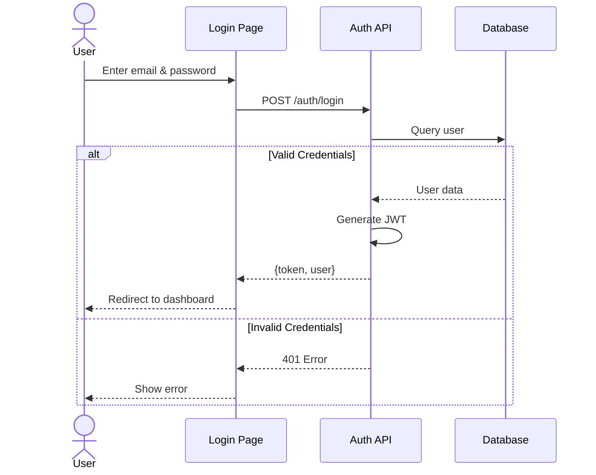
```mermaid
sequenceDiagram
    actor User
    participant UI as Login Page
    participant API as Auth API
    participant DB as Database
    
    User->>UI: Enter email & password
    UI->>API: POST /auth/login
    API->>DB: Query user
    
    alt Valid Credentials
        DB-->>API: User data
        API->>API: Generate JWT
        API-->>UI: {token, user}
        UI-->>User: Redirect to dashboard
    else Invalid Credentials
        API-->>UI: 401 Error
        UI-->>User: Show error
    end
```

### Template 2: OAuth Integration
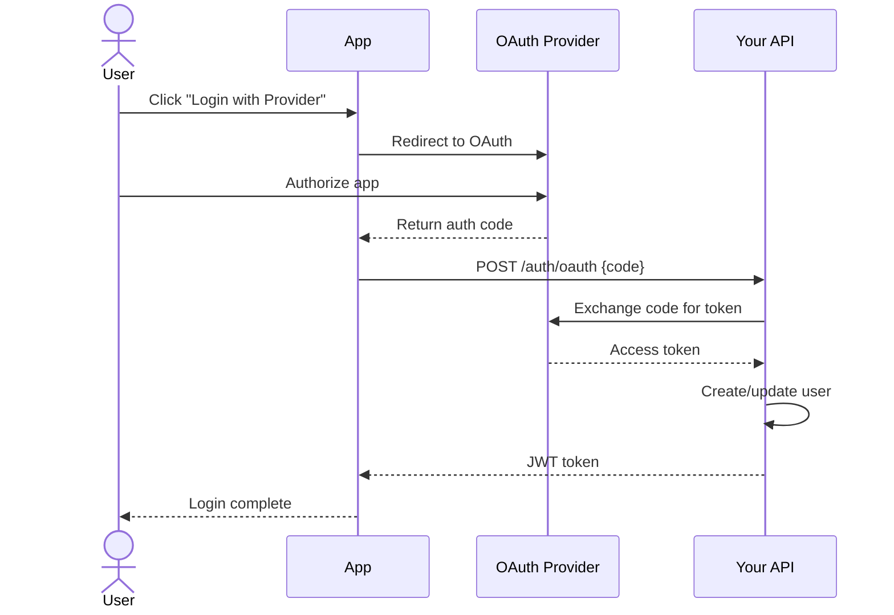
```mermaid
sequenceDiagram
    actor User
    participant App
    participant OAuth as OAuth Provider
    participant API as Your API
    
    User->>App: Click "Login with Provider"
    App->>OAuth: Redirect to OAuth
    User->>OAuth: Authorize app
    OAuth-->>App: Return auth code
    App->>API: POST /auth/oauth {code}
    API->>OAuth: Exchange code for token
    OAuth-->>API: Access token
    API->>API: Create/update user
    API-->>App: JWT token
    App-->>User: Login complete
```

### Template 3: Password Reset Flow
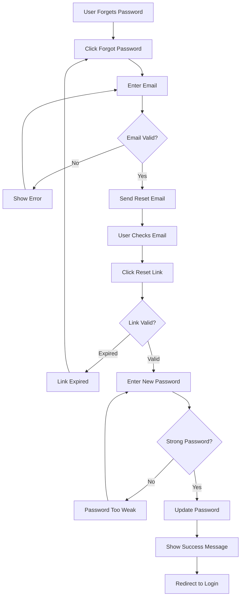
```mermaid
graph TB
    Start[User Forgets Password] --> Request[Click Forgot Password]
    Request --> Enter[Enter Email]
    Enter --> Valid{Email Valid?}
    
    Valid -->|No| Error1[Show Error]
    Error1 --> Enter
    
    Valid -->|Yes| Send[Send Reset Email]
    Send --> Wait[User Checks Email]
    Wait --> Click[Click Reset Link]
    Click --> Verify{Link Valid?}
    
    Verify -->|Expired| Error2[Link Expired]
    Error2 --> Request
    
    Verify -->|Valid| NewPass[Enter New Password]
    NewPass --> Validate{Strong Password?}
    
    Validate -->|No| WeakError[Password Too Weak]
    WeakError --> NewPass
    
    Validate -->|Yes| Update[Update Password]
    Update --> Success[Show Success Message]
    Success --> Login[Redirect to Login]
```

## E-commerce Templates

### Template 4: Checkout Process
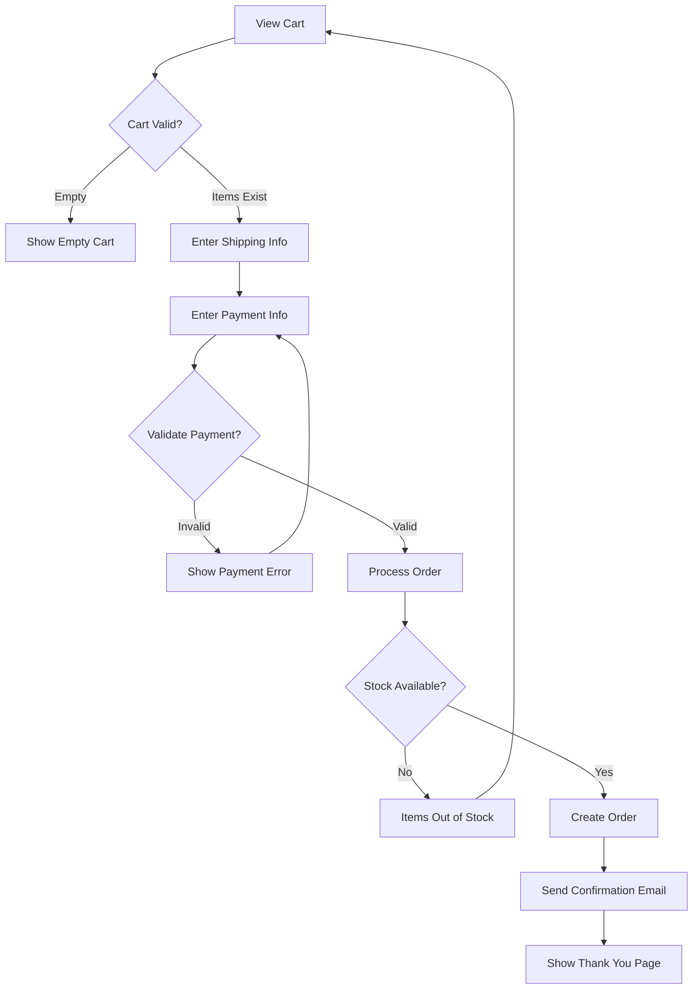
```mermaid
graph TB
    Cart[View Cart] --> Review{Cart Valid?}
    Review -->|Empty| Empty[Show Empty Cart]
    Review -->|Items Exist| Shipping[Enter Shipping Info]
    
    Shipping --> Payment[Enter Payment Info]
    Payment --> Validate{Validate Payment?}
    
    Validate -->|Invalid| PayError[Show Payment Error]
    PayError --> Payment
    
    Validate -->|Valid| Process[Process Order]
    Process --> Inventory{Stock Available?}
    
    Inventory -->|No| OutOfStock[Items Out of Stock]
    OutOfStock --> Cart
    
    Inventory -->|Yes| Confirm[Create Order]
    Confirm --> Email[Send Confirmation Email]
    Email --> Thank[Show Thank You Page]
```

### Template 5: Order Fulfillment
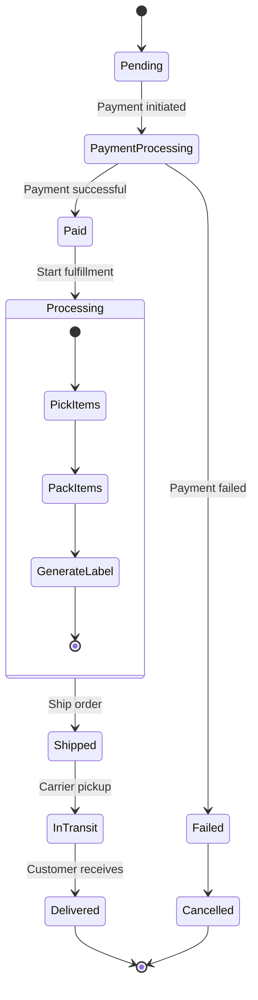
```mermaid
stateDiagram-v2
    [*] --> Pending
    
    Pending --> PaymentProcessing: Payment initiated
    PaymentProcessing --> Paid: Payment successful
    PaymentProcessing --> Failed: Payment failed
    
    Paid --> Processing: Start fulfillment
    Processing --> Shipped: Ship order
    Shipped --> InTransit: Carrier pickup
    InTransit --> Delivered: Customer receives
    
    Delivered --> [*]
    Failed --> Cancelled
    Cancelled --> [*]
    
    state Processing {
        [*] --> PickItems
        PickItems --> PackItems
        PackItems --> GenerateLabel
        GenerateLabel --> [*]
    }
```

### Template 6: Product Discovery Journey
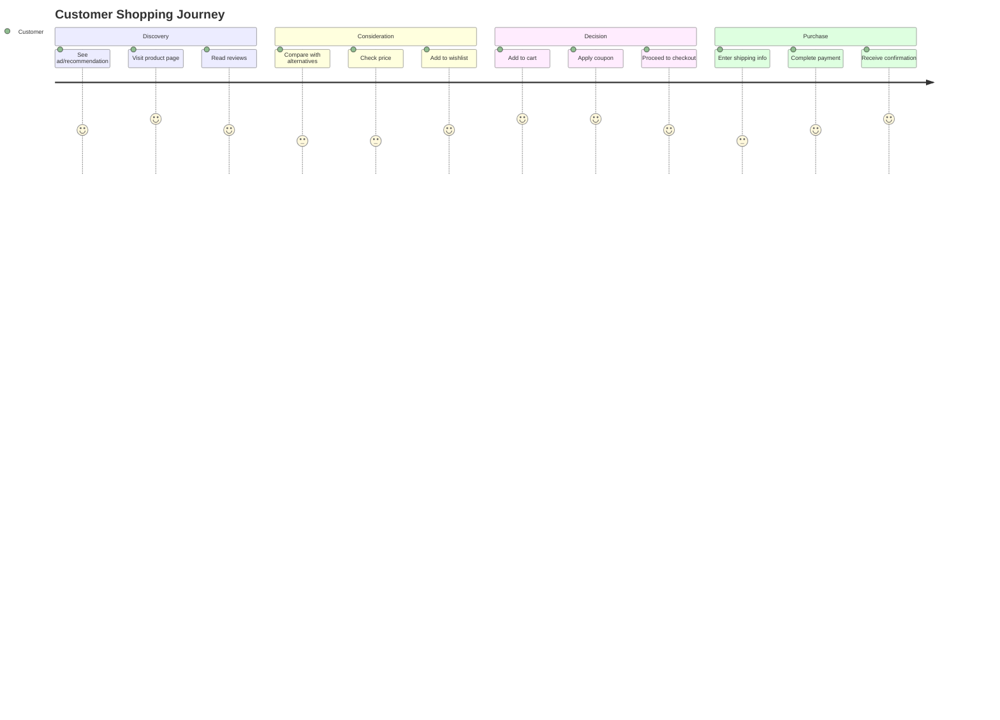
```mermaid
journey
    title Customer Shopping Journey
    section Discovery
      See ad/recommendation: 4: Customer
      Visit product page: 5: Customer
      Read reviews: 4: Customer
    section Consideration
      Compare with alternatives: 3: Customer
      Check price: 3: Customer
      Add to wishlist: 4: Customer
    section Decision
      Add to cart: 5: Customer
      Apply coupon: 5: Customer
      Proceed to checkout: 4: Customer
    section Purchase
      Enter shipping info: 3: Customer
      Complete payment: 4: Customer
      Receive confirmation: 5: Customer
```

## SaaS & Subscription Templates

### Template 7: User Onboarding Flow
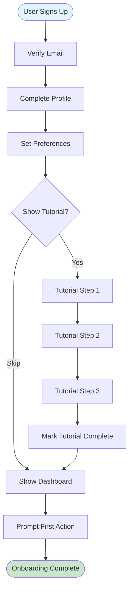
```mermaid
graph TB
    Start([User Signs Up]) --> Verify[Verify Email]
    Verify --> Profile[Complete Profile]
    Profile --> Preferences[Set Preferences]
    Preferences --> Tutorial{Show Tutorial?}
    
    Tutorial -->|Skip| Dashboard
    Tutorial -->|Yes| Step1[Tutorial Step 1]
    
    Step1 --> Step2[Tutorial Step 2]
    Step2 --> Step3[Tutorial Step 3]
    Step3 --> Complete[Mark Tutorial Complete]
    Complete --> Dashboard[Show Dashboard]
    
    Dashboard --> FirstAction[Prompt First Action]
    FirstAction --> Done([Onboarding Complete])
    
    style Start fill:#e1f5fe
    style Done fill:#c8e6c9
```

### Template 8: Subscription Management
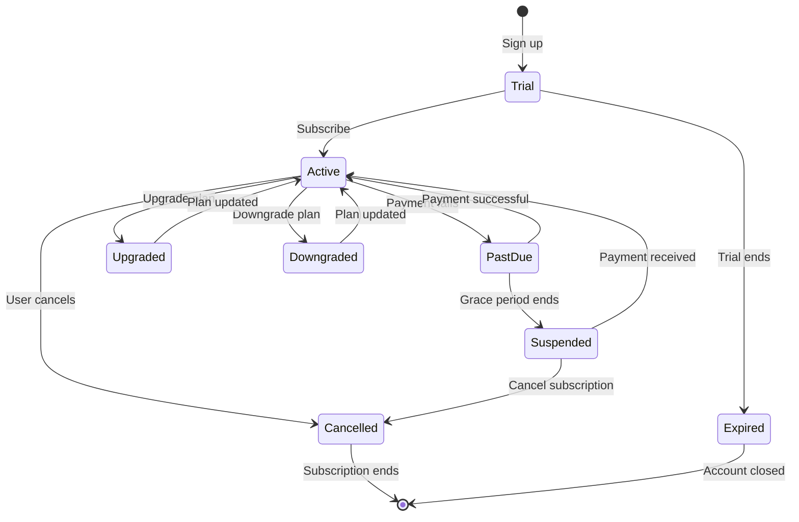
```mermaid
stateDiagram-v2
    [*] --> Trial: Sign up
    
    Trial --> Active: Subscribe
    Trial --> Expired: Trial ends
    
    Active --> PastDue: Payment fails
    Active --> Cancelled: User cancels
    Active --> Upgraded: Upgrade plan
    Active --> Downgraded: Downgrade plan
    
    PastDue --> Active: Payment successful
    PastDue --> Suspended: Grace period ends
    
    Suspended --> Active: Payment received
    Suspended --> Cancelled: Cancel subscription
    
    Cancelled --> [*]: Subscription ends
    Expired --> [*]: Account closed
    
    Upgraded --> Active: Plan updated
    Downgraded --> Active: Plan updated
```

### Template 9: Feature Activation
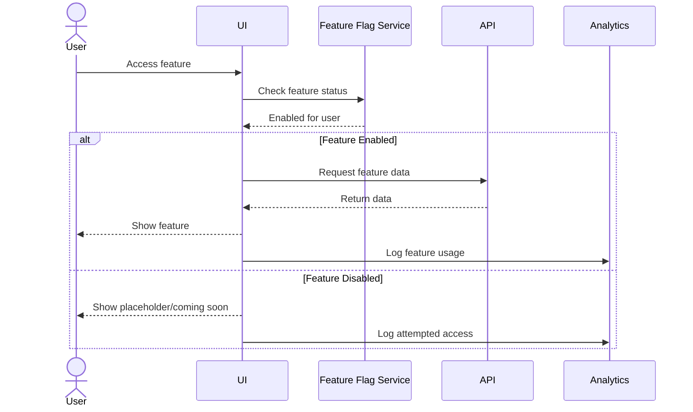
```mermaid
sequenceDiagram
    actor User
    participant UI
    participant FeatureFlag as Feature Flag Service
    participant API
    participant Analytics
    
    User->>UI: Access feature
    UI->>FeatureFlag: Check feature status
    FeatureFlag-->>UI: Enabled for user
    
    alt Feature Enabled
        UI->>API: Request feature data
        API-->>UI: Return data
        UI-->>User: Show feature
        UI->>Analytics: Log feature usage
    else Feature Disabled
        UI-->>User: Show placeholder/coming soon
        UI->>Analytics: Log attempted access
    end
```

## Data & Integration Templates

### Template 10: Data Sync Flow
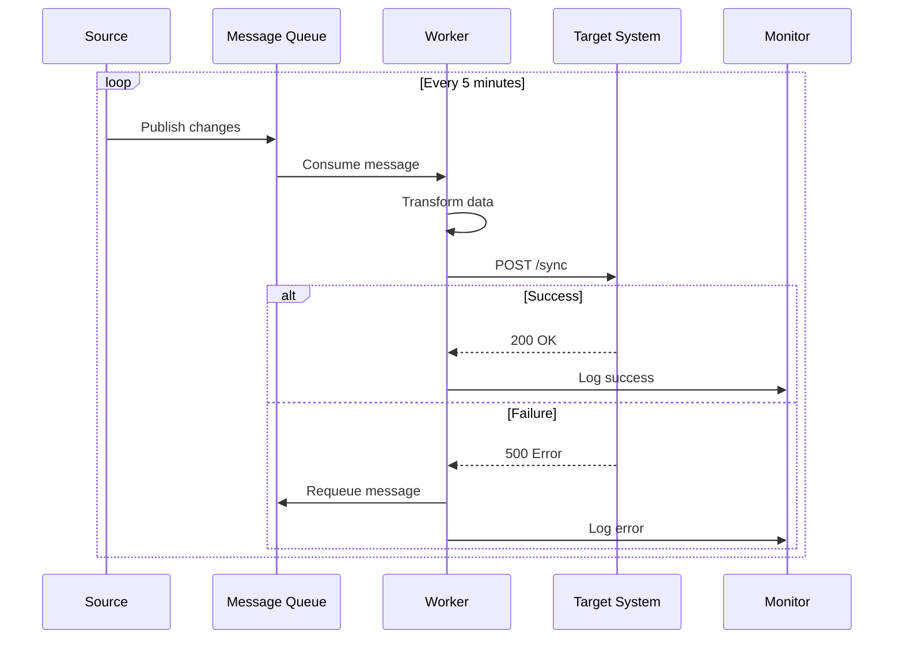
```mermaid
sequenceDiagram
    participant Source
    participant Queue as Message Queue
    participant Worker
    participant Target as Target System
    participant Monitor
    
    loop Every 5 minutes
        Source->>Queue: Publish changes
        Queue->>Worker: Consume message
        Worker->>Worker: Transform data
        Worker->>Target: POST /sync
        
        alt Success
            Target-->>Worker: 200 OK
            Worker->>Monitor: Log success
        else Failure
            Target-->>Worker: 500 Error
            Worker->>Queue: Requeue message
            Worker->>Monitor: Log error
        end
    end
```

### Template 11: Microservices Architecture
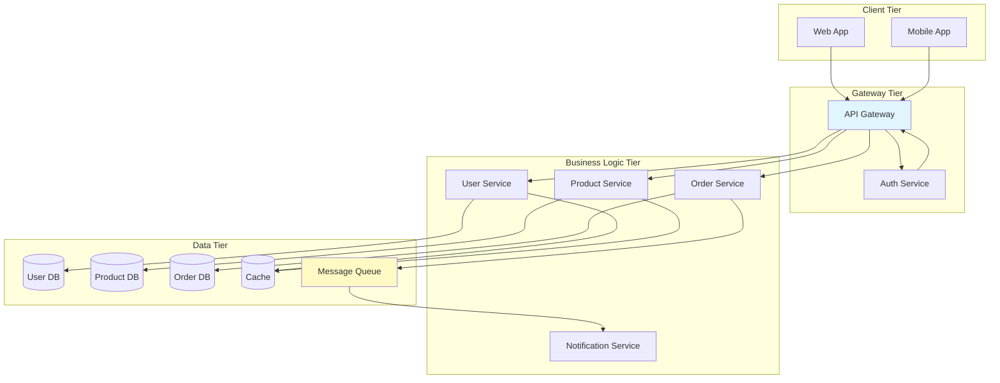
```mermaid
graph TB
    subgraph "Client Tier"
        Web[Web App]
        Mobile[Mobile App]
    end
    
    subgraph "Gateway Tier"
        Gateway[API Gateway]
        Auth[Auth Service]
    end
    
    subgraph "Business Logic Tier"
        UserSvc[User Service]
        ProductSvc[Product Service]
        OrderSvc[Order Service]
        NotifSvc[Notification Service]
    end
    
    subgraph "Data Tier"
        UserDB[(User DB)]
        ProductDB[(Product DB)]
        OrderDB[(Order DB)]
        Cache[(Cache)]
        Queue[Message Queue]
    end
    
    Web --> Gateway
    Mobile --> Gateway
    Gateway --> Auth
    Auth --> Gateway
    
    Gateway --> UserSvc
    Gateway --> ProductSvc
    Gateway --> OrderSvc
    
    UserSvc --> UserDB
    ProductSvc --> ProductDB
    OrderSvc --> OrderDB
    
    UserSvc --> Cache
    ProductSvc --> Cache
    
    OrderSvc --> Queue
    Queue --> NotifSvc
    
    style Gateway fill:#e1f5fe
    style Queue fill:#fff9c4
```

### Template 12: API Request Flow
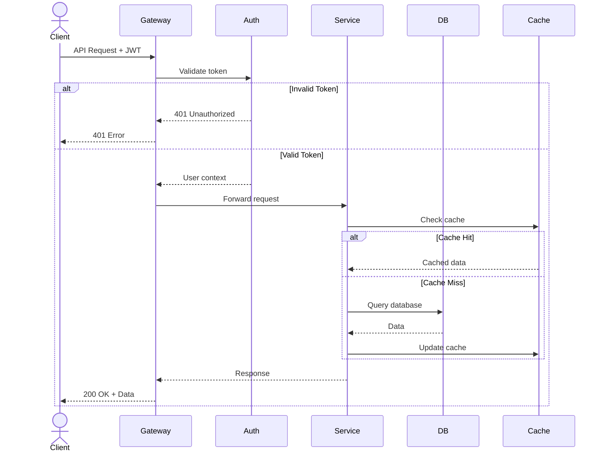
```mermaid
sequenceDiagram
    actor Client
    participant Gateway
    participant Auth
    participant Service
    participant DB
    participant Cache
    
    Client->>Gateway: API Request + JWT
    Gateway->>Auth: Validate token
    
    alt Invalid Token
        Auth-->>Gateway: 401 Unauthorized
        Gateway-->>Client: 401 Error
    else Valid Token
        Auth-->>Gateway: User context
        Gateway->>Service: Forward request
        
        Service->>Cache: Check cache
        alt Cache Hit
            Cache-->>Service: Cached data
        else Cache Miss
            Service->>DB: Query database
            DB-->>Service: Data
            Service->>Cache: Update cache
        end
        
        Service-->>Gateway: Response
        Gateway-->>Client: 200 OK + Data
    end
```

## Product Development Templates

### Template 13: Feature Development Lifecycle
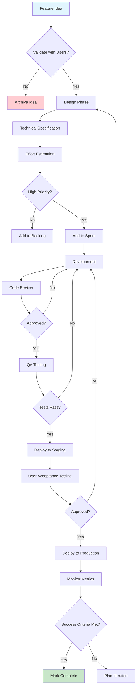
```mermaid
graph TB
    Idea[Feature Idea] --> Validate{Validate with Users?}
    Validate -->|No| Archive[Archive Idea]
    Validate -->|Yes| Design[Design Phase]
    
    Design --> TechSpec[Technical Specification]
    TechSpec --> Estimate[Effort Estimation]
    Estimate --> Prioritize{High Priority?}
    
    Prioritize -->|No| Backlog[Add to Backlog]
    Prioritize -->|Yes| Sprint[Add to Sprint]
    
    Sprint --> Develop[Development]
    Develop --> CodeReview[Code Review]
    CodeReview --> Pass1{Approved?}
    
    Pass1 -->|No| Develop
    Pass1 -->|Yes| QA[QA Testing]
    
    QA --> Pass2{Tests Pass?}
    Pass2 -->|No| Develop
    Pass2 -->|Yes| Staging[Deploy to Staging]
    
    Staging --> UAT[User Acceptance Testing]
    UAT --> Pass3{Approved?}
    
    Pass3 -->|No| Develop
    Pass3 -->|Yes| Prod[Deploy to Production]
    
    Prod --> Monitor[Monitor Metrics]
    Monitor --> Success{Success Criteria Met?}
    
    Success -->|Yes| Done[Mark Complete]
    Success -->|No| Iterate[Plan Iteration]
    Iterate --> Design
    
    style Idea fill:#e1f5fe
    style Done fill:#c8e6c9
    style Archive fill:#ffcdd2
```

### Template 14: A/B Test Flow
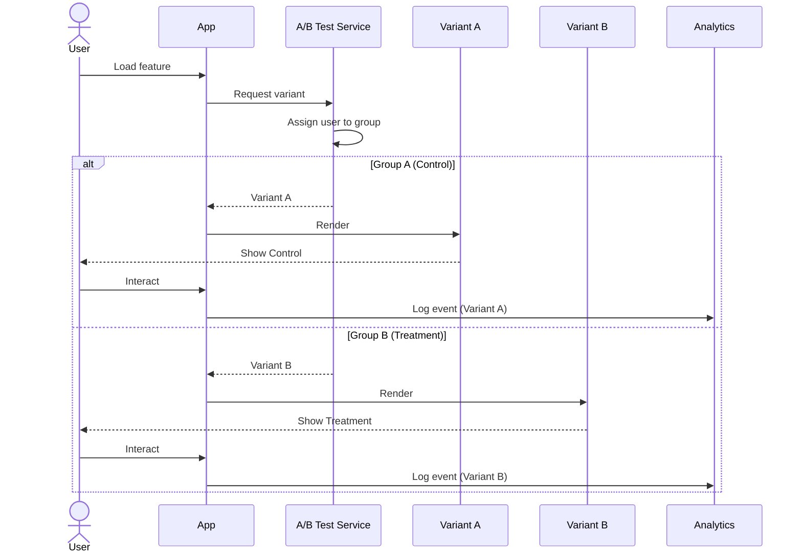
```mermaid
sequenceDiagram
    actor User
    participant App
    participant AB as A/B Test Service
    participant Variant_A as Variant A
    participant Variant_B as Variant B
    participant Analytics
    
    User->>App: Load feature
    App->>AB: Request variant
    AB->>AB: Assign user to group
    
    alt Group A (Control)
        AB-->>App: Variant A
        App->>Variant_A: Render
        Variant_A-->>User: Show Control
        User->>App: Interact
        App->>Analytics: Log event (Variant A)
    else Group B (Treatment)
        AB-->>App: Variant B
        App->>Variant_B: Render
        Variant_B-->>User: Show Treatment
        User->>App: Interact
        App->>Analytics: Log event (Variant B)
    end
```

### Template 15: Release Pipeline
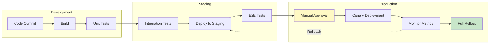
```mermaid
graph LR
    subgraph "Development"
        Code[Code Commit]
        Build[Build]
        UnitTest[Unit Tests]
    end
    
    subgraph "Staging"
        IntTest[Integration Tests]
        Deploy_Stg[Deploy to Staging]
        E2E[E2E Tests]
    end
    
    subgraph "Production"
        Manual[Manual Approval]
        Canary[Canary Deployment]
        Monitor[Monitor Metrics]
        Rollout[Full Rollout]
    end
    
    Code --> Build
    Build --> UnitTest
    UnitTest --> IntTest
    IntTest --> Deploy_Stg
    Deploy_Stg --> E2E
    E2E --> Manual
    Manual --> Canary
    Canary --> Monitor
    Monitor --> Rollout
    
    Monitor -.Rollback.-> Deploy_Stg
    
    style Manual fill:#fff9c4
    style Rollout fill:#c8e6c9
```

## Support & Customer Success Templates

### Template 16: Support Ticket Lifecycle
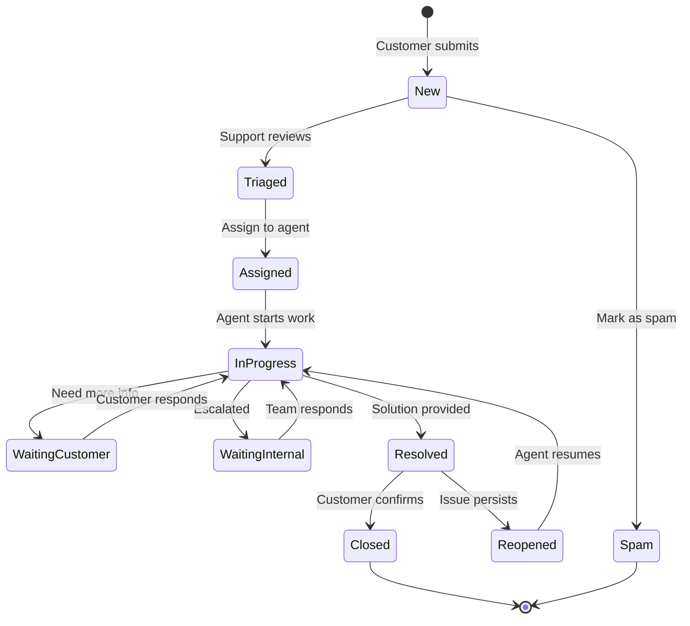
```mermaid
stateDiagram-v2
    [*] --> New: Customer submits
    
    New --> Triaged: Support reviews
    Triaged --> Assigned: Assign to agent
    
    Assigned --> InProgress: Agent starts work
    InProgress --> WaitingCustomer: Need more info
    InProgress --> WaitingInternal: Escalated
    
    WaitingCustomer --> InProgress: Customer responds
    WaitingInternal --> InProgress: Team responds
    
    InProgress --> Resolved: Solution provided
    Resolved --> Closed: Customer confirms
    Resolved --> Reopened: Issue persists
    
    Reopened --> InProgress: Agent resumes
    
    Closed --> [*]
    
    New --> Spam: Mark as spam
    Spam --> [*]
```

### Template 17: Customer Onboarding Journey
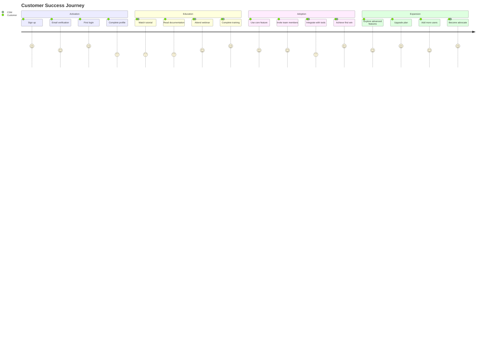
```mermaid
journey
    title Customer Success Journey
    section Activation
      Sign up: 5: Customer
      Email verification: 4: Customer
      First login: 5: Customer
      Complete profile: 3: Customer
    section Education
      Watch tutorial: 3: Customer, CSM
      Read documentation: 3: Customer
      Attend webinar: 4: Customer, CSM
      Complete training: 5: Customer, CSM
    section Adoption
      Use core feature: 4: Customer
      Invite team members: 4: Customer
      Integrate with tools: 3: Customer, CSM
      Achieve first win: 5: Customer, CSM
    section Expansion
      Explore advanced features: 4: Customer
      Upgrade plan: 5: Customer
      Add more users: 4: Customer
      Become advocate: 5: Customer, CSM
```

## Customization Guide

### How to Use These Templates

1. **Copy the template** that matches your use case
2. **Customize labels** with your specific terminology
3. **Adjust flow** to match your business logic
4. **Add/remove states** as needed
5. **Style important elements** for emphasis
6. **Test rendering** in your documentation

### Common Customizations

#### Change Colors
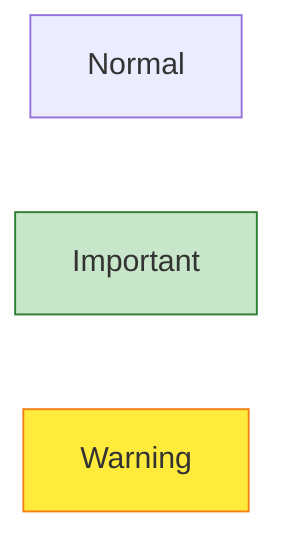
```mermaid
graph LR
    A[Normal]
    B[Important]
    C[Warning]
    style B fill:#c8e6c9,stroke:#2e7d32
    style C fill:#ffeb3b,stroke:#f57f17
```

#### Add Decision Points
Insert diamond shapes for business logic:
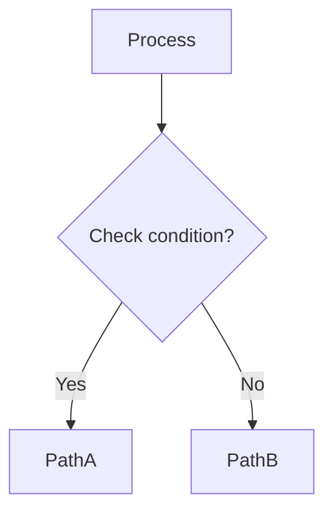
```mermaid
graph TB
    Process --> Decision{Check condition?}
    Decision -->|Yes| PathA
    Decision -->|No| PathB
```

#### Include Timing
Add notes about SLAs or timing:
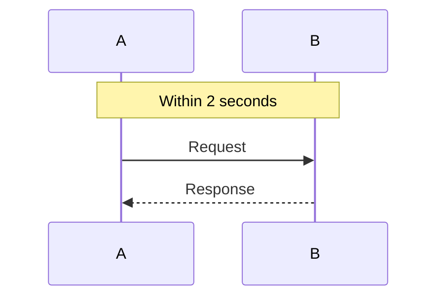
```mermaid
sequenceDiagram
    Note over A,B: Within 2 seconds
    A->>B: Request
    B-->>A: Response
```

---

For more patterns and examples, see [examples-library.md](examples-library.md)
