# Complete Mermaid Syntax Reference

This document provides comprehensive Mermaid syntax for all diagram types supported by the PRD Diagram Creator skill.

## Sequence Diagrams

### Basic Structure
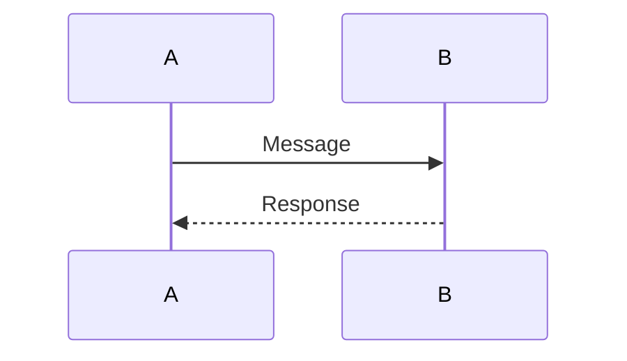

### Advanced Features

#### Actors
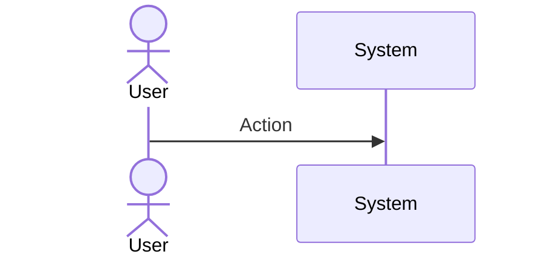

#### Message Types
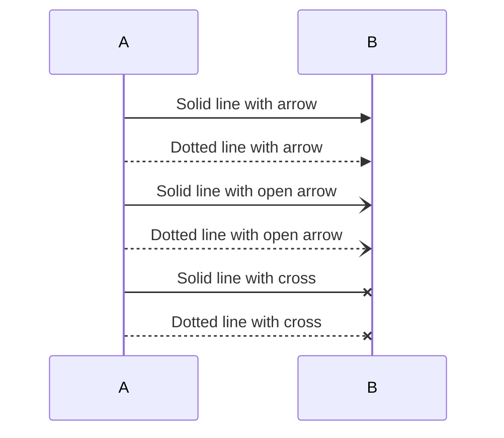

#### Activation Boxes
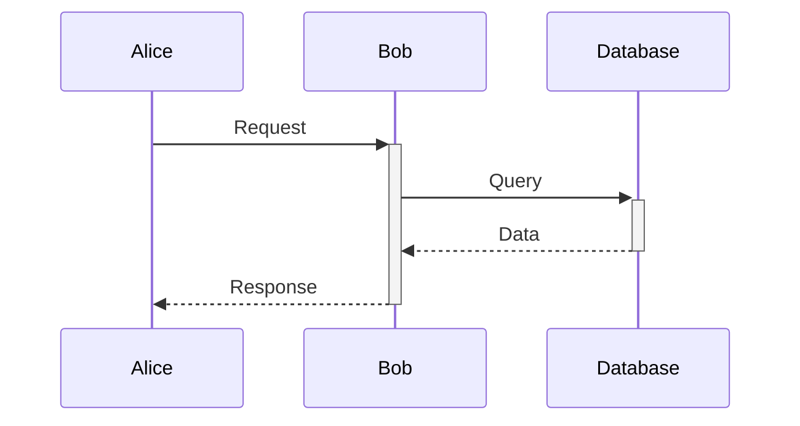

#### Notes
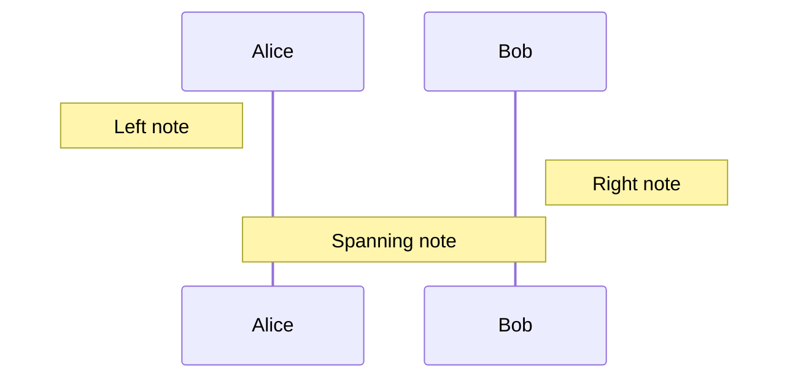

#### Loops
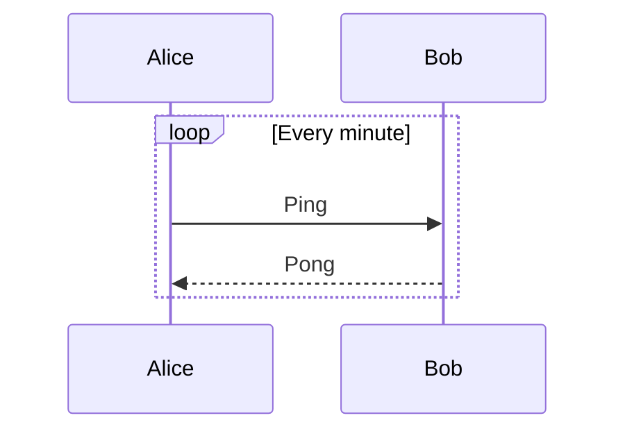

#### Alt/Else
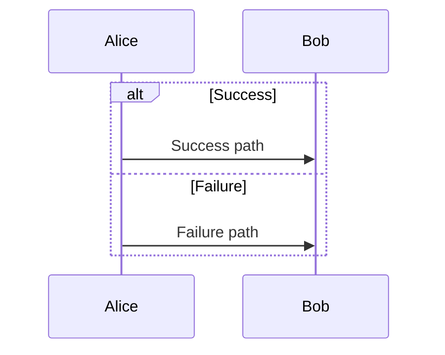

#### Optional
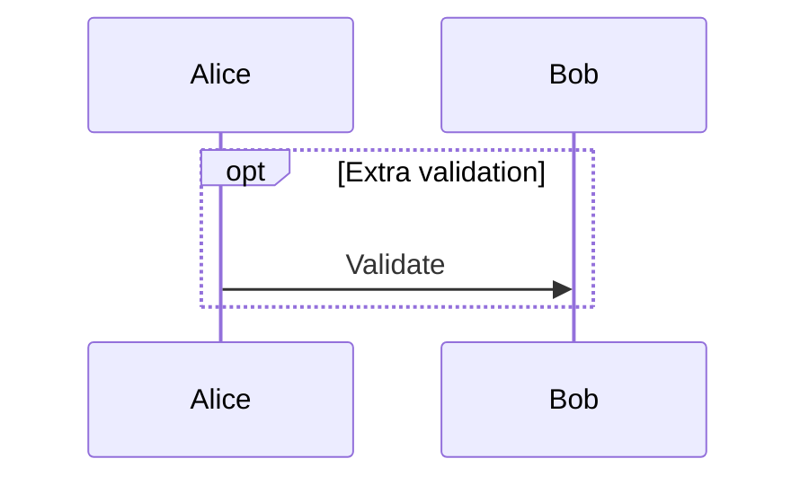

#### Parallel
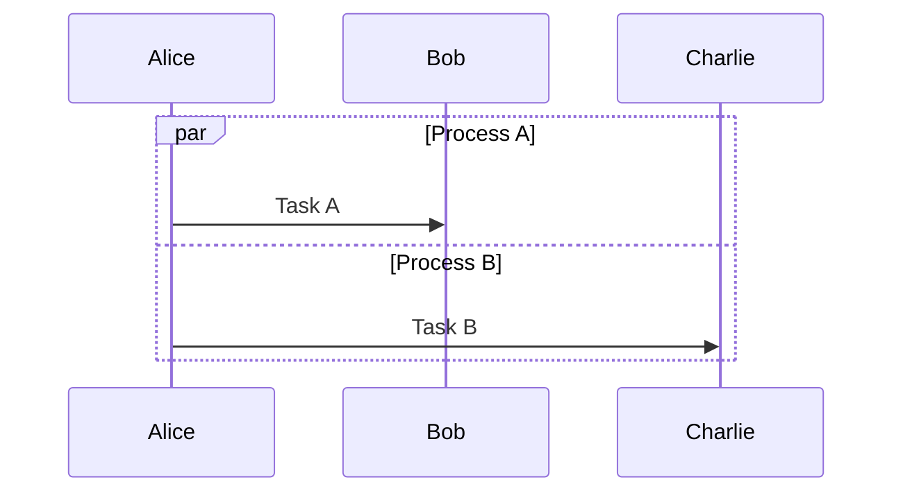

## Flowcharts

### Directions
- `graph TB` - Top to Bottom
- `graph BT` - Bottom to Top
- `graph LR` - Left to Right
- `graph RL` - Right to Left

### Node Shapes
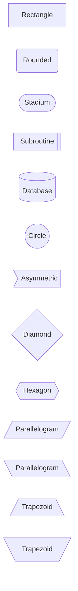

### Connections
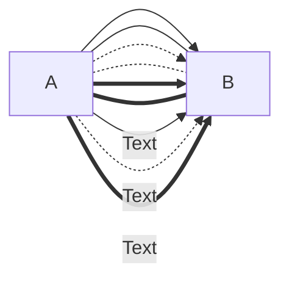

### Subgraphs
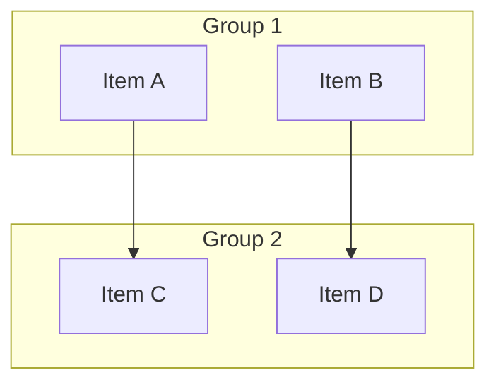

### Styling
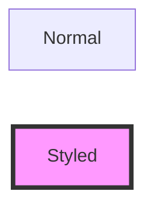

## User Journey Diagrams

### Basic Structure
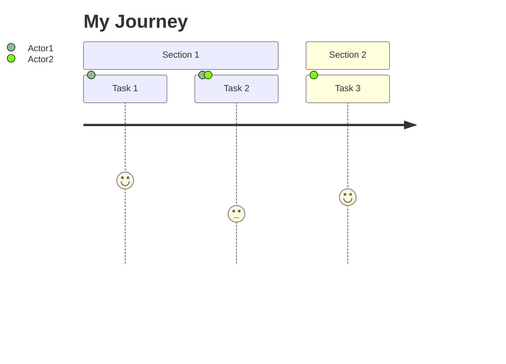

### Score Meanings
- **5**: Very satisfied
- **4**: Satisfied
- **3**: Neutral
- **2**: Dissatisfied
- **1**: Very dissatisfied

## State Diagrams

### Basic States
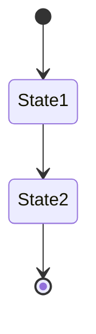

### Composite States
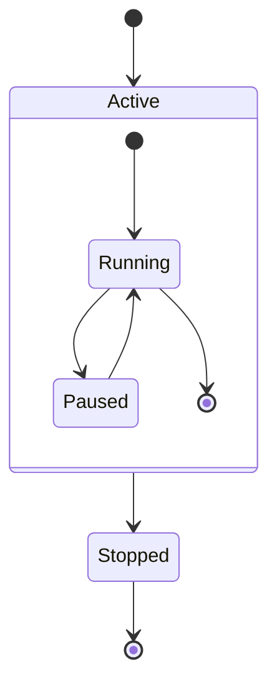

### Choice
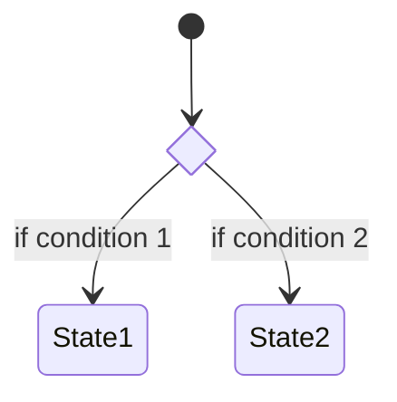

### Fork/Join
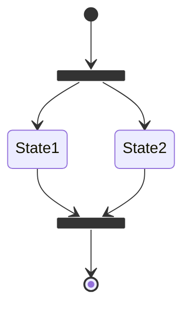

### Notes
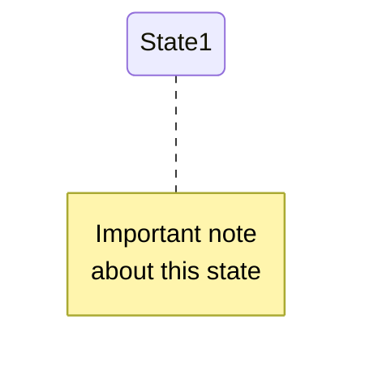

## Entity Relationship Diagrams

### Basic Structure
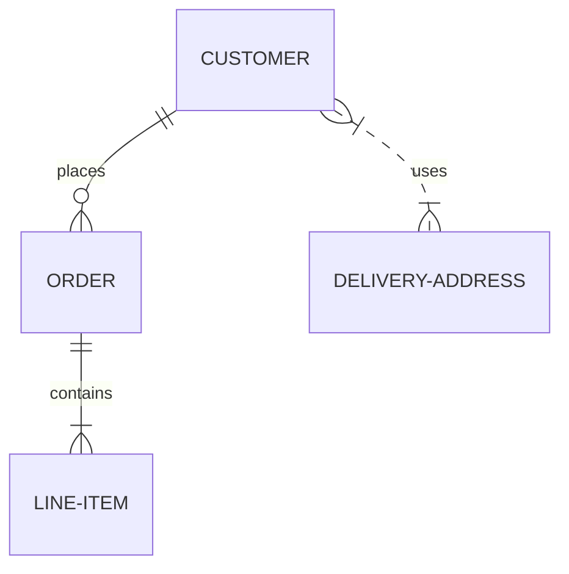

### Relationship Types
- `||--||` : One to one
- `||--o{` : One to many
- `}o--o{` : Many to many
- `||--|{` : One to one or more
- `}|..|{` : Many to many (dashed)

### Attributes
```mermaid
erDiagram
    CUSTOMER {
        string name
        int customerId PK
        string email
    }
    ORDER {
        int orderId PK
        date orderDate
        int customerId FK
    }
    CUSTOMER ||--o{ ORDER : places
```

## Class Diagrams

### Basic Structure
```mermaid
classDiagram
    class Animal {
        +String name
        +int age
        +makeSound()
    }
    class Dog {
        +String breed
        +bark()
    }
    Animal <|-- Dog
```

### Relationships
```mermaid
classDiagram
    classA <|-- classB : Inheritance
    classC *-- classD : Composition
    classE o-- classF : Aggregation
    classG <-- classH : Association
    classI -- classJ : Link
    classK <.. classL : Dependency
    classM <|.. classN : Realization
```

### Visibility
- `+` Public
- `-` Private
- `#` Protected
- `~` Package/Internal

## Gantt Charts

### Basic Structure
```mermaid
gantt
    title Project Timeline
    dateFormat YYYY-MM-DD
    section Phase 1
    Task 1           :a1, 2024-01-01, 30d
    Task 2           :after a1, 20d
    section Phase 2
    Task 3           :2024-02-01, 25d
    Task 4           :2024-02-15, 20d
```

### Task Status
```mermaid
gantt
    title Tasks
    Task 1 :done, t1, 2024-01-01, 10d
    Task 2 :active, t2, after t1, 10d
    Task 3 :crit, t3, after t2, 10d
    Task 4 :milestone, t4, after t3, 0d
```

## Pie Charts

```mermaid
pie title Distribution
    "Category A" : 45
    "Category B" : 30
    "Category C" : 25
```

## Git Graph

```mermaid
gitGraph
    commit
    branch develop
    checkout develop
    commit
    checkout main
    merge develop
    commit
```

## Styling and Theming

### Individual Element Styling
```mermaid
graph LR
    A[Element]
    style A fill:#f9f,stroke:#333,stroke-width:4px,color:#000
```

### Class-Based Styling
```mermaid
graph LR
    A:::customClass --> B
    classDef customClass fill:#f96,stroke:#333,stroke-width:2px
```

### Theme Directive
```mermaid
%%{init: {'theme':'base', 'themeVariables': { 'primaryColor':'#ff0000'}}}%%
graph TD
    A-->B
```

## Advanced Tips

### 1. Escape Special Characters
Use quotes for text with special characters:
```mermaid
graph LR
    A["Text with (special) characters"]
```

### 2. Long Text
Use `<br/>` for line breaks:
```mermaid
graph LR
    A["First line<br/>Second line"]
```

### 3. Links
```mermaid
graph LR
    A[Text]
    click A "https://example.com" "Tooltip"
```

### 4. Comments
```mermaid
graph LR
    A --> B
    %% This is a comment
```

### 5. Direction Override
```mermaid
graph LR
    subgraph "Vertical Group"
        direction TB
        A --> B
    end
```

## Common Patterns for Product Management

### Feature Development Flow
```mermaid
graph TB
    Idea[Feature Idea] --> Analysis{Feasible?}
    Analysis -->|No| Archive[Archive]
    Analysis -->|Yes| Design[Design Phase]
    Design --> Review{Approved?}
    Review -->|No| Design
    Review -->|Yes| Dev[Development]
    Dev --> QA[QA Testing]
    QA --> Pass{Tests Pass?}
    Pass -->|No| Dev
    Pass -->|Yes| Release[Release]
```

### User Feedback Loop
```mermaid
sequenceDiagram
    actor User
    participant Product
    participant Analytics
    participant PM Team
    
    User->>Product: Use feature
    Product->>Analytics: Log event
    Analytics->>PM Team: Generate insights
    PM Team->>PM Team: Analyze feedback
    PM Team->>Product: Implement improvements
    Product-->>User: Enhanced experience
```

### Sprint Planning
```mermaid
gantt
    title Sprint Timeline
    dateFormat YYYY-MM-DD
    section Planning
    Sprint Planning    :milestone, 2024-01-01, 0d
    section Development
    Feature A          :active, 2024-01-02, 5d
    Feature B          :2024-01-02, 7d
    section Testing
    QA Testing         :2024-01-09, 3d
    section Deployment
    Release            :milestone, 2024-01-12, 0d
```

---

For more examples and patterns, refer to the official Mermaid documentation at https://mermaid.js.org/
