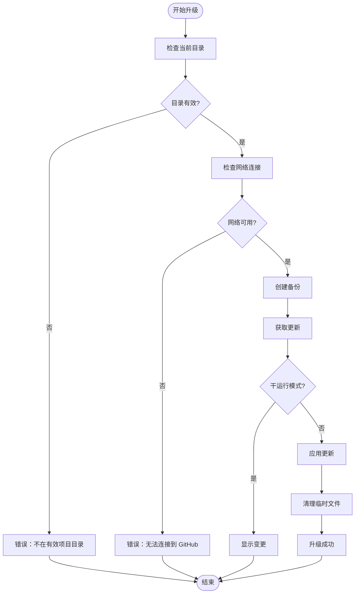
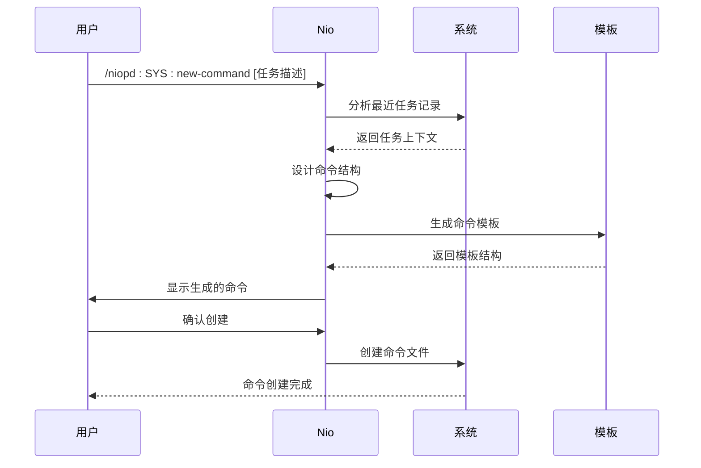
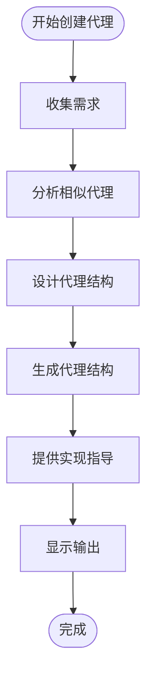
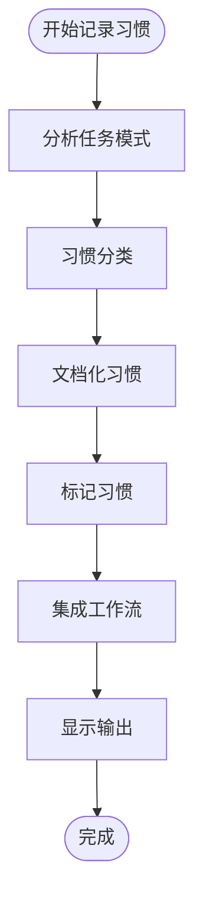
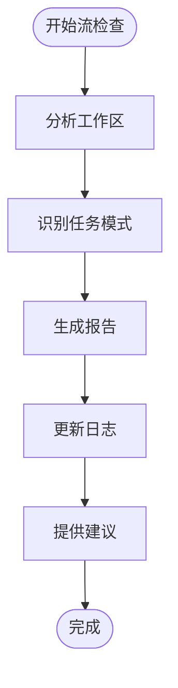

# 安装与配置

<cite>
**本文档中引用的文件**
- [README.md](file://README.md)
- [plugin.json](file://niopd/.claude-plugin/plugin.json)
- [init.md](file://niopd/commands/SYS/init.md)
- [help.md](file://niopd/commands/SYS/help.md)
- [upgrade.md](file://niopd/commands/SYS/upgrade.md)
- [new-command.md](file://niopd/commands/SYS/new-command.md)
- [new-agent.md](file://niopd/commands/SYS/new-agent.md)
- [flow-check.md](file://niopd/commands/SYS/flow-check.md)
- [new-memory.md](file://niopd/commands/SYS/new-memory.md)
- [command-template.md](file://niopd/templates/command-template.md)
- [agent-template.md](file://niopd/templates/agent-template.md)
</cite>

## 目录
1. [前置条件](#前置条件)
2. [系统要求](#系统要求)
3. [安装步骤](#安装步骤)
4. [核心配置文件](#核心配置文件)
5. [系统升级](#系统升级)
6. [自定义扩展配置](#自定义扩展配置)
7. [最佳实践](#最佳实践)
8. [故障排除](#故障排除)

## 前置条件

### Claude Code 插件系统版本要求

NioPD 要求 Claude Code 版本 0.2.0 或更高版本。这是确保插件正常运行的基础要求。

### 基本产品管理知识

虽然 NioPD 提供了强大的 AI 辅助功能，但用户仍需要具备以下基础知识：
- 产品管理的基本概念和流程
- 项目管理和文档编写的基础技能
- 对产品开发周期的理解

**节来源**
- [README.md](file://README.md#L2051-L2117)

## 系统要求

### 最低系统要求

| 组件 | 要求 |
|------|------|
| **Claude Code** | 0.2.0+ |
| **操作系统** | macOS, Linux, Windows |
| **磁盘空间** | ~50MB |
| **网络连接** | 用于文档生成和竞品分析（可选） |

### 推荐系统配置

| 组件 | 推荐配置 |
|------|----------|
| **内存** | 4GB RAM |
| **处理器** | x64 架构 |
| **存储** | 100MB+ 可用空间 |
| **网络** | 稳定的互联网连接 |

## 安装步骤

### 步骤 1：克隆或下载存储库

```bash
# 克隆 GitHub 仓库
git clone https://github.com/iflow-ai/niopd.git
cd niopd
```

### 步骤 2：打开 Claude Code

```bash
# 在项目根目录打开 Claude Code
code .
```

### 步骤 3：添加本地市场

```bash
# 添加本地插件市场
/plugin marketplace add .
```

### 步骤 4：安装插件

```bash
# 安装 NioPD 插件
/plugin install niopd@niopd-marketplace
```

### 步骤 5：验证安装

```bash
# 验证插件是否正确安装
/niopd:SYS:help
```

### 安装验证清单

- [ ] 已克隆仓库到本地
- [ ] 已在 Claude Code 中打开项目
- [ ] 已添加本地市场
- [ ] 已成功安装插件
- [ ] 已验证帮助命令可用

**节来源**
- [README.md](file://README.md#L2051-L2117)
- [init.md](file://niopd/commands/SYS/init.md#L1-L50)

## 核心配置文件

### .claude-plugin/plugin.json

这是 NioPD 插件的核心配置文件，定义了插件的基本信息和命令映射。

#### 配置文件结构

```json
{
  "name": "0niopd",
  "version": "1.0.0",
  "description": "NioPD (Nio Product Development) - A comprehensive product management toolkit...",
  "author": {
    "name": "NioPD Team",
    "email": "[email protected]",
    "url": "https://github.com/iflow-ai/niopd"
  },
  "homepage": "https://github.com/iflow-ai/niopd#readme",
  "repository": "https://github.com/iflow-ai/niopd",
  "license": "MIT",
  "keywords": ["product-management", "ai", "product-development", "pm-tools", "requirements", "roadmap"],
  "commands": ["./commands/niopd"]
}
```

#### 配置项说明

| 配置项 | 类型 | 说明 | 示例值 |
|--------|------|------|--------|
| `name` | String | 插件名称 | `"0niopd"` |
| `version` | String | 插件版本 | `"1.0.0"` |
| `description` | String | 插件功能描述 | 详细的产品管理工具包说明 |
| `author.name` | String | 作者名称 | `"NioPD Team"` |
| `author.email` | String | 作者邮箱 | `"[email protected]"` |
| `homepage` | String | 项目主页 URL | `"https://github.com/iflow-ai/niopd#readme"` |
| `repository` | String | 代码仓库地址 | `"https://github.com/iflow-ai/niopd"` |
| `license` | String | 许可证类型 | `"MIT"` |
| `keywords` | Array | 关键词标签 | `["product-management", "ai", ...]` |
| `commands` | Array | 命令路径配置 | `["./commands/niopd"]` |

### 工作区初始化

安装完成后，需要初始化 NioPD 工作区：

```bash
/niopd:SYS:init
```

#### 初始化创建的目录结构

```
niopd-workspace/
├── sources/       # 思考源材料层（BS + DT 指令输出）
├── reports/       # 数据分析报告层（UR + MR + ST 指令输出）
├── docs/          # 决策文档层（PD + PO 指令输出）
└── plans/         # 执行计划层（PM 指令输出）
```

**节来源**
- [plugin.json](file://niopd/.claude-plugin/plugin.json#L1-L15)
- [init.md](file://niopd/commands/SYS/init.md#L1-L195)

## 系统升级

### 使用 /niopd:SYS:upgrade 进行系统升级

NioPD 提供了便捷的升级机制，可以通过以下命令进行系统升级：

```bash
/niopd:SYS:upgrade
```

#### 升级流程详解



**图表来源**
- [upgrade.md](file://niopd/commands/SYS/upgrade.md#L1-L87)

#### 升级参数选项

| 参数 | 说明 | 示例 |
|------|------|------|
| `--component=<component_name>` | 升级指定组件 | `--component=MR` |
| `--force` | 强制应用升级（即使有冲突） | `--force` |
| `--dry-run` | 显示升级内容而不实际应用 | `--dry-run` |

#### 升级前检查清单

1. **目录检查**
   - 确认当前目录包含 `niopd` 目录
   - 验证 `niopd/commands/` 子目录存在

2. **网络检查**
   - 验证互联网连接
   - 确认 GitHub 可访问

3. **备份检查**
   - 创建时间戳备份目录
   - 备份关键配置文件

#### 升级后验证

```bash
# 验证升级是否成功
/niopd:SYS:help
```

**节来源**
- [upgrade.md](file://niopd/commands/SYS/upgrade.md#L1-L87)

## 自定义扩展配置

### 使用 /niopd:SYS:new-command 创建自定义指令

当您发现重复性任务时，可以使用此命令创建自定义指令来提高效率。

#### 创建自定义命令的流程



**图表来源**
- [new-command.md](file://niopd/commands/SYS/new-command.md#L1-L96)

#### 命令模板结构

```yaml
---
allowed-tools: Bash(git add:*), Bash(git status:*), Read(*), Write(*)
argument-hint: [任务描述] | 基于上下文创建新命令
description: 基于重复任务创建自定义命令
model: Qwen3-Coder
---

# 命令: /niopd:user-[命令名称]

简要描述命令功能。

## 用法
`/niopd:user-[命令名称] [参数]`

## 预检清单
- 执行命令前的验证步骤

## 指令

1. 第一步：详细说明
2. 第二步：详细说明
3. ...

## 错误处理
- 各种错误情况的处理指导
```

**节来源**
- [new-command.md](file://niopd/commands/SYS/new-command.md#L1-L96)
- [command-template.md](file://niopd/templates/command-template.md#L1-L27)

### 使用 /niopd:SYS:new-agent 创建专用 AI 代理

对于需要专业知识的复杂任务，可以创建专门的 AI 代理来处理特定领域的工作。

#### 代理创建流程



**图表来源**
- [new-agent.md](file://niopd/commands/SYS/new-agent.md#L1-L85)

#### 代理模板结构

```yaml
---
name: niopd-[代理名称]
description: 代理功能简要描述
tools: [允许使用的工具列表]
model: inherit
color: blue
---

# 代理: [代理名称]

## 角色
代理的主要职责和专长领域。

## 输入
- 数据类型
- 格式要求
- 特殊参数

## 处理流程
1. **第一步**：详细处理步骤
2. **第二步**：详细处理步骤
3. ...

## 输出格式
Markdown 报告结构。

## 错误处理
- 缺失输入的处理
- 无效数据的处理
- 处理错误的处理
```

**节来源**
- [new-agent.md](file://niopd/commands/SYS/new-agent.md#L1-L85)
- [agent-template.md](file://niopd/templates/agent-template.md#L1-L73)

### 使用 /niopd:SYS:new-memory 记录个人工作习惯

此功能帮助 Nio 学习您的工作习惯，提供更加个性化的辅助体验。

#### 习惯记录流程



**图表来源**
- [new-memory.md](file://niopd/commands/SYS/new-memory.md#L1-L92)

#### 习惯分类

| 分类 | 说明 | 示例 |
|------|------|------|
| **效率模式** | 节省时间的方法 | 快速创建 PRD 模板 |
| **质量实践** | 提升输出质量的方法 | 结构化分析报告 |
| **工作流偏好** | 偏好的工作方式 | 先分析后决策 |
| **决策框架** | 个人决策方法 | 基于数据的决策 |

**节来源**
- [new-memory.md](file://niopd/commands/SYS/new-memory.md#L1-L92)

### 使用 /niopd:SYS:flow-check 检查组织改进建议

定期运行此命令来发现系统改进机会和自动化潜力。

#### 流检查功能



**图表来源**
- [flow-check.md](file://niopd/commands/SYS/flow-check.md#L1-L118)

**节来源**
- [flow-check.md](file://niopd/commands/SYS/flow-check.md#L1-L118)

## 最佳实践

### 1. 定期系统维护

- **每周**：运行 `/niopd:SYS:flow-check` 检查改进机会
- **每月**：运行 `/niopd:SYS:upgrade` 获取最新功能
- **每次**：初始化新项目时使用 `/niopd:SYS:init`

### 2. 工作区组织

- 使用标准化的目录结构
- 遵循文件命名约定：`[YYYYMMDD]-<标识符>-<文档类型>-v[版本].md`
- 定期备份重要文档

### 3. 自定义扩展策略

- 优先创建解决重复任务的命令
- 为专业领域创建专用代理
- 记录个人工作习惯以提升效率

### 4. 版本控制

- 将 `niopd-workspace/` 目录纳入版本控制
- 使用 Git 管理文档版本
- 定期提交重要的工作成果

## 故障排除

### 常见安装问题

#### 问题：插件安装失败

**症状**：`/plugin install niopd@niopd-marketplace` 失败

**解决方案**：
1. 确认已添加本地市场：`/plugin marketplace add .`
2. 检查网络连接
3. 重新克隆仓库并重试

#### 问题：/niopd:SYS:init 无法创建目录

**症状**：初始化命令失败

**解决方案**：
1. 检查当前目录权限
2. 确认磁盘空间充足
3. 使用管理员权限运行

#### 问题：/niopd:SYS:upgrade 失败

**症状**：升级过程中断

**解决方案**：
1. 检查网络连接
2. 创建手动备份
3. 手动从 GitHub 下载最新版本

### 配置问题诊断

#### 检查插件状态

```bash
# 查看插件列表
/plugin list

# 检查插件详情
/plugin info niopd
```

#### 验证配置文件

```bash
# 检查 plugin.json 是否存在
ls -la .claude-plugin/

# 验证配置文件语法
cat .claude-plugin/plugin.json
```

### 性能优化

#### 网络连接优化

- 确保稳定的互联网连接
- 配置代理服务器（如需要）
- 使用 CDN 加速资源加载

#### 本地缓存

- 定期清理临时文件
- 优化磁盘空间使用
- 压缩历史文档

**节来源**
- [help.md](file://niopd/commands/SYS/help.md#L1-L148)