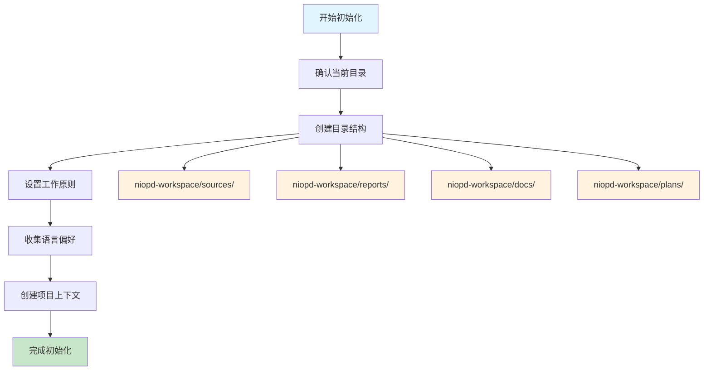

# NioPD 安装指南

<cite>
**本文档中引用的文件**
- [README.md](file://README.md)
- [plugin.json](file://niopd/.claude-plugin/plugin.json)
- [init.md](file://niopd/commands/SYS/init.md)
- [help.md](file://niopd/commands/SYS/help.md)
- [upgrade.md](file://niopd/commands/SYS/upgrade.md)
- [command-template.md](file://niopd/templates/command-template.md)
- [agent-template.md](file://niopd/templates/agent-template.md)
</cite>

## 目录
1. [前置条件检查](#前置条件检查)
2. [仓库克隆步骤](#仓库克隆步骤)
3. [插件注册流程](#插件注册流程)
4. [工作区初始化](#工作区初始化)
5. [验证安装](#验证安装)
6. [常见问题解决](#常见问题解决)
7. [升级和卸载](#升级和卸载)

## 前置条件检查

在开始安装之前，请确保您的环境满足以下要求：

### 系统要求

| 组件 | 最低版本 | 推荐版本 | 说明 |
|------|----------|----------|------|
| **Claude Code** | 0.2.0+ | 最新稳定版 | 必须安装并运行 |
| **操作系统** | macOS/Linux/Windows | 最新版本 | 支持主流平台 |
| **Git** | 2.0+ | 最新版本 | 用于克隆仓库 |
| **网络连接** | 可访问GitHub | 稳定连接 | 用于下载和升级 |

### Claude Code 版本兼容性检查

```bash
# 检查 Claude Code 版本
claude --version
# 或在 Claude Code 中：
/plugin marketplace list
```

**预期输出：**
```
Claude Code v0.2.0 或更高版本
```

### 基础环境验证

```bash
# 验证 Git 是否安装
git --version

# 验证 Claude Code 是否可访问
which code  # macOS/Linux
where code  # Windows
```

**节源**
- [README.md](file://README.md#L1899-L1914)

## 仓库克隆步骤

NioPD 提供两种克隆方式：HTTPS 和 SSH。选择最适合您环境的方式。

### HTTPS 克隆方式

这是最简单的方式，无需配置 SSH 密钥。

```bash
# 克隆主仓库
git clone https://github.com/iflow-ai/niopd.git

# 进入项目目录
cd niopd
```

**预期输出：**
```
Cloning into 'niopd'...
remote: Enumerating objects: 12345, done.
remote: Counting objects: 100% (12345/12345), done.
remote: Compressing objects: 100% (4567/4567), done.
remote: Total 12345 (delta 7890), reused 12345 (delta 7890), pack-reused 0
Receiving objects: 100% (12345/12345), 123.45 MiB | 12.34 MiB/s, done.
Resolving deltas: 100% (7890/7890), done.
```

### SSH 克隆方式（推荐）

如果您经常使用 GitHub，建议使用 SSH 方式。

```bash
# 检查 SSH 密钥是否存在
ls ~/.ssh/

# 如果没有密钥，生成新的 SSH 密钥
ssh-keygen -t ed25519 -C "your_email@example.com"
# 或使用 RSA 密钥
ssh-keygen -t rsa -b 4096 -C "your_email@example.com"
```

**添加公钥到 GitHub：**
1. 复制公钥内容：
```bash
cat ~/.ssh/id_ed25519.pub
```
2. 登录 GitHub，进入 Settings > SSH and GPG keys
3. 点击 New SSH key，粘贴公钥内容

```bash
# 使用 SSH 克隆
git clone git@github.com:iflow-ai/niopd.git
cd niopd
```

**节源**
- [README.md](file://README.md#L1915-L1930)

## 插件注册流程

在 Claude Code 中注册 NioPD 插件需要几个关键步骤。

### 打开 Claude Code

```bash
# 在项目目录中打开 Claude Code
code .
```

### 添加本地市场

```bash
# 添加本地市场源
/plugin marketplace add .
```

**预期输出：**
```
Added marketplace source: .
```

### 安装插件

```bash
# 安装 NioPD 插件
/plugin install niopd@niopd-marketplace
```

**安装过程说明：**
- Claude Code 将扫描本地市场源
- 验证插件配置文件
- 下载必要的资源文件
- 注册插件到系统中

**预期输出：**
```
Installing plugin: niopd@niopd-marketplace
✓ Plugin installed successfully
✓ Dependencies resolved
✓ Plugin activated
```

### 验证插件安装

```bash
# 检查插件状态
/plugin list
```

**预期输出包含：**
```
niopd@niopd-marketplace ✓ Active
```

**节源**
- [README.md](file://README.md#L1931-L1950)
- [plugin.json](file://niopd/.claude-plugin/plugin.json#L1-L15)

## 工作区初始化

工作区初始化是使用 NioPD 的第一步，它创建必要的目录结构和配置文件。

### 执行初始化命令

```bash
# 在 Claude Code 中执行初始化
/niopd:SYS:init
```

### 初始化流程详解

初始化过程分为以下步骤：



**图表源**
- [init.md](file://niopd/commands/SYS/init.md#L1-L50)

### 目录结构说明

初始化完成后，您将看到以下目录结构：

| 目录 | 用途 | 包含内容 |
|------|------|----------|
| `niopd-workspace/sources/` | 思考源材料 | 头脑风暴、深度思考记录 |
| `niopd-workspace/reports/` | 分析报告 | 用户研究、市场分析、战略分析 |
| `niopd-workspace/docs/` | 产品文档 | MRD、PRD、PSD、FAQ |
| `niopd-workspace/plans/` | 执行计划 | 项目计划、发布计划、路线图 |

### 初始化参数收集

在初始化过程中，Nio 会收集以下信息：

1. **首选通信语言**：确定 Nio 使用的语言
2. **项目背景信息**：帮助 Nio 理解您的工作环境
3. **工作原则**：建立团队协作规范

**节源**
- [init.md](file://niopd/commands/SYS/init.md#L20-L195)

## 验证安装

安装完成后，需要验证所有组件是否正常工作。

### 基础功能验证

```bash
# 显示帮助信息
/niopd:SYS:help
```

**验证内容：**
- 命令列表正确显示
- 语法高亮正常
- 帮助信息格式正确

### 工作区验证

```bash
# 检查目录结构
ls -la niopd-workspace/
```

**预期输出：**
```
drwxr-xr-x  4 user  group   128 Oct 30 10:00 sources/
drwxr-xr-x  4 user  group   128 Oct 30 10:00 reports/
drwxr-xr-x  4 user  group   128 Oct 30 10:00 docs/
drwxr-xr-x  4 user  group   128 Oct 30 10:00 plans/
```

### 功能性测试

```bash
# 测试初始化功能
/niopd:SYS:init

# 测试帮助功能
/niopd:SYS:help
```

### 检查清单

完成安装后，请确认以下项目：

✅ **Claude Code 插件状态**
- [ ] 插件已成功安装
- [ ] 插件状态显示为 "Active"
- [ ] 插件版本匹配要求

✅ **目录结构完整性**
- [ ] `niopd-workspace/` 目录存在
- [ ] 四个子目录全部创建
- [ ] 目录权限正确

✅ **功能可用性**
- [ ] `/niopd:SYS:init` 命令正常响应
- [ ] `/niopd:SYS:help` 显示完整帮助
- [ ] 无错误提示或警告

**节源**
- [help.md](file://niopd/commands/SYS/help.md#L1-L50)

## 常见问题解决

### 安装相关问题

#### 问题 1：插件无法安装

**症状：**
```
Error: Plugin not found in marketplace
```

**解决方案：**
1. 确认本地市场已添加：
```bash
/plugin marketplace list
```
2. 检查当前目录是否正确：
```bash
pwd
ls -la
```
3. 重新添加本地市场：
```bash
/plugin marketplace add .
/plugin install niopd@niopd-marketplace
```

#### 问题 2：初始化失败

**症状：**
```
Error: Permission denied creating directory
```

**解决方案：**
1. 检查目录权限：
```bash
ls -la
```
2. 修改权限或切换到可写目录：
```bash
chmod 755 .
```

#### 问题 3：网络连接问题

**症状：**
```
Error: Unable to connect to GitHub
```

**解决方案：**
1. 检查网络连接
2. 配置代理（如果需要）
3. 使用 HTTPS 克隆代替 SSH

### 运行时问题

#### 问题 4：命令无响应

**症状：**
```
Command executed but no output
```

**解决方案：**
1. 检查 Claude Code 日志
2. 重启 Claude Code
3. 验证插件状态：
```bash
/plugin list
```

#### 问题 5：文档生成错误

**症状：**
```
Error: Failed to generate document
```

**解决方案：**
1. 检查 API 密钥配置
2. 验证网络连接
3. 检查磁盘空间

**节源**
- [upgrade.md](file://niopd/commands/SYS/upgrade.md#L1-L30)

## 升级和卸载

### 升级 NioPD

定期升级可以获取新功能和修复。

```bash
# 升级整个 NioPD 系统
/niopd:SYS:upgrade

# 升级特定组件（可选）
/niopd:SYS:upgrade --component=commands

# 干运行模式（查看将要升级的内容）
/niopd:SYS:upgrade --dry-run

# 强制升级（即使有冲突）
/niopd:SYS:upgrade --force
```

**升级过程说明：**
1. 创建备份目录
2. 检查远程版本
3. 下载更新文件
4. 应用更新
5. 清理临时文件

### 卸载 NioPD

```bash
# 卸载插件
/plugin uninstall niopd

# 删除工作区（可选）
rm -rf niopd-workspace/
```

### 手动升级步骤

如果自动升级失败，可以手动升级：

```bash
# 备份当前安装
cp -r niopd niopd-backup-$(date +%Y%m%d)

# 重新克隆最新版本
git pull origin main

# 重新安装
/plugin install niopd@niopd-marketplace
```

**节源**
- [upgrade.md](file://niopd/commands/SYS/upgrade.md#L30-L87)

## 总结

完成以上步骤后，您已经成功安装并配置了 NioPD 插件。现在您可以：

1. **开始使用**：尝试基本命令如 `/niopd:SYS:help`
2. **创建工作区**：运行 `/niopd:SYS:init`
3. **探索功能**：浏览不同领域的命令集合
4. **持续学习**：参考 README.md 获取更多信息

**下一步建议：**
- 阅读 [README.md](file://README.md) 获取完整功能说明
- 尝试第一个项目：`/niopd:BS:new-initiative "我的第一个项目"`
- 加入社区讨论获取支持