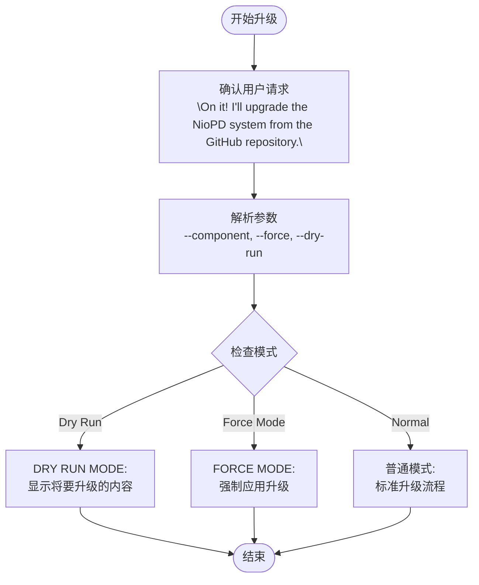
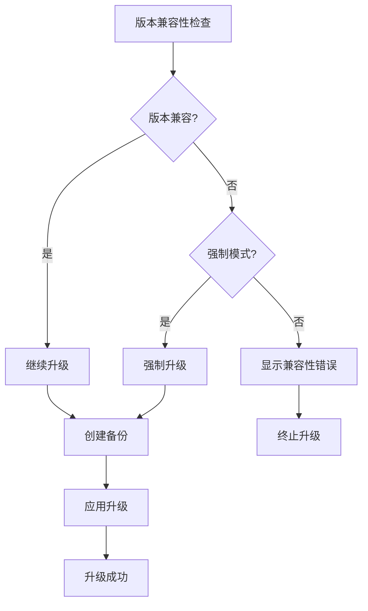
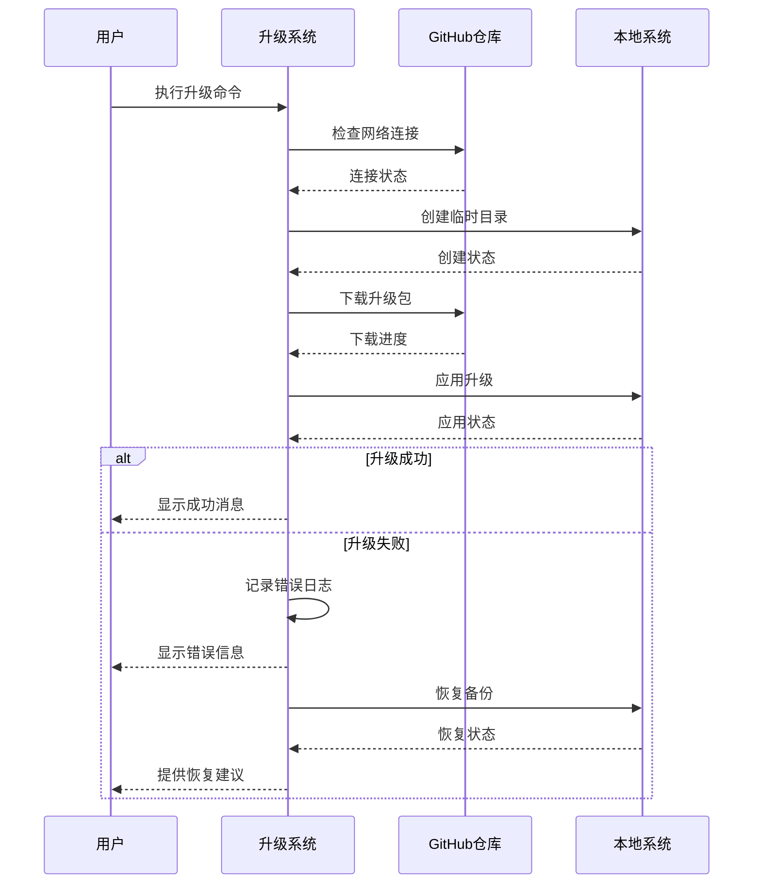
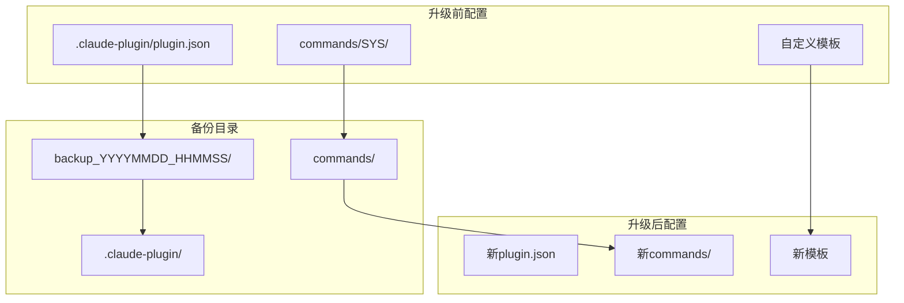

# NioPD系统升级流程详细指南

<cite>
**本文档中引用的文件**
- [upgrade.md](file://niopd/commands/SYS/upgrade.md)
- [plugin.json](file://niopd/.claude-plugin/plugin.json)
- [init.md](file://niopd/commands/SYS/init.md)
- [help.md](file://niopd/commands/SYS/help.md)
- [README.md](file://README.md)
</cite>

## 目录
1. [概述](#概述)
2. [升级前准备工作](#升级前准备工作)
3. [完整升级步骤](#完整升级步骤)
4. [版本兼容性检查](#版本兼容性检查)
5. [升级失败处理](#升级失败处理)
6. [版本变更日志](#版本变更日志)
7. [配置文件迁移](#配置文件迁移)
8. [升级示例会话](#升级示例会话)
9. [回滚方案](#回滚方案)
10. [故障排除指南](#故障排除指南)

## 概述

NioPD系统提供了强大的升级功能，允许用户从GitHub仓库获取最新版本并无缝升级到新版本。升级系统采用安全的备份机制，确保在升级过程中不会丢失重要数据，并提供多种参数选项以满足不同的升级需求。

### 升级命令语法

```bash
/niopd:SYS:upgrade [--component=<component_name>] [--force] [--dry-run]
```

### 升级特性

- **组件级升级**：可选择升级特定组件而非整个系统
- **强制模式**：即使存在冲突也强制应用升级
- **预览模式**：仅显示将要升级的内容而不实际执行
- **自动备份**：升级前自动创建时间戳备份
- **互联网连接检查**：确保网络连接正常

## 升级前准备工作

### 系统环境检查

在执行升级之前，系统会自动执行以下检查：

#### 1. 当前目录验证
- 确认当前工作目录包含`niopd`目录
- 验证`niopd/commands/`子目录存在
- 如果不符合要求，返回错误信息："❌ Error: This command must be run from the root of a project that contains the `niopd` directory."

#### 2. 网络连接检查
- 验证与GitHub的网络连接
- 如果无法连接，返回错误信息："❌ Error: No internet connection or GitHub is unreachable."

### 当前系统状态确认

升级过程中会显示以下系统信息：
- 当前NioPD版本（从`.claude-plugin/marketplace.json`读取）
- 已安装的组件列表
- 系统配置状态

**章节来源**
- [upgrade.md](file://niopd/commands/SYS/upgrade.md#L15-L25)

## 完整升级步骤

### 步骤1：确认和准备

系统首先确认用户请求并解析参数：



**图表来源**
- [upgrade.md](file://niopd/commands/SYS/upgrade.md#L30-L35)

### 步骤2：检查当前安装

系统会：
1. 读取`.claude-plugin/marketplace.json`文件确定当前版本
2. 列出`niopd/commands/`目录下的所有组件
3. 显示当前版本和已安装组件列表

### 步骤3：获取升级包

系统显示消息："Fetching upgrades from the GitHub repository..."

- **预览模式**：显示将要升级的内容但不执行
- **强制模式**：即使存在冲突也继续升级

### 步骤4：创建备份

系统自动创建时间戳格式的备份目录：

```bash
backup_YYYYMMDD_HHMMSS/
```

备份内容包括：
- `.claude-plugin/marketplace.json`（如果存在）
- 完整的`niopd/commands/`目录

显示消息："Creating backup in `backup_YYYYMMDD_HHMMSS`"

### 步骤5：应用升级

#### 组件级升级
```bash
/niopd:SYS:upgrade --component=PD
```
- 只升级指定的组件目录
- 显示消息："Updating specific component: PD"

#### 全系统升级
```bash
/niopd:SYS:upgrade
```
- 升级所有命令目录
- 显示消息："Updating full NioPD installation"

#### 预览模式
```bash
/niopd:SYS:upgrade --dry-run
```
- 显示将要升级的内容
- 不执行任何更改

### 步骤6：确认和总结

升级完成后显示：
- 当前版本信息
- 升级目标（组件或全系统）
- 模式状态（强制/预览/正常）
- 备份位置
- 重启提示

**章节来源**
- [upgrade.md](file://niopd/commands/SYS/upgrade.md#L38-L79)

## 版本兼容性检查

### 自动版本检测

升级系统会自动检测以下版本信息：

| 检测项目 | 检查位置 | 作用 |
|----------|----------|------|
| 当前版本 | `.claude-plugin/marketplace.json` | 确定升级基线 |
| 组件版本 | `niopd/commands/*/` | 组件级兼容性 |
| 插件版本 | `plugin.json` | 整体系统版本 |

### 兼容性处理机制



**图表来源**
- [upgrade.md](file://niopd/commands/SYS/upgrade.md#L44-L52)

### 版本比较逻辑

系统会：
1. 解析本地版本号
2. 从GitHub获取最新版本
3. 比较版本号
4. 根据比较结果决定是否允许升级

**章节来源**
- [upgrade.md](file://niopd/commands/SYS/upgrade.md#L40-L42)

## 升级失败处理

### 常见失败原因

#### 1. 网络连接问题
- **症状**：无法连接到GitHub
- **原因**：防火墙、网络中断、DNS问题
- **解决方案**：检查网络连接，配置代理设置

#### 2. 磁盘空间不足
- **症状**：临时目录创建失败
- **原因**：磁盘空间不够
- **解决方案**：清理磁盘空间或增加存储容量

#### 3. 权限问题
- **症状**：无法写入目标目录
- **原因**：文件权限不足
- **解决方案**：检查目录权限，使用管理员权限

#### 4. 组件冲突
- **症状**：组件文件被占用
- **原因**：其他程序正在使用相关文件
- **解决方案**：关闭相关程序，重新尝试

### 错误处理流程



**图表来源**
- [upgrade.md](file://niopd/commands/SYS/upgrade.md#L81-L86)

### 失败后的恢复策略

1. **自动恢复**：系统自动尝试从备份恢复
2. **手动恢复**：指导用户手动恢复备份
3. **重新下载**：重新从GitHub下载最新版本
4. **降级处理**：必要时降级到稳定版本

**章节来源**
- [upgrade.md](file://niopd/commands/SYS/upgrade.md#L79-L86)

## 版本变更日志

### 查看变更日志的方法

#### 1. GitHub仓库查看
```bash
# 访问官方仓库
https://github.com/iflow-ai/niopd/releases
```

#### 2. 本地版本信息
系统会在升级完成后显示版本信息：
```bash
Current version: 1.0.0
Upgrading to: 1.1.0
```

#### 3. 变更日志文件
每次升级都会在备份目录中保留变更日志：
```bash
backup_YYYYMMDD_HHMMSS/changelog.txt
```

### 版本发布周期

| 发布类型 | 更新频率 | 内容范围 |
|----------|----------|----------|
| 主版本 | 每季度 | 重大功能新增、架构调整 |
| 次版本 | 每月 | 新功能、性能优化 |
| 修订版本 | 每周 | Bug修复、小功能调整 |

### 版本兼容性矩阵

| 当前版本 | 支持的升级路径 | 注意事项 |
|----------|----------------|----------|
| 1.0.x | 1.1.x | 包含新功能 |
| 1.1.x | 1.2.x | 可能有破坏性变更 |
| 1.2.x | 2.0.x | 需要特殊处理 |

**章节来源**
- [README.md](file://README.md#L1-L50)

## 配置文件迁移

### 迁移注意事项

#### 1. 配置文件备份
升级前自动备份以下配置文件：
- `.claude-plugin/plugin.json`
- `niopd/commands/SYS/`下的配置文件
- 用户自定义的模板文件

#### 2. 配置文件位置



**图表来源**
- [upgrade.md](file://niopd/commands/SYS/upgrade.md#L44-L48)

#### 3. 迁移检查清单

| 检查项目 | 升级前 | 升级后 | 注意事项 |
|----------|--------|--------|----------|
| 插件配置 | ✓ | ✓ | 自动迁移 |
| 命令配置 | ✓ | ✓ | 部分迁移 |
| 用户设置 | ✓ | ✓ | 需要手动检查 |
| 自定义模板 | ✓ | ✓ | 需要重新应用 |

#### 4. 配置文件迁移流程

```bash
# 1. 创建备份
cp .claude-plugin/plugin.json backup_YYYYMMDD_HHMMSS/plugin.json

# 2. 备份命令目录
cp -r niopd/commands/ backup_YYYYMMDD_HHMMSS/commands/

# 3. 应用新版本
git clone https://github.com/iflow-ai/niopd.git temp_upgrade
cp -r temp_upgrade/niopd/commands/* niopd/commands/

# 4. 清理临时文件
rm -rf temp_upgrade
```

**章节来源**
- [upgrade.md](file://niopd/commands/SYS/upgrade.md#L44-L52)

## 升级示例会话

### 完整升级会话示例

```bash
# 用户输入
/niopd:SYS:upgrade

# 系统响应
On it! I'll upgrade the NioPD system from the GitHub repository.

Checking current directory...
✓ Directory verification passed: Contains niopd/commands/ directory

Checking internet connectivity...
✓ Connected to GitHub successfully

Determining current NioPD version...
✓ Current version: 1.0.0
✓ Installed components: BS, DT, MR, UR, ST, PD, PM, PO, SYS

Fetching upgrades from the GitHub repository...
✓ Latest version available: 1.1.0

Creating backup in backup_20241201_143022...
✓ Backup created successfully

Updating full NioPD installation...
✓ Cloning repository to temporary directory
✓ Copying new files
✓ Cleaning up temporary files

✅ Upgrade completed successfully. Please restart Claude Code to apply the changes.

For manual upgrades, you can also:
1. Visit https://github.com/iflow-ai/niopd
2. Download the latest release
3. Extract to your plugin directory
4. Restart Claude Code

Note: If you encounter any issues after upgrading, you can restore from the backup directory: backup_20241201_143022
```

### 组件级升级示例

```bash
# 用户输入
/niopd:SYS:upgrade --component=PD

# 系统响应
On it! I'll upgrade the NioPD system from the GitHub repository.

Checking current directory...
✓ Directory verification passed

Checking internet connectivity...
✓ Connected to GitHub successfully

Determining current NioPD version...
✓ Current version: 1.0.0

Fetching upgrades from the GitHub repository...
✓ Latest version available: 1.1.0

Creating backup in backup_20241201_143545...
✓ Backup created successfully

Updating specific component: PD
✓ Component PD upgraded successfully

✅ Upgrade completed successfully. Please restart Claude Code to apply the changes.
Note: If you encounter any issues after upgrading, you can restore from the backup directory: backup_20241201_143545
```

### 预览模式示例

```bash
# 用户输入
/niopd:SYS:upgrade --dry-run

# 系统响应
On it! I'll upgrade the NioPD system from the GitHub repository.

Checking current directory...
✓ Directory verification passed

Checking internet connectivity...
✓ Connected to GitHub successfully

Determining current NioPD version...
✓ Current version: 1.0.0

DRY RUN MODE: No changes will be made. This would check for upgrades and show what would be upgraded.

Would fetch upgrades from GitHub repository
Would upgrade the following components:
- BS (from 1.0.0 to 1.1.0)
- DT (from 1.0.0 to 1.1.0)
- MR (from 1.0.0 to 1.1.0)
- UR (from 1.0.0 to 1.1.0)
- ST (from 1.0.0 to 1.1.0)
- PD (from 1.0.0 to 1.1.0)
- PM (from 1.0.0 to 1.1.0)
- PO (from 1.0.0 to 1.1.0)
- SYS (from 1.0.0 to 1.1.0)

Would create backup in backup_20241201_144010
```

**章节来源**
- [upgrade.md](file://niopd/commands/SYS/upgrade.md#L30-L79)

## 回滚方案

### 自动回滚机制

升级系统提供多重回滚保护：

#### 1. 自动备份回滚
```bash
# 回滚到备份版本
cd backup_YYYYMMDD_HHMMSS
cp -r commands/* ../niopd/commands/
cp plugin.json ../.claude-plugin/
```

#### 2. 版本标签回滚
```bash
# 使用Git标签回滚
git checkout tags/v1.0.0
```

### 手动回滚步骤

#### 步骤1：停止NioPD服务
```bash
# 停止Claude Code
# 或关闭相关进程
```

#### 步骤2：恢复备份
```bash
# 恢复插件配置
cp backup_YYYYMMDD_HHMMSS/.claude-plugin/plugin.json .claude-plugin/plugin.json

# 恢复命令目录
rm -rf niopd/commands/*
cp -r backup_YYYYMMDD_HHMMSS/commands/* niopd/commands/
```

#### 步骤3：验证恢复
```bash
# 验证版本信息
cat .claude-plugin/plugin.json | jq .version

# 检查命令可用性
ls niopd/commands/
```

#### 步骤4：重启服务
```bash
# 重启Claude Code
# 或重新加载插件
```

### 回滚检查清单

| 检查项目 | 验证方法 | 预期结果 |
|----------|----------|----------|
| 版本号 | 查看plugin.json | 显示回滚前版本 |
| 命令可用性 | 测试关键命令 | 所有命令正常响应 |
| 配置完整性 | 检查配置文件 | 配置文件完整无损 |
| 功能正常性 | 执行核心功能 | 系统功能正常 |

**章节来源**
- [upgrade.md](file://niopd/commands/SYS/upgrade.md#L79-L86)

## 故障排除指南

### 常见问题及解决方案

#### 1. 升级卡住不动
**症状**：升级过程长时间无响应
**可能原因**：
- 网络连接不稳定
- GitHub服务器繁忙
- 磁盘空间不足

**解决方案**：
```bash
# 检查网络连接
ping github.com

# 检查磁盘空间
df -h

# 中止当前升级
killall git  # Linux/macOS
taskkill /IM git.exe  # Windows
```

#### 2. 权限错误
**症状**：无法写入目标目录
**错误信息**：Permission denied
**解决方案**：
```bash
# 检查目录权限
ls -la niopd/

# 修改权限
chmod -R 755 niopd/
sudo chown -R $USER:$USER niopd/
```

#### 3. 组件缺失
**症状**：指定的组件不存在
**错误信息**：Component not found
**解决方案**：
```bash
# 列出所有可用组件
ls niopd/commands/

# 使用完整升级
/niopd:SYS:upgrade
```

#### 4. 配置文件损坏
**症状**：系统无法正常启动
**解决方案**：
```bash
# 删除损坏的配置
rm .claude-plugin/plugin.json

# 重新初始化
/niopd:SYS:init
```

### 调试模式

启用详细日志记录：
```bash
# 设置调试环境变量
export NIOPD_DEBUG=true

# 执行升级
/niopd:SYS:upgrade
```

### 支持资源

| 资源类型 | 获取方式 | 适用场景 |
|----------|----------|----------|
| 官方文档 | README.md | 基础使用指南 |
| GitHub Issues | github.com/iflow-ai/niopd/issues | 报告Bug和请求功能 |
| 社区论坛 | Discord/Slack群组 | 获取社区帮助 |
| 版本历史 | Releases页面 | 查看变更记录 |

**章节来源**
- [upgrade.md](file://niopd/commands/SYS/upgrade.md#L81-L86)

## 总结

NioPD系统的升级流程设计完善，具有以下优势：

1. **安全性**：自动备份机制确保数据安全
2. **灵活性**：支持多种升级模式（全系统、组件、预览）
3. **可靠性**：完善的错误处理和回滚机制
4. **透明性**：清晰的操作流程和状态反馈

通过遵循本文档的指导，用户可以安全、高效地完成NioPD系统的升级，同时最大限度地降低升级风险。定期升级系统有助于获得最新的功能改进和安全补丁，保持系统的最佳性能。