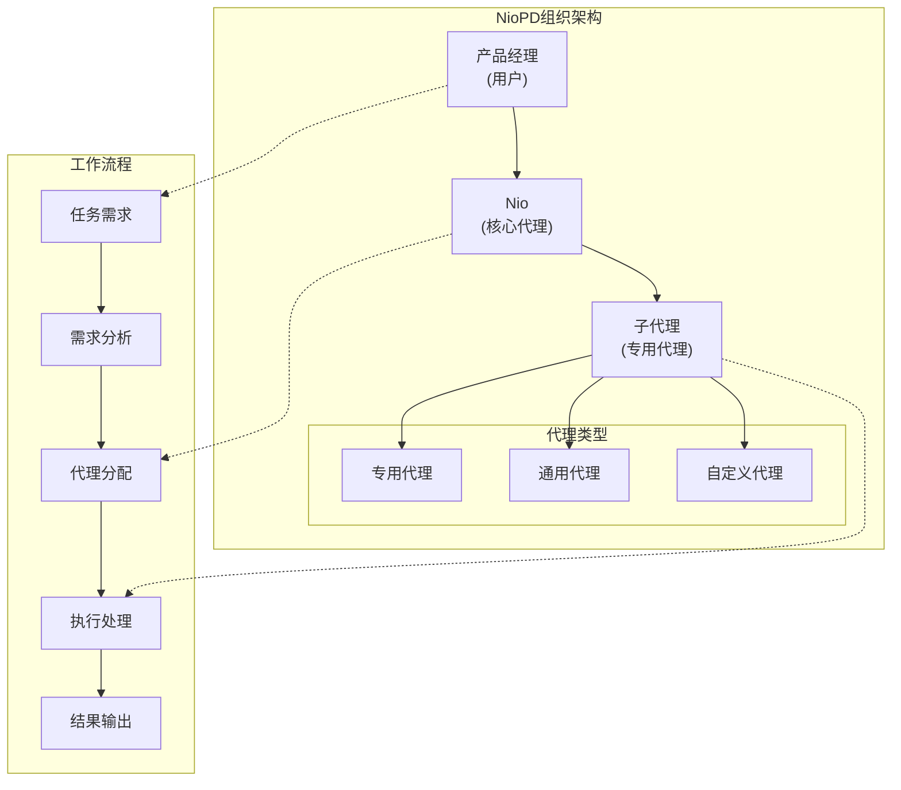
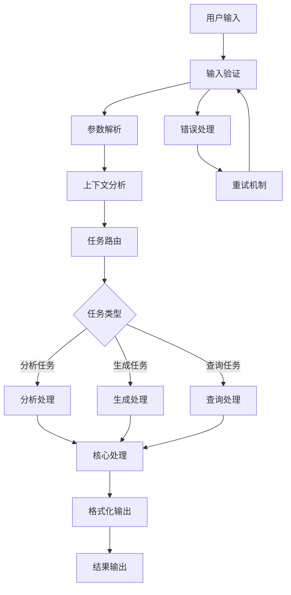
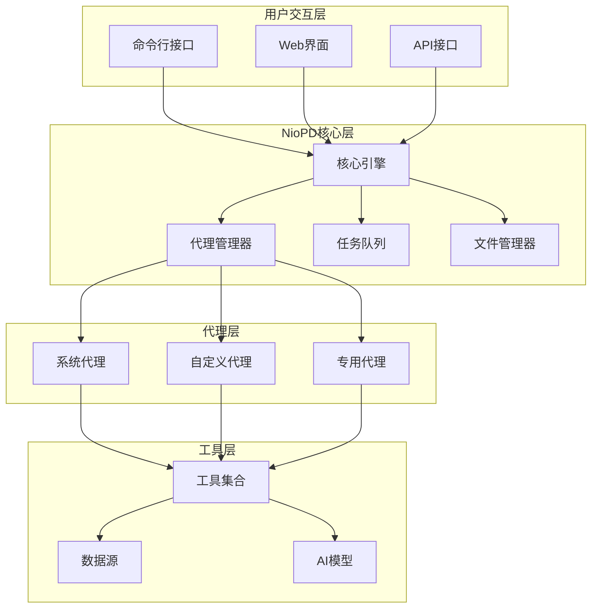
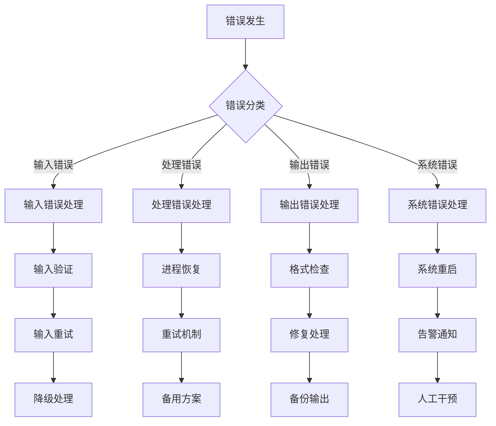
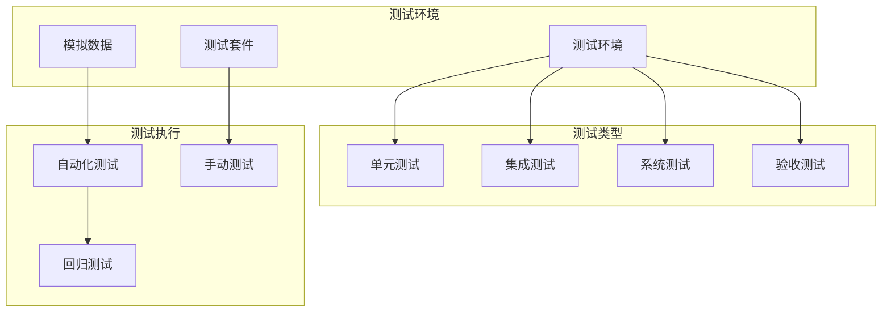

# 专用AI代理创建指南

<cite>
**本文档中引用的文件**
- [new-agent.md](file://niopd/commands/SYS/new-agent.md)
- [agent-template.md](file://niopd/templates/agent-template.md)
- [init.md](file://niopd/commands/SYS/init.md)
- [new-command.md](file://niopd/commands/SYS/new-command.md)
- [new-memory.md](file://niopd/commands/SYS/new-memory.md)
- [command-template.md](file://niopd/templates/command-template.md)
- [plugin.json](file://niopd/.claude-plugin/plugin.json)
- [README.md](file://README.md)
</cite>

## 目录
1. [简介](#简介)
2. [代理系统架构](#代理系统架构)
3. [代理角色定义与职责划分](#代理角色定义与职责划分)
4. [能力与限制配置原则](#能力与限制配置原则)
5. [代理工作流设计](#代理工作流设计)
6. [代理结构文件生成规范](#代理结构文件生成规范)
7. [与NioPD系统集成方式](#与niopd系统集成方式)
8. [实际配置示例](#实际配置示例)
9. [错误处理机制](#错误处理机制)
10. [测试流程](#测试流程)
11. [最佳实践](#最佳实践)

## 简介

NioPD（Nio Product Director）是一个专为Claude Code设计的AI驱动产品管理工具包，包含69个智能化指令，覆盖从商业战略规划到产品交付运营的完整流程。专用AI代理是NioPD系统中的重要组成部分，它们是专门处理特定业务领域的智能助手，能够独立执行复杂的分析任务并生成专业的输出。

专用AI代理遵循NioPD的标准化结构，具有明确的角色定义、能力边界和工作流程，能够在系统中发挥专业化的作用，避免功能重叠，提高整体工作效率。

## 代理系统架构

NioPD采用AI驱动的产品专家组织模型，包含三个核心角色：



**图表来源**
- [init.md](file://niopd/commands/SYS/init.md#L100-L120)
- [new-agent.md](file://niopd/commands/SYS/new-agent.md#L15-L35)

**章节来源**
- [init.md](file://niopd/commands/SYS/init.md#L100-L130)
- [new-agent.md](file://niopd/commands/SYS/new-agent.md#L1-L35)

## 代理角色定义与职责划分

### 核心角色定位

专用AI代理在NioPD系统中承担以下角色：

1. **领域专家角色**：专注于特定业务领域的深度专业知识
2. **任务执行者角色**：负责执行明确、可重复的专业任务
3. **质量保证角色**：确保输出内容的专业性和准确性

### 职责划分原则

#### 1. 专业化职责
- **功能职责**：专注于单一业务领域或任务类型
- **技能职责**：具备该领域的专业技能和知识储备
- **输出职责**：提供标准化、高质量的专业输出

#### 2. 边界控制
- **任务边界**：明确代理能够处理的任务范围
- **知识边界**：限定代理的知识领域和专业范围
- **决策边界**：规定代理的决策权限和授权范围

#### 3. 协作职责
- **沟通职责**：与其他代理和核心系统的有效沟通
- **协作职责**：在必要时与其他代理协同工作
- **反馈职责**：向上级代理或产品经理提供反馈

**章节来源**
- [new-agent.md](file://niopd/commands/SYS/new-agent.md#L25-L40)
- [agent-template.md](file://niopd/templates/agent-template.md#L15-L25)

## 能力与限制配置原则

### 能力配置原则

#### 1. 工具能力配置
专用代理的能力通过允许使用的工具来定义：

```yaml
# 示例：工具配置格式
allowed-tools: [
  Read(file-pattern),
  Write(file-path),
  Edit(content),
  Bash(command),
  WebSearch(query),
  DataAnalysis(dataset)
]
```

#### 2. 模型能力配置
- **基础模型**：inherit（继承父级模型）
- **专用模型**：指定特定的AI模型
- **性能要求**：根据任务复杂度选择合适的模型

#### 3. 特殊能力配置
- **数据分析能力**：统计分析、数据可视化
- **文档处理能力**：Markdown生成、格式转换
- **交互能力**：自然语言理解和生成

### 限制配置原则

#### 1. 功能限制
- **任务范围限制**：明确代理只能处理的特定类型任务
- **数据访问限制**：限定可访问的数据源和文件范围
- **操作权限限制**：控制文件读写和系统操作权限

#### 2. 质量限制
- **输出格式限制**：统一的输出格式和结构要求
- **准确性要求**：设定最低质量标准
- **完整性要求**：确保输出内容的完整性和一致性

#### 3. 安全限制
- **敏感信息保护**：禁止处理敏感或机密信息
- **外部访问限制**：限制对外部系统的访问
- **资源使用限制**：控制计算资源和时间消耗

**章节来源**
- [agent-template.md](file://niopd/templates/agent-template.md#L1-L15)
- [command-template.md](file://niopd/templates/command-template.md#L1-L10)

## 代理工作流设计

### 输入处理流程



**图表来源**
- [agent-template.md](file://niopd/templates/agent-template.md#L25-L50)
- [new-agent.md](file://niopd/commands/SYS/new-agent.md#L35-L55)

### 处理步骤设计

#### 1. 输入接收阶段
- **参数验证**：检查必需参数是否完整
- **格式校验**：验证输入数据格式正确性
- **权限检查**：确认用户是否有执行权限

#### 2. 任务分析阶段
- **需求理解**：准确理解用户意图和需求
- **上下文分析**：分析相关的历史数据和上下文信息
- **资源评估**：评估所需资源和处理时间

#### 3. 执行处理阶段
- **算法选择**：选择最适合的处理算法和方法
- **数据处理**：执行具体的数据处理逻辑
- **质量控制**：实施质量检查和验证

#### 4. 输出生成阶段
- **格式化**：按照预定义格式生成输出
- **验证**：验证输出内容的正确性
- **缓存**：可选的输出缓存机制

### 输出格式规范

专用代理的输出必须遵循严格的格式规范：

```markdown
# 代理名称 - 输出报告

## 概述
简要说明本次处理的结果和主要发现

## 详细分析
### 分析维度1
- 具体发现
- 数据支持
- 结论推导

### 分析维度2
- 具体发现
- 数据支持
- 结论推导

## 结论与建议
基于分析结果提出的结论和行动建议

## 附录
- 相关数据表格
- 分析方法说明
- 参考资料链接
```

**章节来源**
- [agent-template.md](file://niopd/templates/agent-template.md#L50-L72)
- [new-agent.md](file://niopd/commands/SYS/new-agent.md#L40-L60)

## 代理结构文件生成规范

### 文件结构模板

专用代理的标准文件结构遵循以下模板：

```yaml
---
name: niopd-{agent-name}
description: 代理功能的简要描述
tools: [允许使用的工具列表]
model: inherit
color: {主题颜色}
---

# Agent: {代理名称}

## Role
代理的主要角色和专业领域描述

## Input
- 输入类型：{数据类型}
- 格式要求：{格式规范}
- 参数说明：{参数详情}

## Process
1. **第一步**：{处理步骤描述}
   - 子步骤：{详细说明}
2. **第二步**：{处理步骤描述}
   - 子步骤：{详细说明}
3. **第三步**：{处理步骤描述}

## Output Format
{输出格式的具体要求}

## Error Handling
{错误处理的详细指导}
```

### 核心字段说明

#### 1. Front Matter元数据
- **name**：代理的唯一标识符，格式为`niopd-{name}`
- **description**：简洁的功能描述
- **tools**：允许使用的工具列表
- **model**：使用的AI模型
- **color**：界面主题颜色

#### 2. Role角色定义
- **专业领域**：明确代理的专业知识领域
- **主要职责**：描述代理的核心功能
- **适用场景**：说明代理适合的应用场景

#### 3. Input输入规范
- **数据类型**：说明支持的数据格式
- **格式要求**：详细说明输入格式规范
- **参数约束**：列出必需和可选参数

#### 4. Process处理流程
- **步骤分解**：详细描述处理步骤
- **逻辑控制**：说明流程控制逻辑
- **质量保证**：包含质量检查步骤

#### 5. Output输出格式
- **结构规范**：输出文档的结构要求
- **内容要求**：具体内容的格式规范
- **附加信息**：可选的附加信息格式

#### 6. Error Handling错误处理
- **错误类型**：列举可能的错误情况
- **处理策略**：针对每种错误的处理方法
- **用户指导**：提供用户友好的错误信息

**章节来源**
- [agent-template.md](file://niopd/templates/agent-template.md#L1-L72)
- [command-template.md](file://niopd/templates/command-template.md#L1-L27)

## 与NioPD系统集成方式

### 系统集成架构



**图表来源**
- [init.md](file://niopd/commands/SYS/init.md#L150-L170)
- [plugin.json](file://niopd/.claude-plugin/plugin.json#L1-L15)

### 集成方式详解

#### 1. 命令注册机制
专用代理通过标准化的命令格式注册到系统中：

```bash
# 命令格式：/niopd:{namespace}:{agent-name}
/niopd:sys:new-agent
/niopd:mr:competitor-analysis
/niopd:ur:user-feedback
```

#### 2. 文件系统集成
代理文件遵循NioPD的文件命名和组织规范：

```
niopd-workspace/
├── agents/                    # 代理文件存放目录
│   ├── niopd-market-analyzer.md
│   ├── niopd-user-researcher.md
│   └── niopd-competitor-analyzer.md
├── templates/                 # 相关模板
│   └── analysis-template.md
└── logs/                      # 执行日志
    └── agent-execution.log
```

#### 3. 工具链集成
专用代理可以使用系统提供的各种工具：

- **文件操作工具**：Read、Write、Edit
- **系统工具**：Bash命令执行
- **数据工具**：数据分析和可视化
- **网络工具**：Web搜索和数据抓取

#### 4. 生命周期管理
代理的生命周期包括以下阶段：

1. **创建阶段**：通过`/niopd:SYS:new-agent`创建
2. **配置阶段**：设置工具权限和参数
3. **部署阶段**：注册到系统并可用
4. **运行阶段**：响应用户请求
5. **维护阶段**：更新和优化
6. **退役阶段**：停止服务和清理

**章节来源**
- [init.md](file://niopd/commands/SYS/init.md#L150-L180)
- [new-agent.md](file://niopd/commands/SYS/new-agent.md#L1-L20)

## 实际配置示例

### 示例1：市场分析专用代理

#### 代理配置
```yaml
---
name: niopd-market-analyzer
description: 专门进行市场趋势分析和竞争格局研究的代理
tools: [Read(market-data-*), Write(analyses/*), WebSearch, DataAnalysis]
model: claude-3-5-haiku-20241022
color: "#FF6B35"
---

# Agent: 市场分析代理

## Role
专门负责市场趋势分析、竞争格局研究和行业洞察挖掘的AI代理。

## Input
- 输入类型：市场数据文件、URL链接、关键词查询
- 格式要求：CSV/JSON数据文件或文本描述
- 参数说明：
  - `--industry`：行业领域（必填）
  - `--period`：分析周期（默认：最近12个月）
  - `--regions`：分析区域（可选）

## Process
1. **数据收集**：从指定数据源收集市场数据
2. **趋势分析**：识别市场发展趋势和模式
3. **竞争分析**：分析主要竞争者和市场份额
4. **预测建模**：基于历史数据进行趋势预测
5. **报告生成**：生成结构化的分析报告

## Output Format
Markdown格式的市场分析报告，包含以下部分：
- 市场概览
- 趋势分析
- 竞争格局
- 预测结果
- 行业洞察

## Error Handling
- 缺失输入：提示用户提供必要的数据源
- 无效格式：要求用户检查数据格式
- 数据不足：建议补充更多数据源
- 分析失败：提供备选分析方法
```

### 示例2：用户研究专用代理

#### 代理配置
```yaml
---
name: niopd-user-researcher
description: 专门进行用户行为分析和需求挖掘的代理
tools: [Read(user-data-*), Write(research-reports/*), DataAnalysis, WebSearch]
model: inherit
color: "#4CAF50"
---

# Agent: 用户研究代理

## Role
专注于用户行为分析、需求挖掘和用户体验研究的专业代理。

## Input
- 输入类型：用户调研数据、行为日志、问卷调查
- 格式要求：JSON格式的用户数据
- 参数说明：
  - `--user-type`：目标用户类型
  - `--metrics`：分析指标（可选）
  - `--time-range`：时间范围

## Process
1. **数据清洗**：清理和标准化用户数据
2. **行为分析**：识别用户行为模式
3. **需求挖掘**：分析用户痛点和需求
4. **画像构建**：创建用户画像和细分
5. **洞察提取**：提炼关键业务洞察

## Output Format
结构化的用户研究报告，包含：
- 用户画像
- 行为模式分析
- 需求优先级
- 产品改进建议

## Error Handling
- 数据质量问题：建议数据质量检查
- 样本不足：提示增加数据收集
- 分析偏差：提供多种分析视角
```

### 示例3：竞品分析专用代理

#### 代理配置
```yaml
---
name: niopd-competitor-analyzer
description: 专门进行竞争对手分析和市场定位研究的代理
tools: [WebSearch, Read(competitor-data-*), Write(analysis-reports/*), DataAnalysis]
model: claude-3-5-sonnet-20241022
color: "#2196F3"
---

# Agent: 竞品分析代理

## Role
负责竞争对手分析、市场定位研究和差异化策略制定的专业代理。

## Input
- 输入类型：竞品网站URL、市场数据、功能对比表
- 格式要求：网页链接或结构化数据
- 参数说明：
  - `--competitors`：竞争对手列表
  - `--features`：分析功能维度
  - `--region`：市场区域

## Process
1. **竞品识别**：识别主要竞争对手
2. **数据收集**：从网站和公开数据收集信息
3. **功能对比**：构建功能对比矩阵
4. **定位分析**：分析市场定位和价值主张
5. **策略建议**：提供差异化策略建议

## Output Format
专业的竞品分析报告：
- 竞品概览
- 功能对比分析
- 市场定位评估
- 差异化建议

## Error Handling
- 网络访问失败：尝试备用数据源
- 数据获取受限：使用替代分析方法
- 对比维度不足：建议扩展分析维度
```

**章节来源**
- [agent-template.md](file://niopd/templates/agent-template.md#L1-L72)
- [new-agent.md](file://niopd/commands/SYS/new-agent.md#L40-L60)

## 错误处理机制

### 错误分类体系

专用代理的错误处理遵循分层分类体系：



**图表来源**
- [agent-template.md](file://niopd/templates/agent-template.md#L61-L72)
- [new-agent.md](file://niopd/commands/SYS/new-agent.md#L81-L84)

### 具体错误处理策略

#### 1. 描述不清晰错误
当用户提供的代理描述不够清晰时：

**处理流程**：
1. **识别问题**：检测描述的模糊性
2. **询问澄清**：向用户请求更多信息
3. **提供示例**：展示清晰的描述示例
4. **确认理解**：确认用户理解要求

**示例对话**：
```
用户：我想创建一个分析代理
Nio：您的代理描述需要更具体。请明确：
1. 代理要分析什么类型的数据？
2. 需要哪些特定的功能？
3. 输出应该是什么格式？

示例："/niopd:sys:new-agent 分析用户行为数据并生成可视化报告的代理"
```

#### 2. 权限不足错误
当代理需要的权限超出系统限制时：

**处理策略**：
1. **权限检查**：验证当前权限级别
2. **权限升级**：提示用户申请更高权限
3. **功能限制**：在当前权限下提供有限功能
4. **安全措施**：确保安全合规的操作

#### 3. 功能重复错误
当提议的代理功能与现有代理重叠时：

**处理建议**：
1. **功能对比**：分析现有代理的功能
2. **差异识别**：找出功能差异点
3. **合并建议**：建议功能整合
4. **分工优化**：重新设计功能分工

#### 4. 系统资源错误
当系统资源不足时：

**应对措施**：
1. **资源监控**：实时监控系统资源使用
2. **负载均衡**：动态调整任务分配
3. **排队机制**：实施任务排队等待
4. **降级服务**：提供基础功能服务

### 错误恢复机制

#### 1. 自动恢复
- **进程重启**：自动重启异常进程
- **连接重试**：自动重试网络连接
- **数据恢复**：从备份恢复数据

#### 2. 人工干预
- **告警通知**：发送紧急告警
- **故障报告**：生成故障报告
- **专家介入**：联系技术支持

#### 3. 预防措施
- **健康检查**：定期系统健康检查
- **容量规划**：提前规划系统容量
- **监控告警**：建立完善的监控体系

**章节来源**
- [agent-template.md](file://niopd/templates/agent-template.md#L61-L72)
- [new-agent.md](file://niopd/commands/SYS/new-agent.md#L81-L84)

## 测试流程

### 测试架构设计



### 测试流程规范

#### 1. 单元测试
- **功能测试**：测试代理的单个功能模块
- **边界测试**：测试输入边界条件
- **异常测试**：测试异常情况处理
- **性能测试**：测试功能性能指标

#### 2. 集成测试
- **接口测试**：测试代理与系统的接口
- **数据流测试**：测试数据传输和处理
- **并发测试**：测试多用户并发访问
- **兼容性测试**：测试不同环境兼容性

#### 3. 系统测试
- **端到端测试**：测试完整的工作流程
- **压力测试**：测试系统极限负载
- **稳定性测试**：测试长时间运行稳定性
- **安全性测试**：测试安全防护机制

#### 4. 验收测试
- **功能验收**：验证功能符合需求
- **性能验收**：验证性能指标达标
- **可用性验收**：验证用户体验良好
- **文档验收**：验证文档完整准确

### 测试用例设计

#### 1. 输入验证测试
```python
# 测试用例示例
def test_agent_input_validation():
    # 测试空输入
    assert agent.process("") == "错误：请输入有效的输入"
    
    # 测试格式错误
    assert agent.process("invalid-format") == "错误：输入格式不正确"
    
    # 测试参数缺失
    assert agent.process("--missing-param value") == "错误：缺少必需参数"
```

#### 2. 功能执行测试
```python
# 测试用例示例
def test_agent_functionality():
    # 测试正常功能
    result = agent.process("test-input")
    assert result.status == "success"
    assert result.output is not None
    
    # 测试边界条件
    boundary_result = agent.process("boundary-input")
    assert boundary_result.status == "success"
```

#### 3. 错误处理测试
```python
# 测试用例示例
def test_error_handling():
    # 测试网络错误
    with mock_network_failure():
        result = agent.process("network-dependent-input")
        assert "网络连接失败" in result.error_message
    
    # 测试权限错误
    with mock_permission_denied():
        result = agent.process("permission-sensitive-input")
        assert "权限不足" in result.error_message
```

### 测试自动化

#### 1. 自动化测试框架
- **测试脚本**：编写可重复执行的测试脚本
- **测试数据**：准备标准化的测试数据
- **结果验证**：自动验证测试结果
- **报告生成**：自动生成测试报告

#### 2. 持续集成测试
- **代码提交触发**：每次代码提交自动运行测试
- **分支测试**：不同分支独立运行测试
- **合并前验证**：合并前确保测试通过
- **发布前检查**：发布前进行全面测试

**章节来源**
- [init.md](file://niopd/commands/SYS/init.md#L150-L170)
- [new-agent.md](file://niopd/commands/SYS/new-agent.md#L15-L25)

## 最佳实践

### 设计最佳实践

#### 1. 专业化原则
- **专注领域**：每个代理专注于特定领域，避免功能重叠
- **深度专业**：在选定领域内提供深度专业知识
- **持续优化**：根据使用反馈持续优化专业能力

#### 2. 可扩展性设计
- **模块化架构**：采用模块化设计便于扩展
- **插件机制**：支持插件扩展新功能
- **配置驱动**：通过配置文件控制行为

#### 3. 用户体验优化
- **响应迅速**：确保快速响应用户请求
- **结果准确**：提供高质量的分析结果
- **解释清晰**：提供易于理解的输出解释

### 开发最佳实践

#### 1. 代码质量
- **代码规范**：遵循统一的代码规范
- **注释完整**：提供充分的代码注释
- **版本控制**：使用Git进行版本管理
- **代码审查**：实施同行代码审查

#### 2. 文档维护
- **文档同步**：确保文档与代码同步更新
- **示例丰富**：提供丰富的使用示例
- **维护及时**：定期维护和更新文档

#### 3. 测试覆盖
- **全面测试**：确保测试覆盖所有功能
- **边界测试**：重点测试边界条件
- **回归测试**：防止功能退化
- **性能测试**：确保性能指标达标

### 运维最佳实践

#### 1. 监控告警
- **实时监控**：实时监控系统运行状态
- **性能监控**：监控关键性能指标
- **异常告警**：及时发现和处理异常
- **趋势分析**：分析系统运行趋势

#### 2. 安全防护
- **权限控制**：严格控制访问权限
- **数据加密**：保护敏感数据安全
- **审计追踪**：记录所有操作轨迹
- **漏洞扫描**：定期进行安全扫描

#### 3. 备份恢复
- **定期备份**：定期备份重要数据
- **灾难恢复**：制定灾难恢复计划
- **切换演练**：定期进行切换演练
- **性能优化**：持续优化系统性能

### 团队协作最佳实践

#### 1. 沟通协作
- **定期会议**：定期召开项目会议
- **进度同步**：及时同步项目进度
- **知识分享**：促进团队知识共享
- **问题解决**：快速响应和解决问题

#### 2. 知识管理
- **文档中心**：建立统一的文档中心
- **经验总结**：总结项目经验和教训
- **培训计划**：制定团队培训计划
- **技能提升**：持续提升团队技能

#### 3. 流程优化
- **流程标准化**：建立标准化工作流程
- **效率提升**：持续优化工作效率
- **质量保证**：确保交付质量
- **持续改进**：实施持续改进机制

通过遵循这些最佳实践，可以确保专用AI代理的质量、可靠性和可持续发展，为NioPD系统提供强大的专业化支持。

**章节来源**
- [init.md](file://niopd/commands/SYS/init.md#L100-L130)
- [new-agent.md](file://niopd/commands/SYS/new-agent.md#L1-L35)