# 工作记忆

<cite>
**本文档中引用的文件**
- [new-memory.md](file://niopd/commands/SYS/new-memory.md)
- [init.md](file://niopd/commands/SYS/init.md)
- [flow-check.md](file://niopd/commands/SYS/flow-check.md)
- [help.md](file://niopd/commands/SYS/help.md)
- [README.md](file://README.md)
- [command-template.md](file://niopd/templates/command-template.md)
- [agent-template.md](file://niopd/templates/agent-template.md)
- [initiative-template.md](file://niopd/templates/initiative-template.md)
- [feedback-summary-template.md](file://niopd/templates/feedback-summary-template.md)
</cite>

## 目录
1. [简介](#简介)
2. [工作记忆系统概述](#工作记忆系统概述)
3. [工作习惯识别机制](#工作习惯识别机制)
4. [记忆文档结构设计](#记忆文档结构设计)
5. [IDE_TYPE.md文件管理](#ide_typemd文件管理)
6. [习惯标签系统](#习惯标签系统)
7. [实际应用示例](#实际应用示例)
8. [记忆集成策略](#记忆集成策略)
9. [常见问题处理](#常见问题处理)
10. [最佳实践建议](#最佳实践建议)

## 简介

工作记忆是NioPD系统中的核心学习机制，通过智能分析用户的工作模式，识别并记录个人工作习惯，从而实现AI助手的个性化适配。该系统能够自动识别效率模式、质量实践、工作流程偏好和决策框架四大类别的工作习惯，并将其系统化地记录在记忆文档中，为未来的任务执行提供智能化支持。

## 工作记忆系统概述

### 系统架构

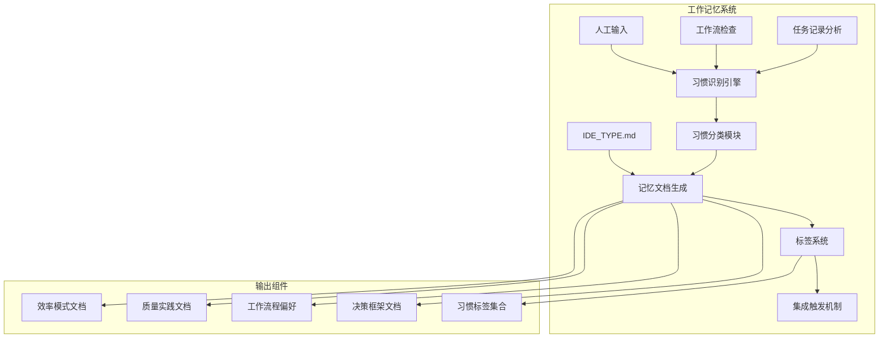

**图表来源**
- [new-memory.md](file://niopd/commands/SYS/new-memory.md#L1-L92)
- [flow-check.md](file://niopd/commands/SYS/flow-check.md#L1-L118)

### 核心功能特性

工作记忆系统具备以下核心功能：

1. **智能习惯识别**：基于历史任务模式自动识别个人工作习惯
2. **多维度分类**：将习惯分为效率、质量、流程、决策四个维度
3. **结构化文档**：生成标准化的记忆文档格式
4. **标签化管理**：为每个习惯创建可搜索的标签
5. **集成触发**：将习惯知识集成到日常工作任务中

**章节来源**
- [new-memory.md](file://niopd/commands/SYS/new-memory.md#L16-L36)

## 工作习惯识别机制

### 识别方法论

工作习惯识别基于以下核心原则：

#### 1. 历史任务模式分析

系统通过分析用户的任务执行模式来识别习惯：

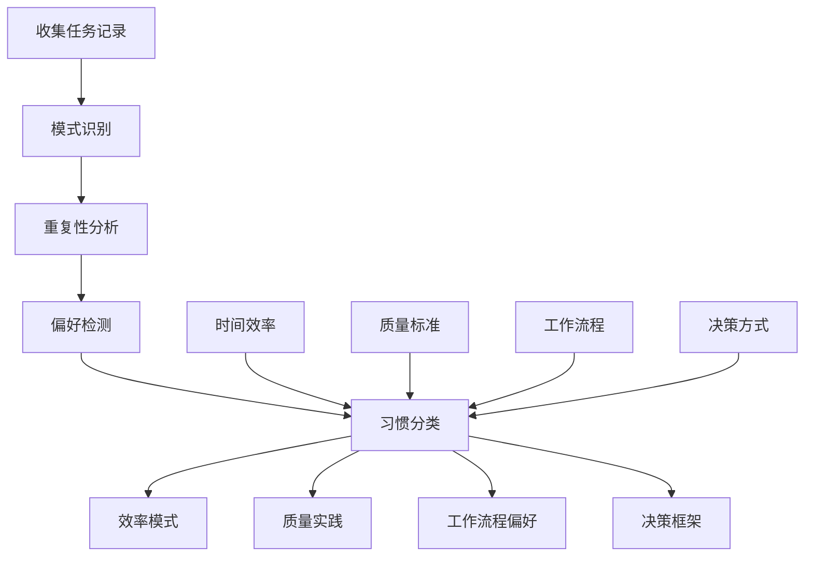

**图表来源**
- [new-memory.md](file://niopd/commands/SYS/new-memory.md#L25-L36)

#### 2. 四大习惯类别

系统将工作习惯分为四个主要类别：

| 类别 | 描述 | 识别特征 | 示例 |
|------|------|----------|------|
| **效率模式** | 时间节省方法 | 快速完成任务、自动化流程 | "批量处理相似任务" |
| **质量实践** | 输出质量提升方法 | 标准化检查、深度验证 | "三轮文档审查" |
| **工作流程偏好** | 偏好的工作方式 | 特定的组织方式、工具选择 | "使用清单管理任务" |
| **决策框架** | 个人决策方法 | 逻辑推理、经验判断 | "基于数据的决策" |

**章节来源**
- [new-memory.md](file://niopd/commands/SYS/new-memory.md#L33-L36)

### 分析算法

系统采用多层次分析算法：

1. **时间序列分析**：识别重复出现的任务模式
2. **行为聚类**：将相似的行为归类为习惯
3. **效果评估**：分析习惯带来的效率或质量提升
4. **上下文匹配**：确定习惯适用的具体场景

**章节来源**
- [flow-check.md](file://niopd/commands/SYS/flow-check.md#L37-L76)

## 记忆文档结构设计

### 文档架构

记忆文档采用标准化的结构设计，确保信息的系统性和可检索性：

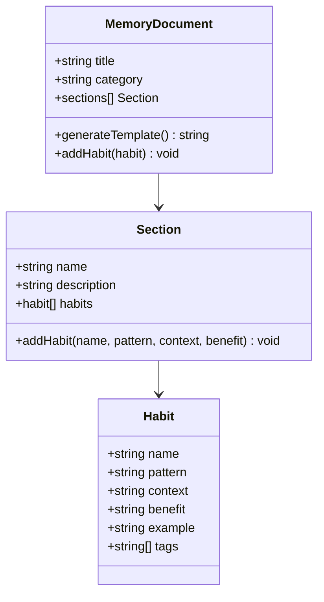

**图表来源**
- [new-memory.md](file://niopd/commands/SYS/new-memory.md#L38-L86)

### 四大分类结构

#### 1. 效率模式 (Efficiency Patterns)

```markdown
## 效率模式

### [习惯名称]
- **模式**: [习惯描述]
- **上下文**: [适用场景]
- **收益**: [时间/质量提升]
- **示例**: [具体工作实例]
```

#### 2. 质量实践 (Quality Practices)

```markdown
## 质量实践

### [习惯名称]
- **模式**: [习惯描述]
- **上下文**: [适用场景]
- **收益**: [质量改善]
- **示例**: [具体工作实例]
```

#### 3. 工作流程偏好 (Workflow Preferences)

```markdown
## 工作流程偏好

### [习惯名称]
- **模式**: [习惯描述]
- **上下文**: [适用场景]
- **收益**: [流程改善]
- **示例**: [具体工作实例]
```

#### 4. 决策框架 (Decision Frameworks)

```markdown
## 决策框架

### [习惯名称]
- **模式**: [习惯描述]
- **上下文**: [适用场景]
- **收益**: [决策质量提升]
- **示例**: [具体工作实例]
```

**章节来源**
- [new-memory.md](file://niopd/commands/SYS/new-memory.md#L38-L86)

### 文档生成流程

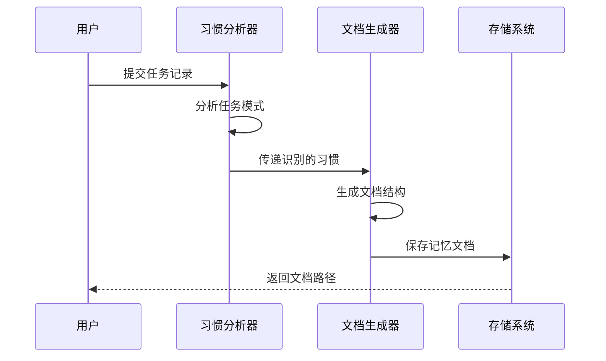

**图表来源**
- [new-memory.md](file://niopd/commands/SYS/new-memory.md#L39-L45)

**章节来源**
- [new-memory.md](file://niopd/commands/SYS/new-memory.md#L38-L86)

## IDE_TYPE.md文件管理

### 文件结构规范

IDE_TYPE.md文件是工作记忆的核心存储位置，遵循严格的结构规范：

#### 1. 文件位置约定

```
{{IDE_TYPE}}/{{IDE_TYPE}}.md
```

其中`{{IDE_TYPE}}`代表具体的IDE类型标识符。

#### 2. 文件内容结构

```markdown
# 个人工作习惯记忆

## 通信偏好
- 首选语言: 中文

## 效率模式
### 批量处理
- **模式**: 一次性处理相似任务
- **上下文**: 多个小任务堆积时
- **收益**: 节省切换成本
- **示例**: 每天下午集中处理邮件

## 质量实践
### 三重检查
- **模式**: 文档完成后进行三次检查
- **上下文**: 重要交付物前
- **收益**: 提高质量准确性
- **示例**: PRD完成后检查语法、逻辑、完整性

## 工作流程偏好
### 清单管理
- **模式**: 使用清单管理任务
- **上下文**: 复杂项目中
- **收益**: 避免遗漏
- **示例**: 每个项目开始时创建任务清单

## 决策框架
### 数据驱动
- **模式**: 基于数据分析做决策
- **上下文**: 产品策略制定时
- **收益**: 提高决策准确性
- **示例**: 通过用户行为数据决定功能优先级
```

#### 3. 文件维护流程

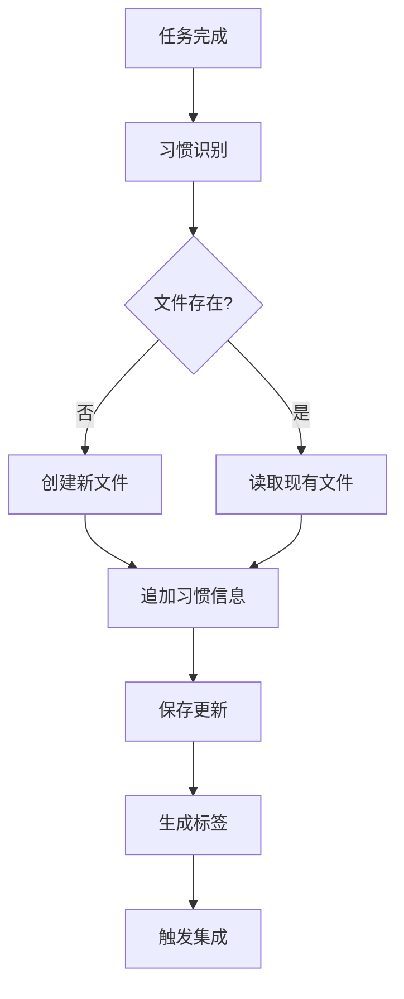

**图表来源**
- [init.md](file://niopd/commands/SYS/init.md#L34-L80)

**章节来源**
- [init.md](file://niopd/commands/SYS/init.md#L34-L80)
- [new-memory.md](file://niopd/commands/SYS/new-memory.md#L16-L17)

## 习惯标签系统

### 标签生成规则

习惯标签采用统一的命名规范，便于快速检索和应用：

#### 1. 标签格式

```
#habit-[类别]-[名称]
```

#### 2. 类别映射

| 类别 | 缩写 | 示例 |
|------|------|------|
| 效率模式 | efficiency | `#habit-efficiency-batch-processing` |
| 质量实践 | quality | `#habit-quality-triple-check` |
| 工作流程偏好 | workflow | `#habit-workflow-checklist` |
| 决策框架 | decision | `#habit-decision-data-driven` |

#### 3. 标签应用场景

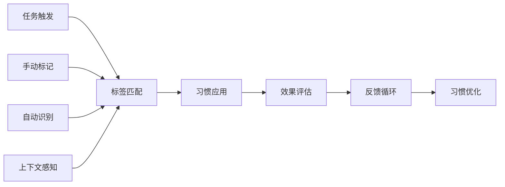

**图表来源**
- [new-memory.md](file://niopd/commands/SYS/new-memory.md#L56-L60)

### 标签使用指南

#### 1. 创建标签

每次识别新习惯时，系统自动生成对应的标签：

```javascript
// 标签生成伪代码
function generateHabitTag(category, name) {
    const normalizedCategory = category.toLowerCase().replace(/\s+/g, '-');
    const normalizedName = name.toLowerCase().replace(/\s+/g, '-');
    return `#habit-${normalizedCategory}-${normalizedName}`;
}
```

#### 2. 应用标签

标签可以在多种场景中应用：

- **任务描述**：在任务创建时自动添加相关标签
- **文档标记**：在相关文档中添加习惯标签
- **搜索索引**：建立标签到习惯的映射索引
- **推荐系统**：基于标签推荐相关任务

**章节来源**
- [new-memory.md](file://niopd/commands/SYS/new-memory.md#L56-L60)

## 实际应用示例

### 示例1：效率模式识别

#### 场景描述
用户经常在项目初期花费大量时间进行需求分析，但总是遗漏某些关键点。

#### 识别过程
1. **任务分析**：分析用户的历史PRD创建记录
2. **模式识别**：发现用户在需求分析阶段存在重复遗漏
3. **习惯提取**：识别出"需求分析清单"这一效率模式

#### 记忆文档

```markdown
## 效率模式

### 需求分析清单
- **模式**: 在需求分析前创建详细检查清单
- **上下文**: 所有产品需求分析任务
- **收益**: 减少50%的需求遗漏
- **示例**: 在创建PRD前，先列出15个关键检查点
```

#### 标签应用
```
#habit-efficiency-requirement-checklist
```

### 示例2：质量实践记录

#### 场景描述
用户在交付重要文档前，总是进行三重检查。

#### 识别过程
1. **行为观察**：分析用户提交的文档版本历史
2. **质量评估**：发现文档质量呈现阶梯式提升
3. **习惯总结**：识别出"三重检查"质量实践

#### 记忆文档

```markdown
## 质量实践

### 三重检查
- **模式**: 文档完成后进行语法、逻辑、完整性三轮检查
- **上下文**: 重要交付物前
- **收益**: 将错误率降低至1%
- **示例**: PRD完成后依次进行语法检查、逻辑验证、完整性审核
```

#### 标签应用
```
#habit-quality-triple-check
```

### 示例3：工作流程偏好

#### 场景描述
用户在处理复杂项目时，总是先创建详细的任务清单。

#### 识别过程
1. **流程分析**：观察用户项目管理方式
2. **偏好识别**：发现用户对清单管理的强烈偏好
3. **习惯定义**：总结出"清单管理"工作流程偏好

#### 记忆文档

```markdown
## 工作流程偏好

### 清单管理
- **模式**: 项目开始时创建详细任务清单
- **上下文**: 复杂项目管理
- **收益**: 避免任务遗漏，提高执行效率
- **示例**: 每个项目开始时创建包含20+项的详细任务清单
```

#### 标签应用
```
#habit-workflow-checklist
```

### 示例4：决策框架

#### 场景描述
用户在制定产品策略时，总是基于数据分析做出决策。

#### 识别过程
1. **决策分析**：分析用户的产品策略文档
2. **方法识别**：发现用户偏好数据驱动决策
3. **框架总结**：识别出"数据驱动决策"框架

#### 记忆文档

```markdown
## 决策框架

### 数据驱动决策
- **模式**: 基于用户行为数据和市场研究做出产品决策
- **上下文**: 产品策略制定阶段
- **收益**: 提高决策准确性和成功率
- **示例**: 通过A/B测试数据决定功能优先级
```

#### 标签应用
```
#habit-decision-data-driven
```

**章节来源**
- [new-memory.md](file://niopd/commands/SYS/new-memory.md#L38-L86)

## 记忆集成策略

### 触发机制

#### 1. 自动触发

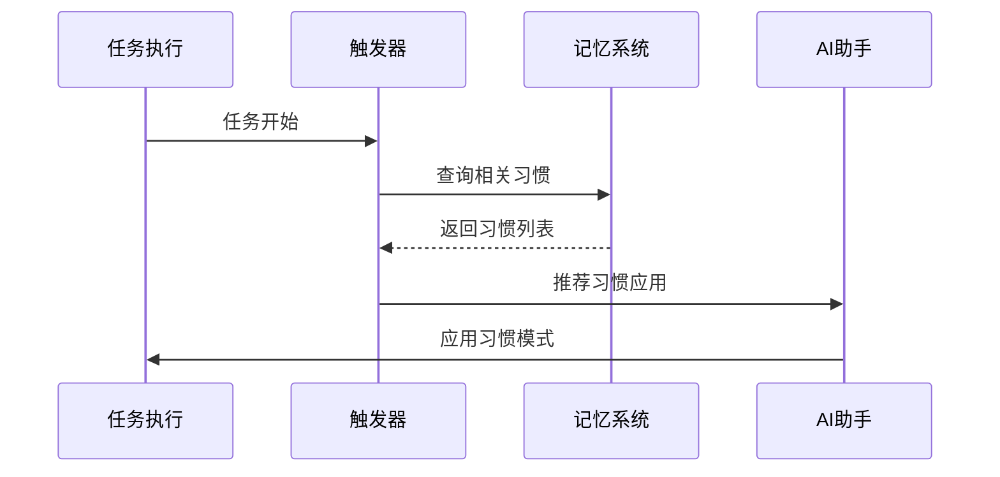

**图表来源**
- [new-memory.md](file://niopd/commands/SYS/new-memory.md#L61-L67)

#### 2. 手动触发

用户可以通过以下方式手动触发习惯应用：

- **命令触发**：使用`/niopd:SYS:new-memory`命令
- **上下文提示**：系统在相关场景下提供建议
- **主动查询**：用户主动询问适合的习惯

### 强化策略

#### 1. 反馈循环

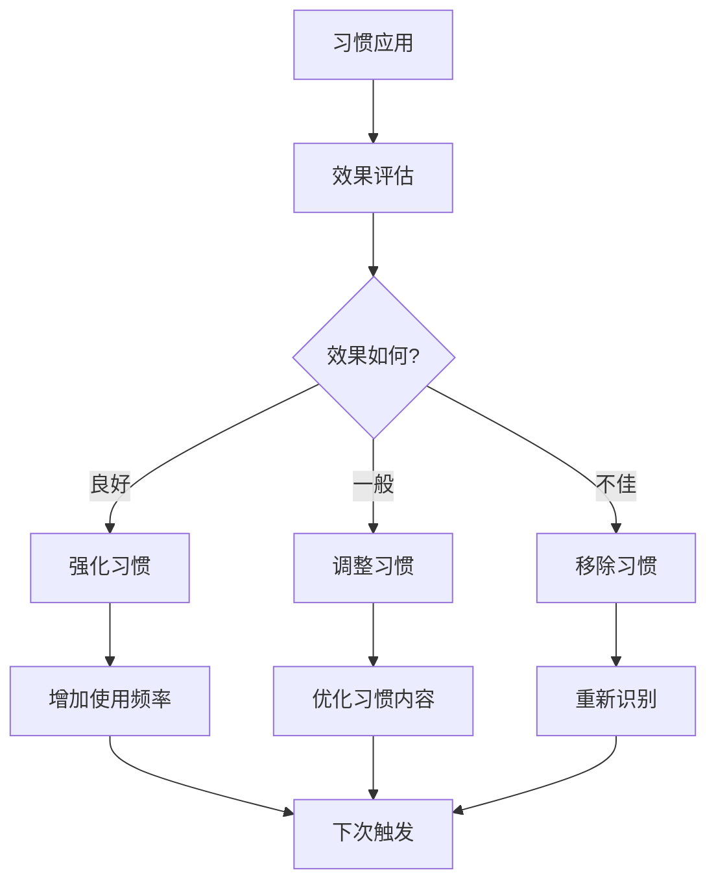

#### 2. 习惯优化

系统提供多种习惯优化机制：

- **效果追踪**：记录习惯应用的效果
- **频率统计**：分析习惯使用的频率
- **场景匹配**：优化习惯与场景的匹配度
- **反馈整合**：将用户反馈融入习惯优化

#### 3. 集成深度

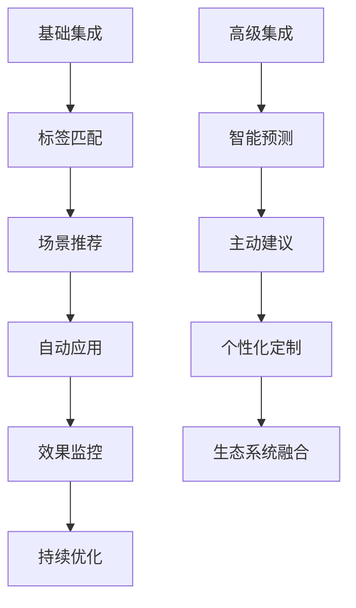

**章节来源**
- [new-memory.md](file://niopd/commands/SYS/new-memory.md#L61-L67)

## 常见问题处理

### 问题1：无法访问记忆文件

#### 问题描述
系统无法访问或创建IDE_TYPE.md文件。

#### 解决方案

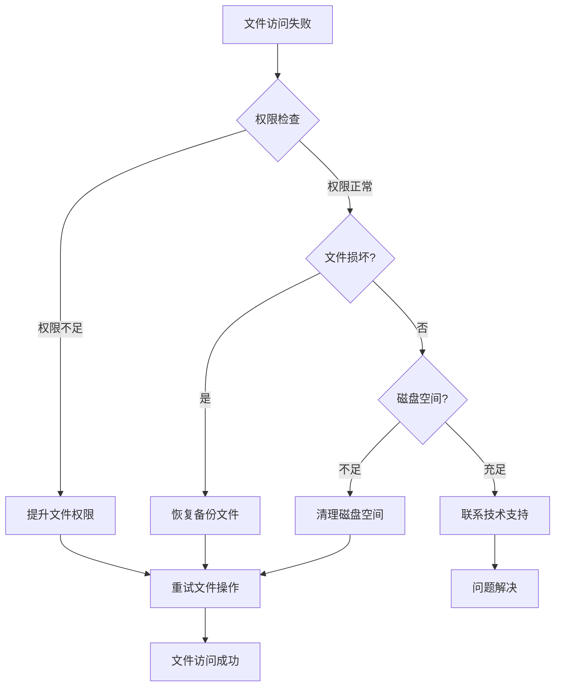

#### 处理步骤

1. **检查文件权限**
   ```bash
   # 检查文件权限
   ls -la {{IDE_TYPE}}/{{IDE_TYPE}}.md
   
   # 修改权限（如需要）
   chmod 644 {{IDE_TYPE}}/{{IDE_TYPE}}.md
   ```

2. **验证文件完整性**
   ```bash
   # 检查文件大小
   wc -c {{IDE_TYPE}}/{{IDE_TYPE}}.md
   
   # 验证文件编码
   file {{IDE_TYPE}}/{{IDE_TYPE}}.md
   ```

3. **创建备用文件**
   ```bash
   # 创建备用文件位置
   cp {{IDE_TYPE}}/{{IDE_TYPE}}.md {{IDE_TYPE}}/{{IDE_TYPE}}.md.backup
   ```

### 问题2：习惯不明确

#### 问题描述
系统无法明确识别用户的工作习惯。

#### 解决方案

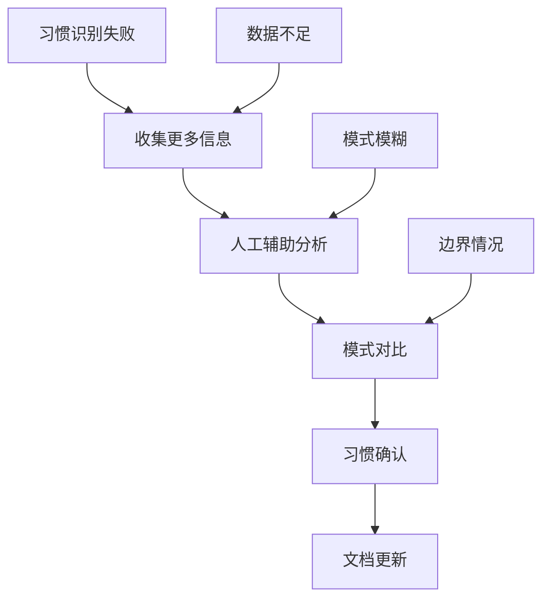

#### 处理策略

1. **数据收集补充**
   - 增加任务记录的时间跨度
   - 扩展分析的数据范围
   - 包含更多上下文信息

2. **人工干预**
   ```javascript
   // 人工确认伪代码
   function confirmHabit(habit, userFeedback) {
       if (userAgrees(userFeedback)) {
           return saveHabit(habit);
       } else {
           return refineHabit(habit, userCorrection);
       }
   }
   ```

3. **渐进式识别**
   - 从明显模式开始识别
   - 逐步细化到具体习惯
   - 最终形成完整的习惯库

### 问题3：习惯冲突

#### 问题描述
识别出的多个习惯之间存在冲突。

#### 解决方案

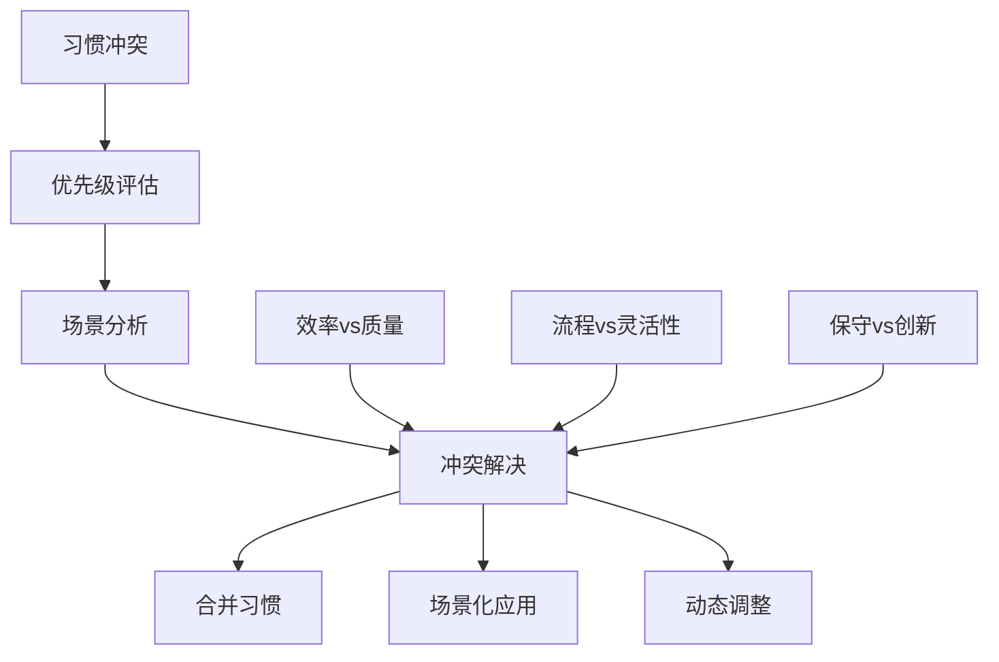

#### 冲突处理原则

1. **场景优先**：根据具体场景选择最合适的习惯
2. **目标平衡**：在效率和质量间寻找平衡点
3. **渐进适应**：允许习惯间的自然融合
4. **持续优化**：通过反馈不断调整冲突解决策略

**章节来源**
- [new-memory.md](file://niopd/commands/SYS/new-memory.md#L88-L91)

## 最佳实践建议

### 1. 定期维护

#### 维护周期建议

| 维护类型 | 建议周期 | 内容 |
|----------|----------|------|
| 习惯回顾 | 每月 | 检查习惯的有效性和适用性 |
| 文档更新 | 每季度 | 更新过时的习惯描述 |
| 标签优化 | 每半年 | 优化标签结构和命名 |
| 系统升级 | 按需 | 随系统更新调整功能 |

#### 维护流程


### 2. 数据保护

#### 1. 备份策略

```markdown
# 备份计划

## 自动备份
- 每日自动备份IDE_TYPE.md
- 备份保留最近30天版本
- 压缩存储减少空间占用

## 手动备份
- 重大更新前手动备份
- 保存变更日志
- 验证备份完整性

## 恢复程序
- 备份文件位置: {{IDE_TYPE}}/.backup/
- 恢复命令: restore_memory_backup()
- 验证恢复结果
```

#### 2. 数据安全

- **访问控制**：限制对记忆文件的访问权限
- **加密存储**：敏感信息进行加密处理
- **审计日志**：记录所有文件访问和修改
- **隐私保护**：确保个人工作习惯的隐私安全

### 3. 系统优化

#### 性能优化

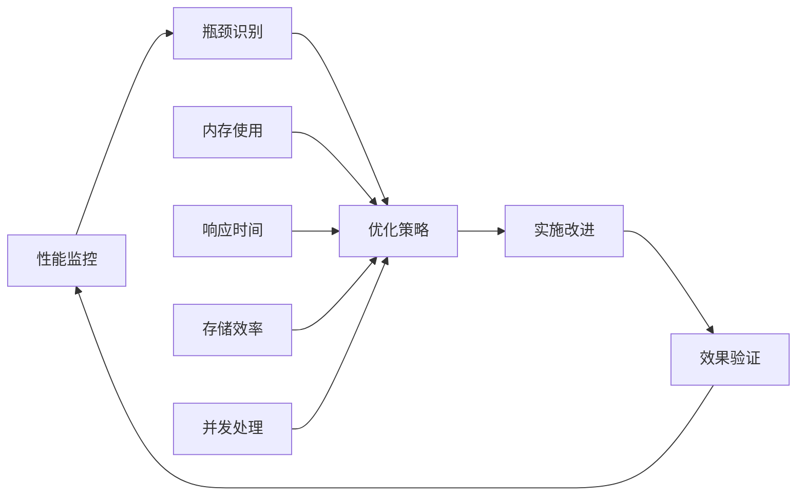

#### 扩展性考虑

- **模块化设计**：支持新习惯类别的扩展
- **插件机制**：允许第三方习惯插件
- **API接口**：提供编程接口访问习惯数据
- **云同步**：支持跨设备的习惯同步

### 4. 用户体验

#### 1. 可视化界面

```markdown
# 用户界面建议

## 习惯仪表板
- 可视化展示习惯分布
- 效果指标实时更新
- 趋势分析图表

## 搜索功能
- 标签搜索
- 内容搜索
- 场景匹配搜索

## 通知系统
- 习惯应用提醒
- 效果评估通知
- 新习惯推荐
```

#### 2. 交互设计

- **渐进式披露**：根据用户需求逐步展示信息
- **上下文帮助**：在相关场景提供即时帮助
- **个性化设置**：允许用户自定义习惯显示方式
- **反馈渠道**：提供习惯使用反馈入口

### 5. 集成建议

#### 1. 工具链集成

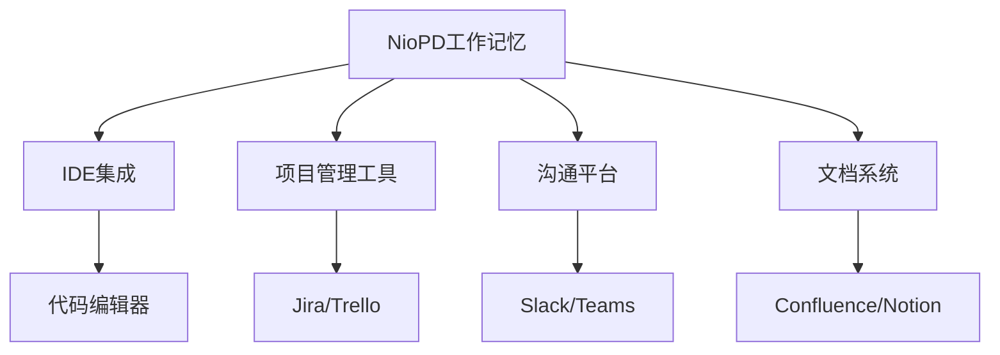

#### 2. 生态系统融合

- **API开放**：提供习惯数据的API接口
- **插件生态**：鼓励第三方开发者创建插件
- **标准兼容**：与其他工作记忆系统兼容
- **数据交换**：支持习惯数据的导入导出

通过遵循这些最佳实践，可以最大化工作记忆系统的价值，为用户提供更加智能和个性化的AI助手体验。

**章节来源**
- [new-memory.md](file://niopd/commands/SYS/new-memory.md#L88-L91)
- [flow-check.md](file://niopd/commands/SYS/flow-check.md#L112-L117)