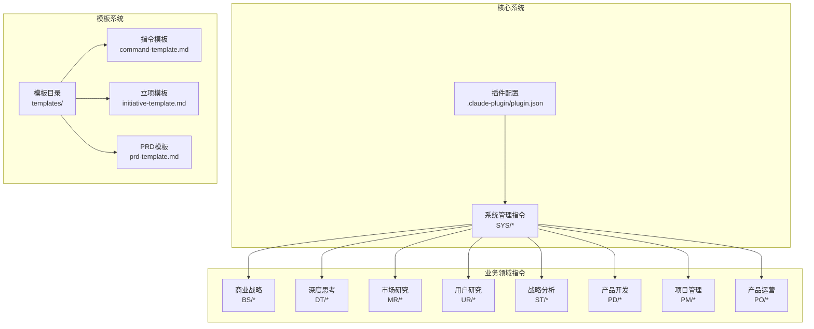
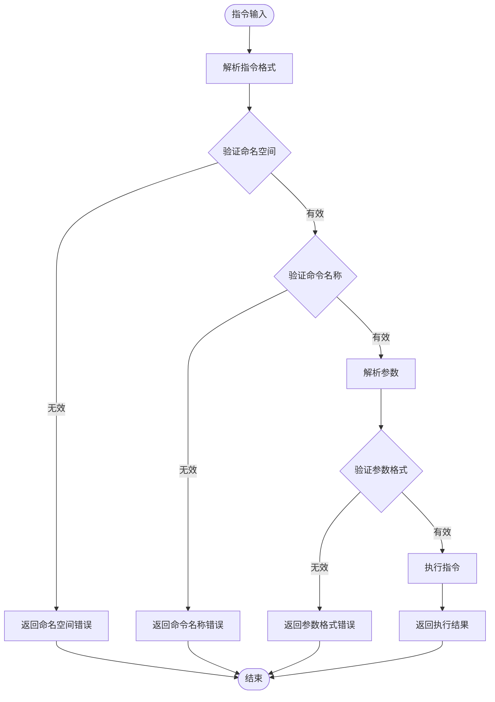
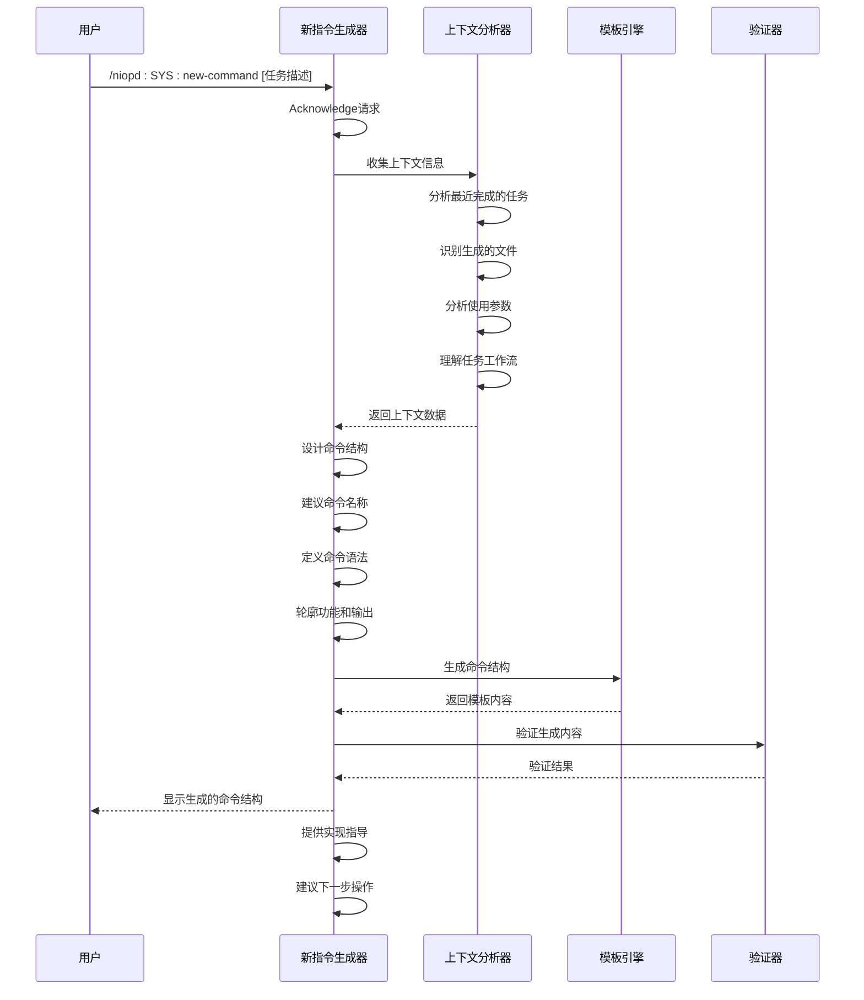
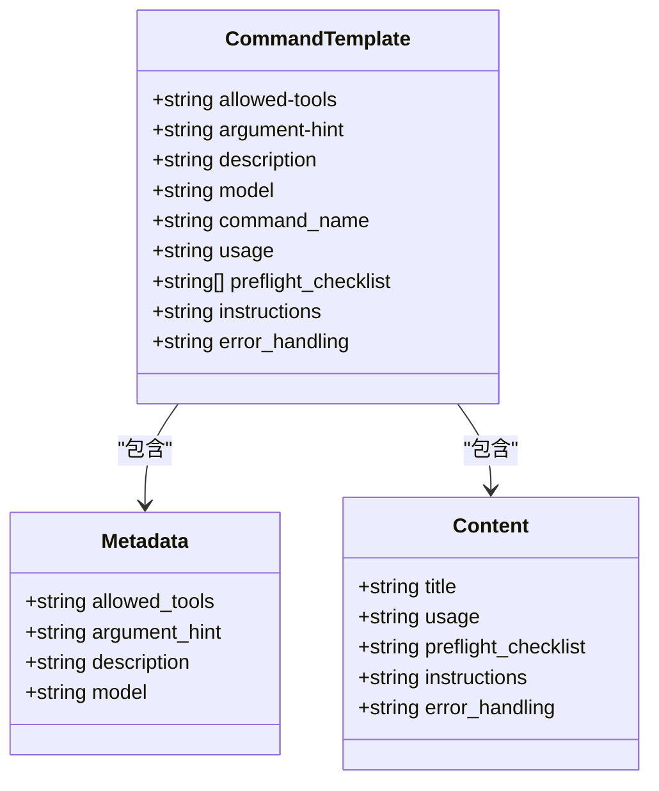
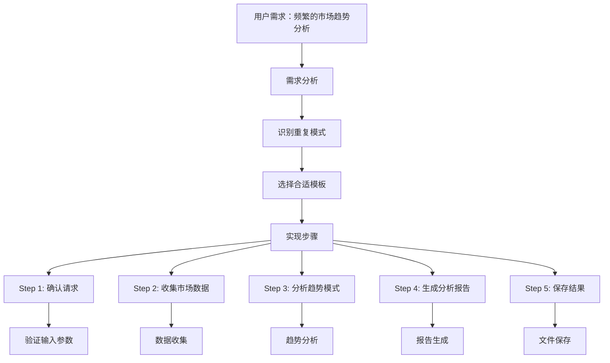
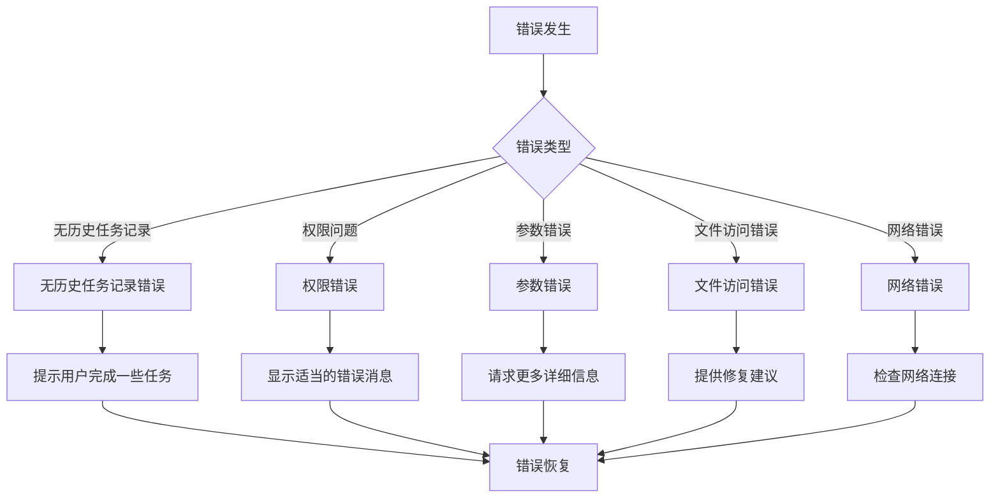

# 自定义指令

<cite>
**本文档中引用的文件**
- [plugin.json](file://niopd/.claude-plugin/plugin.json)
- [new-command.md](file://niopd/commands/SYS/new-command.md)
- [command-template.md](file://niopd/templates/command-template.md)
- [init.md](file://niopd/commands/SYS/init.md)
- [help.md](file://niopd/commands/SYS/help.md)
- [new-initiative.md](file://niopd/commands/BS/new-initiative.md)
- [draft-prd.md](file://niopd/commands/PD/draft-prd.md)
- [swot.md](file://niopd/commands/ST/swot.md)
- [README.md](file://README.md)
- [initiative-template.md](file://niopd/templates/initiative-template.md)
- [prd-template.md](file://niopd/templates/prd-template.md)
</cite>

## 目录
1. [简介](#简介)
2. [项目架构概览](#项目架构概览)
3. [指令命名规范与语法定义](#指令命名规范与语法定义)
4. [参数配置与argument-hint使用方法](#参数配置与argument-hint使用方法)
5. [基于实际任务上下文生成新指令的完整流程](#基于实际任务上下文生成新指令的完整流程)
6. [自定义指令模板的创建与关联方式](#自定义指令模板的创建与关联方式)
7. [实际代码示例展示从需求到实现的全过程](#实际代码示例展示从需求到实现的全过程)
8. [常见错误处理](#常见错误处理)
9. [最佳实践与安全建议](#最佳实践与安全建议)
10. [总结](#总结)

## 简介

NioPD是一个为Claude Code设计的智能化产品管理工具包，集成了69个专业化指令，覆盖从商业战略规划到产品交付运营的完整流程。本文档深入讲解如何使用`/niopd:SYS:new-command`创建自定义指令，帮助开发者扩展NioPD的功能，满足特定的业务需求。

## 项目架构概览

NioPD采用模块化的指令架构，每个指令都有明确的职责和标准化的结构：



**图表来源**
- [plugin.json](file://niopd/.claude-plugin/plugin.json#L1-L15)
- [README.md](file://README.md#L1-L100)

**章节来源**
- [plugin.json](file://niopd/.claude-plugin/plugin.json#L1-L15)
- [README.md](file://README.md#L1-L200)

## 指令命名规范与语法定义

### 命名规范

NioPD指令遵循严格的命名规范，确保命令结构的一致性和可预测性：

#### 基本格式
```
/niopd:{namespace}:{command-name} [--arguments]
```

#### 命名规则

1. **命名空间（Namespace）**：表示指令所属的功能领域
   - `SYS`: 系统管理
   - `BS`: 商业战略规划
   - `DT`: 深度思考工具
   - `MR`: 市场研究
   - `UR`: 用户研究
   - `ST`: 战略分析
   - `PD`: 产品开发
   - `PM`: 项目管理
   - `PO`: 产品运营

2. **命令名称（Command Name）**：描述具体功能，使用小写字母和连字符

3. **参数格式**：使用`--parameter=value`格式传递参数

### 语法定义示例



**图表来源**
- [new-command.md](file://niopd/commands/SYS/new-command.md#L1-L50)
- [init.md](file://niopd/commands/SYS/init.md#L1-L50)

**章节来源**
- [new-command.md](file://niopd/commands/SYS/new-command.md#L1-L33)
- [init.md](file://niopd/commands/SYS/init.md#L1-L30)

## 参数配置与argument-hint使用方法

### argument-hint配置

`argument-hint`是NioPD指令的关键元数据，用于向用户提供参数提示和自动补全功能：

#### 基本语法
```yaml
argument-hint: [参数描述] | [简短说明]
```

#### 配置示例

1. **简单参数**：
```yaml
argument-hint: <initiative_name>
```

2. **带选项的参数**：
```yaml
argument-hint: [--for=<initiative_name>] [--market=<market_context>]
```

3. **复合参数**：
```yaml
argument-hint: [task description] | Create a new command based on recent completed tasks
```

### allowed-tools配置

`allowed-tools`定义了指令可以使用的工具集合：

#### 工具类型
- **Read(*)**: 读取文件内容
- **Write(*)**: 写入文件
- **Edit(*)**: 编辑文件
- **Bash(command)**: 执行bash命令
- **Glob(pattern)**: 文件匹配
- **Grep(pattern)**: 文本搜索

#### 配置示例
```yaml
allowed-tools: Bash(git add:*), Bash(git status:*), Read(*), Write(*), Edit(*)
```

### model配置

指定使用的AI模型：
```yaml
model: Qwen3-Coder
```

**章节来源**
- [command-template.md](file://niopd/templates/command-template.md#L1-L27)
- [new-command.md](file://niopd/commands/SYS/new-command.md#L1-L10)

## 基于实际任务上下文生成新指令的完整流程

### 完整生成流程

`/niopd:SYS:new-command`指令通过分析最近完成的任务记录来创建新的自定义指令：



**图表来源**
- [new-command.md](file://niopd/commands/SYS/new-command.md#L20-L80)

### 步骤详解

#### Step 1: Acknowledge（确认）
- 确认请求："I'll help you create a new command based on recent task context for organizational updates."

#### Step 2: Gather Context（收集上下文）
- 识别系统记录中的最近完成任务
- 分析生成的文件和使用的参数
- 理解任务工作流和要求

#### Step 3: Command Design（命令设计）
- 基于任务建议适当的命令名称
- 定义命令语法和参数
- 概述命令功能和预期输出

#### Step 4: Generate Command Structure（生成命令结构）
- 创建具有适当结构的新命令文件
- 包含元数据、描述、使用说明等

#### Step 5: Template Creation（模板创建）
- 如有必要，创建相关的模板、代理或脚本
- 建议适当的文件位置

#### Step 6: Implementation Guidance（实施指导）
- 提供实现新命令的分步说明
- 建议测试程序
- 描述与现有NioPD工作流的集成

#### Step 7: Display Output（显示输出）
- 向用户显示生成的命令结构
- 提供清晰的实施指导
- 建议命令激活的下一步

**章节来源**
- [new-command.md](file://niopd/commands/SYS/new-command.md#L20-L95)

## 自定义指令模板的创建与关联方式

### 模板结构

NioPD指令模板遵循统一的结构规范：



**图表来源**
- [command-template.md](file://niopd/templates/command-template.md#L1-L27)
- [new-command.md](file://niopd/commands/SYS/new-command.md#L1-L33)

### 创建自定义模板

#### 1. 基础模板创建

```yaml
---
allowed-tools: [适当的工具列表]
argument-hint: [参数描述]
description: [简短描述]
model: Qwen3-Coder
---

# Command: /niopd:user-[命令名称]

[Brief description of what the command does]

## Usage
`/niopd:user-[命令名称] [arguments]`

## Preflight Checklist
- [验证步骤]

## Instructions

You are Nio, an AI Product Assistant. Your task is to create a user-defined command for [command purpose].

### Step 1: Acknowledge
- [确认消息]

### Step 2: [步骤名称]
- [步骤详情]

### Step N: Conclude
- [结论消息]

## Error Handling
- [错误处理指南]
```

#### 2. 模板关联方式

模板通过以下方式与指令关联：

1. **文件命名约定**：`[namespace]-[command-name].md`
2. **元数据配置**：在文件开头的YAML元数据块中定义
3. **插件配置**：在`plugin.json`中注册指令路径

#### 3. 模板继承

新模板可以从现有模板继承结构：

```yaml
# 继承自基础模板
extends: command-template.md

# 覆盖特定部分
description: "自定义功能描述"
instructions: |
  ### Step 1: 特定步骤
  - 执行特定操作
```

**章节来源**
- [command-template.md](file://niopd/templates/command-template.md#L1-L27)
- [new-command.md](file://niopd/commands/SYS/new-command.md#L40-L70)

## 实际代码示例展示从需求到实现的全过程

### 示例1：创建市场趋势分析指令

#### 需求分析
基于用户经常进行市场趋势分析的需求，创建专门的指令：



**图表来源**
- [swot.md](file://niopd/commands/ST/swot.md#L1-L100)
- [new-command.md](file://niopd/commands/SYS/new-command.md#L20-L50)

#### 实现过程

1. **指令设计**：
```yaml
---
allowed-tools: Read(*), Write(*), Bash(curl:*), Bash(jq:*)
argument-hint: [--topic=<主题>] [--period=<时间范围>]
description: 分析市场趋势并生成趋势报告
model: Qwen3-Coder
---

# Command: /niopd:MR:trend-analysis

分析市场趋势并生成趋势报告。

## Usage
`/niopd:MR:trend-analysis [--topic=<主题>] [--period=<时间范围>]`

## Preflight Checklist
- 确保网络连接正常
- 验证主题参数的有效性
- 检查输出目录权限

## Instructions

### Step 1: 确认请求
- 确认分析的主题和时间范围

### Step 2: 收集市场数据
- 从API获取相关市场数据
- 下载趋势指数和行业报告

### Step 3: 分析趋势模式
- 识别主要趋势方向
- 分析季节性波动
- 检测异常模式

### Step 4: 生成分析报告
- 创建趋势分析报告
- 包含可视化图表
- 提供解读建议

### Step 5: 保存结果
- 保存报告到reports/目录
- 更新文件索引
```

2. **参数验证**：
```javascript
// 参数验证逻辑
function validateParameters(params) {
    const errors = [];
    
    if (!params.topic && !params.for) {
        errors.push("必须指定分析主题");
    }
    
    if (params.period && !isValidPeriod(params.period)) {
        errors.push("时间范围格式无效");
    }
    
    return errors;
}
```

3. **数据处理**：
```javascript
// 数据处理流程
async function processData(topic, period) {
    // 获取市场数据
    const rawData = await fetchMarketData(topic, period);
    
    // 数据清洗
    const cleanedData = cleanData(rawData);
    
    // 趋势分析
    const trends = analyzeTrends(cleanedData);
    
    return trends;
}
```

### 示例2：创建用户反馈处理指令

#### 需求背景
用户需要快速处理大量用户反馈，创建专门的处理指令。

#### 实现步骤

1. **指令结构**：
```yaml
---
allowed-tools: Read(*), Write(*), Edit(*), Bash(grep:*), Bash(awk:*)
argument-hint: [--source=<文件路径>] [--filter=<筛选条件>]
description: 处理用户反馈并生成分析报告
model: Qwen3-Coder
---

# Command: /niopd:UR:feedback-analyze

处理用户反馈并生成分析报告。

## Usage
`/niopd:UR:feedback-analyze [--source=<文件路径>] [--filter=<筛选条件>]`

## Preflight Checklist
- 确认反馈文件存在
- 验证文件格式正确
- 检查输出权限

## Instructions
```

2. **核心功能实现**：
```javascript
// 反馈处理核心逻辑
class FeedbackProcessor {
    constructor(filePath, filterCriteria) {
        this.filePath = filePath;
        this.filterCriteria = filterCriteria;
    }
    
    async process() {
        // 读取反馈文件
        const feedbackData = await this.readFeedback();
        
        // 应用筛选条件
        const filteredData = this.applyFilters(feedbackData);
        
        // 分析情感
        const sentimentResults = this.analyzeSentiment(filteredData);
        
        // 生成报告
        return this.generateReport(sentimentResults);
    }
}
```

**章节来源**
- [swot.md](file://niopd/commands/ST/swot.md#L1-L200)
- [new-command.md](file://niopd/commands/SYS/new-command.md#L40-L95)

## 常见错误处理

### 错误类型与处理策略



**图表来源**
- [new-command.md](file://niopd/commands/SYS/new-command.md#L90-L95)

### 具体错误处理实现

#### 1. 无历史任务记录错误
```javascript
// 检查历史任务记录
function checkRecentTasks() {
    const recentTasks = getRecentTasks();
    
    if (recentTasks.length === 0) {
        throw new Error("没有最近的任务记录。请先完成一些任务，然后重试。");
    }
    
    return recentTasks;
}
```

#### 2. 权限问题处理
```javascript
// 权限检查
async function checkPermissions(filePath) {
    try {
        await fs.access(filePath, fs.constants.W_OK);
        return true;
    } catch (error) {
        throw new Error(`无法访问文件 ${filePath}: ${error.message}`);
    }
}
```

#### 3. 参数验证错误
```javascript
// 参数验证函数
function validateArguments(args) {
    const errors = [];
    
    if (!args.taskDescription && !args.for) {
        errors.push("必须提供任务描述或--for参数");
    }
    
    if (args.for && typeof args.for !== 'string') {
        errors.push("--for参数必须是字符串");
    }
    
    return errors;
}
```

#### 4. 文件操作错误
```javascript
// 文件操作错误处理
async function safeFileOperation(operation) {
    try {
        return await operation();
    } catch (error) {
        if (error.code === 'ENOENT') {
            throw new Error('文件不存在');
        } else if (error.code === 'EACCES') {
            throw new Error('权限不足');
        } else {
            throw new Error(`文件操作失败: ${error.message}`);
        }
    }
}
```

**章节来源**
- [new-command.md](file://niopd/commands/SYS/new-command.md#L90-L95)

## 最佳实践与安全建议

### 最佳实践

#### 1. 命令设计原则

```mermaid
mindmap
root((最佳实践))
简洁性
命令名称简短明了
参数数量最少化
默认值合理设置
一致性
遵循命名规范
保持参数风格一致
统一错误处理方式
可扩展性
预留参数扩展空间
支持未来功能添加
兼容现有指令
文档化
完善使用说明
提供示例用法
记录变更历史
```

#### 2. 安全建议

1. **输入验证**：
```javascript
// 输入验证示例
function sanitizeInput(input) {
    // 移除危险字符
    return input.replace(/[^\w\s-]/g, '');
}

// 参数验证
function validateInputType(value, expectedType) {
    switch (expectedType) {
        case 'string':
            return typeof value === 'string';
        case 'number':
            return typeof value === 'number' && !isNaN(value);
        case 'boolean':
            return typeof value === 'boolean';
        default:
            return true;
    }
}
```

2. **权限控制**：
```javascript
// 权限检查
class SecurityChecker {
    static checkAccess(userId, requiredPermission) {
        const userPermissions = getUserPermissions(userId);
        return userPermissions.includes(requiredPermission);
    }
    
    static validateFilePath(filePath) {
        // 防止路径遍历攻击
        if (filePath.includes('..')) {
            throw new Error('非法文件路径');
        }
        return true;
    }
}
```

3. **资源限制**：
```javascript
// 资源使用限制
const RESOURCE_LIMITS = {
    maxFileSize: 10 * 1024 * 1024, // 10MB
    maxExecutionTime: 30000, // 30秒
    maxConcurrentRequests: 5
};

async function executeWithLimits(operation) {
    const timeout = setTimeout(() => {
        throw new Error('操作超时');
    }, RESOURCE_LIMITS.maxExecutionTime);
    
    try {
        return await operation();
    } finally {
        clearTimeout(timeout);
    }
}
```

#### 3. 性能优化

1. **缓存策略**：
```javascript
// 结果缓存
class ResultCache {
    constructor(ttl = 3600000) { // 1小时
        this.cache = new Map();
        this.ttl = ttl;
    }
    
    get(key) {
        const item = this.cache.get(key);
        if (!item) return null;
        
        if (Date.now() - item.timestamp > this.ttl) {
            this.cache.delete(key);
            return null;
        }
        
        return item.value;
    }
    
    set(key, value) {
        this.cache.set(key, {
            value,
            timestamp: Date.now()
        });
    }
}
```

2. **批量处理**：
```javascript
// 批量处理优化
async function batchProcess(items, processor, batchSize = 10) {
    const results = [];
    
    for (let i = 0; i < items.length; i += batchSize) {
        const batch = items.slice(i, i + batchSize);
        const batchResults = await Promise.all(
            batch.map(item => processor(item))
        );
        results.push(...batchResults);
    }
    
    return results;
}
```

#### 4. 错误处理最佳实践

```javascript
// 结构化错误处理
class CommandError extends Error {
    constructor(message, code, details = {}) {
        super(message);
        this.name = 'CommandError';
        this.code = code;
        this.details = details;
    }
}

// 错误日志记录
function logError(error, context) {
    const errorLog = {
        timestamp: new Date().toISOString(),
        error: {
            message: error.message,
            code: error.code,
            stack: error.stack
        },
        context: context
    };
    
    console.error(JSON.stringify(errorLog));
}
```

### 安全建议清单

1. **输入验证**：始终验证和清理用户输入
2. **权限检查**：实施最小权限原则
3. **资源限制**：设置合理的资源使用上限
4. **错误处理**：避免泄露敏感信息
5. **日志记录**：记录关键操作和错误
6. **版本控制**：使用语义化版本控制
7. **测试覆盖**：确保充分的测试覆盖率
8. **文档维护**：保持文档的及时更新

**章节来源**
- [new-command.md](file://niopd/commands/SYS/new-command.md#L90-L95)
- [init.md](file://niopd/commands/SYS/init.md#L150-L195)

## 总结

本文档全面介绍了如何在NioPD系统中创建自定义指令，涵盖了从概念设计到实际实现的完整流程。通过遵循本文档提供的指导原则和最佳实践，开发者可以：

1. **掌握命名规范**：使用一致的命名约定和语法结构
2. **配置参数系统**：正确使用`argument-hint`和`allowed-tools`配置
3. **理解生成流程**：基于上下文自动生成新指令
4. **创建模板系统**：建立可复用的指令模板
5. **处理错误情况**：实现健壮的错误处理机制
6. **遵循安全原则**：确保指令的安全性和可靠性

NioPD的自定义指令系统为产品管理提供了强大的扩展能力，使团队能够根据特定需求定制工具，提高工作效率和产品质量。随着系统的不断发展，这些自定义指令将成为团队知识和最佳实践的重要组成部分。

通过持续的实践和优化，开发者可以创建更多有价值的自定义指令，推动NioPD系统向更加智能化和个性化的方向发展。