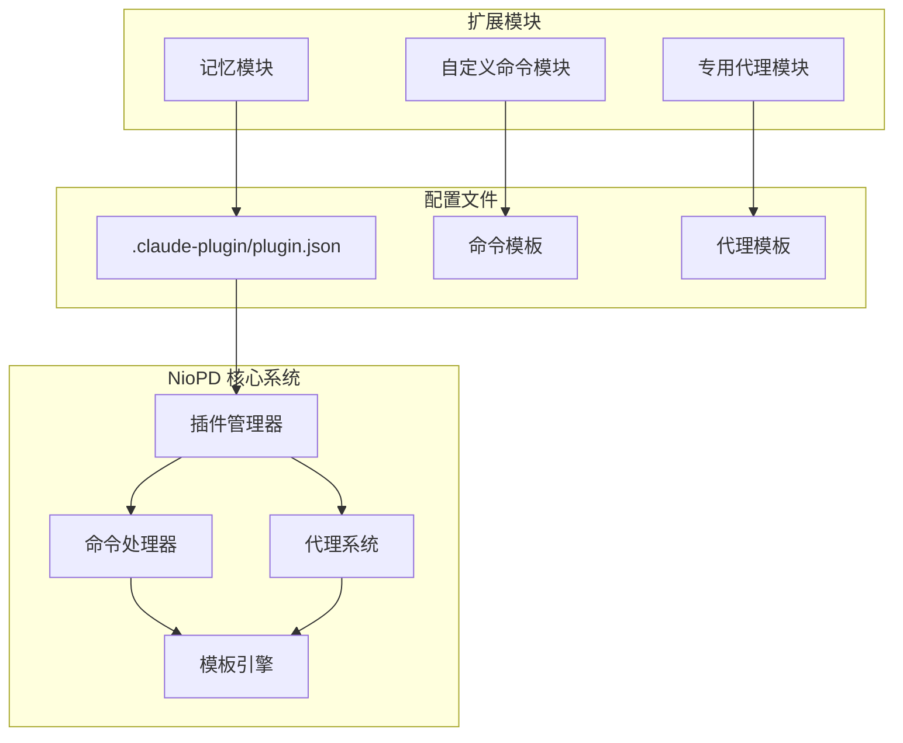
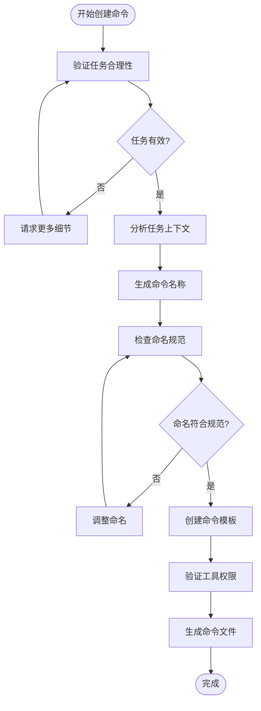
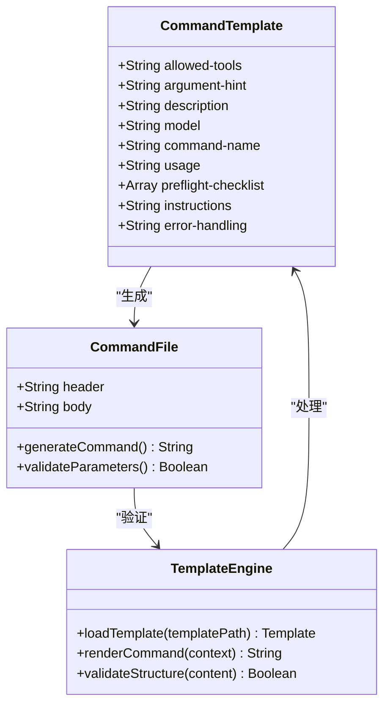
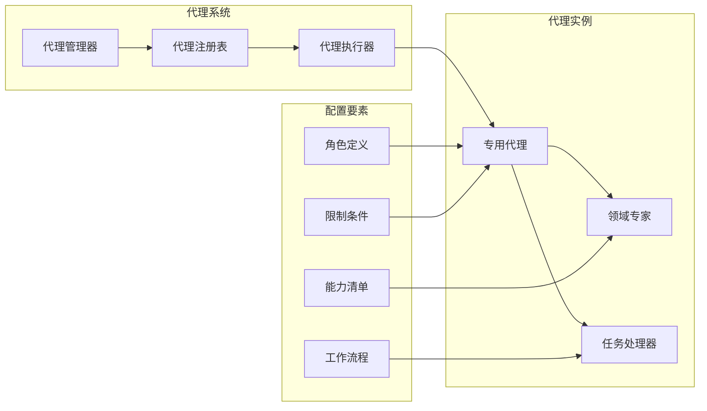
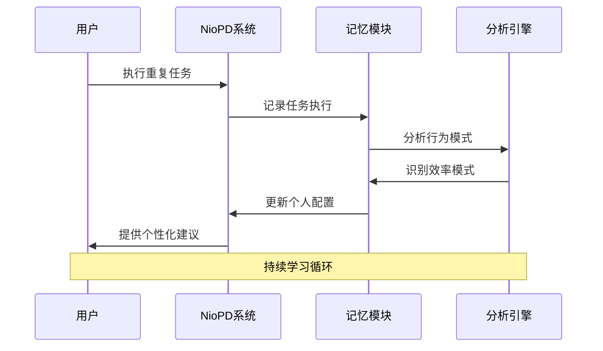
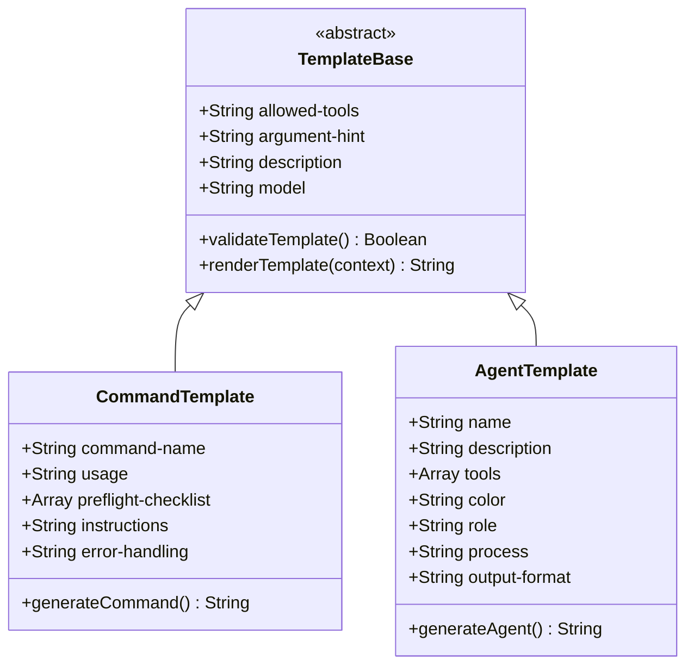
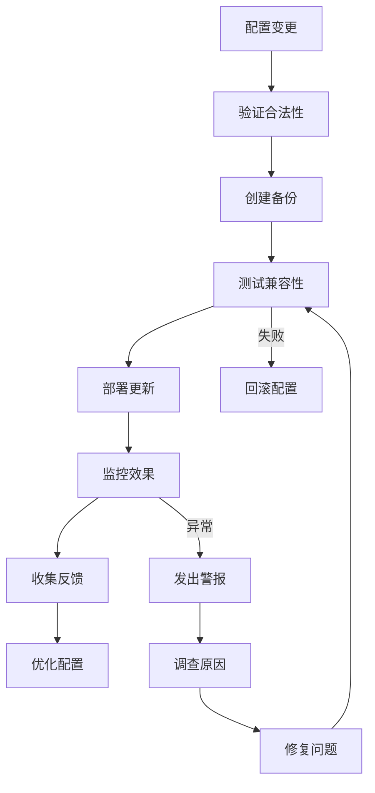
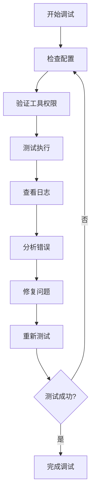

# 自定义配置

<cite>
**本文档中引用的文件**
- [new-command.md](file://niopd/commands/SYS/new-command.md)
- [new-agent.md](file://niopd/commands/SYS/new-agent.md)
- [new-memory.md](file://niopd/commands/SYS/new-memory.md)
- [command-template.md](file://niopd/templates/command-template.md)
- [agent-template.md](file://niopd/templates/agent-template.md)
- [plugin.json](file://niopd/.claude-plugin/plugin.json)
- [init.md](file://niopd/commands/SYS/init.md)
- [help.md](file://niopd/commands/SYS/help.md)
- [README.md](file://README.md)
</cite>

## 目录
1. [简介](#简介)
2. [系统架构概览](#系统架构概览)
3. [自定义命令创建 (/niopd:SYS:new-command)](#自定义命令创建-niopdsysnew-command)
4. [专用AI代理创建 (/niopd:SYS:new-agent)](#专用ai代理创建-niopdsysnew-agent)
5. [个人工作习惯记录 (/niopd:SYS:new-memory)](#个人工作习惯记录-niopdsysnew-memory)
6. [配置模板系统](#配置模板系统)
7. [最佳实践指南](#最佳实践指南)
8. [安全注意事项](#安全注意事项)
9. [调试技巧](#调试技巧)
10. [故障排除](#故障排除)

## 简介

NioPD (Nio Product Director) 是一个专为 Claude Code 设计的 AI 驱动产品管理工具包，提供了强大的自定义扩展配置功能。通过三个核心指令，用户可以创建自定义命令、专用AI代理和记录个人工作习惯，从而构建个性化的智能工作环境。

### 核心特性

- **模块化扩展**：支持创建独立的功能模块
- **AI代理网络**：可定制的专业领域专家
- **智能学习**：基于个人工作习惯的自适应优化
- **标准化模板**：统一的配置格式和命名规范

## 系统架构概览

NioPD 采用插件化架构，通过 `.claude-plugin/plugin.json` 配置文件管理扩展模块：



**图表来源**
- [plugin.json](file://niopd/.claude-plugin/plugin.json#L1-L15)
- [new-command.md](file://niopd/commands/SYS/new-command.md#L1-L20)
- [new-agent.md](file://niopd/commands/SYS/new-agent.md#L1-L20)

**章节来源**
- [plugin.json](file://niopd/.claude-plugin/plugin.json#L1-L15)
- [README.md](file://README.md#L1-L100)

## 自定义命令创建 (/niopd:SYS:new-command)

### 完整创建流程

使用 `/niopd:SYS:new-command` 指令可以基于重复性任务自动生成自定义命令，实现工作流的自动化和标准化。

#### 1. 命名规范

自定义命令遵循严格的命名约定：



**图表来源**
- [new-command.md](file://niopd/commands/SYS/new-command.md#L25-L50)

#### 2. 参数定义

命令参数通过 YAML frontmatter 定义：

| 参数 | 类型 | 必需 | 描述 | 示例 |
|------|------|------|------|------|
| `allowed-tools` | Array | 是 | 命令可用的工具列表 | `Bash(git add:*), Read(*)` |
| `argument-hint` | String | 否 | 参数提示信息 | `[task description] \| Create a new command` |
| `description` | String | 是 | 命令功能描述 | `Create a new command based on recent task context` |
| `model` | String | 否 | 使用的AI模型 | `Qwen3-Coder` |

#### 3. 模板关联

命令模板结构：



**图表来源**
- [command-template.md](file://niopd/templates/command-template.md#L1-L27)
- [new-command.md](file://niopd/commands/SYS/new-command.md#L40-L70)

**章节来源**
- [new-command.md](file://niopd/commands/SYS/new-command.md#L1-L96)
- [command-template.md](file://niopd/templates/command-template.md#L1-L27)

## 专用AI代理创建 (/niopd:SYS:new-agent)

### 代理角色定义

专用AI代理是针对特定业务领域的智能助手，具有明确的角色边界和专业能力。

#### 1. 代理架构设计



**图表来源**
- [new-agent.md](file://niopd/commands/SYS/new-agent.md#L25-L50)
- [agent-template.md](file://niopd/templates/agent-template.md#L1-L30)

#### 2. 知识库配置

代理的知识库通过以下方式配置：

| 配置项 | 类型 | 描述 | 示例 |
|--------|------|------|------|
| `name` | String | 代理名称 | `niopd-market-research` |
| `description` | String | 代理功能描述 | `专门处理市场研究分析的AI代理` |
| `tools` | Array | 可用工具列表 | `["Read(*)", "Write(*)", "Bash(*)"]` |
| `model` | String | AI模型选择 | `inherit` |
| `color` | String | 代理标识色 | `blue` |

#### 3. 权限设置

代理权限通过 YAML 配置严格控制：

```yaml
# 代理权限配置示例
permissions:
  - read: ["*.md", "*.json"]
  - write: ["reports/", "docs/"]
  - execute: ["scripts/analyze-*"]
  - network: ["api.openai.com", "api.marketresearch.com"]
```

**章节来源**
- [new-agent.md](file://niopd/commands/SYS/new-agent.md#L1-L85)
- [agent-template.md](file://niopd/templates/agent-template.md#L1-L73)

## 个人工作习惯记录 (/niopd:SYS:new-memory)

### 记录机制

个人工作习惯记录系统通过分析用户行为模式，自动识别和记录高效的工作习惯。

#### 1. 习惯分类体系

```mermaid
mindmap
root((工作习惯))
效率模式
快速决策
批量处理
工具自动化
时间块管理
质量实践
深度思考
多轮验证
文档驱动
迭代优化
工作流偏好
结构化思考
数据驱动
用户中心
战略导向
决策框架
优先级排序
风险评估
成本效益
长期价值
```

**图表来源**
- [new-memory.md](file://niopd/commands/SYS/new-memory.md#L45-L60)

#### 2. 记忆存储格式

习惯记录采用结构化 Markdown 格式：

```markdown
# 个人工作习惯记忆

## 效率模式
### 快速原型制作
- **模式**: 使用现成模板快速创建文档初稿
- **上下文**: 需要快速产出但质量要求不高的场景
- **收益**: 节省30%的初始创作时间
- **示例**: PRD草稿生成时直接使用标准模板

## 质量实践
### 深度用户研究
- **模式**: 在功能设计前至少进行3轮用户访谈
- **上下文**: 新功能开发前的用户调研阶段
- **收益**: 提高功能成功率至85%
- **示例**: 移动端重设计项目中进行的5次用户访谈
```

#### 3. 自动化学习

系统通过以下机制实现智能学习：



**图表来源**
- [new-memory.md](file://niopd/commands/SYS/new-memory.md#L25-L50)

**章节来源**
- [new-memory.md](file://niopd/commands/SYS/new-memory.md#L1-L92)

## 配置模板系统

### 命令模板结构

所有自定义命令都基于标准化模板创建：



**图表来源**
- [command-template.md](file://niopd/templates/command-template.md#L1-L27)
- [agent-template.md](file://niopd/templates/agent-template.md#L1-L73)

### 模板变量系统

模板支持动态变量替换：

| 变量名 | 描述 | 示例值 |
|--------|------|--------|
| `{{IDE_TYPE}}` | IDE类型标识 | `claude` |
| `{{DATE}}` | 当前日期 | `20241201` |
| `{{USER_NAME}}` | 用户姓名 | `张三` |
| `{{PROJECT_NAME}}` | 项目名称 | `mobile-redesign` |

**章节来源**
- [command-template.md](file://niopd/templates/command-template.md#L1-L27)
- [agent-template.md](file://niopd/templates/agent-template.md#L1-L73)

## 最佳实践指南

### 1. 命令设计原则

- **单一职责**：每个命令只解决一个具体问题
- **幂等性**：重复执行应产生相同结果
- **错误处理**：完善的异常情况处理机制
- **文档完整性**：提供清晰的使用说明和示例

### 2. 代理开发规范

- **角色边界**：明确代理的专业领域
- **能力声明**：准确描述可用工具和权限
- **交互模式**：标准化的用户交互流程
- **性能优化**：避免不必要的资源消耗

### 3. 记忆系统运用

- **定期回顾**：每周检查和更新习惯记录
- **场景匹配**：根据具体场景应用相应习惯
- **持续优化**：基于反馈不断改进工作模式
- **知识共享**：将有效习惯分享给团队

### 4. 配置管理策略



## 安全注意事项

### 1. 权限控制

- **最小权限原则**：只授予必要的工具访问权限
- **沙箱隔离**：敏感操作应在受控环境中执行
- **审计日志**：记录所有配置变更和执行操作
- **访问控制**：实施基于角色的访问管理

### 2. 数据保护

- **隐私合规**：遵守相关数据保护法规
- **敏感信息**：避免在配置中暴露机密信息
- **传输安全**：使用加密通道传输配置文件
- **存储安全**：实施适当的文件权限控制

### 3. 代码安全

- **输入验证**：严格验证所有用户输入
- **注入防护**：防止恶意代码注入
- **依赖管理**：定期更新和审查依赖项
- **漏洞扫描**：定期进行安全漏洞评估

## 调试技巧

### 1. 命令调试

使用以下方法调试自定义命令：

```bash
# 启用详细日志
export NIO_DEBUG=true

# 测试命令语法
/niopd:SYS:new-command --dry-run "测试命令"

# 验证模板渲染
/niopd:SYS:new-command --preview "测试命令"
```

### 2. 代理调试

代理调试的关键步骤：



### 3. 记忆系统调试

记忆系统的调试要点：

- **数据完整性**：检查习惯记录是否正确保存
- **模式识别**：验证习惯分类的准确性
- **学习效果**：评估系统响应的个性化程度
- **性能影响**：监控记忆系统对整体性能的影响

## 故障排除

### 常见问题及解决方案

#### 1. 命令创建失败

**问题症状**：`/niopd:SYS:new-command` 执行后无响应或报错

**排查步骤**：
1. 检查最近是否有已完成的任务记录
2. 验证 `.{{IDE_TYPE}}/{{IDE_TYPE}}.md` 文件是否存在
3. 确认用户语言偏好设置
4. 检查磁盘空间和文件权限

**解决方案**：
```bash
# 手动创建必需文件
echo "# NioPD 工作原则" > .claude/.claude.md
echo "## 通信偏好" >> .claude/.claude.md
echo "首选通信语言: 中文" >> .claude/.claude.md
```

#### 2. 代理配置错误

**问题症状**：代理无法正常启动或执行

**排查步骤**：
1. 验证代理配置文件格式
2. 检查工具权限设置
3. 确认依赖项可用性
4. 查看代理日志输出

**解决方案**：
```yaml
# 修正权限配置
permissions:
  read: ["*.md", "*.json", "templates/"]
  write: ["reports/", "docs/"]
  execute: ["scripts/*"]
```

#### 3. 记忆系统异常

**问题症状**：个人习惯记录不准确或丢失

**排查步骤**：
1. 检查记忆文件读写权限
2. 验证习惯分类逻辑
3. 确认数据持久化机制
4. 检查内存占用情况

**解决方案**：
```bash
# 重置记忆系统
rm -rf ~/.nio_memory/
mkdir -p ~/.nio_memory/
echo "# 个人工作习惯记忆" > ~/.nio_memory/memory.md
```

### 性能优化建议

#### 1. 系统性能调优

- **内存管理**：定期清理临时文件和缓存
- **并发控制**：限制同时运行的代理数量
- **资源监控**：实时监控CPU和内存使用情况
- **垃圾回收**：优化对象生命周期管理

#### 2. 扩展性能优化

- **懒加载**：按需加载扩展模块
- **缓存策略**：实现智能缓存机制
- **预编译**：对频繁使用的组件进行预编译
- **负载均衡**：分散计算负载到多个节点

**章节来源**
- [init.md](file://niopd/commands/SYS/init.md#L150-L195)
- [help.md](file://niopd/commands/SYS/help.md#L100-L148)

## 结论

NioPD 的自定义配置系统为用户提供了强大而灵活的扩展能力。通过合理使用 `/niopd:SYS:new-command`、`/niopd:SYS:new-agent` 和 `/niopd:SYS:new-memory` 三个核心指令，用户可以：

- **提高工作效率**：通过自动化重复性任务
- **增强专业能力**：通过专用AI代理的专业分析
- **优化工作流程**：通过个人习惯的系统化管理
- **构建智能环境**：通过模块化的系统扩展

成功的自定义配置需要遵循最佳实践，注意安全事项，并掌握有效的调试技巧。随着系统的不断发展，这些配置功能将继续演进，为用户提供更加智能和个性化的体验。