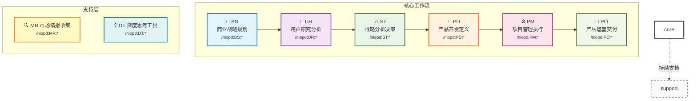

# NioPD工作流架构详解

<cite>
**本文档引用的文件**
- [README.md](file://README.md)
- [niopd/templates/README.md](file://niopd/templates/README.md)
- [niopd/commands/SYS/init.md](file://niopd/commands/SYS/init.md)
- [niopd/commands/BS/new-initiative.md](file://niopd/commands/BS/new-initiative.md)
- [niopd/commands/ST/swot.md](file://niopd/commands/ST/swot.md)
- [niopd/commands/PD/draft-prd.md](file://niopd/commands/PD/draft-prd.md)
- [niopd/commands/PM/agile-planning.md](file://niopd/commands/PM/agile-planning.md)
- [niopd/commands/PO/north-star.md](file://niopd/commands/PO/north-star.md)
- [niopd/commands/MR/competitor.md](file://niopd/commands/MR/competitor.md)
- [niopd/commands/DT/scenarios.md](file://niopd/commands/DT/scenarios.md)
- [niopd/commands/UR/interview.md](file://niopd/commands/UR/interview.md)
</cite>

## 目录
1. [概述](#概述)
2. [核心工作流架构](#核心工作流架构)
3. [阶段详解](#阶段详解)
4. [支持层分析](#支持层分析)
5. [依赖关系与信息流动](#依赖关系与信息流动)
6. [工作场景示例](#工作场景示例)
7. [最佳实践指南](#最佳实践指南)
8. [总结](#总结)

## 概述

NioPD（Nio Product Director）是一个AI驱动的产品管理工具包，采用端到端的工作流架构，从商业战略规划到产品交付运营形成完整的闭环。该架构遵循"BS→UR→ST→PD→PM→PO"主线流程，同时MR（市场研究）和DT（深度思考工具）作为支持层贯穿始终。

### 核心设计理念

NioPD的工作流架构基于以下核心原则：

1. **文档驱动的产品管理**：每个阶段都产生结构化的文档，确保知识可追溯性和决策透明度
2. **方法论内置**：每个指令都基于产品管理界的经典方法论
3. **思考优先，执行其次**：强调先深度思考，再系统执行
4. **AI协同工作**：通过Nio AI助手提供智能引导和深度思考工具

## 核心工作流架构



**图表来源**
- [README.md](file://README.md#L127-L161)

### 目录结构设计

NioPD采用四层目录结构，每一层对应不同的文档生命周期：

| 目录 | 用途 | 输出内容 | 示例文件 |
|------|------|----------|----------|
| `sources/` | 思考源材料层 | 头脑风暴、深度思考记录 | `[date]-brainstorm-discussion.md` |
| `reports/` | 数据分析报告层 | 用户研究、市场分析、战略分析 | `[date]-user-feedback-summary.md` |
| `docs/` | 决策文档层 | 产品需求文档、运营方案 | `[date]-<initiative>-prd-v1.md` |
| `plans/` | 执行计划层 | 项目计划、发布计划 | `[date]-<initiative>-pid-v1.md` |

**章节来源**
- [README.md](file://README.md#L162-L250)
- [niopd/templates/README.md](file://niopd/templates/README.md#L1-L50)

## 阶段详解

### BS - 商业战略规划（Business Strategy）

**核心目标**：从想法生成到产品方向规划，确定项目的商业价值和战略定位。

**输入**：市场机会、用户洞察、技术可行性

**输出**：项目立项文档（Initiative Document）

**核心方法论**：
- **头脑风暴（Brainstorming）**：Alex Osborn的创意思维技术
- **机会画布（Opportunity Canvas）**：识别市场机会和空白
- **Socratic Questioning**：苏格拉底式提问引导

**典型工作流程**：
1. **想法收集**：通过`/niopd:BS:note`记录灵感
2. **头脑风暴**：使用`/niopd:BS:hi`进行深度对话
3. **机会识别**：通过`/niopd:BS:market-opportunity`分析市场机会
4. **立项创建**：使用`/niopd:BS:new-initiative`创建结构化立项文档

**章节来源**
- [niopd/commands/BS/new-initiative.md](file://niopd/commands/BS/new-initiative.md#L1-L100)

### UR - 用户研究分析（User Research）

**核心目标**：深入了解用户需求、行为和痛点，为产品设计提供依据。

**输入**：用户反馈、访谈记录、行为数据

**输出**：用户画像、用户旅程地图、需求分析报告

**核心方法论**：
- **Jobs-to-be-Done (JTBD)**：理解用户雇佣产品完成的任务
- **Kano模型**：功能优先级分类
- **用户访谈分析**：定性研究和主题分析
- **行为数据分析**：用户使用模式识别

**典型工作流程**：
1. **反馈分析**：使用`/niopd:UR:feedback`分析用户反馈
2. **访谈总结**：使用`/niopd:UR:interview`总结访谈记录
3. **用户画像**：使用`/niopd:UR:personas`创建用户画像
4. **旅程映射**：使用`/niopd:UR:journey`映射用户旅程

**章节来源**
- [niopd/commands/UR/interview.md](file://niopd/commands/UR/interview.md#L1-L150)

### ST - 战略分析决策（Strategy Analysis）

**核心目标**：基于数据和框架的战略决策，评估项目可行性和竞争优势。

**输入**：用户研究结果、市场研究数据、竞争分析

**输出**：战略分析报告（SWOT、波特五力等）

**核心方法论**：
- **SWOT分析**：Strengths, Weaknesses, Opportunities, Threats
- **波特五力模型**：行业竞争结构分析
- **PEST分析**：宏观环境扫描
- **商业画布**：商业模式验证

**典型工作流程**：
1. **SWOT分析**：使用`/niopd:ST:swot`进行全面分析
2. **竞争分析**：使用`/niopd:ST:porters-five-forces`分析行业竞争
3. **商业画布**：使用`/niopd:ST:canvas`验证商业模式
4. **RICE评估**：使用`/niopd:ST:rice`评估项目优先级

**章节来源**
- [niopd/commands/ST/swot.md](file://niopd/commands/ST/swot.md#L1-L200)

### PD - 产品开发定义（Product Development）

**核心目标**：将洞察转化为具体的产品需求和设计方案。

**输入**：战略分析结果、用户研究洞察、技术可行性

**输出**：产品需求文档（PRD）、用户故事、业务流程图

**核心方法论**：
- **MRD/PSD/PRD三层文档体系**：市场→战略→执行的完整链条
- **用户故事**：敏捷需求格式
- **业务流程建模**：PlantUML和Mermaid语法
- **验收标准**：可测试的需求定义

**典型工作流程**：
1. **MRD创建**：市场要求文档
2. **PSD创建**：产品策略文档
3. **PRD创建**：产品需求文档
4. **用户故事**：详细需求描述
5. **业务流程**：工作流程可视化

**章节来源**
- [niopd/commands/PD/draft-prd.md](file://niopd/commands/PD/draft-prd.md#L1-L150)

### PM - 项目管理执行（Project Management）

**核心目标**：规划、执行和跟踪项目进展，确保产品按时高质量交付。

**输入**：PRD文档、资源情况、风险评估

**输出**：项目计划文档、进度跟踪、风险管理

**核心方法论**：
- **敏捷规划**：Scrum和看板方法
- **DACI框架**：责任分配矩阵
- **KPI跟踪**：关键绩效指标监控
- **风险管理**：风险识别和缓解

**典型工作流程**：
1. **敏捷规划**：使用`/niopd:PM:agile-planning`制定冲刺计划
2. **KPI设置**：使用`/niopd:PM:kpis`定义关键指标
3. **资源规划**：使用`/niopd:PM:resources`进行资源分配
4. **风险分析**：使用`/niopd:PM:risk-analysis`识别风险

**章节来源**
- [niopd/commands/PM/agile-planning.md](file://niopd/commands/PM/agile-planning.md#L1-L200)

### PO - 产品运营交付（Product Operations）

**核心目标**：产品发布后的持续优化和运营，确保产品价值最大化。

**输入**：产品上线、用户反馈、运营数据

**输出**：运营文档、北极星指标、客户成功方案

**核心方法论**：
- **北极星指标**：单一核心价值指标
- **AARRR模型**：用户生命周期分析
- **客户成功**：用户成功和留存策略
- **FAQ管理**：常见问题解答

**典型工作流程**：
1. **北极星指标**：使用`/niopd:PO:north-star`定义核心指标
2. **AARRR分析**：使用`/niopd:PO:aarrr-metrics`分析用户生命周期
3. **客户成功**：使用`/niopd:PO:customer-success`制定成功策略
4. **FAQ管理**：使用`/niopd:PO:faq`创建常见问题文档

**章节来源**
- [niopd/commands/PO/north-star.md](file://niopd/commands/PO/north-star.md#L1-L200)

## 支持层分析

### MR - 市场研究（Market Research）

**核心目标**：提供并行情报支持，帮助产品团队了解市场环境和竞争格局。

**输入**：竞争对手网站、市场数据、行业报告

**输出**：市场分析报告、竞争对比、趋势预测

**核心功能**：
- **竞争对手分析**：使用`/niopd:MR:competitor`分析竞品
- **市场定位**：使用`/niopd:MR:positioning`制定差异化策略
- **趋势研究**：使用`/niopd:MR:trends`识别行业趋势
- **客户细分**：使用`/niopd:MR:segmentation`分析目标市场

**支持机制**：
MR作为并行支持层，在整个工作流中持续提供市场情报，帮助各阶段做出更明智的决策。

### DT - 深度思考工具（Deep Thinking）

**核心目标**：提供认知工具，帮助团队突破表面问题，找到根本原因和创新解决方案。

**输入**：问题定义、假设、背景信息

**输出**：深度分析报告、创新解决方案

**核心工具**：
- **第一性原理**：使用`/niopd:DT:first-principles`分解问题到基本要素
- **五个为什么**：使用`/niopd:DT:five-whys`进行根因分析
- **场景规划**：使用`/niopd:DT:scenarios`探索未来可能性
- **苏格拉底式提问**：使用`/niopd:DT:socratic-questioning`引导思考

**支持机制**：
DT工具可以在任何阶段被调用，深化分析和促进创新思考。

**章节来源**
- [niopd/commands/MR/competitor.md](file://niopd/commands/MR/competitor.md#L1-L150)
- [niopd/commands/DT/scenarios.md](file://niopd/commands/DT/scenarios.md#L1-L150)

## 依赖关系与信息流动

```mermaid
flowchart TD
A["BS: 商业战略<br/>→ Initiation Document"] --> B["UR: 用户研究<br/>→ User Insights"]
B --> C["ST: 战略分析<br/>→ Strategic Decisions"]
C --> D["PD: 产品开发<br/>→ PRD Documents"]
D --> E["PM: 项目管理<br/>→ Execution Plans"]
E --> F["PO: 产品运营<br/>→ Operational Results"]
G["MR: 市场研究<br/>→ Market Intelligence"] -.→ A
G -.→ C
G -.→ D
H["DT: 深度思考<br/>→ Strategic Insights"] -.→ A
H -.→ B
H -.→ C
H -.→ D
H -.→ E
H -.→ F
style A fill:#e1f5fe
style B fill:#f3e5f5
style C fill:#e8f5e8
style D fill:#fff3e0
style E fill:#fce4ec
style F fill:#f1f8e9
style G fill:#fff9c4
style H fill:#e0f2f1
```

### 信息流向

1. **自上而下的指导**：BS→ST→PD→PM→PO形成战略指导链
2. **自下而上的反馈**：UR→ST→BS形成用户洞察反馈
3. **并行支持**：MR和DT在整个流程中提供持续支持
4. **循环迭代**：PO阶段的运营反馈可以回流到上游阶段

### 依赖关系

| 阶段 | 直接输入 | 间接输入 | 输出依赖 |
|------|----------|----------|----------|
| BS | 市场机会、技术可行性 | DT:场景规划 | Initiation Document |
| UR | 用户反馈、访谈记录 | MR:竞争分析 | User Insights |
| ST | 用户洞察、市场数据 | UR:用户研究 | Strategic Analysis |
| PD | 战略决策、用户需求 | ST:战略分析 | PRD Documents |
| PM | PRD文档、资源情况 | PD:产品开发 | Execution Plans |
| PO | 产品上线、运营数据 | PM:项目管理 | Operational Results |

## 工作场景示例

### 场景1：新产品立项

**背景**：团队发现移动应用用户留存率低的问题，决定开发新功能提升用户体验。

**工作流程**：

1. **BS阶段**：
   - 使用`/niopd:BS:market-opportunity`分析市场机会
   - 使用`/niopd:BS:new-initiative "用户留存提升"`创建立项文档
   - 使用`/niopd:DT:scenarios`探索未来用户行为变化

2. **UR阶段**：
   - 使用`/niopd:UR:feedback`分析用户反馈
   - 使用`/niopd:UR:interview`进行深度用户访谈
   - 使用`/niopd:UR:personas`创建用户画像

3. **ST阶段**：
   - 使用`/niopd:ST:swot`进行全面SWOT分析
   - 使用`/niopd:ST:porters-five-forces`分析行业竞争
   - 使用`/niopd:DT:first-principles`进行根本原因分析

4. **PD阶段**：
   - 使用`/niopd:PD:draft-prd`创建产品需求文档
   - 使用`/niopd:PD:stories`生成用户故事
   - 使用`/niopd:PD:process`绘制业务流程

5. **PM阶段**：
   - 使用`/niopd:PM:agile-planning`制定开发计划
   - 使用`/niopd:PM:kpis`定义关键指标
   - 使用`/niopd:PM:risk-analysis`识别风险

6. **PO阶段**：
   - 使用`/niopd:PO:north-star`定义北极星指标
   - 使用`/niopd:PO:aarrr-metrics`分析用户生命周期
   - 使用`/niopd:PO:customer-success`制定成功策略

### 场景2：功能优化迭代

**背景**：现有搜索功能使用率低，需要优化提升用户体验。

**工作流程**：

1. **数据收集**：
   - 使用`/niopd:UR:behavior`分析用户行为
   - 使用`/niopd:UR:satisfaction`测量用户满意度
   - 使用`/niopd:MR:compare`分析竞品搜索体验

2. **问题分析**：
   - 使用`/niopd:DT:five-whys`进行根因分析
   - 使用`/niopd:ST:swot`评估优化机会
   - 使用`/niopd:DT:scenarios`预测未来需求变化

3. **方案设计**：
   - 使用`/niopd:PD:draft-prd`更新产品需求
   - 使用`/niopd:PD:journey`重新设计用户旅程
   - 使用`/niopd:PD:wireframe`创建界面原型

4. **实施计划**：
   - 使用`/niopd:PM:agile-planning`安排开发任务
   - 使用`/niopd:PM:dependencies`识别依赖关系
   - 使用`/niopd:PM:resources`规划资源分配

5. **效果评估**：
   - 使用`/niopd:PO:north-star`监控核心指标
   - 使用`/niopd:PO:customer-success`跟踪用户成功
   - 使用`/niopd:PO:faq`更新常见问题

## 最佳实践指南

### 1. 文档版本管理

- **命名规范**：遵循`[YYYYMMDD]-[identifier]-[document-type]-v[version].md`格式
- **版本控制**：每次迭代都创建新版本，保留历史记录
- **交叉引用**：在文档中引用相关文件，建立知识网络

### 2. 阶段间协作

- **定期同步**：各阶段负责人定期沟通，确保信息一致
- **反馈循环**：PO阶段的运营反馈及时回流到上游
- **跨团队协作**：建立跨职能团队，促进知识共享

### 3. 工具使用策略

- **选择性使用**：根据项目特点选择合适的工具和方法
- **深度应用**：深入掌握核心工具，避免浅尝辄止
- **持续优化**：根据实际效果调整使用策略

### 4. 质量保证

- **同行评审**：重要文档进行团队评审
- **验证测试**：通过小规模测试验证假设
- **持续改进**：基于实际效果不断优化流程

### 5. AI辅助使用

- **主动引导**：充分利用Nio的苏格拉底式提问
- **深度思考**：积极使用DT工具进行根本原因分析
- **知识捕获**：重视Nio自动记录的思考过程

## 总结

NioPD的工作流架构体现了现代产品管理的最佳实践，通过BS→UR→ST→PD→PM→PO的主线流程，结合MR和DT的支持层，形成了一个完整、闭环的产品管理生态系统。

### 核心优势

1. **系统性**：完整的端到端工作流，覆盖产品生命周期的每个阶段
2. **方法论驱动**：内置20+种经典产品管理方法论
3. **AI协同**：智能助手提供深度思考和引导
4. **文档驱动**：结构化文档确保知识可追溯性
5. **灵活适应**：支持多种项目类型和复杂度

### 实施建议

1. **渐进式采用**：根据团队成熟度逐步引入各个阶段
2. **文化培育**：培养文档驱动和数据导向的文化
3. **技能培训**：确保团队成员掌握相关方法论
4. **工具整合**：将NioPD与其他工具链有效集成
5. **持续优化**：基于实际效果不断调整和优化

通过遵循NioPD的工作流架构，产品团队可以建立更加科学、系统的产品管理体系，提高决策质量，加速产品创新，最终实现更好的商业成果。