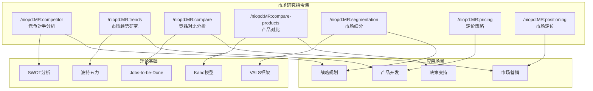
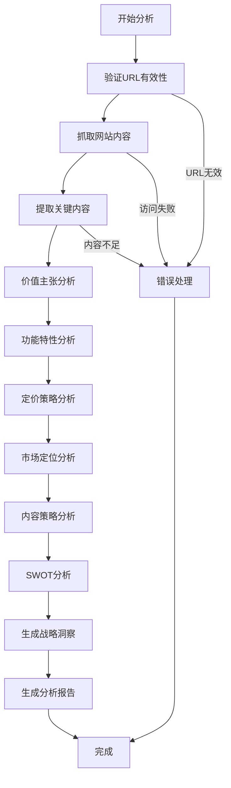
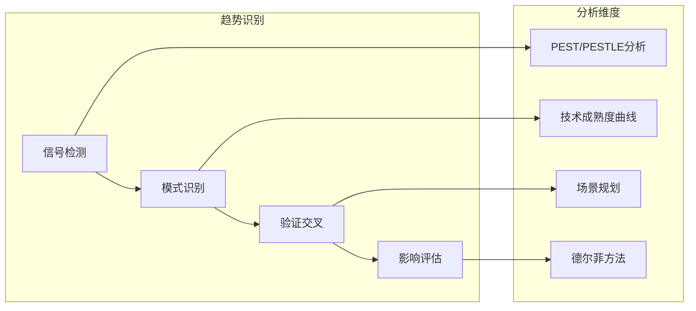
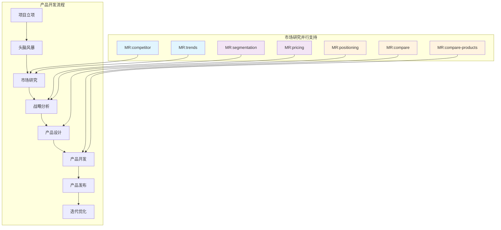

# 市场研究工具

<cite>
**本文档中引用的文件**
- [competitor.md](file://niopd/commands/MR/competitor.md)
- [trends.md](file://niopd/commands/MR/trends.md)
- [compare-products.md](file://niopd/commands/MR/compare-products.md)
- [segmentation.md](file://niopd/commands/MR/segmentation.md)
- [pricing.md](file://niopd/commands/MR/pricing.md)
- [positioning.md](file://niopd/commands/MR/positioning.md)
- [compare.md](file://niopd/commands/MR/compare.md)
- [market-research-template.md](file://niopd/templates/market-research-template.md)
- [competitor-analysis-template.md](file://niopd/templates/competitor-analysis-template.md)
- [README.md](file://README.md)
</cite>

## 目录
1. [简介](#简介)
2. [市场研究指令集概览](#市场研究指令集概览)
3. [核心指令深度解析](#核心指令深度解析)
4. [理论基础与方法论](#理论基础与方法论)
5. [协同工作机制](#协同工作机制)
6. [实际应用场景](#实际应用场景)
7. [常见问题解决方案](#常见问题解决方案)
8. [总结](#总结)

## 简介

NioPD的市场研究(MR)指令集是一个完整的并行情报系统，为产品管理的各个阶段提供深度的市场洞察和战略决策支持。该系统通过7个核心指令，构建了一个覆盖从竞争对手分析到市场定位的全方位市场研究框架，贯穿产品生命周期的每个关键节点。

市场研究指令集的核心价值在于：
- **并行情报收集**：在产品开发的各个阶段同时进行市场情报收集
- **结构化分析**：基于经典战略管理理论的系统化分析框架
- **决策支持**：为产品定位、定价、市场细分等关键决策提供数据支撑
- **方法论驱动**：内置20+个经过验证的战略分析框架和方法论

## 市场研究指令集概览



**图表来源**
- [competitor.md](file://niopd/commands/MR/competitor.md#L1-L50)
- [trends.md](file://niopd/commands/MR/trends.md#L1-L50)
- [positioning.md](file://niopd/commands/MR/positioning.md#L1-L50)

**章节来源**
- [competitor.md](file://niopd/commands/MR/competitor.md#L1-L100)
- [trends.md](file://niopd/commands/MR/trends.md#L1-L100)
- [positioning.md](file://niopd/commands/MR/positioning.md#L1-L100)

## 核心指令深度解析

### /niopd:MR:competitor - 竞争对手深度剖析

**理论基础与框架**

`/niopd:MR:competitor`指令基于多维度的竞争分析框架，采用系统化的结构化分析方法：

1. **价值主张分析**：深入理解竞争对手的市场定位和核心价值
2. **产品功能评估**：全面梳理竞争对手的功能特性和技术能力
3. **定价策略分析**：研究竞争对手的商业模式和盈利策略
4. **市场定位评估**：分析竞争对手的市场地位和竞争优势
5. **SWOT综合评估**：基于收集的信息进行全面的战略评估

**分析流程**



**图表来源**
- [competitor.md](file://niopd/commands/MR/competitor.md#L50-L150)

**使用场景与价值**

- **市场进入前**：了解新市场的竞争格局和进入壁垒
- **产品规划时**：识别差异化机会和避免直接竞争
- **战略调整时**：评估竞争对手的动态和潜在威胁
- **融资准备时**：为投资者提供详尽的市场竞争分析

**章节来源**
- [competitor.md](file://niopd/commands/MR/competitor.md#L1-L282)

### /niopd:MR:trends - 市场趋势识别与分析

**理论基础与分类体系**

市场趋势分析采用多层次的趋势分类体系：

1. **宏观趋势（Macro Trends）**：行业级别的重大变革（5-10年周期）
2. **微观趋势（Micro Trends）**：新兴的市场现象和消费者行为变化（1-5年周期）
3. **巨观趋势（Mega Trends）**：长期的全球性变化（10-30年周期）

**分析框架**



**图表来源**
- [trends.md](file://niopd/commands/MR/trends.md#L20-L80)

**章节来源**
- [trends.md](file://niopd/commands/MR/trends.md#L1-L282)

### /niopd:MR:compare - 竞品对比分析

**多维度对比框架**

`/niopd:MR:compare`指令提供系统化的竞品对比分析：

1. **产品功能对比**：功能矩阵和能力评估
2. **定价策略分析**：价格模型和价值定位
3. **市场覆盖分析**：地理分布和客户群体
4. **创新能力评估**：研发投入和技术领先度
5. **品牌影响力分析**：市场认知度和用户忠诚度

**章节来源**
- [compare.md](file://niopd/commands/MR/compare.md#L1-L336)

### /niopd:MR:segmentation - 市场细分分析

**细分理论与方法**

市场细分基于多种理论基础：

1. **人口统计学细分**：年龄、性别、收入、教育等
2. **地理细分**：地理位置、气候、城市化程度
3. **心理细分**：生活方式、价值观、个性特征
4. **行为细分**：使用频率、品牌忠诚度、购买动机
5. **需求细分**：Jobs-to-be-Done理论的应用

**筛选标准（5R原则）**

- **响应性（Responsive）**：细分市场对营销策略的反应
- **可接近性（Reachable）**：企业能否有效接触目标群体
- **现实性（Realistic）**：市场规模足够大且可盈利
- **相关性（Relevant）**：与企业战略目标一致
- **可识别性（Recognizable）**：能够被准确识别和测量

**章节来源**
- [segmentation.md](file://niopd/commands/MR/segmentation.md#L1-L275)

### /niopd:MR:pricing - 定价策略分析

**定价理论与模型**

定价分析融合了多种定价理论：

1. **成本导向定价**：基于成本加成的定价策略
2. **价值导向定价**：基于客户感知价值的定价
3. **竞争导向定价**：基于市场竞争状况的定价
4. **心理定价**：利用消费者心理的定价技巧

**现代定价模型**

- **订阅定价**：SaaS模式的定价策略
- **免费增值模式**：基础功能免费，高级功能收费
- **使用量定价**：按实际使用量收费
- **动态定价**：实时价格调整机制
- **捆绑定价**：多种产品组合销售

**章节来源**
- [pricing.md](file://niopd/commands/MR/pricing.md#L1-L387)

### /niopd:MR:positioning - 市场定位策略

**定位理论与框架**

市场定位基于Al Ries和Jack Trout的定位理论：

**经典定位公式**：
```
对于 [目标受众] 
谁 [需求陈述]
[产品名称] 是 [产品类别]
That [利益陈述]
Unlike [主要竞争对手]
我们的产品 [差异化声明]
```

**差异化维度**

1. **功能差异化**：技术性能和产品特性
2. **情感差异化**：用户体验和品牌情感连接
3. **自我表达差异化**：价值观和生活方式匹配
4. **社会影响差异化**：社会责任和环保意识

**章节来源**
- [positioning.md](file://niopd/commands/MR/positioning.md#L1-L419)

### /niopd:MR:compare-products - 产品横向对比

**产品对比分析框架**

该指令专注于多产品间的横向比较：

1. **功能对比矩阵**：系统化的产品功能评估
2. **价值主张对比**：不同产品定位的差异分析
3. **市场表现对比**：市场份额和用户评价
4. **技术架构对比**：底层技术能力和创新水平

**章节来源**
- [compare-products.md](file://niopd/commands/MR/compare-products.md#L1-L335)

## 理论基础与方法论

### 核心理论框架

市场研究指令集建立在多个经典战略管理理论之上：

```mermaid
mindmap
root((市场研究理论基础))
SWOT分析
优势
劣势
机会
威胁
波特五力
新进入者威胁
替代品威胁
供应商议价能力
购买者议价能力
竞争竞争强度
Jobs-to-be-Done
用户任务
解决方案
期望结果
Kano模型
基本需求
期望需求
兴奋需求
市场细分
人口统计
地理位置
心理特征
行为特征
定位理论
品牌定位
差异化策略
市场空隙
```

### 方法论集成

**1. 竞争分析方法论**

- **系统性分析**：基于SWOT框架的全面评估
- **结构化比较**：标准化的对比矩阵和评分体系
- **数据驱动**：基于实际市场数据和用户反馈
- **前瞻性视角**：结合趋势分析预测未来竞争格局

**2. 市场洞察方法论**

- **多源数据整合**：结合定量数据和定性洞察
- **跨维度分析**：从不同角度验证分析结论
- **情景规划**：考虑多种可能的市场发展路径
- **持续监控**：建立动态的市场情报收集机制

**3. 决策支持方法论**

- **框架驱动**：基于成熟理论框架的分析
- **证据基础**：以可靠数据和事实为基础
- **场景化思考**：考虑不同情境下的决策选择
- **风险评估**：全面评估各种决策选项的风险

## 协同工作机制

### 并行情报系统架构

市场研究指令集采用并行情报系统架构，在产品开发的各个阶段同时进行市场情报收集：



**图表来源**
- [README.md](file://README.md#L100-L200)

### 指令间协同关系

**1. 竞争对手分析与市场趋势结合**

- `/niopd:MR:competitor`提供具体的竞争情报
- `/niopd:MR:trends`提供宏观的市场背景
- 综合分析形成完整的竞争格局图景

**2. 定位策略与细分分析协同**

- `/niopd:MR:segmentation`识别目标市场
- `/niopd:MR:positioning`确定市场定位
- 两者结合形成精准的市场策略

**3. 定价分析与产品对比联动**

- `/niopd:MR:pricing`分析定价策略
- `/niopd:MR:compare-products`对比产品价值
- 综合形成产品组合和定价决策

### 生命周期各阶段应用

| 产品阶段 | 核心MR指令 | 主要输出 | 决策支持 |
|---------|-----------|---------|---------|
| **概念阶段** | `/niopd:MR:trends` | 市场趋势报告 | 机会识别 |
| **规划阶段** | `/niopd:MR:segmentation` | 市场细分报告 | 目标市场确定 |
| **设计阶段** | `/niopd:MR:competitor` | 竞品分析报告 | 差异化设计 |
| **开发阶段** | `/niopd:MR:positioning` | 定位策略 | 品牌策略 |
| **发布阶段** | `/niopd:MR:pricing` | 定价策略 | 收入模型 |
| **运营阶段** | `/niopd:MR:compare` | 对比分析报告 | 竞争策略 |

## 实际应用场景

### 场景一：新产品市场进入

**背景**：公司计划进入智能家居市场

**MR指令序列**：
1. `/niopd:MR:trends --topic="智能家居市场"` → 识别市场趋势和增长机会
2. `/niopd:MR:segmentation --product="智能家居" --market="中国家庭"` → 确定目标用户群体
3. `/niopd:MR:competitor --url=https://xiaomi.com/smart-home` → 分析主要竞争对手
4. `/niopd:MR:positioning --product="智能家居" --topic="智能家居"` → 制定市场定位策略
5. `/niopd:MR:pricing --product="智能家居" --market="智能家居"` → 设计定价策略

**输出成果**：
- 市场趋势分析报告
- 目标用户画像和细分报告
- 竞品对比分析和定位建议
- 定价策略和收入模型

### 场景二：产品功能优化

**背景**：需要优化现有产品的功能组合

**MR指令序列**：
1. `/niopd:MR:compare-products --product="现有产品" --competitors="竞品A,竞品B"` → 产品功能对比
2. `/niopd:MR:segmentation --product="现有产品" --method="行为"` → 用户使用行为分析
3. `/niopd:MR:pricing --product="现有产品" --competitors="竞品A,竞品B"` → 定价对比分析
4. `/niopd:MR:positioning --product="现有产品" --topic="现有产品"` → 定位策略评估

**输出成果**：
- 功能对比矩阵和优化建议
- 用户行为分析和功能优先级
- 定价策略调整建议
- 市场定位优化方案

### 场景三：市场扩张决策

**背景**：考虑进入东南亚市场

**MR指令序列**：
1. `/niopd:MR:trends --topic="东南亚科技市场"` → 区域市场趋势
2. `/niopd:MR:segmentation --market="东南亚"` → 地区市场细分
3. `/niopd:MR:competitor --url="目标市场主要玩家"` → 区域竞争格局
4. `/niopd:MR:positioning --topic="东南亚市场"` → 区域市场定位

**输出成果**：
- 东南亚市场趋势报告
- 地区市场细分和机会识别
- 区域竞争分析和进入策略
- 地区市场定位建议

## 常见问题解决方案

### 问题1：竞争对手信息不足

**症状**：无法获取竞争对手的详细信息

**解决方案**：
1. **多渠道信息收集**：除了官网，还可以分析：
   - 行业报告和分析
   - 用户评论和反馈
   - 技术博客和白皮书
   - 社交媒体和论坛讨论

2. **间接信息挖掘**：通过：
   - 行业新闻报道
   - 竞争对手招聘广告
   - 技术专利分析
   - 合作伙伴关系

3. **专家访谈**：联系行业专家或前员工获取内部信息

### 问题2：市场趋势难以识别

**症状**：无法准确判断市场发展方向

**解决方案**：
1. **多维度趋势分析**：
   - 技术发展趋势
   - 用户行为变化
   - 政策法规影响
   - 经济环境变化

2. **时间维度分析**：
   - 短期趋势（季度/年度）
   - 中期趋势（3-5年）
   - 长期趋势（5年以上）

3. **交叉验证**：通过多个来源验证趋势的可靠性

### 问题3：市场细分过于宽泛

**症状**：细分结果无法指导具体营销策略

**解决方案**：
1. **细化细分维度**：
   - 从宏观到微观逐步细化
   - 结合多个细分变量
   - 考虑细分间的重叠关系

2. **验证细分有效性**：
   - 检查细分的可测量性
   - 评估细分的可行动性
   - 验证细分的可区分性

3. **动态调整**：根据市场变化定期更新细分结果

### 问题4：定价策略缺乏竞争力

**症状**：定价分析结果无法形成有效的定价策略

**解决方案**：
1. **价值导向定价**：
   - 重新评估产品价值主张
   - 分析用户的真实支付意愿
   - 考虑替代方案的价格敏感性

2. **差异化定价**：
   - 针对不同用户群体制定不同价格
   - 提供灵活的定价选项
   - 考虑捆绑和套餐策略

3. **动态定价**：
   - 建立价格监控机制
   - 考虑季节性和周期性因素
   - 实施试错和优化循环

### 问题5：定位策略模糊不清

**症状**：市场定位报告缺乏明确的行动指导

**解决方案**：
1. **明确差异化要素**：
   - 确定核心竞争优势
   - 识别独特的价值主张
   - 建立清晰的品牌个性

2. **目标受众聚焦**：
   - 精确定位目标用户
   - 明确用户的核心需求
   - 建立用户画像

3. **传播策略制定**：
   - 设计一致的品牌信息
   - 选择合适的传播渠道
   - 建立品牌体验一致性

## 总结

NioPD的市场研究指令集通过7个核心指令，构建了一个完整的并行情报系统，为产品管理的各个阶段提供深度的市场洞察和战略决策支持。

### 核心价值

1. **系统性**：基于经典理论框架的系统化分析方法
2. **实用性**：针对具体业务场景的实用工具集合
3. **协同性**：多指令间的有机配合和数据共享
4. **前瞻性**：不仅分析现状，更预测未来趋势

### 应用建议

1. **整体规划**：将市场研究指令集作为产品开发的并行工作流
2. **迭代优化**：根据市场变化定期更新分析结果
3. **跨部门协作**：将市场研究结果与产品、技术、运营团队共享
4. **持续学习**：跟踪最新的市场研究方法和工具发展

### 未来发展

随着人工智能技术的发展，市场研究指令集将在以下几个方面持续演进：

1. **智能化程度提升**：更先进的自然语言处理和数据分析能力
2. **实时性增强**：实时市场情报收集和分析能力
3. **个性化定制**：根据不同行业和企业的特点提供定制化分析
4. **可视化增强**：更直观的数据展示和分析界面

通过合理运用这些市场研究工具，产品经理可以更好地理解市场动态，制定科学的产品策略，最终实现产品的市场成功。