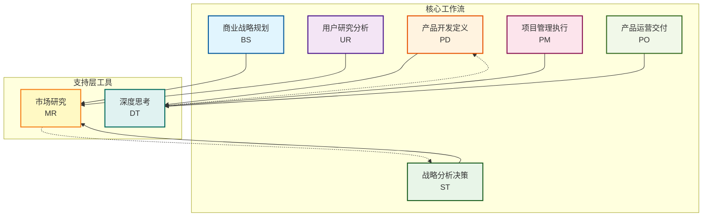
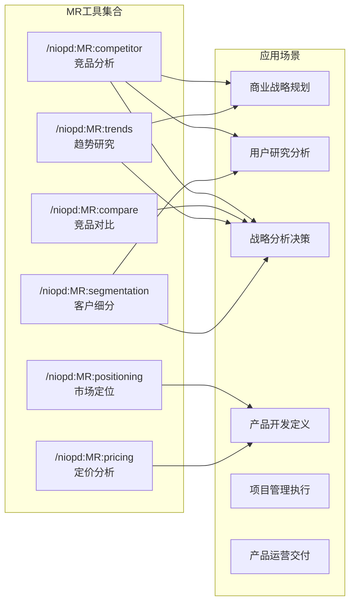
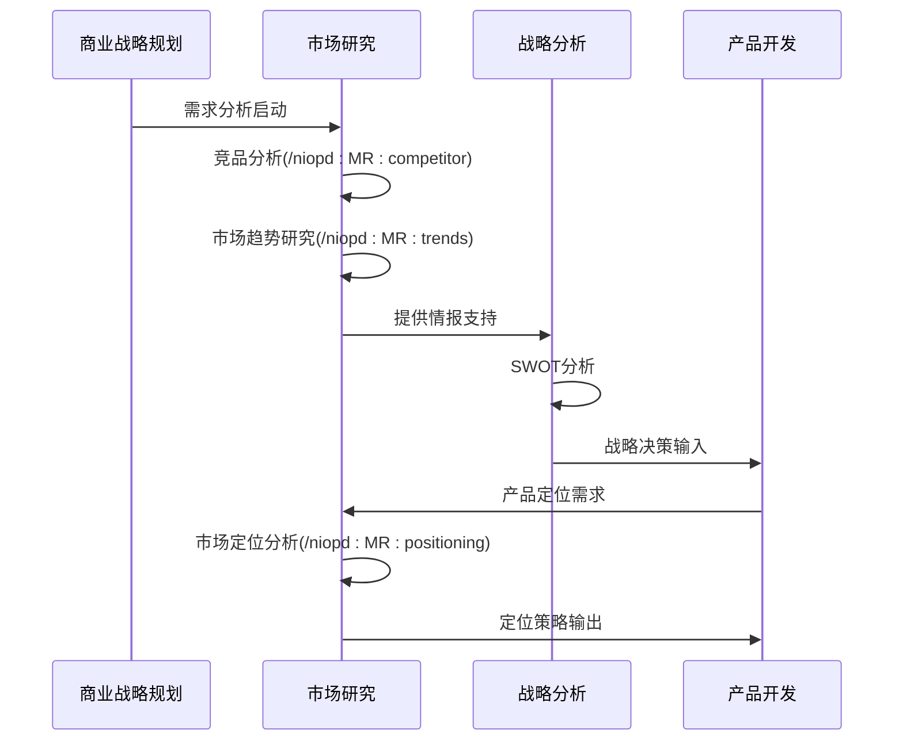
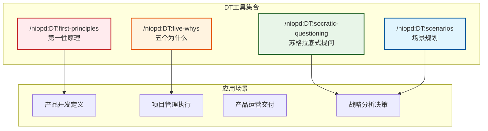
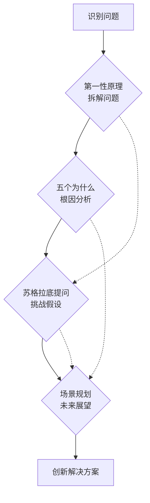
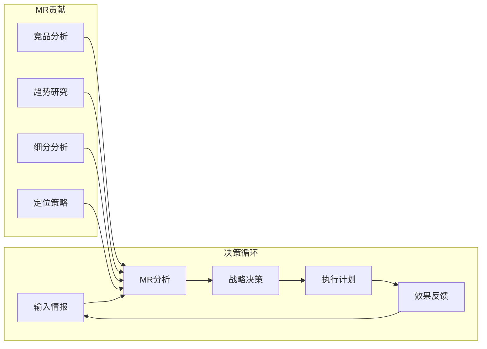
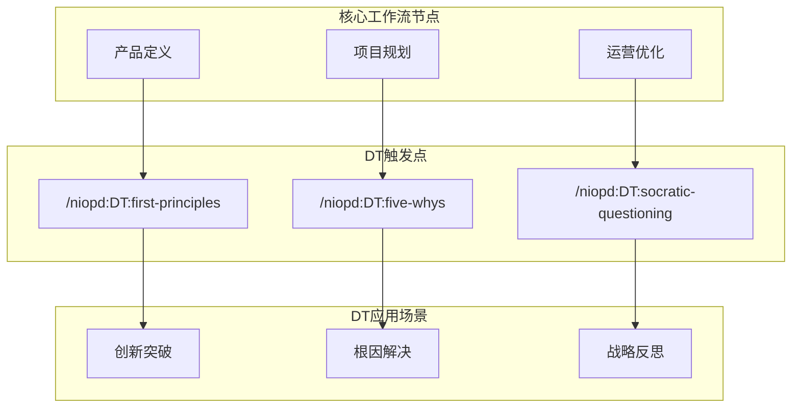
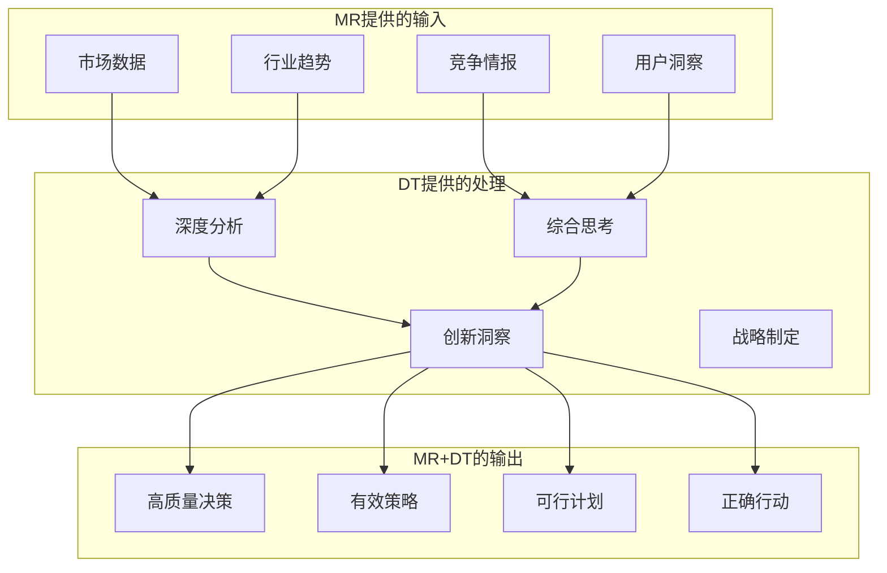
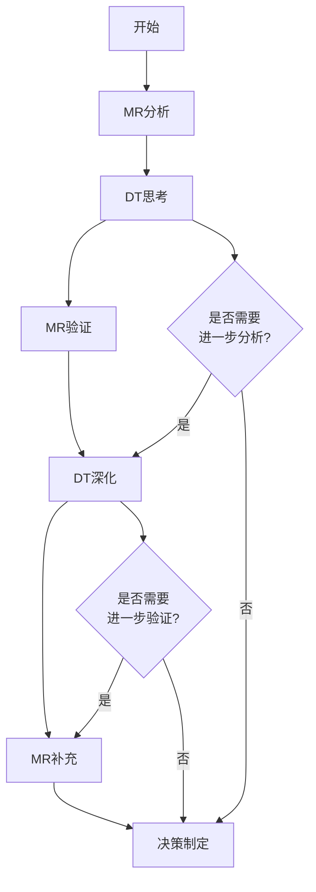

# 支持层工具

<cite>
**本文档中引用的文件**
- [competitor.md](file://niopd/commands/MR/competitor.md)
- [compare.md](file://niopd/commands/MR/compare.md)
- [trends.md](file://niopd/commands/MR/trends.md)
- [segmentation.md](file://niopd/commands/MR/segmentation.md)
- [positioning.md](file://niopd/commands/MR/positioning.md)
- [pricing.md](file://niopd/commands/MR/pricing.md)
- [first-principles.md](file://niopd/commands/DT/first-principles.md)
- [five-whys.md](file://niopd/commands/DT/five-whys.md)
- [socratic-questioning.md](file://niopd/commands/DT/socratic-questioning.md)
- [scenarios.md](file://niopd/commands/DT/scenarios.md)
- [README.md](file://README.md)
- [templates/README.md](file://niopd/templates/README.md)
</cite>

## 目录
1. [概述](#概述)
2. [市场研究(MR)支持层](#市场研究mr支持层)
3. [深度思考(DT)支持层](#深度思考dt支持层)
4. [工作流集成机制](#工作流集成机制)
5. [决策质量提升](#决策质量提升)
6. [工具使用指南](#工具使用指南)
7. [最佳实践](#最佳实践)
8. [总结](#总结)

## 概述

NioPD工作流架构中的支持层工具分为两大核心支柱：市场研究(MR)和深度思考(DT)。这两个支持层并非孤立存在，而是与核心工作流形成协同关系，在产品管理的各个阶段提供持续的情报支持和思维深化。

**图表来源**
- [README.md](file://README.md#L150-L200)

## 市场研究(MR)支持层

### 架构设计

MR支持层作为并行情报系统，贯穿产品生命周期的各个阶段，提供持续的市场洞察和竞争分析。其设计遵循"情报驱动决策"的原则，确保每个阶段都能获得相应的市场支持。

**图表来源**
- [competitor.md](file://niopd/commands/MR/competitor.md#L1-L50)
- [compare.md](file://niopd/commands/MR/compare.md#L1-L50)
- [trends.md](file://niopd/commands/MR/trends.md#L1-L50)

### 核心指令详解

#### /niopd:MR:competitor - 竞品分析

**理论基础**：基于迈克尔·波特的竞争战略理论和SWOT分析框架，采用系统化的竞争情报收集方法。

**工作机制**：
1. **网站分析**：使用WebFetch技术提取竞争对手网站内容
2. **价值主张识别**：分析核心价值主张和差异化定位
3. **功能映射**：系统性对比产品功能和能力
4. **定价策略**：研究定价模型和价值定位
5. **SWOT分析**：基于收集的信息进行战略评估

**应用场景**：
- 市场进入前的竞品调研
- 产品定位调整时的对标分析
- 竞争威胁评估
- 差异化策略制定

**输出格式**：结构化的Markdown报告，包含执行摘要、产品分析、SWOT评估和战略建议。

**节来源**
- [competitor.md](file://niopd/commands/MR/competitor.md#L1-L282)

#### /niopd:MR:compare - 竞品对比

**理论基础**：整合比较分析和竞争基准测试方法，采用多维度竞争分析框架。

**工作机制**：
1. **市场景观研究**：识别市场参与者和竞争格局
2. **自动竞品识别**：基于关键词和市场特征自动筛选竞品
3. **多维度对比**：功能、价格、市场表现、创新能力等
4. **可视化展示**：生成竞争定位图和对比矩阵
5. **战略洞察**：识别市场空白和竞争优势

**应用场景**：
- 产品功能优先级排序
- 市场定位策略制定
- 投资决策支持
- 竞争优势识别

**输出格式**：包含竞争矩阵、定位图、SWOT分析和战略建议的综合报告。

**节来源**
- [compare.md](file://niopd/commands/MR/compare.md#L1-L336)

#### /niopd:MR:trends - 市场趋势研究

**理论基础**：基于环境扫描理论和趋势预测方法，采用PEST/PESTLE框架进行外部环境分析。

**工作机制**：
1. **主题细化**：明确研究主题和子议题
2. **搜索策略**：制定多角度搜索查询
3. **信号检测**：识别新兴趋势和弱信号
4. **验证交叉**：多源验证关键趋势
5. **战略转化**：将趋势洞察转化为业务机会

**应用场景**：
- 年度战略规划
- 产品路线图制定
- 创新机会识别
- 风险预警

**输出格式**：包含趋势分类、影响评估、机会识别和行动建议的市场研究报告。

**节来源**
- [trends.md](file://niopd/commands/MR/trends.md#L1-L282)

### MR工具的生命周期集成

MR支持层与核心工作流的集成体现在以下几个方面：

**图表来源**
- [README.md](file://README.md#L150-L250)

## 深度思考(DT)支持层

### 架构设计

DT支持层作为思维工具集，可以在产品管理的任何阶段被调用，提供认知深化和问题解决能力。其设计基于多种经典思维方法论，形成互补的思考工具链。

**图表来源**
- [first-principles.md](file://niopd/commands/DT/first-principles.md#L1-L50)
- [five-whys.md](file://niopd/commands/DT/five-whys.md#L1-L50)
- [socratic-questioning.md](file://niopd/commands/DT/socratic-questioning.md#L1-L50)
- [scenarios.md](file://niopd/commands/DT/scenarios.md#L1-L50)

### 核心指令详解

#### /niopd:DT:first-principles - 第一性原理思维

**理论基础**：源自古希腊哲学，由埃隆·马斯克推广应用于现代创新实践。

**工作机制**：
1. **假设识别**：系统列出当前认知假设
2. **问题分解**：将复杂问题拆解到基本构成元素
3. **事实重构**：基于科学原理和客观事实重新构建
4. **创新解决方案**：摆脱传统思维框架的限制

**应用场景**：
- 突破性创新挑战
- 成本优化难题
- 业务模式重构
- 技术瓶颈解决

**典型案例**：
- SpaceX火箭成本优化：从材料成本而非成品价格思考
- 电动车电池革命：从化学成分而非现有电池价格思考

**节来源**
- [first-principles.md](file://niopd/commands/DT/first-principles.md#L1-L247)

#### /niopd:DT:five-whys - 根因分析

**理论基础**：丰田生产系统的质量改进方法，基于系统性因果关系分析。

**工作机制**：
1. **问题定义**：明确具体的问题现象
2. **连续追问**：通过"为什么"连续发问
3. **因果链追踪**：从表面症状深入到系统性原因
4. **根因识别**：确定真正的问题根源
5. **解决方案制定**：针对根因制定预防措施

**应用场景**：
- 产品质量问题
- 流程效率低下
- 客户投诉处理
- 团队协作障碍

**节来源**
- [five-whys.md](file://niopd/commands/DT/five-whys.md#L1-L246)

#### /niopd:DT:socratic-questioning - 苏格拉底式提问

**理论基础**：源于古希腊哲学，通过系统性提问促进深度理解和批判性思考。

**工作机制**：
1. **概念澄清**：明确关键概念的定义和边界
2. **假设挑战**：质疑隐含的前提和信念
3. **证据评估**：检验支持观点的证据强度
4. **视角拓展**：从不同角度审视问题
5. **逻辑推理**：分析论证的严密性

**提问类型**：
- 澄清性问题："What do you mean by...?"
- 假设探究："What are we assuming here?"
- 证据探究："How do you know?"
- 视角探究："What is an alternative?"
- 影响探究："What follows from this?"
- 元问题："Why are we asking this?"

**节来源**
- [socratic-questioning.md](file://niopd/commands/DT/socratic-questioning.md#L1-L248)

#### /niopd:DT:scenarios - 场景规划

**理论基础**：由Shell石油公司首创，用于应对战略不确定性。

**工作机制**：
1. **关键不确定性识别**：找出影响未来的最重要未知因素
2. **场景构建**：基于不确定性构建差异化未来场景
3. **叙事发展**：为每个场景构建详细的发展故事
4. **影响分析**：评估每个场景对业务的影响
5. **策略制定**：开发跨场景的稳健策略

**应用场景**：
- 高度不确定的市场环境
- 技术变革预测
- 长期战略规划
- 风险管理

**节来源**
- [scenarios.md](file://niopd/commands/DT/scenarios.md#L1-L300)

### DT工具的协同效应

DT工具之间存在良好的协同关系，可以组合使用以获得更深层次的洞察：

**图表来源**
- [first-principles.md](file://niopd/commands/DT/first-principles.md#L50-L100)
- [five-whys.md](file://niopd/commands/DT/five-whys.md#L50-L100)
- [socratic-questioning.md](file://niopd/commands/DT/socratic-questioning.md#L50-L100)
- [scenarios.md](file://niopd/commands/DT/scenarios.md#L50-L100)

## 工作流集成机制

### MR与核心工作流的集成

MR支持层通过以下机制与核心工作流无缝集成：

#### 1. **情报驱动的决策循环**

**图表来源**
- [README.md](file://README.md#L200-L300)

#### 2. **阶段化MR支持**

| 阶段 | MR支持重点 | 关键指令 | 输出成果 |
|------|------------|----------|----------|
| BS | 市场机会识别 | /niopd:MR:trends | 市场洞察报告 |
| UR | 用户需求理解 | /niopd:MR:segmentation | 用户细分报告 |
| ST | 竞争格局分析 | /niopd:MR:competitor | 竞品分析报告 |
| PD | 产品定位 | /niopd:MR:positioning | 定位策略文档 |
| PM | 市场风险评估 | /niopd:MR:pricing | 定价策略报告 |
| PO | 市场趋势跟踪 | /niopd:MR:trends | 趋势监测报告 |

### DT与核心工作流的集成

DT支持层在任何阶段都可以被调用，形成思维深化的支撑网络：

#### 1. **DT触发机制**

**图表来源**
- [README.md](file://README.md#L300-L400)

#### 2. **DT工具组合使用**

| 场景 | 推荐组合 | 应用效果 |
|------|----------|----------|
| 产品创新 | FP + SC | 从基本原理出发，探索未来可能性 |
| 问题解决 | FW + SQ | 通过根因分析和假设挑战解决问题 |
| 战略规划 | SC + SQ | 在不同场景下挑战战略假设 |
| 团队决策 | SQ + SC | 通过系统性提问和场景分析达成共识 |

## 决策质量提升

### MR对决策质量的贡献

MR支持层通过以下方式显著提升决策质量：

#### 1. **数据驱动的洞察**

- **量化分析**：提供可量化的市场数据和竞争指标
- **趋势预测**：基于历史数据和专家意见的未来预测
- **对比基准**：建立行业标准和最佳实践基准
- **风险评估**：识别市场和技术风险因素

#### 2. **系统性视角**

- **全景视野**：提供完整的市场和竞争图景
- **长期视角**：关注趋势而非短期波动
- **多维度分析**：从技术、市场、用户等多个维度审视问题
- **动态跟踪**：持续监控市场变化和竞争动态

### DT对决策质量的贡献

DT支持层通过认知工具提升决策的深度和广度：

#### 1. **思维深度**

- **本质洞察**：透过现象看到问题的本质
- **系统思考**：理解问题的系统性影响
- **创新突破**：跳出传统思维框架
- **批判性分析**：质疑假设，挑战现状

#### 2. **思维广度**

- **多角度审视**：从不同利益相关者视角看问题
- **未来导向**：考虑长期影响和潜在风险
- **跨领域借鉴**：从其他领域寻找解决方案
- **假设挑战**：识别和检验隐含前提

### MR+DT协同效应

MR和DT的协同作用产生1+1>2的效果：

**图表来源**
- [README.md](file://README.md#L400-L500)

## 工具使用指南

### MR工具使用指南

#### 1. **选择合适的MR工具**

**根据阶段选择**：
- **BS阶段**：优先使用/trends进行宏观市场分析
- **UR阶段**：使用/segmentation进行用户细分
- **ST阶段**：使用/competitor和/compare进行竞争分析
- **PD阶段**：使用/positioning进行产品定位
- **PM阶段**：使用/pricing进行定价策略
- **PO阶段**：使用/trends进行趋势跟踪

**根据问题选择**：
- **竞品分析**：/competitor（单个竞品）vs /compare（多个竞品）
- **趋势研究**：/trends（宏观趋势）vs /segmentation（细分趋势）
- **定位策略**：/positioning（整体定位）vs /pricing（价格定位）

#### 2. **MR工具的最佳实践**

**数据收集**：
- 确保URL有效性（对于/competitor）
- 明确研究主题和范围（对于/trends）
- 提供具体的竞品列表（对于/compare）

**分析深度**：
- 不要停留在表面信息，深入挖掘背后的原因
- 关注趋势的可持续性和影响程度
- 结合定量数据和定性洞察

**输出利用**：
- 将MR结果与核心工作流文档关联
- 建立MR报告的知识库
- 定期更新和回顾MR分析

### DT工具使用指南

#### 1. **选择合适的DT工具**

**根据问题性质选择**：
- **创新突破**：/first-principles
- **问题解决**：/five-whys
- **战略反思**：/socratic-questioning
- **未来规划**：/scenarios

**根据团队需求选择**：
- **个人思考**：/first-principles + /socratic-questioning
- **团队讨论**：/five-whys + /scenarios
- **战略决策**：/scenarios + /socratic-questioning

#### 2. **DT工具的使用技巧**

**第一性原理**：
- 从最基本的科学原理出发
- 质疑所有既定假设
- 重新构建解决方案的基础

**五个为什么**：
- 每个回答都要有证据支持
- 不要停留在表面原因
- 寻找系统性而非偶然性原因

**苏格拉底提问**：
- 保持开放和好奇的态度
- 鼓励不同观点的表达
- 关注逻辑的一致性和完整性

**场景规划**：
- 选择最关键的不确定性因素
- 构建相互排斥但又充分的场景
- 关注每个场景的实施细节

### MR+DT协同使用指南

#### 1. **MR+DT组合策略**

**创新阶段**：
1. 使用/trends识别新兴趋势
2. 使用/first-principles思考如何利用这些趋势
3. 使用/scenarios规划不同趋势下的发展方向

**竞争分析阶段**：
1. 使用/competitor分析主要竞争对手
2. 使用/five-whys理解竞争失败的根本原因
3. 使用/socratic-questioning挑战竞争假设

**产品定位阶段**：
1. 使用/positioning分析市场定位
2. 使用/first-principles重新思考价值主张
3. 使用/scenarios规划不同定位策略的未来

#### 2. **MR+DT使用流程**

**图表来源**
- [README.md](file://README.md#L500-L600)

## 最佳实践

### MR最佳实践

#### 1. **MR情报体系建设**

**建立MR知识库**：
- 将MR报告归档到reports/目录
- 建立MR报告的索引和标签系统
- 定期回顾和更新MR分析

**MR情报流程**：
1. **定期扫描**：每周/每月进行市场趋势扫描
2. **重点跟踪**：对关键竞品进行持续跟踪
3. **及时响应**：对重大市场变化快速反应
4. **系统总结**：定期进行MR情报的系统性总结

#### 2. **MR分析质量保证**

**数据质量**：
- 确保数据来源的可靠性和时效性
- 验证关键数据的准确性
- 注意数据的局限性和偏差

**分析深度**：
- 不满足于表面信息，深入挖掘原因
- 关注趋势的可持续性和影响
- 结合定量分析和定性判断

**实用性**：
- 确保MR分析能够指导实际决策
- 提供可操作的建议和行动计划
- 与业务目标保持一致

### DT最佳实践

#### 1. **DT思维训练**

**培养第一性原理思维**：
- 经常练习将问题分解到基本元素
- 质疑所有既定假设和惯例
- 从科学原理出发思考问题

**掌握五个为什么技巧**：
- 每个回答都要有具体证据
- 不要停留在表面原因
- 寻找系统性而非偶然性原因

**运用苏格拉底提问**：
- 保持开放和好奇心
- 鼓励不同观点的表达
- 关注逻辑的一致性和完整性

#### 2. **DT团队协作**

**团队DT活动**：
- 定期组织团队进行DT讨论
- 使用DT工具解决团队面临的挑战
- 建立DT思维的文化氛围

**DT文档化**：
- 记录DT思考的过程和结论
- 建立DT思维的知识库
- 分享成功的DT案例

### MR+DT协同最佳实践

#### 1. **MR+DT集成流程**

**MR驱动的DT思考**：
1. 基于MR分析发现问题
2. 使用DT工具深入分析
3. 用MR数据验证DT结论
4. 将MR+DT结果转化为行动方案

**DT引导的MR研究**：
1. 使用DT工具明确MR研究方向
2. 基于DT思考设计MR分析框架
3. 用DT方法评估MR结果
4. 将MR+DT洞察整合到决策中

#### 2. **MR+DT知识管理**

**建立MR+DT知识库**：
- 将MR和DT的结果关联存储
- 建立MR+DT案例库
- 开发MR+DT最佳实践指南

**MR+DT学习路径**：
1. 学习MR基础技能
2. 掌握DT思维方法
3. 实践MR+DT协同应用
4. 总结和分享MR+DT经验

## 总结

NioPD工作流架构中的MR和DT支持层构成了产品管理的智力基础设施。MR作为并行情报系统，提供持续的市场洞察和竞争分析；DT作为思维工具集，提供深度思考和问题解决能力。

### 核心价值

1. **决策质量提升**：MR提供数据驱动的洞察，DT提供深度思考能力，两者协同显著提升决策质量
2. **创新驱动力**：MR帮助识别市场机会和竞争威胁，DT促进创新思维和突破性解决方案
3. **风险控制**：MR提供全面的市场扫描，DT帮助识别和化解潜在风险
4. **战略灵活性**：MR+DT组合使组织能够适应快速变化的市场环境

### 实施建议

1. **建立MR情报体系**：系统性收集和分析市场情报
2. **培养DT思维文化**：在团队中推广深度思考方法
3. **MR+DT协同应用**：将MR和DT工具有机结合使用
4. **持续优化改进**：根据使用效果不断优化工具应用

通过合理运用MR和DT支持层工具，产品管理团队能够在复杂多变的市场环境中做出更加明智、更具前瞻性的决策，推动产品成功和业务增长。