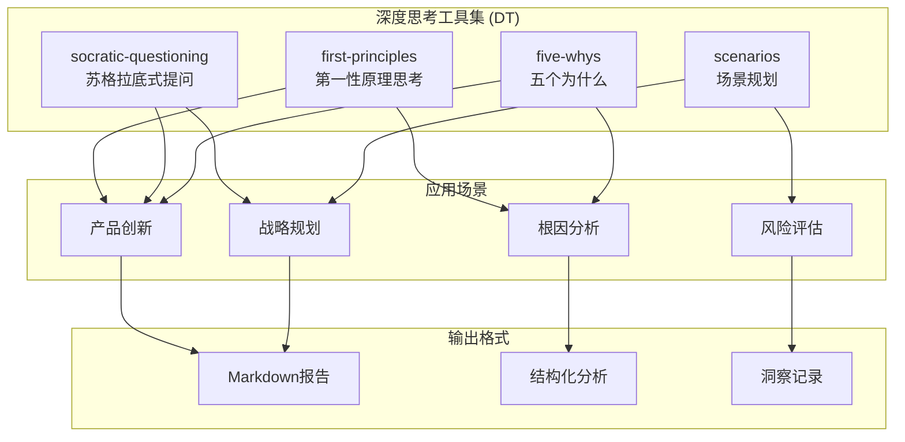
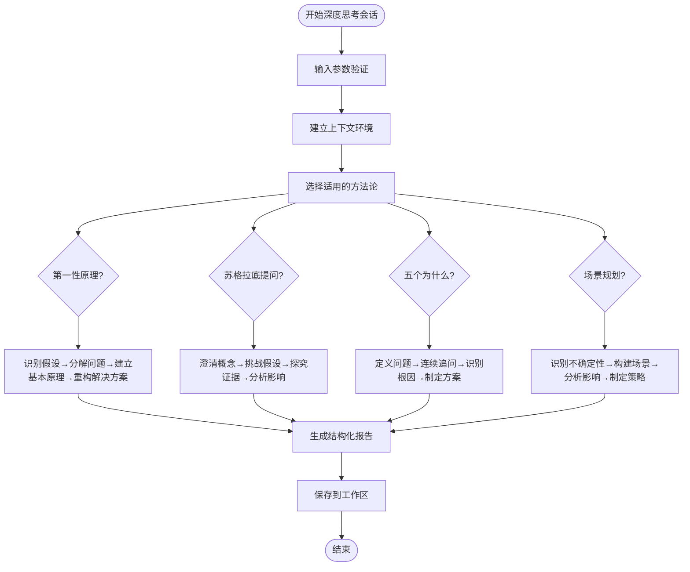
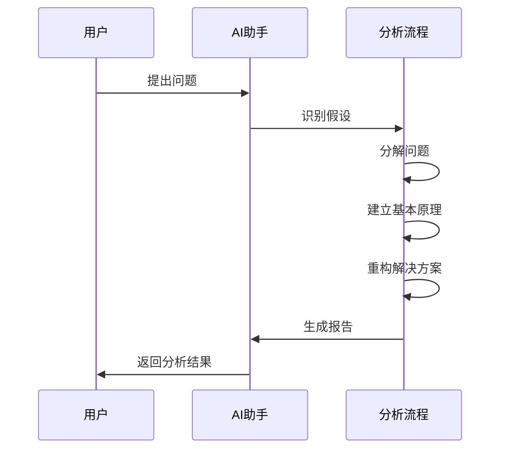
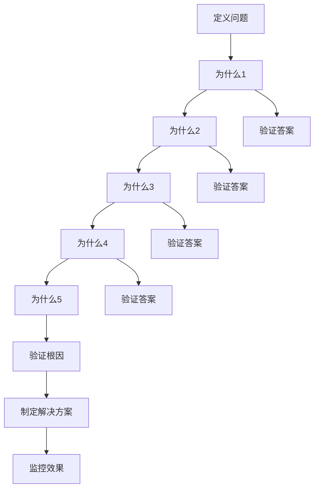
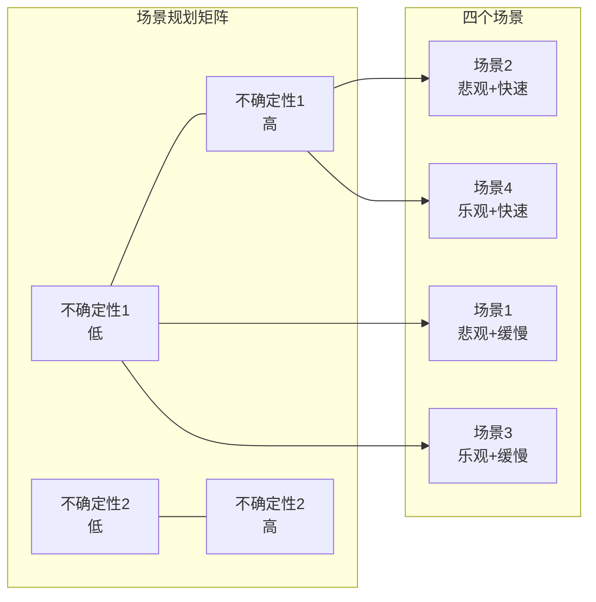
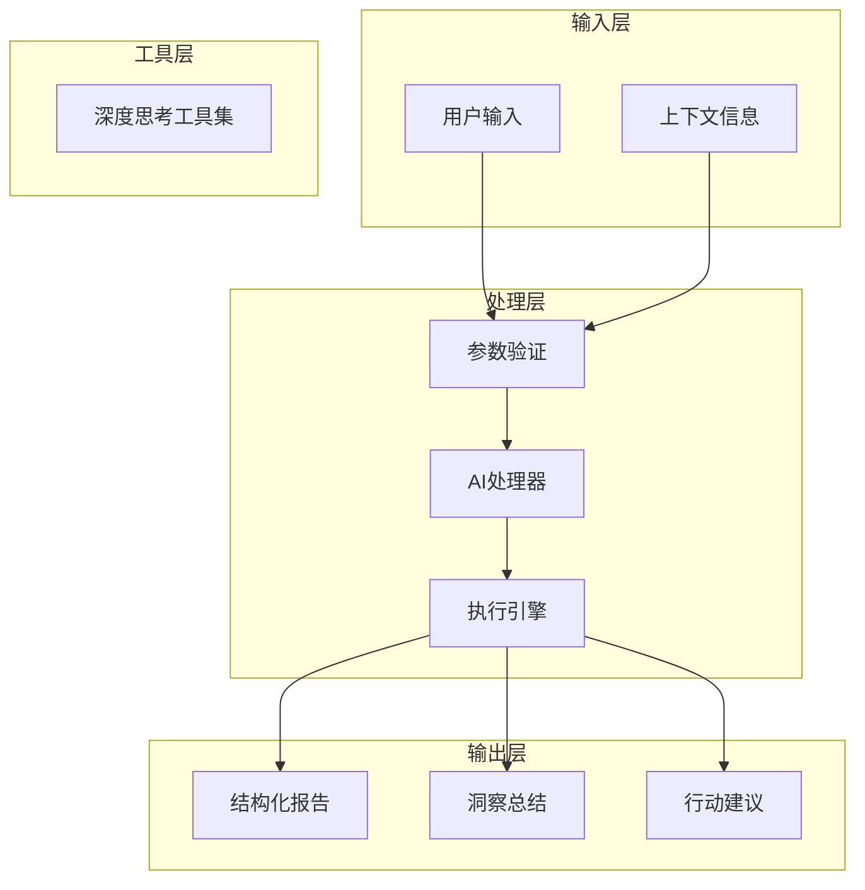

# 深度思考工具

<cite>
**本文档引用的文件**
- [first-principles.md](file://niopd/commands/DT/first-principles.md)
- [socratic-questioning.md](file://niopd/commands/DT/socratic-questioning.md)
- [five-whys.md](file://niopd/commands/DT/five-whys.md)
- [scenarios.md](file://niopd/commands/DT/scenarios.md)
- [README.md](file://README.md)
</cite>

## 目录
1. [引言](#引言)
2. [项目结构概览](#项目结构概览)
3. [核心组件](#核心组件)
4. [架构概览](#架构概览)
5. [详细组件分析](#详细组件分析)
6. [依赖关系分析](#依赖关系分析)
7. [性能考量](#性能考量)
8. [故障排除指南](#故障排除指南)
9. [结论](#结论)

## 引言

NioPD的深度思考(DT)工具集是一套基于经典哲学方法论和现代创新思维的系统化认知工具，旨在帮助产品管理者突破思维定式，找到根本原因和创新解决方案。该工具集包含四个核心方法：第一性原理思考、苏格拉底式提问、五个为什么和场景规划，每个方法都经过精心设计，能够在产品管理的各个阶段发挥作用。

深度思考工具的核心理念是通过系统化的思维训练，培养批判性思维能力，避免陷入常规思维陷阱。这些工具不仅适用于复杂问题的解决，更能够帮助团队建立创新的文化氛围，推动颠覆性创新的发生。

## 项目结构概览

NioPD深度思考工具集采用模块化设计，每个工具都是独立的功能单元，同时又相互关联形成完整的思维体系。

**图表来源**
- [first-principles.md](file://niopd/commands/DT/first-principles.md#L1-L50)
- [socratic-questioning.md](file://niopd/commands/DT/socratic-questioning.md#L1-L50)
- [five-whys.md](file://niopd/commands/DT/five-whys.md#L1-L50)
- [scenarios.md](file://niopd/commands/DT/scenarios.md#L1-L50)

**章节来源**
- [README.md](file://README.md#L468-L592)

## 核心组件

深度思考工具集包含四个核心组件，每个组件都基于不同的哲学传统和实践方法：

### 第一性原理思考 (First Principles Thinking)
基于古希腊哲学和埃隆·马斯克的实践，通过分解问题到基本事实来创造创新解决方案。

### 苏格拉底式提问 (Socratic Questioning)
采用古典希腊哲学方法，通过系统性提问挑战假设，深化理解。

### 五个为什么 (Five Whys)
源自丰田生产系统，通过连续追问"为什么"来识别问题的根本原因。

### 场景规划 (Scenario Planning)
借鉴Shell公司的实践经验，构建多个未来场景以应对不确定性。

**章节来源**
- [first-principles.md](file://niopd/commands/DT/first-principles.md#L1-L100)
- [socratic-questioning.md](file://niopd/commands/DT/socratic-questioning.md#L1-L100)
- [five-whys.md](file://niopd/commands/DT/five-whys.md#L1-L100)
- [scenarios.md](file://niopd/commands/DT/scenarios.md#L1-L100)

## 架构概览

深度思考工具集采用统一的架构模式，确保各工具之间的一致性和互操作性。

**图表来源**
- [first-principles.md](file://niopd/commands/DT/first-principles.md#L100-L200)
- [socratic-questioning.md](file://niopd/commands/DT/socratic-questioning.md#L100-L200)
- [five-whys.md](file://niopd/commands/DT/five-whys.md#L100-L200)
- [scenarios.md](file://niopd/commands/DT/scenarios.md#L100-L200)

## 详细组件分析

### 第一性原理思考工具

第一性原理思考是深度思考工具集中最具创新性的方法，它要求将复杂问题分解到最基本的真理层面，然后从这些基本原理出发重新构建解决方案。

#### 理论基础与哲学渊源

第一性原理思考源于古希腊哲学，特别是亚里士多德对"第一原则"的定义。这种方法强调从绝对真理出发，而不是基于类比或惯例思考。埃隆·马斯克将其应用于特斯拉和SpaceX的创新实践中，取得了显著成效。

#### 核心应用流程

**图表来源**
- [first-principles.md](file://niopd/commands/DT/first-principles.md#L150-L247)

#### 实际应用场景

第一性原理思考特别适用于以下场景：
- 面临"不可能"的挑战时
- 现有解决方案成本/复杂度过高时
- 需要创新突破时
- 打破行业约束时

**章节来源**
- [first-principles.md](file://niopd/commands/DT/first-principles.md#L1-L247)

### 苏格拉底式提问工具

苏格拉底式提问是一种系统性的对话方法，通过精心设计的问题序列来挑战假设、深化理解。

#### 方法论特征

该方法包含六个主要类型的问题：
1. **澄清性问题**：明确概念和术语
2. **假设探究**：识别隐含前提
3. **证据探究**：检验支持证据
4. **视角探究**：考虑不同立场
5. **影响探究**：分析后果和影响
6. **元问题**：反思提问本身

#### 对话流程设计

**图表来源**
- [socratic-questioning.md](file://niopd/commands/DT/socratic-questioning.md#L150-L247)

**章节来源**
- [socratic-questioning.md](file://niopd/commands/DT/socratic-questioning.md#L1-L247)

### 五个为什么工具

五个为什么方法源自丰田生产系统，是一种简单但强大的根因分析技术。

#### 核心原理与应用

该方法的基本原理是通过连续追问"为什么"来剥开问题的层层表象，直达根本原因。虽然称为"五个为什么"，但实际上可能需要更多或更少的追问才能达到根因。

#### 分析流程图

**图表来源**
- [five-whys.md](file://niopd/commands/DT/five-whys.md#L150-L245)

**章节来源**
- [five-whys.md](file://niopd/commands/DT/five-whys.md#L1-L245)

### 场景规划工具

场景规划是一种战略性思维工具，用于应对高度不确定性的环境。

#### 发展历程与理论基础

场景规划起源于20世纪50年代的RAND Corporation，后来在Shell公司得到进一步发展。该方法认为未来本质上是不确定的，因此应该探索多种可能的未来情景，而不是试图预测单一的未来。

#### 场景构建框架

**图表来源**
- [scenarios.md](file://niopd/commands/DT/scenarios.md#L150-L299)

**章节来源**
- [scenarios.md](file://niopd/commands/DT/scenarios.md#L1-L299)

## 依赖关系分析

深度思考工具集具有清晰的依赖关系结构，确保各工具之间的协调配合。

**图表来源**
- [README.md](file://README.md#L163-L195)

**章节来源**
- [README.md](file://README.md#L163-L195)

## 性能考量

深度思考工具集在设计时充分考虑了性能优化和用户体验：

### 响应时间优化
- 参数验证采用即时反馈机制
- 分析过程采用渐进式加载
- 报告生成采用异步处理

### 资源使用优化
- 内存使用控制在合理范围内
- 文件操作采用批量处理
- 缓存机制减少重复计算

### 可扩展性设计
- 模块化架构支持功能扩展
- 插件机制便于添加新工具
- 统一接口确保兼容性

## 故障排除指南

### 常见问题与解决方案

#### 输入验证问题
- **问题**：缺少必要参数
- **解决方案**：系统会提示用户提供缺失信息
- **预防措施**：使用argument-hint参数指导用户输入

#### 文件保存问题
- **问题**：无法保存报告文件
- **解决方案**：检查工作区权限，确保目录存在
- **预防措施**：自动创建工作区结构

#### 分析深度不足
- **问题**：分析结果过于表面
- **解决方案**：鼓励用户提供更多信息，或使用相关工具补充分析
- **预防措施**：提供详细的使用指导和最佳实践

**章节来源**
- [first-principles.md](file://niopd/commands/DT/first-principles.md#L240-L247)
- [socratic-questioning.md](file://niopd/commands/DT/socratic-questioning.md#L240-L247)
- [five-whys.md](file://niopd/commands/DT/five-whys.md#L240-L245)
- [scenarios.md](file://niopd/commands/DT/scenarios.md#L290-L299)

## 结论

NioPD的深度思考工具集代表了现代产品管理思维方法的重要发展。通过整合古典哲学智慧和现代创新实践，这些工具为产品管理者提供了系统化的思维训练平台。

### 核心价值

1. **思维训练**：系统性地培养批判性思维能力
2. **问题解决**：提供针对不同类型问题的专门方法
3. **创新促进**：打破思维定式，激发创新灵感
4. **决策支持**：为复杂决策提供坚实的思维基础

### 应用前景

随着产品管理环境的日益复杂，深度思考工具的重要性将不断提升。这些工具不仅适用于当前的产品管理实践，更为未来的创新思维奠定了坚实基础。

### 最佳实践建议

1. **工具组合使用**：根据具体问题选择合适的工具组合
2. **持续练习**：将深度思考融入日常工作流程
3. **团队培训**：在团队中推广深度思考方法
4. **迭代优化**：根据实际应用效果不断优化使用方法

深度思考工具集的成功应用需要持续的学习和实践。通过掌握这些工具的精髓，产品管理者可以显著提升解决问题的能力，推动组织向更高层次的创新迈进。