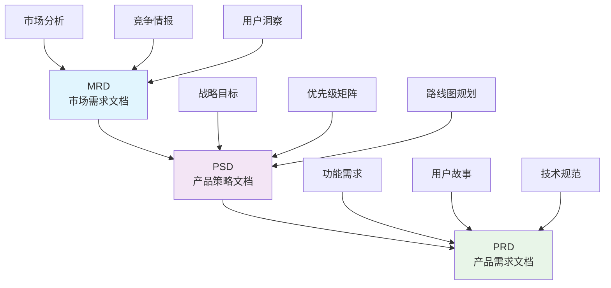
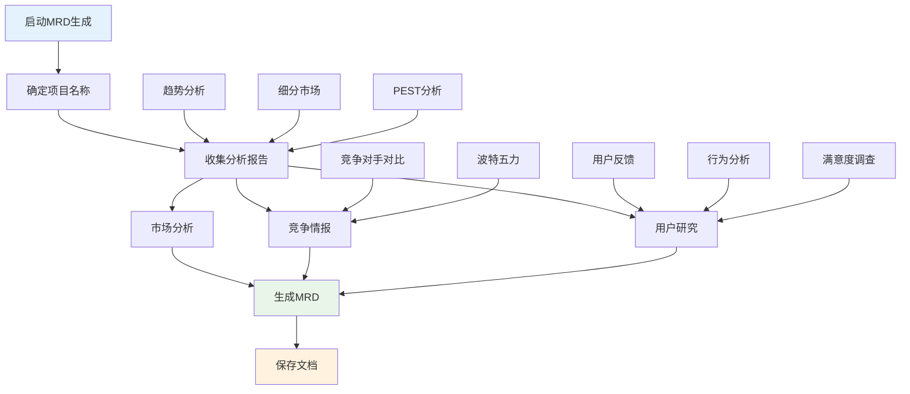
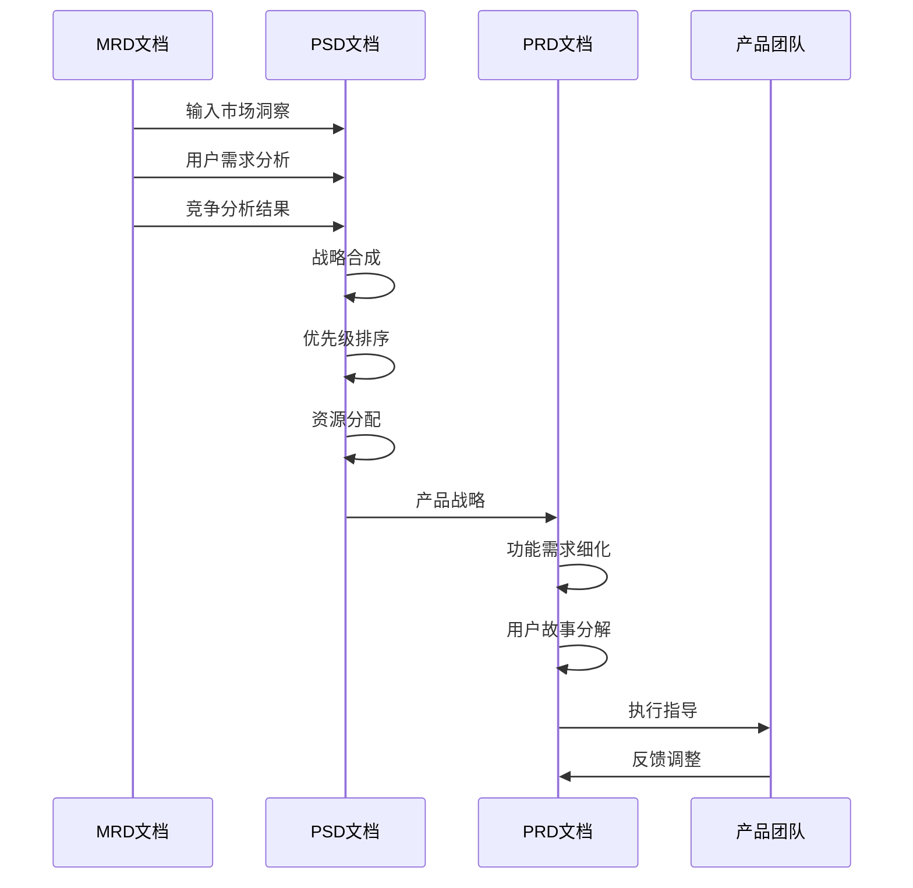
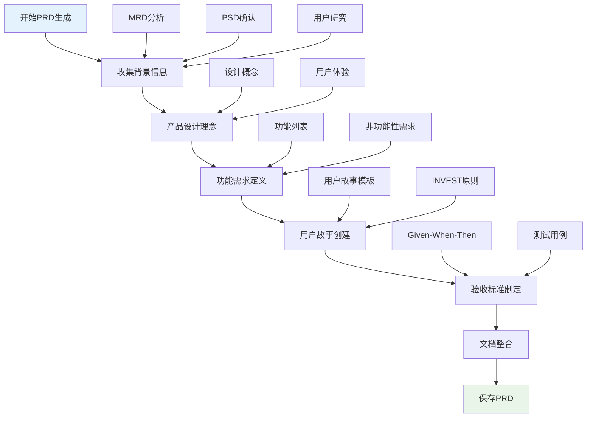
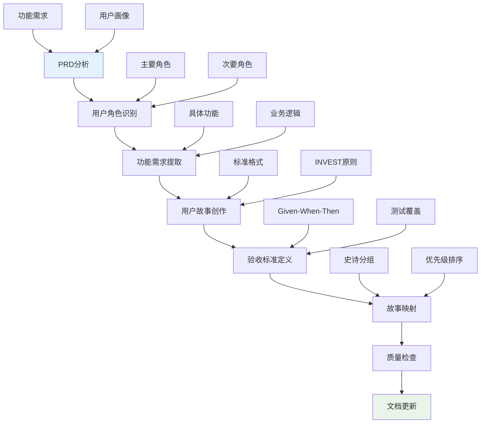
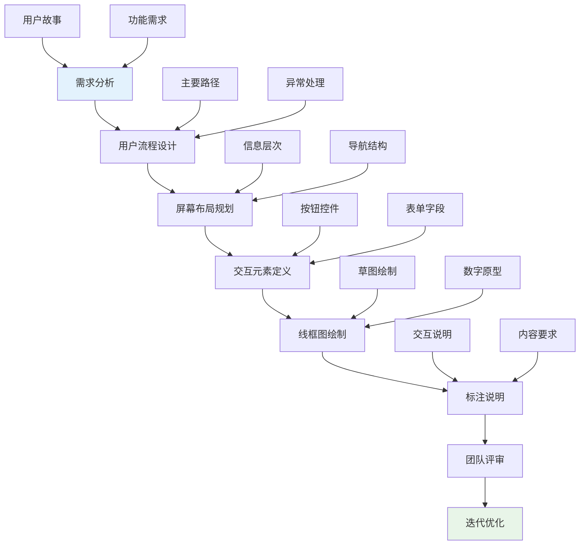
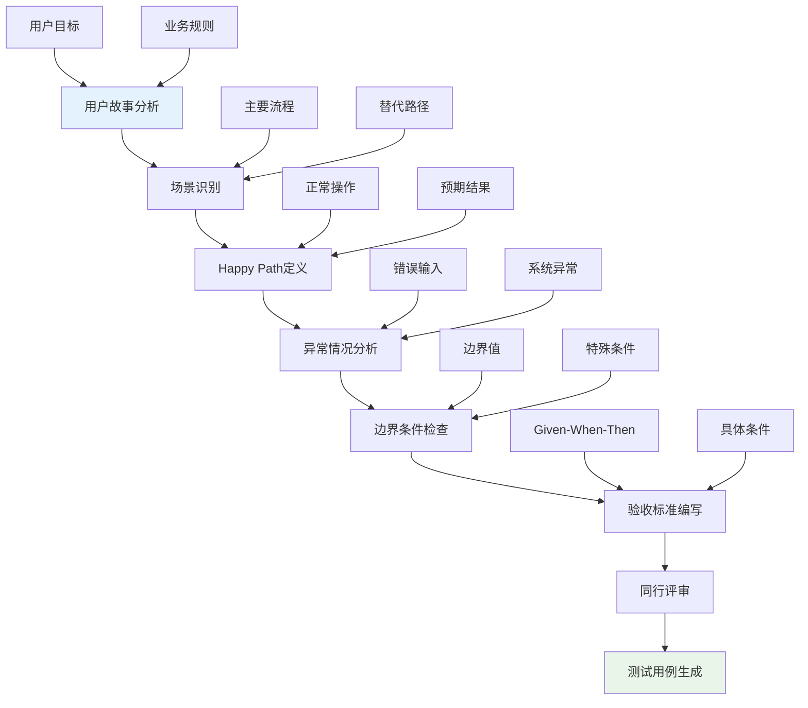
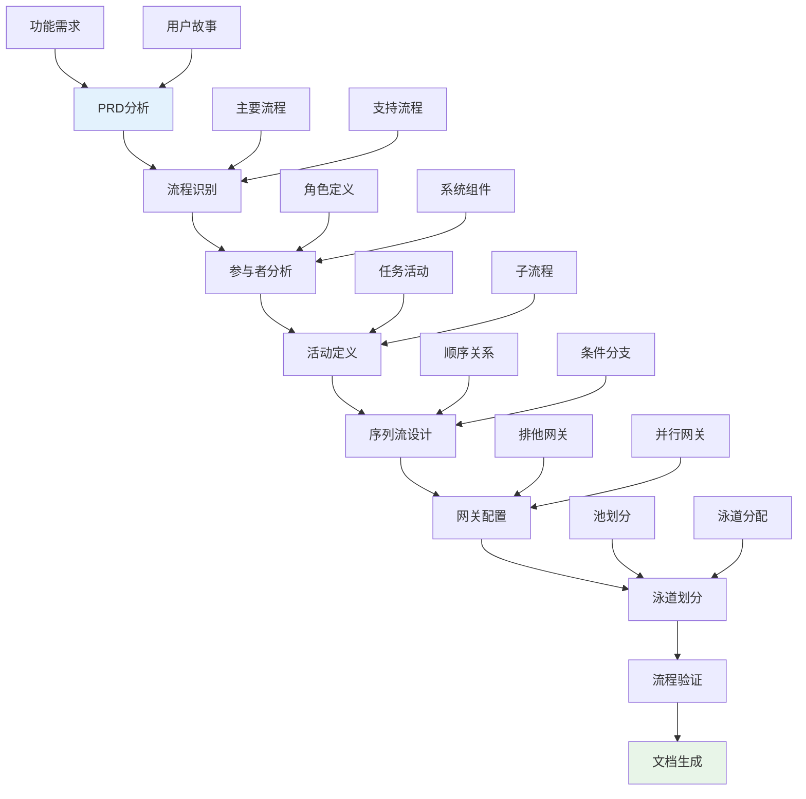
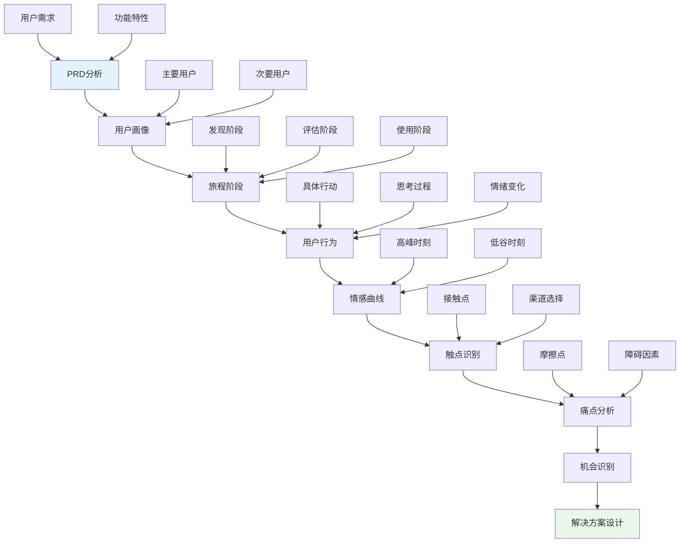
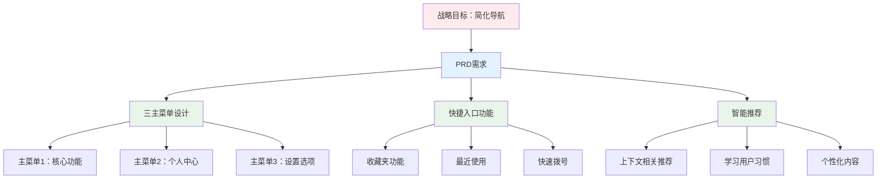

# 产品开发定义

<cite>
**本文档中引用的文件**
- [draft-prd.md](file://niopd/commands/PD/draft-prd.md)
- [stories.md](file://niopd/commands/PD/stories.md)
- [wireframe.md](file://niopd/commands/PD/wireframe.md)
- [acceptance-criteria.md](file://niopd/commands/PD/acceptance-criteria.md)
- [draft-mrd.md](file://niopd/commands/PD/draft-mrd.md)
- [draft-psd.md](file://niopd/commands/PD/draft-psd.md)
- [process.md](file://niopd/commands/PD/process.md)
- [journey.md](file://niopd/commands/PD/journey.md)
- [prd-template.md](file://niopd/templates/prd-template.md)
- [user-story-template.md](file://niopd/templates/user-story-template.md)
</cite>

## 目录
1. [引言](#引言)
2. [产品开发文档层次结构](#产品开发文档层次结构)
3. [MRD: 市场需求文档](#mrd-市场需求文档)
4. [PSD: 产品策略文档](#psd-产品策略文档)
5. [PRD: 产品需求文档](#prd-产品需求文档)
6. [用户故事生成](#用户故事生成)
7. [线框图与交互设计](#线框图与交互设计)
8. [验收标准定义](#验收标准定义)
9. [业务流程建模](#业务流程建模)
10. [用户旅程映射](#用户旅程映射)
11. [从战略到执行的转化实例](#从战略到执行的转化实例)
12. [总结](#总结)

## 引言

产品开发（PD）阶段是将战略决策转化为具体产品定义的关键环节。在NioPD框架中，PD阶段通过一系列标准化的文档和工具，确保战略意图能够准确、完整地转化为可执行的产品规格。本文档详细阐述了PD阶段的核心流程、工具使用方法以及如何实现MRD、PSD和PRD之间的追溯性。

## 产品开发文档层次结构

NioPD采用三层文档架构，形成完整的战略到执行的转化链条：

**图表来源**
- [draft-mrd.md](file://niopd/commands/PD/draft-mrd.md#L17-L63)
- [draft-psd.md](file://niopd/commands/PD/draft-psd.md#L17-L32)
- [draft-prd.md](file://niopd/commands/PD/draft-prd.md#L25-L39)

### 三层文档架构特点

| 文档层级 | 视角 | 主要受众 | 核心内容 | 输出形式 |
|---------|------|----------|----------|----------|
| **MRD** | 市场视角 | 执行领导层、市场团队 | 市场机会、用户需求、竞争分析 | 市场驱动的需求文档 |
| **PSD** | 战略视角 | 产品经理、工程领导 | 产品愿景、战略目标、优先级 | 战略桥梁文档 |
| **PRD** | 执行视角 | 工程团队、设计团队 | 详细功能、用户故事、技术规范 | 执行规格文档 |

**章节来源**
- [draft-mrd.md](file://niopd/commands/PD/draft-mrd.md#L17-L63)
- [draft-psd.md](file://niopd/commands/PD/draft-psd.md#L17-L32)
- [draft-prd.md](file://niopd/commands/PD/draft-prd.md#L25-L39)

## MRD: 市场需求文档

### 核心原理与理论基础

MRD作为市场驱动的需求文档，从外部市场视角出发，回答"为什么做"的问题。它基于市场研究、用户洞察和竞争分析，为产品决策提供坚实的市场基础。

### MRD生成流程

**图表来源**
- [draft-mrd.md](file://niopd/commands/PD/draft-mrd.md#L153-L200)

### MRD关键组件

MRD包含以下核心组成部分：

| 组件类别 | 具体内容 | 来源 | 用途 |
|---------|----------|------|------|
| **市场分析** | 市场规模、增长趋势、细分市场 | 市场研究报告 | 识别市场机会 |
| **竞争情报** | 竞争格局、优势劣势、竞争差距 | 竞争分析报告 | 制定差异化策略 |
| **用户洞察** | 目标用户、需求痛点、行为模式 | 用户研究数据 | 设计用户驱动的功能 |
| **市场要求** | 高层产品能力、差异化要求 | 综合分析结果 | 指导产品定位 |

**章节来源**
- [draft-mrd.md](file://niopd/commands/PD/draft-mrd.md#L64-L100)

## PSD: 产品策略文档

### 桥接作用与战略合成

PSD作为MRD和PRD之间的战略桥梁，将市场洞察转化为具体的产品战略决策。它解决了"怎么做"的战略问题，明确了产品的核心价值主张和实施路径。

### PSD生成机制

**图表来源**
- [draft-psd.md](file://niopd/commands/PD/draft-psd.md#L17-L32)

### 战略优先级框架

PSD采用MoSCoW优先级框架进行战略决策：

| 优先级 | 类别 | 示例 | 决策依据 |
|--------|------|------|----------|
| **P0 - 必须有** | 发布阻塞性功能 | 核心价值主张 | 竞争对等、技术基础 |
| **P1 - 应该有** | 高价值功能 | 差异化特性 | 用户满意度、战略投资 |
| **P2 - 可以有** | 未来考虑 | 增强功能 | 长期机会、实验性质 |
| **P3 - 不会有** | 明确排除 | 低优先级请求 | 战略"不"选择 |

**章节来源**
- [draft-psd.md](file://niopd/commands/PD/draft-psd.md#L100-L150)

## PRD: 产品需求文档

### 单一真相文档原则

PRD作为产品的单一真相文档，将战略意图转化为可执行的产品规格。它确保跨职能团队围绕统一的产品理解进行协作。

### PRD生成流程

**图表来源**
- [draft-prd.md](file://niopd/commands/PD/draft-prd.md#L153-L228)

### PRD模板结构

PRD采用标准化模板结构，确保内容的完整性：

| 章节 | 内容要点 | 输出形式 | 关键元素 |
|------|----------|----------|----------|
| **概述** | 功能简介、问题陈述 | 段落式描述 | 一句话说明、核心问题 |
| **用户画像** | 目标用户、使用场景 | 人物描述 | 角色、目标、痛点 |
| **功能需求** | 具体功能列表 | 编号列表 | FR编号、描述、优先级 |
| **非功能需求** | 性能、安全、可用性 | 分类列表 | 质量属性、约束条件 |
| **验收标准** | 测试条件 | 表格格式 | Given-When-Then格式 |

**章节来源**
- [prd-template.md](file://niopd/templates/prd-template.md#L1-L125)

## 用户故事生成

### 用户故事格式与原则

用户故事采用"作为[用户角色]，我想要[功能]，以便[商业价值]"的标准格式，确保需求的用户中心导向。

### 用户故事创建流程

**图表来源**
- [stories.md](file://niopd/commands/PD/stories.md#L153-L250)

### 用户故事质量标准

用户故事必须符合INVEST原则：

| 特征 | 定义 | 示例 | 验证方法 |
|------|------|------|----------|
| **独立性** | 可以独立开发 | "用户可以登录系统" | 是否依赖其他故事 |
| **可协商性** | 细节可灵活调整 | "支持多种支付方式" | 是否需要进一步讨论 |
| **有价值** | 为用户创造价值 | "简化结账流程" | 用户反馈验证 |
| **可估算性** | 团队可以评估工作量 | "页面加载时间<2秒" | 技术可行性评估 |
| **小规模** | 可在一个迭代内完成 | "显示购物车数量" | 开发周期评估 |
| **可测试性** | 有明确的成功标准 | "订单状态正确更新" | 自动化测试 |

**章节来源**
- [stories.md](file://niopd/commands/PD/stories.md#L50-L100)

## 线框图与交互设计

### 低保真线框图原则

线框图专注于界面结构和用户流程，避免视觉设计细节，快速探索概念和验证交互逻辑。

### 线框图创建流程

**图表来源**
- [wireframe.md](file://niopd/commands/PD/wireframe.md#L153-L250)

### 线框图要素分类

| 要素类型 | 描述 | 用途 | 注意事项 |
|---------|------|------|----------|
| **布局结构** | 页面整体组织 | 展示信息层次 | 保持一致性 |
| **导航元素** | 导航菜单、面包屑 | 引导用户操作 | 符合用户习惯 |
| **内容区块** | 标题、正文、图片 | 信息展示 | 使用占位符 |
| **交互元素** | 按钮、输入框、下拉 | 用户操作 | 标准化设计 |
| **注释说明** | 交互描述、内容要求 | 开发指导 | 清晰准确 |

**章节来源**
- [wireframe.md](file://niopd/commands/PD/wireframe.md#L50-L100)

## 验收标准定义

### BDD验收标准格式

验收标准采用Given-When-Then格式，确保测试条件的清晰性和可执行性。

### 验收标准创建流程

**图表来源**
- [acceptance-criteria.md](file://niopd/commands/PD/acceptance-criteria.md#L153-L250)

### 验收标准质量特征

好的验收标准具备以下特征：

| 特征 | 描述 | 示例 | 验证方法 |
|------|------|------|----------|
| **具体性** | 条件明确无歧义 | "当用户输入有效邮箱" | 可观察的行为 |
| **可测试性** | 能够客观验证 | "系统显示成功消息" | 自动化测试 |
| **完整性** | 覆盖所有场景 | 正常+异常+边界 | 场景覆盖检查 |
| **简洁性** | 简明扼要 | 避免冗余描述 | 内容精简度评估 |
| **独立性** | 可单独测试 | 不依赖其他条件 | 测试隔离性 |
| **共识性** | 跨团队认可 | 产品、开发、测试一致 | 团队共识 |

**章节来源**
- [acceptance-criteria.md](file://niopd/commands/PD/acceptance-criteria.md#L50-L100)

## 业务流程建模

### BPMN流程建模

业务流程建模采用BPMN标准，创建可视化的业务流程图，展示工作流的各个环节和决策点。

### 流程建模流程

**图表来源**
- [process.md](file://niopd/commands/PD/process.md#L153-L250)

### 流程质量指标

| 指标类别 | 具体指标 | 计算方法 | 改进目标 |
|---------|----------|----------|----------|
| **效率** | 周期时间 | 结束时间-开始时间 | 减少处理时间 |
| **质量** | 错误率 | 错误次数/总操作数 | 降低缺陷比例 |
| **成本** | 处理成本 | 总资源消耗 | 优化资源配置 |
| **灵活性** | 适应性 | 变更响应速度 | 提高流程弹性 |

**章节来源**
- [process.md](file://niopd/commands/PD/process.md#L100-L150)

## 用户旅程映射

### Journey Mapping方法论

用户旅程映射从用户的角度出发，可视化完整的用户体验过程，识别痛点和改进机会。

### 旅程映射流程

**图表来源**
- [journey.md](file://niopd/commands/PD/journey.md#L153-L250)

### 旅程映射要素

| 要素维度 | 描述 | 价值 | 应用场景 |
|---------|------|------|----------|
| **用户行为** | 用户的具体动作 | 理解用户需求 | 功能设计参考 |
| **用户思考** | 用户的思维过程 | 洞察用户动机 | 信息架构优化 |
| **用户感受** | 用户的情绪体验 | 识别情感触发点 | 体验优化重点 |
| **触点** | 用户接触的渠道 | 优化接触点体验 | 多渠道整合 |
| **痛点** | 用户遇到的困难 | 确定改进优先级 | 功能优化方向 |

**章节来源**
- [journey.md](file://niopd/commands/PD/journey.md#L50-L100)

## 从战略到执行的转化实例

### 案例：简化导航的战略目标转化

让我们通过"简化导航"这一战略目标，展示PD阶段如何将其转化为具体的PRD需求：

#### 战略目标
**简化导航**：提升用户体验，减少用户查找功能的时间，提高应用的整体易用性。

#### MRD层面
- **市场洞察**：用户调研显示平均用户花费30秒寻找主要功能
- **竞争分析**：竞争对手应用平均导航深度为2.1步
- **用户需求**：用户期望"一键访问常用功能"

#### PSD层面
- **战略目标**：将导航深度从当前的3.5步降低到2.5步
- **优先级**：P0 - 必须实现的核心功能
- **价值主张**："三主菜单"简化导航方案

#### PRD层面转化

**图表来源**
- [draft-prd.md](file://niopd/commands/PD/draft-prd.md#L201-L228)

### 具体PRD需求示例

基于上述转化过程，以下是具体的PRD需求定义：

| 需求类型 | 需求描述 | 用户故事 | 验收标准 |
|---------|----------|----------|----------|
| **功能需求** | 三主菜单布局 | "作为用户，我想要看到三个主要菜单，以便快速访问核心功能" | 1. 主菜单图标清晰可见 2. 菜单标签简洁明了 3. 点击后立即跳转对应功能 |
| **性能需求** | 导航响应时间 | "作为用户，我希望点击菜单后页面能在1秒内加载完成" | 1. 首屏加载时间<1秒 2. 导航切换流畅无卡顿 3. 移动端适配良好 |
| **可用性需求** | 菜单布局优化 | "作为新用户，我希望首次使用时能快速理解菜单结构" | 1. 菜单布局符合用户习惯 2. 提供新手引导功能 3. 支持自定义菜单排序 |

**章节来源**
- [prd-template.md](file://niopd/templates/prd-template.md#L25-L75)

## 总结

产品开发（PD）阶段通过系统化的方法和工具，实现了从战略决策到具体产品定义的无缝转化。关键成功要素包括：

### 核心原则

1. **追溯性保证**：MRD、PSD、PRD之间保持清晰的因果关系
2. **用户中心**：所有需求都源于用户洞察和市场研究
3. **结构化流程**：标准化的文档生成和审查流程
4. **跨团队协作**：确保产品、工程、设计团队的统一理解

### 工具链价值

- **MRD**：提供市场驱动的需求基础
- **PSD**：建立战略优先级和执行路径
- **PRD**：定义详细的执行规格
- **用户故事**：将需求转化为开发任务
- **线框图**：可视化交互设计
- **验收标准**：确保质量可验证
- **业务流程**：优化内部工作流
- **用户旅程**：提升用户体验

### 最佳实践建议

1. **循序渐进**：严格按照MRD→PSD→PRD的顺序推进
2. **持续验证**：定期与用户和利益相关者确认需求
3. **灵活调整**：根据反馈及时优化产品定义
4. **文档维护**：保持文档的时效性和准确性

通过这套完整的PD体系，产品团队能够确保战略决策得到准确执行，同时保持足够的灵活性应对市场变化和用户需求演进。