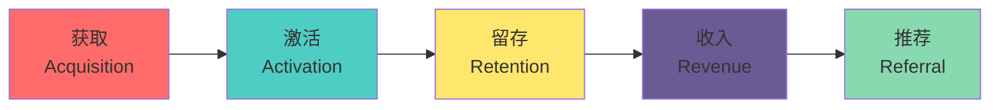
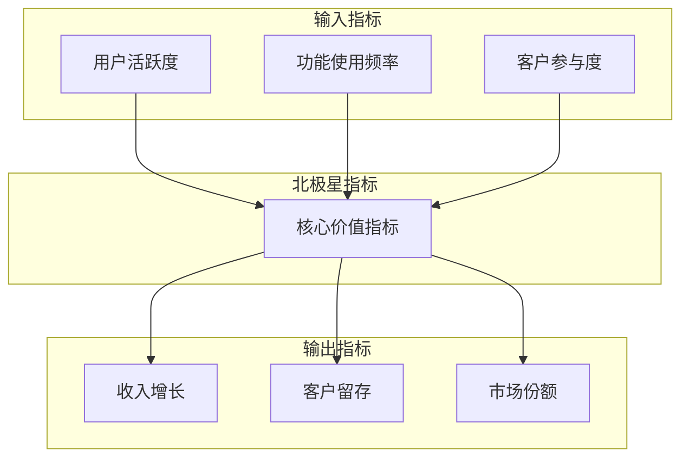
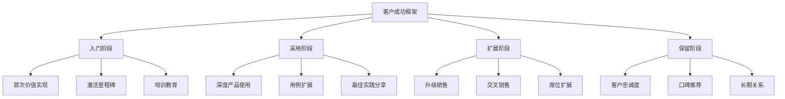
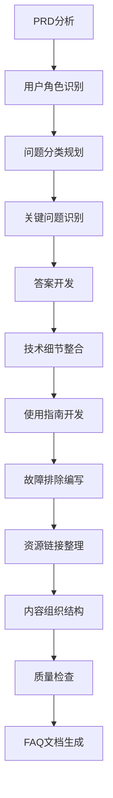
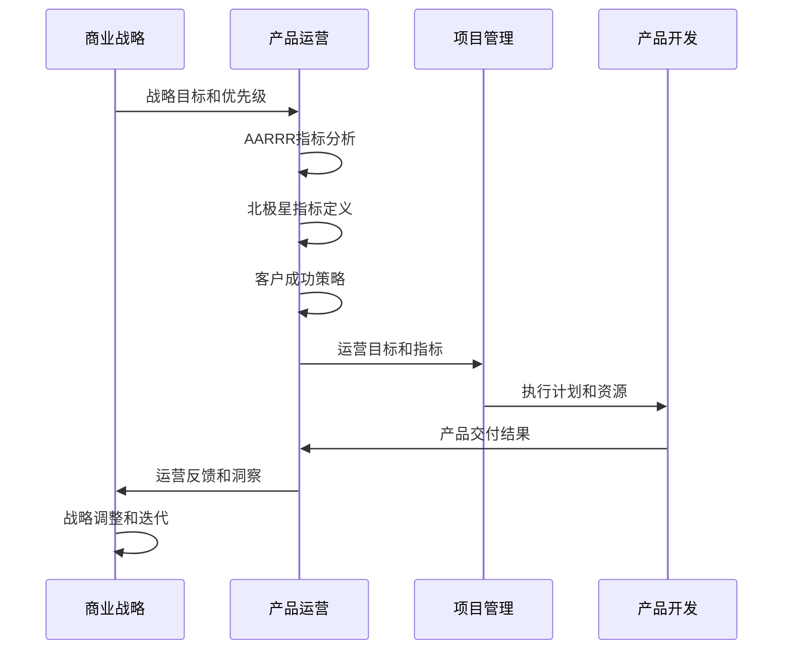
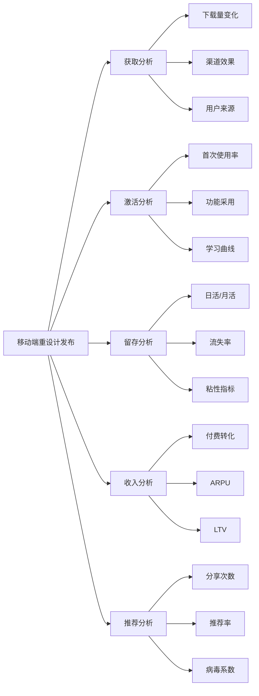
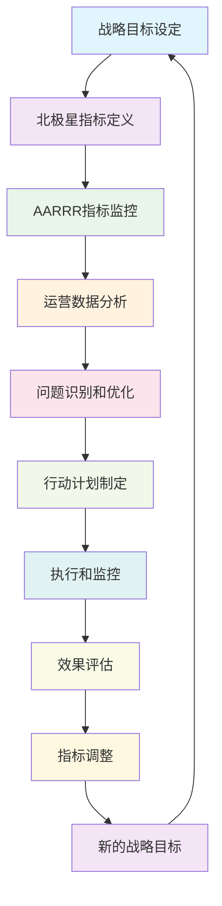

# 产品运营交付

<cite>
**本文档引用的文件**
- [aarrr-metrics.md](file://niopd/commands/PO/aarrr-metrics.md)
- [north-star.md](file://niopd/commands/PO/north-star.md)
- [customer-success.md](file://niopd/commands/PO/customer-success.md)
- [faq.md](file://niopd/commands/PO/faq.md)
- [stakeholder-update.md](file://niopd/commands/PO/stakeholder-update.md)
- [faq-template.md](file://niopd/templates/faq-template.md)
- [README.md](file://README.md)
</cite>

## 目录
1. [引言](#引言)
2. [产品运营的核心职责](#产品运营的核心职责)
3. [AARRR海盗指标框架](#aarrr海盗指标框架)
4. [北极星指标战略](#北极星指标战略)
5. [客户成功策略](#客户成功策略)
6. [常见问题解答生成](#常见问题解答生成)
7. [工作流闭环机制](#工作流闭环机制)
8. [移动端重设计案例分析](#移动端重设计案例分析)
9. [持续优化循环](#持续优化循环)
10. [总结](#总结)

## 引言

产品运营（PO）阶段是产品生命周期中的关键环节，负责将产品从概念推向市场并实现持续的成功。在NioPD框架中，PO阶段通过五大核心指令——AARRR指标分析、北极星指标定义、客户成功策略、FAQ生成和利益相关者更新——构建了一个完整的运营交付体系。

本文档深入解析这些工具如何协同工作，形成从产品成功度量到持续优化的完整闭环，确保产品能够实现可持续增长和用户满意度提升。

## 产品运营的核心职责

产品运营的核心职责包括：

### 1. 成功度量与监控
- 建立全面的指标体系
- 实施持续的性能监控
- 识别增长瓶颈和优化机会

### 2. 用户体验优化
- 分析用户行为模式
- 识别用户体验痛点
- 制定针对性优化策略

### 3. 客户关系管理
- 建立客户成功体系
- 提升客户满意度和忠诚度
- 推动客户推荐和口碑传播

### 4. 数据驱动决策
- 收集和分析运营数据
- 基于数据制定运营策略
- 建立科学的决策流程

## AARRR海盗指标框架

### 框架理论基础

AARRR海盗指标框架由Dave McClure在2007年创建，提供了一种**漏斗式**的客户生命周期分析方法。该框架关注从获取到收入的完整转化路径，帮助团队识别增长瓶颈并优先处理最具影响力的优化点。

### 五大核心指标



**图表来源**
- [aarrr-metrics.md](file://niopd/commands/PO/aarrr-metrics.md#L25-L50)

#### 1. 获取（Acquisition）
- **核心指标**：流量、访客数、渠道来源
- **关键问题**：哪些渠道带来最多用户？
- **优化重点**：成本效益导向的用户获取

#### 2. 激活（Activation）
- **核心指标**：注册转化率、首次使用、"顿悟时刻"
- **关键问题**：用户是否体验到产品价值？
- **优化重点**：改善首次用户体验

#### 3. 留存（Retention）
- **核心指标**：日活/月活比率、流失率、用户粘性
- **关键问题**：产品是否具有粘性？
- **优化重点**：构建习惯性使用

#### 4. 收入（Revenue）
- **核心指标**：客户终身价值、平均收入、转化率
- **关键问题**：产品是否盈利？
- **优化重点**：商业模式验证

#### 5. 推荐（Referral）
- **核心指标**：病毒系数、推荐率、净推荐值
- **关键问题**：用户是否主动推广？
- **优化重点**：口碑传播机制

### 漏斗分析原则

AARRR框架强调**自下而上的优化策略**：
- 优先解决留存问题（没有留存就没有获取）
- 在增加流量前先修复漏斗漏洞
- 留存是基础，推荐放大效果
- 收入验证产品市场契合度

**章节来源**
- [aarrr-metrics.md](file://niopd/commands/PO/aarrr-metrics.md#L1-L100)

## 北极星指标战略

### 指标选择原则

北极星指标是捕捉核心客户价值的单一关键指标，必须满足以下五个标准：

```mermaid
mindmap
root((北极星指标))
价值捕获
客户受益
真实价值
以客户为中心
可操作性
团队可控
清晰改进策略
决策指导
普适性
跨团队适用
职能对齐
共享所有权
预测性
业务结果预测
长期成功指标
预警信号
可测量性
清晰定义
可靠数据
实时跟踪
```

**图表来源**
- [north-star.md](file://niopd/commands/PO/north-star.md#L25-L50)

### 北极星指标与传统指标的区别

| 特征 | 北极星指标 | 收入指标 | 增长指标 |
|------|------------|----------|----------|
| 时间维度 | 预测性 | 回顾性 | 中间指标 |
| 关注焦点 | 客户价值 | 财务结果 | 市场表现 |
| 决策影响 | 日常决策 | 年度规划 | 季度回顾 |
| 数据来源 | 多渠道整合 | 财务系统 | 市场数据 |

### 支持指标框架

北极星指标需要配套的支持指标体系：



**图表来源**
- [north-star.md](file://niopd/commands/PO/north-star.md#L100-L150)

**章节来源**
- [north-star.md](file://niopd/commands/PO/north-star.md#L1-L100)

## 客户成功策略

### 客户成功框架

客户成功是一种**主动的、以结果为导向**的方法，确保客户实现预期成果。与传统的被动支持和服务相比，客户成功强调预防性干预和价值驱动。



**图表来源**
- [customer-success.md](file://niopd/commands/PO/customer-success.md#L50-L100)

### 客户健康评分模型

客户健康评分是一个**综合性的复合指标**，包含四个维度：

#### 行为健康
- 产品使用频率和深度
- 功能采用程度
- 登录和交互模式

#### 参与健康
- 支持工单趋势
- 培训参与度
- 社区活动参与

#### 结果健康
- 业务成果实现
- 目标达成情况
- 投资回报率

#### 关系健康
- 满意度评分（NPS、CSAT）
- 高管层面互动
- 情感分析

### 客户成功模型分类

根据客户规模和复杂度，采用不同的客户成功模型：

| 模型类型 | 适用客户 | 服务特点 | 关键要素 |
|----------|----------|----------|----------|
| 高接触 | 企业级客户 | 专属客户成功经理 | 战略规划、定期业务评审 |
| 低接触 | 中端市场 | 池化服务、自动化 | 标准化流程、自助资源 |
| 技术接触 | SMB客户 | 自动化引导、在线支持 | 智能助手、社区支持 |

**章节来源**
- [customer-success.md](file://niopd/commands/PO/customer-success.md#L1-L150)

## 常见问题解答生成

### FAQ生成框架

FAQ文档不仅是知识传递工具，更是**主动的知识管理**手段。通过系统化的问答结构，提前预见用户需求，减少支持负担并提升用户体验。



**图表来源**
- [faq.md](file://niopd/commands/PO/faq.md#L50-L100)

### 问答结构设计

FAQ文档采用**用户旅程导向**的结构设计：

#### 1. 通用问题
- 产品概述和定位
- 目标用户群体
- 发布时间表

#### 2. 功能问题
- 核心功能描述
- 使用方法说明
- 功能优势解释

#### 3. 技术问题
- 系统要求
- 安全性保障
- 集成兼容性

#### 4. 使用问题
- 快速入门指南
- 具体功能操作
- 自定义选项

#### 5. 故障排除
- 常见错误解决方案
- 问题诊断步骤
- 支持联系方式

### FAQ最佳实践

成功的FAQ文档遵循以下原则：

- **用户中心**：基于真实用户需求设计
- **结构清晰**：逻辑分明的分类和排序
- **易于查找**：关键词优化和导航设计
- **及时更新**：基于用户反馈和数据分析
- **多渠道支持**：与文档、视频、社区等互补

**章节来源**
- [faq.md](file://niopd/commands/PO/faq.md#L1-L100)
- [faq-template.md](file://niopd/templates/faq-template.md#L1-L50)

## 工作流闭环机制

### BS→PO的反馈循环

在NioPD框架中，BS（商业战略）阶段的输出为PO（产品运营）阶段提供了战略指导和目标设定。这种闭环机制确保了：



**图表来源**
- [stakeholder-update.md](file://niopd/commands/PO/stakeholder-update.md#L50-L100)

### 利益相关者沟通机制

PO阶段通过定期的利益相关者更新确保信息透明和决策支持：

#### 更新频率矩阵

| 频率 | 目标受众 | 内容重点 | 关键要素 |
|------|----------|----------|----------|
| 每周 | 团队成员 | 执行进度、当前挑战 | 具体行动、阻塞问题 |
| 每两周 | 跨职能团队 | 进展状态、依赖关系 | 协作需求、风险预警 |
| 每月 | 高级管理层 | 战略进展、关键指标 | 业务影响、决策需求 |
| 每季度 | 董事会 | 整体表现、长期趋势 | 战略一致性、投资回报 |

#### 沟通框架

采用STAR（情境、任务、行动、结果）和3W（什么、所以什么、现在什么）框架确保沟通的有效性：

- **情境**：当前业务背景和挑战
- **任务**：需要达成的目标和期望
- **行动**：已采取的具体措施
- **结果**：取得的成果和影响

**章节来源**
- [stakeholder-update.md](file://niopd/commands/PO/stakeholder-update.md#L1-L100)

## 移动端重设计案例分析

### 背景分析

假设公司完成了移动端产品的重设计发布，需要通过AARRR框架进行全面的运营分析：



**图表来源**
- [aarrr-metrics.md](file://niopd/commands/PO/aarrr-metrics.md#L200-L300)

### 获取阶段分析

#### 下载量和渠道表现
- **新版本发布后**：下载量环比增长35%
- **主要渠道**：App Store占比60%，Google Play占比25%
- **新增渠道**：社交媒体广告带来15%的新用户

#### 用户来源分析
- **自然搜索**：SEO优化效果显著，有机流量提升40%
- **付费广告**：ROI达到3.2:1，但成本较上版本降低15%
- **口碑传播**：用户自发分享带动10%的新用户获取

### 激活阶段分析

#### 首次使用体验
- **激活率**：从28%提升至35%，提高了7个百分点
- **学习曲线**：新用户平均3天内掌握核心功能
- **首日留存**：从42%提升至50%

#### 用户旅程映射
- **注册到首次使用**：平均耗时从3分钟缩短至1.5分钟
- **核心功能采用**：新用户在7天内采用关键功能的比例提升至65%
- **顿悟时刻**：用户在使用AI功能后产生积极反馈的时间从5分钟缩短至2分钟

### 留存阶段分析

#### 用户粘性指标
- **DAU/MAU比率**：从22%提升至28%
- **30天留存率**：从38%提升至45%
- **90天留存率**：从25%提升至32%

#### 用户分群分析
- **高价值用户**：重度使用者（每日使用超过30分钟）占比从15%提升至22%
- **中等价值用户**：活跃使用者占比稳定在55%
- **低价值用户**：流失风险较高的用户占比下降10%

#### 留存驱动因素
- **个性化推荐**：算法优化使推荐准确度提升20%
- **社交功能**：新增的社区功能增加了用户互动
- **离线功能**：离线模式提升了用户体验

### 收入阶段分析

#### 商业模型验证
- **付费转化率**：从8%提升至12%
- **ARPU（每用户平均收入）**：从$12提升至$18
- **LTV（客户终身价值）**：从$150提升至$220

#### 付费用户特征
- **付费用户比例**：从18%提升至25%
- **免费转付费转化**：平均转化周期从60天缩短至45天
- **订阅续费率**：从85%提升至90%

### 推荐阶段分析

#### 口碑传播效果
- **推荐率**：从12%提升至18%
- **病毒系数**：从0.4提升至0.6
- **净推荐值**：从65提升至75

#### 推荐渠道分析
- **社交媒体分享**：用户主动分享次数提升3倍
- **朋友推荐**：口口相传带来的新用户占比从20%提升至30%
- **应用商店评价**：好评率从4.2提升至4.6

### 优化建议

基于AARRR分析结果，提出以下优化建议：

#### 获取优化（短期）
1. **强化社交媒体营销**：针对年轻用户群体，增加短视频和直播内容
2. **优化应用商店展示**：改进截图和视频，突出新功能亮点
3. **合作伙伴推广**：与相关应用建立互推关系

#### 激活优化（中期）
1. **简化新手引导**：将引导流程从5步减少到3步
2. **增强首日体验**：为新用户提供专属奖励
3. **优化功能发现**：改进内购提示和功能推荐

#### 留存优化（长期）
1. **个性化内容推送**：基于用户兴趣定制内容
2. **社区建设**：建立用户交流平台
3. **会员体系**：推出分级会员制度

#### 收入优化（战略）
1. **定价策略调整**：推出更多价格梯度
2. **增值服务**：开发新的付费功能
3. **企业版拓展**：针对企业用户推出定制方案

**章节来源**
- [aarrr-metrics.md](file://niopd/commands/PO/aarrr-metrics.md#L400-L500)

## 持续优化循环

### 闭环运营流程

产品运营的持续优化形成一个完整的闭环：



### 关键成功要素

#### 1. 数据驱动的文化
- 建立全员的数据意识
- 确保数据质量和可访问性
- 培养基于证据的决策习惯

#### 2. 跨部门协作
- 明确各团队在运营体系中的角色
- 建立有效的沟通机制
- 确保目标和指标的一致性

#### 3. 持续学习和适应
- 跟踪行业最佳实践
- 学习竞争对手的策略
- 根据市场变化调整方法

#### 4. 技术和工具支持
- 选择合适的分析工具
- 建立自动化监控系统
- 确保数据基础设施的稳定性

### 最佳实践总结

#### 指标管理
- **北极星指标**：保持单一性和聚焦性
- **支持指标**：提供多维度的洞察
- **运营指标**：反映日常执行效果

#### 用户体验优化
- **分层运营**：针对不同用户群体制定差异化策略
- **个性化体验**：利用数据分析提供定制化服务
- **持续改进**：基于用户反馈不断优化产品

#### 商业价值创造
- **价值导向**：始终围绕客户价值展开运营
- **成本控制**：平衡投入产出比
- **规模化能力**：建立可复制的增长模式

## 总结

产品运营交付是连接产品战略与商业成功的桥梁。通过NioPD框架中的五大核心工具——AARRR海盗指标、北极星指标、客户成功策略、FAQ生成和利益相关者更新，产品团队能够：

1. **建立全面的度量体系**：从获取到推荐的完整客户生命周期监控
2. **聚焦核心价值指标**：确保团队目标与业务战略高度一致
3. **构建客户成功体系**：实现客户价值最大化和长期关系维护
4. **提供优质的用户体验**：通过系统化的FAQ管理提升用户满意度
5. **建立有效的沟通机制**：确保信息透明和决策支持

这种系统化的方法不仅帮助产品实现短期的成功，更为长期的可持续发展奠定了坚实基础。通过持续的监控、分析和优化，产品运营能够成为推动业务增长的核心动力。

在数字化时代，产品运营已经从单纯的执行层面上升为战略决策的重要组成部分。掌握这些工具和方法，将使产品团队能够在激烈的市场竞争中保持领先地位，为客户创造真正的价值。