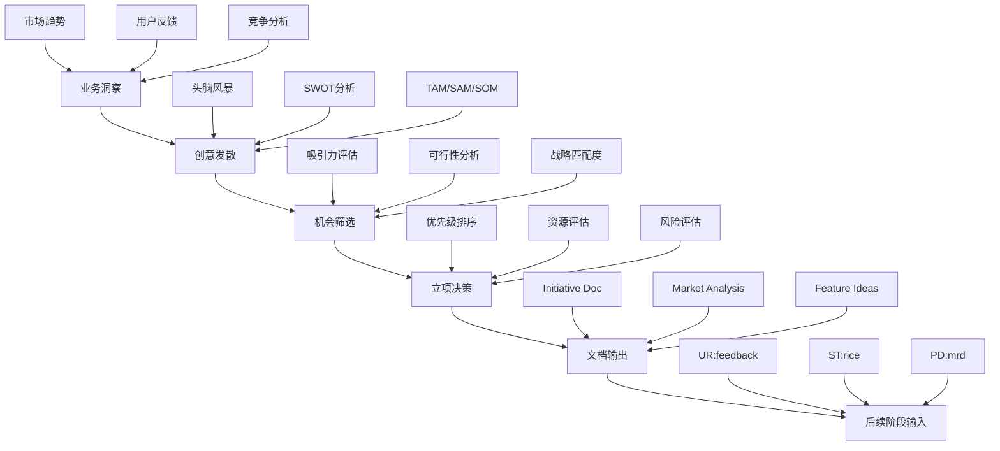
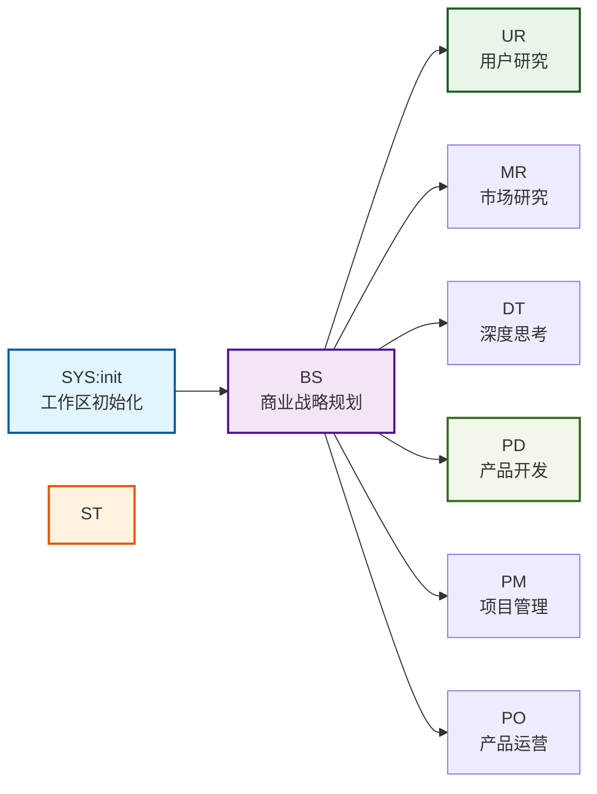
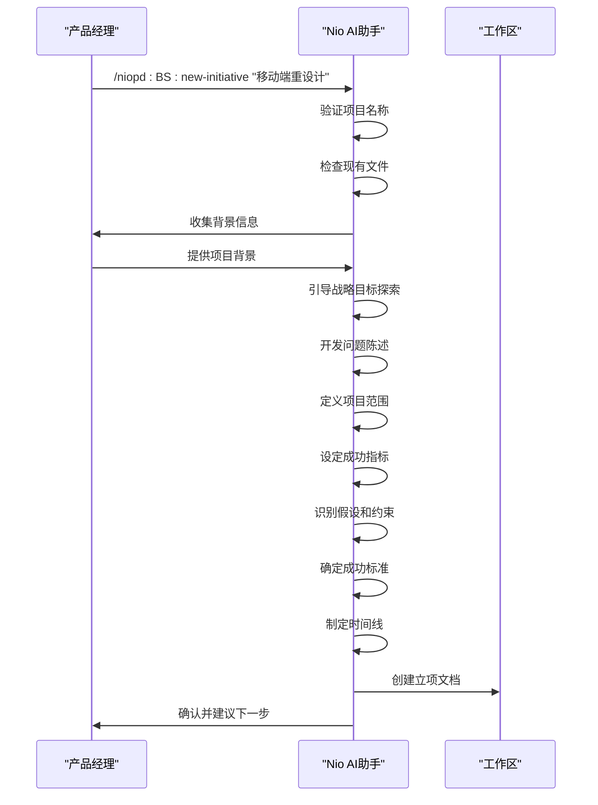
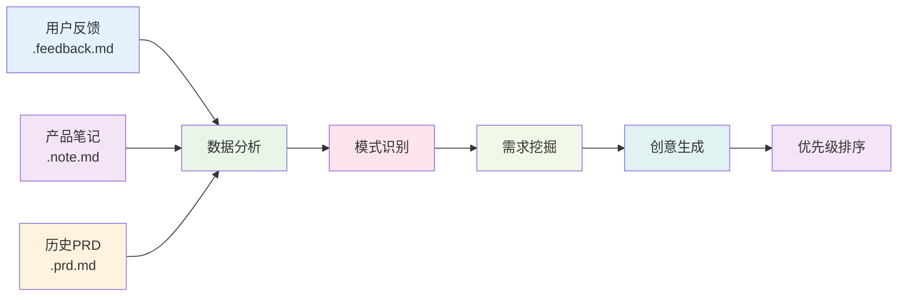
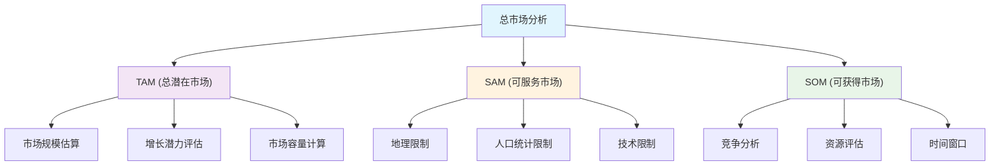
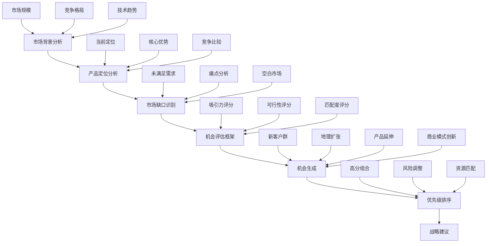
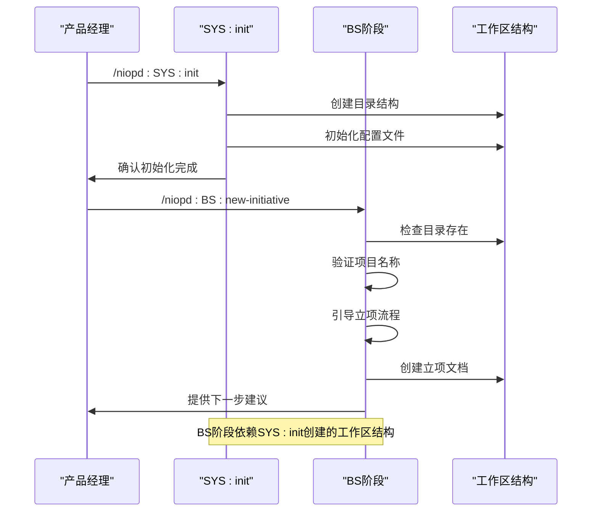
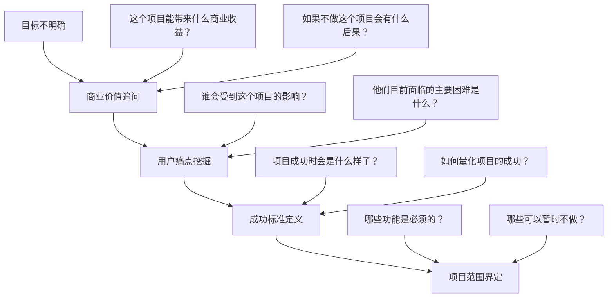
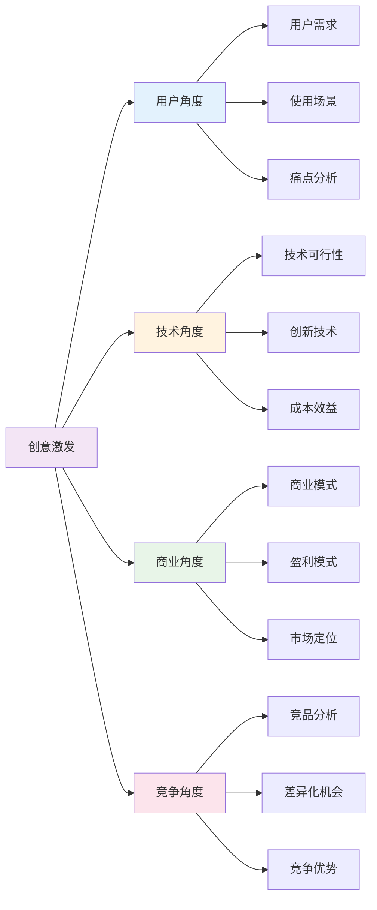
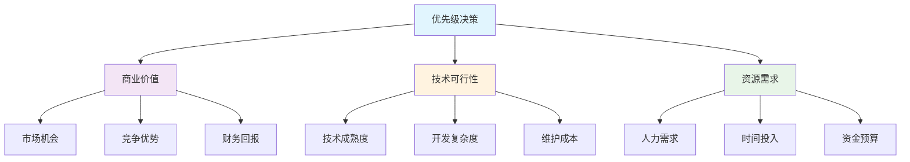

# 商业战略规划

<cite>
**本文档中引用的文件**
- [new-initiative.md](file://niopd/commands/BS/new-initiative.md)
- [feature-planning.md](file://niopd/commands/BS/feature-planning.md)
- [market-opportunity.md](file://niopd/commands/BS/market-opportunity.md)
- [initiative-template.md](file://niopd/templates/initiative-template.md)
- [init.md](file://niopd/commands/SYS/init.md)
- [hi.md](file://niopd/commands/BS/hi.md)
- [README.md](file://README.md)
</cite>

## 目录
1. [引言](#引言)
2. [BS阶段概述](#bs阶段概述)
3. [核心指令详解](#核心指令详解)
4. [工作流集成机制](#工作流集成机制)
5. [方法论基础](#方法论基础)
6. [实际使用案例](#实际使用案例)
7. [常见问题与解决方案](#常见问题与解决方案)
8. [最佳实践指南](#最佳实践指南)
9. [总结](#总结)

## 引言

NioPD的商业战略规划（BS）阶段是产品管理流程中的关键起点，负责从概念萌芽到正式立项的转化过程。BS阶段通过系统化的头脑风暴、市场机会分析和立项文档创建，为后续的用户研究（UR）、战略分析（ST）和产品开发（PD）阶段奠定坚实基础。

BS阶段的核心价值在于：
- **创新激发**：通过结构化的方法论激发创意火花
- **战略对齐**：确保产品方向与商业目标一致
- **风险前置**：在早期识别和评估潜在风险
- **资源优化**：合理分配有限的资源到最有价值的机会

## BS阶段概述

### 核心作用

BS阶段在NioPD工作流中扮演着"创意孵化器"的角色，主要职责包括：



**图表来源**
- [new-initiative.md](file://niopd/commands/BS/new-initiative.md#L1-L50)
- [market-opportunity.md](file://niopd/commands/BS/market-opportunity.md#L1-L50)

### 工作流位置

BS阶段位于NioPD核心工作流的起始位置，与SYS:init形成协同关系：



**图表来源**
- [README.md](file://README.md#L150-L200)

**章节来源**
- [README.md](file://README.md#L150-L250)

## 核心指令详解

### /niopd:BS:new-initiative - 新项目立项

#### 指令功能
`/niopd:BS:new-initiative <initiative_name>` 是BS阶段的核心指令，通过苏格拉底式提问和引导式对话创建结构化的项目立项文档。

#### 实施方法

**1. 项目启动流程**



**图表来源**
- [new-initiative.md](file://niopd/commands/BS/new-initiative.md#L80-L150)

**2. 文档结构**

立项文档遵循标准化模板，包含以下核心部分：

| 部分 | 描述 | 输入来源 |
|------|------|----------|
| 战略目标 | 高层次业务目标和产品愿景 | 用户输入 + Nio引导 |
| 问题陈述 | 具体解决的用户或业务问题 | 用户痛点 + 市场洞察 |
| 项目范围 | 包含和排除的功能边界 | 用户需求 + 技术可行性 |
| 目标指标 | 衡量成功的KPI和目标值 | 业务目标 + 用户价值 |
| 假设约束 | 关键前提条件和限制因素 | 风险识别 + 资源评估 |
| 成功标准 | 明确的完成标准 | 目标对齐 + 验收标准 |
| 依赖风险 | 外部因素和缓解策略 | 项目规划 + 风险管理 |
| 时间线里程碑 | 关键节点和交付时间 | 项目规划 + 资源安排 |

**3. 核心原则**

- **苏格拉底式提问**：通过启发式对话帮助用户发现隐藏洞察
- **第一性原理思维**：将问题分解到基本要素，找到本质
- **引导式发现**：鼓励用户主动思考，而非被动接受答案
- **结构化输出**：确保文档的完整性和可执行性

**章节来源**
- [new-initiative.md](file://niopd/commands/BS/new-initiative.md#L1-L214)

### /niopd:BS:feature-planning - 功能创意发散

#### 指令功能
`/niopd:BS:feature-planning` 基于用户反馈、笔记和历史PRD生成新的功能创意，采用数据驱动的产品开发方法。

#### 实施方法

**1. 数据聚合分析**



**图表来源**
- [feature-planning.md](file://niopd/commands/BS/feature-planning.md#L50-L100)

**2. 分析流程**

| 阶段 | 活动 | 输出 |
|------|------|------|
| 数据收集 | 聚合反馈、笔记、PRD文件 | 原始数据集 |
| 模式识别 | 识别重复主题和需求 | 关键洞察 |
| 需求挖掘 | 发现未满足的用户需求 | 需求列表 |
| 创意生成 | 基于洞察生成功能想法 | 创意清单 |
| 优先级排序 | 评估创意的可行性和价值 | 排序结果 |

**3. 核心优势**

- **多源数据整合**：综合用户反馈、内部观察和历史经验
- **系统性方法**：避免凭感觉决策，基于实际数据生成创意
- **可执行输出**：生成的具体功能想法可以直接转化为立项文档
- **持续学习**：从历史项目中学习，避免重复错误

**章节来源**
- [feature-planning.md](file://niopd/commands/BS/feature-planning.md#L1-L156)

### /niopd:BS:market-opportunity - 市场机会分析

#### 指令功能
`/niopd:BS:market-opportunity` 运用TAM/SAM/SOM框架分析市场机会规模，评估市场吸引力、可行性和战略匹配度。

#### 实施方法

**1. TAM/SAM/SOM分析框架**



**图表来源**
- [market-opportunity.md](file://niopd/commands/BS/market-opportunity.md#L30-L80)

**2. 评估维度**

| 维度 | 评分标准 | 考虑因素 |
|------|----------|----------|
| 吸引力 | 1-5分 | 市场规模、增长率、盈利能力、客户支付意愿 |
| 可行性 | 1-5分 | 技术能力、资源投入、时间成本、竞争优势 |
| 战略匹配度 | 1-5分 | 与公司愿景契合度、核心能力利用、长期价值 |

**3. 机会生成流程**



**图表来源**
- [market-opportunity.md](file://niopd/commands/BS/market-opportunity.md#L130-L200)

**章节来源**
- [market-opportunity.md](file://niopd/commands/BS/market-opportunity.md#L1-L266)

## 工作流集成机制

### 与SYS:init的协同关系

BS阶段与SYS:init形成紧密的初始化和启动关系：



**图表来源**
- [init.md](file://niopd/commands/SYS/init.md#L50-L100)
- [new-initiative.md](file://niopd/commands/BS/new-initiative.md#L60-L90)

### 与后续阶段的输入关系

BS阶段的输出为后续阶段提供关键输入：

| BS输出 | UR输入 | ST输入 | PD输入 |
|--------|--------|--------|--------|
| 立项文档 | 项目背景、目标用户 | 市场机会、竞争分析 | 需求定义、功能规划 |
| 功能创意 | 用户反馈、痛点分析 | SWOT分析、波特五力 | 用户故事、验收标准 |
| 市场分析 | 用户画像、行为模式 | 机会评估、风险分析 | 市场需求、竞争定位 |

**章节来源**
- [README.md](file://README.md#L150-L300)

## 方法论基础

### 苏格拉底式提问法

BS阶段的核心方法论之一，源于古希腊哲学家苏格拉底的对话技巧：

**提问类型**：
1. **澄清性问题**："你提到的X具体指什么？"
2. **假设探究**："这是基于什么前提假设？"
3. **证据探究**："有什么数据支持这个观点？"
4. **视角探究**："从用户的角度看会怎样？"
5. **影响探究**："如果这样做会产生什么后果？"
6. **元问题**："为什么这个问题值得解决？"

### 第一性原理思维

借鉴埃隆·马斯克的思维方式，将复杂问题分解到最基本的真理层面：

**应用步骤**：
1. **识别假设**：列出当前的预设前提
2. **分解事实**：将问题拆解到基本构成要素
3. **重构解决方案**：从零开始重新构建
4. **验证创新性**：确保解决方案具有创造性

### 设计思维框架

融合IDEO和斯坦福d.school的设计思维方法：

**核心阶段**：
1. **共情**（Empathize）：深入理解用户需求
2. **定义**（Define）：准确定义问题
3. **构思**（Ideate）：发散性创意生成
4. **原型**（Prototype）：快速原型制作
5. **测试**（Test）：验证和迭代

**章节来源**
- [new-initiative.md](file://niopd/commands/BS/new-initiative.md#L20-L50)

## 实际使用案例

### 案例：移动端重设计项目

#### 项目背景
某电商平台希望提升移动端用户体验，提高转化率。

#### BS阶段实施过程

**1. 项目启动**
```bash
/niopd:BS:new-initiative "移动端重设计"
```

**2. 引导式对话流程**

Nio通过以下问题引导产品经理深入思考：

- **项目背景**："我们为什么要进行移动端重设计？当前面临的主要挑战是什么？"
- **用户洞察**："目标用户群体有哪些特征？他们在移动端遇到的主要痛点是什么？"
- **商业目标**："希望通过这次重设计实现哪些具体的业务目标？"
- **成功标准**："如何衡量这次重设计的成功？有哪些关键指标？"

**3. 立项文档输出**

基于对话结果，生成包含以下内容的立项文档：

```markdown
# Initiative: 移动端重设计

## 1. 战略目标
- 提升移动端用户转化率至少15%
- 改善用户留存率，减少30天流失率
- 建立统一的移动端设计语言

## 2. 问题陈述
当前移动端应用存在以下问题：
- 导航复杂，用户难以快速找到所需功能
- 加载速度慢，影响用户体验
- 移动端特有功能缺失，无法满足移动场景需求

## 3. 项目范围
### 包含
- 首页布局优化
- 导航系统重构
- 移动端性能优化
- 响应式设计改进

### 排除
- 后台管理系统重构
- 桌面端功能迁移
- 新增完全不同的功能模块
```

**4. 功能创意发散**
基于用户反馈和竞品分析，生成以下功能创意：

- **智能推荐算法**：基于用户行为的个性化推荐
- **一键下单功能**：简化购物流程
- **离线浏览模式**：在网络不稳定时提供基本功能
- **手势操作优化**：充分利用移动端交互特性

**5. 市场机会分析**
运用TAM/SAM/SOM框架分析移动电商市场：

- **TAM**：中国移动电商市场规模预计达到5000亿人民币
- **SAM**：目标服务的年轻用户群体约2亿人
- **SOM**：预计可获得的市场份额为5%

#### 项目成果

通过BS阶段的系统化思考，项目获得了以下成果：

1. **清晰的项目方向**：明确了移动端重设计的具体目标和范围
2. **可执行的功能清单**：基于用户需求生成的功能创意
3. **市场机会验证**：通过TAM/SAM/SOM分析确认市场价值
4. **风险识别**：提前识别技术实现和资源分配的风险

**章节来源**
- [new-initiative.md](file://niopd/commands/BS/new-initiative.md#L100-L200)

## 常见问题与解决方案

### 目标不明确时的应对策略

**问题表现**：
- 产品经理无法清晰描述项目目标
- 对项目的商业价值认识模糊
- 不确定项目应该解决什么问题

**解决方案**：

**1. 引导式提问策略**



**图表来源**
- [new-initiative.md](file://niopd/commands/BS/new-initiative.md#L150-L200)

**2. 实用工具推荐**

| 工具 | 用途 | 使用场景 |
|------|------|----------|
| SWOT分析 | 识别项目的优势、劣势、机会和威胁 | 项目可行性评估 |
| Jobs-to-be-Done | 理解用户的真实需求 | 用户痛点挖掘 |
| 5W2H分析 | 完整的问题分析框架 | 问题定义和范围界定 |
| 价值主张画布 | 明确产品价值定位 | 商业价值确认 |

### 创意不足时的激发方法

**问题表现**：
- 功能创意数量不足
- 创意质量不高
- 缺乏创新性想法

**解决方案**：

**1. 多角度思考框架**



**图表来源**
- [feature-planning.md](file://niopd/commands/BS/feature-planning.md#L80-L120)

**2. 创意生成技巧**

- **逆向思维**：思考"如果不做这件事会怎样"
- **跨界借鉴**：从其他行业寻找灵感
- **用户旅程映射**：在用户使用流程中寻找改进点
- **技术趋势追踪**：关注新兴技术带来的可能性

### 资源限制下的优先级决策

**问题表现**：
- 可用资源有限
- 项目需求过多
- 难以确定优先级

**解决方案**：

**1. RICE评分框架**

| 因素 | 评分标准 | 计算方法 |
|------|----------|----------|
| Reach | 影响的用户数量 | 0-10000+ |
| Impact | 解决问题的程度 | 0-10 |
| Confidence | 确信度 | 0.1-1.0 |
| Effort | 实现难度 | 0-100 |

**2. 三维度评估**



**章节来源**
- [new-initiative.md](file://niopd/commands/BS/new-initiative.md#L180-L214)

## 最佳实践指南

### BS阶段执行最佳实践

**1. 准备工作**

- **环境准备**：确保工作区初始化完成
- **资料收集**：整理相关的市场数据、用户反馈和竞品信息
- **心态准备**：保持开放和探索的心态

**2. 对话质量提升**

- **积极倾听**：给予充分的时间表达观点
- **深度提问**：避免表面问题，追求本质洞察
- **适度引导**：在必要时提供方向性建议
- **记录要点**：及时记录重要的思考点

**3. 文档质量保证**

- **结构化输出**：严格按照模板要求填写
- **数据支撑**：用具体的数据和事实支持观点
- **逻辑清晰**：确保各部分内容逻辑连贯
- **可执行性强**：确保文档中的内容可以转化为具体行动

### 团队协作优化

**1. 跨部门沟通**

- **利益相关者识别**：明确项目涉及的各个部门
- **共同语言建立**：使用统一的术语和框架
- **定期同步**：建立定期的项目进度同步机制

**2. 知识传承**

- **文档归档**：将讨论过程和决策依据文档化
- **经验总结**：定期回顾项目经验教训
- **团队培训**：分享BS阶段的最佳实践

### 持续改进机制

**1. 效果评估**

- **项目成功率**：跟踪立项项目的成功比例
- **决策质量**：评估立项决策的准确性
- **效率提升**：测量BS阶段的时间和资源投入

**2. 方法论演进**

- **工具优化**：根据使用反馈改进工具
- **流程精简**：去除不必要的环节
- **技能培养**：提升团队的BS能力

**章节来源**
- [README.md](file://README.md#L400-L500)

## 总结

NioPD的商业战略规划（BS）阶段通过系统化的方法论和AI辅助工具，为产品管理提供了强大的创意孵化和战略规划能力。其核心价值体现在：

### 核心价值总结

1. **系统性创新**：通过结构化的方法论确保创意的质量和可行性
2. **数据驱动决策**：基于真实数据和事实做出战略选择
3. **风险前置管理**：在早期识别和评估潜在风险
4. **资源优化配置**：合理分配有限资源到最有价值的机会
5. **知识体系构建**：建立可追溯和可复用的知识资产

### 实践建议

对于希望有效利用BS阶段的团队和个人，建议：

- **重视前期投入**：在BS阶段投入足够的时间和精力
- **保持方法论一致性**：严格遵循既定的方法论和流程
- **注重团队协作**：发挥集体智慧，避免个人偏见
- **持续迭代优化**：根据项目经验和反馈不断改进方法
- **建立知识库**：积累和传承BS阶段的最佳实践

### 未来发展方向

随着AI技术的发展，BS阶段将朝着更加智能化、自动化的方向演进：

- **智能辅助决策**：AI将提供更加精准的分析和建议
- **自动化流程**：减少重复性工作，提高效率
- **个性化指导**：根据团队特点提供定制化建议
- **实时数据分析**：基于实时数据动态调整战略

通过掌握和运用BS阶段的方法论和工具，产品管理团队能够更有效地识别和抓住商业机会，为企业的持续增长奠定坚实基础。