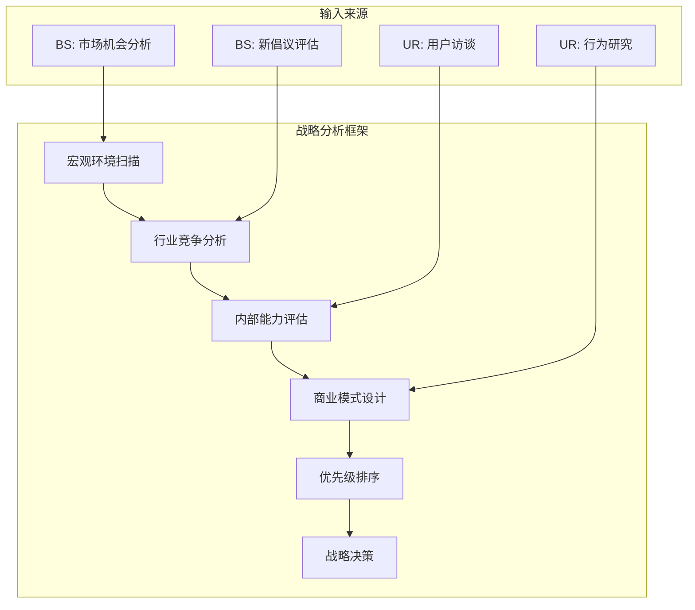
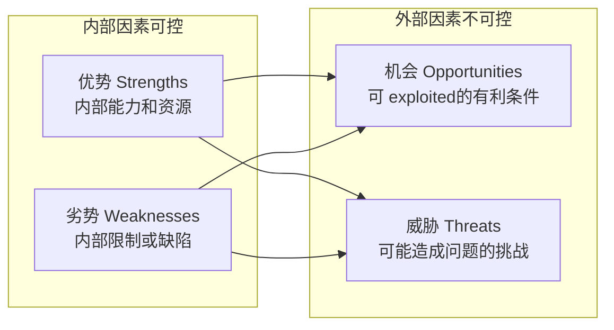
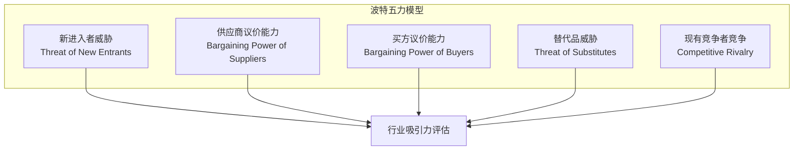
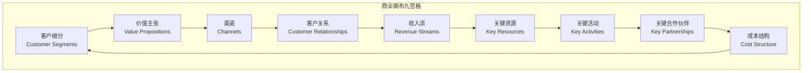
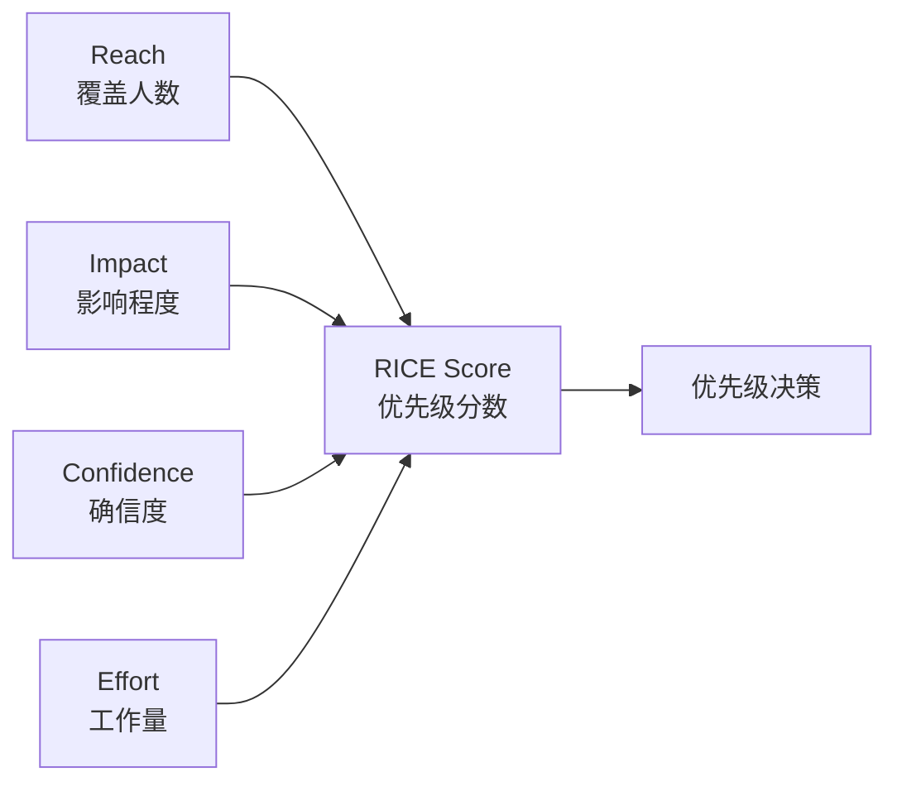
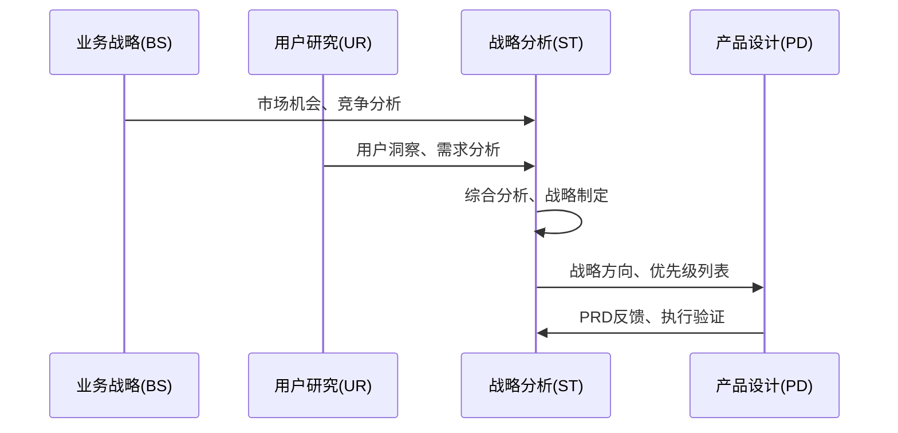
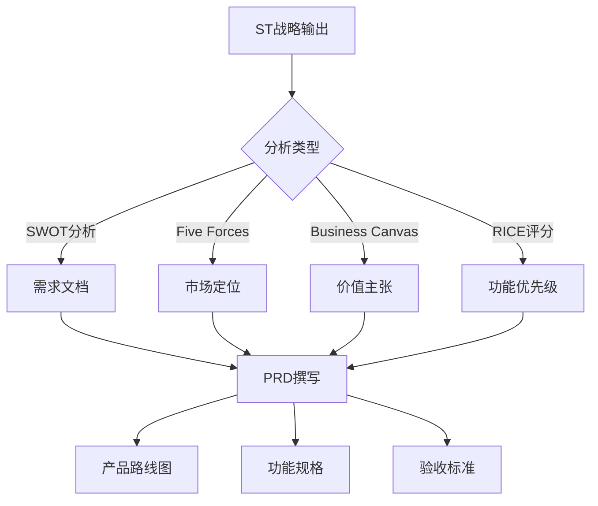
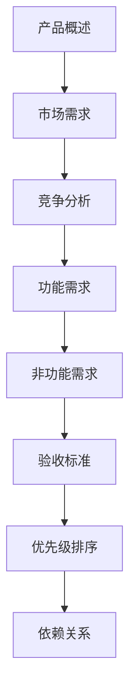

# 战略分析决策

<cite>
**本文档中引用的文件**
- [swot.md](file://niopd/commands/ST/swot.md)
- [porters-five-forces.md](file://niopd/commands/ST/porters-five-forces.md)
- [canvas.md](file://niopd/commands/ST/canvas.md)
- [rice.md](file://niopd/commands/ST/rice.md)
- [balanced-scorecard.md](file://niopd/commands/ST/balanced-scorecard.md)
- [moscow.md](file://niopd/commands/ST/moscow.md)
- [portfolio.md](file://niopd/commands/ST/portfolio.md)
- [pest.md](file://niopd/commands/ST/pest.md)
- [design-thinking.md](file://niopd/commands/ST/design-thinking.md)
- [design-sprint.md](file://niopd/commands/ST/design-sprint.md)
</cite>

## 目录
1. [引言](#引言)
2. [ST阶段概述](#st阶段概述)
3. [SWOT分析：系统性评估优势与威胁](#swot分析系统性评估优势与威胁)
4. [波特五力模型：行业竞争格局分析](#波特五力模型行业竞争格局分析)
5. [商业画布：商业模式九宫格梳理](#商业画布商业模式九宫格梳理)
6. [RICE模型：量化评分与优先级排序](#rice模型量化评分与优先级排序)
7. [战略工具集成：BS与UR输出整合](#战略工具集成-bs与ur输出整合)
8. [PD阶段指导：从ST到PRD的转化](#pd阶段指导从st到prd的转化)
9. [案例研究：新功能RICE评分实践](#案例研究新功能rice评分实践)
10. [总结与最佳实践](#总结与最佳实践)

## 引言

战略分析（ST）阶段是产品开发流程中的关键决策环节，负责整合业务战略（BS）和用户研究（UR）的输出，为高层级决策提供系统性框架。本阶段通过多种分析工具和方法，帮助团队深入理解市场环境、竞争态势和内部能力，从而制定科学的战略方向和优先级列表。

ST阶段的核心价值在于：
- **系统性评估**：运用结构化方法分析内外部因素
- **数据驱动决策**：基于定量分析和定性洞察做出判断
- **战略一致性**：确保产品决策与组织战略保持一致
- **风险识别**：提前发现潜在威胁和挑战

## ST阶段概述

战略分析阶段采用多维度分析框架，涵盖以下核心领域：

**图表来源**
- [swot.md](file://niopd/commands/ST/swot.md#L1-L50)
- [porters-five-forces.md](file://niopd/commands/ST/porters-five-forces.md#L1-L50)

### 分析维度

ST阶段从六个主要维度展开分析：

1. **外部环境分析**：PEST/PESTLE宏观环境扫描
2. **行业竞争分析**：波特五力模型
3. **内部能力评估**：SWOT分析
4. **商业模式设计**：商业画布
5. **资源优先级**：RICE模型
6. **战略目标对齐**：平衡计分卡

## SWOT分析：系统性评估优势与威胁

SWOT分析是战略分析中最经典的方法之一，通过系统性评估项目的内部优势、劣势以及外部的机会和威胁，为战略制定提供全面视角。

### 理论基础

SWOT分析由Albert Humphrey在1960年代末至1970年代初开发，最初用于Fortune 500公司的研究项目。该方法的核心原理是通过结构化框架进行战略情境分析。

### SWOT矩阵结构

**图表来源**
- [swot.md](file://niopd/commands/ST/swot.md#L20-L40)

### TOWS战略组合

基于SWOT分析，发展出TOWS矩阵强调战略制定：

1. **SO策略**：利用优势抓住机会（增长）
2. **WO策略**：克服劣势利用机会（改进）
3. **ST策略**：利用优势抵御威胁（防御）
4. **WT策略**：最小化劣势避免威胁（生存）

### 实施步骤

1. **内部分析**：识别核心能力和资源限制
2. **外部分析**：评估市场趋势和竞争环境
3. **战略组合**：生成具体的战略建议
4. **优先级排序**：确定实施重点

**章节来源**
- [swot.md](file://niopd/commands/ST/swot.md#L1-L408)

## 波特五力模型：行业竞争格局分析

波特五力模型是迈克尔·波特在1979年提出的重要竞争分析框架，通过分析五个关键力量来评估行业的吸引力和盈利能力。

### 五大力量构成

**图表来源**
- [porters-five-forces.md](file://niopd/commands/ST/porters-five-forces.md#L30-L60)

### 力量强度评估

每个力量都有其特定的决定因素：

1. **新进入者威胁**
   - 进入壁垒高度：资本要求、规模经济、品牌忠诚度
   - 行业吸引力：高威胁意味着激烈竞争和较低利润

2. **供应商议价能力**
   - 供应商集中度：少数供应商掌握定价权
   - 替代品可用性：缺乏替代品增加供应商权力

3. **买方议价能力**
   - 购买量：大客户群体具有更强议价能力
   - 产品差异化：低差异化产品更容易被替代

4. **替代品威胁**
   - 价格性能比：替代品更具性价比时威胁增加
   - 切换成本：低成本切换减少替代品威胁

5. **竞争竞争强度**
   - 竞争者数量：众多竞争者导致价格战
   - 行业增长率：低增长率加剧竞争

### 行业吸引力评级

根据五力分析结果，可以对行业进行整体吸引力评级：

- **高度吸引**：低竞争压力，高利润潜力
- **中等吸引**：平衡的竞争环境
- **低度吸引**：高竞争压力，低利润空间

**章节来源**
- [porters-five-forces.md](file://niopd/commands/ST/porters-five-forces.md#L1-L663)

## 商业画布：商业模式九宫格梳理

商业画布是由Alexander Osterwalder开发的可视化战略管理模板，描述了企业创造、交付和捕获价值的关键要素。

### 九个构建块

**图表来源**
- [canvas.md](file://niopd/commands/ST/canvas.md#L20-L50)

### 客户面向组件

**客户细分**：明确目标客户群体及其特征
- 人口统计学特征
- 心理特征
- 行为模式
- 需求痛点

**价值主张**：解决客户问题的具体方案
- 功能性益处（性能、质量）
- 情感性益处（设计、地位）
- 社会性益处（社区、责任）

### 基础设施组件

**关键资源**：实现价值主张所需的资产
- 物理资源（设施、设备）
- 财务资源（资本、投资）
- 知识资源（专利、品牌）
- 人力资源（员工、网络）

**成本结构**：主要成本类别和经济学
- 固定成本vs可变成本
- 规模经济vs范围经济
- 成本驱动因素

### 应用场景

商业画布适用于：
- 新业务模型设计
- 现有业务模型创新
- 启动计划验证
- 战略对齐工作坊
- 业务模型转型

**章节来源**
- [canvas.md](file://niopd/commands/ST/canvas.md#L1-L263)

## RICE模型：量化评分与优先级排序

RICE模型由Intercom的产品团队开发，提供了一种量化的方法来比较不同产品特性的优先级，确保资源分配的客观性和一致性。

### RICE公式

**RICE得分 = (覆盖人数 × 影响程度 × 确信度) ÷ 工作量**

### 四个要素详解

**图表来源**
- [rice.md](file://niopd/commands/ST/rice.md#L30-L60)

### 具体要素定义

**R - Reach（覆盖人数）**
- **问题**：在时间周期内会影响多少人？
- **测量**：绝对数字（例如："每季度500名客户"）
- **示例**："每月2,000名用户将看到此功能"

**I - Impact（影响程度）**
- **问题**：对每个人的影响有多大？
- **量表**：3=巨大影响，2=高影响，1=中等影响，0.5=低影响，0.25=微小影响

**C - Confidence（确信度）**
- **问题**：我们对自己的估计有多确信？
- **量表**：百分比（0-100%）
- **示例**："基于类似过往功能的80%确信度"

**E - Effort（工作量）**
- **问题**：需要多少团队时间？
- **测量**：人月（产品、设计、工程）
- **包含**：整个团队的所有学科
- **最小值**：0.5人月

### 评分实践

以添加社交登录功能为例：

- **Reach**：每季度1,000名新用户
- **Impact**：2（高影响 - 提升注册转化率）
- **Confidence**：80%（0.8）
- **Effort**：2人月

**RICE得分** = (1,000 × 2 × 0.8) / 2 = **800**

### 应用场景

RICE模型适用于：
- 产品待办事项优先级
- 路线图规划
- 功能优先级排序
- 资源分配决策
- 季度规划

**章节来源**
- [rice.md](file://niopd/commands/ST/rice.md#L1-L582)

## 战略工具集成：BS与UR输出整合

ST阶段的成功在于有效整合BS（业务战略）和UR（用户研究）的输出，形成统一的战略视角。

### 整合流程

**图表来源**
- [swot.md](file://niopd/commands/ST/swot.md#L100-L150)
- [porters-five-forces.md](file://niopd/commands/ST/porters-five-forces.md#L200-L250)

### 关键整合点

1. **市场机会与竞争分析**
   - BS提供的市场趋势数据
   - UR收集的用户行为洞察
   - 结合形成市场定位策略

2. **用户需求与技术可行性**
   - UR识别的痛点和需求
   - 技术团队的能力评估
   - 形成可行的产品路线图

3. **商业模式与盈利模式**
   - BS定义的收入模型
   - UR验证的用户支付意愿
   - 商业画布优化

### 工具协同效应

不同分析工具之间的协同作用：

| 工具组合 | 协同效果 | 输出成果 |
|---------|---------|---------|
| SWOT + PESTLE | 全面内外部分析 | 战略定位报告 |
| Five Forces + SWOT | 竞争环境+能力分析 | 竞争策略文档 |
| Canvas + RICE | 商业模型+优先级 | 资源配置方案 |
| Balanced Scorecard + MOSCOW | 目标对齐+范围控制 | 执行计划 |

**章节来源**
- [swot.md](file://niopd/commands/ST/swot.md#L300-L408)
- [rice.md](file://niopd/commands/ST/rice.md#L400-L582)

## PD阶段指导：从ST到PRD的转化

ST阶段的输出直接指导PD（产品设计）阶段的PRD（产品需求文档）撰写，形成从战略到执行的完整链条。

### 战略输出到PRD的映射

**图表来源**
- [rice.md](file://niopd/commands/ST/rice.md#L500-L582)

### 具体转化路径

1. **SWOT分析 → 需求文档**
   - **优势**：转化为核心功能特性
   - **劣势**：识别需要改进的方面
   - **机会**：新兴功能开发方向
   - **威胁**：风险缓解措施

2. **RICE评分 → 功能优先级**
   - 高分功能优先开发
   - 中等分数功能纳入路线图
   - 低分功能考虑延期或取消

3. **商业画布 → 价值主张**
   - 明确目标客户群体
   - 设计独特的价值主张
   - 制定营销传播策略

### PRD撰写模板

基于ST阶段输出的PRD结构：

**章节来源**
- [rice.md](file://niopd/commands/ST/rice.md#L550-L582)

## 案例研究：新功能RICE评分实践

以下是一个完整的RICE评分实践案例，展示如何为新功能进行量化评估和优先级排序。

### 案例背景

假设我们正在评估三个新功能提案：

1. **社交登录功能**
2. **个性化推荐引擎**
3. **移动端应用推送**

### RICE评分过程

#### 1. 社交登录功能

**Reach**: 每季度1,000名新用户
**Impact**: 2（高影响 - 提升注册转化率）
**Confidence**: 80%（基于类似功能的历史表现）
**Effort**: 2人月（1设计师 + 2工程师 × 1个月）

**RICE得分**: (1,000 × 2 × 0.8) / 2 = **800**

#### 2. 个性化推荐引擎

**Reach**: 每月5,000活跃用户
**Impact**: 1.5（中等影响 - 提升用户参与度）
**Confidence**: 60%（基于算法复杂性）
**Effort**: 6人月（需要数据科学家和机器学习专家）

**RICE得分**: (5,000 × 1.5 × 0.6) / 6 = **750**

#### 3. 移动端应用推送

**Reach**: 每月2,000活跃用户
**Impact**: 1（中等影响 - 提升通知点击率）
**Confidence**: 90%（基于成熟的技术栈）
**Effort**: 1.5人月（前端开发为主）

**RICE得分**: (2,000 × 1 × 0.9) / 1.5 = **1,200**

### 评分结果分析

| 功能 | Reach | Impact | Confidence | Effort | RICE得分 | 排名 |
|------|-------|--------|------------|--------|----------|------|
| 移动端推送 | 2,000 | 1.0 | 90% | 1.5 | **1,200** | 1 |
| 社交登录 | 1,000 | 2.0 | 80% | 2.0 | **800** | 2 |
| 推荐引擎 | 5,000 | 1.5 | 60% | 6.0 | **750** | 3 |

### 决策建议

1. **首选实施**：移动端应用推送（RICE得分最高）
2. **次选实施**：社交登录功能
3. **考虑迭代**：个性化推荐引擎

### 风险分析

**社交登录功能**：
- **优势**：快速提升注册转化率
- **风险**：第三方服务依赖
- **建议**：先进行MVP测试

**推荐引擎**：
- **优势**：长期用户粘性提升
- **风险**：技术复杂度高
- **建议**：分阶段实施

**移动端推送**：
- **优势**：技术成熟，用户接受度高
- **风险**：推送疲劳可能导致负面效果
- **建议**：精细化推送策略

**章节来源**
- [rice.md](file://niopd/commands/ST/rice.md#L200-L400)

## 总结与最佳实践

### 核心原则

1. **系统性思维**：运用多种分析工具形成互补视角
2. **数据驱动**：基于定量分析和定性洞察做决策
3. **用户中心**：始终以用户需求为导向
4. **战略一致性**：确保产品决策与组织战略对齐
5. **迭代优化**：持续更新和调整分析结果

### 实施建议

1. **建立跨职能团队**：确保ST分析涵盖所有关键视角
2. **定期更新分析**：市场环境变化时及时重新评估
3. **文档化决策过程**：记录分析依据和决策理由
4. **跟踪执行效果**：验证战略决策的实际效果
5. **培养分析文化**：在团队中推广系统性分析方法

### 工具选择指南

根据不同场景选择合适的分析工具：

| 场景 | 推荐工具 | 理由 |
|------|---------|------|
| 新市场进入 | Porter's Five Forces | 评估竞争环境 |
| 产品定位 | SWOT Analysis | 全面评估内外部因素 |
| 商业模式设计 | Business Canvas | 可视化价值创造过程 |
| 功能优先级 | RICE Scoring | 量化资源分配决策 |
| 战略目标对齐 | Balanced Scorecard | 目标分解和绩效管理 |

### 成功要素

成功的战略分析需要：

1. **清晰的目标定义**：明确分析的目的和预期成果
2. **高质量的数据**：确保分析基于准确可靠的信息
3. **跨部门协作**：整合不同视角和专业知识
4. **领导层支持**：获得决策层的认可和授权
5. **持续改进**：根据实际效果不断优化分析方法

通过系统性地运用这些战略分析工具和方法，团队能够做出更加科学、客观的产品决策，提高产品成功的概率，同时确保资源的有效配置。