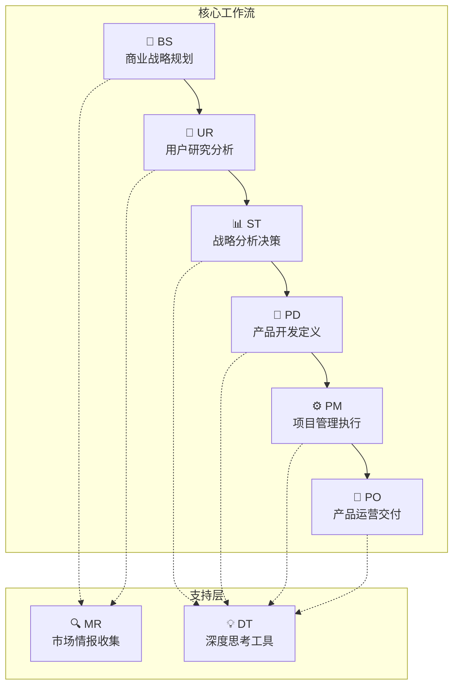
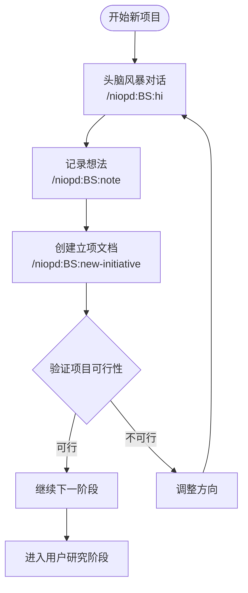
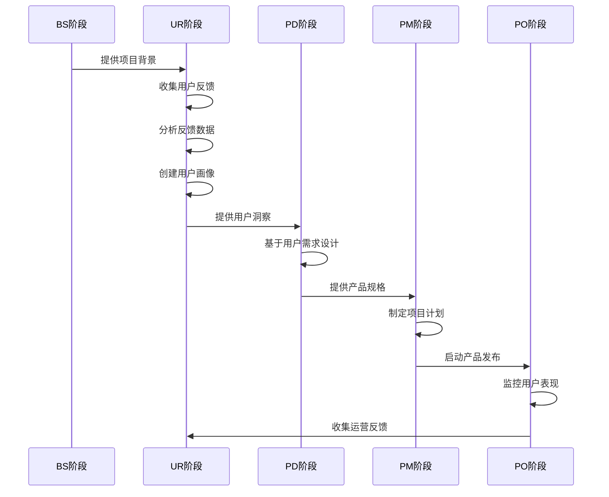
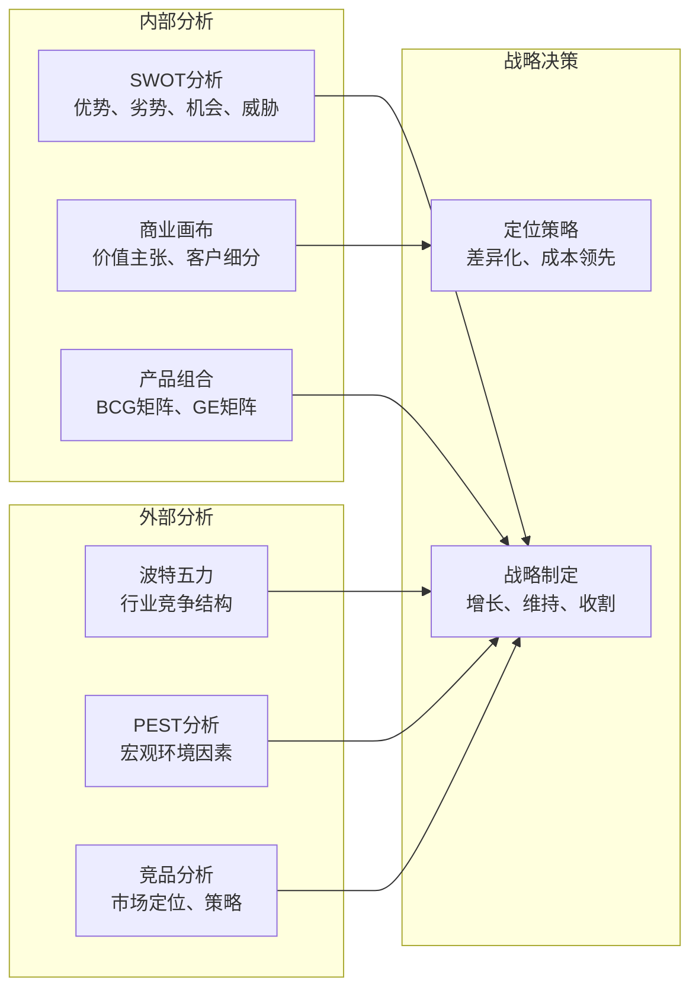
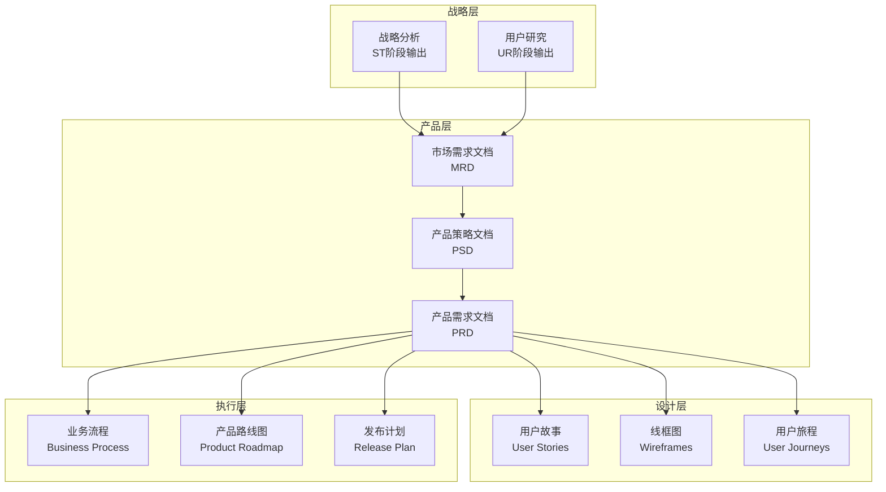
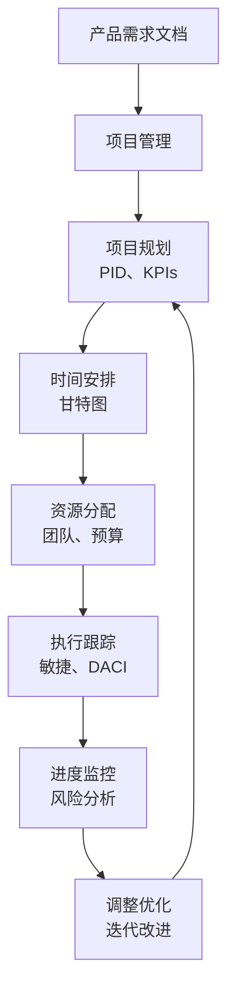
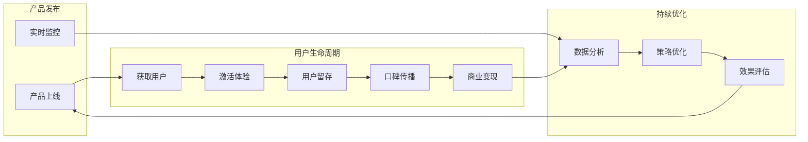
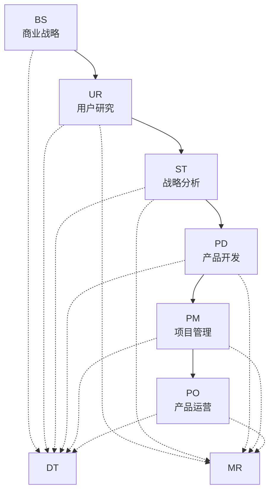
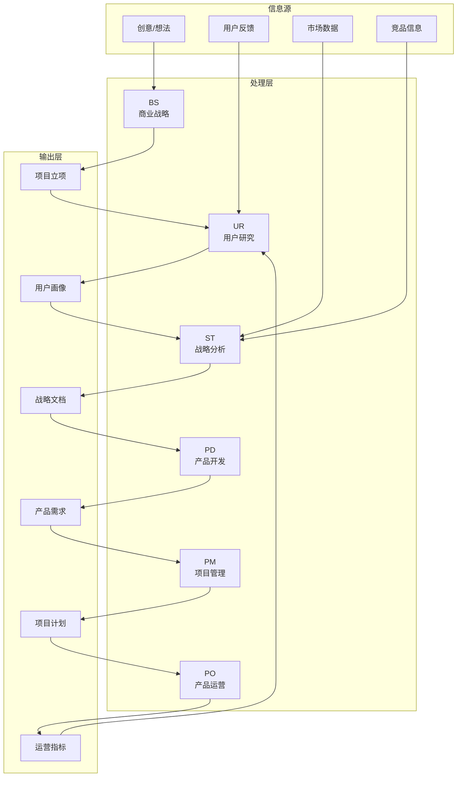

# NioPD工作流架构核心阶段详细解析

<cite>
**本文档引用的文件**
- [README.md](file://README.md)
- [niopd/commands/BS/new-initiative.md](file://niopd/commands/BS/new-initiative.md)
- [niopd/commands/UR/feedback.md](file://niopd/commands/UR/feedback.md)
- [niopd/commands/UR/personas.md](file://niopd/commands/UR/personas.md)
- [niopd/commands/ST/swot.md](file://niopd/commands/ST/swot.md)
- [niopd/commands/ST/porters-five-forces.md](file://niopd/commands/ST/porters-five-forces.md)
- [niopd/commands/PD/draft-prd.md](file://niopd/commands/PD/draft-prd.md)
- [niopd/commands/PM/roadmap.md](file://niopd/commands/PM/roadmap.md)
- [niopd/commands/PO/aarrr-metrics.md](file://niopd/commands/PO/aarrr-metrics.md)
- [niopd/templates/initiative-template.md](file://niopd/templates/initiative-template.md)
- [niopd/templates/prd-template.md](file://niopd/templates/prd-template.md)
</cite>

## 目录
1. [概述](#概述)
2. [工作流架构总览](#工作流架构总览)
3. [商业战略(BS)阶段](#商业战略bs阶段)
4. [用户研究(UR)阶段](#用户研究ur阶段)
5. [战略分析(ST)阶段](#战略分析st阶段)
6. [产品开发(PD)阶段](#产品开发pd阶段)
7. [项目管理(PM)阶段](#项目管理pm阶段)
8. [产品运营(PO)阶段](#产品运营po阶段)
9. [阶段间依赖关系](#阶段间依赖关系)
10. [信息流动路径](#信息流动路径)
11. [最佳实践建议](#最佳实践建议)

## 概述

NioPD工作流架构是一个系统化的产品管理方法论，遵循BS→UR→ST→PD→PM→PO的主线流程，辅以MR市场研究和DT深度思考工具的支持。该架构采用文档驱动的方法，通过六个核心阶段的递进式工作流，确保产品从概念到落地的每个环节都有充分的思考和验证。

**图表来源**
- [README.md](file://README.md#L127-L161)

## 工作流架构总览

NioPD采用四层文档结构，每个阶段都有明确的输出目录和方法论支撑：

| 阶段 | 命名空间 | 输出目录 | 核心方法论 | 主要职责 |
|------|---------|---------|-----------|----------|
| **SYS** | 系统管理 | - | 工程化管理 | 工作区初始化、系统配置 |
| **BS** | 商业战略规划 | `sources/` | Brain Storming | 从想法生成到产品方向规划 |
| **DT** | 深度思考工具 | `sources/` | 第一性原理、五个为什么 | 任何阶段的思维工具 |
| **MR** | 市场研究 | `reports/` | 竞品分析、市场定位 | 全过程提供市场洞察 |
| **UR** | 用户研究分析 | `reports/` | JTBD、Kano、用户画像 | 深入了解用户需求、行为、痛点 |
| **ST** | 战略分析决策 | `reports/` | SWOT、波特五力、商业画布 | 基于数据和框架的战略决策 |
| **PD** | 产品开发定义 | `docs/` | MRD/PSD/PRD文档层级 | 转化洞察为具体产品需求 |
| **PM** | 项目管理执行 | `plans/` | PID、敏捷、DACI | 规划、执行和跟踪项目进展 |
| **PO** | 产品运营交付 | `docs/` | AARRR、北极星指标 | 产品发布和持续优化 |

**节来源**
- [README.md](file://README.md#L163-L195)

## 商业战略(BS)阶段

### 核心目标
BS阶段负责从模糊的想法演化为清晰的产品方向，通过系统化的头脑风暴和战略思考，为产品开发奠定坚实的基础。

### 输入输出
- **输入**: 初步想法、市场观察、业务背景
- **输出**: 项目立项文档(initiative document)
- **核心指令**: `/niopd:BS:new-initiative`

### 关键指令详解

#### `/niopd:BS:new-initiative` - 启动新项目

这是BS阶段的核心指令，通过引导式对话创建结构化的项目立项文档。

**核心流程**:
1. **Discovery & Framing**: 理解初始想法和问题空间
2. **Research & Augmentation**: 识别知识缺口和外部信息需求
3. **Guided Synthesis & Design**: 将想法结构化为完整计划
4. **Deliverable Co-Creation**: 转化概念为正式文档

**文档结构**:
- 项目背景和动机
- 目标用户和价值主张  
- 成功标准和衡量指标
- 初步范围和约束
- 关键假设和风险

**典型工作场景**:
- 产品创意的初步验证
- 市场机会的识别和评估
- 产品方向的战略规划

**节来源**
- [niopd/commands/BS/new-initiative.md](file://niopd/commands/BS/new-initiative.md#L1-L214)
- [niopd/templates/initiative-template.md](file://niopd/templates/initiative-template.md#L1-L89)

### 典型工作流程

**图表来源**
- [niopd/commands/BS/new-initiative.md](file://niopd/commands/BS/new-initiative.md#L100-L200)

## 用户研究(UR)阶段

### 核心目标
深入理解用户需求、行为和痛点，通过系统化的研究方法为产品设计提供用户洞察。

### 输入输出
- **输入**: 项目立项文档、用户反馈数据
- **输出**: 用户画像(personas)、用户旅程地图(journey maps)
- **核心指令**: `/niopd:UR:feedback`, `/niopd:UR:personas`

### 关键指令详解

#### `/niopd:UR:feedback` - 用户反馈分析

通过主题分析法对用户反馈进行系统化整理和分析。

**分析流程**:
1. **数据预处理**: 清洗和标准化反馈文本
2. **主题识别**: 将相关反馈归类为有意义的主题
3. **情感分析**: 评估反馈的情感倾向和强度
4. **量化优先级**: 基于频率、情感强度和业务影响排序

**反馈分类**:
- **Pain Points**: 用户遇到的问题和困扰
- **Feature Requests**: 用户期望的功能需求
- **Positive Feedback**: 用户赞赏的内容
- **Usage Patterns**: 用户行为洞察
- **Competitive Mentions**: 竞品相关信息

**典型工作场景**:
- App Store评论分析
- 客服支持数据整理
- 用户调查问卷处理
- 社交媒体反馈监控

**节来源**
- [niopd/commands/UR/feedback.md](file://niopd/commands/UR/feedback.md#L1-L285)

#### `/niopd:UR:personas` - 用户画像生成

基于反馈分析结果创建详细的用户画像，帮助团队建立用户同理心。

**画像要素**:
- **人口统计**: 年龄、职业、地理位置、教育程度
- **心理特征**: 价值观、态度、动机、个性
- **行为模式**: 使用习惯、工作流程、偏好
- **目标需求**: 核心目标、痛点、需求
- **决策风格**: 决策方式、风险承受度、沟通偏好

**典型工作场景**:
- 新产品定位
- 市场细分分析
- 营销策略制定
- 产品功能优先级排序

**节来源**
- [niopd/commands/UR/personas.md](file://niopd/commands/UR/personas.md#L1-L576)

### 用户研究工作流程

**图表来源**
- [niopd/commands/UR/feedback.md](file://niopd/commands/UR/feedback.md#L50-L150)
- [niopd/commands/UR/personas.md](file://niopd/commands/UR/personas.md#L100-L200)

## 战略分析(ST)阶段

### 核心目标
基于数据和框架进行战略决策，通过系统化的分析工具识别机会和威胁，制定产品战略。

### 输入输出
- **输入**: 用户研究结果、市场研究数据
- **输出**: 战略分析报告(SWOT、波特五力等)
- **核心指令**: `/niopd:ST:swot`, `/niopd:ST:porters-five-forces`

### 关键指令详解

#### `/niopd:ST:swot` - SWOT分析

通过优势、劣势、机会、威胁分析，为企业战略决策提供全面视角。

**分析维度**:
- **内部因素**: 企业控制范围内
  - **Strengths**: 竞争优势和资源
  - **Weaknesses**: 内部限制和不足
- **外部因素**: 企业无法控制
  - **Opportunities**: 可利用的有利条件
  - **Threats**: 可能造成问题的挑战

**战略组合**:
- **SO策略**: 利用优势抓住机会
- **WO策略**: 弥补弱点追求机会  
- **ST策略**: 利用优势抵御威胁
- **WT策略**: 减少弱点避免威胁

**典型工作场景**:
- 新产品上市前评估
- 竞争策略制定
- 业务重组决策
- 市场进入评估

**节来源**
- [niopd/commands/ST/swot.md](file://niopd/commands/ST/swot.md#L1-L408)

#### `/niopd:ST:porters-five-forces` - 波特五力分析

分析行业竞争结构和盈利能力潜力，评估市场吸引力。

**五力模型**:
1. **新进入者威胁**: 进入壁垒和保护程度
2. **供应商议价能力**: 供应商集中度和替代品
3. **买家议价能力**: 买家集中度和替代品
4. **替代品威胁**: 替代方案的价格性能
5. **行业内竞争**: 竞争激烈程度和增长速度

**分析重点**:
- 行业结构特征
- 竞争力量强度
- 盈利能力预测
- 战略定位建议

**典型工作场景**:
- 行业分析报告
- 投资决策支持
- 竞争策略制定
- 市场进入评估

**节来源**
- [niopd/commands/ST/porters-five-forces.md](file://niopd/commands/ST/porters-five-forces.md#L1-L663)

### 战略分析工作流程

**图表来源**
- [niopd/commands/ST/swot.md](file://niopd/commands/ST/swot.md#L100-L200)
- [niopd/commands/ST/porters-five-forces.md](file://niopd/commands/ST/porters-five-forces.md#L200-L300)

## 产品开发(PD)阶段

### 核心目标
将战略洞察转化为具体的产品需求，通过MRD/PSD/PRD文档层级，确保产品定义的准确性和可执行性。

### 输入输出
- **输入**: 战略分析报告、用户研究结果
- **输出**: 产品需求文档(PRD)、MRD、PSD
- **核心指令**: `/niopd:PD:draft-prd`

### 关键指令详解

#### `/niopd:PD:draft-prd` - 产品需求文档生成

基于现有项目和反馈数据，生成结构化的产品需求文档。

**文档层次结构**:
1. **MRD (市场需求文档)**: 市场分析和机会识别
2. **PSD (产品策略文档)**: 产品愿景和战略
3. **PRD (产品需求文档)**: 详细功能要求

**PRD核心组件**:
- **Why (背景)**: 问题陈述、用户需求、业务目标
- **What (需求)**: 功能要求、非功能要求、用户故事
- **Who (用户)**: 用户画像、目标用户群
- **How (设计)**: 用户流程、业务流程、技术架构
- **When (时间)**: 里程碑、依赖关系、分阶段发布

**典型工作场景**:
- 新功能开发
- 产品发布准备
- 跨团队需求对齐
- 开发团队需求说明

**节来源**
- [niopd/commands/PD/draft-prd.md](file://niopd/commands/PD/draft-prd.md#L1-L252)
- [niopd/templates/prd-template.md](file://niopd/templates/prd-template.md#L1-L125)

### 产品开发工作流程

**图表来源**
- [niopd/commands/PD/draft-prd.md](file://niopd/commands/PD/draft-prd.md#L50-L150)

## 项目管理(PM)阶段

### 核心目标
规划、执行和跟踪项目进展，通过系统化的项目管理方法确保产品按时高质量交付。

### 输入输出
- **输入**: 产品需求文档、资源计划
- **输出**: 项目计划文档、发布计划、风险管理
- **核心指令**: `/niopd:PM:roadmap`

### 关键指令详解

#### `/niopd:PM:roadmap` - 产品路线图生成

基于当前所有项目生成综合性的甘特图式产品路线图。

**路线图要素**:
- **战略主题**: 产品发展方向和重点
- **项目时间线**: 各项目的开始和结束时间
- **依赖关系**: 项目间的相互依赖
- **里程碑**: 关键节点和交付物
- **资源分配**: 团队和资源的分配情况

**路线图类型**:
- **内部/执行**: 功能级别的详细计划
- **外部/销售**: 主题级别的粗略时间安排
- **战略/高层**: 项目级别的季度规划

**典型工作场景**:
- 产品路线图制定
- 项目优先级排序
- 资源协调和冲突解决
- 跨部门沟通和对齐

**节来源**
- [niopd/commands/PM/roadmap.md](file://niopd/commands/PM/roadmap.md#L1-L166)

### 项目管理工作流程

**图表来源**
- [niopd/commands/PM/roadmap.md](file://niopd/commands/PM/roadmap.md#L50-L100)

## 产品运营(PO)阶段

### 核心目标
产品发布后的持续优化和成功衡量，通过AARRR海盗指标等框架监控产品表现。

### 输入输出
- **输入**: 产品发布、用户数据
- **输出**: 运营报告、成功指标
- **核心指令**: `/niopd:PO:aarrr-metrics`

### 关键指令详解

#### `/niopd:PO:aarrr-metrics` - AARRR海盗指标分析

基于用户生命周期的五个关键阶段进行增长分析。

**五大指标**:
1. **Acquisition (获取)**: 用户发现和访问产品
2. **Activation (激活)**: 用户首次体验核心价值
3. **Retention (留存)**: 用户持续使用产品
4. **Referral (推荐)**: 用户主动推广产品
5. **Revenue (收入)**: 产品商业化成果

**分析重点**:
- **漏斗转化**: 各阶段的转化率和流失点
- **用户生命周期**: 从获取到付费的完整路径
- **增长瓶颈**: 识别影响整体增长的关键环节
- **优化策略**: 针对薄弱环节的具体改进措施

**典型工作场景**:
- 产品增长分析
- 用户行为监控
- 营销效果评估
- 产品迭代指导

**节来源**
- [niopd/commands/PO/aarrr-metrics.md](file://niopd/commands/PO/aarrr-metrics.md#L1-L590)

### 产品运营工作流程

**图表来源**
- [niopd/commands/PO/aarrr-metrics.md](file://niopd/commands/PO/aarrr-metrics.md#L100-L200)

## 阶段间依赖关系

### 核心依赖链

### 依赖关系详解

#### BS → UR: 从想法到用户洞察
- **依赖类型**: 输入依赖
- **具体内容**: BS阶段的项目背景为UR阶段的用户研究提供方向
- **信息传递**: 项目目标 → 用户需求识别
- **质量要求**: BS阶段应提供清晰的产品定位和目标用户描述

#### UR → ST: 从用户洞察到战略决策
- **依赖类型**: 数据依赖
- **具体内容**: UR阶段的用户研究结果为ST阶段的战略分析提供实证基础
- **信息传递**: 用户痛点 → 战略机会识别
- **质量要求**: UR阶段应提供充分的用户数据和洞察

#### ST → PD: 从战略到产品定义
- **依赖类型**: 方向依赖
- **具体内容**: ST阶段的战略分析结果指导PD阶段的产品设计
- **信息传递**: 战略优先级 → 产品功能规划
- **质量要求**: ST阶段应提供明确的战略选择和优先级

#### PD → PM: 从需求到执行计划
- **依赖类型**: 规格依赖
- **具体内容**: PD阶段的产品需求文档为PM阶段的项目计划提供依据
- **信息传递**: 产品规格 → 项目时间线
- **质量要求**: PD阶段应提供完整、可执行的需求定义

#### PM → PO: 从交付到运营
- **依赖类型**: 成果依赖
- **具体内容**: PM阶段的项目交付为PO阶段的产品运营提供基础
- **信息传递**: 产品上线 → 运营监控
- **质量要求**: PM阶段应确保产品按时高质量交付

## 信息流动路径

### 信息流向图

### 信息转换机制

#### 1. 从BS到UR的信息转换
- **转换类型**: 概念 → 具体
- **转换过程**: 项目想法 → 用户需求识别
- **转换工具**: Socratic questioning, Jobs-to-be-Done
- **转换产物**: 用户痛点、需求优先级

#### 2. 从UR到ST的信息转换
- **转换类型**: 数据 → 洞察
- **转换过程**: 用户反馈 → 战略机会识别
- **转换工具**: SWOT分析、PEST分析
- **转换产物**: 战略选择、优先级排序

#### 3. 从ST到PD的信息转换
- **转换类型**: 战略 → 规格
- **转换过程**: 战略优先级 → 产品功能规划
- **转换工具**: 商业画布、价值主张
- **转换产物**: 产品特性、技术要求

#### 4. 从PD到PM的信息转换
- **转换类型**: 规格 → 计划
- **转换过程**: 产品需求 → 项目时间线
- **转换工具**: 甘特图、WBS
- **转换产物**: 项目计划、资源分配

#### 5. 从PM到PO的信息转换
- **转换类型**: 计划 → 实践
- **转换过程**: 项目交付 → 产品运营
- **转换工具**: AARRR指标、用户分析
- **转换产物**: 运营策略、优化建议

## 最佳实践建议

### 1. 阶段执行最佳实践

#### BS阶段最佳实践
- **保持开放思维**: 鼓励创造性思考，不要过早否定想法
- **系统化记录**: 使用`/niopd:BS:note`及时记录灵感
- **结构化思考**: 通过`/niopd:BS:hi`进行深度对话
- **验证假设**: 早期验证项目可行性

#### UR阶段最佳实践
- **多渠道收集**: 整合多种用户反馈来源
- **主题分析**: 系统化处理大量反馈数据
- **用户画像**: 基于真实数据创建可信画像
- **持续迭代**: 根据新发现不断更新理解

#### ST阶段最佳实践
- **数据驱动**: 基于实际数据而非假设做决策
- **多角度分析**: 综合使用多种分析框架
- **动态更新**: 定期更新分析结果
- **战略对齐**: 确保战略与业务目标一致

#### PD阶段最佳实践
- **用户中心**: 始终以用户需求为导向
- **迭代开发**: 采用敏捷方法逐步完善
- **跨团队协作**: 确保各团队对需求理解一致
- **可测试性**: 确保需求具有可测试性

#### PM阶段最佳实践
- **透明沟通**: 保持项目状态透明
- **风险管理**: 早期识别和应对风险
- **灵活调整**: 根据实际情况调整计划
- **资源优化**: 合理分配有限资源

#### PO阶段最佳实践
- **数据监控**: 建立完善的监控体系
- **快速迭代**: 基于数据快速优化产品
- **用户反馈**: 建立有效的用户反馈机制
- **持续学习**: 从运营数据中学习和成长

### 2. 工作流优化建议

#### 1. 并行处理优化
- **MR与BS并行**: 在BS阶段同时进行市场研究
- **DT贯穿全程**: 在任何阶段都可以使用深度思考工具
- **交叉验证**: 不同阶段的结果相互验证

#### 2. 迭代优化
- **快速原型**: 早期制作最小可行产品验证假设
- **用户测试**: 早期用户测试减少后期返工
- **数据驱动**: 基于实际数据调整方向

#### 3. 团队协作
- **定期同步**: 建立定期的跨阶段同步会议
- **文档共享**: 确保所有阶段的文档可访问
- **角色明确**: 明确各阶段的责任人和决策权

### 3. 工具使用建议

#### 推荐的工具组合
- **BS阶段**: `/niopd:BS:hi` + `/niopd:BS:note` + `/niopd:BS:new-initiative`
- **UR阶段**: `/niopd:UR:feedback` + `/niopd:UR:personas` + `/niopd:UR:jtb`
- **ST阶段**: `/niopd:ST:swot` + `/niopd:ST:porters-five-forces` + `/niopd:ST:pest`
- **PD阶段**: `/niopd:PD:draft-prd` + `/niopd:PD:stories` + `/niopd:PD:journey`
- **PM阶段**: `/niopd:PM:roadmap` + `/niopd:PM:release` + `/niopd:PM:kpis`
- **PO阶段**: `/niopd:PO:aarrr-metrics` + `/niopd:PO:north-star` + `/niopd:PO:customer-success`

#### 工具使用顺序
1. **启动阶段**: BS → UR → ST
2. **开发阶段**: ST → PD → PM
3. **运营阶段**: PM → PO
4. **迭代阶段**: PO → BS（基于运营反馈）

### 4. 风险管理建议

#### 1. 项目风险
- **需求变更**: 建立变更控制流程
- **资源不足**: 提前识别和规划资源需求
- **技术风险**: 技术可行性验证
- **市场风险**: 市场验证和用户测试

#### 2. 执行风险
- **进度延误**: 设置缓冲时间和关键路径监控
- **质量不达标**: 建立质量保证流程
- **沟通障碍**: 建立有效的沟通机制
- **知识流失**: 文档化和知识传承

#### 3. 应对策略
- **预防措施**: 早期识别和预防风险
- **缓解计划**: 制定风险缓解策略
- **应急响应**: 建立快速响应机制
- **持续监控**: 建立风险监控体系

通过遵循这些最佳实践和建议，可以最大化NioPD工作流架构的价值，确保产品从概念到成功的每个环节都得到充分的关注和优化。