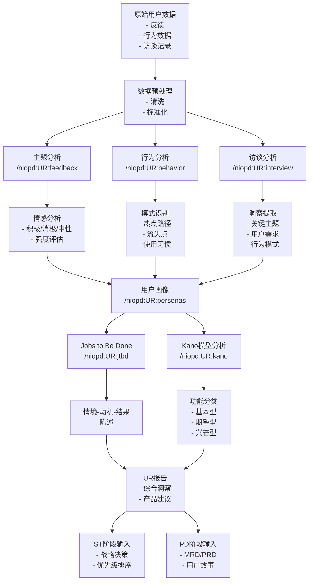
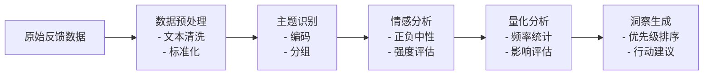
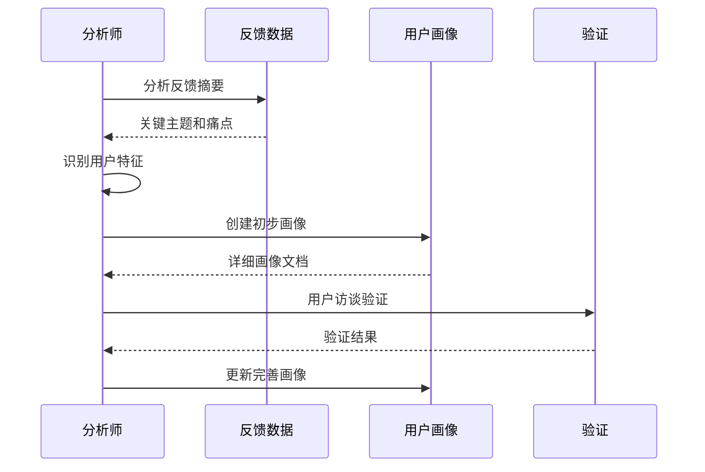
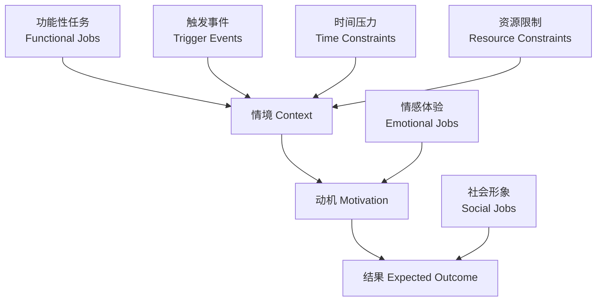
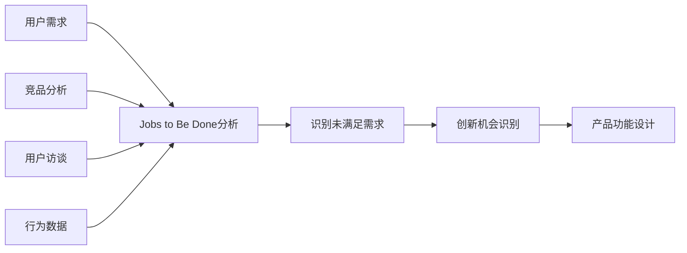
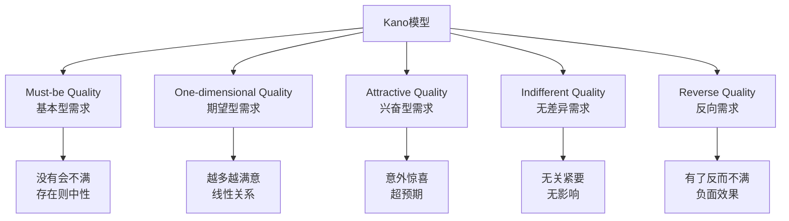
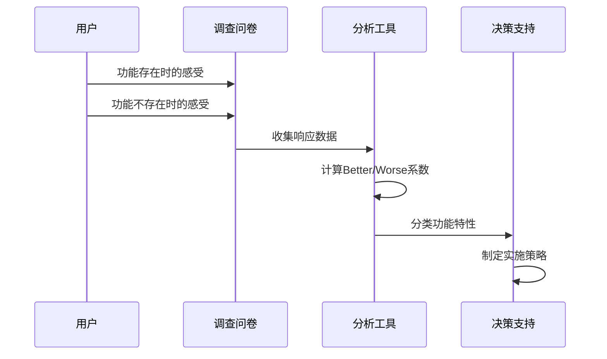
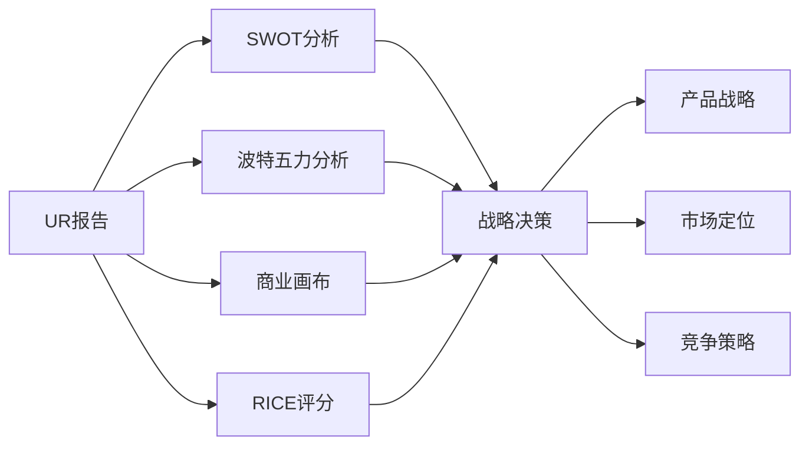
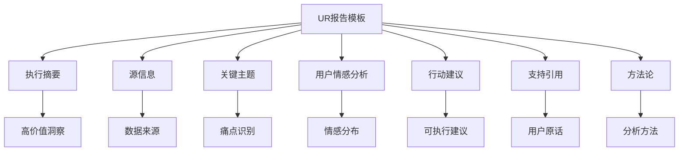
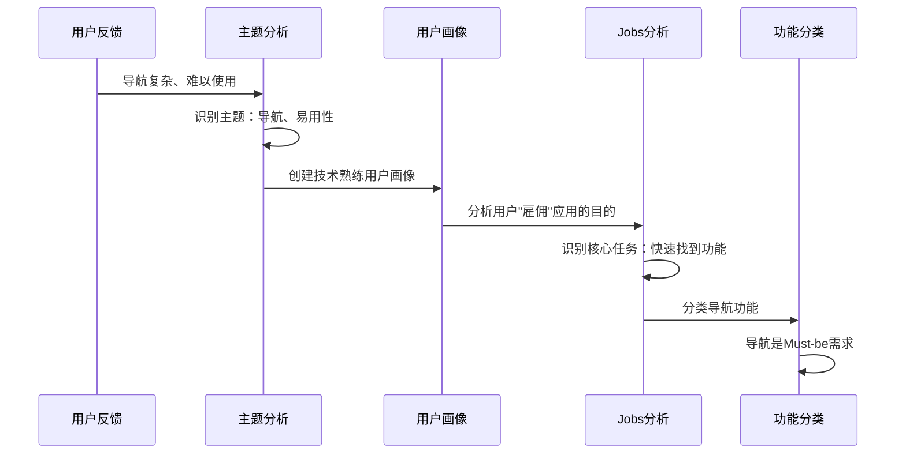

# 用户研究分析

<cite>
**本文档中引用的文件**
- [feedback.md](file://niopd/commands/UR/feedback.md)
- [personas.md](file://niopd/commands/UR/personas.md)
- [jtbd.md](file://niopd/commands/UR/jtbd.md)
- [kano.md](file://niopd/commands/UR/kano.md)
- [behavior.md](file://niopd/commands/UR/behavior.md)
- [interview.md](file://niopd/commands/UR/interview.md)
- [journey.md](file://niopd/commands/UR/journey.md)
- [satisfaction.md](file://niopd/commands/UR/satisfaction.md)
- [usability.md](file://niopd/commands/UR/usability.md)
- [feedback-summary-template.md](file://niopd/templates/feedback-summary-template.md)
- [persona-template.md](file://niopd/templates/persona-template.md)
</cite>

## 目录
1. [简介](#简介)
2. [用户研究工作流概览](#用户研究工作流概览)
3. [/niopd:UR:feedback - 主题与情感分析](#niopdurfeedback---主题与情感分析)
4. [/niopd:UR:personas - 用户画像构建](#niopdurpersonas---用户画像构建)
5. [/niopd:UR:jtbd - 待完成的工作框架](#niopurjtbd---待完成的工作框架)
6. [/niopd:UR:kano - Kano模型分类](#niopurkano---kanomodel分类)
7. [工作流集成与UR报告应用](#工作流集成与ur报告应用)
8. [实际案例分析](#实际案例分析)
9. [总结](#总结)

## 简介

用户研究（UR）阶段是产品管理流程中的关键环节，负责将原始用户数据转化为有价值的洞察，为产品决策提供依据。NioPD的用户研究指令集提供了完整的分析工具链，从原始反馈收集到最终的产品洞察输出。

用户研究的核心价值在于：
- **洞察转化**：将杂乱的用户反馈转化为结构化的洞察
- **需求优先级**：基于用户真实需求确定功能优先级
- **用户体验优化**：识别并解决用户痛点
- **产品方向指导**：为产品战略提供用户视角的验证

## 用户研究工作流概览



**图表来源**
- [feedback.md](file://niopd/commands/UR/feedback.md#L1-L50)
- [personas.md](file://niopd/commands/UR/personas.md#L1-L50)
- [jtbd.md](file://niopd/commands/UR/jtbd.md#L1-L50)
- [kano.md](file://niopd/commands/UR/kano.md#L1-L50)

## /niopd:UR:feedback - 主题与情感分析

### 理论基础

/niopd:UR:feedback指令基于多种学术理论，包括主题分析（Braun & Clarke, 2006）、情感分析和Voice of Customer（VoC）原则。

### 核心分析流程



**图表来源**
- [feedback.md](file://niopd/commands/UR/feedback.md#L25-L50)

### 分析类别

反馈数据被分类为六个主要类别：

| 类别 | 描述 | 示例 |
|------|------|------|
| **Pain Points** | 用户遇到的问题和挫折 | "导航太复杂"、"加载速度慢" |
| **Feature Requests** | 用户期望的功能 | "希望有夜间模式"、"需要离线功能" |
| **Positive Feedback** | 用户赞赏的内容 | "界面很漂亮"、"功能很实用" |
| **Usage Patterns** | 用户使用行为洞察 | "经常在晚上使用"、"喜欢批量操作" |
| **Competitive Mentions** | 对竞争对手的提及 | "比XX好用"、"不如YY方便" |
| **Other Insights** | 其他有价值的信息 | "预算限制"、"技术要求" |

### 实际应用示例

基于用户反馈"用户抱怨导航复杂"的分析流程：

1. **数据预处理**：清洗文本，去除噪声
2. **主题识别**：识别"导航"、"复杂性"等关键词
3. **情感分析**：标记为负面情感
4. **量化分析**：统计提及频率
5. **洞察生成**：提炼出"简化信息架构"的需求

**章节来源**
- [feedback.md](file://niopd/commands/UR/feedback.md#L50-L150)
- [feedback-summary-template.md](file://niopd/templates/feedback-summary-template.md#L1-L50)

## /niopd:UR:personas - 用户画像构建

### 理论基础

用户画像基于Goal-Directed Design理论，由Alan Cooper在《The Inmates Are Running the Asylum》中提出。

### 画像元素构成

```mermaid
mindmap
root((用户画像))
Demographics
Age
Occupation
Location
Education
Psychographics
Values
Attitudes
Motivations
Personality
Behaviors
Usage Patterns
Workflows
Preferences
Technology Proficiency
Goals
Primary Goals
Secondary Goals
Success Metrics
Pain Points
Critical Pain Points
Frustrations
Current Workarounds
Needs
Must-Have Features
Nice-to-Have Features
Deal-Breakers
```

**图表来源**
- [personas.md](file://niopd/commands/UR/personas.md#L25-L75)

### 画像类型

| 类型 | 描述 | 数量 | 用途 |
|------|------|------|------|
| **Primary Personas** | 主要目标用户（2-3个） | 2-3 | 核心产品决策依据 |
| **Secondary Personas** | 重要但次要用户 | 2-4 | 辅助功能规划 |
| **Negative Personas** | 不是目标用户 | 1-2 | 排除非目标用户 |
| **Provisional Personas** | 假设性用户 | 1-3 | 验证前的初步假设 |

### 创建流程



**图表来源**
- [personas.md](file://niopd/commands/UR/personas.md#L100-L200)

**章节来源**
- [personas.md](file://niopd/commands/UR/personas.md#L50-L300)
- [persona-template.md](file://niopd/templates/persona-template.md#L1-L100)

## /niopd:UR:jtbd - 待完成的工作框架

### 理论基础

Jobs-to-be-Done（JTBD）理论由Clayton Christensen提出，强调用户"雇佣"产品来完成特定任务。

### JTBD框架结构



**图表来源**
- [jtbd.md](file://niopd/commands/UR/jtbd.md#L25-L75)

### JTBD陈述范例

**标准格式**：
```
当我 [情境]
我想要 [动机]
这样我就能 [预期结果]
```

**实际案例**：
- ❌ 错误："用户想要一个更好的搜索功能"
- ✅ 正确："当我在移动设备上查找信息时，我想要快速找到答案，这样我就能不被打扰地继续手头的工作"

### 分析维度

| 维度 | 描述 | 分析重点 |
|------|------|----------|
| **功能性任务** | 实际要完成的具体工作 | 核心功能需求、效率提升 |
| **情感任务** | 希望获得的情感体验 | 用户感受、心理满足 |
| **社会任务** | 希望展现的社会形象 | 社交认可、地位象征 |
| **触发条件** | 何时开始执行任务 | 时间、地点、事件触发 |
| **约束因素** | 执行任务的限制 | 时间、金钱、技能 |

### 应用场景



**图表来源**
- [jtbd.md](file://niopd/commands/UR/jtbd.md#L100-L200)

**章节来源**
- [jtbd.md](file://niopd/commands/UR/jtbd.md#L50-L400)

## /niopd:UR:kano - Kano模型分类

### 理论基础

Kano模型由日本学者狩野纪昭提出，用于理解功能特性与顾客满意度的关系。

### Kano五分类模型



**图表来源**
- [kano.md](file://niopd/commands/UR/kano.md#L25-L75)

### 分类标准

| 类别 | 特征 | 处理策略 | 示例 |
|------|------|----------|------|
| **Must-be** | 基本要求，缺失导致不满 | 必须实现，但不过度投资 | 安全性、可靠性 |
| **One-dimensional** | 性能相关，越多越满意 | 投资比例匹配竞争地位 | 速度、容量、效率 |
| **Attractive** | 惊喜型，超出预期 | 竞争差异化来源 | 创新功能、意外福利 |
| **Indifferent** | 无关紧要，无影响 | 降级或移除 | 冷门功能 |
| **Reverse** | 有害功能，引起不满 | 立即移除 | 复杂的用户界面 |

### 分析流程



**图表来源**
- [kano.md](file://niopd/commands/UR/kano.md#L150-L250)

### 问卷设计

**功能性问题**：
"如果[功能]存在，你会怎么感觉？"
- 我喜欢它
- 我期望如此
- 我无所谓
- 我可以忍受
- 我不喜欢

**功能性问题**：
"如果[功能]不存在，你会怎么感觉？"
- 我喜欢它
- 我期望如此
- 我无所谓
- 我可以忍受
- 我不喜欢

**章节来源**
- [kano.md](file://niopd/commands/UR/kano.md#L100-L500)

## 工作流集成与UR报告应用

### ST阶段输入

UR报告作为战略分析（ST）阶段的关键输入，提供以下支撑：



**图表来源**
- [feedback.md](file://niopd/commands/UR/feedback.md#L1-L50)
- [personas.md](file://niopd/commands/UR/personas.md#L1-L50)

### PD阶段输入

UR洞察直接影响产品定义（PD）阶段：

| UR输出 | PD输入 | 具体应用 |
|--------|--------|----------|
| 用户痛点 | MRD中的问题陈述 | 明确产品要解决的核心问题 |
| 功能需求 | PRD中的功能规格 | 定义具体的功能需求 |
| 用户画像 | 用户故事编写 | 为特定用户群体设计功能 |
| 优先级排序 | 功能优先级列表 | 确定开发顺序 |
| 竞品分析 | 差异化策略 | 确定产品特色 |

### 报告模板结构

UR报告遵循标准化模板，确保信息的完整性和一致性：



**图表来源**
- [feedback-summary-template.md](file://niopd/templates/feedback-summary-template.md#L1-L50)

**章节来源**
- [feedback-summary-template.md](file://niopd/templates/feedback-summary-template.md#L50-L200)
- [persona-template.md](file://niopd/templates/persona-template.md#L50-L246)

## 实际案例分析

### 案例背景

假设我们正在分析一个移动应用的用户反馈，收到大量关于"导航复杂"的投诉。

### 分析流程



**图表来源**
- [feedback.md](file://niopd/commands/UR/feedback.md#L200-L285)
- [personas.md](file://niopd/commands/UR/personas.md#L300-L400)

### 洞察提炼

基于"用户抱怨导航复杂"的反馈，我们可以提炼出以下洞察：

1. **核心需求**：用户需要快速访问常用功能
2. **痛点**：当前导航结构过于复杂
3. **期望**：简洁直观的导航界面
4. **机会**：简化信息架构，提高易用性

### 产品建议

基于上述分析，建议采取以下措施：

| 优先级 | 建议 | 理由 | 预期效果 |
|--------|------|------|----------|
| 高 | 简化导航结构 | Must-be需求，解决核心痛点 | 提升用户体验 |
| 中 | 添加搜索功能 | 期望型需求，提高查找效率 | 增强产品竞争力 |
| 低 | 设计个性化导航 | 兴奋型需求，创造差异化 | 提升用户满意度 |

**章节来源**
- [feedback.md](file://niopd/commands/UR/feedback.md#L250-L285)

## 总结

用户研究分析是连接用户需求与产品决策的桥梁，NioPD的UR指令集提供了完整的分析工具链：

### 核心价值

1. **系统性分析**：从主题识别到情感分析的完整流程
2. **多维度洞察**：结合用户画像、Jobs to Be Done和Kano模型
3. **可执行输出**：生成具体的行动建议和产品改进建议
4. **工作流集成**：无缝对接战略分析和产品开发阶段

### 最佳实践

1. **数据整合**：结合多种数据源（反馈、行为、访谈）
2. **迭代验证**：通过用户验证确保洞察准确性
3. **优先级管理**：基于Kano模型进行功能优先级排序
4. **持续优化**：建立定期回顾和更新机制

### 未来发展方向

随着AI技术的发展，用户研究分析将更加智能化：
- **自动化分析**：自然语言处理技术提升分析效率
- **实时洞察**：实时监控用户反馈和行为变化
- **预测分析**：基于历史数据预测用户需求趋势
- **个性化洞察**：针对不同用户群体提供定制化分析

通过系统化的用户研究分析，产品团队能够更好地理解用户需求，做出更明智的产品决策，最终创造真正满足用户价值的产品。