# 项目管理执行

<cite>
**本文档引用的文件**
- [roadmap.md](file://niopd/commands/PM/roadmap.md)
- [release.md](file://niopd/commands/PM/release.md)
- [draft-pid.md](file://niopd/commands/PM/draft-pid.md)
- [agile-planning.md](file://niopd/commands/PM/agile-planning.md)
- [resources.md](file://niopd/commands/PM/resources.md)
- [risk-analysis.md](file://niopd/commands/PM/risk-analysis.md)
- [kpis.md](file://niopd/commands/PM/kpis.md)
- [roadmap.md](file://niopd/commands/PD/roadmap.md)
- [README.md](file://README.md)
</cite>

## 目录
1. [引言](#引言)
2. [项目管理执行架构](#项目管理执行架构)
3. [核心PM指令详解](#核心pm指令详解)
4. [PM阶段工作流](#pm阶段工作流)
5. [产品路线图创建](#产品路线图创建)
6. [发布计划制定](#发布计划制定)
7. [项目立项文档生成](#项目立项文档生成)
8. [敏捷开发支持](#敏捷开发支持)
9. [资源与风险管理](#资源与风险管理)
10. [KPI跟踪与监控](#kpitracking与监控)
11. [PD阶段PRD同步](#pd阶段prd同步)
12. [移动端重设计案例](#移动端重设计案例)
13. [总结](#总结)

## 引言

项目管理（PM）阶段是产品开发流程中的关键执行环节，负责将产品需求转化为可执行的项目计划。在NioPD框架中，PM阶段通过10个核心指令，系统化地支持从战略规划到具体执行的全过程管理。

PM阶段的核心价值在于：
- **战略落地**：将PD阶段的产品需求转化为具体的执行计划
- **资源协调**：合理分配人力、物力和财力资源
- **风险管控**：识别和应对项目执行过程中的各种风险
- **进度跟踪**：建立有效的监控机制确保项目按时交付
- **质量保证**：通过标准化流程确保交付质量

## 项目管理执行架构

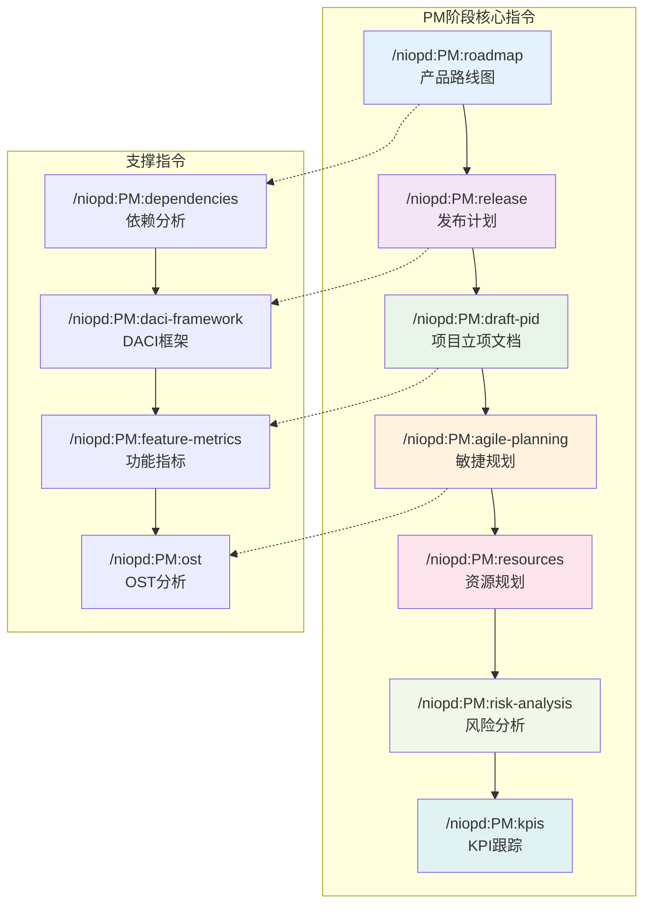

**图表来源**
- [roadmap.md](file://niopd/commands/PM/roadmap.md#L1-L50)
- [release.md](file://niopd/commands/PM/release.md#L1-L50)
- [draft-pid.md](file://niopd/commands/PM/draft-pid.md#L1-L50)

## 核心PM指令详解

### PM指令概览

| 指令名称 | 功能描述 | 输出文档 | 使用场景 |
|---------|----------|----------|----------|
| `/niopd:PM:roadmap` | 创建可视化产品路线图 | 产品路线图文件 | 战略沟通、团队对齐 |
| `/niopd:PM:release` | 制定详细发布计划 | 发布计划报告 | 版本发布、上线准备 |
| `/niopd:PM:draft-pid` | 生成项目立项文档 | 项目立项文档 | 项目启动、审批流程 |
| `/niopd:PM:agile-planning` | 支持敏捷开发规划 | 敏捷冲刺计划 | 敏捷迭代、团队协作 |
| `/niopd:PM:resources` | 规划资源分配 | 资源计划报告 | 人力资源、预算管理 |
| `/niopd:PM:risk-analysis` | 风险识别与评估 | 风险分析报告 | 风险管理、决策支持 |
| `/niopd:PM:kpis` | KPI状态跟踪 | KPI状态报告 | 项目监控、绩效评估 |
| `/niopd:PM:dependencies` | 依赖关系分析 | 依赖分析报告 | 任务协调、瓶颈识别 |
| `/niopd:PM:daci-framework` | DACI角色框架 | DACI矩阵文档 | 角色职责、决策流程 |
| `/niopd:PM:feature-metrics` | 功能指标定义 | 功能指标文档 | 产品度量、成功标准 |

**章节来源**
- [roadmap.md](file://niopd/commands/PM/roadmap.md#L1-L166)
- [release.md](file://niopd/commands/PM/release.md#L1-L425)
- [draft-pid.md](file://niopd/commands/PM/draft-pid.md#L1-L834)

## PM阶段工作流

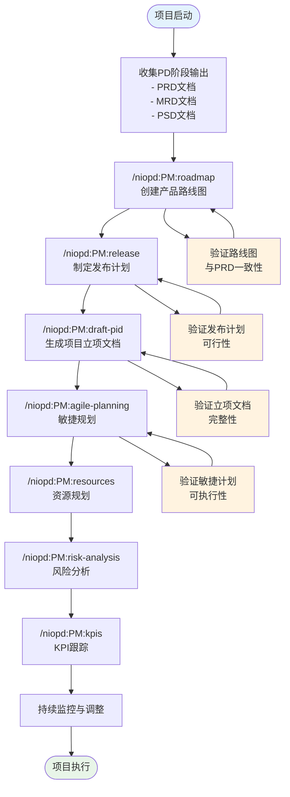

**图表来源**
- [roadmap.md](file://niopd/commands/PM/roadmap.md#L25-L166)
- [release.md](file://niopd/commands/PM/release.md#L50-L150)
- [draft-pid.md](file://niopd/commands/PM/draft-pid.md#L100-L200)

## 产品路线图创建

### /niopd:PM:roadmap指令功能

`/niopd:PM:roadmap`指令是PM阶段最重要的可视化工具，负责创建战略性的产品路线图，将PRD中的需求转化为可执行的时间线。

#### 核心特性

1. **多维度分析能力**
   - 时间维度：季度、月份、周次规划
   - 主题维度：战略主题和功能模块
   - 资源维度：团队容量和技能匹配
   - 风险维度：潜在问题和缓解策略

2. **智能依赖分析**
   - 自动识别任务间的依赖关系
   - 关键路径识别和优化
   - 并行工作机会挖掘
   - 循环依赖检测和解决

3. **灵活的时间表示**
   - 具体日期规划（内部执行）
   - 季度和月份规划（外部沟通）
   - 粗略时间估算（战略层面）

#### 路线图生成流程

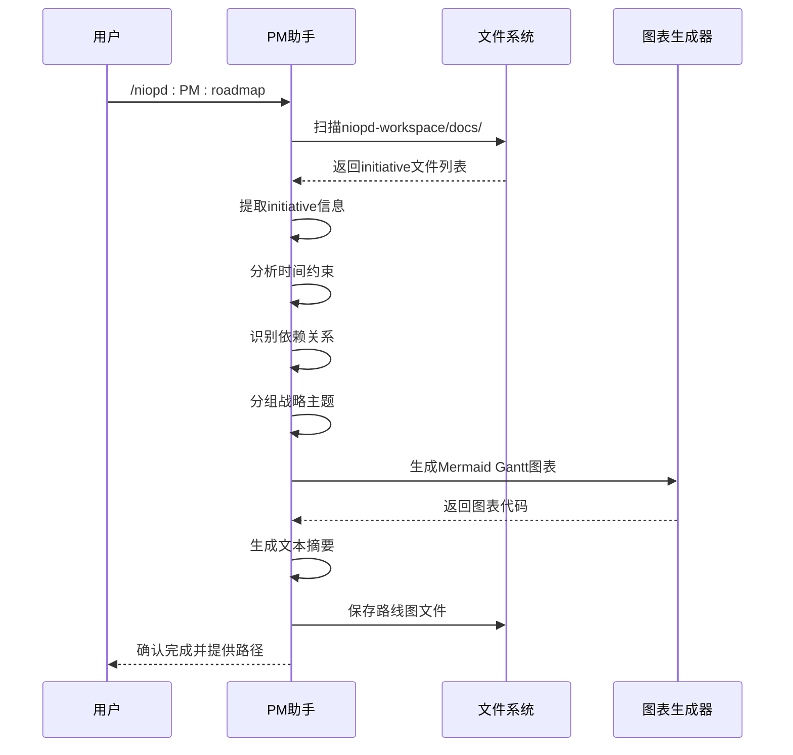

**图表来源**
- [roadmap.md](file://niopd/commands/PM/roadmap.md#L40-L120)

#### 路线图元素

| 元素类型 | 描述 | 用途 | 示例 |
|---------|------|------|------|
| **战略主题** | 高层次的业务目标 | 团队对齐、战略沟通 | "用户体验优化"、"性能提升" |
| **initiative** | 具体的改进项目 | 执行指导、进度跟踪 | "移动端重设计"、"支付流程优化" |
| **里程碑** | 关键交付节点 | 重要时刻标记 | "设计完成"、"开发完成" |
| **支持任务** | 日常运维和维护 | 确保系统稳定运行 | "监控系统维护"、"安全补丁更新" |
| **状态指示器** | 任务执行状态 | 进度可视化 | `done`（已完成）、`active`（进行中） |

**章节来源**
- [roadmap.md](file://niopd/commands/PM/roadmap.md#L15-L50)

## 发布计划制定

### /niopd:PM:release指令功能

`/niopd:PM:release`指令专门负责制定详细的发布计划，涵盖从功能定义到部署上线的全流程规划。

#### 发布计划核心要素

1. **发布范围定义**
   - 包含的功能和改进
   - 修复的bug和性能优化
   - 技术债务清理
   - 安全增强措施

2. **利益相关者管理**
   - 开发团队和工程师
   - 产品管理和设计师
   - 质量保证和测试团队
   - 运维和基础设施团队
   - 市场营销和销售团队

3. **质量保证规划**
   - 功能要求和验收标准
   - 性能和可扩展性目标
   - 安全性和合规要求
   - 用户体验标准

#### 发布策略选择

| 策略类型 | 适用场景 | 优势 | 风险 |
|---------|----------|------|------|
| **大爆炸发布** | 小型项目、低风险变更 | 快速上线、简化流程 | 高失败风险、影响面广 |
| **渐进式发布** | 中大型项目、高风险变更 | 降低风险、便于回滚 | 实施复杂、用户体验不一致 |
| **蓝绿部署** | 生产环境稳定性要求高 | 零停机、快速回滚 | 硬件成本高 |
| **金丝雀发布** | 渐进式采用、风险控制 | 早期发现问题、逐步推广 | 监控复杂、实施难度高 |
| **功能开关** | 灵活发布控制、A/B测试 | 精确控制、降低风险 | 技术复杂度高 |

#### 发布计划模板结构

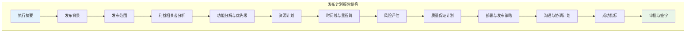

**图表来源**
- [release.md](file://niopd/commands/PM/release.md#L200-L350)

**章节来源**
- [release.md](file://niopd/commands/PM/release.md#L15-L100)

## 项目立项文档生成

### /niopd:PM:draft-pid指令功能

`/niopd:PM:draft-pid`指令生成项目立项文档（PID），这是项目正式进入执行阶段前必须获得批准的关键文档。

#### PID文档结构

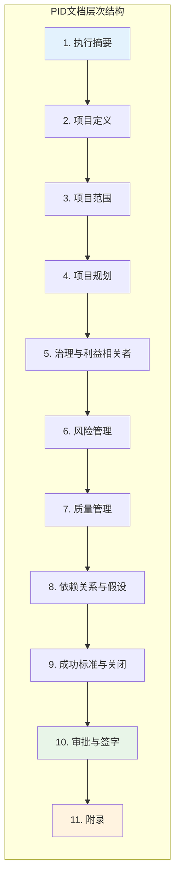

**图表来源**
- [draft-pid.md](file://niopd/commands/PM/draft-pid.md#L300-L500)

#### PID核心组件

1. **项目定义**
   - 业务问题陈述
   - 商业机会描述
   - 战略对齐说明
   - 项目目标（SMART原则）

2. **项目范围**
   - 包含的交付物
   - 排除的范围
   - 边界和约束
   - 假设和依赖

3. **项目方法论**
   - 采用的项目管理方法
   - 生命周期阶段
   - 质量标准
   - 技术方法

4. **项目计划**
   - 时间线和里程碑
   - 工作分解结构
   - 资源分配
   - 预算和成本分解

5. **项目组织**
   - 利益相关者映射
   - 角色和职责（RACI）
   - 治理结构
   - 沟通计划

**章节来源**
- [draft-pid.md](file://niopd/commands/PM/draft-pid.md#L50-L200)

## 敏捷开发支持

### /niopd:PM:agile-planning指令功能

`/niopd:PM:agile-planning`指令专门支持敏捷开发方法，帮助团队制定有效的sprint计划和任务分解。

#### 敏捷规划框架

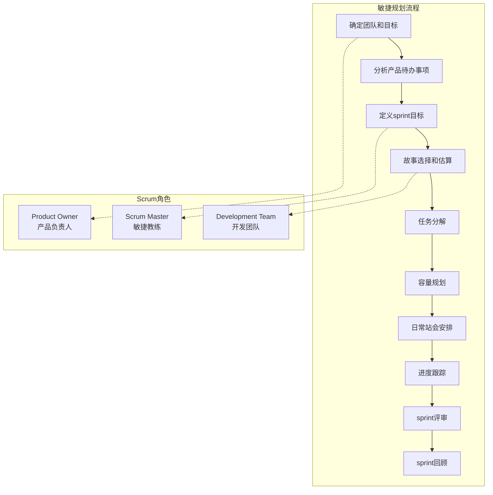

**图表来源**
- [agile-planning.md](file://niopd/commands/PM/agile-planning.md#L50-L150)

#### 敏捷估算技术

| 估算方法 | 适用场景 | 优点 | 缺点 |
|---------|----------|------|------|
| **故事点** | 复杂度评估 | 相对准确、考虑不确定性 | 需要团队共识、难以转换为时间 |
| **任务小时** | 时间敏感项目 | 精确到天、易于计划 | 容易陷入细节、缺乏灵活性 |
| **T恤尺寸** | 快速路线图规划 | 简单直观、快速决策 | 精度较低、不适合详细规划 |
| **计划扑克** | 团队共识估算 | 促进讨论、减少偏差 | 需要面对面会议、耗时较长 |

#### Sprint计划模板

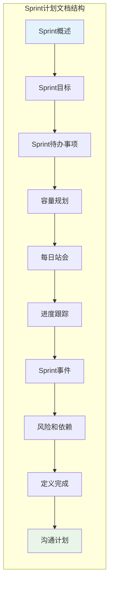

**图表来源**
- [agile-planning.md](file://niopd/commands/PM/agile-planning.md#L300-L450)

**章节来源**
- [agile-planning.md](file://niopd/commands/PM/agile-planning.md#L1-L100)

## 资源与风险管理

### 资源规划

`/niopd:PM:resources`指令提供全面的资源规划功能，确保项目所需的人力、财务和物理资源得到合理分配。

#### 资源类型分类

| 资源类型 | 具体内容 | 管理重点 | 风险点 |
|---------|----------|----------|--------|
| **人力资源** | 团队成员、承包商、专家顾问 | 技能匹配、可用性、工作负载 | 人员流失、技能缺口 |
| **财务资源** | 预算分配、成本储备、应急资金 | 成本控制、资金到位、投资回报 | 超预算、资金链断裂 |
| **物理资源** | 设备工具、基础设施、办公场所 | 可用性、维护、升级需求 | 设备故障、容量不足 |
| **信息资源** | 数据、知识产权、第三方服务 | 安全性、访问权限、许可协议 | 数据泄露、服务中断 |

### 风险管理

`/niopd:PM:risk-analysis`指令系统性地识别、评估和应对项目风险。

#### 风险评估矩阵

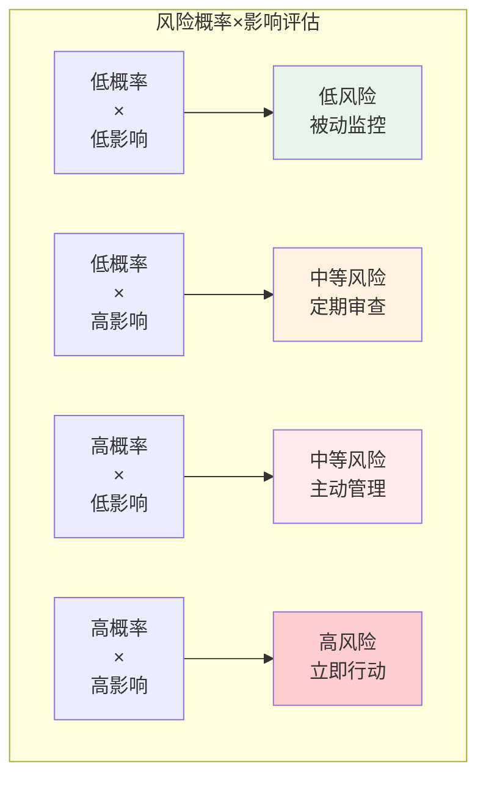

**图表来源**
- [risk-analysis.md](file://niopd/commands/PM/risk-analysis.md#L20-L50)

#### 风险响应策略

| 策略类型 | 适用风险 | 应对措施 | 实施难度 |
|---------|----------|----------|----------|
| **避免** | 高概率高影响风险 | 修改计划消除威胁 | 高 |
| **减轻** | 高概率风险 | 采取措施降低概率或影响 | 中 |
| **转移** | 外部风险 | 通过合同或保险转移给第三方 | 中 |
| **接受** | 低概率低影响风险 | 承认存在但不主动干预 | 低 |

**章节来源**
- [resources.md](file://niopd/commands/PM/resources.md#L1-L100)
- [risk-analysis.md](file://niopd/commands/PM/risk-analysis.md#L1-L100)

## KPI跟踪与监控

### /niopd:PM:kpis指令功能

`/niopd:PM:kpis`指令提供关键绩效指标的状态跟踪和分析，帮助项目团队监控项目健康状况。

#### KPI分类体系

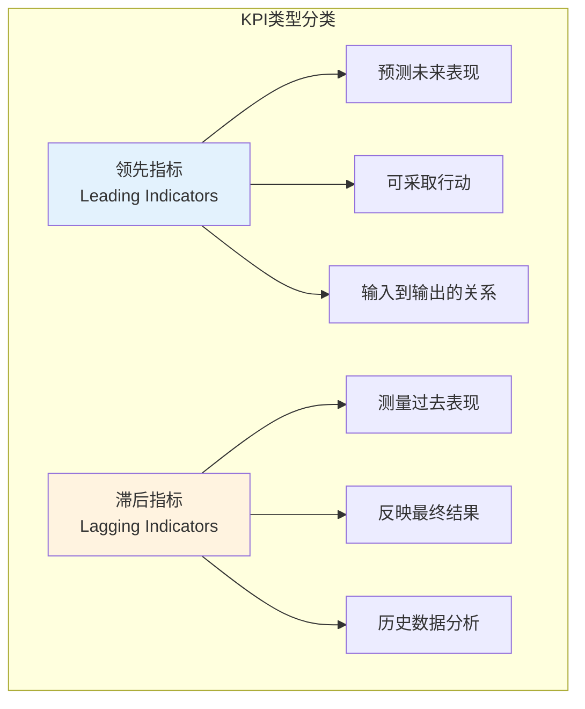

**图表来源**
- [kpis.md](file://niopd/commands/PM/kpis.md#L20-L50)

#### KPI状态评估

| 状态等级 | 颜色标识 | 表现含义 | 建议行动 |
|---------|----------|----------|----------|
| **✅ Achieved** | 绿色 | 已达成目标 | 维持现状，寻找新的挑战 |
| **🟢 On Track** | 蓝绿色 | 正在按计划推进 | 继续当前做法 |
| **🟡 At Risk** | 黄色 | 存在潜在问题 | 识别风险因素，制定缓解措施 |
| **🔴 Off Track** | 红色 | 明显偏离目标 | 紧急干预，重新规划 |
| **🔵 Not Started** | 蓝色 | 尚未开始 | 制定执行计划，启动工作 |

#### KPI监控流程

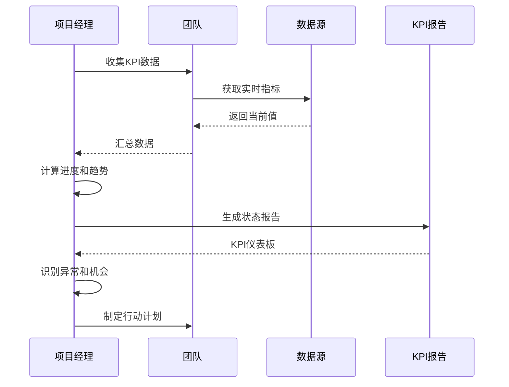

**图表来源**
- [kpis.md](file://niopd/commands/PM/kpis.md#L100-L200)

**章节来源**
- [kpis.md](file://niopd/commands/PM/kpis.md#L1-L100)

## PD阶段PRD同步

PM阶段的输出文档与PD阶段的PRD文档保持严格的同步关系，确保产品需求的有效传递和执行。

### 文档流转关系

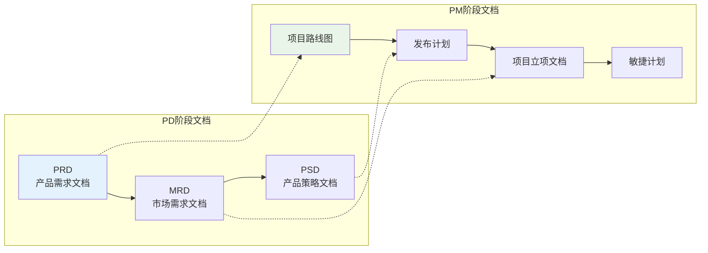

**图表来源**
- [roadmap.md](file://niopd/commands/PD/roadmap.md#L1-L50)
- [release.md](file://niopd/commands/PM/release.md#L1-L50)

### 同步机制

1. **需求映射**
   - PRD中的功能需求映射到PM阶段的任务分解
   - 用户故事转化为具体的开发任务
   - 业务目标转化为项目目标

2. **时间同步**
   - PRD中的时间节奏转化为PM阶段的时间线
   - 关键里程碑与PRD中的交付节点对齐
   - 依赖关系与PRD中的功能依赖保持一致

3. **质量标准**
   - PRD中的验收标准转化为PM阶段的质量检查点
   - 用户体验要求转化为开发团队的设计规范
   - 性能指标转化为测试团队的测试用例

**章节来源**
- [roadmap.md](file://niopd/commands/PD/roadmap.md#L100-L200)

## 移动端重设计案例

### 项目背景

假设我们正在为"移动端重设计"项目制定PM阶段的执行计划。该项目的目标是提升移动应用的用户体验，提高用户留存率和转化率。

### 执行计划制定

#### 1. 产品路线图规划

基于PRD中的需求，我们可以创建如下路线图：

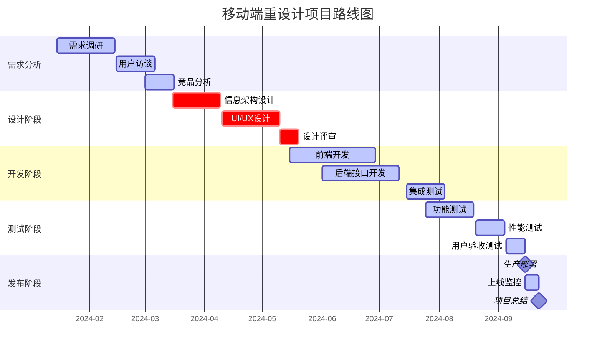

**图表来源**
- [roadmap.md](file://niopd/commands/PM/roadmap.md#L100-L166)

#### 2. 发布计划制定

根据项目路线图，制定详细的发布计划：

| 发布版本 | 目标功能 | 关键里程碑 | 质量标准 | 风险点 |
|---------|----------|-----------|----------|--------|
| V1.0 | 核心功能上线 | 2024-09-15 | 无P0/P1缺陷 | 技术栈迁移风险 |
| V1.1 | 性能优化 | 2024-10-15 | 响应时间<2秒 | 用户接受度风险 |
| V1.2 | 新增功能 | 2024-11-15 | 用户满意度>4.5 | 市场竞争风险 |

#### 3. 项目立项文档

生成包含以下关键内容的PID：

- **项目定义**：提升移动端用户体验，提高用户留存率15%
- **项目范围**：包含UI/UX重设计、核心功能重构、性能优化
- **项目计划**：4个月开发周期，分3个版本发布
- **资源需求**：前端开发2人，后端开发1人，设计师1人，测试1人
- **风险管理**：技术栈迁移、用户接受度、市场竞争

#### 4. 敏捷规划

为开发团队制定Sprint计划：

| Sprint | 目标 | 关键任务 | 预期成果 | 风险应对 |
|--------|------|----------|----------|----------|
| Sprint 1 | 需求分析完成 | 用户访谈、竞品分析 | 需求文档 | 时间超预期 |
| Sprint 2 | 设计方案确认 | 信息架构、UI设计 | 设计稿 | 用户反馈不佳 |
| Sprint 3 | 核心功能开发 | 前端开发、接口设计 | 可运行原型 | 技术难点 |

### 执行监控

通过KPI跟踪确保项目按计划推进：

- **进度指标**：Sprint完成率、任务完成率
- **质量指标**：缺陷密度、测试覆盖率
- **效率指标**：平均处理时间、阻塞时间
- **业务指标**：用户满意度、功能使用率

**章节来源**
- [roadmap.md](file://niopd/commands/PM/roadmap.md#L1-L166)
- [release.md](file://niopd/commands/PM/release.md#L1-L425)
- [draft-pid.md](file://niopd/commands/PM/draft-pid.md#L1-L834)
- [agile-planning.md](file://niopd/commands/PM/agile-planning.md#L1-L515)

## 总结

项目管理执行阶段是连接战略规划和产品交付的桥梁，通过系统化的PM指令，NioPD提供了完整的项目管理解决方案。

### 核心价值

1. **系统性方法**：从路线图到KPI的完整覆盖
2. **可视化工具**：Mermaid图表提供直观的项目视图
3. **标准化流程**：确保项目执行的一致性和质量
4. **动态监控**：实时跟踪项目状态和风险
5. **文档驱动**：建立可追溯的知识管理体系

### 最佳实践建议

1. **早期介入**：在PD阶段就启动PM准备工作
2. **持续同步**：确保PM输出与PD输入的及时更新
3. **灵活调整**：根据项目进展动态调整计划
4. **团队协作**：充分发挥各角色的专业能力
5. **风险管理**：建立完善的风险识别和应对机制

通过有效运用PM阶段的各项功能，团队能够将产品需求转化为可执行的项目计划，确保项目按时、按质、按预算交付，最终实现产品战略目标。