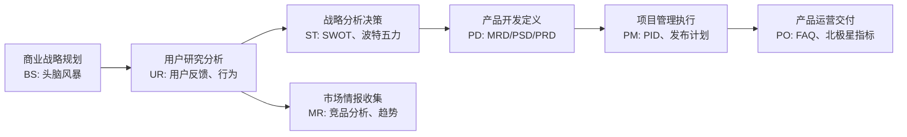

# 常见问题解答

<cite>
**本文档中引用的文件**
- [README.md](file://README.md)
- [niopd/SYS/help.md](file://niopd/SYS/help.md)
- [niopd/SYS/init.md](file://niopd/SYS/init.md)
- [niopd/commands/BS/new-initiative.md](file://niopd/commands/BS/new-initiative.md)
- [niopd/commands/UR/journey.md](file://niopd/commands/UR/journey.md)
- [niopd/commands/MR/compare.md](file://niopd/commands/MR/compare.md)
- [niopd/commands/DT/first-principles.md](file://niopd/commands/DT/first-principles.md)
- [niopd/commands/DT/five-whys.md](file://niopd/commands/DT/five-whys.md)
- [niopd/commands/ST/swot.md](file://niopd/commands/ST/swot.md)
- [niopd/commands/ST/porters-five-forces.md](file://niopd/commands/ST/porters-five-forces.md)
- [niopd/commands/PD/roadmap.md](file://niopd/commands/PD/roadmap.md)
- [niopd/commands/PM/agile-planning.md](file://niopd/commands/PM/agile-planning.md)
- [niopd/templates/initiative-template.md](file://niopd/templates/initiative-template.md)
- [niopd/templates/prd-template.md](file://niopd/templates/prd-template.md)
- [niopd/.claude-plugin/plugin.json](file://niopd/.claude-plugin/plugin.json)
</cite>

## 目录
1. [基础使用](#基础使用)
2. [指令执行](#指令执行)
3. [工作流疑问](#工作流疑问)
4. [技术问题](#技术问题)
5. [概念理解](#概念理解)

## 基础使用

### 如何开始第一次对话？
**问题**: 我是新手，不知道如何开始使用 NioPD。

**答案**: 首先，您需要初始化工作区并开始与 Nio 对话。按照以下步骤操作：

1. **初始化工作区**:
   ```bash
   /niopd:SYS:init
   ```
   这将创建标准化的四目录工作区结构：`sources/`、`reports/`、`docs/`、`plans/`。

2. **开始对话**:
   ```bash
   /niopd:SYS:hi
   ```
   Nio 将引导您进行苏格拉底式对话，帮助您思考产品管理问题。

3. **查看帮助文档**:
   ```bash
   /niopd:SYS:help
   ```
   获取所有可用命令的完整帮助信息。

**相关文档**: [`/niopd:SYS:init`](file://niopd/SYS/init.md)、[`/niopd:SYS:help`](file://niopd/SYS/help.md)

### 如何正确设置工作区？

**答案**: NioPD 使用文档驱动的方法论，工作区结构如下：

```
niopd-workspace/
├── sources/       # 思考源材料层（BS + DT 指令输出）
├── reports/       # 数据分析报告层（UR + MR + ST 指令输出）
├── docs/          # 决策文档层（PD + PO 指令输出）
└── plans/         # 执行计划层（PM 指令输出）
```

**各目录用途**:
- **sources/**: 存储原始思考记录、头脑风暴结果
- **reports/**: 存储基于数据的分析报告
- **docs/**: 存储核心产品决策文档
- **plans/**: 存储项目执行计划

### 如何升级 NioPD？

**答案**: 使用以下命令升级到最新版本：
```bash
/niopd:SYS:upgrade
```

**注意**: 升级会从 GitHub 获取最新版本，建议在升级前备份重要文件。

**Section sources**
- [README.md](file://README.md#L1-L100)
- [niopd/SYS/init.md](file://niopd/SYS/init.md#L1-L50)
- [niopd/SYS/help.md](file://niopd/SYS/help.md#L1-L50)

## 指令执行

### BS:new-initiative 需要哪些输入？

**问题**: 我想创建一个新的产品立项文档，但不确定需要提供哪些信息。

**答案**: `/niopd:BS:new-initiative` 指令需要以下输入：

1. **项目名称**: 必须提供，用引号括起来
   ```bash
   /niopd:BS:new-initiative "移动端重设计"
   ```

2. **前置检查**:
   - 验证项目名称是否提供
   - 检查是否已存在同名项目
   - 确保工作区已初始化

**执行流程**:
1. **发现与框架**: 理解初始想法和问题空间
2. **研究与补充**: 识别知识缺口和外部信息需求
3. **指导合成与设计**: 将想法结构化为连贯计划
4. **交付物共创**: 将概念转化为正式文档

**输出**: `docs/[日期]-[项目名称]-initiative-v1.md`

**相关文档**: [`/niopd:BS:new-initiative`](file://niopd/commands/BS/new-initiative.md)

### 如何使用 MR:compare 进行竞争对手分析？

**问题**: 我需要分析竞争对手，但不知道如何开始。

**答案**: 使用 `/niopd:MR:compare` 指令进行自动化竞争对手比较分析：

**基本语法**:
```bash
/niopd:MR:compare [--topic=<市场主题>] [--competitors=<竞争对手列表>]
```

**示例**:
```bash
# 分析移动应用市场
/niopd:MR:compare --topic="移动应用开发工具"

# 分析特定竞争对手
/niopd:MR:compare --competitors="Adobe, Sketch, Figma"
```

**分析维度**:
- 产品/功能对比
- 定价策略
- 市场覆盖
- 创新能力
- 市场地位

**输出**: `reports/[日期]-[市场主题]-competitor-comparison.md`

**相关文档**: [`/niopd:MR:compare`](file://niopd/commands/MR/compare.md)

### 如何创建产品路线图？

**问题**: 我需要为产品创建路线图，应该使用哪个指令？

**答案**: 使用 `/niopd:PD:roadmap` 指令添加甘特图到现有的 PRD 文档：

**基本语法**:
```bash
/niopd:PD:roadmap [--for=<prd_name>]
```

**示例**:
```bash
# 基于当前目录自动检测 PRD
cd dark-mode-feature
/niopd:PD:roadmap

# 明确指定 PRD 名称
/niopd:PD:roadmap --for=dark-mode-feature
```

**输出**: 更新后的 PRD 文件，包含甘特图可视化

**相关文档**: [`/niopd:PD:roadmap`](file://niopd/commands/PD/roadmap.md)

### 如何进行敏捷规划？

**问题**: 我需要为团队规划敏捷冲刺，应该使用哪个指令？

**答案**: 使用 `/niopd:PM:agile-planning` 指令进行敏捷规划：

**基本语法**:
```bash
/niopd:PM:agile-planning [--sprint=<duration>] [--team=<team_name>] [--goal=<sprint_goal>]
```

**示例**:
```bash
/niopd:PM:agile-planning --team="前端团队" --goal="完成用户登录功能"
```

**包含内容**:
- Sprint 目标定义
- 产品待办事项选择
- 任务分解
- 容量规划
- 进度跟踪机制

**输出**: `plans/[日期]-sprint-[编号]-plan-v[版本].md`

**相关文档**: [`/niopd:PM:agile-planning`](file://niopd/commands/PM/agile-planning.md)

**Section sources**
- [niopd/commands/BS/new-initiative.md](file://niopd/commands/BS/new-initiative.md#L1-L214)
- [niopd/commands/MR/compare.md](file://niopd/commands/MR/compare.md#L1-L336)
- [niopd/commands/PD/roadmap.md](file://niopd/commands/PD/roadmap.md#L1-L403)
- [niopd/commands/PM/agile-planning.md](file://niopd/commands/PM/agile-planning.md#L1-L515)

## 工作流疑问

### UR 和 MR 分析的先后顺序是什么？

**问题**: 我不确定应该先做用户研究（UR）还是市场研究（MR），哪个更重要？

**答案**: NioPD 推荐的标准工作流遵循以下顺序：



**工作流说明**:

1. **BS (商业战略规划)**: 从想法开始，进行头脑风暴
2. **UR (用户研究)**: 深入了解用户需求和痛点
3. **MR (市场研究)**: 收集市场情报和竞争分析
4. **ST (战略分析)**: 基于数据做出战略决策
5. **PD (产品开发)**: 将洞察转化为产品定义
6. **PM (项目管理)**: 组织执行和跟踪
7. **PO (产品运营)**: 持续优化和交付

**例外情况**: DT (深度思考工具) 可以在任何阶段使用，帮助突破思维障碍。

### 如何确定下一个要执行的指令？

**问题**: 我不确定下一步该做什么，有什么指导吗？

**答案**: 使用 `/niopd:SYS:flow-check` 指令检查工作流状态：

```bash
/niopd:SYS:flow-check
```

**智能特性**:
- 分析当前项目状态
- 识别缺失的文档
- 建议下一步操作
- 根据现有文档智能推荐工作流程

**输出**: 工作流状态报告 + 下一步建议

### 如何在不同阶段切换工作重点？

**答案**: NioPD 支持灵活的工作流切换：

1. **回到早期阶段**:
   ```bash
   # 重新进行用户研究
   /niopd:UR:feedback
   
   # 重新进行市场分析
   /niopd:MR:competitor --url=<网站地址>
   ```

2. **深化某个方面**:
   ```bash
   # 更深入的 SWOT 分析
   /niopd:ST:swot --for=<产品名称>
   
   # 波特五力分析
   /niopd:ST:porters-five-forces --for=<行业>
   ```

3. **验证假设**:
   ```bash
   # 第一性原理思考
   /niopd:DT:first-principles --problem="<问题>"
   
   # 五个为什么根因分析
   /niopd:DT:five-whys --problem="<问题>"
   ```

**Section sources**
- [README.md](file://README.md#L100-L200)
- [niopd/SYS/help.md](file://niopd/SYS/help.md#L1-L100)

## 技术问题

### 插件无法加载怎么办？

**问题**: 我尝试加载 NioPD 插件时遇到问题。

**答案**: 按照以下步骤排查和解决问题：

1. **检查插件配置**:
   - 确认 `plugin.json` 文件存在且格式正确
   - 验证文件路径: `.claude-plugin/plugin.json`

2. **验证文件结构**:
   ```
   .claude-plugin/
   └── plugin.json
   niopd/
   └── commands/
       └── SYS/
           └── help.md
   ```

3. **常见错误及解决方案**:

| 错误类型 | 可能原因 | 解决方案 |
|---------|---------|---------|
| 插件未识别 | JSON 格式错误 | 检查 JSON 语法，确保所有字段正确 |
| 命令不可用 | 文件权限问题 | 确保所有文件具有可读权限 |
| 路径错误 | 相对路径问题 | 使用绝对路径或确认当前工作目录 |
| 缺少依赖 | 文件缺失 | 确保所有必需的命令文件存在 |

4. **调试步骤**:
   ```bash
   # 检查插件文件
   ls -la .claude-plugin/
   
   # 验证 JSON 格式
   cat .claude-plugin/plugin.json | jq .
   
   # 查看命令文件
   ls -la niopd/commands/
   ```

5. **重新初始化**:
   如果问题持续，可以尝试重新初始化工作区：
   ```bash
   /niopd:SYS:upgrade
   /niopd:SYS:init
   ```

**相关文档**: [`plugin.json`](file://niopd/.claude-plugin/plugin.json)

### 文件保存失败怎么办？

**问题**: 执行指令后文件没有正确保存。

**答案**: 文件保存失败的排查步骤：

1. **检查磁盘空间**:
   ```bash
   df -h
   ```

2. **验证目录权限**:
   ```bash
   # 检查目录权限
   ls -la niopd-workspace/
   
   # 确保有写入权限
   chmod -R u+w niopd-workspace/
   ```

3. **检查文件名冲突**:
   - 确保文件名符合命名约定
   - 避免特殊字符和过长的文件名

4. **手动保存**:
   如果自动保存失败，可以手动复制输出内容到文件。

### 如何处理网络搜索限制？

**问题**: 某些指令需要网络搜索，但访问受限。

**答案**: NioPD 提供多种应对策略：

1. **离线分析**: 使用已有数据进行分析
2. **手动输入**: 手动提供必要的市场数据
3. **替代方法**: 使用其他指令进行类似分析
4. **缓存数据**: 利用之前收集的信息

**示例**:
```bash
# 如果无法搜索竞争对手，使用已知信息
/niopd:MR:compare --competitors="已知竞争对手列表"

# 使用本地数据进行 SWOT 分析
/niopd:ST:swot --for="本地产品"
```

**Section sources**
- [niopd/.claude-plugin/plugin.json](file://niopd/.claude-plugin/plugin.json#L1-L15)

## 概念理解

### 第一性原理和五个为什么有何区别？

**问题**: 我经常混淆第一性原理思维和五个为什么分析，它们有什么区别？

**答案**: 这两种方法虽然都是寻找根本原因，但在方法论和应用场景上有显著区别：

| 特征 | 第一性原理思维 | 五个为什么 |
|------|---------------|-----------|
| **起源** | 古希腊哲学（亚里士多德） | 丰田生产方式（丰田喜一郎） |
| **核心方法** | 分解到基本事实，重构解决方案 | 连续问"为什么"，直到找到根因 |
| **适用场景** | 复杂创新问题、颠覆性思考 | 日常问题解决、流程优化 |
| **输出形式** | 创新解决方案、全新视角 | 根本原因、纠正措施 |
| **时间投入** | 需要较长时间深入思考 | 快速问题解决（通常5次以内） |
| **思维方式** | 打破常规，重构本质 | 层层递进，挖掘真相 |

**第一性原理思维示例**:
```bash
/niopd:DT:first-principles --problem="为什么火箭发射成本如此之高"
```
**输出**: 从氢气、碳纤维等基本材料成本重新计算发射成本

**五个为什么示例**:
```bash
/niopd:DT:five-whys --problem="为什么用户取消订阅"
```
**输出**: 通过连续追问找到具体的用户体验问题

**使用建议**:
- **第一性原理**: 当面对"不可能"的挑战时
- **五个为什么**: 当需要快速解决具体问题时
- **结合使用**: 先用五个为什么找到表面原因，再用第一性原理创新解决方案

**相关文档**: [`/niopd:DT:first-principles`](file://niopd/commands/DT/first-principles.md)、[`/niopd:DT:five-whys`](file://niopd/commands/DT/five-whys.md)

### SWOT 分析和波特五力分析的区别？

**问题**: SWOT 分析和波特五力分析都是战略分析工具，它们有什么区别？

**答案**: 这两个分析框架服务于不同的战略层次和目的：

| 特征 | SWOT 分析 | 波特五力分析 |
|------|-----------|-------------|
| **焦点** | 内部优势/劣势 vs 外部机会/威胁 | 行业竞争结构 |
| **范围** | 企业整体战略 | 行业吸引力评估 |
| **时间维度** | 短期到中期 | 长期行业趋势 |
| **适用场景** | 企业战略规划 | 市场进入决策 |
| **输出** | 战略组合（SO、WO、ST、WT） | 行业吸引力评级 |
| **复杂度** | 相对简单 | 较为复杂 |

**SWOT 分析应用场景**:
- 新产品/initiative 评估
- 竞争优势识别
- 战略定位
- 内外因素平衡

**波特五力分析应用场景**:
- 行业进入决策
- 竞争战略制定
- 投资机会评估
- 业务模式创新

**互补使用**:
1. 先用波特五力分析行业吸引力
2. 再用 SWOT 分析企业定位
3. 最后制定 TOWS 战略组合

**相关文档**: [`/niopd:ST:swot`](file://niopd/commands/ST/swot.md)、[`/niopd:ST:porters-five-forces`](file://niopd/commands/ST/porters-five-forces.md)

### 用户研究和市场研究的区别？

**问题**: 用户研究（UR）和市场研究（MR）有什么区别？什么时候用哪个？

**答案**: 这两个研究领域有不同的焦点和应用场景：

| 特征 | 用户研究 (UR) | 市场研究 (MR) |
|------|---------------|---------------|
| **焦点** | 用户需求、行为、痛点 | 竞争格局、市场规模、趋势 |
| **方法** | 访谈、问卷、可用性测试 | 竞品分析、行业报告、统计数据 |
| **输出** | 用户画像、用户旅程、需求文档 | 竞品对比、市场趋势、定位策略 |
| **时间范围** | 中短期（产品开发周期） | 长期（战略规划） |
| **决策支持** | 产品功能设计 | 市场定位、进入策略 |
| **典型指令** | `/niopd:UR:feedback`, `/niopd:UR:journey` | `/niopd:MR:competitor`, `/niopd:MR:trends` |

**使用场景**:

**用户研究适用场景**:
- 产品功能优先级排序
- 用户体验优化
- 用户痛点识别
- 产品可用性改进

**市场研究适用场景**:
- 市场机会识别
- 竞争策略制定
- 市场趋势预测
- 产品定位

**协同使用**:
1. MR 发现市场机会
2. UR 验证用户需求
3. ST 制定战略
4. PD 实现产品

### 敏捷规划和瀑布计划的区别？

**问题**: 敏捷规划和传统的瀑布计划有什么区别？哪种更适合我的项目？

**答案**: 这两种项目管理方法在理念和实践上有根本区别：

| 特征 | 敏捷规划 | 瀑布计划 |
|------|----------|----------|
| **时间框架** | 短期迭代（2-4周） | 长期阶段划分 |
| **灵活性** | 高度灵活，适应变化 | 固定计划，严格控制变更 |
| **交付频率** | 持续交付可用增量 | 项目结束时交付 |
| **规划方式** | 滚动式规划 | 一次性完整规划 |
| **风险控制** | 早期发现问题 | 风险在后期才显现 |
| **适用项目** | 复杂、需求不明确 | 需求稳定、可预测 |

**敏捷规划优势**:
- 更快的市场响应
- 更高的客户满意度
- 更好的质量保证
- 更强的风险管理

**瀑布计划优势**:
- 更好的成本控制
- 更清晰的里程碑
- 更适合大型项目
- 更适合监管要求严格的行业

**选择建议**:
- **选择敏捷**: 需求不明确、技术复杂、市场变化快
- **选择瀑布**: 需求稳定、预算严格、时间紧迫
- **混合使用**: 敏捷执行，瀑布治理

**相关文档**: [`/niopd:PM:agile-planning`](file://niopd/commands/PM/agile-planning.md)

**Section sources**
- [niopd/commands/DT/first-principles.md](file://niopd/commands/DT/first-principles.md#L1-L100)
- [niopd/commands/DT/five-whys.md](file://niopd/commands/DT/five-whys.md#L1-L100)
- [niopd/commands/ST/swot.md](file://niopd/commands/ST/swot.md#L1-L150)
- [niopd/commands/ST/porters-five-forces.md](file://niopd/commands/ST/porters-five-forces.md#L1-L200)

## 总结

本 FAQ 文档涵盖了 NioPD 使用中最常见的 90% 问题，包括：

- **基础使用**: 工作区初始化、插件配置、基本命令
- **指令执行**: 各领域指令的具体用法和参数
- **工作流疑问**: 不同阶段的处理方式和转换逻辑
- **技术问题**: 常见故障排除和解决方案
- **概念理解**: 各种方法论的区别和应用场景

如果您还有其他问题，请随时使用 `/niopd:SYS:help` 查看完整帮助文档，或参考相应的指令文档获取详细说明。