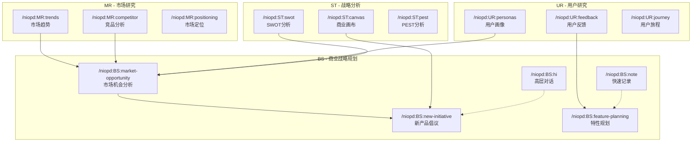
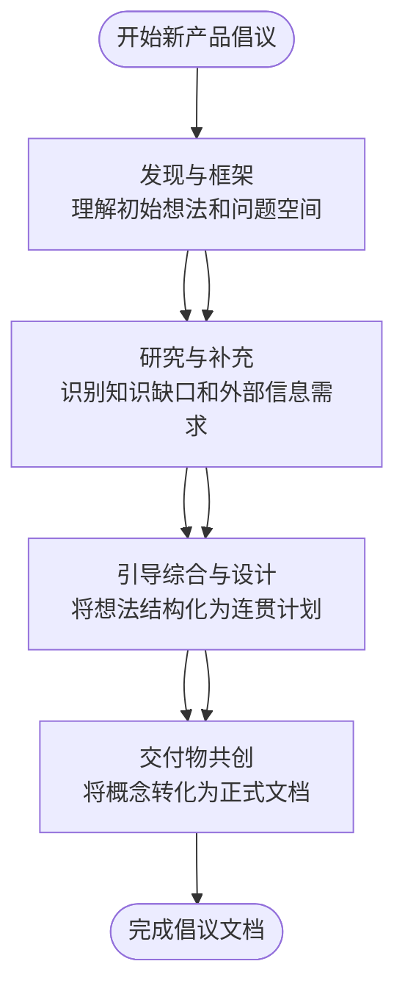
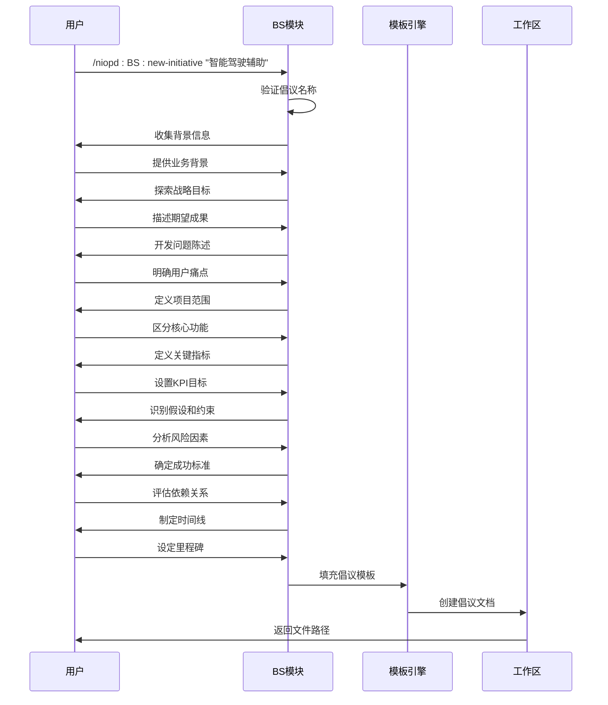
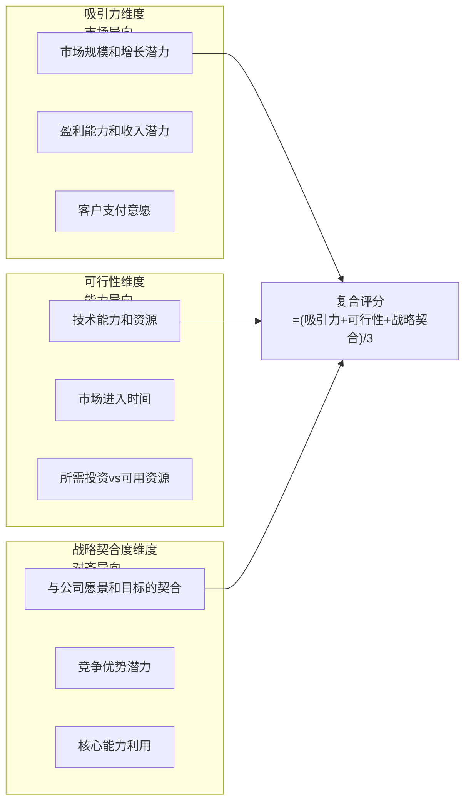
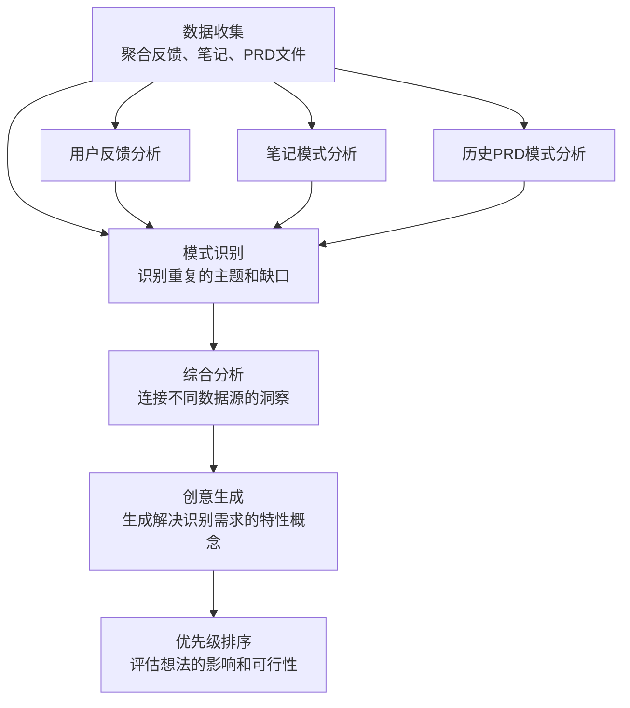
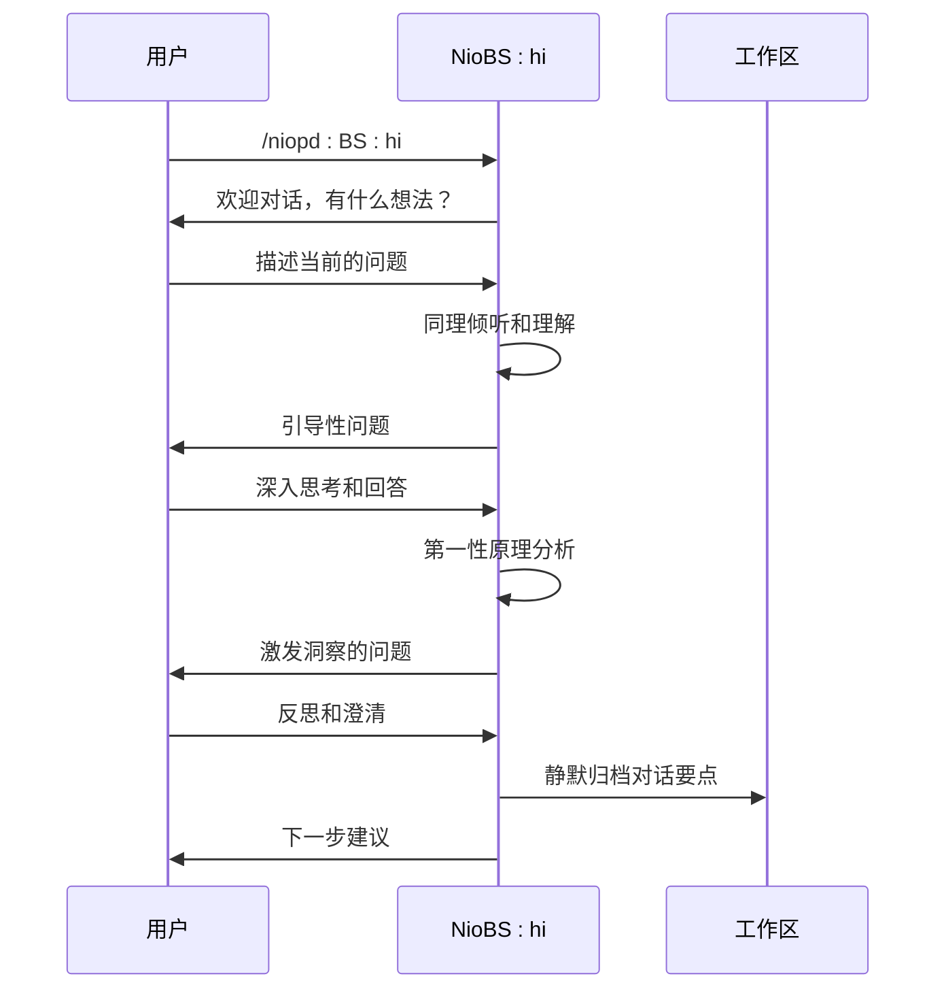
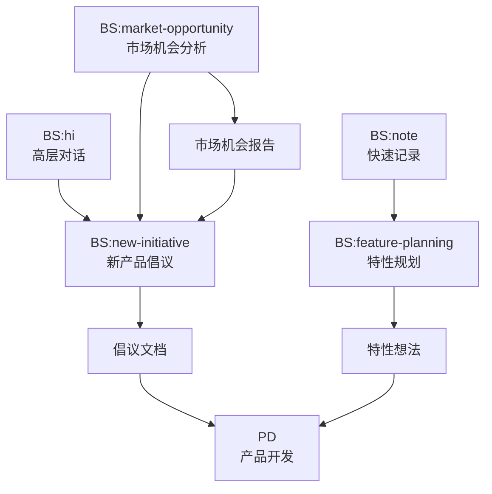
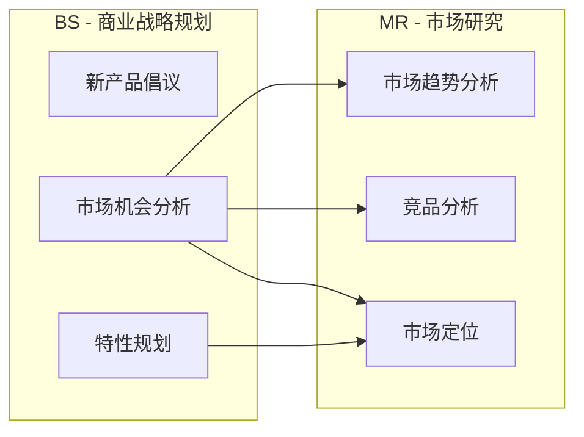

# BS - 商业战略规划指令

<cite>
**本文档中引用的文件**
- [new-initiative.md](file://niopd/commands/BS/new-initiative.md)
- [market-opportunity.md](file://niopd/commands/BS/market-opportunity.md)
- [feature-planning.md](file://niopd/commands/BS/feature-planning.md)
- [hi.md](file://niopd/commands/BS/hi.md)
- [note.md](file://niopd/commands/BS/note.md)
- [initiative-template.md](file://niopd/templates/initiative-template.md)
- [README.md](file://README.md)
</cite>

## 目录
1. [简介](#简介)
2. [BS模块概述](#bs模块概述)
3. [核心指令详解](#核心指令详解)
4. [指令协作关系](#指令协作关系)
5. [完整工作流程示例](#完整工作流程示例)
6. [最佳实践指南](#最佳实践指南)
7. [总结](#总结)

## 简介

BS（商业战略规划）模块是NioPD产品管理工具包的核心组件之一，专门负责从战略层面指导产品开发的全过程。该模块通过系统化的思维工具和方法论，帮助产品经理从零开始构建清晰的产品战略，识别市场机会，并制定可执行的行动计划。

BS模块遵循"头脑风暴"（Brain Storming）的理念，强调创造性思维和系统性分析的结合，为产品开发的每个阶段提供坚实的理论基础和实用的操作指导。

## BS模块概述

### 设计理念

BS模块基于以下核心理念设计：

1. **系统性思维**：将产品战略规划视为一个完整的系统，包含多个相互关联的环节
2. **渐进式深入**：从宏观战略到微观执行，逐步细化和深化思考
3. **数据驱动**：结合定性和定量分析，确保决策的科学性
4. **迭代优化**：支持反复验证和调整，适应动态变化的市场环境

### 输出目录结构

BS模块的所有输出都存储在`niopd-workspace/sources/`目录下，遵循统一的命名规范：

- `[日期]-[initiative-name]-initiative-v[版本].md` - 产品倡议文档
- `[日期]-[product-name]-market-opportunity-v[版本].md` - 市场机会分析报告
- `[日期]-[topic-name]-discussion-summary-v1.md` - 对话讨论记录
- `note.md` - 日志笔记文件

### 与其他模块的关系



**图表来源**
- [README.md](file://README.md#L127-L161)

## 核心指令详解

### 1. new-initiative - 新产品倡议

#### 功能概述

`/niopd:BS:new-initiative`是BS模块的核心入口指令，采用苏格拉底式提问和引导发现的方法，通过结构化的四阶段工作流程，帮助用户创建新的产品倡议文档。

#### 理论基础

该指令融合了两种强大的教育方法论：

1. **苏格拉底方法**：起源于公元前5世纪的辩证法，通过提问激发批判性思维和洞察力
2. **引导发现学习**：基于杰罗姆·布鲁纳的建构主义学习理论，强调通过结构化探究构建知识

#### 四阶段工作流程



**图表来源**
- [new-initiative.md](file://niopd/commands/BS/new-initiative.md#L25-L47)

#### 关键特征

- **同理倾听**：积极倾听而不做预先判断
- **第一性原理思维**：将假设分解为基础真理
- **苏格拉底式提问**：使用问题暴露差距和深化理解
- **启发式对话**：通过探索性对话解决问题
- **仅在请求时提供建议**：只有在明确请求时才提供指导

#### 使用场景

- 开始新的产品特性和倡议
- 清晰化模糊或不完整的产品想法
- 将非正式概念结构化为正式提案
- 确保全面考虑所有倡议维度
- 与利益相关者就倡议范围和目标达成一致

#### 完整调用链示例



**图表来源**
- [new-initiative.md](file://niopd/commands/BS/new-initiative.md#L150-L213)

**章节来源**
- [new-initiative.md](file://niopd/commands/BS/new-initiative.md#L1-L213)

### 2. market-opportunity - 市场机会分析

#### 功能概述

`/niopd:BS:market-opportunity`指令通过系统化的市场机会分析，识别潜在的增长领域和战略倡议。该指令结合多种战略框架，提供结构化的分析方法。

#### 理论基础

市场机会分析融合了以下战略框架：

1. **市场缺口分析**：识别竞争市场中未满足的需求和未服务的细分市场
2. **机会评估**：基于战略管理理论的多标准评价框架
3. **增长战略**：基于伊戈尔·安索夫的安索夫增长矩阵

#### 机会评估框架

市场机会按照三个维度进行评估：



**图表来源**
- [market-opportunity.md](file://niopd/commands/BS/market-opportunity.md#L25-L47)

#### 评分方法论

- 每个维度评分1-5分
- 复合评分 = (吸引力 + 可行性 + 战略契合) / 3
- 更高的分数表示更高优先级的机会

#### 市场机会类型

1. **新客户细分**：未服务的人口统计学或心理特征群体
2. **地理扩张**：新地区或市场
3. **产品延伸**：相邻产品或功能
4. **新模式**：替代的商业模式
5. **新兴趋势**：创造新需求的技术或行为转变

#### 使用场景

- 探索现有产品的增长策略
- 在竞争市场中识别空白地带
- 在多个潜在倡议之间进行优先级排序
- 验证关于市场缺口的战略假设
- 准备战略规划会议

#### 与互补指令的关系

| 指令 | 作用 | 协作方式 |
|------|------|----------|
| `/niopd:ST:swot` | 分析优势、劣势、机会、威胁 | 提供SWOT分析结果用于机会评估 |
| `/niopd:MR:trends` | 研究市场趋势和动态 | 结合趋势分析识别新兴机会 |
| `/niopd:UR:personas` | 理解目标客户细分 | 基于用户画像识别未服务群体 |
| `/niopd:BS:new-initiative` | 从识别的机会创建倡议 | 将市场机会转化为具体倡议 |

**章节来源**
- [market-opportunity.md](file://niopd/commands/BS/market-opportunity.md#L1-L265)

### 3. feature-planning - 特性规划

#### 功能概述

`/niopd:BS:feature-planning`指令基于反馈、笔记和历史PRD，使用高级模式识别和语义分析生成新的特性想法。该指令采用数据驱动的产品开发原则。

#### 理论基础

该指令应用以下方法论：

1. **扎根理论**：从数据中衍生理论的系统方法（格拉瑟&斯特劳斯，1967年）
2. **主题分析**：识别定性数据中的模式和主题（布伦&克拉克，2006年）
3. **洞察创新**：将用户研究转化为可操作的机会

#### 分析流程



**图表来源**
- [feature-planning.md](file://niopd/commands/BS/feature-planning.md#L25-L47)

#### 关键特征

- **多源数据分析**：三角化来自多样化数据的见解
- **模式检测**：发现共性和趋势
- **缺口识别**：发现未满足的需求
- **上下文理解**：考虑产品和市场背景
- **可操作输出**：准备用于倡议创建的想法

#### 使用场景

- 制定季度或年度路线图
- 响应积累的用户反馈
- 在主要发布后识别下一个特性
- 需要数据支持想法的战略规划会议
- 季度产品审查周期

#### 生成的特性想法示例

基于分析，该指令可能生成以下类型的特性想法：

1. **增强用户体验**：基于用户反馈中频繁提到的痛点
2. **自动化功能**：基于内部观察和效率提升机会
3. **集成扩展**：基于历史PRD中计划但未实现的功能
4. **性能优化**：基于历史PRD中的技术债务清理

**章节来源**
- [feature-planning.md](file://niopd/commands/BS/feature-planning.md#L1-L155)

### 4. hi - 高层对话

#### 功能概述

`/niopd:BS:hi`指令启动与Nio的对话，Nio是资深的产品管理主管和导师。该指令体现了导师-学徒关系模型，结合苏格拉底对话，创建AI驱动的监督辅导体验。

#### 理论基础

该指令基于以下理论：

1. **教练心理学**：基于约翰·惠特莫尔和格雷厄姆·亚历山大的GROW模型
2. **苏格拉底方法**：由苏格拉底开创的基于提问的对话
3. **积极倾听**：卡尔·罗杰斯人本主义疗法的核心

#### Nio的角色定位

- **指导者而非执行者**：促进发现而非提供答案
- **提问者**：使用询问刺激批判性思维
- **协调者**：在需要详细分析时指向专门的命令/代理
- **思想伙伴**：创造反思和深入思考的空间

#### 教练方法

1. **同理倾听**：理解后再回应
2. **第一性原理思维**：在基础层面挑战假设
3. **苏格拉底式提问**：揭示知识差距和替代视角
4. **启发式对话**：探索性对话以发现洞见
5. **仅在请求时提供建议**：尊重自主性和自我决定权
6. **静默归档**：在后台记录见解

#### 使用场景

- 开始工作会话或一天的工作
- 探索需要结构化的模糊想法
- 寻求产品决策的战略指导
- 解决需要深思熟虑的复杂问题
- 需要问责制和结构化反思

#### 对话流程



**图表来源**
- [hi.md](file://niopd/commands/BS/hi.md#L50-L100)

**章节来源**
- [hi.md](file://niopd/commands/BS/hi.md#L1-L100)

### 5. note - 快速记录

#### 功能概述

`/niopd:BS:note`指令提供即时的时间戳笔记功能，是知识管理和生产力方法的重要组成部分。该指令实现了"捕获习惯"的原则。

#### 理论基础

该指令基于以下知识管理方法论：

1. **捕获习惯**：戴维·艾伦《搞定》中的核心原则
2. **思维外化**：分布式认知理论：写下想法可以释放心智容量
3. **时间戳日志**：记录想法发生时间以追踪思维演变

#### 核心原则

**摩擦最小化捕获**：越容易记录一个想法，就越有可能被记录下来。该指令提供了最小摩擦的产品洞察"第二大脑"记录。

#### 捕获-组织-回顾模式

1. **捕获**（此指令）：快速、带时间戳地记录原始想法
2. **组织**：稍后处理成结构化文档
3. **回顾**：定期回顾笔记以发现模式和综合

#### 使用场景

- 在会议或对话中捕获快速想法
- 记录关于用户行为的观察
- 记录一闪而过的灵感
- 记录待以后探索的问题或假设
- 构建产品洞察的"第二大脑"

#### 与互补指令的关系

| 指令 | 作用 | 协作方式 |
|------|------|----------|
| `/niopd:BS:feature-planning` | 分析笔记以发现特性机会 | 基于笔记内容生成特性想法 |
| `/niopd:BS:hi` | 通过与Nio的对话探索笔记想法 | 将笔记作为对话的基础 |
| `/niopd:BS:new-initiative` | 将笔记转化为正式倡议 | 从笔记中提取倡议概念 |

**章节来源**
- [note.md](file://niopd/commands/BS/note.md#L1-L86)

## 指令协作关系

### BS模块内部协作

BS模块内的指令形成了一个有机的协作网络：



**图表来源**
- [README.md](file://README.md#L127-L161)

### 与MR模块的协同关系

BS模块与MR模块形成并行的市场情报收集机制：



**图表来源**
- [README.md](file://README.md#L127-L161)

### 与DT模块的思维工具关系

DT模块作为思维工具，在BS模块的各个阶段都可以发挥作用：

- **new-initiative**：在问题分析阶段使用第一性原理思考
- **market-opportunity**：在机会评估阶段使用根因分析
- **feature-planning**：在创意生成阶段使用场景规划
- **hi**：在整个过程中提供深度思考支持

## 完整工作流程示例

### 从启动新战略项目到输出初步规划的完整调用链示例

以下是一个完整的BS模块工作流程示例，展示了如何从零开始构建一个新产品战略：

```mermaid
sequenceDiagram
participant PM as 产品经理
participant BS as BS模块
participant MR as MR模块
participant UR as UR模块
participant Workspace as 工作区
Note over PM,Workspace : 阶段1：启动新战略项目
PM->>BS : /niopd : BS : hi "我们想探索自动驾驶的新机会"
BS->>PM : 引导对话，明确战略方向
PM->>BS : /niopd : BS : note "自动驾驶法规变化"
PM->>BS : /niopd : BS : note "用户隐私担忧"
Note over PM,Workspace : 阶段2：识别市场机会
PM->>BS : /niopd : BS : market-opportunity --product="自动驾驶" --market="中国"
BS->>MR : /niopd : MR : trends --market="自动驾驶"
MR-->>BS : 市场趋势报告
BS->>MR : /niopd : MR : competitor --product="自动驾驶"
MR-->>BS : 竞品分析报告
BS->>UR : /niopd : UR : personas --segment="自动驾驶用户"
UR-->>BS : 用户画像报告
BS-->>PM : 市场机会分析报告
Note over PM,Workspace : 阶段3：生成特性想法
PM->>BS : /niopd : BS : feature-planning
BS->>UR : /niopd : UR : feedback --product="自动驾驶"
UR-->>BS : 用户反馈分析
BS-->>PM : 特性想法列表
Note over PM,Workspace : 阶段4：创建新产品倡议
PM->>BS : /niopd : BS : new-initiative "智能驾驶辅助系统"
BS->>PM : 收集背景信息和战略目标
PM->>BS : 提供用户痛点和市场机会
BS->>BS : 使用initiative-template.md
BS-->>PM : 创建的倡议文档
Note over PM,Workspace : 阶段5：输出初步规划
PM->>Workspace : 查看生成的文档
Workspace-->>PM :
- [20241101]-智能驾驶辅助-initiative-v1.md
- [20241101]-自动驾驶-market-opportunity-v1.md
- [20241101]-feature-planning-summary-v1.md
```

**图表来源**
- [new-initiative.md](file://niopd/commands/BS/new-initiative.md#L150-L213)
- [market-opportunity.md](file://niopd/commands/BS/market-opportunity.md#L158-L219)

### 战略对齐中的价值

#### new-initiative作为战略起点的价值

1. **系统性思考**：通过四阶段工作流程确保全面覆盖战略规划的各个方面
2. **利益相关者对齐**：通过结构化对话与团队成员就项目范围和目标达成一致
3. **风险识别**：早期识别假设和约束条件，降低项目失败风险
4. **资源规划**：明确的关键指标和成功标准为资源分配提供依据

#### market-opportunity识别潜在市场空间的价值

1. **系统性机会发现**：基于吸引力、可行性和战略契合度的三维评估框架
2. **数据驱动决策**：避免直觉驱动，基于客观标准进行优先级排序
3. **竞争洞察**：结合市场趋势和竞品分析，识别差异化机会
4. **风险评估**：系统性识别和评估市场机会的风险因素

#### feature-planning在特性优先级决策中的应用

1. **证据基础创新**：基于实际用户反馈和历史数据生成特性想法
2. **模式识别**：自动发现用户需求中的共性和趋势
3. **上下文感知**：考虑产品和市场背景的特性建议
4. **迭代优化**：支持基于新数据不断调整特性优先级

#### hi（高层洞察）在战略对齐中的价值

1. **深度思考催化**：通过启发式对话激发新的战略洞见
2. **问题澄清**：帮助产品经理清晰表达和理解复杂问题
3. **决策支持**：提供结构化思考框架而非直接答案
4. **知识传承**：通过对话记录积累组织智慧

#### note在快速记录中的灵活性

1. **即时捕获**：最小摩擦的记录方式防止想法丢失
2. **思维追踪**：时间戳记录帮助理解想法的发展过程
3. **知识积累**：累积的笔记成为宝贵的洞察来源
4. **协作基础**：为团队讨论提供共同的知识基础

## 最佳实践指南

### BS模块使用最佳实践

#### 1. 新产品倡议的最佳实践

- **充分准备**：在使用`new-initiative`之前，先进行市场调研和用户访谈
- **结构化输入**：提前整理好相关的背景资料和初步想法
- **迭代完善**：不要期望一次对话就能完成所有内容，允许多次迭代
- **跨部门协作**：邀请相关利益相关者参与关键对话环节

#### 2. 市场机会分析的最佳实践

- **数据驱动**：确保有充分的市场数据和用户研究支持
- **多维度评估**：在吸引力、可行性和战略契合度上都要给予足够重视
- **竞争对比**：将机会放在整个竞争环境中进行评估
- **风险识别**：不仅要看到机会，更要识别潜在的风险因素

#### 3. 特性规划的最佳实践

- **数据整合**：确保涵盖所有相关的用户反馈、内部观察和历史PRD
- **上下文理解**：在生成特性想法时考虑当前的产品路线图
- **可行性评估**：在优先级排序时考虑技术实现的可行性
- **持续更新**：随着新数据的出现定期重新评估特性优先级

#### 4. 高层对话的最佳实践

- **开放心态**：保持开放和好奇的心态，愿意接受不同的观点
- **具体问题**：准备具体的问题和案例，避免过于宽泛的讨论
- **行动导向**：将对话结果转化为具体的行动计划
- **定期回顾**：定期与Nio进行对话，跟踪战略进展

#### 5. 快速记录的最佳实践

- **及时记录**：在想法闪现时立即记录，不要等待
- **简洁明了**：保持笔记简洁，专注于核心要点
- **分类整理**：定期整理笔记，建立个人知识库
- **交叉引用**：在相关笔记之间建立链接，形成知识网络

### 与DT、MR模块的协同最佳实践

#### BS与DT的协同

- **深度思考前置**：在使用BS指令前，先使用DT指令进行深度思考
- **问题澄清**：使用DT的"五个为什么"方法澄清BS中的关键问题
- **假设验证**：使用DT的第一性原理思考验证BS中的假设
- **创意激发**：在BS的创意阶段使用DT的场景规划方法

#### BS与MR的协同

- **市场洞察前置**：在BS分析前先进行MR的市场研究
- **数据验证**：使用MR的数据验证BS中的市场机会评估
- **竞争分析**：将MR的竞品分析结果融入BS的市场机会分析
- **趋势跟踪**：定期使用MR跟踪市场趋势，更新BS的分析结果

### 组织实施建议

#### 1. 团队培训

- **BS模块培训**：为产品团队提供BS模块的使用培训
- **方法论理解**：确保团队成员理解各指令背后的理论基础
- **实践练习**：通过模拟项目练习BS模块的实际应用

#### 2. 流程整合

- **标准化流程**：将BS模块的使用纳入产品开发的标准流程
- **文档管理**：建立完善的文档管理体系，确保BS产出的有效利用
- **知识共享**：建立知识分享机制，促进BS产出的传播和应用

#### 3. 工具支持

- **自动化支持**：利用NioPD的自动化功能简化BS模块的使用
- **集成平台**：将BS模块与其他工具集成，提高工作效率
- **质量控制**：建立质量检查机制，确保BS产出的质量

## 总结

BS（商业战略规划）模块是NioPD产品管理工具包的核心战略组件，通过系统化的方法和工具，帮助产品经理从零开始构建清晰的产品战略。该模块包含五个核心指令，每个指令都有其独特的价值和使用场景：

### 核心价值总结

1. **new-initiative**：作为战略起点，通过系统化的四阶段工作流程确保全面覆盖战略规划的各个方面
2. **market-opportunity**：识别潜在市场空间，提供基于吸引力、可行性和战略契合度的三维评估框架
3. **feature-planning**：在特性优先级决策中发挥重要作用，基于数据驱动的方法生成创新想法
4. **hi**：提供高层战略对话的支持，通过启发式对话激发深层次的战略洞见
5. **note**：实现快速记录的灵活性，为知识管理和创意捕获提供支持

### 协作关系价值

BS模块与MR、DT等其他模块形成有机的协作网络，通过以下方式创造更大的价值：

- **信息互补**：不同模块提供的信息相互补充，形成完整的战略视图
- **方法论协同**：各模块采用的方法论相互配合，提高分析的深度和广度
- **流程整合**：模块间的协作形成标准化的工作流程，提高效率
- **知识积累**：通过模块间的协作积累组织知识，支持持续改进

### 实施建议

为了最大化BS模块的价值，建议采取以下实施措施：

1. **系统性应用**：将BS模块作为产品战略规划的标准工具链
2. **持续优化**：根据实际使用情况不断优化BS模块的应用方法
3. **团队培训**：确保团队成员熟练掌握BS模块的使用方法
4. **流程整合**：将BS模块与现有的产品开发流程有效整合

通过合理运用BS模块的各项功能，产品团队可以建立起更加系统化、数据驱动的产品战略规划体系，从而提高产品成功的概率和效率。