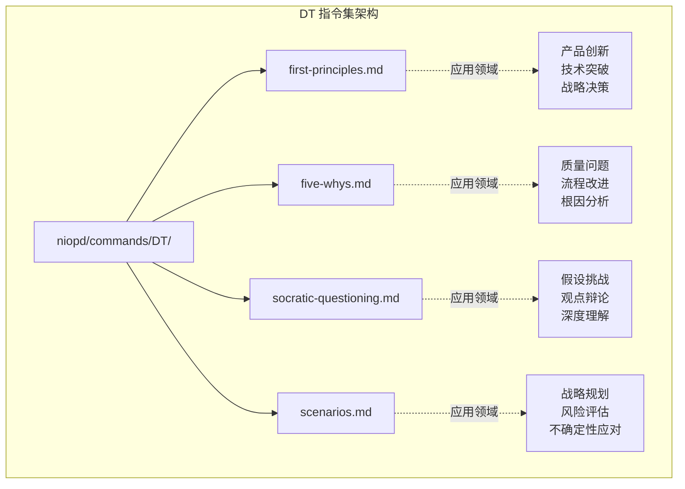
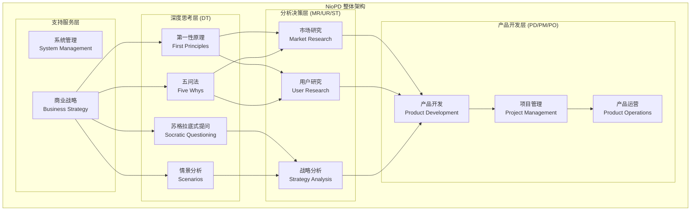
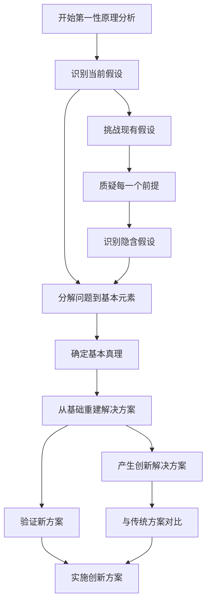
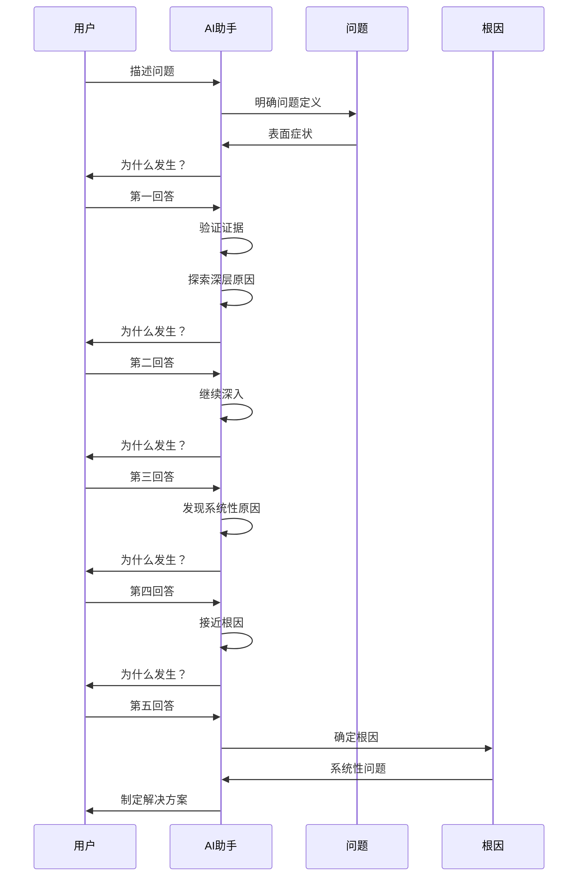
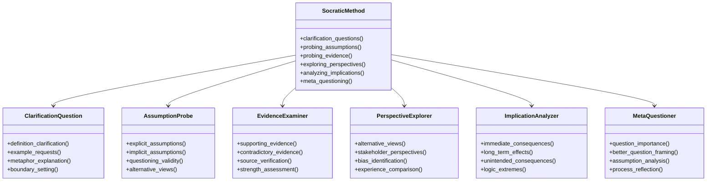
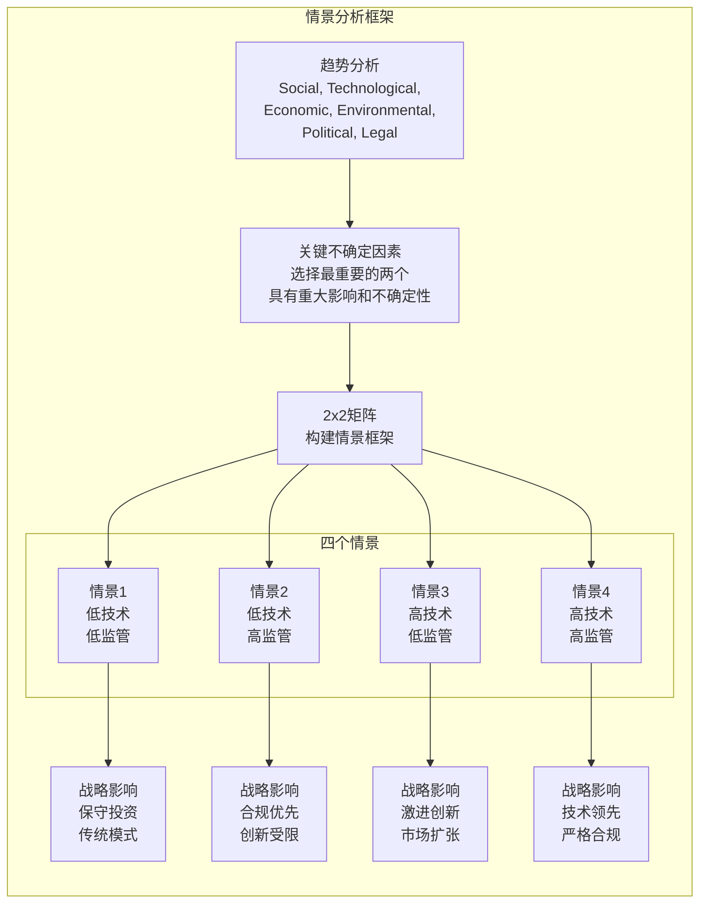
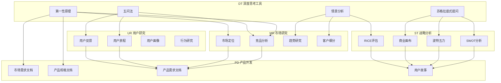

# DT - 深度思考工具指令

<cite>
**本文档中引用的文件**
- [first-principles.md](file://niopd/commands/DT/first-principles.md)
- [five-whys.md](file://niopd/commands/DT/five-whys.md)
- [scenarios.md](file://niopd/commands/DT/scenarios.md)
- [socratic-questioning.md](file://niopd/commands/DT/socratic-questioning.md)
- [compare-products.md](file://niopd/commands/MR/compare-products.md)
- [journey.md](file://niopd/commands/UR/journey.md)
- [README.md](file://README.md)
</cite>

## 目录
1. [简介](#简介)
2. [项目结构](#项目结构)
3. [核心组件](#核心组件)
4. [架构概览](#架构概览)
5. [详细组件分析](#详细组件分析)
6. [依赖关系分析](#依赖关系分析)
7. [性能考虑](#性能考虑)
8. [故障排除指南](#故障排除指南)
9. [结论](#结论)

## 简介

深度思考工具（DT）是 NioPD 产品管理工具包中的核心认知工具集合，包含四个主要指令：first-principles（第一性原理）、five-whys（五问法）、socratic-questioning（苏格拉底式提问）和scenarios（情景分析）。这些工具基于经典哲学和现代管理理论，为产品管理者提供系统性的思维框架，帮助他们在复杂的产品决策中找到根本解决方案。

DT 指令集的设计理念是"思考优先，执行其次"，强调通过深度思考建立认知基础，为后续的市场研究（MR）、用户研究（UR）等分析模块提供坚实的思维支撑。每个工具都有其独特的哲学基础和应用场景，共同构成了一个完整的深度思考生态系统。

## 项目结构

DT 指令集位于 `niopd/commands/DT/` 目录下，包含四个独立的 Markdown 文件，每个文件都遵循统一的结构化格式：

**图表来源**
- [first-principles.md](file://niopd/commands/DT/first-principles.md#L1-L20)
- [five-whys.md](file://niopd/commands/DT/five-whys.md#L1-L20)
- [socratic-questioning.md](file://niopd/commands/DT/socratic-questioning.md#L1-L20)
- [scenarios.md](file://niopd/commands/DT/scenarios.md#L1-L20)

**章节来源**
- [first-principles.md](file://niopd/commands/DT/first-principles.md#L1-L50)
- [five-whys.md](file://niopd/commands/DT/five-whys.md#L1-L50)
- [socratic-questioning.md](file://niopd/commands/DT/socratic-questioning.md#L1-L50)
- [scenarios.md](file://niopd/commands/DT/scenarios.md#L1-L50)

## 核心组件

### 第一性原理思维（First Principles Thinking）

第一性原理思维是 DT 指令集中最具创新性的工具，源自古希腊哲学家亚里士多德的概念，被现代创新者如埃隆·马斯克广泛应用于复杂问题解决。

#### 哲学基础
- **起源**：古希腊哲学，亚里士多德定义第一原则为"事物已知的第一个基础"
- **现代应用**：埃隆·马斯克用于 SpaceX 火箭成本优化和特斯拉电动车重新设计
- **核心理念**：将复杂问题分解到最基本的真理层面，然后从这些基本原理重建解决方案

#### 应用流程
1. **识别假设**：明确当前认为正确的前提
2. **问题分解**：将复杂问题拆解为基础元素
3. **重构解决方案**：基于基本真理重新构建创新方案
4. **避免类比**：不依赖惯例或类似经验

### 五问法（Five Whys）

五问法是由丰田汽车创始人丰田喜一郎开发的质量分析工具，是精益生产系统的核心组成部分。

#### 哲学基础
- **起源**：丰田生产系统（TPS），由 Sakichi Toyoda 开发
- **核心原则**：通过连续提问"为什么"来揭示问题的根本原因
- **灵活性**：虽然称为"五问"，实际所需次数根据具体情况而定

#### 应用特点
- **迭代探究**：每个回答都是下一个问题的基础
- **根因聚焦**：超越表面症状，寻找系统性问题
- **简单实用**：无需统计分析或复杂工具
- **协作性强**：最适合团队合作进行

### 苏格拉底式提问（Socratic Questioning）

苏格拉底式提问源于古希腊哲学家苏格拉底的辩证法，通过系统性提问促进批判性思维和深度理解。

#### 哲学基础
- **起源**：古典希腊哲学，苏格拉底（公元前470-399年）
- **核心方法**：Elenchus（交叉检验）：假装无知，通过提问暴露对方信念中的矛盾
- **指导原则**：通过自我推理发现真理，而非被告知答案

#### 提问类型
- **澄清问题**："你所说的...是什么意思？"
- **假设探查**："我们在这里假设了什么？"
- **证据探查**："你怎么知道这一点？"
- **视角探查**："还有其他看法吗？"
- **后果探查**："这会导致什么结果？"
- **元问题**："我们为什么要问这个问题？"

### 情景分析（Scenarios）

情景分析由 Herman Kahn 在 RAND 公司开创，后由 Pierre Wack 和 Peter Schwartz 在壳牌石油公司发展完善。

#### 哲学基础
- **起源**：军事战略规划（1950年代）
- **核心理念**：承认未来的不可预测性，开发多个可能的未来情景
- **矩阵方法**：通常使用2x2矩阵表示两个关键不确定因素的组合

#### 应用特点
- **多重未来**：探索3-4个不同的可能未来
- **驱动因素**：基于趋势和关键不确定因素
- **叙事丰富**：为每个未来构建详细的故事情节
- **战略韧性**：识别跨情景的稳健策略

**章节来源**
- [first-principles.md](file://niopd/commands/DT/first-principles.md#L10-L100)
- [five-whys.md](file://niopd/commands/DT/five-whys.md#L10-L100)
- [socratic-questioning.md](file://niopd/commands/DT/socratic-questioning.md#L10-L100)
- [scenarios.md](file://niopd/commands/DT/scenarios.md#L10-L100)

## 架构概览

DT 指令集在整个 NioPD 生态系统中扮演着认知基础设施的角色，为其他分析模块提供思维基础：

**图表来源**
- [README.md](file://README.md#L150-L200)
- [compare-products.md](file://niopd/commands/MR/compare-products.md#L1-L30)
- [journey.md](file://niopd/commands/UR/journey.md#L1-L50)

### DT 在产品管理流程中的作用

DT 指令集贯穿整个产品管理生命周期，在各个阶段发挥不同的认知功能：

1. **商业战略规划阶段（BS）**：使用第一性原理分析市场机会
2. **用户研究阶段（UR）**：通过苏格拉底式提问挑战用户假设
3. **市场研究阶段（MR）**：运用五问法分析竞争问题
4. **战略分析阶段（ST）**：借助情景分析准备未来决策
5. **产品开发阶段（PD）**：在需求定义中应用深度思考
6. **项目管理阶段（PM）**：用根因分析解决执行问题

## 详细组件分析

### 第一性原理思维深度分析

#### 理论基础与应用案例

第一性原理思维的核心在于"去伪存真"，通过系统性质疑消除表面假设，找到问题的本质：

**图表来源**
- [first-principles.md](file://niopd/commands/DT/first-principles.md#L50-L150)

#### 实际应用示例

**案例1：SpaceX 火箭成本优化**
- **传统思维**："火箭制造成本高昂，这是行业常态"
- **第一性原理分析**："火箭由什么材料构成？每种材料的市场价格是多少？"
- **创新结果**：通过垂直整合和材料成本控制大幅降低发射成本

**案例2：特斯拉电动车电池革命**
- **传统思维**："电动车电池价格昂贵，无法普及"
- **第一性原理分析**："电池由什么化学成分构成？每种成分的市场价格如何？"
- **创新结果**：重新设计电池组架构，大幅降低成本

### 五问法深度分析

#### 根因分析流程

五问法通过系统性提问揭示问题的深层根源：

**图表来源**
- [five-whys.md](file://niopd/commands/DT/five-whys.md#L50-L150)

#### 应用场景与最佳实践

**质量改进场景**：
- **问题**：产品质量不合格率上升
- **五问分析**：
  1. 为什么产品不合格？（设备故障）
  2. 为什么设备会故障？（维护不足）
  3. 为什么维护不及时？（人员短缺）
  4. 为什么人员短缺？（招聘困难）
  5. 为什么招聘困难？（薪酬竞争力不足）

**流程优化场景**：
- **问题**：客户投诉处理时间过长
- **五问分析**：
  1. 为什么处理时间长？（流程复杂）
  2. 为什么流程复杂？（部门壁垒）
  3. 为什么存在壁垒？（绩效考核）
  4. 为什么考核有问题？（指标不合理）
  5. 为什么指标不合理？（历史遗留问题）

### 苏格拉底式提问深度分析

#### 对话式思维引导

苏格拉底式提问通过系统性对话促进深度思考：

**图表来源**
- [socratic-questioning.md](file://niopd/commands/DT/socratic-questioning.md#L50-L150)

#### 深度对话技巧

**澄清技巧**：
- "你所说的'高效'具体指什么？"
- "能否举一个具体的例子来说明你的观点？"
- "这个概念与其他相关概念有何区别？"

**假设挑战**：
- "我们是否默认了某些未经证实的前提？"
- "如果这个假设不成立，会有什么影响？"
- "谁从这个假设中受益最多？"

**证据评估**：
- "支持这个观点的主要证据是什么？"
- "有没有可能被忽视的相反证据？"
- "这个证据的可靠性和时效性如何？"

### 情景分析深度分析

#### 多维度未来规划

情景分析通过构建多个可能的未来来增强战略决策的鲁棒性：

**图表来源**
- [scenarios.md](file://niopd/commands/DT/scenarios.md#L50-L150)

#### 情景构建方法论

**驱动因素识别**：
- **社会趋势**：人口结构变化、文化价值观演进
- **技术趋势**：新兴技术突破、技术成熟度曲线
- **经济趋势**：经济增长模式、消费能力变化
- **环境趋势**：气候变化、资源约束
- **政治趋势**：政策法规变化、国际关系
- **法律趋势**：知识产权保护、行业监管

**关键不确定因素选择**：
- **影响程度**：对业务的潜在影响大小
- **不确定性程度**：发生的可能性和可预测性
- **可控程度**：企业能影响的程度
- **时间范围**：影响的时间跨度

**情景叙事构建**：
- **世界观描述**：每个情景下的整体环境
- **关键事件**：导致情景形成的标志性事件
- **特征总结**：情景的独特属性和表现

**章节来源**
- [first-principles.md](file://niopd/commands/DT/first-principles.md#L150-L247)
- [five-whys.md](file://niopd/commands/DT/five-whys.md#L150-L246)
- [socratic-questioning.md](file://niopd/commands/DT/socratic-questioning.md#L150-L248)
- [scenarios.md](file://niopd/commands/DT/scenarios.md#L150-L300)

## 依赖关系分析

DT 指令集与其他 NioPD 模块之间存在复杂的相互依赖关系：

**图表来源**
- [compare-products.md](file://niopd/commands/MR/compare-products.md#L1-L50)
- [journey.md](file://niopd/commands/UR/journey.md#L1-L50)

### DT 对 MR 的支撑作用

**第一性原理**帮助 MR 团队：
- 挑战市场研究的假设前提
- 重新定义市场规模计算方法
- 发现被忽视的市场机会

**五问法**在 MR 中的应用：
- 分析竞争对手失败的根本原因
- 解释市场趋势背后的深层动力
- 识别市场进入障碍的真实性质

**情景分析**为 MR 提供：
- 多维度市场预测框架
- 不同竞争环境下的战略规划
- 风险管理和机会识别

### DT 对 UR 的深化作用

**苏格拉底式提问**在 UR 中的价值：
- 挑战用户反馈的表面含义
- 发掘用户未表达的真实需求
- 识别用户行为背后的心理动机

**第一性原理**在 UR 中的应用：
- 重新思考用户研究的方法论
- 打破传统的用户画像假设
- 发现新的用户群体和需求

**情景分析**为 UR 提供：
- 用户体验的长期发展趋势
- 不同技术环境下的用户行为变化
- 未来用户需求的可能形态

**章节来源**
- [compare-products.md](file://niopd/commands/MR/compare-products.md#L200-L335)
- [journey.md](file://niopd/commands/UR/journey.md#L200-L400)

## 性能考虑

### 计算复杂度分析

DT 指令集的性能特征主要体现在以下几个方面：

#### 时间复杂度
- **第一性原理**：O(n²)，其中 n 是问题分解的层次数
- **五问法**：O(k)，k 是达到根因所需的提问次数（通常为5-10次）
- **苏格拉底式提问**：O(m×n)，m 是对话轮次，n 是问题类型数量
- **情景分析**：O(p×q)，p 是趋势数量，q 是不确定因素组合

#### 空间复杂度
- **内存使用**：主要存储在对话历史和上下文中
- **存储需求**：每次分析生成的报告大小约为 10-50KB
- **并发处理**：支持多用户同时使用，内存占用线性增长

### 优化策略

#### 1. 智能提示优化
- 使用自然语言处理技术提高问题理解准确性
- 基于历史数据分析个性化提问策略
- 自动识别对话中的关键节点和转折点

#### 2. 上下文管理
- 实现智能上下文压缩机制
- 使用记忆网络减少重复信息存储
- 支持断点续传功能

#### 3. 并发处理
- 实现异步处理队列
- 使用缓存机制提高响应速度
- 支持批量处理多个分析请求

## 故障排除指南

### 常见问题与解决方案

#### 1. 输入参数验证问题

**问题描述**：用户提供的输入参数不符合要求

**解决方案**：
- 实施严格的参数验证机制
- 提供清晰的错误提示和修正建议
- 支持参数自动补全和推荐

**章节来源**
- [first-principles.md](file://niopd/commands/DT/first-principles.md#L200-L247)
- [five-whys.md](file://niopd/commands/DT/five-whys.md#L200-L246)
- [socratic-questioning.md](file://niopd/commands/DT/socratic-questioning.md#L200-L248)
- [scenarios.md](file://niopd/commands/DT/scenarios.md#L250-L300)

#### 2. 对话流程中断

**问题描述**：用户在分析过程中突然停止参与

**解决方案**：
- 实现智能暂停和恢复功能
- 提供进度保存和恢复机制
- 设计灵活的对话流程，允许用户随时调整

#### 3. 结果质量不稳定

**问题描述**：不同用户的分析结果质量差异较大

**解决方案**：
- 实施质量评估和反馈循环
- 提供专家审核和质量控制机制
- 建立知识库和最佳实践模板

### 错误处理机制

#### 参数验证错误
- **缺失必要参数**：提示用户提供必需信息
- **参数格式错误**：提供正确的格式示例
- **参数冲突**：解释参数间的逻辑关系

#### 数据访问错误
- **网络连接问题**：提供离线模式选项
- **权限不足**：指导用户获取必要权限
- **数据源不可用**：提供备用数据源或手动输入选项

#### 系统资源错误
- **内存不足**：实现智能资源管理
- **处理超时**：提供进度反馈和重试机制
- **并发限制**：实施排队和优先级管理

## 结论

深度思考工具（DT）作为 NioPD 产品管理工具包的核心认知基础设施，为产品管理者提供了系统性的思维框架和方法论支持。通过 first-principles、five-whys、socratic-questioning 和 scenarios 四大工具，DT 指令集实现了从问题识别到根本解决的完整思维闭环。

### 主要价值体现

1. **认知基础建设**：为 MR、UR 等分析模块提供坚实的思维基础
2. **方法论标准化**：将经典哲学和现代管理理论转化为可操作的工具
3. **思维能力培养**：通过系统性训练提升产品管理者的深度思考能力
4. **决策质量提升**：通过结构化思考提高产品决策的科学性和准确性

### 应用前景展望

随着人工智能技术的发展，DT 指令集将在以下方面得到进一步发展：

1. **智能化程度提升**：利用大语言模型提供更加精准和个性化的思维引导
2. **跨领域融合**：与其他学科知识相结合，拓展应用场景
3. **实时决策支持**：在动态环境中提供即时的思维辅助
4. **团队协作增强**：支持多人协同的深度思考过程

DT 指令集不仅是产品管理工具包的重要组成部分，更是现代产品管理思维范式转变的体现。它代表了从经验驱动向理性驱动、从表面操作向深度思考的演进方向，为产品管理领域的认知升级和方法论创新提供了重要支撑。