# MR - 市场研究指令

<cite>
**本文档中引用的文件**
- [competitor.md](file://niopd/commands/MR/competitor.md)
- [segmentation.md](file://niopd/commands/MR/segmentation.md)
- [pricing.md](file://niopd/commands/MR/pricing.md)
- [positioning.md](file://niopd/commands/MR/positioning.md)
- [trends.md](file://niopd/commands/MR/trends.md)
- [compare.md](file://niopd/commands/MR/compare.md)
- [compare-products.md](file://niopd/commands/MR/compare-products.md)
- [market-research-template.md](file://niopd/templates/market-research-template.md)
- [competitor-analysis-template.md](file://niopd/templates/competitor-analysis-template.md)
- [porters-five-forces.md](file://niopd/commands/ST/porters-five-forces.md)
</cite>

## 目录
1. [简介](#简介)
2. [项目结构](#项目结构)
3. [核心组件](#核心组件)
4. [架构概览](#架构概览)
5. [详细组件分析](#详细组件分析)
6. [依赖关系分析](#依赖关系分析)
7. [性能考虑](#性能考虑)
8. [故障排除指南](#故障排除指南)
9. [结论](#结论)

## 简介

市场研究（MR）指令集是NioPD平台中的一个专门模块，提供了全面的市场分析工具集合。该模块涵盖了竞品分析、市场细分、定价策略、市场定位、趋势分析以及比较类指令等核心功能，为产品团队提供系统化的市场洞察和战略决策支持。

MR模块的设计理念基于现代市场营销理论和战略管理框架，整合了SWOT分析、波特五力模型、STP营销理论等多种经典分析方法。通过自动化数据收集、智能分析和结构化报告生成，MR指令集能够快速提供高质量的市场研究结果。

## 项目结构

MR指令集位于`niopd/commands/MR/`目录下，包含以下核心指令文件：

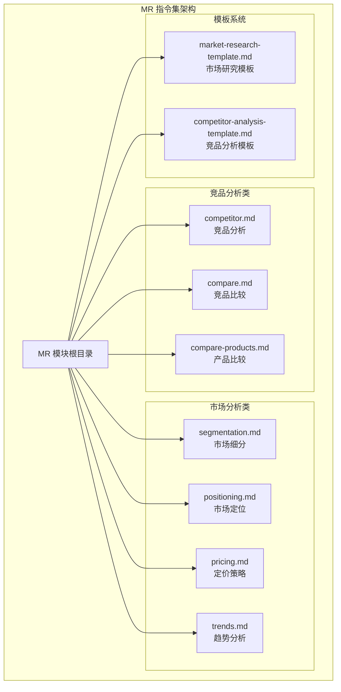

**图表来源**
- [competitor.md](file://niopd/commands/MR/competitor.md#L1-L50)
- [segmentation.md](file://niopd/commands/MR/segmentation.md#L1-L50)
- [pricing.md](file://niopd/commands/MR/pricing.md#L1-L50)

**章节来源**
- [competitor.md](file://niopd/commands/MR/competitor.md#L1-L282)
- [segmentation.md](file://niopd/commands/MR/segmentation.md#L1-L275)
- [pricing.md](file://niopd/commands/MR/pricing.md#L1-L387)

## 核心组件

MR指令集包含七大核心分析指令，每个指令都针对特定的市场研究需求：

### 竞品分析指令（competitor）
专注于竞争对手的全面分析，构建SWOT对比矩阵，评估市场定位和竞争优势。

### 市场细分指令（segmentation）
识别和分析客户群体，制定目标市场策略，支持精准营销决策。

### 定价策略指令（pricing）
分析市场价格动态，评估价格敏感度，推荐最优定价模型。

### 市场定位指令（positioning）
定义产品在市场中的独特位置，制定差异化战略。

### 趋势分析指令（trends）
研究市场发展趋势，识别新兴机会和潜在威胁。

### 比较类指令（compare、compare-products）
进行横向竞争分析，发现市场空白和差异化机会。

**章节来源**
- [competitor.md](file://niopd/commands/MR/competitor.md#L10-L50)
- [segmentation.md](file://niopd/commands/MR/segmentation.md#L10-L50)
- [pricing.md](file://niopd/commands/MR/pricing.md#L10-L50)

## 架构概览

MR指令集采用模块化设计，每个指令都是独立的功能单元，同时保持与其他模块的协同工作能力：

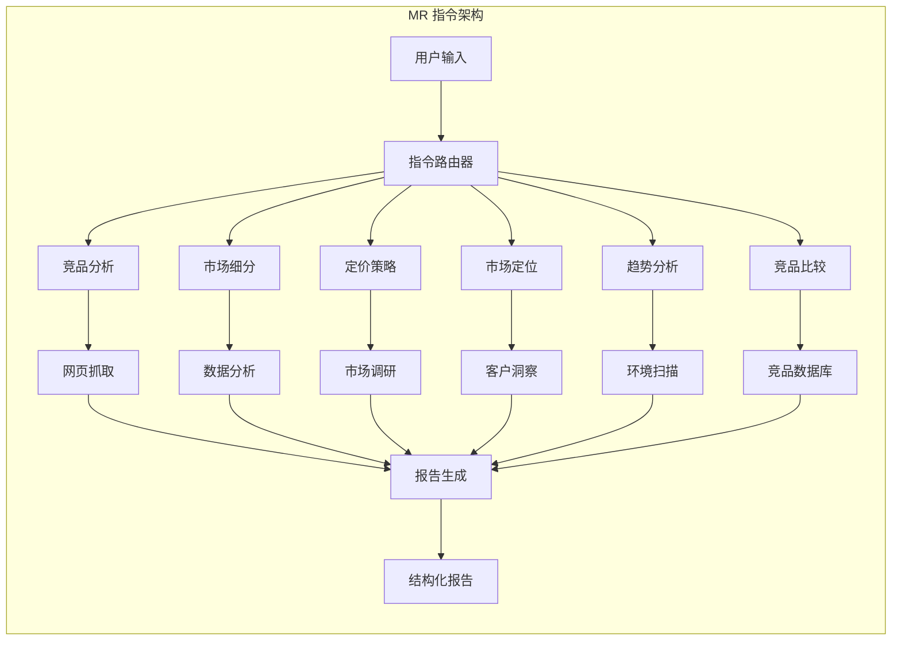

**图表来源**
- [competitor.md](file://niopd/commands/MR/competitor.md#L50-L100)
- [segmentation.md](file://niopd/commands/MR/segmentation.md#L50-L100)

## 详细组件分析

### 竞品分析指令（competitor）

竞品分析指令是MR模块的核心功能之一，基于系统化的SWOT分析框架，提供深度的竞争对手洞察。

#### 分析框架

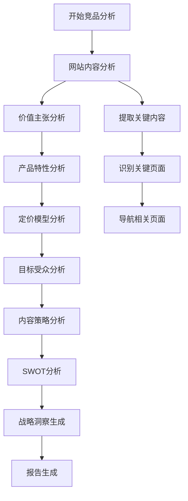

**图表来源**
- [competitor.md](file://niopd/commands/MR/competitor.md#L100-L200)

#### SWOT对比矩阵构建

竞品分析指令的核心输出是SWOT对比矩阵，包含以下维度：

| 维度 | 描述 | 分析重点 |
|------|------|----------|
| **优势（Strengths）** | 竞争对手的核心竞争力 | 技术专利、品牌忠诚度、市场份额 |
| **劣势（Weaknesses）** | 竞争对手的局限性 | 产品缺陷、服务不足、成本劣势 |
| **机会（Opportunities）** | 市场中的增长机会 | 新兴市场、技术突破、合作伙伴 |
| **威胁（Threats）** | 外部挑战和风险 | 新进入者、替代品、经济环境 |

#### 输入要求和输出结构

**输入参数：**
- `--url=<competitor_url>`：目标竞争对手的官方网站URL
- 支持自动验证URL格式和可访问性

**输出结构：**
- 执行摘要：关键发现和战略建议
- 公司概况：基本信息和市场定位
- 价值主张：核心营销信息
- 产品特性：功能列表和独特卖点
- 定价策略：价格层级和商业模式
- 目标受众：市场细分和客户画像
- 内容策略：营销方法和传播渠道
- SWOT分析：全面的战略评估
- 战略建议：差异化机会和应对策略

**章节来源**
- [competitor.md](file://niopd/commands/MR/competitor.md#L1-L282)

### 市场细分指令（segmentation）

市场细分指令基于多种细分理论，帮助识别和分析具有相似特征的客户群体。

#### 细分理论框架

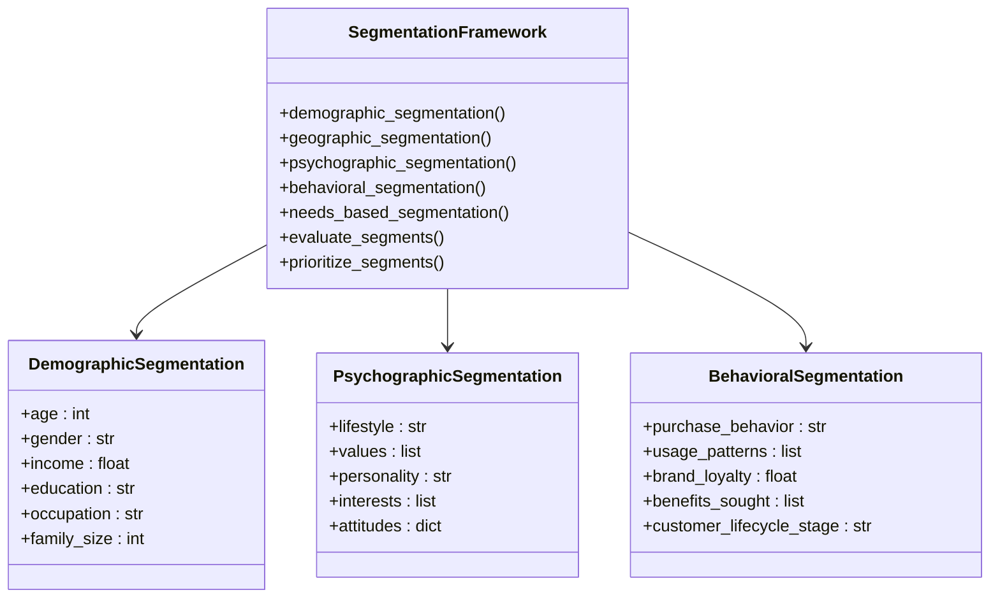

**图表来源**
- [segmentation.md](file://niopd/commands/MR/segmentation.md#L20-L80)

#### 5R评估标准

市场细分指令使用严格的5R标准评估细分市场的可行性：

| 标准 | 定义 | 评估要点 |
|------|------|----------|
| **响应性（Responsive）** | 细分市场对营销策略的反应 | 不同营销组合下的行为差异 |
| **可达性（Reachable）** | 营销渠道能否有效触达 | 渠道覆盖和接触成本 |
| **现实性（Realistic）** | 细分市场的规模和盈利能力 | 市场容量和利润潜力 |
| **相关性（Relevant）** | 细分市场与业务目标的相关性 | 战略契合度和资源匹配 |
| **可识别性（Recognizable）** | 细分市场的可测量和区分能力 | 数据可用性和边界清晰度 |

**章节来源**
- [segmentation.md](file://niopd/commands/MR/segmentation.md#L1-L275)

### 定价策略指令（pricing）

定价策略指令结合经济学原理和心理学理论，提供全面的定价分析和优化建议。

#### 定价三角形理论

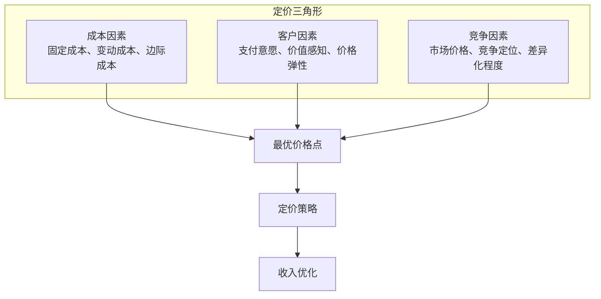

**图表来源**
- [pricing.md](file://niopd/commands/MR/pricing.md#L30-L80)

#### 定价模型分类

定价策略指令支持多种现代定价模型：

| 定价模型 | 应用场景 | 优势 | 风险 |
|----------|----------|------|------|
| **订阅定价** | SaaS产品、内容服务 | 稳定现金流、预测性强 | 用户流失率高 |
| **免费增值** | 用户获取、市场渗透 | 低门槛吸引用户、转化机会 | 盈利周期长 |
| **使用量定价** | 云服务、公用事业 | 按需付费、成本透明 | 收入波动大 |
| **动态定价** | 电商、旅游行业 | 实时优化收益 | 顾客信任度低 |
| **捆绑定价** | 产品组合、套餐服务 | 提升客单价、交叉销售 | 价值感知复杂 |

#### 价格敏感度评估

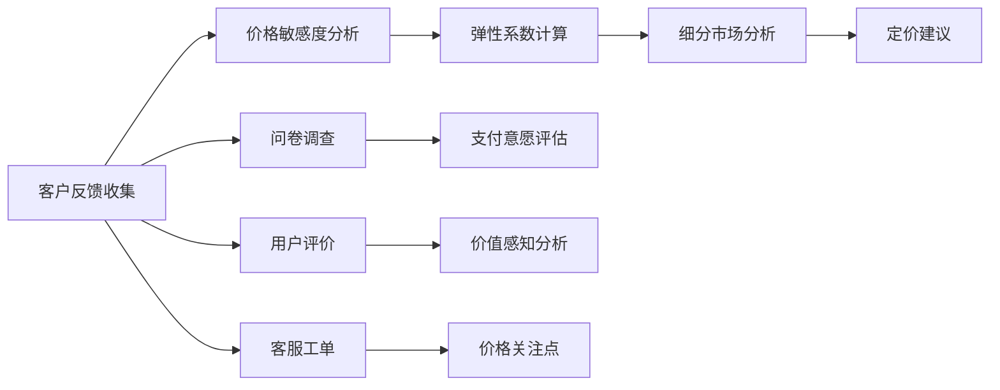

**图表来源**
- [pricing.md](file://niopd/commands/MR/pricing.md#L150-L250)

**章节来源**
- [pricing.md](file://niopd/commands/MR/pricing.md#L1-L387)

### 市场定位指令（positioning）

市场定位指令基于Al Ries和Jack Trout的经典定位理论，帮助产品在消费者心智中建立独特的认知地位。

#### 定位声明公式

经典的定位声明遵循以下结构：
```
对于 [目标受众]，我们的 [产品名称] 是 [产品类别]，
它 [核心价值主张]。
不同于 [主要竞争对手]，我们的产品 [主要差异化点]。
```

#### 定位框架要素

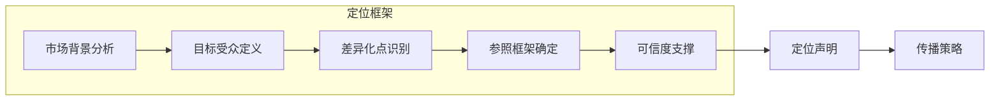

**图表来源**
- [positioning.md](file://niopd/commands/MR/positioning.md#L30-L80)

#### 价值提案画布

市场定位指令使用价值提案画布进行深入分析：

| 维度 | 分析内容 | 输出成果 |
|------|----------|----------|
| **客户工作** | 客户面临的问题和需求 | 需求清单和痛点分析 |
| **痛苦** | 客户的负面体验 | 痛点地图和优先级排序 |
| **收益** | 客户期望的积极结果 | 目标清单和期望值 |
| **产品与服务** | 我们提供的解决方案 | 功能特性和服务承诺 |
| **痛苦缓解器** | 如何解决客户问题 | 解决方案描述和效果预期 |
| **收益创造器** | 如何为客户带来价值 | 价值主张和差异化点 |

**章节来源**
- [positioning.md](file://niopd/commands/MR/positioning.md#L1-L419)

### 趋势分析指令（trends）

趋势分析指令采用系统化的环境扫描方法，识别和分析影响市场的长期和短期趋势。

#### 趋势分类体系

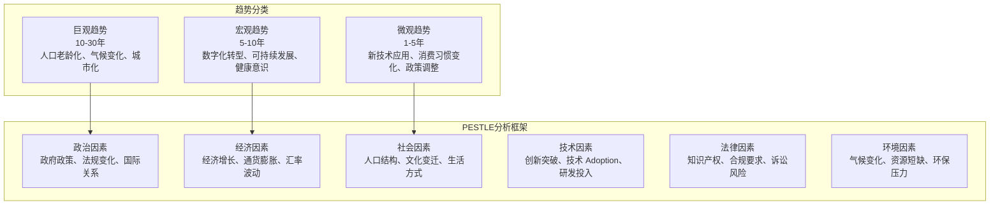

**图表来源**
- [trends.md](file://niopd/commands/MR/trends.md#L20-L70)

#### 弱信号分析

趋势分析指令特别关注"弱信号"的识别和验证：

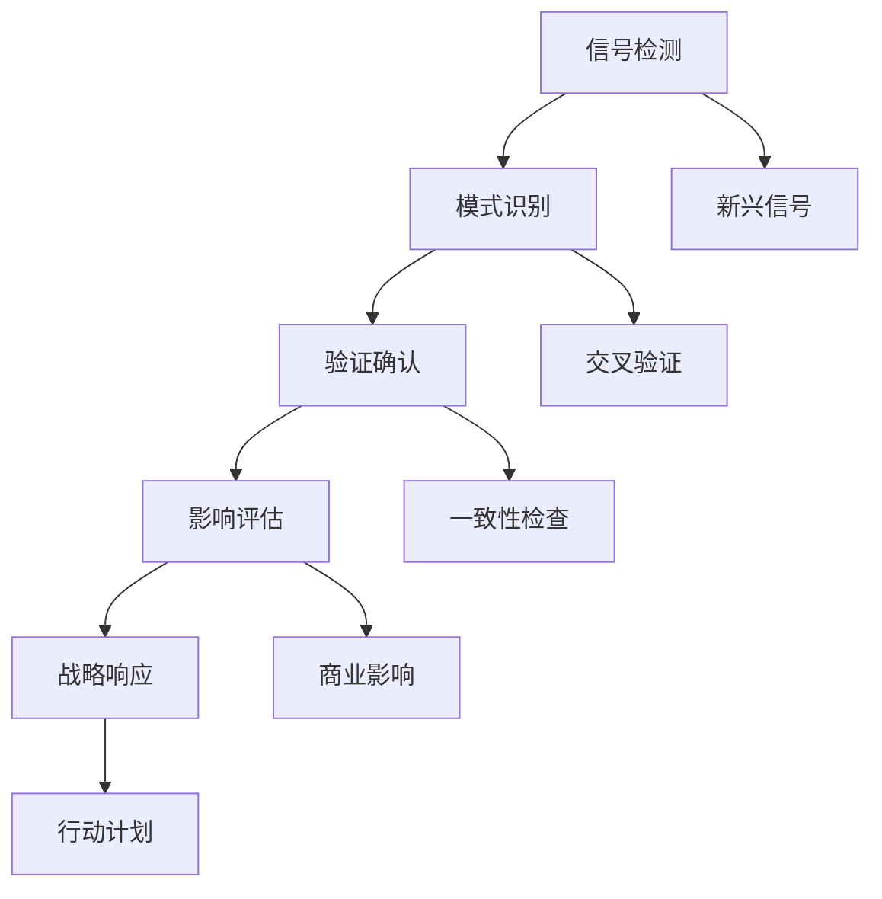

**图表来源**
- [trends.md](file://niopd/commands/MR/trends.md#L80-L150)

**章节来源**
- [trends.md](file://niopd/commands/MR/trends.md#L1-L282)

### 比较类指令（compare、compare-products）

比较类指令提供系统性的竞争分析，帮助识别市场空白和差异化机会。

#### 竞品比较框架

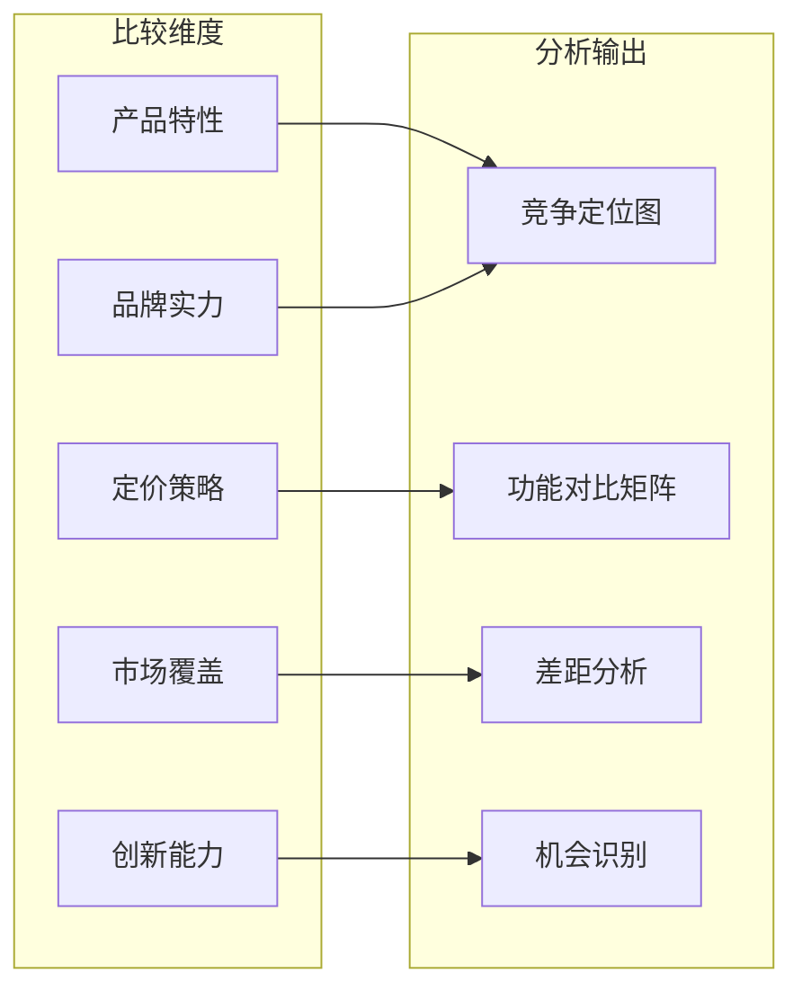

**图表来源**
- [compare.md](file://niopd/commands/MR/compare.md#L50-L100)
- [compare-products.md](file://niopd/commands/MR/compare-products.md#L50-L100)

#### 2x2竞争定位矩阵

比较类指令生成的定位矩阵帮助直观展示竞争格局：

| X轴：功能丰富度 | 基础功能 | 标准功能 | 高级功能 | 专业功能 |
|----------------|----------|----------|----------|----------|
| **低价位** | 竞品A | 竞品B | 竞品C | 竞品D |
| **中价位** | 竞品E | 竞品F | 竞品G | 竞品H |
| **高价位** | 竞品I | 竞品J | 竞品K | 竞品L |
| **您的产品** | 您的位置 | 您的优势 | 您的劣势 | 您的机会 |

**章节来源**
- [compare.md](file://niopd/commands/MR/compare.md#L1-L336)
- [compare-products.md](file://niopd/commands/MR/compare-products.md#L1-L335)

## 依赖关系分析

MR指令集与ST模块存在密切的联动关系，特别是在波特五力模型的应用上：

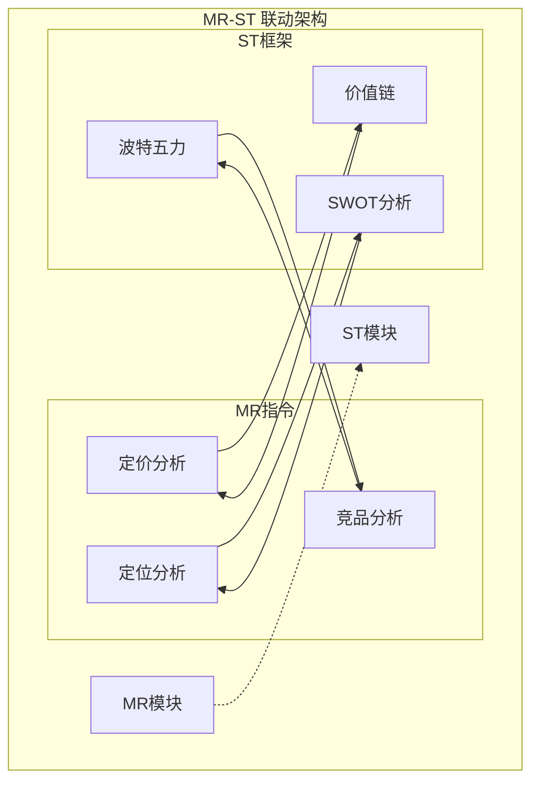

**图表来源**
- [porters-five-forces.md](file://niopd/commands/ST/porters-five-forces.md#L1-L50)

### 波特五力模型联动

MR指令集与ST模块中的波特五力模型形成互补关系：

| MR指令 | 波特五力对应 | 联动方式 | 输出整合 |
|--------|--------------|----------|----------|
| **竞品分析** | 竞争对手分析 | 竞争激烈程度评估 | 行业吸引力评分 |
| **市场细分** | 买方议价能力 | 目标市场选择 | 市场份额预测 |
| **定价策略** | 替代品威胁 | 价格敏感度分析 | 产品定位建议 |
| **趋势分析** | 新进入者威胁 | 技术变革评估 | 进入壁垒分析 |
| **比较分析** | 供应商议价能力 | 供应链分析 | 成本结构优化 |

**章节来源**
- [porters-five-forces.md](file://niopd/commands/ST/porters-five-forces.md#L1-L200)

## 性能考虑

MR指令集在设计时充分考虑了性能优化和用户体验：

### 数据处理优化
- **并发网络请求**：同时处理多个URL的网页抓取
- **缓存机制**：重复查询的结果缓存
- **增量更新**：只更新变化的数据部分
- **异步处理**：大型分析任务的后台执行

### 报告生成效率
- **模板化输出**：标准化的报告结构
- **Markdown优化**：轻量级格式便于分享
- **自动生成**：减少手动编辑时间
- **版本控制**：分析结果的版本追踪

### 用户体验设计
- **渐进式指导**：逐步引导用户完成复杂分析
- **实时反馈**：分析进度的可视化展示
- **错误恢复**：部分失败时的容错处理
- **交互式提示**：智能的下一步建议

## 故障排除指南

### 常见问题及解决方案

#### URL访问问题
**症状**：无法访问竞争对手网站或获取数据
**原因**：网络限制、网站反爬虫、认证要求
**解决方案**：
- 验证URL格式和可访问性
- 检查网络连接状态
- 使用代理服务器或VPN
- 手动提供关键信息

#### 数据质量不佳
**症状**：分析结果不准确或缺失关键信息
**原因**：网站内容不足、数据提取错误、信息过时
**解决方案**：
- 扩展数据源范围
- 手动补充关键数据
- 更新分析参数
- 结合其他MR指令进行交叉验证

#### 报告生成失败
**症状**：无法保存或导出分析报告
**原因**：文件权限问题、存储空间不足、编码错误
**解决方案**：
- 检查工作目录权限
- 清理磁盘空间
- 验证文件名合法性
- 重新运行分析流程

#### 分析结果不一致
**症状**：不同指令间的数据矛盾
**原因**：数据来源差异、分析方法不同、时间窗口不一致
**解决方案**：
- 明确数据来源和时效性
- 统一分析基准和时间范围
- 进行交叉验证和一致性检查
- 结合多角度分析得出综合结论

**章节来源**
- [competitor.md](file://niopd/commands/MR/competitor.md#L250-L282)
- [segmentation.md](file://niopd/commands/MR/segmentation.md#L250-L275)
- [pricing.md](file://niopd/commands/MR/pricing.md#L350-L387)

## 结论

MR指令集作为NioPD平台的核心市场研究工具，提供了全面而系统的市场分析能力。通过整合多种经典分析框架和现代数据技术，MR模块能够：

1. **提供深度洞察**：从竞品分析到趋势预测，覆盖市场研究的各个层面
2. **支持战略决策**：为产品定位、定价策略、市场进入等重大决策提供数据支持
3. **提升分析效率**：自动化数据收集和报告生成，显著提高研究效率
4. **确保分析质量**：基于严谨的理论框架和最佳实践
5. **促进跨部门协作**：与ST模块的无缝集成，形成完整的企业战略分析体系

MR指令集不仅是一个工具集合，更是一个完整的市场研究方法论体系。随着人工智能技术的发展和数据积累的增加，MR模块将持续演进，为企业的市场竞争力提供更强有力的支持。