# PD - 产品开发指令集

<cite>
**本文档中引用的文件**
- [draft-prd.md](file://niopd/commands/PD/draft-prd.md)
- [stories.md](file://niopd/commands/PD/stories.md)
- [acceptance-criteria.md](file://niopd/commands/PD/acceptance-criteria.md)
- [experiment.md](file://niopd/commands/PD/experiment.md)
- [journey.md](file://niopd/commands/PD/journey.md)
- [process.md](file://niopd/commands/PD/process.md)
- [roadmap.md](file://niopd/commands/PD/roadmap.md)
- [wireframe.md](file://niopd/commands/PD/wireframe.md)
- [workflow.md](file://niopd/commands/PD/workflow.md)
- [prd-template.md](file://niopd/templates/prd-template.md)
- [user-story-template.md](file://niopd/templates/user-story-template.md)
- [faq-template.md](file://niopd/templates/faq-template.md)
</cite>

## 目录
1. [简介](#简介)
2. [产品开发指令集架构](#产品开发指令集架构)
3. [核心文档体系](#核心文档体系)
4. [用户故事与验收标准](#用户故事与验收标准)
5. [实验设计与验证](#实验设计与验证)
6. [用户体验设计](#用户体验设计)
7. [项目规划与执行](#项目规划与执行)
8. [工作流程指南](#工作流程指南)
9. [最佳实践与建议](#最佳实践与建议)
10. [总结](#总结)

## 简介

NioPD（Nio Product Development）是一个全面的产品开发指令集系统，专为现代产品管理团队设计。该系统通过结构化的方法论，帮助产品团队从洞察到执行的完整转化过程，涵盖PRD/MRD/PSD文档起草、用户故事、验收标准、线框图、工作流、流程设计、用户旅程、路线图和实验设计等核心要素。

### 核心价值主张

- **系统化方法论**：提供从市场洞察到产品发布的完整框架
- **跨职能协作**：促进产品、工程、设计、运营团队的有效沟通
- **数据驱动决策**：通过实验设计和数据分析支持产品决策
- **可交付成果**：生成标准化的文档和可视化材料
- **灵活适应性**：支持不同项目类型和复杂度的需求

## 产品开发指令集架构

### 三层文档架构

NioPD采用三层次的文档架构，确保从战略到执行的完整覆盖：

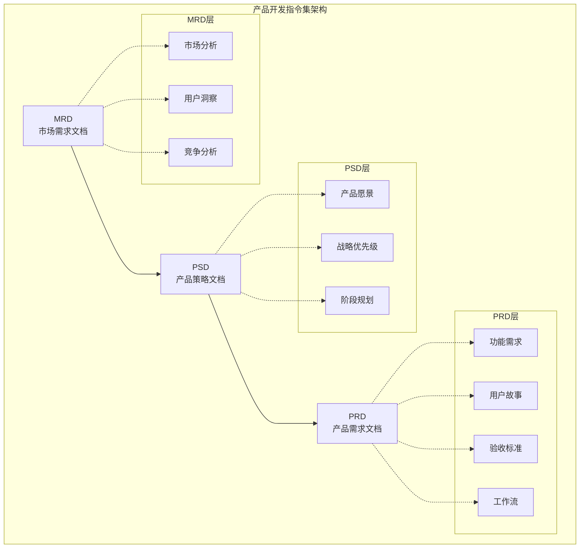

**图表来源**
- [draft-prd.md](file://niopd/commands/PD/draft-prd.md#L41-L89)
- [workflow.md](file://niopd/commands/PD/workflow.md#L100-L150)

### 指令集分类体系

```mermaid
mindmap
root((NioPD产品开发指令集))
PD指令
PRD文档起草
用户故事生成
验收标准定义
实验设计
用户旅程映射
业务流程建模
线框图设计
路线图规划
MR指令
市场趋势分析
用户细分研究
竞争对手分析
定价策略
市场定位
UR指令
用户访谈
行为分析
旅程地图
人设构建
工作任务分析
ST指令
SWOT分析
PEST分析
波特五力
平衡计分卡
设计思维
PM指令
敏捷规划
KPI跟踪
发布管理
风险评估
PO指令
北星指标
客户成功
利益相关者沟通
```

**节来源**
- [workflow.md](file://niopd/commands/PD/workflow.md#L150-L200)

## 核心文档体系

### MRD（市场需求文档）

MRD是产品开发的战略起点，回答"为什么做"的问题。

#### 核心要素

| 组件 | 描述 | 输出形式 |
|------|------|----------|
| 市场分析 | 市场规模、增长趋势、细分市场 | 数据报告 |
| 用户洞察 | 目标用户特征、痛点、需求 | 人设文档 |
| 竞争分析 | 竞品对比、市场定位、差异化 | 分析报告 |
| 商业目标 | 收入模型、ROI预期、成功指标 | 商业计划 |

#### MRD与PRD的关系

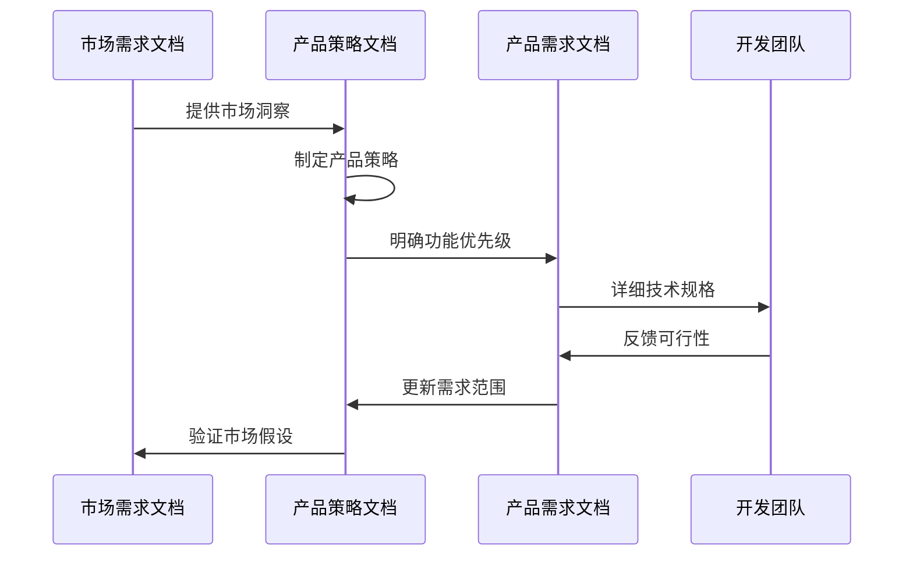

**图表来源**
- [draft-prd.md](file://niopd/commands/PD/draft-prd.md#L17-L63)

### PRD（产品需求文档）

PRD是产品开发的执行蓝图，详细描述"做什么"和"怎么做"。

#### PRD结构框架

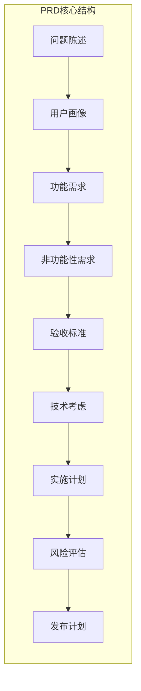

**图表来源**
- [prd-template.md](file://niopd/templates/prd-template.md#L10-L125)

### PSD（产品策略文档）

PSD作为MRD和PRD之间的桥梁，明确"怎么做"的战略层面。

#### 策略优先级矩阵

| 优先级 | 类别 | 特征 | 示例 |
|--------|------|------|------|
| P0 - 必须有 | 关键功能 | 核心价值、差异化 | 主要功能特性 |
| P1 - 应该有 | 高价值功能 | 用户满意度、竞争优势 | 增强功能 |
| P2 - 可能有 | 未来考虑 | 长期机会、实验性 | 扩展功能 |
| P3 - 不会有 | 明确排除 | 资源限制、战略选择 | 不相关功能 |

**节来源**
- [draft-prd.md](file://niopd/commands/PD/draft-prd.md#L41-L89)

## 用户故事与验收标准

### 用户故事生成机制

用户故事是连接用户需求和开发实现的桥梁，遵循"As a [persona], I want to [action], so that [benefit]"的格式。

#### 用户故事生命周期

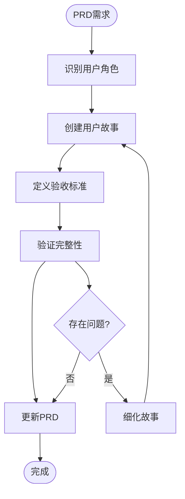

**图表来源**
- [stories.md](file://niopd/commands/PD/stories.md#L50-L100)

#### 验收标准设计

验收标准确保需求的可测试性和明确性，采用Given-When-Then格式：

| 场景类型 | Given条件 | When动作 | Then结果 |
|----------|-----------|----------|----------|
| 正常流程 | 用户已登录 | 点击购买按钮 | 显示确认页面 |
| 边界情况 | 输入空值 | 提交表单 | 显示错误提示 |
| 异常处理 | 网络中断 | 尝试加载数据 | 显示离线状态 |

**节来源**
- [acceptance-criteria.md](file://niopd/commands/PD/acceptance-criteria.md#L20-L70)

### 故事映射与优先级

#### INVEST原则验证

每个用户故事都应满足INVEST原则：

- **独立性**：可以独立开发和测试
- **协商性**：细节可以在开发过程中协商
- **有价值**：为用户或业务带来价值
- **可估算**：团队能够估算工作量
- **小规模**：可在单次迭代内完成
- **可测试**：有明确的成功标准

**节来源**
- [stories.md](file://niopd/commands/PD/stories.md#L100-L150)

## 实验设计与验证

### 实验设计框架

实验设计是产品开发中的科学方法，通过控制变量来验证假设。

#### A/B测试设计流程

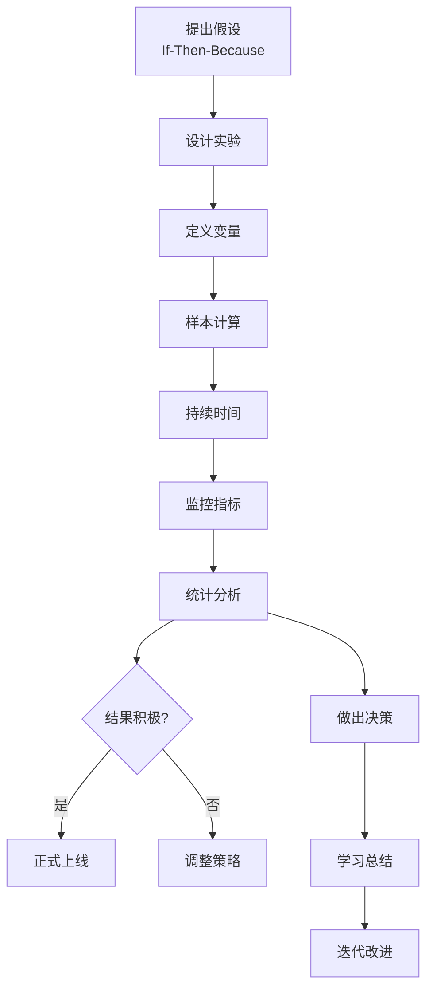

**图表来源**
- [experiment.md](file://niopd/commands/PD/experiment.md#L50-L100)

#### 关键实验要素

| 元素 | 描述 | 示例 |
|------|------|------|
| 假设 | If-Then-Because格式 | 如果添加社交证明，那么转化率将提高10% |
| 独立变量 | 改变的因素 | 社交证明显示 |
| 依赖变量 | 测量的结果 | 转化率 |
| 控制组 | 对照组 | 不显示社交证明 |
| 处理组 | 实验组 | 显示社交证明 |
| 样本大小 | 统计显著性 | 基于基线转化率计算 |
| 持续时间 | 实验周期 | 2周以上避免季节效应 |

**节来源**
- [experiment.md](file://niopd/commands/PD/experiment.md#L100-L200)

### 实验风险管理

#### 常见陷阱与对策

```mermaid
mindmap
root((实验风险))
Peeking Problem
描述: 过早查看结果
对策: 预先设定停止规则
Multiple Testing
描述: 多个指标增加假阳性
对策: Bonferroni校正或主指标
Simpson's Paradox
描述: 分组分析出现相反趋势
对策: 分层分析
Novelty Effect
描述: 初始兴奋影响结果
对策: 延长实验时间
Selection Bias
描述: 非随机分配
对策: 确保随机化
```

**节来源**
- [experiment.md](file://niopd/commands/PD/experiment.md#L200-L300)

## 用户体验设计

### 用户旅程映射

用户旅程映射从用户的角度可视化完整的体验过程，识别痛点和机会点。

#### 旅程映射要素

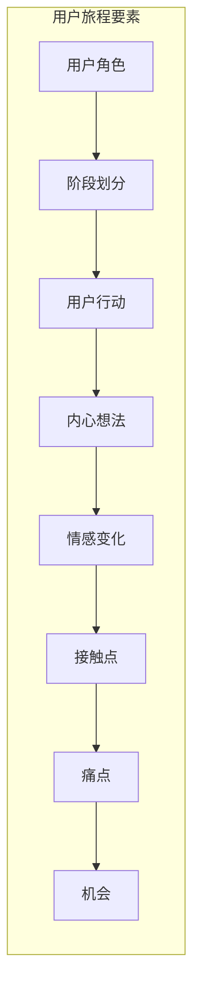

**图表来源**
- [journey.md](file://niopd/commands/PD/journey.md#L50-L100)

#### 情感曲线分析

用户旅程中的情感变化呈现典型的曲线模式：

| 阶段 | 情感状态 | 关键时刻 | 优化重点 |
|------|----------|----------|----------|
| 觉醒 | 好奇/兴趣 | 初次接触 | 吸引注意力 |
| 探索 | 犹豫/怀疑 | 信息收集 | 提供信任证据 |
| 决策 | 犹豫/期待 | 最终选择 | 减少决策障碍 |
| 使用 | 满意/困惑 | 实际体验 | 简化操作流程 |
| 忠诚 | 满意/推荐 | 长期关系 | 增强用户粘性 |

**节来源**
- [journey.md](file://niopd/commands/PD/journey.md#L200-L300)

### 业务流程建模

业务流程建模从组织角度描述工作流程，识别效率提升机会。

#### 流程建模层次

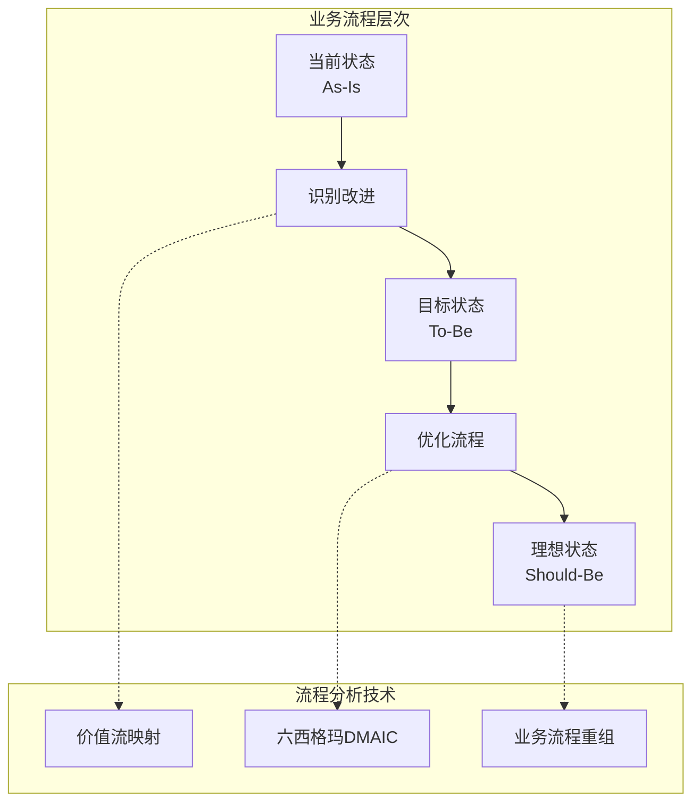

**图表来源**
- [process.md](file://niopd/commands/PD/process.md#L100-L200)

### 线框图设计

线框图是低 fidelity 的界面原型，专注于布局和交互而非视觉设计。

#### 线框图设计原则

| 原则 | 描述 | 实施要点 |
|------|------|----------|
| 结构优先 | 关注布局而非样式 | 使用占位符文本和灰色块 |
| 导航清晰 | 明确的导航路径 | 标准化导航元素 |
| 内容组织 | 合理的信息层次 | 逻辑分组和视觉权重 |
| 响应式设计 | 移动优先思维 | 多设备适配考虑 |
| 交互说明 | 清晰的操作指引 | 注释和标注说明 |

**节来源**
- [wireframe.md](file://niopd/commands/PD/wireframe.md#L50-L150)

## 项目规划与执行

### 路线图规划

路线图是战略执行的可视化工具，展示产品演进的时间线和重点。

#### 路线图类型对比

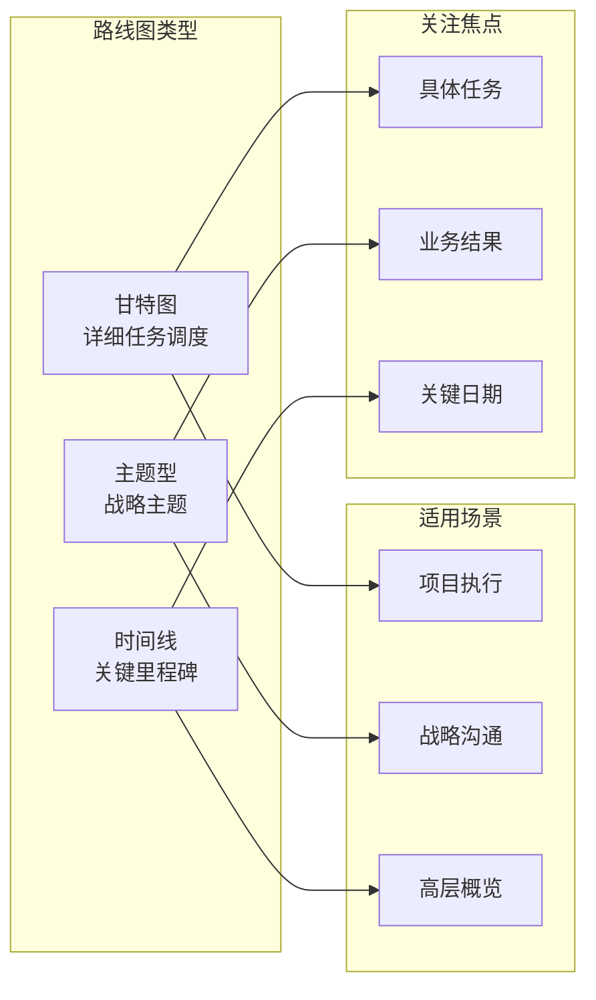

**图表来源**
- [roadmap.md](file://niopd/commands/PD/roadmap.md#L50-L150)

#### 时间规划策略

| 时间范围 | 精度级别 | 内容重点 | 更新频率 |
|----------|----------|----------|----------|
| 现在 (0-3个月) | 具体日期 | 高置信度承诺 | 每周 |
| 下一步 (3-6个月) | 季度 | 中等置信度计划 | 每月 |
| 未来 (6-12个月+) | 年度 | 低置信度愿景 | 每季度 |

**节来源**
- [roadmap.md](file://niopd/commands/PD/roadmap.md#L200-L300)

### 项目执行监控

#### 关键绩效指标

```mermaid
mindmap
root((项目监控))
KPIs["关键绩效指标"]
Time["时间维度"]
Schedule["进度偏差"]
Milestones["里程碑达成"]
Cost["成本维度"]
Budget["预算执行"]
ROI["投资回报"]
Quality["质量维度"]
Defects["缺陷密度"]
Customer["客户满意度"]
Scope["范围维度"]
Features["功能完成度"]
Changes["变更管理"]
```

**节来源**
- [roadmap.md](file://niopd/commands/PD/roadmap.md#L300-L400)

## 工作流程指南

### 完整PRD开发工作流程

NioPD提供系统化的工作流程指导，确保产品开发的连贯性和质量。

#### 阶段划分与转换

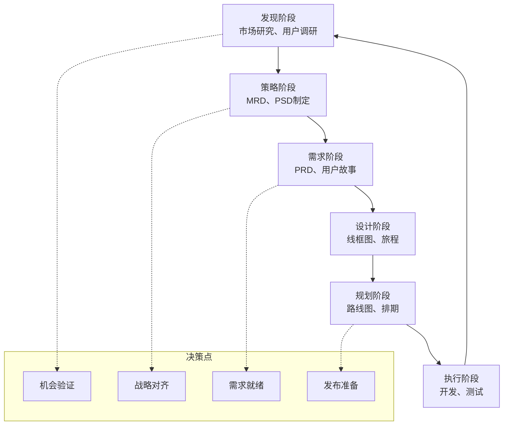

**图表来源**
- [workflow.md](file://niopd/commands/PD/workflow.md#L100-L200)

#### 跨职能协作机制

| 阶段 | 主导角色 | 关键活动 | 输出物 |
|------|----------|----------|--------|
| 发现 | 产品经理 | 市场调研、用户访谈 | MRD初稿 |
| 策略 | 产品团队 | 战略讨论、优先级排序 | PSD文档 |
| 需求 | 产品经理 | PRD编写、故事拆分 | PRD文档 |
| 设计 | 设计师 | 线框图、旅程设计 | 设计原型 |
| 规划 | 项目经理 | 路线图、资源规划 | 执行计划 |

**节来源**
- [workflow.md](file://niopd/commands/PD/workflow.md#L200-L273)

### 文档集成与版本管理

#### 文档关联关系

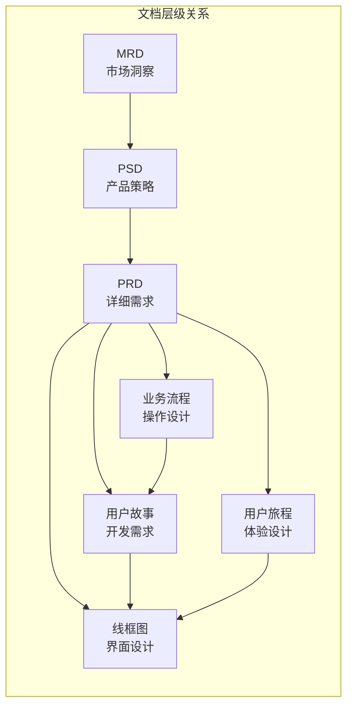

**图表来源**
- [workflow.md](file://niopd/commands/PD/workflow.md#L50-L100)

## 最佳实践与建议

### 从洞察到执行的转化过程

#### 完整转化链路

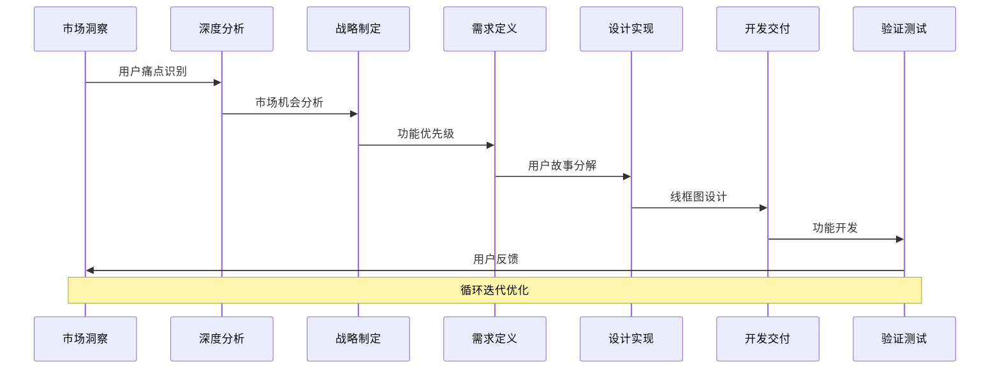

**图表来源**
- [workflow.md](file://niopd/commands/PD/workflow.md#L150-L250)

### 质量保证与风险管理

#### 风险识别与应对

| 风险类别 | 典型风险 | 影响程度 | 应对策略 |
|----------|----------|----------|----------|
| 市场风险 | 需求变化、竞争加剧 | 高 | 持续市场监控 |
| 技术风险 | 技术选型失败、性能瓶颈 | 中 | 技术预研、原型验证 |
| 执行风险 | 资源不足、进度延误 | 中 | 敏捷规划、缓冲时间 |
| 用户风险 | 用户接受度低、使用率差 | 高 | 用户测试、MVP验证 |

### 团队协作与沟通

#### 跨职能团队角色

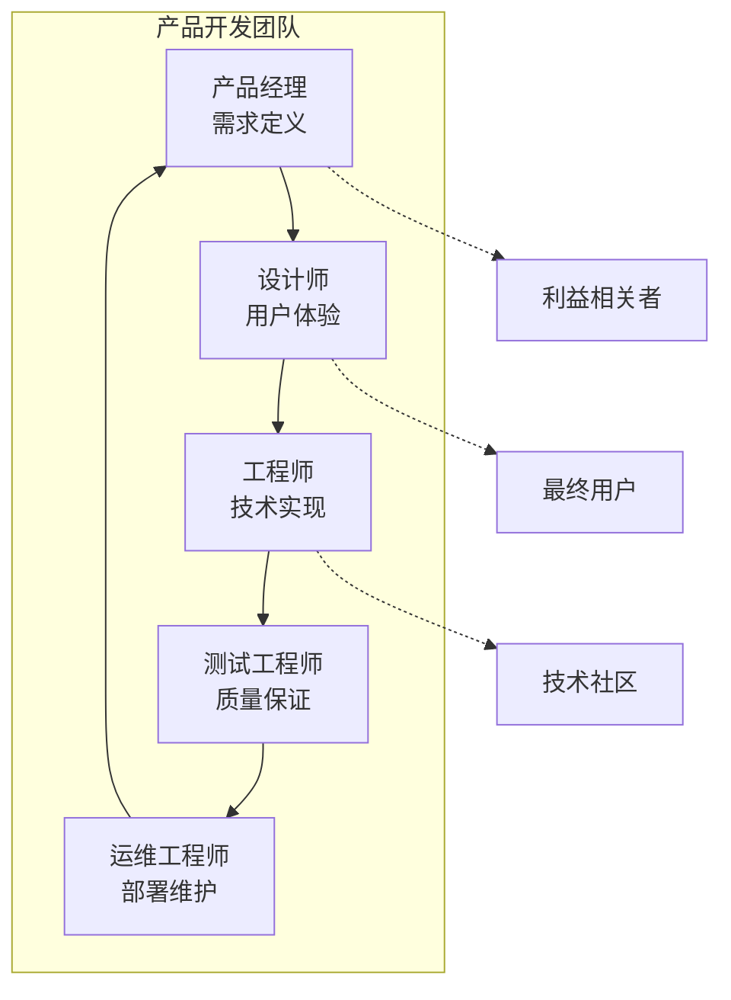

**节来源**
- [workflow.md](file://niopd/commands/PD/workflow.md#L250-L273)

## 总结

NioPD产品开发指令集提供了一个完整、系统化的产品管理框架，从市场洞察到产品交付的全流程覆盖。其核心优势包括：

### 核心价值

1. **系统性方法论**：通过MRD、PSD、PRD三层架构，确保从战略到执行的完整覆盖
2. **数据驱动决策**：实验设计和数据分析支持产品决策的科学性
3. **用户体验中心**：用户旅程和故事映射确保产品真正解决用户问题
4. **跨职能协作**：标准化的文档和流程促进团队间的有效沟通
5. **灵活适应性**：支持不同项目类型和复杂度的需求

### 实践建议

1. **循序渐进**：根据项目特点选择合适的文档层级和详细程度
2. **持续迭代**：将PRD作为"活文档"，随着理解和用户反馈不断更新
3. **用户参与**：在各个阶段邀请目标用户参与验证和反馈
4. **数据验证**：通过实验设计和数据分析验证产品假设
5. **团队对齐**：定期回顾和更新文档，确保团队认知一致

### 未来发展

NioPD指令集将继续演进，适应快速变化的市场环境和技术发展，为产品团队提供更强大的工具和方法论支持，助力创造更好的用户体验和商业价值。