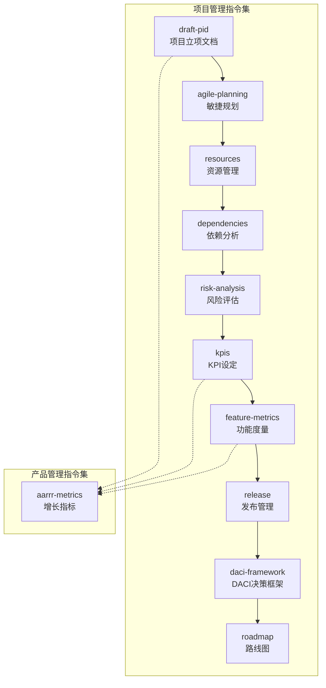
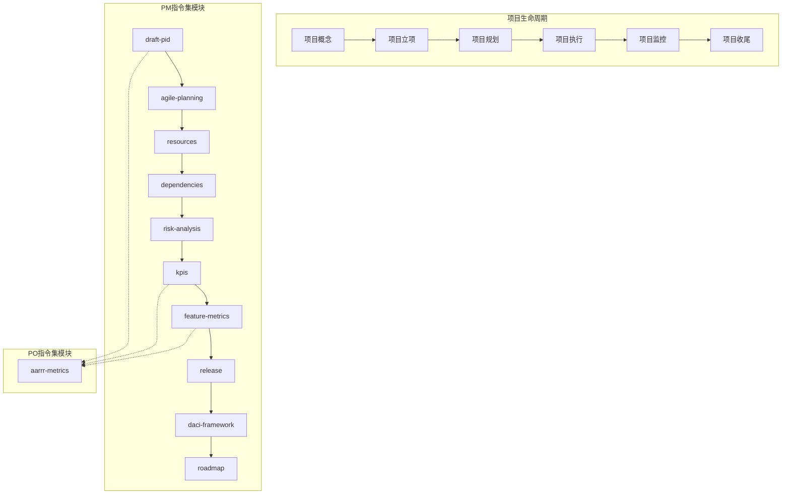
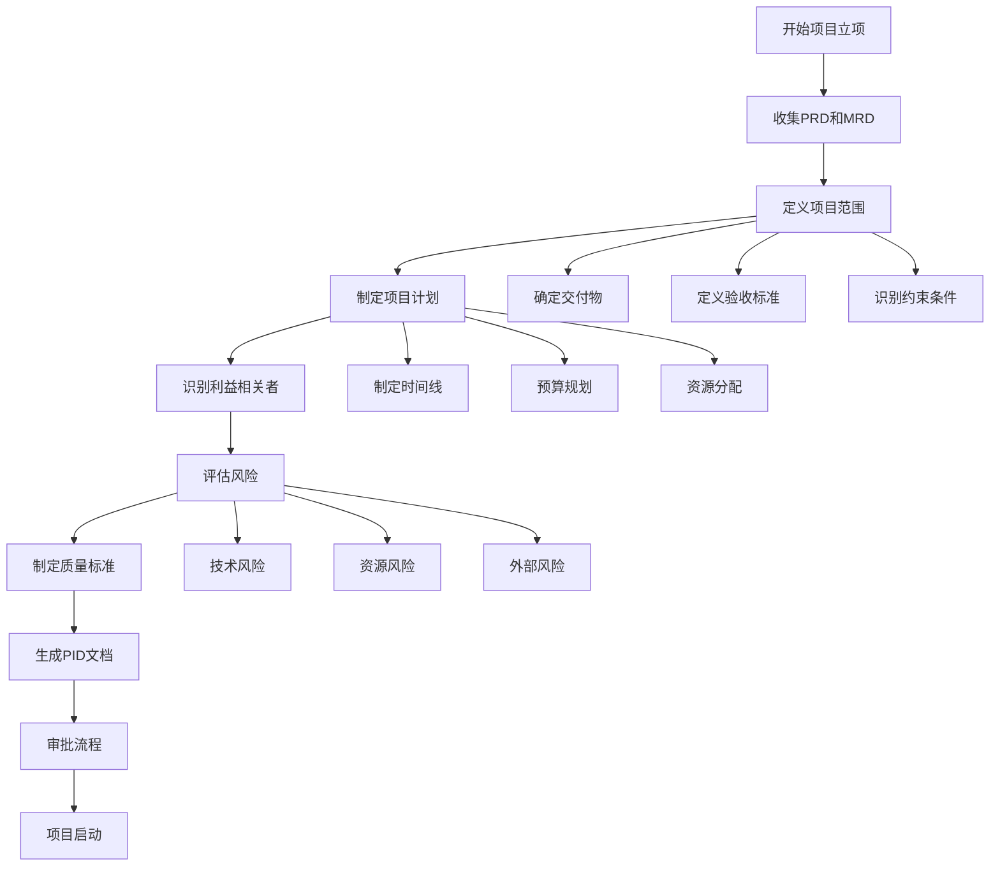
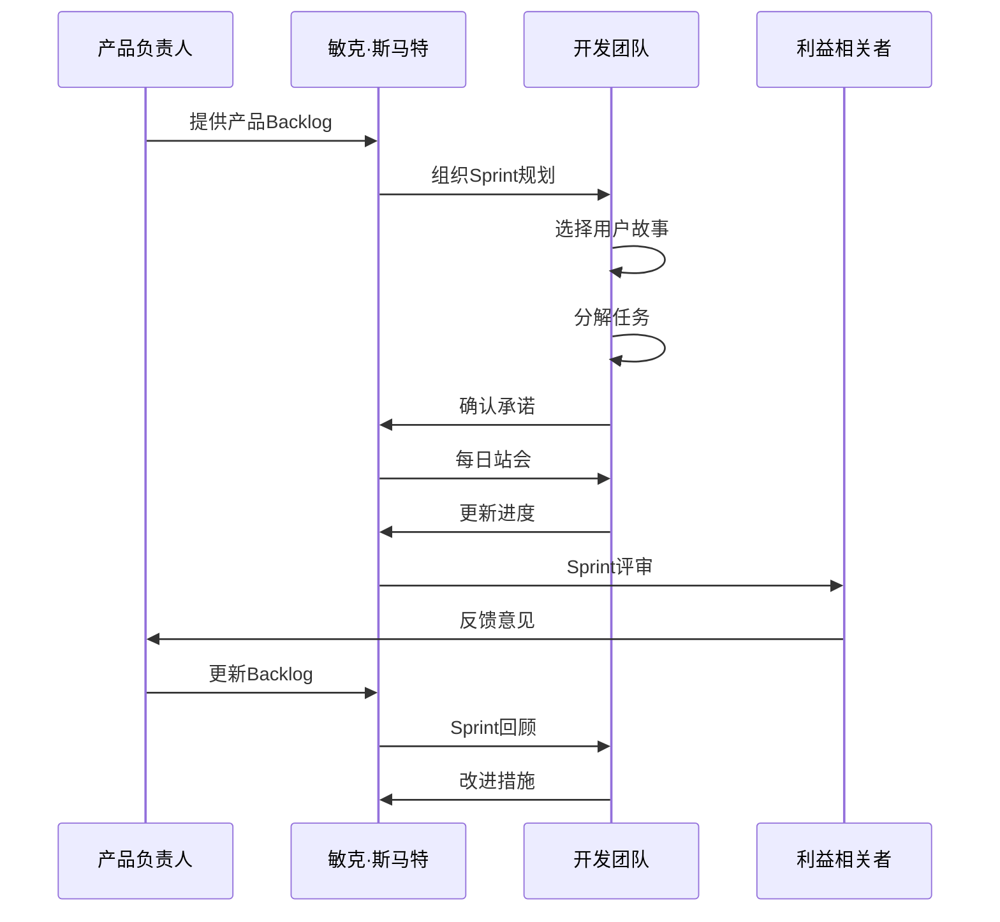
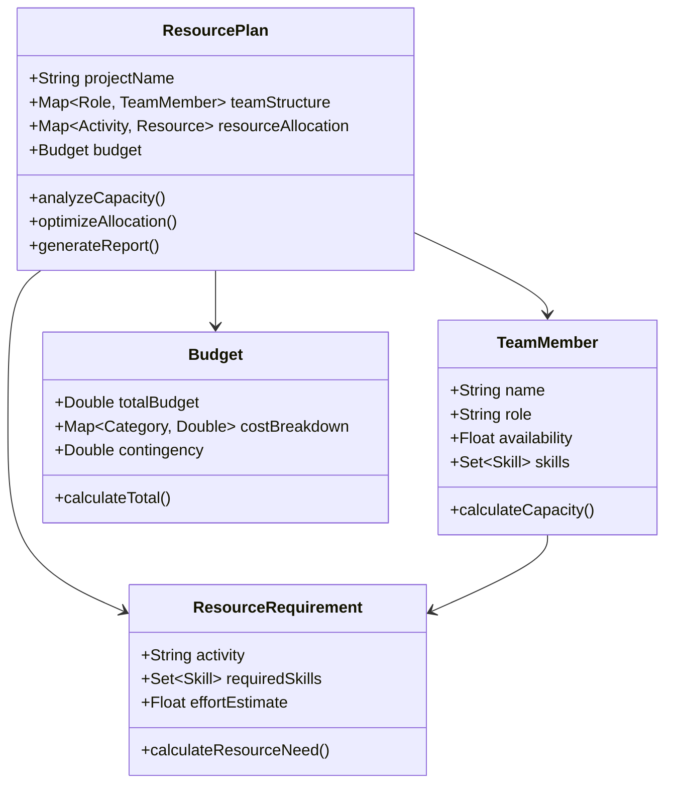
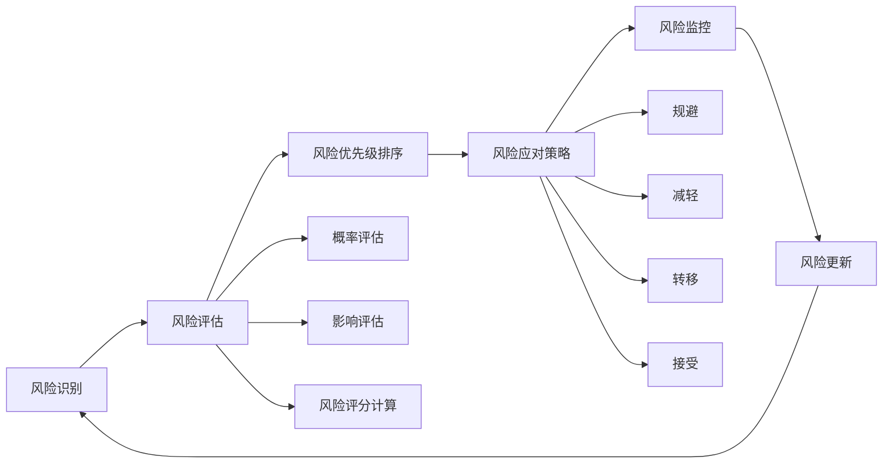
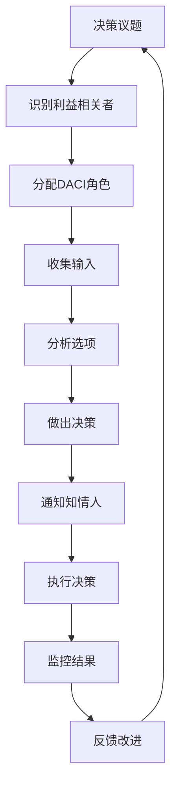
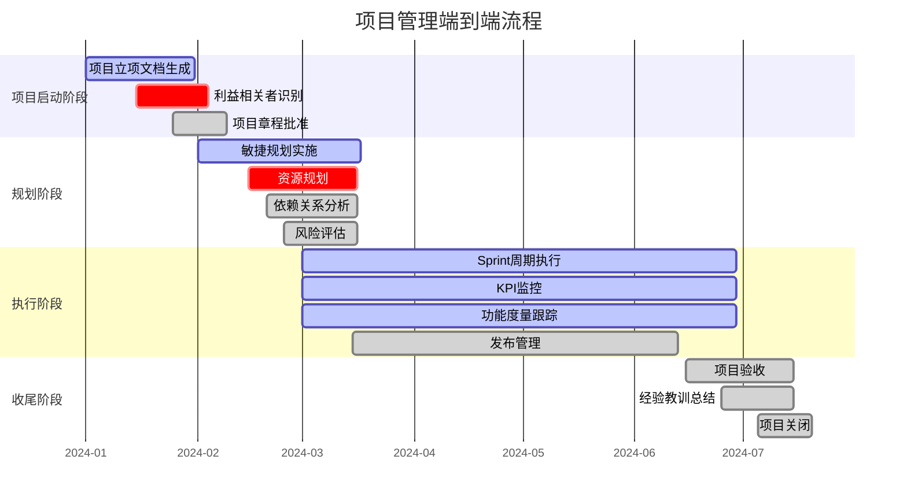
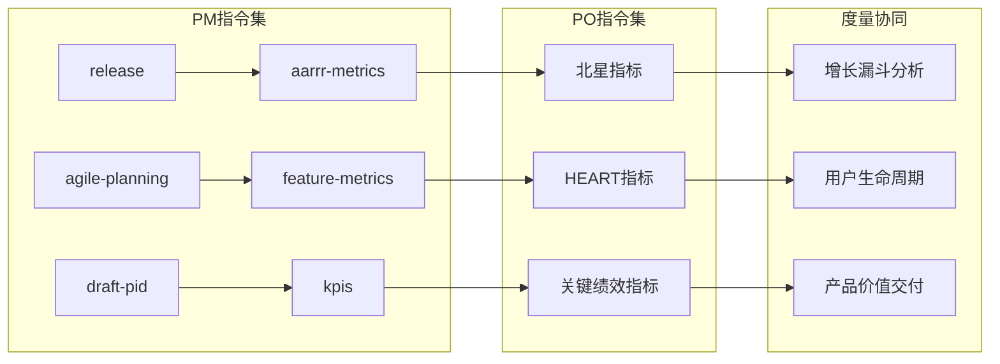
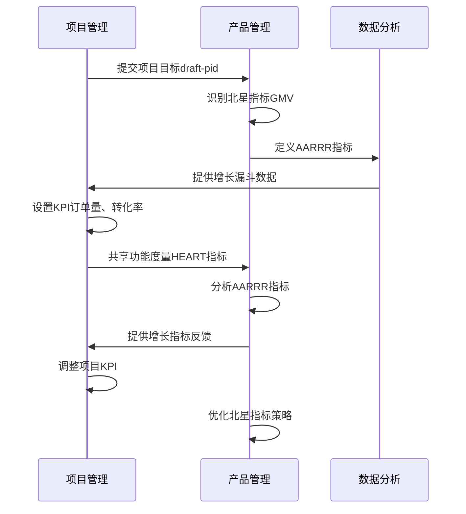

# PM - 项目管理指令

<cite>
**本文档中引用的文件**
- [draft-pid.md](file://niopd/commands/PM/draft-pid.md)
- [agile-planning.md](file://niopd/commands/PM/agile-planning.md)
- [resources.md](file://niopd/commands/PM/resources.md)
- [dependencies.md](file://niopd/commands/PM/dependencies.md)
- [risk-analysis.md](file://niopd/commands/PM/risk-analysis.md)
- [kpis.md](file://niopd/commands/PM/kpis.md)
- [feature-metrics.md](file://niopd/commands/PM/feature-metrics.md)
- [release.md](file://niopd/commands/PM/release.md)
- [daci-framework.md](file://niopd/commands/PM/daci-framework.md)
- [roadmap.md](file://niopd/commands/PM/roadmap.md)
- [aarrr-metrics.md](file://niopd/commands/PO/aarrr-metrics.md)
</cite>

## 目录
1. [简介](#简介)
2. [项目结构概览](#项目结构概览)
3. [核心项目管理指令](#核心项目管理指令)
4. [架构概览](#架构概览)
5. [详细组件分析](#详细组件分析)
6. [端到端项目管控流程](#端到端项目管控流程)
7. [与PO模块的度量衔接](#与po模块的度量衔接)
8. [最佳实践与建议](#最佳实践与建议)
9. [总结](#总结)

## 简介

项目管理（PM）指令集是NioPD系统中专门用于项目治理、规划和执行的核心功能集合。该指令集涵盖了从项目立项到发布的完整生命周期管理，包括项目立项文档（draft-pid）、敏捷规划（agile-planning）、资源管理（resources）、依赖分析（dependencies）、风险评估（risk-analysis）、KPI设定（kpis）、功能度量（feature-metrics）、发布管理（release）和DACI决策框架等关键组件。

这些指令不仅提供了标准化的项目管理方法论，还通过智能化的AI辅助确保项目团队能够高效地完成项目目标，同时实现与产品管理（PO）模块中增长指标的有效衔接。

## 项目结构概览

项目管理指令集在NioPD系统中的组织结构体现了现代项目管理的最佳实践：



**图表来源**
- [draft-pid.md](file://niopd/commands/PM/draft-pid.md#L1-L50)
- [agile-planning.md](file://niopd/commands/PM/agile-planning.md#L1-L50)
- [aarrr-metrics.md](file://niopd/commands/PO/aarrr-metrics.md#L1-L50)

**章节来源**
- [draft-pid.md](file://niopd/commands/PM/draft-pid.md#L1-L100)
- [agile-planning.md](file://niopd/commands/PM/agile-planning.md#L1-L100)

## 核心项目管理指令

### 项目立项文档（draft-pid）

项目立项文档是项目管理生命周期中的关键授权文件，它将产品需求文档（PRD）转化为可执行的项目计划。该指令遵循PRINCE2和PMI的方法论，确保项目在正式执行前获得必要的治理和控制。

**核心特性：**
- **项目授权机制**：作为项目启动的正式授权文件
- **治理框架**：建立明确的项目治理结构和决策流程
- **范围定义**：清晰界定项目边界和交付物
- **风险管理**：识别和评估项目关键风险
- **资源规划**：制定详细的资源分配计划

**与PRD的关系**：
draft-pid指令将PRD中的业务需求和技术要求转化为具体的项目执行计划，包括时间表、预算、资源分配和质量标准。

### 敏捷规划（agile-planning）

敏捷规划指令支持迭代式项目排期和团队协作，采用Scrum框架的核心原则，强调价值驱动和适应性规划。

**核心流程：**
1. **Sprint规划**：确定短期工作重点和目标
2. **Backlog细化**：分解用户故事为可执行任务
3. **容量规划**：评估团队能力和工作负载
4. **进度跟踪**：建立持续的监控和反馈机制

**与传统瀑布模型的区别**：
- 迭代式交付而非一次性完成
- 动态调整而非固定计划
- 团队自组织而非层级指挥
- 持续改进而非阶段审查

### 资源管理（resources）

资源管理指令确保项目团队和预算的最优利用，通过科学的资源分配技术避免过度配置和资源浪费。

**管理策略：**
- **资源平衡**：平滑资源需求峰值
- **容量规划**：评估可用资源和需求匹配
- **成本控制**：优化预算分配和使用效率
- **冲突解决**：处理多项目间的资源竞争

### 依赖分析（dependencies）

依赖分析指令帮助识别和管理项目内外部的相互关系，预防延迟和优化调度。

**依赖类型：**
- **技术依赖**：系统集成和数据流
- **资源依赖**：共享团队成员和设备
- **外部依赖**：供应商和合作伙伴
- **时间依赖**：任务序列和里程碑关系

### 风险评估（risk-analysis）

风险评估指令提供系统性的风险识别、评估和缓解方法，确保项目成功概率最大化。

**评估矩阵：**
| 影响程度 | 低 (1) | 中 (2) | 高 (3) | 极高 (4) |
|----------|--------|--------|--------|----------|
| **极高 (90%)** | 9 | 18 | 27 | 36 |
| **高 (70%)** | 7 | 14 | 21 | 28 |
| **中等 (50%)** | 5 | 10 | 15 | 20 |
| **低 (30%)** | 3 | 6 | 9 | 12 |
| **极低 (10%)** | 1 | 2 | 3 | 4 |

### KPI设定（kpis）

KPI设定指令为项目提供量化的目标和测量标准，确保项目进展可追踪和可评估。

**KPI类型：**
- **领先指标**：预测未来表现的趋势指标
- **滞后指标**：反映历史绩效的结果指标
- **行动导向指标**：驱动具体决策和行动的指标

### 功能度量（feature-metrics）

功能度量指令定义特征性能的成功指标和关键绩效指标，确保功能开发的价值交付。

**HEART框架应用：**
- **H**appiness：用户满意度
- **E**ngagement：使用频率和深度
- **A**doption：新用户激活
- **R**etention：重复使用率
- **T**ask Success：完成率、时间和错误率

### 发布管理（release）

发布管理指令协调产品发布活动，确保可靠、有序的产品部署到生产环境。

**发布策略：**
- **大爆炸发布**：一次性大规模发布
- **分阶段发布**：逐步向子集部署
- **蓝绿部署**：两个相同环境间切换
- **金丝雀发布**：小比例测试组开始
- **功能标志**：代码部署但功能关闭

### DACI决策框架

DACI决策框架明确决策过程中的角色职责，防止决策瘫痪和责任扩散。

**角色定义：**
- **D - Driver（驱动者）**：领导决策过程的人
- **A - Approver（批准者）**：最终决策权的人
- **C - Contributors（贡献者）**：提供输入和专业知识的人
- **I - Informed（知情人）**：需要了解决策结果的人

**章节来源**
- [draft-pid.md](file://niopd/commands/PM/draft-pid.md#L100-L300)
- [agile-planning.md](file://niopd/commands/PM/agile-planning.md#L100-L300)
- [resources.md](file://niopd/commands/PM/resources.md#L100-L200)
- [dependencies.md](file://niopd/commands/PM/dependencies.md#L100-L200)
- [risk-analysis.md](file://niopd/commands/PM/risk-analysis.md#L100-L200)
- [kpis.md](file://niopd/commands/PM/kpis.md#L100-L200)
- [feature-metrics.md](file://niopd/commands/PM/feature-metrics.md#L100-L200)
- [release.md](file://niopd/commands/PM/release.md#L100-L200)
- [daci-framework.md](file://niopd/commands/PM/daci-framework.md#L100-L200)

## 架构概览

项目管理指令集采用模块化架构设计，各组件之间存在清晰的接口和依赖关系：



**图表来源**
- [draft-pid.md](file://niopd/commands/PM/draft-pid.md#L50-L150)
- [roadmap.md](file://niopd/commands/PM/roadmap.md#L50-L150)
- [aarrr-metrics.md](file://niopd/commands/PO/aarrr-metrics.md#L50-L150)

## 详细组件分析

### draft-pid - 项目立项文档生成器

draft-pid指令是项目管理生命周期的起点，它将抽象的产品需求转化为具体的项目计划。该指令遵循严格的项目管理框架，确保项目在正式启动前获得充分的准备和授权。



**图表来源**
- [draft-pid.md](file://niopd/commands/PM/draft-pid.md#L200-L400)

**核心功能模块：**

1. **项目定义模块**：明确业务价值、目标用户和预期成果
2. **范围管理模块**：定义包含和排除的内容，建立质量标准
3. **计划制定模块**：制定详细的时间线、预算和资源计划
4. **治理结构模块**：建立决策流程和沟通机制
5. **风险管理模块**：识别关键风险和缓解策略

### agile-planning - 敏捷规划引擎

agile-planning指令实现了Scrum框架的核心功能，支持团队进行迭代式项目管理和持续改进。



**图表来源**
- [agile-planning.md](file://niopd/commands/PM/agile-planning.md#L200-L400)

**关键特性：**

1. **动态规划**：基于当前情况调整计划
2. **团队自组织**：开发团队自主决定工作方式
3. **持续反馈**：通过评审和回顾不断改进
4. **透明度**：所有信息对团队和利益相关者可见

### resources - 资源规划系统

resources指令提供全面的资源管理功能，确保项目资源的最优配置和使用效率。



**图表来源**
- [resources.md](file://niopd/commands/PM/resources.md#L150-L250)

### dependencies - 依赖关系分析器

dependencies指令识别和映射项目中的各种依赖关系，帮助团队理解相互影响并管理风险。

**依赖类型分类：**

| 依赖类型 | 描述 | 示例 | 风险等级 |
|----------|------|------|----------|
| **Finish-to-Start** | 任务B在任务A完成后开始 | 设计完成后开始开发 | 中等 |
| **Start-to-Start** | 任务B在任务A开始时开始 | 测试和开发同时开始 | 低 |
| **Finish-to-Finish** | 任务B在任务A完成后结束 | 文档完成开发也完成 | 中等 |
| **Start-to-Finish** | 任务B在任务A开始时结束 | 培训完成后停止维护 | 高 |

### risk-analysis - 风险管理系统

risk-analysis指令提供系统化的风险识别、评估和应对策略制定功能。



**图表来源**
- [risk-analysis.md](file://niopd/commands/PM/risk-analysis.md#L150-L250)

### kpis - 关键绩效指标追踪器

kpis指令提供实时的项目绩效监控和分析功能，确保项目按既定目标推进。

**KPI分类体系：**

1. **领先指标**：预测性指标，如用户增长率、开发速度
2. **滞后指标**：结果性指标，如收入、客户满意度
3. **同步指标**：过程指标，如缺陷密度、测试覆盖率

### feature-metrics - 功能性能度量器

feature-metrics指令专注于单个功能或特性的性能度量，确保功能开发的价值交付。

**HEART框架应用：**

```mermaid
mindmap
root((HEART框架))
Happiness
用户满意度调查
净推荐值(NPS)
客户体验评分
Engagement
日活跃用户数(DAU)
使用频率
会话时长
Adoption
新用户注册率
首次使用完成率
功能激活率
Retention
留存率曲线
用户流失率
月活跃用户(MAU)
Task Success
功能完成率
错误率
响应时间
```

**图表来源**
- [feature-metrics.md](file://niopd/commands/PM/feature-metrics.md#L100-L150)

### release - 发布管理协调器

release指令协调产品发布活动，确保软件产品的可靠部署和成功上市。

**发布策略对比：**

| 发布策略 | 优点 | 缺点 | 适用场景 |
|----------|------|------|----------|
| **大爆炸** | 简单直接 | 风险高 | 小型项目 |
| **分阶段** | 风险可控 | 复杂度高 | 中大型项目 |
| **蓝绿** | 快速回滚 | 资源消耗大 | 生产环境 |
| **金丝雀** | 早期发现问题 | 实施复杂 | 关键功能 |
| **功能标志** | 灵活控制 | 技术复杂 | 渐进式功能 |

### daci-framework - 决策框架

daci-framework指令明确决策过程中的角色职责，提高决策效率和执行力。

**决策流程：**



**图表来源**
- [daci-framework.md](file://niopd/commands/PM/daci-framework.md#L200-L300)

**章节来源**
- [draft-pid.md](file://niopd/commands/PM/draft-pid.md#L400-L600)
- [agile-planning.md](file://niopd/commands/PM/agile-planning.md#L400-L515)
- [resources.md](file://niopd/commands/PM/resources.md#L200-L284)
- [dependencies.md](file://niopd/commands/PM/dependencies.md#L200-L239)
- [risk-analysis.md](file://niopd/commands/PM/risk-analysis.md#L200-L237)
- [kpis.md](file://niopd/commands/PM/kpis.md#L200-L293)
- [feature-metrics.md](file://niopd/commands/PM/feature-metrics.md#L100-L166)
- [release.md](file://niopd/commands/PM/release.md#L300-L425)
- [daci-framework.md](file://niopd/commands/PM/daci-framework.md#L250-L302)

## 端到端项目管控流程

基于PM指令集的功能，可以构建完整的端到端项目管控流程：



**图表来源**
- [draft-pid.md](file://niopd/commands/PM/draft-pid.md#L600-L834)
- [agile-planning.md](file://niopd/commands/PM/agile-planning.md#L400-L515)
- [release.md](file://niopd/commands/PM/release.md#L350-L425)

### 流程关键节点

1. **项目启动（第1个月）**
   - 使用`/niopd:PM:draft-pid`生成项目立项文档
   - 确定项目范围、目标和关键利益相关者
   - 建立项目治理结构和决策流程

2. **规划阶段（第2-3个月）**
   - 应用`/niopd:PM:agile-planning`制定详细计划
   - 使用`/niopd:PM:resources`进行资源规划
   - 通过`/niopd:PM:dependencies`识别依赖关系
   - 执行`/niopd:PM:risk-analysis`风险评估

3. **执行阶段（第4-6个月）**
   - 持续使用`/niopd:PM:kpis`监控项目绩效
   - 通过`/niopd:PM:feature-metrics`跟踪功能性能
   - 协调`/niopd:PM:release`确保产品成功发布
   - 应用`/niopd:PM:daci-framework`处理关键决策

4. **收尾阶段（第7个月）**
   - 总结项目经验教训
   - 评估项目成功度
   - 准备项目关闭文档

### 跨阶段协调机制

项目管理指令集通过以下机制确保跨阶段的有效协调：

1. **版本控制**：所有文档采用统一的命名规范和版本控制
2. **状态同步**：各阶段输出自动更新到下一阶段输入
3. **变更管理**：建立标准化的变更请求和审批流程
4. **知识传承**：通过文档和报告确保经验积累

**章节来源**
- [draft-pid.md](file://niopd/commands/PM/draft-pid.md#L700-L834)
- [agile-planning.md](file://niopd/commands/PM/agile-planning.md#L450-L515)
- [release.md](file://niopd/commands/PM/release.md#L380-L425)

## 与PO模块的度量衔接

项目管理指令集与产品管理（PO）模块通过多个关键接口实现度量的无缝衔接：



**图表来源**
- [kpis.md](file://niopd/commands/PM/kpis.md#L100-L200)
- [feature-metrics.md](file://niopd/commands/PM/feature-metrics.md#L100-L150)
- [aarrr-metrics.md](file://niopd/commands/PO/aarrr-metrics.md#L100-L200)

### 度量衔接机制

#### 1. 北星指标（North Star Metric）对接

通过`/niopd:PM:draft-pid`生成的项目目标与`/niopd:PO:north-star`的北星指标建立直接关联：

**衔接流程：**
1. PM指令定义项目成功标准和关键交付物
2. PO指令识别对应的增长指标和用户价值指标
3. 共同确定北星指标，确保项目目标与业务目标一致

#### 2. HEART框架与AARRR框架整合

`/niopd:PM:feature-metrics`中的HEART指标与`/niopd:PO:aarrr-metrics`中的AARRR指标形成互补：

**指标映射关系：**

| PM指令指标类别 | HEART指标 | AARRR指标 | 衔接方式 |
|----------------|-----------|-----------|----------|
| **用户满意度** | Happiness | NPS | 通过用户反馈数据 |
| **使用频率** | Engagement | DAU/MAU | 通过行为数据分析 |
| **新用户激活** | Adoption | Activation | 通过转化漏斗分析 |
| **留存率** | Retention | Retention | 通过留存曲线对比 |
| **任务成功率** | Task Success | Revenue | 通过功能使用效果 |

#### 3. KPI与增长指标的双向验证

`/niopd:PM:kpis`提供的项目KPI与`/niopd:PO:aarrr-metrics`分析的增长指标形成交叉验证：

**验证机制：**
1. **一致性检查**：比较项目KPI与增长指标是否一致
2. **趋势对比**：分析两者趋势的一致性和差异
3. **根因分析**：当指标不一致时进行深入分析
4. **调整建议**：基于验证结果提出优化建议

#### 4. 功能度量与用户生命周期的结合

`/niopd:PM:feature-metrics`专注于单个功能的性能度量，与`/niopd:PO:aarrr-metrics`关注的用户全生命周期形成互补：

**结合应用场景：**
- **功能上线前**：通过功能度量预估对增长指标的影响
- **功能上线后**：通过增长指标验证功能的实际效果
- **功能优化**：基于增长指标反馈优化功能设计

### 实际应用示例

假设一个电商项目的端到端度量衔接：



**图表来源**
- [kpis.md](file://niopd/commands/PM/kpis.md#L200-L293)
- [aarrr-metrics.md](file://niopd/commands/PO/aarrr-metrics.md#L400-L590)

**章节来源**
- [kpis.md](file://niopd/commands/PM/kpis.md#L250-L293)
- [feature-metrics.md](file://niopd/commands/PM/feature-metrics.md#L150-L166)
- [aarrr-metrics.md](file://niopd/commands/PO/aarrr-metrics.md#L500-L590)

## 最佳实践与建议

### 项目管理最佳实践

#### 1. PM指令集的组合使用

**推荐的指令使用顺序：**
1. **启动阶段**：`/niopd:PM:draft-pid` → `/niopd:PM:daci-framework`
2. **规划阶段**：`/niopd:PM:agile-planning` → `/niopd:PM:resources` → `/niopd:PM:dependencies`
3. **执行阶段**：`/niopd:PM:kpis` → `/niopd:PM:feature-metrics` → `/niopd:PM:release`
4. **监控阶段**：`/niopd:PM:risk-analysis` → `/niopd:PM:kpis`

#### 2. 敏捷与传统的平衡

**混合方法论应用：**
- 对于可预测的项目阶段使用瀑布方法
- 对于不确定的工作采用敏捷方法
- 在项目治理层面保持PRINCE2的严格性
- 在执行层面采用Scrum的灵活性

#### 3. 资源管理策略

**资源优化技巧：**
- 使用资源平衡技术避免过度配置
- 建立资源池管理机制
- 实施资源预留策略
- 定期进行资源利用率分析

#### 4. 风险管理成熟度

**分层次风险管理：**
- **战略风险**：高层决策层面的风险
- **项目风险**：项目执行层面的风险
- **运营风险**：日常操作层面的风险

### 与PO模块协同的最佳实践

#### 1. 度量体系的统一

**建立共同的语言：**
- 确保PM和PO使用的指标名称一致
- 建立统一的数据收集标准
- 制定共同的度量基准
- 实现跨模块的数据共享

#### 2. 决策流程的协调

**建立联合决策机制：**
- 使用DACI框架明确决策角色
- 建立定期的PM-PO对齐会议
- 制定共同的决策标准
- 实现决策结果的双向反馈

#### 3. 目标对齐机制

**确保目标一致性：**
- PM指令定义的具体目标与PO指令识别的业务目标对齐
- 项目KPI与产品增长指标保持一致
- 功能度量与用户价值指标相互验证
- 发布目标与市场推广计划协调

### 工具和流程建议

#### 1. 文档管理

**标准化文档格式：**
- 使用统一的文件命名规范
- 建立版本控制和变更追踪
- 实现自动化文档生成
- 建立文档归档和检索机制

#### 2. 自动化支持

**提升效率的工具：**
- 自动化KPI收集和报告
- 智能依赖关系识别
- 风险预警系统
- 资源使用优化算法

#### 3. 团队协作

**促进跨职能协作：**
- 建立跨职能团队结构
- 实施定期的对齐会议
- 使用共享的工作平台
- 建立知识分享机制

## 总结

项目管理指令集（PM）为NioPD系统提供了全面而专业的项目管理能力，涵盖了从项目立项到发布的完整生命周期。通过draft-pid、agile-planning、resources、dependencies、risk-analysis、kpis、feature-metrics、release和daci-framework等核心指令，项目团队能够：

1. **建立坚实的项目基础**：通过draft-pid确保项目有明确的目标、范围和治理结构
2. **实现高效的敏捷交付**：通过agile-planning支持迭代式开发和持续改进
3. **优化资源配置**：通过resources管理确保人力、财务和物质资源的最优利用
4. **识别和管理依赖关系**：通过dependencies分析预防项目延误
5. **系统化风险管理**：通过risk-analysis降低项目失败概率
6. **建立有效的监控体系**：通过kpis提供实时的项目绩效洞察
7. **确保功能价值交付**：通过feature-metrics验证功能的实际效果
8. **协调成功的发布活动**：通过release管理确保产品顺利上市
9. **明确决策流程**：通过daci-framework提高决策效率

更重要的是，PM指令集与PO模块中的aarrr-metrics等指令形成了有机的度量衔接机制，实现了项目管理与产品增长的深度融合。这种整合不仅提高了项目成功的概率，还确保了项目产出真正为客户创造价值，推动业务持续增长。

随着数字化转型的深入和市场竞争的加剧，项目管理指令集将成为企业提升项目成功率、加速产品上市、优化资源配置的重要工具。通过合理运用这些指令，组织能够更好地应对复杂项目的挑战，在快速变化的市场环境中保持竞争优势。