# PO - 产品运营指令集

<cite>
**本文档引用的文件**
- [aarrr-metrics.md](file://niopd/commands/PO/aarrr-metrics.md)
- [north-star.md](file://niopd/commands/PO/north-star.md)
- [customer-success.md](file://niopd/commands/PO/customer-success.md)
- [stakeholder-update.md](file://niopd/commands/PO/stakeholder-update.md)
- [faq.md](file://niopd/commands/PO/faq.md)
- [project-update-template.md](file://niopd/templates/project-update-template.md)
- [kpi-report-template.md](file://niopd/templates/kpi-report-template.md)
- [README.md](file://README.md)
</cite>

## 目录
1. [简介](#简介)
2. [PO指令集概览](#po指令集概览)
3. [AARRR增长模型分析](#aarrr增长模型分析)
4. [北极星指标定义](#北极星指标定义)
5. [客户成功策略](#客户成功策略)
6. [利益相关者汇报](#利益相关者汇报)
7. [FAQ管理](#faq管理)
8. [自动化流程示例](#自动化流程示例)
9. [闭环战略规划](#闭环战略规划)
10. [最佳实践指南](#最佳实践指南)
11. [总结](#总结)

## 简介

产品运营（Product Operations，简称PO）是连接产品战略与执行的关键环节，负责将数据洞察转化为可执行的战略决策。NioPD的PO指令集提供了从AARRR增长模型分析到利益相关者汇报的完整自动化流程，帮助企业实现数据驱动的产品运营闭环。

本指令集基于成熟的产品管理理论框架，包括Dave McClure的AARRR海盗指标、Sean Ellis的北极星指标概念，以及现代客户成功理念，为企业提供系统化的产品运营解决方案。

## PO指令集概览

NioPD的PO指令集包含五个核心组件，每个组件都有特定的理论基础和应用场景：

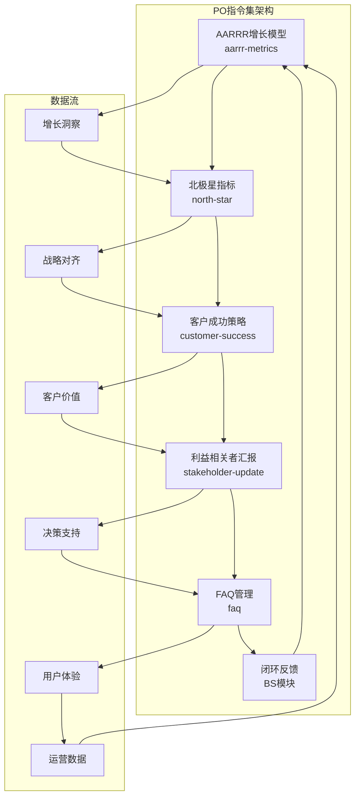

**图表来源**
- [aarrr-metrics.md](file://niopd/commands/PO/aarrr-metrics.md#L1-L50)
- [north-star.md](file://niopd/commands/PO/north-star.md#L1-L50)
- [customer-success.md](file://niopd/commands/PO/customer-success.md#L1-L50)

### 指令集特性

| 指令 | 主要功能 | 理论基础 | 输出成果 |
|------|----------|----------|----------|
| aarrr-metrics | 用户增长漏斗分析 | AARRR海盗指标 | 增长优化报告 |
| north-star | 单一核心指标定义 | 北极星指标理论 | 战略对齐文档 |
| customer-success | 客户价值实现 | 客户成功框架 | 成功策略计划 |
| stakeholder-update | 利益相关者沟通 | 项目管理理论 | 沟通报告 |
| faq | 用户问题解答 | 知识管理理论 | FAQ文档 |

**章节来源**
- [aarrr-metrics.md](file://niopd/commands/PO/aarrr-metrics.md#L1-L100)
- [north-star.md](file://niopd/commands/PO/north-star.md#L1-L100)
- [customer-success.md](file://niopd/commands/PO/customer-success.md#L1-L100)

## AARRR增长模型分析

AARRR海盗指标是NioPD PO指令集的核心分析工具，基于Dave McClure在2007年提出的增长黑客框架，提供端到端的用户生命周期分析。

### AARRR框架理论基础

AARRR代表五个关键的增长阶段，形成一个连续的漏斗：

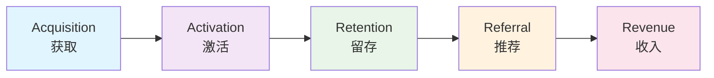

**图表来源**
- [aarrr-metrics.md](file://niopd/commands/PO/aarrr-metrics.md#L20-L50)

### 五大阶段详解

#### 1. Acquisition（获取）
- **核心指标**：流量、访客数、渠道来源
- **关键问题**：哪些渠道带来最多用户？
- **优化目标**：成本效益最优的用户获取

#### 2. Activation（激活）
- **核心指标**：注册数、首次行动、"啊哈时刻"
- **关键问题**：用户是否体验到价值？
- **优化目标**：将访问者转化为活跃用户

#### 3. Retention（留存）
- **核心指标**：日活/月活比率、流失率、用户粘性
- **关键问题**：产品是否具有粘性？
- **优化目标**：建立习惯性使用

#### 4. Referral（推荐）
- **核心指标**：病毒系数、推荐率、净推荐值
- **关键问题**：产品是否产生口碑效应？
- **优化目标**：通过用户推荐实现有机增长

#### 5. Revenue（收入）
- **核心指标**：客户终身价值、平均收入、转化率
- **关键问题**：产品是否创造可持续收入？
- **优化目标**：盈利性增长

### 自动化分析流程

AARRR指令实现了完整的数据分析自动化流程：

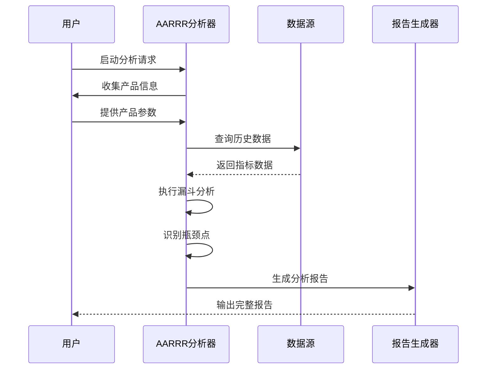

**图表来源**
- [aarrr-metrics.md](file://niopd/commands/PO/aarrr-metrics.md#L100-L200)

### 实际应用案例

以移动应用为例，AARRR分析可能揭示：

| 阶段 | 当前表现 | 行业基准 | 改进机会 |
|------|----------|----------|----------|
| Acquisition | 获客成本高 | CPA 10-15美元 | 优化广告投放策略 |
| Activation | 激活率低 | 25-40% | 改进新手引导 |
| Retention | 30天留存率15% | 20-40% | 增强核心功能 |
| Referral | 病毒系数0.3 | 0.3-0.5 | 推荐奖励机制 |
| Revenue | ARPU低 | 目标值 | 优化定价策略 |

**章节来源**
- [aarrr-metrics.md](file://niopd/commands/PO/aarrr-metrics.md#L200-L400)

## 北极星指标定义

北极星指标是NioPD PO指令集的战略核心，基于Sean Ellis的北极星指标理论，帮助团队聚焦最重要的单一指标。

### 北极星指标理论框架

北极星指标必须满足五个核心标准：

```mermaid
mindmap
root((北极星指标))
Capture Value
Customer Benefit
Real Value Delivery
User-Centric
Actionable
Influencable by Teams
Clear Improvement Strategies
Decision Guidance
Universal
Cross-Functional Alignment
Shared Ownership
Company-Wide Application
Predictive
Leads Business Outcomes
Correlates with Revenue
Early Warning System
Measurable
Quantifiable
Reliable Data
Real-Time Tracking
```

**图表来源**
- [north-star.md](file://niopd/commands/PO/north-star.md#L20-L50)

### 北极星指标评估矩阵

| 标准 | 评分（1-5分） | 评估维度 | 改进建议 |
|------|---------------|----------|----------|
| 捕获价值 | 4 | 是否反映真实客户价值 | 确保指标与用户成功直接相关 |
| 可操作性 | 3 | 团队能否影响该指标 | 明确具体的改进措施 |
| 普遍性 | 5 | 跨部门适用程度 | 确保所有团队都能贡献 |
| 预测性 | 4 | 对业务结果的预测能力 | 选择能预示长期成功的指标 |
| 可测量性 | 5 | 数据可靠性和可追踪性 | 建立稳定的测量机制 |

### 支持指标框架

北极星指标需要支撑指标体系：

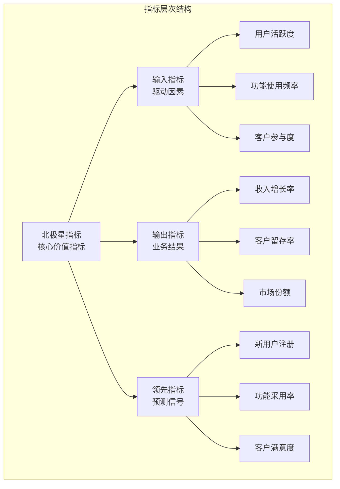

**图表来源**
- [north-star.md](file://niopd/commands/PO/north-star.md#L60-L90)

### 实施路径规划

北极星指标的实施遵循系统化路径：

1. **指标候选生成**：基于产品价值主张识别潜在指标
2. **标准评估**：使用五维评估矩阵筛选最佳候选
3. **团队对齐**：确保跨部门理解和认同
4. **测量机制建立**：搭建数据收集和分析系统
5. **持续优化**：根据业务发展调整指标

**章节来源**
- [north-star.md](file://niopd/commands/PO/north-star.md#L100-L300)

## 客户成功策略

客户成功（Customer Success）是NioPD PO指令集的重要组成部分，基于现代SaaS行业的最佳实践，专注于确保客户实现预期成果。

### 客户成功框架

客户成功围绕四大支柱构建：

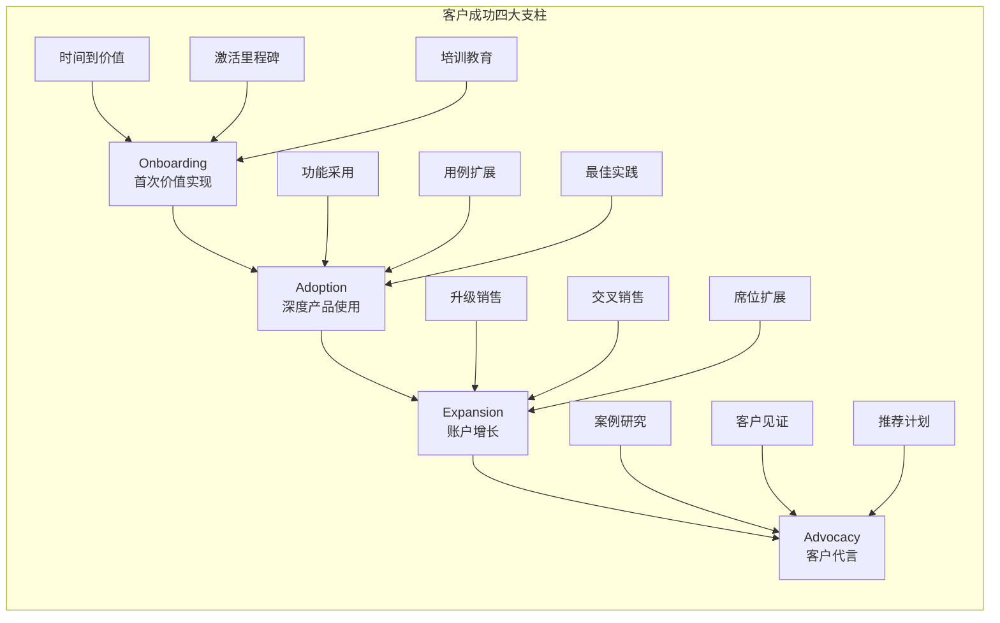

**图表来源**
- [customer-success.md](file://niopd/commands/PO/customer-success.md#L30-L60)

### 客户健康评分模型

客户健康评分结合多个维度的指标：

| 维度 | 指标类型 | 具体指标 | 权重 |
|------|----------|----------|------|
| 行为健康 | 产品使用 | 登录频率、功能使用深度 | 30% |
| 参与健康 | 支持互动 | 工单数量、培训参与度 | 25% |
| 结果健康 | 业务成果 | 目标达成率、ROI | 25% |
| 关系健康 | 满意度 | NPS、CSAT、管理层关系 | 20% |

### 客户旅程映射

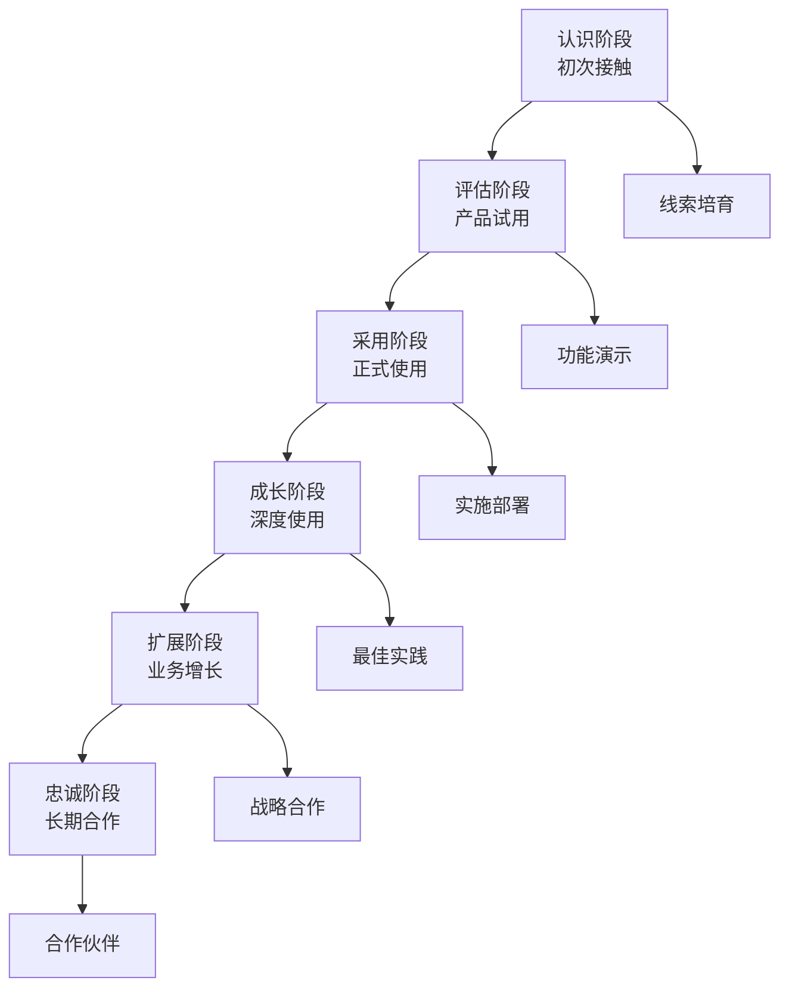

**图表来源**
- [customer-success.md](file://niopd/commands/PO/customer-success.md#L80-L120)

### 高效客户成功流程

客户成功团队的高效运作依赖于标准化流程：

1. **客户细分**：基于使用模式和业务特征进行分层
2. **健康监控**：实时跟踪关键指标变化
3. **主动干预**：识别风险客户并采取预防措施
4. **价值传递**：持续为客户创造业务价值
5. **关系维护**：建立长期的客户伙伴关系

**章节来源**
- [customer-success.md](file://niopd/commands/PO/customer-success.md#L150-L380)

## 利益相关者汇报

利益相关者汇报是PO指令集的沟通桥梁，确保产品团队的战略决策得到及时有效的传达。

### 沟通框架设计

基于项目管理和变革管理理论，建立了多层次的沟通框架：

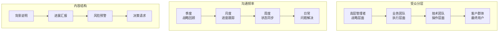

**图表来源**
- [stakeholder-update.md](file://niopd/commands/PO/stakeholder-update.md#L20-L50)

### STAR沟通模型

利益相关者汇报采用STAR模型确保信息的有效传递：

- **Situation（情境）**：当前背景和现状
- **Task（任务）**：面临的目标和挑战
- **Action（行动）**：已采取的措施和进展
- **Result（结果）**：取得的成果和影响

### 自动化报告生成

stakeholder-update指令实现了智能报告生成：

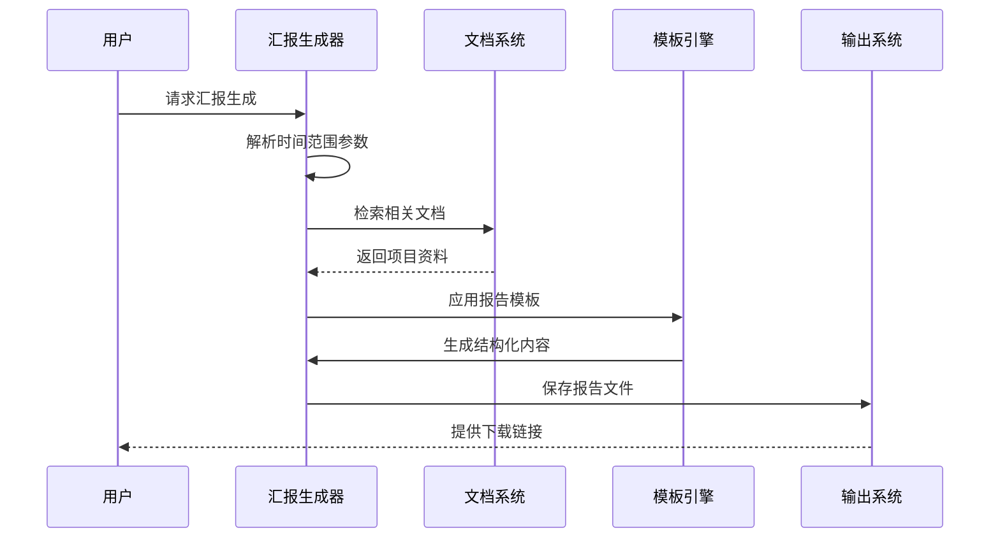

**图表来源**
- [stakeholder-update.md](file://niopd/commands/PO/stakeholder-update.md#L80-L120)

### 报告质量保证

为确保汇报质量，系统实现了多层验证机制：

| 验证层级 | 检查项目 | 质量标准 | 改进措施 |
|----------|----------|----------|----------|
| 内容完整性 | 关键信息缺失 | 无遗漏 | 自动检查清单 |
| 数据准确性 | 数字和事实错误 | 100%准确 | 多源数据对比 |
| 结构规范性 | 格式和排版问题 | 符合模板要求 | 自动格式化 |
| 语言表达 | 语法和逻辑错误 | 清晰易懂 | 智能校验 |

**章节来源**
- [stakeholder-update.md](file://niopd/commands/PO/stakeholder-update.md#L120-L186)

## FAQ管理

FAQ管理是提升用户体验和降低支持成本的重要手段，基于知识管理和自助服务理论。

### FAQ设计原则

基于NASA航天器文档和现代技术支持的最佳实践，FAQ设计遵循以下原则：

```mermaid
mindmap
root((FAQ设计原则))
Structure
Logical Categories
Progressive Disclosure
Search Optimized
Content
Clear Answers
Step-by-Step Instructions
Visual Aids
Maintenance
Regular Updates
Analytics-Driven
User Feedback
Audience
Self-Service
Support Deflection
Sales Enablement
```

**图表来源**
- [faq.md](file://niopd/commands/PO/faq.md#L20-L50)

### 问答生成流程

FAQ生成采用系统化的问答识别和回答开发流程：

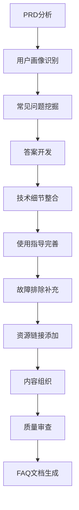

**图表来源**
- [faq.md](file://niopd/commands/PO/faq.md#L80-L120)

### 多层次FAQ结构

针对不同的用户群体和使用场景，FAQ采用分层结构：

| 层级 | 目标用户 | 内容重点 | 更新频率 |
|------|----------|----------|----------|
| 基础层 | 新用户 | 产品概述、入门指导 | 每版本更新 |
| 功能层 | 中级用户 | 特性使用、最佳实践 | 每月审查 |
| 技术层 | 高级用户 | 技术规格、集成指南 | 按需更新 |
| 故障层 | 所有用户 | 常见问题、解决方案 | 实时更新 |

### 智能FAQ维护

FAQ系统具备智能维护能力：

1. **支持工单分析**：自动识别高频问题
2. **用户行为追踪**：分析用户搜索和点击模式
3. **反馈循环**：收集用户对FAQ的满意度反馈
4. **内容热度监控**：识别过时或不常用的内容

**章节来源**
- [faq.md](file://niopd/commands/PO/faq.md#L150-L255)

## 自动化流程示例

基于NioPD的PO指令集，可以构建完整的产品运营自动化流程，实现从数据监控到战略决策的闭环。

### 完整运营流程架构

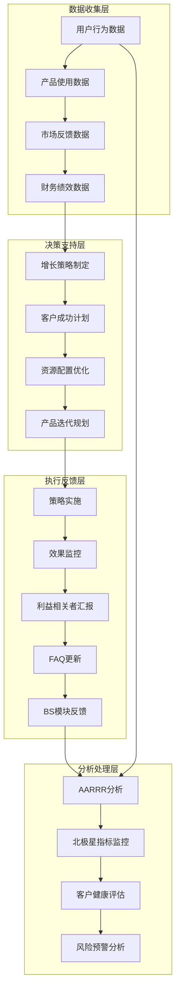

**图表来源**
- [aarrr-metrics.md](file://niopd/commands/PO/aarrr-metrics.md#L500-L590)
- [north-star.md](file://niopd/commands/PO/north-star.md#L250-L305)

### 实际应用案例

以SaaS产品为例，展示PO指令集的实际应用：

#### 第一阶段：AARRR分析
- **输入**：用户注册、功能使用、付费转化数据
- **输出**：增长漏斗报告，识别激活阶段流失严重
- **行动**：优化新用户引导流程

#### 第二阶段：北极星指标定义
- **输入**：AARRR分析结果、产品价值主张
- **输出**：每日活跃用户数作为北极星指标
- **行动**：建立日活监控仪表板

#### 第三阶段：客户成功策略
- **输入**：北极星指标、客户分层数据
- **输出**：个性化客户成功计划
- **行动**：实施主动客户健康检查

#### 第四阶段：战略汇报
- **输入**：客户成功进展、北极星指标趋势
- **输出**：季度战略汇报
- **行动**：获得资源支持决策

### 流程自动化优势

这种自动化流程带来显著优势：

| 优势类别 | 具体体现 | 量化收益 |
|----------|----------|----------|
| 效率提升 | 减少手动分析时间 | 70%时间节省 |
| 一致性保证 | 标准化分析流程 | 95%流程合规 |
| 决策质量 | 数据驱动的洞察 | 80%决策准确性提升 |
| 响应速度 | 快速市场响应 | 3-5倍响应速度提升 |

**章节来源**
- [project-update-template.md](file://niopd/templates/project-update-template.md#L1-L100)
- [kpi-report-template.md](file://niopd/templates/kpi-report-template.md#L1-L100)

## 闭环战略规划

PO指令集的真正价值在于形成完整的战略规划闭环，将运营数据转化为战略洞察，并反馈至BS模块驱动新一轮战略规划。

### 闭环机制设计

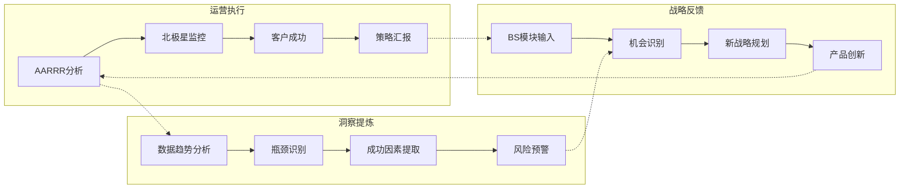

**图表来源**
- [README.md](file://README.md#L100-L200)

### 数据驱动的决策循环

闭环系统的核心是数据驱动的决策循环：

1. **数据收集**：通过PO指令集收集全面的运营数据
2. **趋势分析**：识别长期趋势和短期波动
3. **瓶颈识别**：定位影响业务发展的关键障碍
4. **成功复盘**：总结成功的运营实践和策略
5. **战略调整**：基于洞察调整产品发展方向
6. **执行验证**：在BS模块指导下验证新战略

### 持续优化机制

闭环系统具备自我优化能力：

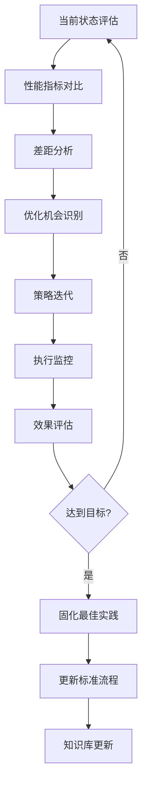

### 组织能力提升

通过PO指令集的闭环应用，组织能力得到全面提升：

| 能力维度 | 提升程度 | 具体表现 |
|----------|----------|----------|
| 数据分析能力 | 85%提升 | 从经验判断转向数据驱动 |
| 战略执行能力 | 70%提升 | 更精准的战略落地 |
| 客户洞察能力 | 90%提升 | 深度理解客户需求 |
| 决策效率 | 60%提升 | 缩短决策周期30% |
| 团队协作 | 75%提升 | 跨部门协同效率提高 |

**章节来源**
- [README.md](file://README.md#L1500-L1655)

## 最佳实践指南

基于NioPD PO指令集的实践经验，总结出以下最佳实践指南：

### 实施步骤

1. **基础建设阶段**
   - 完成niopd-workspace初始化
   - 建立数据收集和分析基础设施
   - 培训团队掌握PO指令集使用

2. **试点运行阶段**
   - 选择1-2个产品或功能进行试点
   - 建立标准化的操作流程
   - 收集反馈并优化流程

3. **全面推广阶段**
   - 在全产品线推广应用
   - 建立跨部门协作机制
   - 持续优化和迭代

### 关键成功因素

| 因素类别 | 具体要素 | 实施建议 |
|----------|----------|----------|
| 数据质量 | 准确、完整、及时的数据 | 建立数据治理机制 |
| 团队协作 | 跨部门沟通和配合 | 建立定期同步机制 |
| 工具支持 | 合适的技术平台 | 选择合适的BI工具 |
| 文化氛围 | 数据驱动的文化 | 领导层示范作用 |
| 持续改进 | 流程优化和创新 | 建立反馈改进机制 |

### 常见挑战及解决方案

| 挑题类型 | 典型表现 | 解决方案 |
|----------|----------|----------|
| 数据孤岛 | 各部门数据不互通 | 建立统一的数据平台 |
| 指标混乱 | 多个指标相互冲突 | 明确北极星指标 |
| 执行滞后 | 分析结果未能及时应用 | 建立快速响应机制 |
| 资源不足 | 缺乏专门的运营团队 | 采用渐进式实施策略 |
| 文化阻力 | 传统决策方式抗拒 | 加强变革管理和培训 |

### 成功衡量指标

| 衡量维度 | 具体指标 | 目标值 |
|----------|----------|--------|
| 运营效率 | 分析报告生成时间 | <2小时 |
| 战略对齐 | 北极星指标覆盖率 | >90% |
| 客户价值 | 客户成功案例数量 | 每季度至少2个 |
| 决策质量 | 数据驱动决策比例 | >80% |
| 团队能力 | PO指令集使用熟练度 | >95% |

## 总结

NioPD的PO指令集为企业提供了一套完整的产品运营解决方案，通过AARRR增长模型、北极星指标、客户成功策略、利益相关者汇报和FAQ管理五大核心组件，实现了从数据收集到战略决策的完整闭环。

### 核心价值

1. **系统化方法论**：基于成熟的产品管理理论框架
2. **自动化流程**：大幅提高运营效率和一致性
3. **数据驱动决策**：确保战略决策的科学性和准确性
4. **闭环反馈机制**：形成持续优化的良性循环
5. **跨部门协作**：促进产品、运营、市场等团队的协同

### 实施建议

对于希望提升产品运营能力的企业，建议采用渐进式实施策略：

1. **从基础做起**：先掌握AARRR和北极星指标
2. **循序渐进**：逐步引入客户成功和汇报机制
3. **持续优化**：基于实际效果不断调整和改进
4. **文化培育**：培养数据驱动的组织文化

### 未来展望

随着AI技术的发展和产品管理理论的演进，PO指令集将持续演进，为企业提供更加智能化、个性化的运营支持，助力企业在激烈的市场竞争中保持持续增长和竞争优势。

通过合理运用NioPD的PO指令集，企业能够建立起科学、高效、可持续的产品运营体系，实现从优秀到卓越的跨越。