# ST - 战略分析指令

<cite>
**本文档引用的文件**
- [swot.md](file://niopd/commands/ST/swot.md)
- [porters-five-forces.md](file://niopd/commands/ST/porters-five-forces.md)
- [pest.md](file://niopd/commands/ST/pest.md)
- [canvas.md](file://niopd/commands/ST/canvas.md)
- [ost.md](file://niopd/commands/ST/ost.md)
- [rice.md](file://niopd/commands/ST/rice.md)
- [moscow.md](file://niopd/commands/ST/moscow.md)
- [balanced-scorecard.md](file://niopd/commands/ST/balanced-scorecard.md)
- [design-thinking.md](file://niopd/commands/ST/design-thinking.md)
- [design-sprint.md](file://niopd/commands/ST/design-sprint.md)
- [portfolio.md](file://niopd/commands/ST/portfolio.md)
- [roadmap.md](file://niopd/commands/PD/roadmap.md)
</cite>

## 目录
1. [简介](#简介)
2. [ST模块概述](#st模块概述)
3. [核心战略分析框架](#核心战略分析框架)
4. [详细框架分析](#详细框架分析)
5. [跨指令协同应用](#跨指令协同应用)
6. [PD模块集成](#pd模块集成)
7. [最佳实践指南](#最佳实践指南)
8. [总结](#总结)

## 简介

ST（Strategic Thinking）模块是NioPD产品开发平台的核心战略分析工具集，提供了11个经过验证的战略分析框架，涵盖从宏观环境分析到微观产品优先级排序的全方位战略思考。这些框架相互补充，形成完整的战略分析生态系统，为产品决策提供科学依据和系统方法。

## ST模块概述

ST模块包含以下11个核心战略分析框架：

```mermaid
mindmap
root((ST战略分析模块))
SWOT分析
内部优势劣势
外部机会威胁
TOWS矩阵扩展
波特五力
新进入者威胁
供应商议价能力
买方议价能力
替代品威胁
竞争竞争强度
PEST分析
政治因素
经济因素
社会因素
技术因素
法律因素
环境因素
商业模式画布
客户细分
价值主张
渠道通路
客户关系
收入来源
关键资源
关键活动
关键合作伙伴
成本结构
OST目标设定
目标连接
解决方案树
实验验证
RICE优先级
触达范围
影响程度
信心水平
工作量评估
MoSCoW优先级
必须有
应该有
可以有
暂不实现
平衡计分卡
财务视角
客户视角
内部流程视角
学习与成长视角
设计思维
共情研究
问题定义
构思创意
原型制作
测试验证
设计冲刺
问题映射
解决方案构思
决策制定
原型构建
用户测试
产品组合分析
BCG矩阵
GE矩阵
Ansoff矩阵
生命周期分析
```

**图表来源**
- [swot.md](file://niopd/commands/ST/swot.md#L1-L50)
- [porters-five-forces.md](file://niopd/commands/ST/porters-five-forces.md#L1-L50)
- [pest.md](file://niopd/commands/ST/pest.md#L1-L50)
- [canvas.md](file://niopd/commands/ST/canvas.md#L1-L50)

## 核心战略分析框架

### SWOT分析框架

SWOT（Strengths, Weaknesses, Opportunities, Threats）分析是最经典的战略分析工具，提供结构化的内外部因素评估框架。

#### 核心原理
- **内部因素控制**：优势（Strengths）和劣势（Weaknesses）
- **外部环境影响**：机会（Opportunities）和威胁（Threats）
- **TOWS矩阵扩展**：SO、WO、ST、WT四种战略组合

#### 适用场景
- 战略规划周期
- 新产品/initiative评估
- 竞争定位分析
- M&A尽职调查
- 业务模型评估

#### 分析维度
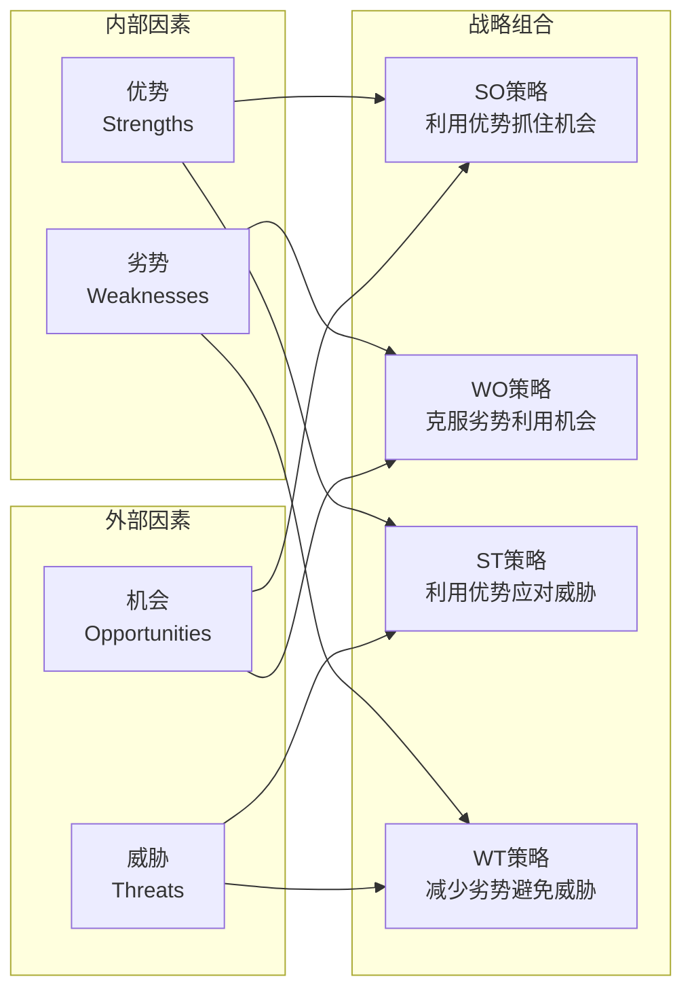

**图表来源**
- [swot.md](file://niopd/commands/ST/swot.md#L20-L40)

**章节来源**
- [swot.md](file://niopd/commands/ST/swot.md#L1-L408)

### 波特五力分析框架

波特五力模型分析行业竞争结构，评估市场吸引力和盈利能力潜力。

#### 五种竞争力量
1. **新进入者威胁**：资本要求、规模经济、品牌忠诚度等
2. **供应商议价能力**：供应商集中度、输入独特性、转换成本等
3. **买方议价能力**：买方集中度、购买量、产品标准化等
4. **替代品威胁**：相对价格性能、转换成本等
5. **现有竞争者竞争**：竞争对手数量、行业增长率等

#### 行业吸引力评估
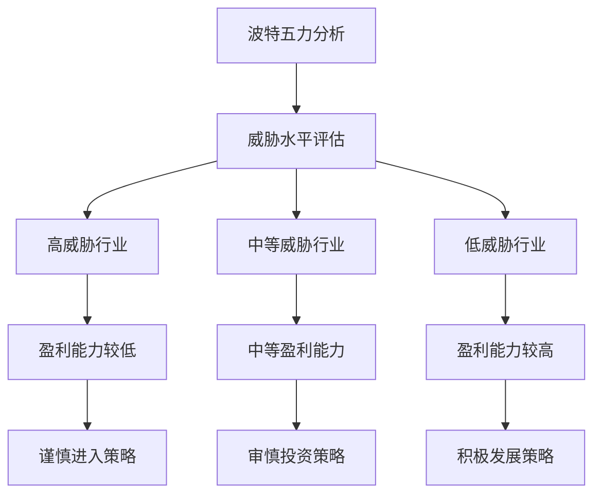

**图表来源**
- [porters-five-forces.md](file://niopd/commands/ST/porters-five-forces.md#L50-L100)

**章节来源**
- [porters-five-forces.md](file://niopd/commands/ST/porters-five-forces.md#L1-L663)

### PEST分析框架

PEST/PESTLE分析提供宏观环境扫描，理解外部宏观环境对业务的影响。

#### 六大分析维度
- **政治因素**：政府稳定性、税收政策、贸易法规
- **经济因素**：经济增长率、通货膨胀、汇率
- **社会因素**：人口统计、文化趋势、生活方式
- **技术因素**：创新速度、研发投入、自动化
- **法律因素**：劳动法、消费者保护、行业法规
- **环境因素**：气候变化、可持续发展、资源稀缺

#### 环境扫描流程
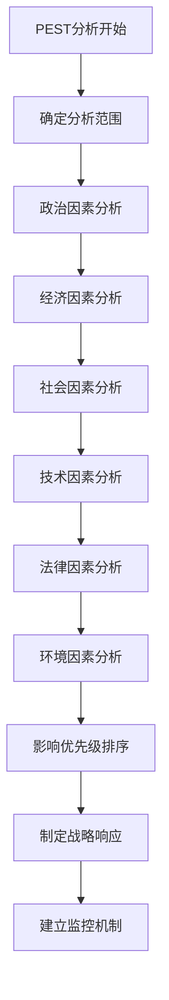

**图表来源**
- [pest.md](file://niopd/commands/ST/pest.md#L100-L200)

**章节来源**
- [pest.md](file://niopd/commands/ST/pest.md#L1-L857)

### 商业模式画布

商业模式画布系统化设计和分析商业模式，涵盖九个关键构建块。

#### 九个构建块
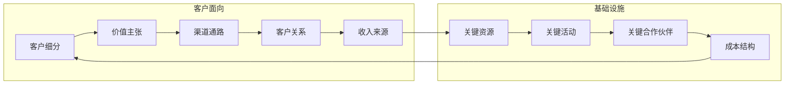

**图表来源**
- [canvas.md](file://niopd/commands/ST/canvas.md#L20-L50)

**章节来源**
- [canvas.md](file://niopd/commands/ST/canvas.md#L1-L263)

## 详细框架分析

### OST（目标-解决方案树）框架

OST框架连接客户问题与创新解决方案，提供结构化的发现工作流程。

#### 框架结构
1. **期望结果**：单一产品或业务目标
2. **机会**：客户需要、痛点、愿望
3. **解决方案**：潜在解决方法
4. **实验**：验证假设的测试

#### 发现流程
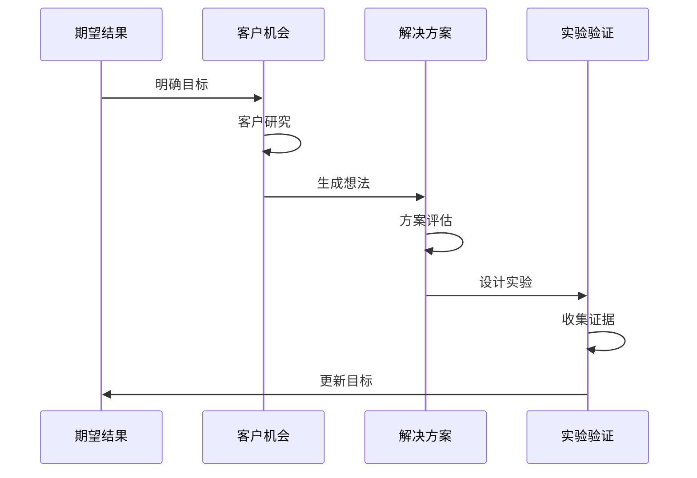

**图表来源**
- [ost.md](file://niopd/commands/ST/ost.md#L30-L60)

**章节来源**
- [ost.md](file://niopd/commands/ST/ost.md#L1-L228)

### RICE优先级评分框架

RICE（Reach, Impact, Confidence, Effort）提供量化优先级决策方法。

#### 评分公式
**RICE分数 = (触达范围 × 影响程度 × 信心水平) ÷ 工作量**

#### 四个维度详解
- **触达范围**：影响的人数或事件数量
- **影响程度**：对每个个体的影响大小（3=巨大，2=高，1=中等，0.5=低，0.25=最小）
- **信心水平**：对估算的信心程度（100%=高，80%=中，50%=低）
- **工作量**：总团队时间投入（人月）

#### 优先级分类
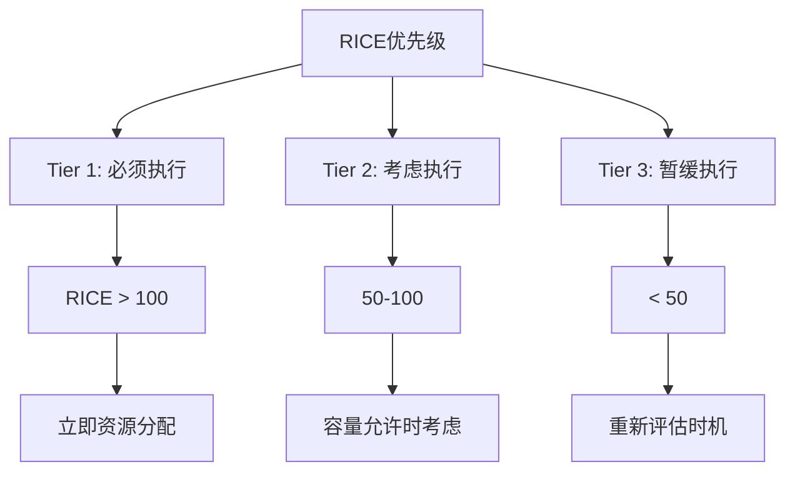

**图表来源**
- [rice.md](file://niopd/commands/ST/rice.md#L100-L150)

**章节来源**
- [rice.md](file://niopd/commands/ST/rice.md#L1-L582)

### MoSCoW优先级分类

MoSCoW方法提供简单直观的需求优先级分类框架。

#### 四类优先级
- **Must have**：关键、不可谈判
- **Should have**：重要、高优先级
- **Could have**：期望、可有可无
- **Won't have**：本次不实现

#### 时间分配规则
- 至少保留20%时间/预算缓冲
- Must haves：约60%努力
- Should haves：约20%努力
- Could haves：约20%努力（如果容量允许）

**章节来源**
- [moscow.md](file://niopd/commands/ST/moscow.md#L1-L530)

### 平衡计分卡框架

平衡计分卡将组织愿景和战略转化为全面的绩效测量框架。

#### 四个视角
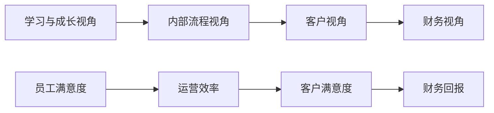

**图表来源**
- [balanced-scorecard.md](file://niopd/commands/ST/balanced-scorecard.md#L50-L100)

**章节来源**
- [balanced-scorecard.md](file://niopd/commands/ST/balanced-scorecard.md#L1-L482)

### 设计思维框架

设计思维采用以人为本的创新方法，通过五个阶段解决问题。

#### 五大阶段
1. **共情**（Empathize）：深入理解用户
2. **定义**（Define）：明确问题陈述
3. **构思**（Ideate）：产生创意方案
4. **原型**（Prototype）：构建可测试原型
5. **测试**（Test）：验证解决方案

#### 迭代流程
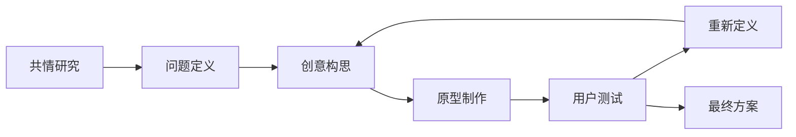

**图表来源**
- [design-thinking.md](file://niopd/commands/ST/design-thinking.md#L100-L150)

**章节来源**
- [design-thinking.md](file://niopd/commands/ST/design-thinking.md#L1-L742)

### 设计冲刺框架

设计冲刺是在5天内快速验证产品创意的压缩式流程。

#### 五天流程
- **周一**：问题映射和目标定义
- **周二**：解决方案构思
- **周三**：决策和故事板
- **周四**：原型构建
- **周五**：用户测试

#### 团队角色分工
- **决策者**：最终决策权
- **主持人**：流程管理
- **设计师**：视觉解决方案
- **工程师**：技术可行性
- **产品经理**：业务需求平衡

**章节来源**
- [design-sprint.md](file://niopd/commands/ST/design-sprint.md#L1-L729)

### 产品组合分析

产品组合分析评估和优化企业产品组合的战略定位。

#### BCG矩阵分类
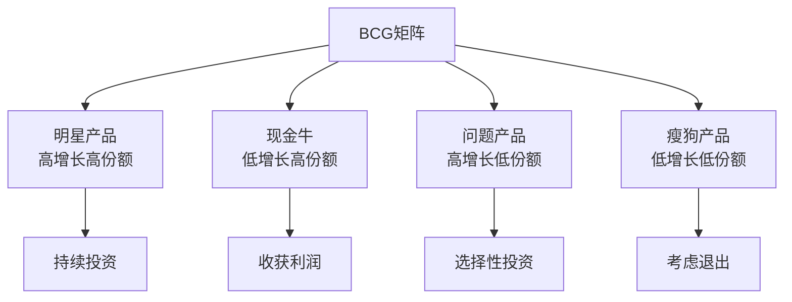

**图表来源**
- [portfolio.md](file://niopd/commands/ST/portfolio.md#L50-L100)

**章节来源**
- [portfolio.md](file://niopd/commands/ST/portfolio.md#L1-L434)

## 跨指令协同应用

### SWOT与波特五力综合竞争分析

结合SWOT和波特五力分析，形成全面的竞争态势评估：

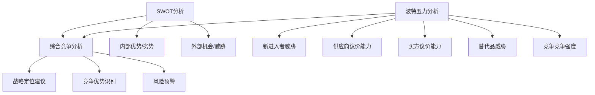

**图表来源**
- [swot.md](file://niopd/commands/ST/swot.md#L100-L200)
- [porters-five-forces.md](file://niopd/commands/ST/porters-five-forces.md#L200-L300)

#### 实施步骤
1. **SWOT分析**：识别内部能力和外部环境因素
2. **波特五力分析**：评估行业竞争结构
3. **交叉验证**：将外部威胁与五力分析结果对比
4. **战略整合**：基于综合分析制定竞争策略

### RICE与MoSCoW协同优先级管理

结合定量RICE评分和定性MoSCoW分类：

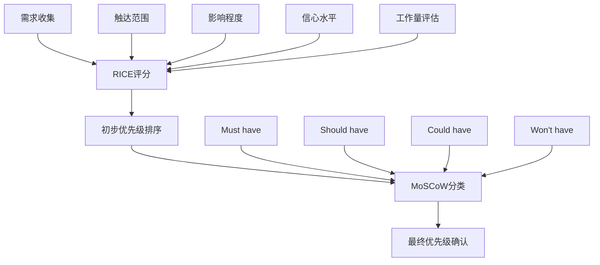

**图表来源**
- [rice.md](file://niopd/commands/ST/rice.md#L200-L300)
- [moscow.md](file://niopd/commands/ST/moscow.md#L100-L200)

#### 协同优势
- **RICE提供量化依据**：客观评估项目价值
- **MoSCoW提供分类框架**：明确实施优先级
- **组合使用**：兼顾数据驱动和实际约束

### 设计思维与平衡计分卡结合

将创新方法与战略执行相结合：

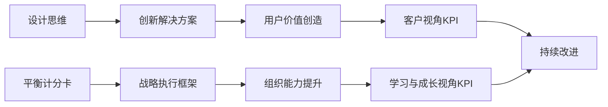

**图表来源**
- [design-thinking.md](file://niopd/commands/ST/design-thinking.md#L300-L400)
- [balanced-scorecard.md](file://niopd/commands/ST/balanced-scorecard.md#L200-L300)

## PD模块集成

ST模块与PD（Product Development）模块深度集成，形成完整的产品开发闭环。

### roadmap模块协同

ST分析结果直接指导roadmap制定：

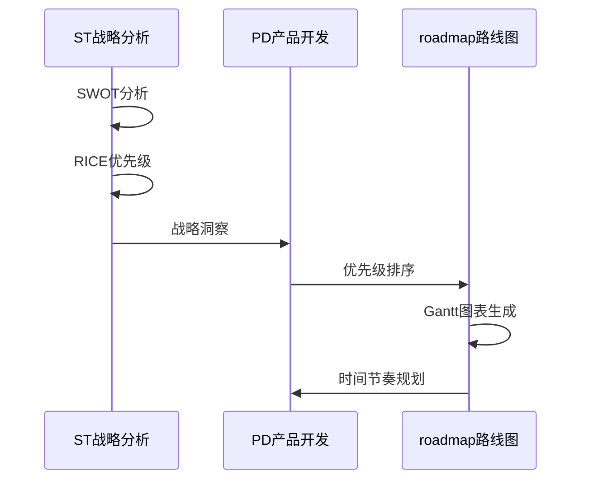

**图表来源**
- [roadmap.md](file://niopd/commands/PD/roadmap.md#L100-L200)

#### 集成流程
1. **ST分析阶段**：完成战略框架分析
2. **优先级排序**：使用RICE或MoSCoW确定项目优先级
3. **roadmap制定**：基于ST洞察制定实施计划
4. **进度跟踪**：使用平衡计分卡监控执行效果

### PRD文档集成

ST分析结果融入PRD（Product Requirements Document）：

| ST分析类型 | PRD集成点 | 具体内容 |
|------------|-----------|----------|
| SWOT分析 | 问题陈述 | 用户痛点和市场需求 |
| PEST分析 | 市场环境 | 宏观环境影响因素 |
| 波特五力 | 竞争分析 | 行业竞争格局 |
| 商业模式画布 | 价值主张 | 产品定位和盈利模式 |
| OST分析 | 用户需求 | 客户问题和解决方案 |
| 设计思维 | 创新方向 | 用户体验改进建议 |

**章节来源**
- [roadmap.md](file://niopd/commands/PD/roadmap.md#L1-L403)

## 最佳实践指南

### 框架选择指南

根据不同场景选择合适的分析框架：

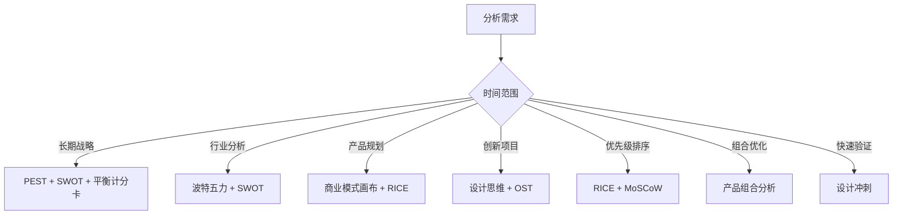

### 实施最佳实践

#### 1. 分层分析策略
- **宏观层面**：PEST分析了解外部环境
- **行业层面**：波特五力评估竞争结构
- **企业层面**：SWOT分析内部能力
- **产品层面**：商业模式画布设计
- **执行层面**：平衡计分卡落地

#### 2. 数据驱动决策
- **量化评估**：RICE评分提供客观依据
- **定性判断**：MoSCoW补充实际约束
- **持续验证**：设计思维强调用户验证

#### 3. 迭代优化过程
- **定期更新**：每季度重新审视分析结果
- **动态调整**：根据市场变化调整策略
- **经验积累**：建立分析模板和检查清单

#### 4. 跨部门协作
- **领导层参与**：确保战略一致性
- **业务团队参与**：提供市场洞察
- **技术团队参与**：评估技术可行性
- **运营团队参与**：关注执行细节

### 风险控制要点

#### 分析质量控制
- **数据准确性**：确保分析基于可靠数据
- **视角完整性**：避免单一维度分析
- **结论合理性**：防止过度推断
- **行动计划可行性**：确保战略可执行

#### 执行过程管理
- **时间管理**：合理安排分析时间
- **资源分配**：平衡分析投入与产出
- **沟通协调**：确保团队共识
- **成果应用**：建立跟踪机制

## 总结

ST战略分析模块为产品开发提供了完整的战略思考工具箱，通过11个核心框架的有机组合，形成了从宏观环境到微观执行的全方位战略分析能力。

### 核心价值

1. **系统性思维**：提供多层次、多维度的战略分析框架
2. **方法论支撑**：基于成熟理论和实践验证的方法论
3. **工具实用性**：每个框架都有明确的应用场景和操作步骤
4. **协同效应**：框架间相互补充，形成分析合力
5. **PD集成**：与产品开发流程深度结合，指导实践应用

### 应用建议

- **分阶段应用**：根据项目生命周期选择合适的分析框架
- **组合使用**：多个框架协同，避免单一视角局限
- **持续迭代**：建立定期回顾和更新机制
- **注重执行**：将分析结果转化为具体的行动计划

通过合理运用ST模块的11个战略分析框架，组织能够建立科学的战略决策体系，提高产品开发的成功率，实现可持续的竞争优势。