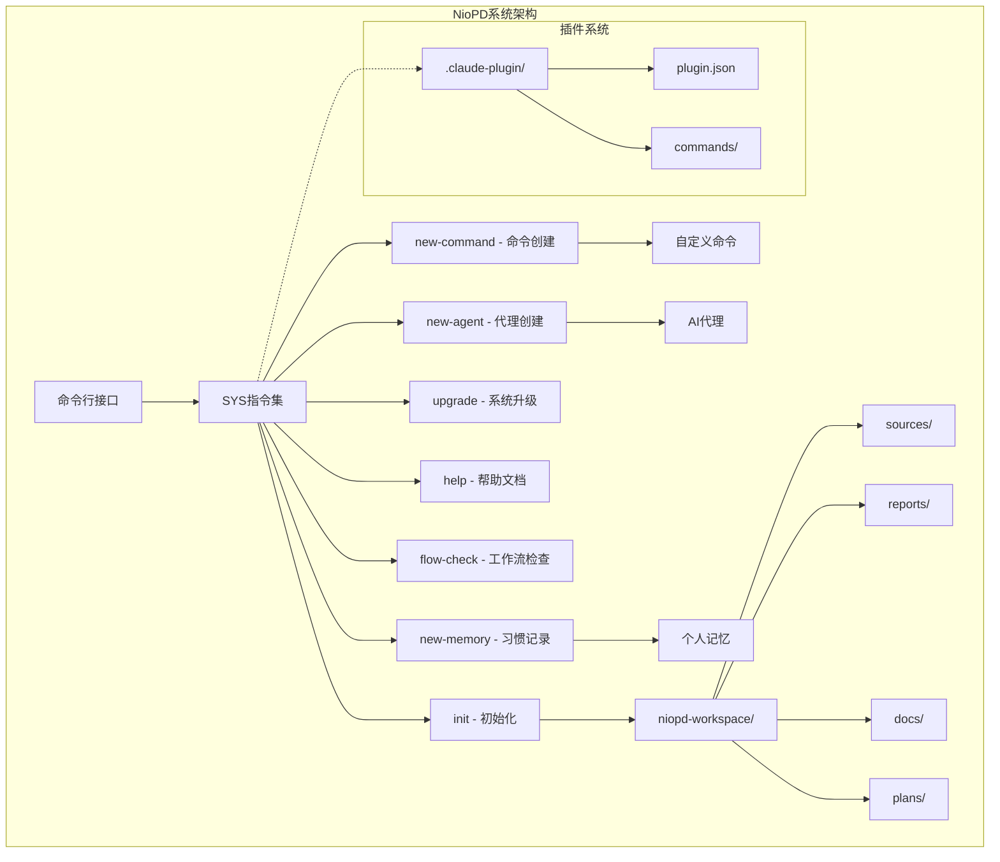
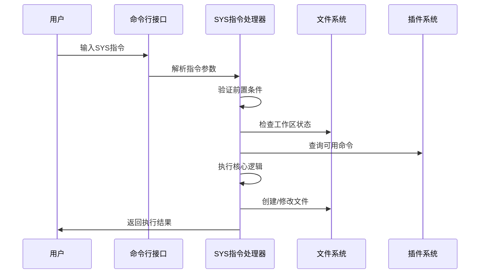
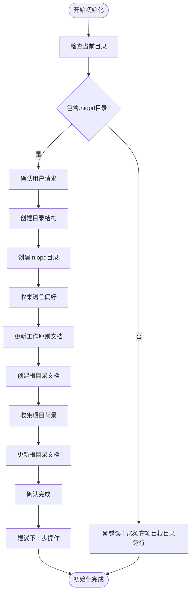
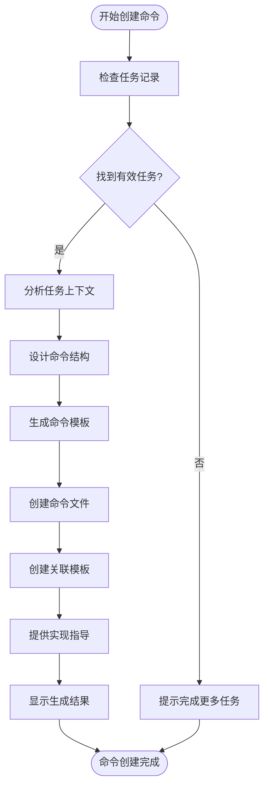
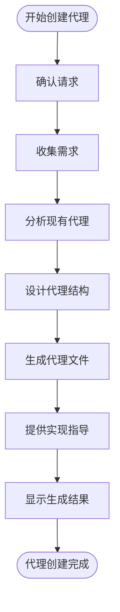
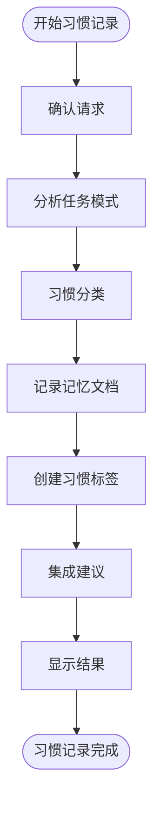
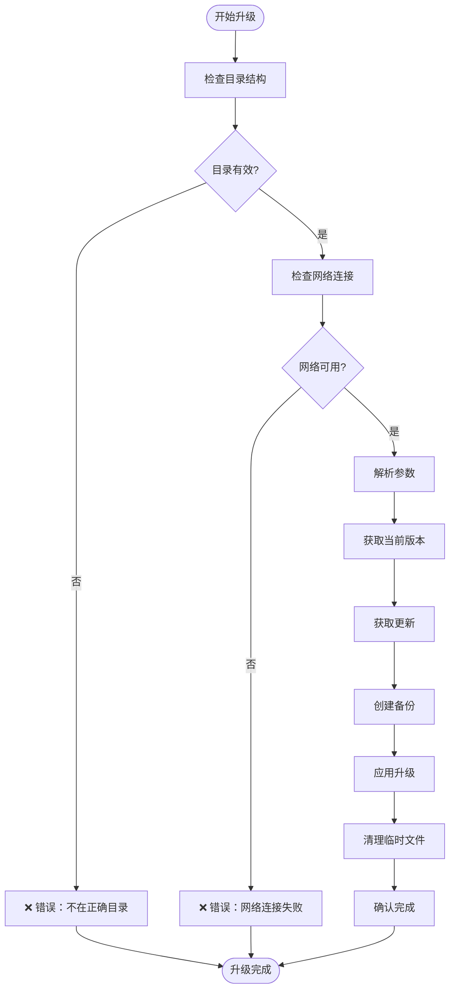
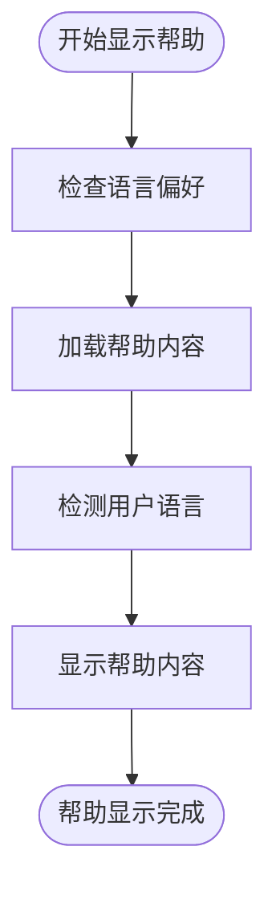
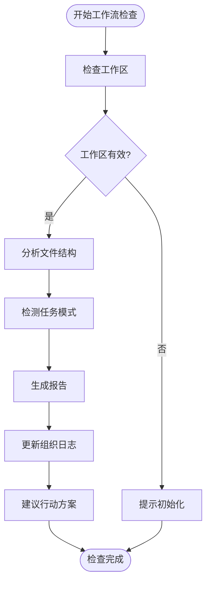
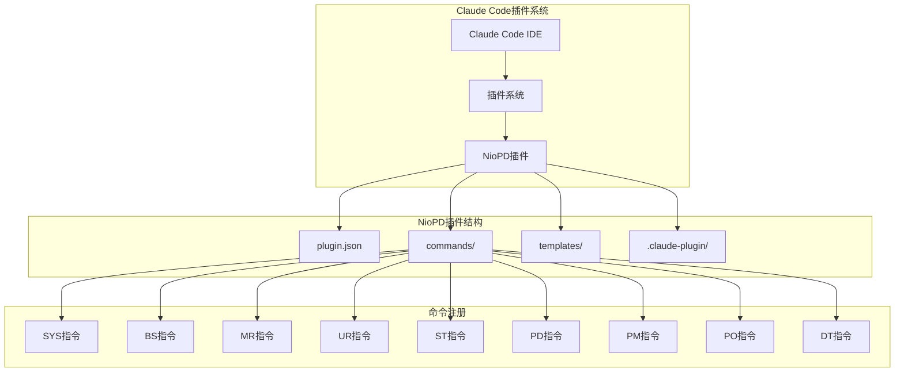

# SYS - 系统管理指令

<cite>
**本文档中引用的文件**
- [init.md](file://niopd/commands/SYS/init.md)
- [new-agent.md](file://niopd/commands/SYS/new-agent.md)
- [new-command.md](file://niopd/commands/SYS/new-command.md)
- [new-memory.md](file://niopd/commands/SYS/new-memory.md)
- [upgrade.md](file://niopd/commands/SYS/upgrade.md)
- [help.md](file://niopd/commands/SYS/help.md)
- [flow-check.md](file://niopd/commands/SYS/flow-check.md)
- [command-template.md](file://niopd/templates/command-template.md)
- [agent-template.md](file://niopd/templates/agent-template.md)
- [plugin.json](file://niopd/.claude-plugin/plugin.json)
- [README.md](file://README.md)
</cite>

## 目录
1. [简介](#简介)
2. [系统架构概览](#系统架构概览)
3. [核心指令详解](#核心指令详解)
4. [init - 工作区初始化](#init---工作区初始化)
5. [new-command - 自定义命令创建](#new-command---自定义命令创建)
6. [new-agent - AI代理创建](#new-agent---ai代理创建)
7. [new-memory - 工作习惯记录](#new-memory---工作习惯记录)
8. [upgrade - 系统升级](#upgrade---系统升级)
9. [help - 帮助文档](#help---帮助文档)
10. [flow-check - 工作流检查](#flow-check---工作流检查)
11. [插件系统集成](#插件系统集成)
12. [最佳实践指南](#最佳实践指南)
13. [故障排除](#故障排除)

## 简介

SYS指令集是NioPD（Nio Product Director）框架的核心系统管理模块，提供工作区初始化、系统配置、自定义扩展和维护功能。这些指令构成了NioPD框架的基础架构，支撑整个产品管理工作的自动化和智能化。

SYS指令集包含8个核心命令，每个都针对特定的系统管理需求：
- **init**: 工作区初始化和目录结构创建
- **new-command**: 基于重复任务创建自定义命令
- **new-agent**: 创建专门处理特定任务的AI代理
- **new-memory**: 识别和记录个人工作习惯
- **upgrade**: 从GitHub仓库升级NioPD系统
- **help**: 显示完整的命令帮助信息
- **flow-check**: 检查工作流状态并发现优化机会
- **hi**: 与Nio开始对话（辅助功能）

## 系统架构概览

NioPD采用模块化的指令架构，SYS指令集作为顶层控制系统，协调其他功能模块的工作。



**图表来源**
- [init.md](file://niopd/commands/SYS/init.md#L1-L50)
- [plugin.json](file://niopd/.claude-plugin/plugin.json#L1-L15)

## 核心指令详解

### 指令分类与功能矩阵

| 指令 | 功能描述 | 使用场景 | 输出结果 | 依赖关系 |
|------|----------|----------|----------|----------|
| `/niopd:SYS:init` | 初始化NioPD工作区 | 新项目启动、系统重置 | 标准化目录结构 | 无 |
| `/niopd:SYS:new-command` | 创建自定义命令 | 重复任务自动化 | 自定义命令文件 | 任务记录分析 |
| `/niopd:SYS:new-agent` | 创建AI代理 | 专业化任务处理 | 代理配置文件 | 任务模式识别 |
| `/niopd:SYS:new-memory` | 记录工作习惯 | 个性化学习 | 个人偏好配置 | 习惯分析 |
| `/niopd:SYS:upgrade` | 系统升级 | 版本更新、功能获取 | 最新系统版本 | GitHub连接 |
| `/niopd:SYS:help` | 显示帮助信息 | 学习使用、查找命令 | 帮助文档 | 语言偏好 |
| `/niopd:SYS:flow-check` | 工作流检查 | 项目状态评估 | 优化建议报告 | 项目文件分析 |
| `/niopd:SYS:hi` | 与Nio对话 | 初始交互、概念理解 | 对话记录 | 通信设置 |

### 指令调用流程



**图表来源**
- [init.md](file://niopd/commands/SYS/init.md#L20-L40)
- [new-command.md](file://niopd/commands/SYS/new-command.md#L15-L35)

## init - 工作区初始化

### 功能概述

`/niopd:SYS:init`是NioPD系统的核心初始化命令，负责创建标准化的工作区目录结构，建立项目基础配置，并设置用户偏好。

### 调用方式

```bash
/niopd:SYS:init
```

### 参数说明

无参数要求。该命令会在当前目录下执行初始化操作。

### 执行流程



**图表来源**
- [init.md](file://niopd/commands/SYS/init.md#L25-L85)

### 输出结果

初始化完成后，系统创建以下目录结构：

| 目录 | 用途 | 包含内容 |
|------|------|----------|
| `niopd-workspace/sources/` | 思考源材料层 | 头脑风暴记录、深度思考分析、笔记 |
| `niopd-workspace/reports/` | 数据分析报告层 | 用户研究、市场分析、战略报告 |
| `niopd-workspace/docs/` | 决策文档层 | 产品需求文档、项目立项、PRD |
| `niopd-workspace/plans/` | 执行计划层 | 项目计划、路线图、发布计划 |

同时创建以下配置文件：
- `.niopd/niopd.md` - 工作原则和配置文档
- `{IDE_TYPE}.md` - 项目根目录文档

### 使用场景

1. **新项目启动**：开始新产品开发时的第一个命令
2. **系统重置**：清理现有配置，重新开始
3. **环境迁移**：在新环境中恢复工作区
4. **团队协作**：为新成员建立统一的工作环境

### 实际使用示例

```bash
# 在项目根目录执行初始化
/niopd:SYS:init

# 系统响应示例
Great! Let's initialize the NioPD system. I'll create the necessary directory structure for you.

✅ All done! I've created the necessary directory structure for the NioPD system.
✅ I've also created/updated the work principles document at `.niopd/niopd.md` with the comprehensive guidelines.
✅ I've also added your preferred communication language to the `.niopd/niopd.md` file. I'll use English in all our future communications.
✅ I've also created the project context document at `niopd.md` for your project background information.
✅ I've also added your project background and goals to the `niopd.md` file.

You can now start creating initiatives with `/niopd:BS:new-initiative`. For example: `/niopd:BS:new-initiative "My First Feature"`
```

**章节来源**
- [init.md](file://niopd/commands/SYS/init.md#L1-L195)

## new-command - 自定义命令创建

### 功能概述

`/niopd:SYS:new-command`基于用户最近完成的任务记录，自动生成自定义命令文件，实现重复性任务的自动化。

### 调用方式

```bash
/niopd:SYS:new-command [任务描述]
```

### 参数说明

- `[任务描述]`：可选参数，提供具体的任务描述或上下文信息

### 执行流程



**图表来源**
- [new-command.md](file://niopd/commands/SYS/new-command.md#L15-L50)

### 命令结构模板

系统生成的标准命令文件结构：

```yaml
---
allowed-tools: [工具列表]
argument-hint: [参数描述]
description: [简短描述]
model: Qwen3-Coder
---

# Command: /niopd:user-[命令名称]

[命令功能简述]

## Usage
`/niopd:user-[命令名称] [参数]`

## Preflight Checklist
- [验证步骤1]
- [验证步骤2]

## Instructions

### Step 1: [步骤1]
- [详细说明]

### Step 2: [步骤2]
- [详细说明]

...

### Step N: 结束
- [结束消息]

## Error Handling
- [错误处理指导]
```

### 使用场景

1. **重复任务自动化**：发现固定模式的重复任务时
2. **工作流优化**：希望简化复杂操作流程时
3. **团队协作**：为团队成员创建标准化的操作命令
4. **个人效率**：提高个人工作效率和一致性

### 实际使用示例

```bash
# 基于最近的用户反馈分析任务创建命令
/niopd:SYS:new-command "分析用户反馈并生成摘要"

# 系统响应示例
I'll help you create a new command based on recent task context for organizational updates.

✅ Command created successfully!
Generated command: `/niopd:user-analyze-feedback`

Command Structure:
---
allowed-tools: Read(*), Write(*), Edit(*)
argument-hint: --from=<file> --for=<initiative>
description: Analyzes user feedback and generates summary reports
model: Qwen3-Coder
---

# Command: /niopd:user-analyze-feedback

Analyzes user feedback data and generates comprehensive summary reports.

## Usage
`/niopd:user-analyze-feedback --from=<file> --for=<initiative>`

## Preflight Checklist
- Verify feedback file exists
- Check initiative name validity
- Ensure proper file format

## Instructions

### Step 1: Validate Input Parameters
- Check if feedback file exists
- Validate initiative name format
- Verify file permissions

### Step 2: Process Feedback Data
- Read feedback content
- Perform thematic analysis
- Identify key themes and patterns

### Step 3: Generate Summary Report
- Create structured report
- Include statistics and insights
- Format for easy consumption

### Step 4: Save and Return
- Save report to reports/ directory
- Return success confirmation

## Error Handling
- If file not found: "❌ Feedback file not found. Please check the path."
- If invalid initiative: "❌ Initiative name is required and must be valid."
- If processing fails: "❌ Failed to process feedback data. Please try again."
```

**章节来源**
- [new-command.md](file://niopd/commands/SYS/new-command.md#L1-L96)

## new-agent - AI代理创建

### 功能概述

`/niopd:SYS:new-agent`创建专门处理特定任务领域的AI代理，实现专业化任务的自动化执行。

### 调用方式

```bash
/niopd:SYS:new-agent [代理描述]
```

### 参数说明

- `[代理描述]`：描述代理应该处理的具体任务或领域

### 执行流程



**图表来源**
- [new-agent.md](file://niopd/commands/SYS/new-agent.md#L15-L45)

### 代理结构模板

系统生成的标准代理文件结构：

```yaml
---
name: niopd-[代理名称]
description: [代理功能描述]
tools: [允许使用的工具列表]
model: inherit
color: [颜色标识]
---

# Agent: [代理名称]

## Role
[代理角色描述]

## Input
[输入要求和格式]

## Process
[处理步骤详细说明]

## Output Format
[输出格式规范]

## Error Handling
[错误处理指导]
```

### 使用场景

1. **专业化分析**：需要特定领域知识的复杂分析任务
2. **重复性任务**：具有固定模式的重复性工作
3. **跨部门协作**：需要特定技能或权限的任务
4. **质量保证**：需要专业知识的质量检查任务

### 实际使用示例

```bash
# 创建专门处理市场分析的代理
/niopd:SYS:new-agent "专门处理竞争对手分析和市场定位的代理"

# 系统响应示例
I'll help you create a new agent based on task requirements for organizational updates.

✅ Agent created successfully!
Generated agent: Competitor Analysis Agent

Agent Structure:

# Competitor Analysis Agent

## Role
Specialized agent for conducting comprehensive competitor analysis and market positioning studies.

## Input
- Competitor website URLs
- Market context information
- Analysis parameters

## Process
1. **Website Analysis**: Extract competitor features, pricing, and value propositions
2. **Market Positioning**: Analyze competitive positioning and differentiation
3. **Strategic Insights**: Identify strengths, weaknesses, opportunities, and threats
4. **Recommendations**: Provide actionable recommendations for market positioning

## Output Format
Markdown report with:
- Competitor comparison matrix
- Market positioning analysis
- Strategic recommendations
- Actionable insights

## Error Handling
- If URL invalid: "❌ Invalid competitor URL provided. Please check and try again."
- If analysis timeout: "❌ Analysis took too long. Please try with a different competitor."
- If insufficient data: "❌ Not enough data available for comprehensive analysis."
```

**章节来源**
- [new-agent.md](file://niopd/commands/SYS/new-agent.md#L1-L85)

## new-memory - 工作习惯记录

### 功能概述

`/niopd:SYS:new-memory`基于用户最近的任务模式，识别和记录个人工作习惯，实现NioPD系统的个性化学习和适应。

### 调用方式

```bash
/niopd:SYS:new-memory [习惯描述]
```

### 参数说明

- `[习惯描述]`：可选参数，提供具体的工作习惯描述

### 执行流程



**图表来源**
- [new-memory.md](file://niopd/commands/SYS/new-memory.md#L15-L50)

### 习惯分类体系

系统将工作习惯分为四个主要类别：

| 类别 | 描述 | 示例 | 标签格式 |
|------|------|------|----------|
| 效率模式 | 时间节省方法 | 快速模板使用、批量处理 | `#habit-efficiency-[名称]` |
| 质量实践 | 输出质量提升方法 | 详细检查清单、多轮验证 | `#habit-quality-[名称]` |
| 工作流偏好 | 偏好的工作方式 | 结构化思考、分阶段处理 | `#habit-workflow-[名称]` |
| 决策框架 | 个人决策方法 | 数据驱动、风险评估 | `#habit-decision-[名称]` |

### 使用场景

1. **个性化学习**：让NioPD系统适应您的工作风格
2. **效率提升**：识别和强化高效的工作模式
3. **知识积累**：记录和传承个人最佳实践
4. **团队协作**：分享有效的团队工作习惯

### 实际使用示例

```bash
# 基于最近的PRD创建任务记录习惯
/niopd:SYS:new-memory

# 系统响应示例
I'll help you identify and record personal work habits for organizational updates.

✅ Habits identified and recorded successfully!

Personal Work Habits Memory:

## Efficiency Patterns
### Structured Writing Approach
- **Pattern**: Start with outline, then expand sections
- **Context**: Creating detailed product documents
- **Benefit**: Saves 30% writing time, improves coherence
- **Example**: Using PRD creation as template for all documentation

## Quality Practices
### Multi-stage Review Process
- **Pattern**: Create draft → Peer review → Executive review → Final polish
- **Context**: Important product decisions
- **Benefit**: Reduces errors by 40%, increases stakeholder buy-in
- **Example**: PRD review process with 3 different stakeholders

## Workflow Preferences
### Incremental Development
- **Pattern**: Build small, iterate often
- **Context**: Feature development and planning
- **Benefit**: Faster delivery, better adaptation to feedback
- **Example**: Starting with MVP features before full implementation

## Decision Frameworks
### Data-driven Prioritization
- **Pattern**: Use quantitative metrics for feature prioritization
- **Context**: Product backlog management
- **Benefit**: More objective decisions, stakeholder alignment
- **Example**: Using RICE framework for all feature prioritization

Next steps:
- Use `#habit-efficiency-structured-writing` in future documentation tasks
- Apply `#habit-quality-multi-stage-review` to important decisions
- Share `#habit-workflow-incremental-development` with team members
```

**章节来源**
- [new-memory.md](file://niopd/commands/SYS/new-memory.md#L1-L92)

## upgrade - 系统升级

### 功能概述

`/niopd:SYS:upgrade`从GitHub仓库获取最新版本的NioPD系统，支持全系统升级或指定组件升级。

### 调用方式

```bash
# 升级整个系统
/niopd:SYS:upgrade

# 升级指定组件
/niopd:SYS:upgrade --component=<组件名称>

# 强制升级（即使有冲突）
/niopd:SYS:upgrade --force

# 预览升级内容（不实际执行）
/niopd:SYS:upgrade --dry-run
```

### 参数说明

| 参数 | 类型 | 描述 | 默认值 |
|------|------|------|--------|
| `--component` | 字符串 | 指定要升级的组件目录 | 全部组件 |
| `--force` | 布尔 | 强制应用升级，即使存在冲突 | false |
| `--dry-run` | 布尔 | 预览升级内容，不实际执行 | false |

### 执行流程



**图表来源**
- [upgrade.md](file://niopd/commands/SYS/upgrade.md#L20-L60)

### 升级策略

系统支持多种升级策略：

1. **全系统升级**：更新所有命令和组件
2. **组件升级**：只更新指定的命令目录
3. **强制升级**：忽略冲突，强制应用更新
4. **预览模式**：只显示将要升级的内容

### 使用场景

1. **功能获取**：获取新发布的功能和改进
2. **Bug修复**：修复已知的问题和漏洞
3. **性能优化**：提升系统运行效率
4. **安全更新**：应用安全补丁

### 实际使用示例

```bash
# 升级整个NioPD系统
/niopd:SYS:upgrade

# 系统响应示例
On it! I'll upgrade the NioPD system from the GitHub repository.

Fetching upgrades from the GitHub repository...
Creating backup in backup_20241201_143022

✅ Upgrade completed successfully. Please restart Claude Code to apply the changes.

For manual upgrades, you can also:
1. Visit https://github.com/iflow-ai/niopd
2. Download the latest release
3. Extract to your plugin directory
4. Restart Claude Code

Note: If you encounter any issues after upgrading, you can restore from the backup directory: `backup_20241201_143022`
```

**章节来源**
- [upgrade.md](file://niopd/commands/SYS/upgrade.md#L1-L87)

## help - 帮助文档

### 功能概述

`/niopd:SYS:help`显示完整的NioPD系统帮助信息，包括所有可用命令的详细说明和使用指南。

### 调用方式

```bash
/niopd:SYS:help
```

### 参数说明

无参数要求。该命令不需要任何输入参数。

### 执行流程



**图表来源**
- [help.md](file://niopd/commands/SYS/help.md#L20-L50)

### 帮助内容结构

帮助文档包含以下主要部分：

1. **快速开始工作流程**：核心命令的使用顺序
2. **核心工作流程命令**：主要业务流程指令
3. **商业策略命令**：BS领域相关指令
4. **市场研究命令**：MR领域相关指令
5. **用户研究命令**：UR领域相关指令
6. **产品开发命令**：PD领域相关指令
7. **项目管理命令**：PM领域相关指令
8. **战略分析命令**：ST领域相关指令
9. **产品运营命令**：PO领域相关指令
10. **深度思考命令**：DT领域相关指令
11. **系统命令**：SYS领域相关指令

### 多语言支持

系统支持多种语言的帮助文档：
- 中文（Chinese）
- 英文（English）
- 自动检测用户首选语言
- 默认回退到英文

### 使用场景

1. **学习使用**：初次使用NioPD时的学习指南
2. **查找命令**：忘记具体命令语法时的查询
3. **功能探索**：了解系统所有可用功能
4. **最佳实践**：学习推荐的工作流程

### 实际使用示例

```bash
# 显示完整帮助信息
/niopd:SYS:help

# 系统响应示例（中文界面）
我将为您显示NioPD系统的帮助信息。

📚 NioPD - AI驱动的产品管理工具包
=====================================

🎯 快速开始工作流程
  1. /niopd:SYS:init        - 初始化NioPD工作区
  2. /niopd:BS:new-initiative "<name>" - 创建新的产品项目
  3. /niopd:UR:feedback --for=<initiative> - 分析反馈（自动检测反馈文件）
  4. /niopd:PD:draft --for=<initiative> - 生成PRD草案
  5. /niopd:PM:roadmap              - 更新产品路线图

📄 核心工作流程命令
  /niopd:SYS:init               - 初始化NioPD工作区
  /niopd:BS:new-initiative "<name>" - 开始新的高级产品项目
  /niopd:UR:feedback [--from=<file>] --for=<initiative> - 分析反馈并生成摘要（自动检测反馈文件）
  /niopd:PD:draft --for=<initiative> - 自动生成PRD草案
  /niopd:PM:roadmap              - 生成或更新产品路线图

💡 提示
  • 使用 /niopd:SYS:init 初始化NioPD工作区
  • 使用 /niopd:BS:new-initiative 开始新的产品项目
  • 使用 /niopd:UR:feedback 分析用户反馈（自动检测sources/中的反馈文件）
  • 使用 /niopd:PD:draft 自动生成PRD
  • 使用 /niopd:PM:roadmap 保持路线图更新
  • 查看 README.md 获取完整文档
```

**章节来源**
- [help.md](file://niopd/commands/SYS/help.md#L1-L148)

## flow-check - 工作流检查

### 功能概述

`/niopd:SYS:flow-check`分析当前项目状态和任务历史，识别缺失文档，建议下一步操作，并发现组织改进机会。

### 调用方式

```bash
/niopd:SYS:flow-check
```

### 参数说明

无参数要求。该命令分析当前工作区的所有文件。

### 执行流程



**图表来源**
- [flow-check.md](file://niopd/commands/SYS/flow-check.md#L20-L60)

### 分析维度

系统从以下维度分析工作流状态：

| 分析维度 | 检查内容 | 输出结果 |
|----------|----------|----------|
| 文件统计 | 总文件数量、各类文件分布 | 工作区概览 |
| 项目状态 | 已完成的项目数量、活跃项目 | 项目健康度 |
| 文档完整性 | 缺失的关键文档 | 文档检查报告 |
| 任务模式 | 重复性任务、相似文档结构 | 自动化机会 |
| 工作流效率 | 时间消耗分析、瓶颈识别 | 效率评估 |

### 组织更新建议

系统提供三种类型的组织更新建议：

1. **新命令机会**：基于重复任务模式的自动化命令
2. **个人习惯记录**：可系统化的个人工作习惯
3. **新代理机会**：专门处理特定领域的AI代理

### 使用场景

1. **项目状态评估**：了解当前项目的完成情况
2. **工作流优化**：发现可以自动化的重复任务
3. **文档完整性检查**：确保关键文档的完整性
4. **团队协作改进**：识别团队工作流程的改进机会

### 实际使用示例

```bash
# 检查当前工作流状态
/niopd:SYS:flow-check

# 系统响应示例
I'll check the NioPD system for organizational update opportunities.

🔍 NioPD Organizational Update Opportunities
==========================================

📊 Workspace Analysis
  • Total files analyzed: 24
  • Initiative files: 3
  • PRD files: 2
  • Report files: 15
  • Roadmap files: 4

🔄 Task Pattern Recognition
  • Repeated daily tasks: User feedback analysis, PRD drafting
  • Similar document structures: MRD/PSD/PRD三阶段文档
  • Common command sequences: BS→UR→ST→PD→PM→PO
  • User work habits: Structured writing approach, multi-stage review

💡 Organizational Update Suggestions
  1. New Command Opportunities
     • `/niopd:user-generate-mrd` - Estimated time savings: 15 minutes/day
     • `/niopd:user-analyze-market-trends` - Estimated time savings: 20 minutes/week
  
  2. Personal Work Habits for memory.md
     • Structured writing approach - Could be documented as personal best practice
     • Multi-stage review process - Could be systematized for efficiency
  
  3. New Agent Opportunities
     • Market Research Agent - For automating market trend analysis
     • PRD Drafting Agent - For specializing in product requirement documentation

🚀 Implementation Options
  • Use /niopd:SYS:new-command to create new commands based on identified patterns
  • Document personal habits in memory.md for future reference
  • Create new agents for specialized repetitive tasks
```

**章节来源**
- [flow-check.md](file://niopd/commands/SYS/flow-check.md#L1-L118)

## 插件系统集成

### 系统架构

NioPD通过Claude Code插件系统实现功能扩展和集成：



**图表来源**
- [plugin.json](file://niopd/.claude-plugin/plugin.json#L1-L15)
- [README.md](file://README.md#L50-L80)

### 插件配置

插件的核心配置信息：

| 配置项 | 值 | 描述 |
|--------|-----|------|
| 名称 | 0niopd | 插件显示名称 |
| 版本 | 1.0.0 | 当前版本号 |
| 描述 | NioPD - 产品管理工具包 | 系统功能描述 |
| 作者 | NioPD Team | 开发团队信息 |
| 仓库 | github.com/iflow-ai/niopd | 源代码仓库 |
| 关键词 | product-management, ai, pm-tools | 搜索关键词 |

### 命令注册机制

每个指令通过独立的Markdown文件注册：

```yaml
# 命令文件头部配置
---
allowed-tools: Bash(git add:*), Read(*), Write(*)
argument-hint: [参数描述]
description: [简短描述]
model: Qwen3-Coder
---
```

### 模板系统

系统提供标准化的模板用于创建新命令和代理：

- **命令模板**：`templates/command-template.md`
- **代理模板**：`templates/agent-template.md`
- **文档模板**：各种业务领域的文档模板

**章节来源**
- [plugin.json](file://niopd/.claude-plugin/plugin.json#L1-L15)
- [command-template.md](file://niopd/templates/command-template.md#L1-L27)
- [agent-template.md](file://niopd/templates/agent-template.md#L1-L73)

## 最佳实践指南

### 初始化最佳实践

1. **选择合适的工作区位置**
   - 在项目根目录执行`/niopd:SYS:init`
   - 确保包含`.niopd`目录
   - 避免在子目录中初始化

2. **设置正确的语言偏好**
   - 根据团队主要语言设置
   - 便于后续沟通和文档理解
   - 支持多语言混合项目

3. **提供详细的项目背景**
   - 明确项目目标和成功标准
   - 说明项目范围和限制
   - 识别关键利益相关方

### 自定义命令创建最佳实践

1. **识别重复性任务**
   - 观察每周重复执行的任务
   - 分析任务的复杂度和价值
   - 确定自动化的价值回报

2. **设计清晰的命令结构**
   - 使用描述性的命令名称
   - 明确的参数说明
   - 完整的错误处理机制

3. **测试和验证**
   - 在小范围内测试新命令
   - 收集反馈并迭代改进
   - 文档化使用方法

### AI代理创建最佳实践

1. **明确代理职责**
   - 定义清晰的代理边界
   - 确定专门处理的领域
   - 设计合理的输入输出格式

2. **选择合适的工具集**
   - 根据任务需求选择工具
   - 平衡功能性和安全性
   - 考虑性能和资源消耗

3. **建立质量标准**
   - 制定输出质量标准
   - 建立验证和测试机制
   - 持续监控和改进

### 工作习惯记录最佳实践

1. **定期回顾和记录**
   - 每周回顾工作模式
   - 记录显著的效率提升
   - 分享团队最佳实践

2. **分类和标签化**
   - 使用标准化的习惯分类
   - 创建有意义的标签
   - 建立检索和引用机制

3. **持续学习和适应**
   - 根据项目需求调整习惯
   - 学习新的工作方法
   - 优化个人工作流程

### 系统维护最佳实践

1. **定期升级**
   - 关注新版本发布
   - 评估升级的必要性
   - 制定升级计划

2. **备份和恢复**
   - 定期备份工作区
   - 测试恢复流程
   - 建立灾难恢复计划

3. **性能监控**
   - 监控系统性能
   - 识别性能瓶颈
   - 优化资源配置

## 故障排除

### 常见问题及解决方案

#### 初始化问题

**问题**：`❌ Error: This command must be run from the root of a project that contains the .niopd directory.`

**原因**：不在正确的项目根目录执行

**解决方案**：
1. 确认当前目录包含`.niopd`目录
2. 使用`cd`命令切换到正确目录
3. 重新执行初始化命令

**问题**：目录创建失败

**原因**：权限不足或磁盘空间不足

**解决方案**：
1. 检查目录写入权限
2. 确保有足够的磁盘空间
3. 尝试在其他目录执行

#### 命令创建问题

**问题**：找不到有效的任务记录

**原因**：没有足够的任务历史数据

**解决方案**：
1. 先完成一些任务
2. 确保任务被正确记录
3. 使用更具体的任务描述

**问题**：生成的命令结构不完整

**原因**：上下文信息不足

**解决方案**：
1. 提供更详细的任务描述
2. 包含相关的上下文信息
3. 参考类似的成功案例

#### 代理创建问题

**问题**：代理描述过于宽泛

**原因**：缺乏具体的需求说明

**解决方案**：
1. 明确代理的具体职责
2. 描述预期的输入输出
3. 指定使用的工具和技术

**问题**：代理文件格式错误

**原因**：缺少必要的配置字段

**解决方案**：
1. 参考标准代理模板
2. 确保包含所有必需字段
3. 验证配置格式的正确性

#### 升级问题

**问题**：网络连接失败

**原因**：无法访问GitHub仓库

**解决方案**：
1. 检查网络连接
2. 确认防火墙设置
3. 尝试手动下载更新

**问题**：升级过程中断

**原因**：文件系统权限或存储空间

**解决方案**：
1. 检查磁盘空间
2. 确认文件系统权限
3. 从备份恢复系统

#### 工作流检查问题

**问题**：工作区为空

**原因**：尚未开始项目工作

**解决方案**：
1. 先执行一些基础任务
2. 使用`/niopd:SYS:init`初始化
3. 完成基本的项目设置

**问题**：找不到组织更新机会

**原因**：工作流程过于简单

**解决方案**：
1. 完成更多复杂的任务
2. 尝试不同的工作模式
3. 等待积累更多的任务数据

### 调试技巧

1. **启用详细日志**
   - 使用`--verbose`参数（如果支持）
   - 检查系统日志文件
   - 监控命令执行过程

2. **分步验证**
   - 逐步执行复杂命令
   - 验证每一步的结果
   - 记录中间状态

3. **环境隔离**
   - 在测试环境中验证
   - 使用备份数据进行测试
   - 避免影响生产环境

### 获取帮助

1. **查看帮助文档**
   ```bash
   /niopd:SYS:help
   ```

2. **检查系统状态**
   ```bash
   /niopd:SYS:flow-check
   ```

3. **联系技术支持**
   - 查看官方文档
   - 社区论坛交流
   - 提交问题报告

通过遵循这些最佳实践和故障排除指南，您可以充分利用NioPD SYS指令集的强大功能，构建高效、智能的产品管理工作流程。