# UR - 用户研究指令

<cite>
**本文档中引用的文件**
- [personas.md](file://niopd/commands/UR/personas.md)
- [interview.md](file://niopd/commands/UR/interview.md)
- [feedback.md](file://niopd/commands/UR/feedback.md)
- [journey.md](file://niopd/commands/UR/journey.md)
- [usability.md](file://niopd/commands/UR/usability.md)
- [satisfaction.md](file://niopd/commands/UR/satisfaction.md)
- [behavior.md](file://niopd/commands/UR/behavior.md)
- [jtbd.md](file://niopd/commands/UR/jtbd.md)
- [kano.md](file://niopd/commands/UR/kano.md)
- [persona-template.md](file://niopd/templates/persona-template.md)
- [interview-summary-template.md](file://niopd/templates/interview-summary-template.md)
- [feedback-summary-template.md](file://niopd/templates/feedback-summary-template.md)
</cite>

## 目录
1. [简介](#简介)
2. [项目结构](#项目结构)
3. [核心组件](#核心组件)
4. [架构概览](#架构概览)
5. [详细组件分析](#详细组件分析)
6. [依赖关系分析](#依赖关系分析)
7. [性能考虑](#性能考虑)
8. [故障排除指南](#故障排除指南)
9. [结论](#结论)

## 简介

用户研究（UR）指令集是NioPD产品开发框架中的核心模块，专门用于理解和分析用户需求与行为模式。该指令集包含九个关键工具：人物画像（personas）、用户访谈（interview）、反馈分析（feedback）、用户旅程（journey）、可用性评估（usability）、满意度测量（satisfaction）、行为分析（behavior）、待办任务（jtbd）和Kano模型（kano）。这些工具协同工作，为产品决策提供全面的用户洞察基础。

## 项目结构

用户研究指令集位于`niopd/commands/UR/`目录下，包含以下核心文件：

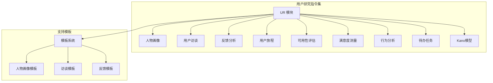

**图表来源**
- [personas.md](file://niopd/commands/UR/personas.md#L1-L50)
- [interview.md](file://niopd/commands/UR/interview.md#L1-L50)
- [feedback.md](file://niopd/commands/UR/feedback.md#L1-L50)

**章节来源**
- [personas.md](file://niopd/commands/UR/personas.md#L1-L100)
- [interview.md](file://niopd/commands/UR/interview.md#L1-L100)
- [feedback.md](file://niopd/commands/UR/feedback.md#L1-L100)

## 核心组件

### 人物画像（Personas）
人物画像指令基于反馈总结报告生成用户角色，通过系统化的数据分析创建典型用户代表。该工具将定性反馈转化为具体的用户角色，帮助团队建立同理心并做出以用户为中心的决策。

### 用户访谈（Interview）
访谈分析指令处理用户访谈转录文本，提取关键见解和主题。通过质性数据分析方法，识别显性和隐性需求、痛点和行为模式，为产品开发提供深入的用户洞察。

### 反馈分析（Feedback）
反馈分析指令处理原始客户反馈，进行主题识别、情感分析和优先级排序。该工具能够从大量非结构化反馈中提取有价值的洞察，指导产品改进方向。

### 用户旅程（Journey）
旅程映射指令创建详细的客户体验地图，识别痛点和优化机会。通过端到端的用户体验可视化，优化整体用户旅程而非孤立的交互点。

### 可用性评估（Usability）
可用性测试指令规划和分析可用性测试，评估用户完成任务的难易程度。基于人机交互原则，通过实证用户评估识别可用性问题。

### 满意度测量（Satisfaction）
满意度分析指令评估客户满意度数据，识别改进机会并衡量成功。采用多维度满意度测量方法，预测忠诚度而非仅仅当前满意度。

### 行为分析（Behavior）
行为分析指令分析用户行为数据，识别产品改进机会。通过实际用户行为（用户所做）而非所说来识别模式、流失点和机会。

### 待办任务（JTBD）
待办任务分析指令识别未满足的需求和创新机会。理解客户雇佣产品寻求的进展，揭示超越功能列表的客户动机。

### Kano模型（Kano）
Kano模型分析指令使用Kano框架分类产品特性，确定必须具备、一维、吸引人、无关或相反质量特性。

**章节来源**
- [personas.md](file://niopd/commands/UR/personas.md#L100-L200)
- [interview.md](file://niopd/commands/UR/interview.md#L100-L200)
- [feedback.md](file://niopd/commands/UR/feedback.md#L100-L200)

## 架构概览

用户研究指令集采用模块化架构，各工具之间存在明确的依赖关系和数据流转：

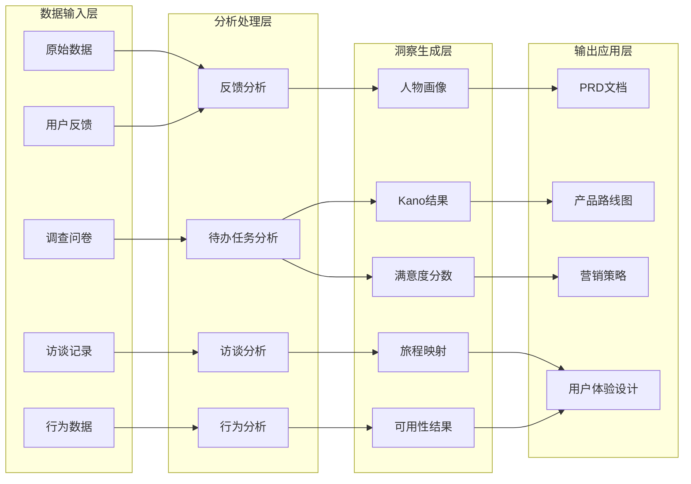

**图表来源**
- [personas.md](file://niopd/commands/UR/personas.md#L200-L300)
- [feedback.md](file://niopd/commands/UR/feedback.md#L200-L300)
- [jtbd.md](file://niopd/commands/UR/jtbd.md#L200-L300)

## 详细组件分析

### 人物画像（Personas）分析

人物画像指令是用户研究的核心工具之一，基于反馈总结报告生成用户角色。该工具采用系统化的分析流程：

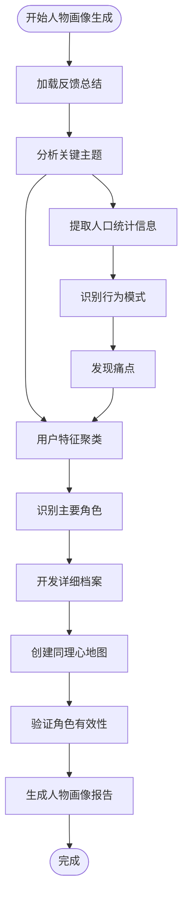

**图表来源**
- [personas.md](file://niopd/commands/UR/personas.md#L300-L400)

#### 核心功能特性

1. **多维度角色构建**：涵盖人口统计学、心理特征、行为模式和目标需求
2. **同理心地图创建**：通过Says-Thinks-Does-Feels框架深入了解用户视角
3. **场景发展**：创建成功和挑战场景来展示用户与产品的交互
4. **产品影响分析**：分析每个角色的需求如何影响产品设计

#### 应用价值

- **决策支持**：为产品决策提供清晰的用户参考
- **团队对齐**：建立跨团队的共同用户语言
- **设计指导**：为UI/UX设计提供具体指导
- **营销策略**：支持个性化营销内容创作

**章节来源**
- [personas.md](file://niopd/commands/UR/personas.md#L400-L576)

### 用户访谈（Interview）分析

访谈分析指令专门处理用户访谈转录文本，采用质性数据分析方法：

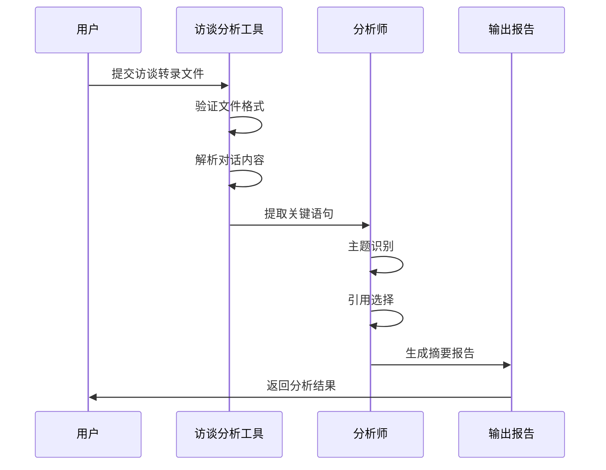

**图表来源**
- [interview.md](file://niopd/commands/UR/interview.md#L200-L300)

#### 分析流程

1. **内容解析**：将访谈内容分割为可分析单元
2. **关键点提取**：识别重要声明、观点和洞察
3. **主题分析**：将相关点分组为连贯的主题
4. **引用选择**：选择最具代表性的引述
5. **洞察合成**：连接主题到战略意义

#### 输出结构

访谈摘要报告包含：
- 执行摘要：最重要的洞察概述
- 参与者背景：角色和经验水平
- 关键要点：优先级最高的洞察
- 核心主题：详细的洞察分类
- 行为模式：观察到的行为习惯
- 产品影响：对产品决策的影响

**章节来源**
- [interview.md](file://niopd/commands/UR/interview.md#L300-L295)

### 反馈分析（Feedback）处理

反馈分析指令处理大规模的原始客户反馈，采用系统化的分析方法：

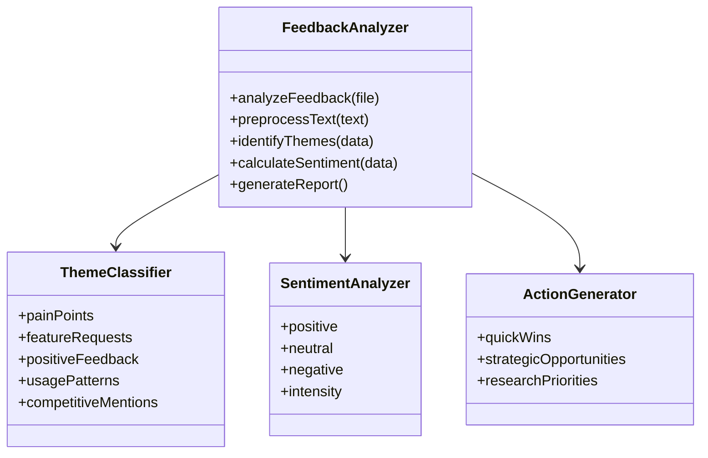

**图表来源**
- [feedback.md](file://niopd/commands/UR/feedback.md#L300-L400)

#### 分析方法论

1. **数据预处理**：清理和标准化反馈文本
2. **主题识别**：使用主题分析将相关反馈分组
3. **情感分析**：评估情感倾向和强度
4. **量化分析**：计算频率和影响力
5. **行动建议**：转化发现为具体的产品建议

#### 反馈分类

- **痛点**：用户遇到的问题和挫折
- **功能请求**：用户要求的新功能或改进
- **积极反馈**：用户赞赏的产品方面
- **使用模式**：用户与产品交互的方式
- **竞争提及**：与其他产品的比较

**章节来源**
- [feedback.md](file://niopd/commands/UR/feedback.md#L400-L285)

### 用户旅程（Journey）映射

旅程映射指令创建详细的客户体验地图，识别整个用户生命周期的触点和痛点：

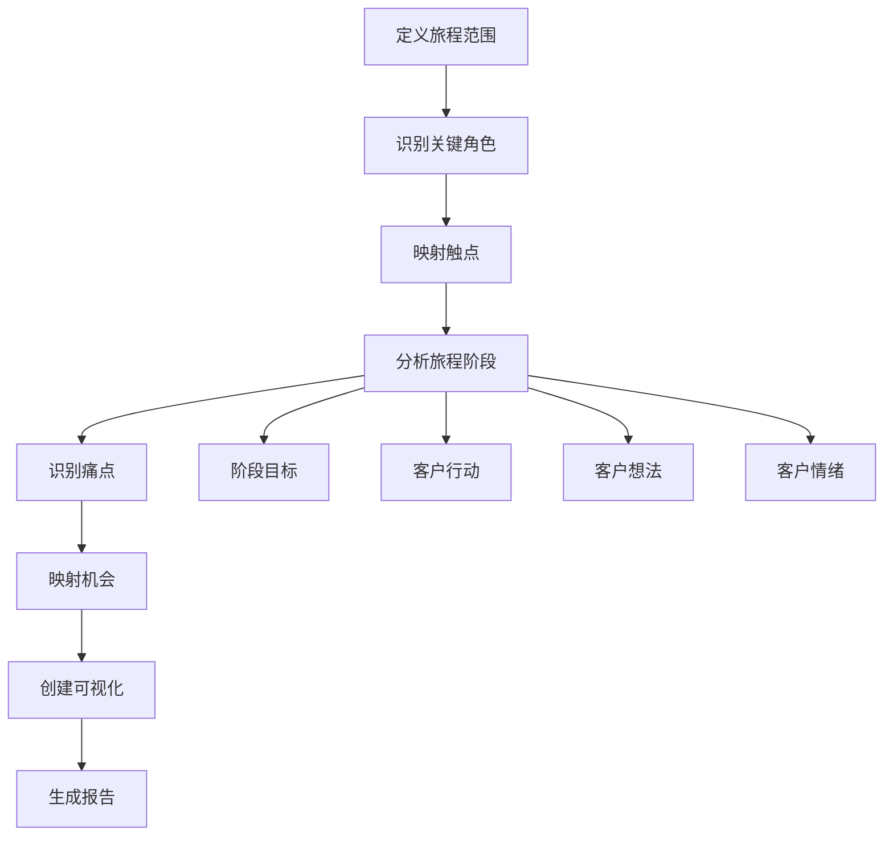

**图表来源**
- [journey.md](file://niopd/commands/UR/journey.md#L200-L300)

#### 旅程类型

1. **现状旅程**：当前的用户体验
2. **未来状态旅程**：期望的体验
3. **日常生活**：产品之外的更广泛上下文
4. **服务蓝图**：前台和后台流程

#### 关键要素

- **角色**：谁在经历旅程
- **阶段**：旅程的主要步骤
- **触点**：与产品/品牌的互动点
- **行动**：客户在每个阶段做什么
- **想法**：客户的思考内容
- **情绪**：客户的情感状态
- **痛点**：摩擦和挫折
- **机会**：改进领域

**章节来源**
- [journey.md](file://niopd/commands/UR/journey.md#L300-L400)

### 可用性评估（Usability）

可用性测试指令规划和分析可用性测试，评估用户完成任务的难易程度：

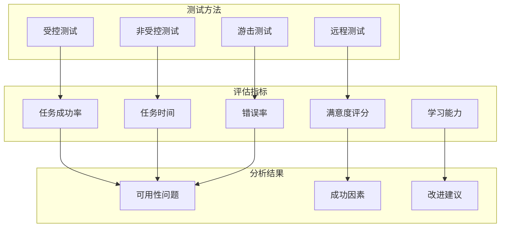

**图表来源**
- [usability.md](file://niopd/commands/UR/usability.md#L200-L300)

#### 测试方法对比

| 方法 | 优势 | 劣势 | 适用场景 |
|------|------|------|----------|
| 受控测试 | 深度洞察、实时观察 | 成本高、样本小 | 早期设计验证 |
| 非受控测试 | 大规模、成本低 | 缺乏深度 | 快速验证 |
| 游击测试 | 快速反馈、低成本 | 质量有限 | 初步概念测试 |
| 远程测试 | 地理多样性、自然环境 | 技术挑战 | 分布式用户测试 |

**章节来源**
- [usability.md](file://niopd/commands/UR/usability.md#L300-L299)

### 满意度测量（Satisfaction）

满意度分析指令采用多维度方法评估客户满意度：

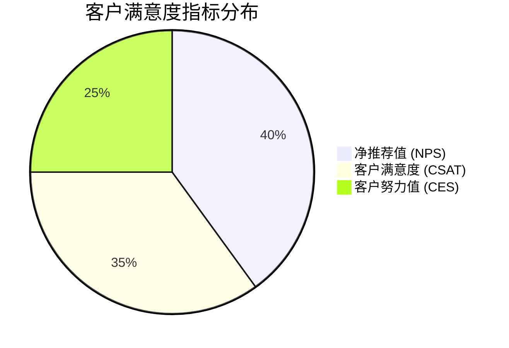

**图表来源**
- [satisfaction.md](file://niopd/commands/UR/satisfaction.md#L200-L300)

#### 核心指标

1. **净推荐值 (NPS)**：预测忠诚度和增长
2. **客户满意度 (CSAT)**：交易特定满意度
3. **客户努力值 (CES)**：易用性和体验

#### 分析框架

- **指标收集**：收集多种满意度指标
- **细分分析**：按客户类型、功能等细分
- **驱动因素分析**：识别影响满意度的因素
- **趋势分析**：跟踪随时间的变化
- **基准测试**：与行业标准比较

**章节来源**
- [satisfaction.md](file://niopd/commands/UR/satisfaction.md#L300-L417)

### 行为分析（Behavior）

行为分析指令分析用户行为数据，识别产品改进机会：

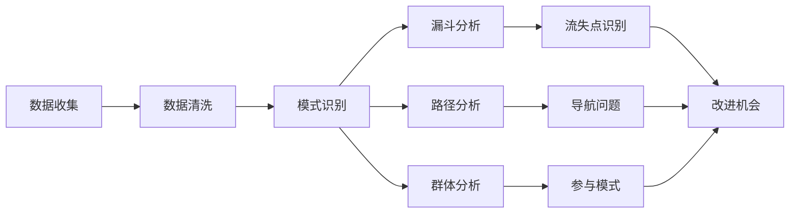

**图表来源**
- [behavior.md](file://niopd/commands/UR/behavior.md#L200-L300)

#### 分析类型

1. **漏斗分析**：跟踪用户进度和流失
2. **路径分析**：理解常见用户流程
3. **群体分析**：比较用户群体随时间的变化
4. **参与分析**：时间投入、使用频率等

#### 行为指标

- **激活率**：完成关键动作的百分比
- **参与度得分**：频率×广度×深度
- **流失率**：在每一步放弃的百分比
- **任务时间**：特定动作的持续时间
- **错误率**：失败动作的频率

**章节来源**
- [behavior.md](file://niopd/commands/UR/behavior.md#L300-L348)

### 待办任务（JTBD）

待办任务分析指令识别未满足的需求和创新机会：

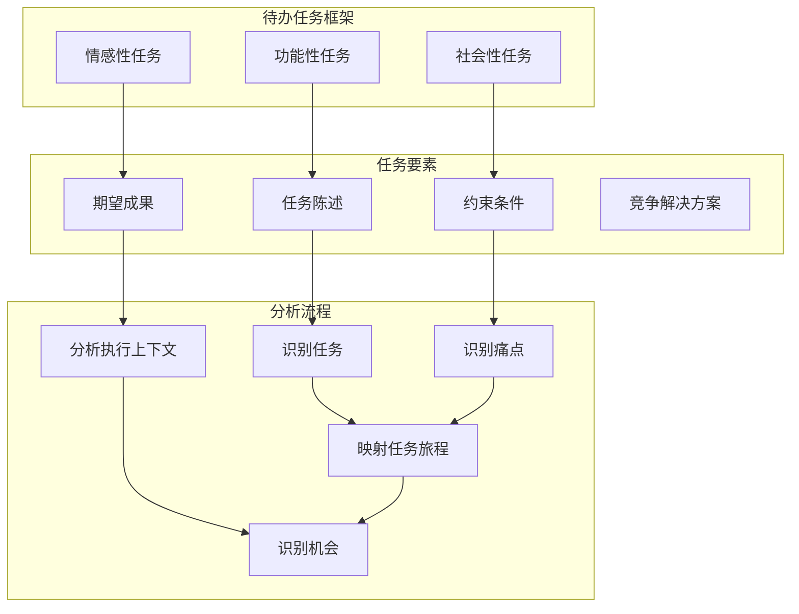

**图表来源**
- [jtbd.md](file://niopd/commands/UR/jtbd.md#L200-L400)

#### 任务类型

1. **功能性任务**：客户需要完成的实际任务
2. **情感性任务**：客户希望感受到的情绪
3. **社会性任务**：客户希望被他人如何看待

#### 任务陈述公式

"When [情境], I want to [动机], so I can [预期结果]."

**章节来源**
- [jtbd.md](file://niopd/commands/UR/jtbd.md#L400-L668)

### Kano模型（Kano）

Kano模型分析指令使用Kano框架分类产品特性：

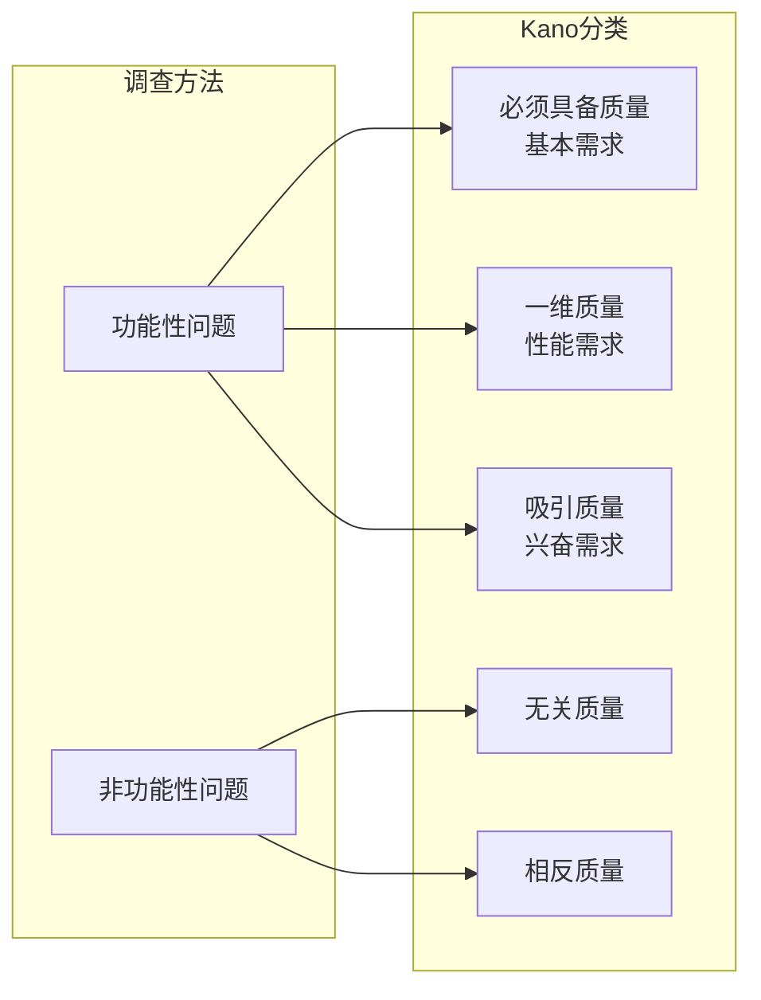

**图表来源**
- [kano.md](file://niopd/commands/UR/kano.md#L200-L400)

#### 分类特点

1. **必须具备质量**：缺失导致不满，但存在不增加满意
2. **一维质量**：线性关系 - 更多越好
3. **吸引质量**：意外的惊喜 - 存在创造高满意度
4. **无关质量**：不影响满意度
5. **相反质量**：存在反而降低满意度

#### 特性演进

- **吸引质量** → **一维质量** → **必须具备质量**（由于竞争和期望）
- 例子：汽车GPS - 1990年代的吸引质量 → 今天的必备功能

**章节来源**
- [kano.md](file://niopd/commands/UR/kano.md#L400-L673)

## 依赖关系分析

用户研究指令集内部存在复杂的依赖关系，形成了一个有机的整体：

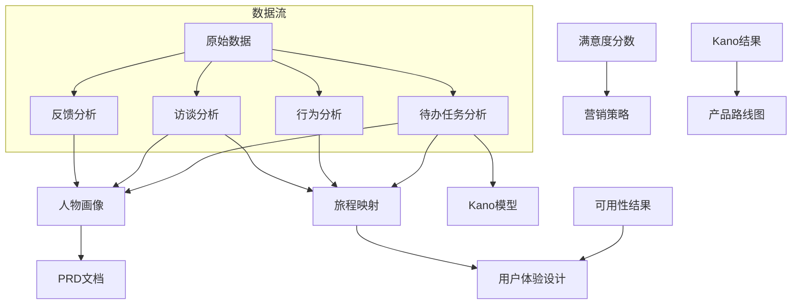

**图表来源**
- [personas.md](file://niopd/commands/UR/personas.md#L500-L576)
- [journey.md](file://niopd/commands/UR/journey.md#L350-L400)

### 数据依赖

1. **反馈分析**是**人物画像**的基础数据源
2. **访谈分析**同时服务于**人物画像**和**旅程映射**
3. **行为分析**为**旅程映射**提供实证数据支持
4. **待办任务分析**整合**人物画像**和**旅程映射**的洞察
5. **Kano模型**基于**待办任务分析**的结果进行特性分类

### 工具协作

各工具之间的协作遵循以下原则：

- **层次化分析**：从宏观到微观，从概念到具体
- **交叉验证**：不同工具的结果相互印证
- **互补性**：定量与定性分析相结合
- **迭代优化**：基于反馈不断改进分析质量

**章节来源**
- [personas.md](file://niopd/commands/UR/personas.md#L550-L576)
- [jtbd.md](file://niopd/commands/UR/jtbd.md#L600-L668)

## 性能考虑

用户研究指令集在设计时充分考虑了性能优化：

### 数据处理效率

- **批量处理**：支持大规模数据集的高效处理
- **内存管理**：优化内存使用，避免大数据集导致的性能问题
- **并发处理**：支持并行分析多个数据源
- **缓存机制**：对重复分析的数据进行缓存

### 分析算法优化

- **主题识别**：使用高效的文本聚类算法
- **情感分析**：采用轻量级情感评分模型
- **模式识别**：基于机器学习的快速模式检测
- **统计计算**：优化的统计分析算法

### 输出生成优化

- **模板引擎**：高效的Markdown模板渲染
- **增量更新**：支持部分更新而非全量重生成
- **压缩存储**：分析结果的压缩存储
- **并行导出**：多个报告的并行生成

## 故障排除指南

### 常见问题及解决方案

#### 数据质量问题

**问题**：输入数据格式不正确或质量差
**解决方案**：
- 使用预检查功能验证数据格式
- 提供数据清理建议
- 支持多种数据格式自动转换

**问题**：数据量不足导致分析不准确
**解决方案**：
- 设置最小数据量阈值
- 提供数据收集建议
- 显示分析置信度指标

#### 分析结果异常

**问题**：分析结果与预期不符
**解决方案**：
- 提供结果验证机制
- 显示分析过程和假设
- 允许手动调整分析参数

**问题**：某些工具无法运行
**解决方案**：
- 检查系统依赖和权限
- 提供替代分析方法
- 记录详细的错误日志

#### 输出格式问题

**问题**：生成的报告格式不正确
**解决方案**：
- 验证模板完整性
- 检查输出路径权限
- 提供格式预览功能

**章节来源**
- [personas.md](file://niopd/commands/UR/personas.md#L500-L576)
- [interview.md](file://niopd/commands/UR/interview.md#L250-L295)

## 结论

用户研究指令集是NioPD产品开发框架中的核心模块，提供了全面而系统的用户研究方法论。通过九个关键工具的协同工作，该指令集能够：

### 主要价值

1. **全面理解用户**：从多个角度深入理解用户需求和行为
2. **数据驱动决策**：基于实证数据而非假设进行产品决策
3. **团队对齐**：建立跨团队的共同用户语言和理解
4. **创新引导**：识别未满足的需求和创新机会
5. **持续改进**：支持产品开发的迭代优化过程

### 实践建议

1. **系统化应用**：按照推荐的顺序和方法使用各个工具
2. **数据整合**：充分利用不同工具产生的数据交叉验证
3. **迭代优化**：基于分析结果不断调整和改进
4. **团队协作**：确保跨职能团队参与分析过程
5. **持续监控**：建立持续的用户研究和反馈循环

### 发展方向

随着人工智能技术的发展，用户研究指令集将在以下方面继续演进：

- **自动化程度提升**：更多分析过程的自动化
- **智能洞察挖掘**：基于机器学习的深度洞察
- **实时分析能力**：支持实时用户行为分析
- **个性化分析**：针对特定用户群体的深度分析
- **集成度增强**：与其他产品开发工具的更好集成

用户研究指令集不仅是一个工具集合，更是一套完整的方法论体系，为产品团队提供了从理解用户到指导产品开发的全流程支持。通过系统化地运用这些工具，产品团队能够更好地把握用户需求，创造出真正满足用户价值的产品。