# AARRR海盗指标：增长黑客与产品运营的核心框架

<cite>
**本文档引用的文件**
- [aarrr-metrics.md](file://niopd/commands/PO/aarrr-metrics.md)
- [north-star.md](file://niopd/commands/PO/north-star.md)
- [kpis.md](file://niopd/commands/PM/kpis.md)
- [feature-metrics.md](file://niopd/commands/PM/feature-metrics.md)
- [README.md](file://README.md)
</cite>

## 目录
1. [引言](#引言)
2. [AARRR海盗指标理论基础](#aarrr海盗指标理论基础)
3. [五大增长阶段详解](#五大增长阶段详解)
4. [AARRR与产品运营的关系](#aarrr与产品运营的关系)
5. [数据追踪与报告生成](#数据追踪与报告生成)
6. [漏斗瓶颈诊断与优化](#漏斗瓶颈诊断与优化)
7. [SaaS产品指标优化案例](#saas产品指标优化案例)
8. [与其他增长框架的对比](#与其他增长框架的对比)
9. [实施指南与最佳实践](#实施指南与最佳实践)
10. [总结](#总结)

## 引言

在当今竞争激烈的数字产品环境中，增长黑客和产品运营的核心任务是如何有效地推动用户从"获取"到"变现"的完整旅程。AARRR海盗指标（Acquisition, Activation, Retention, Referral, Revenue）作为一种经典的端到端增长框架，为产品团队提供了系统性的思考和行动指导。

本文档基于NioPD平台的AARRR Metrics分析功能，深入探讨这一框架的理论基础、实践应用以及在实际产品运营中的价值。通过结合数据追踪、报告生成和案例分析，我们将展示如何利用AARRR框架诊断增长瓶颈、制定优化策略，并最终实现可持续的业务增长。

## AARRR海盗指标理论基础

### 框架起源与发展

AARRR海盗指标由500 Startups的Dave McClure于2007年创建，是一种基于漏斗模型的增长分析框架。该框架的核心理念是将用户增长视为一个完整的端到端旅程，而非孤立的指标集合。

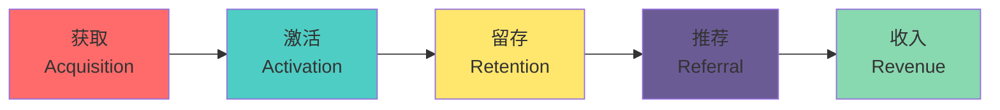

**图表来源**
- [aarrr-metrics.md](file://niopd/commands/PO/aarrr-metrics.md#L15-L30)

### 核心原则

AARRR框架基于以下核心原则：

1. **端到端视角**：关注完整的客户生命周期，而非孤立指标
2. **漏斗序列**：各阶段之间存在因果关系和依赖关系
3. **优化顺序**：从底层（Retention）向上层（Revenue）优化
4. **相互促进**：良好的Retention会放大Acquisition效果，Referral能放大Retention效果

### 框架优势

- **完整性**：涵盖用户增长的各个关键阶段
- **实用性**：提供具体的行动指导
- **可测量性**：每个阶段都有明确的量化指标
- **可优化性**：识别瓶颈并制定针对性策略

**章节来源**
- [aarrr-metrics.md](file://niopd/commands/PO/aarrr-metrics.md#L15-L30)

## 五大增长阶段详解

### 1. 获取（Acquisition）

获取阶段是用户旅程的起点，关注如何吸引用户访问产品并转化为注册用户。

#### 核心指标

| 指标类别 | 具体指标 | 描述 | 目标值 |
|---------|---------|------|--------|
| 流量指标 | 总访客数、新访客数 | 网站或应用的访问量 | 持续增长 |
| 转化指标 | 注册转化率、点击率 | 访客转化为用户的比例 | >5% |
| 渠道指标 | CPA（每次获取成本）、ROI | 不同渠道的效率 | 最小化成本 |
| 质量指标 | 跳出率、平均停留时间 | 访客质量评估 | 降低跳出率 |

#### 优化策略

- **渠道优化**：识别和投资高转化率的获取渠道
- **内容营销**：创建有价值的内容吸引目标用户
- **SEO/SEM**：优化搜索引擎排名和付费广告
- **社交媒体**：利用社交平台扩大品牌影响力
- **合作伙伴**：建立渠道合作关系

### 2. 激活（Activation）

激活阶段关注用户首次体验产品核心价值的过程，决定用户是否真正"喜欢"产品。

#### 核心指标

| 指标类别 | 具体指标 | 描述 | 目标值 |
|---------|---------|------|--------|
| 激活率 | 首次使用率、功能完成率 | 用户完成关键动作的比例 | 25-40% |
| 时间指标 | 首次使用时间、激活时间 | 用户达到"aha moment"的速度 | <24小时 |
| 留存指标 | Day 1/Day 7激活率 | 短期激活后的留存情况 | >20% |
| 质量指标 | 用户满意度、反馈评分 | 用户对初次体验的评价 | >4.0/5.0 |

#### 优化策略

- **简化注册流程**：减少注册步骤和表单字段
- **引导教程**：提供清晰的新手引导
- **价值传递**：在首屏突出核心价值主张
- **A/B测试**：测试不同的激活策略
- **个性化**：根据用户特征定制激活体验

### 3. 留存（Retention）

留存阶段是AARRR框架的基础，关注用户长期使用产品的意愿和频率。

#### 核心指标

| 指标类别 | 具体指标 | 描述 | 目标值 |
|---------|---------|------|--------|
| 留存率 | DAU/MAU比率、月度留存率 | 用户活跃度和粘性 | >20% |
| 频率指标 | 每周使用次数、每日使用时长 | 用户使用频率 | 持续增长 |
| 离网率 | 月度/年度离网率 | 用户流失情况 | <10%/年 |
| 活跃度 | 活跃用户数量、峰值使用时间 | 用户参与度 | 稳定增长 |

#### 优化策略

- **产品价值**：持续提升产品核心价值
- **用户体验**：优化界面设计和交互流程
- **社区建设**：建立用户社区和互动机制
- **定期更新**：保持产品的新鲜感和竞争力
- **用户反馈**：建立有效的反馈收集和响应机制

### 4. 推荐（Referral）

推荐阶段关注用户主动传播产品的能力，这是实现病毒式增长的关键。

#### 核心指标

| 指标类别 | 具体指标 | 描述 | 目标值 |
|---------|---------|------|--------|
| 推荐率 | 用户推荐比例、推荐人数 | 主动推荐产品的用户比例 | >10% |
| 病毒系数 | K因子、推荐循环时间 | 推荐传播的效率 | >0.5 |
| NPS分数 | 净推荐值 | 用户推荐意愿的量化 | >50 |
| 渠道效率 | 不同渠道的推荐效果 | 各推广渠道的表现 | 持续优化 |

#### 优化策略

- **激励机制**：设计有效的推荐奖励体系
- **社交功能**：内置分享和邀请功能
- **口碑营销**：培养品牌忠诚度和口碑
- **内容传播**：创造易于分享的内容
- **合作伙伴**：与其他产品建立推荐关系

### 5. 收入（Revenue）

收入阶段是产品商业化的最终目标，关注如何将用户转化为付费客户。

#### 核心指标

| 指标类别 | 具体指标 | 描述 | 目标值 |
|---------|---------|------|--------|
| 转化率 | 试用转付费率、免费转付费率 | 用户付费转化情况 | >5% |
| 收入指标 | ARPU（每用户平均收入）、LTV | 收入水平和用户价值 | 持续增长 |
| 付费率 | 付费用户比例、付费深度 | 用户付费程度 | >20% |
| 回报率 | CLV:CAC比率、投资回报率 | 获客成本与收益比 | >3:1 |

#### 优化策略

- **定价策略**：设计合理的定价模型
- **增值服务**：提供高价值的附加功能
- **交叉销售**：推广相关产品和服务
- **客户关系**：建立长期的客户关系
- **订阅模式**：优化订阅和续费流程

**章节来源**
- [aarrr-metrics.md](file://niopd/commands/PO/aarrr-metrics.md#L17-L60)

## AARRR与产品运营的关系

### 产品运营的三大支柱

AARRR框架与产品运营的三个核心支柱紧密对应：

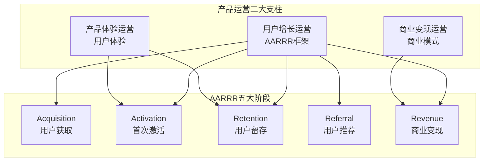

**图表来源**
- [aarrr-metrics.md](file://niopd/commands/PO/aarrr-metrics.md#L35-L45)

### 框架演进

随着产品发展阶段的变化，AARRR框架也在不断演进：

#### AARRR+
在原有基础上增加"Awareness"（认知）阶段，形成更完整的增长漏斗。

#### AARRR+++
进一步细化为六个阶段：Awareness、Acquisition、Activation、Retention、Referral、Revenue。

### 实践价值

AARRR框架在产品运营中的实践价值体现在：

1. **系统性思考**：避免只关注单一指标的局限
2. **优先级排序**：指导资源分配和优化重点
3. **跨部门协作**：统一增长目标和行动方向
4. **数据驱动决策**：基于量化指标制定策略
5. **持续优化**：建立闭环的优化机制

**章节来源**
- [aarrr-metrics.md](file://niopd/commands/PO/aarrr-metrics.md#L45-L55)

## 数据追踪与报告生成

### NioPD AARRR Metrics功能

NioPD平台提供了强大的AARRR Metrics分析功能，能够自动化收集、分析和生成增长报告。

#### 核心功能特性

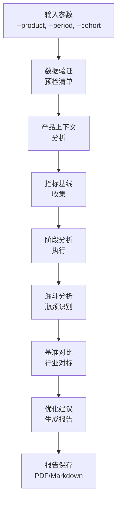

**图表来源**
- [aarrr-metrics.md](file://niopd/commands/PO/aarrr-metrics.md#L62-L88)

#### 数据收集流程

1. **预检清单**：验证产品名称、工作空间和参数有效性
2. **产品上下文**：定义产品类型、业务模式和目标用户
3. **指标基线**：收集当前各阶段的关键指标数据
4. **阶段分析**：逐个分析Acquisition、Activation、Retention、Referral、Revenue
5. **漏斗分析**：识别整体漏斗中的瓶颈环节
6. **基准对比**：与行业标准进行对比分析
7. **优化建议**：基于数据分析提供具体改进建议

#### 报告模板结构

NioPD生成的标准AARRR分析报告包含以下核心部分：

| 报告章节 | 内容概述 | 数据要求 |
|---------|---------|----------|
| 执行摘要 | 关键发现和建议 | 综合分析结果 |
| 产品上下文 | 产品基本信息 | 产品类型、目标用户 |
| 获取分析 | 渠道表现和优化 | 流量、转化率、成本 |
| 激活分析 | 首次体验效果 | 激活率、时间、路径 |
| 留存分析 | 用户粘性和流失 | 留存率、活跃度、离网 |
| 推荐分析 | 病毒传播效果 | 推荐率、NPS、K因子 |
| 收入分析 | 商业化成效 | 转化率、收入、LTV |
| 漏斗分析 | 整体增长效率 | 累积转化率、瓶颈识别 |
| 瓶颈分析 | 关键优化点 | 影响度、改善潜力 |
| 优化建议 | 具体行动计划 | 优先级、资源需求 |
| 实施计划 | 时间线和责任 | 阶段性目标 |
| 监控计划 | 持续跟踪机制 | 关键指标、阈值设置 |

### 数据追踪最佳实践

#### 关键指标定义

为了有效追踪AARRR指标，需要明确定义每个阶段的核心指标：

**Acquisition阶段指标**
- 总访客数（Total Visitors）
- 新注册用户数（New Signups）
- 渠道来源分布（Traffic Sources）
- 转化率（Conversion Rate）
- 获取成本（Cost Per Acquisition）

**Activation阶段指标**
- 首次使用用户数（First Session Users）
- 关键功能完成率（Key Feature Completion）
- 激活时间（Time to Activation）
- 激活率（Activation Rate）
- 用户满意度（User Satisfaction）

**Retention阶段指标**
- 日活跃用户数（DAU）
- 月活跃用户数（MAU）
- 留存率（Retention Rate）
- 离网率（Churn Rate）
- 用户生命周期价值（LTV）

**Referral阶段指标**
- 推荐率（Referral Rate）
- 病毒系数（Viral Coefficient）
- 净推荐值（NPS）
- 推荐来源（Referral Sources）
- 推荐转化率（Referral Conversion）

**Revenue阶段指标**
- 收入转化率（Revenue Conversion Rate）
- 平均收入用户（ARPU）
- 客户终身价值（CLV）
- 收入增长率（Revenue Growth Rate）
- 投资回报率（ROI）

#### 数据收集策略

1. **埋点设计**：在关键用户路径上设置数据埋点
2. **工具选择**：选择合适的数据分析工具（Google Analytics、Mixpanel等）
3. **数据质量**：确保数据准确性、完整性和及时性
4. **隐私合规**：遵守GDPR等数据保护法规
5. **实时监控**：建立实时数据监控和告警机制

**章节来源**
- [aarrr-metrics.md](file://niopd/commands/PO/aarrr-metrics.md#L88-L117)

## 漏斗瓶颈诊断与优化

### 瓶颈识别方法

AARRR框架的核心价值在于能够识别和定位增长漏斗中的瓶颈环节。

#### 漏斗分析流程

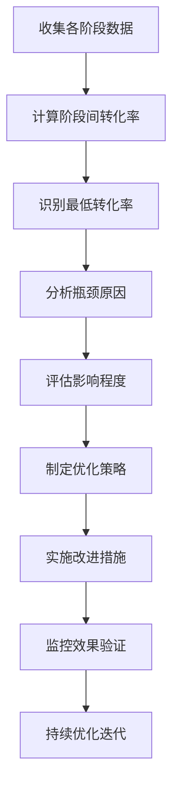

**图表来源**
- [aarrr-metrics.md](file://niopd/commands/PO/aarrr-metrics.md#L154-L180)

#### 瓶颈类型识别

根据NioPD的分析框架，常见的增长瓶颈包括：

| 瓶颈类型 | 特征表现 | 根本原因 | 优化策略 |
|---------|---------|----------|----------|
| 获取瓶颈 | 转化率低、成本高 | 渠道效果差、定位不准确 | 优化渠道策略、精准定位 |
| 激活瓶颈 | 首次使用率低 | 价值传递不足、流程复杂 | 简化流程、强化价值 |
| 留存瓶颈 | 离网率高、活跃度低 | 产品价值不足、用户体验差 | 提升产品价值、优化体验 |
| 推荐瓶颈 | 推荐率低、传播弱 | 用户满意度低、激励不足 | 提升满意度、优化激励 |
| 收入瓶颈 | 转化率低、ARPU低 | 定价不合理、价值感知不足 | 优化定价、强化价值 |

### 优先级评估矩阵

基于影响程度和改善难度，对识别的瓶颈进行优先级排序：

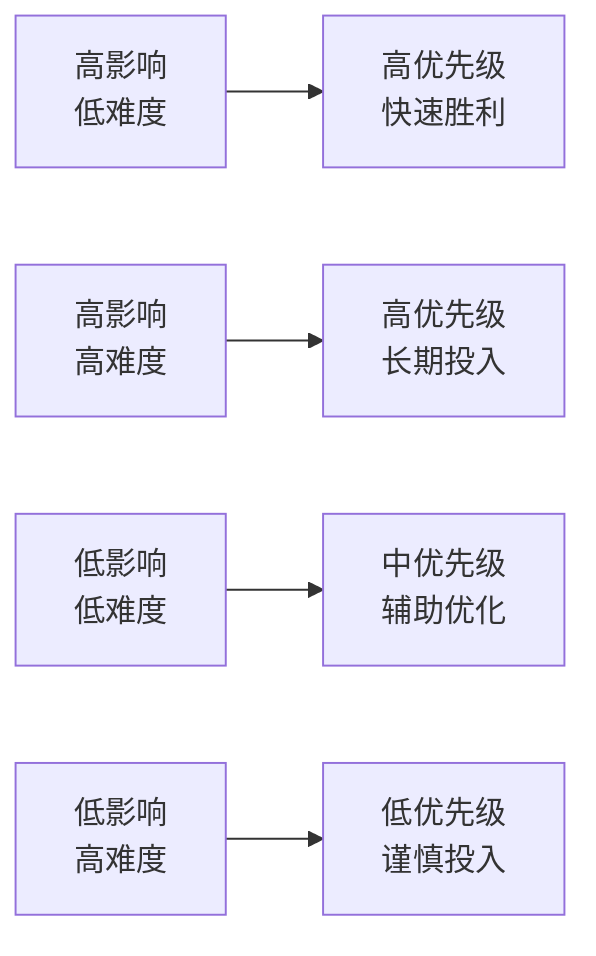

**图表来源**
- [aarrr-metrics.md](file://niopd/commands/PO/aarrr-metrics.md#L154-L180)

### 优化策略制定

#### 数据驱动的优化决策

1. **定量分析**：基于数据计算瓶颈的具体影响
2. **定性分析**：通过用户调研理解根本原因
3. **成本效益分析**：评估优化投入产出比
4. **风险评估**：识别实施过程中的潜在风险
5. **资源匹配**：确保优化方案与团队能力匹配

#### 优化实施框架

| 优化阶段 | 具体行动 | 时间框架 | 负责团队 |
|---------|---------|----------|----------|
| 快速胜利 | 易实施的改进措施 | 1-2周 | 产品/运营团队 |
| 中期优化 | 需要协调的改进 | 1-3个月 | 产品/技术/运营 |
| 长期战略 | 深度产品优化 | 3-6个月 | 产品/技术/市场 |
| 持续迭代 | 监控和微调 | 持续进行 | 全团队 |

**章节来源**
- [aarrr-metrics.md](file://niopd/commands/PO/aarrr-metrics.md#L182-L235)

## SaaS产品指标优化案例

### 案例背景

以一家新兴的SaaS项目管理工具为例，该产品处于快速增长阶段，但在用户留存和收入转化方面遇到瓶颈。

#### 当前指标表现

| 阶段 | 当前指标 | 行业基准 | 差距分析 |
|------|---------|----------|----------|
| Acquisition | 注册转化率 8% | 15-20% | 低6-12% |
| Activation | 首次使用率 25% | 30-40% | 低5-15% |
| Retention | Day 30留存率 15% | 20-30% | 低5-15% |
| Referral | 推荐率 5% | 10-15% | 低5-10% |
| Revenue | 付费转化率 3% | 5-8% | 低2-5% |

### 问题诊断

#### 漏斗瓶颈分析

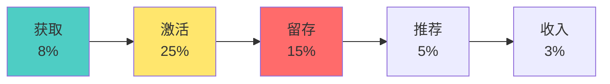

**图表来源**
- [aarrr-metrics.md](file://niopd/commands/PO/aarrr-metrics.md#L154-L180)

#### 关键瓶颈识别

1. **激活阶段**：首次使用率低于行业标准10%
2. **留存阶段**：30天留存率低于行业标准10%
3. **收入阶段**：付费转化率低于行业标准5%

### 优化策略实施

#### 第一阶段：激活优化（1-2周）

**目标**：提高首次使用率至35%

**具体措施**：
- 简化注册流程，减少必填字段
- 优化新手引导，突出核心价值
- 提供免费试用模板，降低使用门槛
- 增加社交证明，展示成功案例

**预期效果**：
- 注册转化率提升至12%
- 首次使用率提升至35%
- 激活时间缩短至24小时内

#### 第二阶段：留存优化（1-3个月）

**目标**：提高30天留存率至25%

**具体措施**：
- 基于用户行为分析，推送个性化内容
- 建立用户成长体系，设置里程碑奖励
- 优化产品功能，解决高频使用场景
- 建立用户社区，增强用户粘性

**预期效果**：
- 30天留存率提升至25%
- 用户生命周期价值提升20%
- 离网率降低至8%

#### 第三阶段：收入优化（3-6个月）

**目标**：提高付费转化率至6%

**具体措施**：
- 设计分层定价策略，满足不同需求
- 推出限时优惠，刺激早期付费
- 提供免费增值模式，降低付费门槛
- 建立客户成功体系，提升付费意愿

**预期效果**：
- 付费转化率提升至6%
- ARPU提升30%
- 客户终身价值提升50%

### 实施效果跟踪

#### 关键指标监控

| 指标类别 | 监控频率 | 目标值 | 当前进度 |
|---------|---------|--------|----------|
| 激活率 | 每日 | 35% | 28% (+3%月) |
| 留存率 | 每周 | 25% | 18% (+2%月) |
| 付费转化率 | 每周 | 6% | 4% (+0.5%月) |
| 用户满意度 | 每月 | 4.5/5.0 | 3.8/5.0 (+0.1/月) |

#### 效果评估

经过6个月的系统性优化，该SaaS项目实现了显著的增长改善：

- **整体漏斗转化率**：从1.2%提升至3.6%，提升3倍
- **用户增长率**：月度增长率从8%提升至18%
- **收入增长率**：季度收入增长率达到45%
- **客户满意度**：NPS从25提升至45

### 经验总结

1. **系统性方法**：AARRR框架提供了系统性的分析和优化方法
2. **数据驱动**：基于数据的瓶颈识别和效果评估至关重要
3. **渐进式改进**：分阶段实施优化策略，降低风险
4. **持续监控**：建立持续的监控和反馈机制
5. **用户中心**：始终以用户价值为核心驱动力

**章节来源**
- [aarrr-metrics.md](file://niopd/commands/PO/aarrr-metrics.md#L182-L235)

## 与其他增长框架的对比

### AARRR vs. North Star Metric

#### 核心差异

| 对比维度 | AARRR框架 | North Star Metric |
|---------|-----------|-------------------|
| 关注焦点 | 多个增长阶段 | 单一核心指标 |
| 应用场景 | 整体增长分析 | 战略目标对齐 |
| 实施复杂度 | 较高（需要多个指标） | 较低（聚焦单一指标） |
| 适用阶段 | 产品成熟期 | 产品各阶段均可 |
| 决策支持 | 提供具体优化方向 | 提供战略一致性 |

#### 协同作用

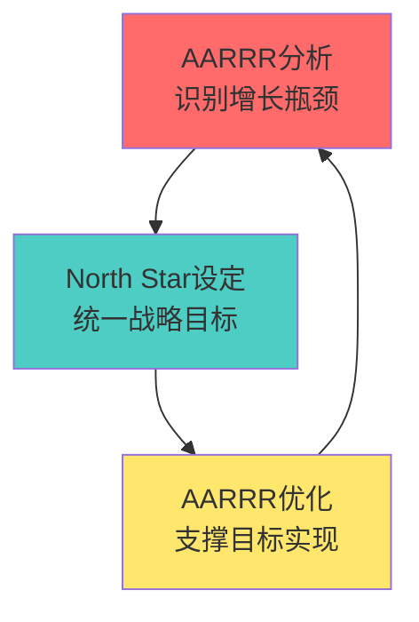

**图表来源**
- [north-star.md](file://niopd/commands/PO/north-star.md#L46-L101)

### AARRR vs. HEART Framework

#### 框架互补性

| 框架 | 核心维度 | 度量重点 | 应用场景 |
|------|---------|----------|----------|
| AARRR | Acquisition, Activation, Retention, Referral, Revenue | 转化率、留存率、收入 | 用户增长漏斗分析 |
| HEART | Happiness, Engagement, Adoption, Retention, Task Success | 用户体验、使用频率 | 产品体验优化 |

#### 实践应用

在实际产品运营中，这两个框架可以有机结合：

1. **AARRR指导增长方向**：识别各阶段的优化重点
2. **HEART补充体验细节**：深入了解用户感受和行为
3. **共同支撑产品决策**：既关注增长效率，也注重用户体验

### AARRR vs. OKRs

#### 目标管理对比

| 对比维度 | AARRR | OKRs |
|---------|-------|------|
| 目标性质 | 增长指标 | 战略目标 |
| 时间框架 | 短期（月度/季度） | 中长期（季度/年度） |
| 跨部门协作 | 产品运营团队 | 全公司对齐 |
| 衡量方式 | 数字化指标 | 定性和定量结合 |

#### 协同机制

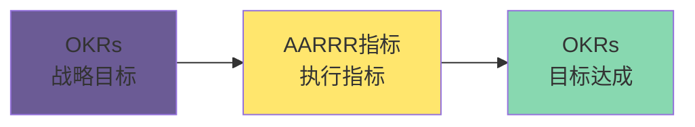

**图表来源**
- [kpis.md](file://niopd/commands/PM/kpis.md#L15-L30)

### 框架选择指南

#### 选择原则

1. **产品阶段**：初创期适合AARRR，成熟期适合North Star
2. **团队规模**：小团队适合AARRR，大团队适合North Star
3. **目标导向**：短期增长用AARRR，长期战略用North Star
4. **资源限制**：资源有限时优先AARRR，资源充足时结合使用

#### 实践建议

- **早期阶段**：主要使用AARRR框架进行增长分析
- **中期阶段**：引入North Star指标，统一团队目标
- **成熟阶段**：结合多种框架，实现精细化运营

**章节来源**
- [north-star.md](file://niopd/commands/PO/north-star.md#L46-L101)
- [kpis.md](file://niopd/commands/PM/kpis.md#L15-L30)

## 实施指南与最佳实践

### 实施准备阶段

#### 1. 团队组建与培训

**核心团队构成**：
- **产品经理**：负责整体策略制定和协调
- **数据分析师**：负责数据收集、分析和报告
- **运营人员**：负责具体优化措施的执行
- **技术团队**：负责数据埋点和技术支持

**培训重点**：
- AARRR框架理论基础
- 数据指标定义和计算方法
- 分析工具使用技巧
- 报告解读和应用方法

#### 2. 工具和基础设施准备

**必备工具**：
- **数据分析平台**：Google Analytics、Mixpanel、Amplitude
- **CRM系统**：用户管理和客户关系维护
- **营销自动化**：获取渠道管理和效果追踪
- **A/B测试工具**：实验设计和效果评估

**技术准备**：
- 用户行为埋点设计
- 数据仓库搭建
- 实时监控仪表板
- 数据质量管理

### 实施执行阶段

#### 1. 数据收集与验证

**数据收集流程**：

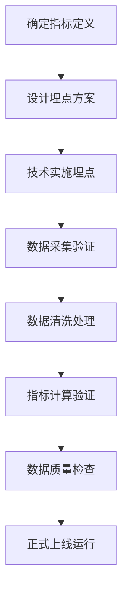

**质量控制要点**：
- **准确性**：确保数据计算逻辑正确
- **完整性**：避免数据丢失和缺失
- **及时性**：保证数据更新频率
- **一致性**：统一指标定义和口径

#### 2. 分析报告生成

**报告生成流程**：

| 阶段 | 输入 | 输出 | 负责人 |
|------|------|------|--------|
| 数据收集 | 原始数据 | 清洗数据 | 数据工程师 |
| 指标计算 | 清洗数据 | 指标数据 | 数据分析师 |
| 分析解读 | 指标数据 | 分析结论 | 产品经理 |
| 报告生成 | 分析结论 | 报告文档 | 运营人员 |
| 审核发布 | 报告文档 | 最终报告 | 产品总监 |

#### 3. 优化策略制定

**策略制定框架**：

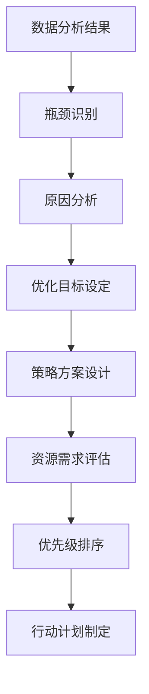

### 持续优化阶段

#### 1. 监控和预警机制

**监控指标体系**：

| 监控级别 | 监控频率 | 关键指标 | 告警阈值 |
|---------|---------|----------|----------|
| 实时 | 每小时 | 新增用户、活跃度 | 突然下降10% |
| 日度 | 每日 | 转化率、留存率 | 连续3天下降5% |
| 周度 | 每周 | 收入、成本 | 偏离目标15% |
| 月度 | 每月 | 整体漏斗效率 | 偏离基准20% |

**预警响应机制**：
- **一级告警**：立即通知相关负责人
- **二级告警**：2小时内召开紧急会议
- **三级告警**：24小时内提交改进方案

#### 2. 效果评估和迭代

**评估周期**：
- **短期评估**：1-2周，验证快速优化效果
- **中期评估**：1-3个月，评估中等优化效果
- **长期评估**：3-6个月，评估战略优化效果

**迭代优化流程**：

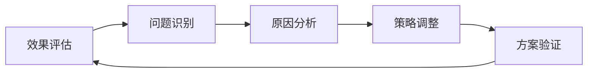

### 最佳实践总结

#### 1. 数据驱动决策

- **基于事实**：所有决策都基于数据分析结果
- **量化评估**：使用具体数值评估优化效果
- **持续验证**：定期验证假设和结论的正确性
- **透明沟通**：向团队和利益相关者透明展示数据和结论

#### 2. 用户中心思维

- **用户价值优先**：所有优化都以提升用户价值为目标
- **用户体验导向**：关注用户使用过程中的真实体验
- **用户反馈整合**：将用户反馈纳入优化决策
- **长期关系建立**：重视与用户的长期关系建设

#### 3. 系统性方法

- **端到端视角**：关注完整的用户旅程
- **相互促进**：认识到各阶段之间的相互影响
- **资源优化**：合理分配有限的资源
- **持续改进**：建立持续优化的文化和机制

#### 4. 跨部门协作

- **统一目标**：确保各部门对增长目标的一致认同
- **信息共享**：建立跨部门的信息共享机制
- **责任明确**：明确各部门在增长过程中的职责
- **协同作战**：建立跨部门的协同工作机制

**章节来源**
- [aarrr-metrics.md](file://niopd/commands/PO/aarrr-metrics.md#L515-L574)

## 总结

AARRR海盗指标作为增长黑客和产品运营的核心框架，在数字化时代具有重要的理论价值和实践意义。通过本文档的深入分析，我们可以看到：

### 核心价值回顾

1. **系统性增长思维**：AARRR框架提供了一个完整的用户增长分析框架，帮助产品团队系统性地思考和优化增长策略。

2. **端到端视角**：强调从获取到变现的完整用户旅程，避免了孤立指标分析的局限性。

3. **数据驱动决策**：基于量化指标的分析和优化，提高了决策的科学性和有效性。

4. **可操作性强**：每个阶段都有明确的指标定义和优化方向，便于团队落地执行。

### 实践应用启示

1. **框架选择**：根据产品发展阶段和团队特点选择合适的增长框架，必要时结合使用。

2. **数据基础设施**：建立完善的数据收集和分析体系是成功应用AARRR框架的基础。

3. **持续优化文化**：建立持续的监控、分析和优化机制，形成良性的增长循环。

4. **用户价值导向**：所有增长策略都应以提升用户价值为核心目标。

### 未来发展展望

随着人工智能和大数据技术的发展，AARRR框架的应用将更加智能化和精细化：

- **智能分析**：利用AI技术自动识别增长瓶颈和优化机会
- **预测模型**：基于历史数据预测未来的增长趋势和效果
- **个性化策略**：针对不同用户群体制定个性化的增长策略
- **实时优化**：建立实时的数据监控和优化响应机制

### 结语

AARRR海盗指标不仅仅是一个分析框架，更是一种思维方式和工作方法。它教会我们如何系统性地思考用户增长，如何基于数据做出明智的决策，如何在复杂的商业环境中找到增长的突破口。对于任何希望实现可持续增长的产品团队来说，掌握和应用AARRR框架都是不可或缺的核心技能。

通过NioPD平台的强大功能，产品团队可以更加高效地应用AARRR框架，实现从数据收集到策略优化的全流程自动化，从而在激烈的市场竞争中占据有利地位。