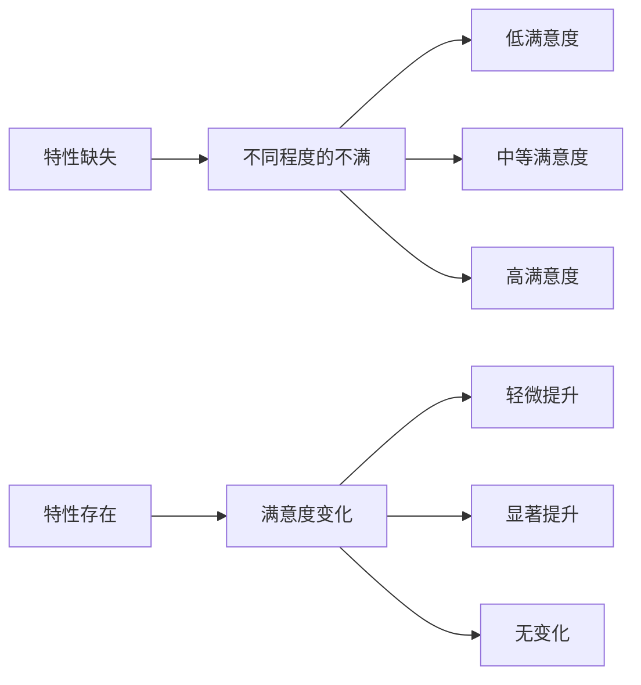
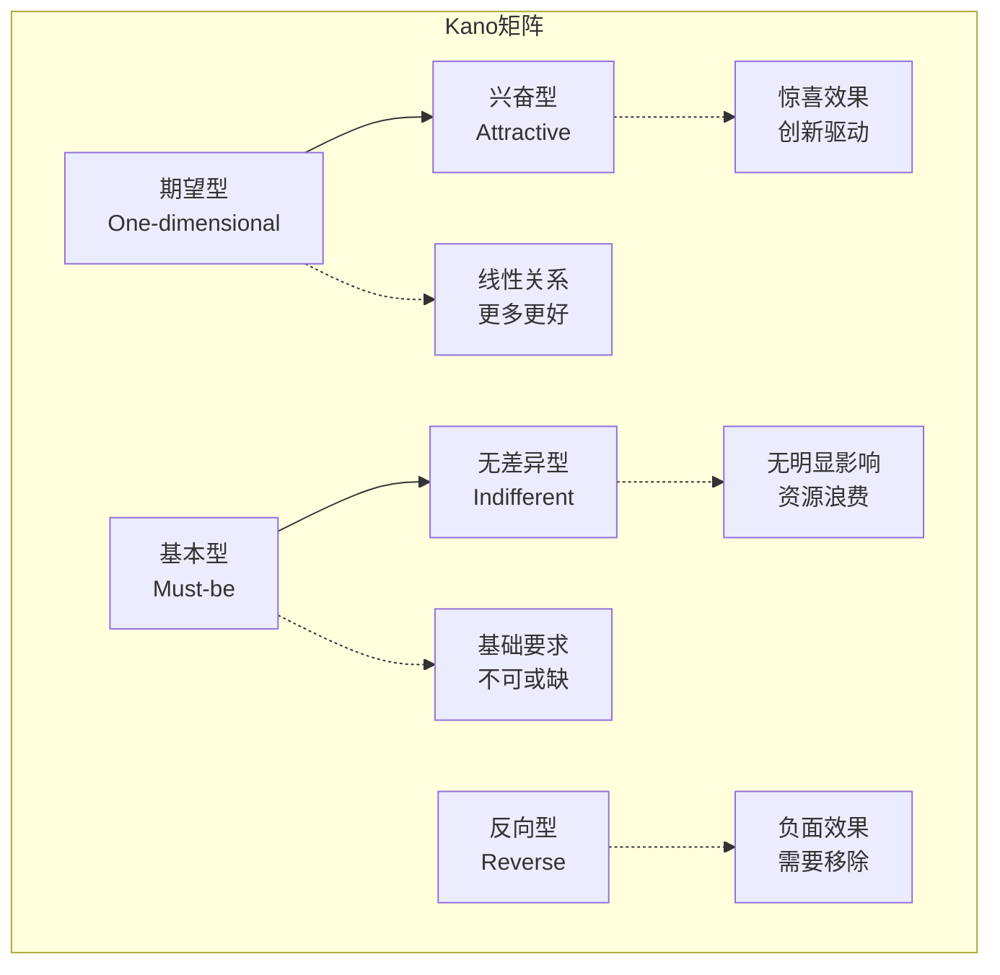
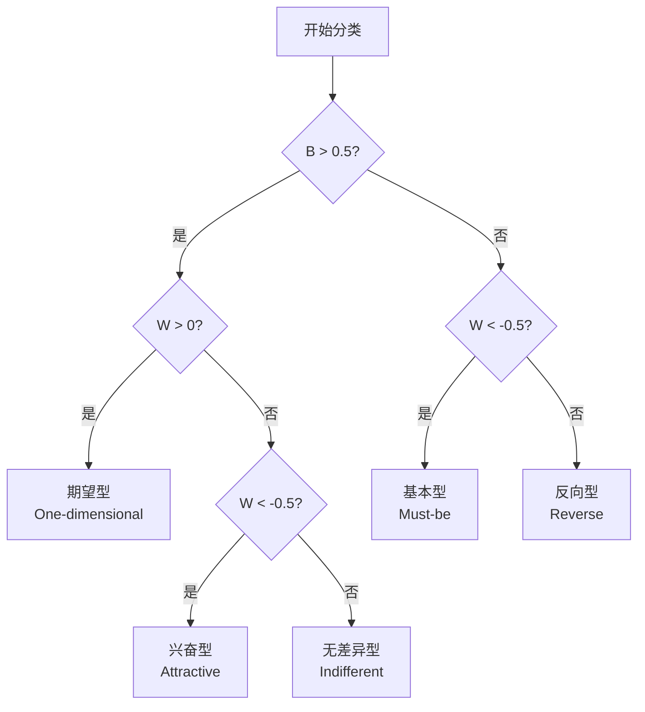
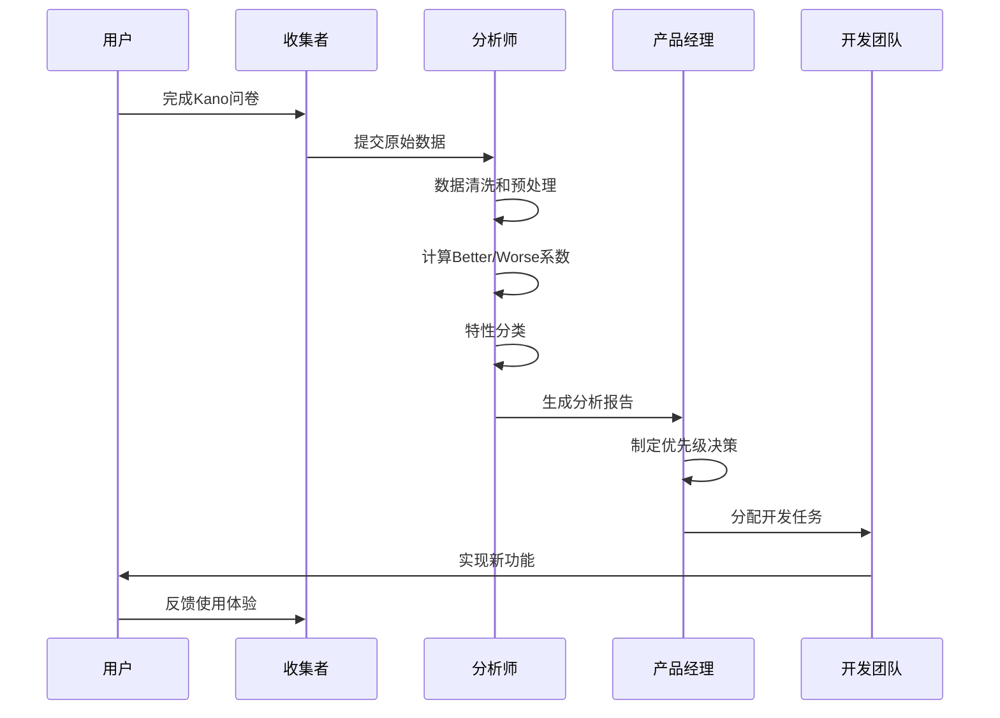
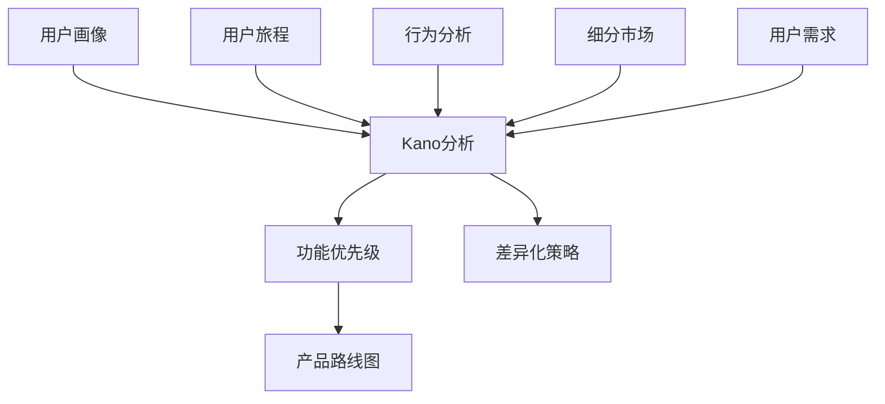

# Kano模型：用户满意度驱动因素识别与产品功能优先级优化

<cite>
**本文档中引用的文件**
- [kano.md](file://niopd/commands/UR/kano.md)
- [interview-summary-template.md](file://niopd/templates/interview-summary-template.md)
- [personas.md](file://niopd/commands/UR/personas.md)
- [satisfaction.md](file://niopd/commands/UR/satisfaction.md)
- [journey.md](file://niopd/commands/UR/journey.md)
- [behavior.md](file://niopd/commands/UR/behavior.md)
- [interview.md](file://niopd/commands/UR/interview.md)
- [persona-template.md](file://niopd/templates/persona-template.md)
</cite>

## 目录
1. [引言](#引言)
2. [Kano模型理论基础](#kano模型理论基础)
3. [五类需求分类详解](#五类需求分类详解)
4. [调研设计与实施](#调研设计与实施)
5. [结果解读与分析](#结果解读与分析)
6. [问卷设计模板](#问卷设计模板)
7. [分析路径与流程](#分析路径与流程)
8. [实际应用案例](#实际应用案例)
9. [与其他方法的结合](#与其他方法的结合)
10. [最佳实践与建议](#最佳实践与建议)
11. [总结](#总结)

## 引言

在当今竞争激烈的市场环境中，准确识别用户的真实满意度驱动因素是产品成功的关键。传统的满意度测量方法往往无法区分哪些功能真正影响用户满意度，哪些只是表面现象。Kano模型作为一种独特的质量功能展开（QFD）工具，能够帮助我们深入理解产品特性与客户满意度之间的非线性关系，从而优化产品功能优先级，实现资源的最优配置。

## Kano模型理论基础

### 发展历程

Kano模型由东京科学技术大学的园部信夫教授于1980年代开发，最初用于解决日本制造业中的产品质量问题。该模型突破了传统质量管理的线性思维，认识到产品特性和用户满意度之间存在复杂的非线性关系。

### 核心原理

Kano模型的核心观点是：**并非所有产品特性都以相同的方式影响用户满意度**。某些特性缺失会导致强烈不满，但即使增加也不会显著提升满意度；而另一些特性则能在满足基本要求的基础上创造惊喜，大幅提升用户满意度。

### 非线性关系特征



**图表来源**
- [kano.md](file://niopd/commands/UR/kano.md#L15-L30)

## 五类需求分类详解

### 1. 基本型需求（Must-be Quality）

**特征描述：**
- **缺失时**：强烈的不满情绪
- **存在时**：保持中性，视为理所当然
- **满意度曲线**：特性存在与否对满意度产生重大影响

**典型示例：**
- 安全性：系统不安全会导致用户极度不满
- 可靠性：服务中断会严重影响用户体验
- 核心功能：产品的主要使用功能

**处理策略：**
- 必须实现，不容妥协
- 不要过度投资，避免资源浪费
- 确保达到行业标准或竞争对手水平

### 2. 期望型需求（One-dimensional Quality）

**特征描述：**
- **线性关系**：特性越多，满意度越高
- **可量化**：性能指标直接影响用户感知
- **竞争关键**：是差异化的重要维度

**典型示例：**
- 处理速度：更快的响应时间带来更高满意度
- 存储容量：更大的存储空间更受欢迎
- 功能丰富度：更多可用功能提升价值感

**处理策略：**
- 投资比例应与市场竞争地位相匹配
- 关注竞争对手的性能表现
- 建立明确的性能基准

### 3. 兴奋型需求（Attractive Quality）

**特征描述：**
- **缺失时**：中性反应，不期待
- **存在时**：创造高度满意和惊喜
- **创新来源**：通常是新颖、独特的产品特性

**典型示例：**
- 人工智能助手：智能推荐功能
- 增强现实体验：AR功能应用
- 个性化定制：深度个性化选项

**处理策略：**
- 作为差异化的核心要素
- 投资于创新和研发
- 建立技术壁垒

### 4. 无差异型需求（Indifferent Quality）

**特征描述：**
- **存在或缺失**：对满意度无明显影响
- **资源消耗**：可能浪费开发资源
- **优化机会**：考虑重新分配资源

**典型示例：**
- 冗余功能：用户从未使用过的特性
- 过度设计：复杂但不实用的界面元素
- 边缘功能：针对小众用户的特殊需求

**处理策略：**
- 考虑移除或降级优先级
- 重新评估功能的价值主张
- 将资源转向更有价值的功能

### 5. 反向型需求（Reverse Quality）

**特征描述：**
- **存在时**：导致用户不满
- **原因**：过于复杂、不必要或不符合用户期望
- **负面效应**：降低整体满意度

**典型示例：**
- 过度复杂的功能：用户难以理解和使用的特性
- 干扰性元素：频繁弹窗、广告等
- 不必要的强制设置：用户不喜欢的默认选项

**处理策略：**
- 立即移除或重构
- 简化用户体验
- 重新设计以符合用户期望



**图表来源**
- [kano.md](file://niopd/commands/UR/kano.md#L170-L204)

**章节来源**
- [kano.md](file://niopd/commands/UR/kano.md#L15-L120)

## 调研设计与实施

### 问卷设计原则

Kano调研的核心在于通过对比用户对功能存在和缺失状态的感受来识别需求类型。每个特性都需要回答两个关键问题：

**功能性问题（Functional Question）：**
*"如果这个特性存在，你会有什么感受？"*

**功能性问题（Dysfunctional Question）：**
*"如果这个特性不存在，你会有什么感受？"*

### 回答选项体系

Kano模型采用五点量表来捕捉用户的真实感受：

| 选项 | 英文 | 中文解释 |
|------|------|----------|
| 1 | I like it | 我喜欢它 |
| 2 | I expect it | 我期望它是这样的 |
| 3 | I'm neutral | 我觉得一般 |
| 4 | I can tolerate it | 我能忍受 |
| 5 | I dislike it | 我不喜欢它 |

### 数据收集策略

**样本选择：**
- 确保样本代表性，覆盖主要用户群体
- 考虑不同用户特征和使用场景
- 确定合适的样本量以保证统计显著性

**调研时机：**
- 新产品发布前的功能验证
- 现有产品的持续改进评估
- 市场竞争分析和定位研究

**数据分析方法：**
- 使用专门的Kano分析软件或Excel模板
- 计算Better系数和Worse系数
- 应用统计检验验证结果可靠性

**章节来源**
- [kano.md](file://niopd/commands/UR/kano.md#L180-L240)

## 结果解读与分析

### 系数计算方法

Kano分析的核心是计算两个关键系数：

**Better系数（B）：**
```
B = (喜欢的数量 + 期望的数量) / 总回答数量
范围：0 到 1
值越高：当特性存在时满意度越高
```

**Worse系数（W）：**
```
W = -1 × (不喜欢的数量 + 期望的数量) / 总回答数量
范围：-1 到 0
值越低：当特性缺失时不满程度越高
```

**满意度指数（SI）：**
```
SI = B + |W|
范围：0 到 2
值越高：特性对满意度的整体影响越大
```

### 分类决策规则

基于系数计算结果，确定每个特性的Kano类别：



**图表来源**
- [kano.md](file://niopd/commands/UR/kano.md#L383-L421)

### 优先级排序策略

根据Kano分类结果制定产品开发优先级：

**Must-be（基本型）：**
- 重要性权重：3.0
- 优先级：最高
- 行动建议：立即实现，确保达到行业标准

**One-dimensional（期望型）：**
- 重要性权重：2.0
- 优先级：高
- 行动建议：按竞争地位投资，建立性能优势

**Attractive（兴奋型）：**
- 重要性权重：1.5
- 优先级：中高
- 行动建议：作为差异化重点，投资创新

**Indifferent（无差异型）：**
- 重要性权重：0.2
- 优先级：低
- 行动建议：考虑移除或降级

**Reverse（反向型）：**
- 重要性权重：-1.0（负优先级）
- 优先级：最高（需要移除）
- 行动建议：立即停止开发或重构

**章节来源**
- [kano.md](file://niopd/commands/UR/kano.md#L383-L477)

## 问卷设计模板

### 基础问卷模板

以下是一个完整的Kano调研问卷模板：

```
# Kano调研问卷 - [产品名称]

尊敬的用户，感谢您参与本次调研！我们将了解您对[产品名称]各项功能的看法，帮助我们更好地改进产品。

## 基本信息
1. 您使用[产品名称]的频率是？
   - 每天
   - 每周几次
   - 每月几次
   - 很少使用

2. 您使用[产品名称]的主要目的是什么？（可多选）
   - 工作效率提升
   - 学习和研究
   - 娱乐休闲
   - 其他：__________

## 功能评估部分

请评估以下功能特性，分别回答"如果这个特性存在"和"如果这个特性不存在"时您的感受。

### 功能1：[具体功能名称]
功能性问题：如果这个功能存在，您会有什么感受？
[] 我喜欢它
[] 我期望它是这样的
[] 我觉得一般
[] 我能忍受
[] 我不喜欢它

功能性问题：如果这个功能不存在，您会有什么感受？
[] 我喜欢它
[] 我期望它是这样的
[] 我觉得一般
[] 我能忍受
[] 我不喜欢它

### 功能2：[具体功能名称]
功能性问题：如果这个功能存在，您会有什么感受？
[] 我喜欢它
[] 我期望它是这样的
[] 我觉得一般
[] 我能忍受
[] 我不喜欢它

功能性问题：如果这个功能不存在，您会有什么感受？
[] 我喜欢它
[] 我期望它是这样的
[] 我觉得一般
[] 我能忍受
[] 我不喜欢它

（重复以上格式，涵盖所有待评估的功能）

## 开放性问题

1. 您认为[产品名称]最需要改进的功能是什么？

2. 您希望[产品名称]新增哪些功能？

3. 您对当前产品的整体满意度如何？

感谢您的参与！您的反馈对我们非常重要。
```

### 专业分析问卷模板

对于更专业的Kano分析，可以使用以下模板：

```
# 专业Kano分析问卷

## 产品背景
- 产品名称：[填写产品名称]
- 调研目的：[填写调研目的]
- 目标用户：[填写目标用户群体]

## 功能列表
1. [功能1名称]
2. [功能2名称]
3. [功能3名称]
4. [功能4名称]
5. [功能5名称]

## 调查指南
请根据您的真实感受回答以下问题。每个功能都要回答两个问题。

### 调查说明
- 对于每个功能，请分别回答"如果存在"和"如果不存在"的情况
- 选择最符合您感受的选项
- 没有正确答案，重要的是真实感受

### 回答选项
1. 我喜欢它
2. 我期望它是这样的
3. 我觉得一般
4. 我能忍受
5. 我不喜欢它

### 功能评估表格

| 功能 | 如果存在 | 如果不存在 | 分析结果 |
|------|----------|------------|----------|
| [功能1] |          |            |          |
| [功能2] |          |            |          |
| [功能3] |          |            |          |
| [功能4] |          |            |          |
| [功能5] |          |            |          |

## 后续跟进
- 您是否愿意参与后续的深度访谈？
- 您的联系方式（可选）：
```

**章节来源**
- [kano.md](file://niopd/commands/UR/kano.md#L180-L240)

## 分析路径与流程

### 完整分析流程



**图表来源**
- [kano.md](file://niopd/commands/UR/kano.md#L90-L166)

### 步骤详解

**第一步：数据收集与准备**
1. 设计问卷并进行预测试
2. 确定样本规模和抽样方法
3. 收集问卷数据
4. 清洗和验证数据质量

**第二步：系数计算**
1. 统计各选项的频次
2. 计算Better系数（B）
3. 计算Worse系数（W）
4. 计算满意度指数（SI）

**第三步：特性分类**
1. 应用分类规则
2. 识别每类特性的数量和分布
3. 分析分类结果的合理性

**第四步：优先级制定**
1. 结合业务战略确定权重
2. 计算综合优先级分数
3. 排序并制定开发计划

**第五步：报告生成**
1. 编写分析报告
2. 制作可视化图表
3. 提出具体建议

**第六步：行动计划**
1. 制定产品路线图
2. 分配资源和预算
3. 设立里程碑和检查点

### 验证与迭代

**内部验证：**
- 交叉验证不同样本的结果一致性
- 与历史数据进行对比分析
- 专家评审分类结果的合理性

**外部验证：**
- 用户访谈确认分类准确性
- A/B测试验证功能效果
- 市场反馈跟踪实施结果

**章节来源**
- [kano.md](file://niopd/commands/UR/kano.md#L90-L166)

## 实际应用案例

### 案例1：移动应用功能优化

**背景：**
某移动办公应用希望通过Kano分析优化功能优先级，提高用户满意度。

**调研过程：**
- 目标：识别核心功能和创新特性
- 样本：1000名活跃用户
- 时间：2周完成数据收集

**分析结果：**

| 功能 | Better (B) | Worse (W) | SI | 类别 | 优先级 |
|------|------------|-----------|-----|------|--------|
| 文件同步 | 0.85 | -0.10 | 0.95 | Must-be | P0 |
| 实时协作 | 0.70 | -0.20 | 0.90 | Must-be | P0 |
| 离线编辑 | 0.65 | -0.15 | 0.80 | One-dimensional | P1 |
| AI助手 | 0.40 | -0.05 | 0.45 | Attractive | P2 |
| 社交分享 | 0.15 | -0.02 | 0.17 | Indifferent | P3 |
| 复杂报表 | -0.10 | 0.08 | -0.02 | Reverse | P0 |

**实施策略：**
1. 优先修复文件同步和实时协作的稳定性问题
2. 投资离线编辑功能的性能优化
3. 保持AI助手的持续创新投入
4. 考虑简化或移除复杂报表功能

### 案例2：电商平台功能分析

**背景：**
电商平台需要识别哪些功能是用户的基本需求，哪些可以作为差异化卖点。

**调研发现：**
- 基本型需求：支付安全、商品搜索、订单追踪
- 期望型需求：配送速度、价格优惠、商品种类
- 兴奋型需求：AR试衣、个性化推荐、社交购物
- 无差异型需求：复杂的会员等级系统
- 反向型需求：过多的强制注册步骤

**战略调整：**
- 加强支付安全和搜索功能
- 优化物流配送体验
- 投入AR和AI技术
- 简化注册流程
- 移除复杂的会员体系

### 案例3：企业软件功能优先级

**背景：**
企业级软件公司需要为新产品确定功能优先级。

**关键洞察：**
- 基本型：数据安全性、系统稳定性、基本功能可用性
- 期望型：集成能力、定制化程度、技术支持
- 兴奋型：AI辅助决策、自动化工作流、云端协作
- 无差异型：过时的技术架构
- 反向型：复杂的安装部署过程

**产品策略：**
- 构建安全稳定的基础平台
- 提供灵活的集成和定制方案
- 投资前沿技术如AI和云计算
- 简化部署和维护流程

**章节来源**
- [kano.md](file://niopd/commands/UR/kano.md#L122-L166)

## 与其他方法的结合

### 与用户研究方法的整合

**与用户画像结合：**


**图表来源**
- [personas.md](file://niopd/commands/UR/personas.md#L15-L50)
- [journey.md](file://niopd/commands/UR/journey.md#L15-L50)

**与用户访谈结合：**
- 使用Kano分析验证访谈中发现的需求
- 通过访谈深入了解分类结果的原因
- 识别潜在的兴奋型需求

**与行为分析结合：**
- 使用行为数据验证Kano分类的准确性
- 分析用户实际使用模式与期望的关系
- 识别隐藏的Must-be需求

### 与产品管理方法的融合

**与RICE评分结合：**
- Kano分类确定功能的重要性权重
- RICE评分计算实施难度和商业价值
- 综合评估确定最终优先级

**与MoSCoW方法结合：**
- Must-be对应Must-have
- Attractive对应Could-have
- One-dimensional对应Should-have
- Indifferent和Reverse对应Won't-have

**与价值vs.努力矩阵结合：**
- 高价值高努力：兴奋型功能的创新投入
- 高价值低努力：基本型功能的快速实现
- 低价值高努力：考虑移除的无差异功能
- 低价值低努力：反向型功能的立即移除

### 与市场分析的协同

**竞争分析：**
- 分析竞争对手的功能布局
- 识别差异化的机会领域
- 评估市场趋势和用户期望的变化

**定价策略：**
- 基本型功能的成本控制
- 期望型功能的性能溢价
- 兴奋型功能的创新定价

**营销传播：**
- 基本型功能的"门槛"定位
- 期望型功能的"优势"宣传
- 兴奋型功能的"创新"故事

**章节来源**
- [kano.md](file://niopd/commands/UR/kano.md#L40-L60)

## 最佳实践与建议

### 调研设计最佳实践

**样本选择原则：**
- **代表性**：覆盖主要用户群体
- **多样性**：包含不同用户特征
- **规模适中**：平衡成本和精度
- **时效性**：反映当前用户需求

**问题设计技巧：**
- **清晰简洁**：避免歧义和复杂表述
- **具体明确**：针对具体功能而非抽象概念
- **中性表述**：不引导用户倾向
- **逻辑顺序**：按功能相关性排列

**数据质量控制：**
- **预测试**：在小范围内测试问卷有效性
- **完整性检查**：确保回答的完整性
- **异常值处理**：识别和处理可疑回答
- **重复验证**：通过不同渠道验证结果

### 分析执行最佳实践

**系数计算准确性：**
- **精确统计**：确保计算过程的准确性
- **置信区间**：评估结果的统计可靠性
- **敏感性分析**：测试关键假设的影响
- **边界情况**：处理临界值的分类

**分类决策合理性：**
- **业务背景**：结合产品战略和市场定位
- **专家咨询**：邀请领域专家参与验证
- **用户反馈**：通过访谈确认分类结果
- **历史对比**：与以往数据进行对比分析

**结果应用指导：**
- **渐进式实施**：分阶段推进功能开发
- **持续监控**：跟踪实施效果和用户反馈
- **动态调整**：根据市场变化及时调整策略
- **知识沉淀**：建立组织化的Kano分析能力

### 常见陷阱与避免方法

**样本偏差：**
- **问题**：样本不能代表目标用户群
- **解决方案**：采用分层抽样，确保各用户群体的代表性

**回答偏差：**
- **问题**：用户倾向于给出"正确"或"安全"的回答
- **解决方案**：匿名调查，强调回答的真实性

**分类错误：**
- **问题**：功能分类出现误判
- **解决方案**：结合多种研究方法，进行交叉验证

**过度依赖：**
- **问题**：完全依赖Kano分析做决策
- **解决方案**：作为决策支持工具，结合其他方法

### 持续改进建议

**建立Kano分析体系：**
- **标准化流程**：建立规范的调研和分析流程
- **工具建设**：开发或采购适合的分析工具
- **人才培养**：培养专业的用户研究和分析团队
- **知识管理**：建立组织化的Kano分析数据库

**定期回顾更新：**
- **市场趋势**：跟踪行业发展趋势和用户期望变化
- **竞争动态**：关注竞争对手的功能布局
- **技术演进**：评估新技术对功能优先级的影响
- **用户反馈**：持续收集和分析用户反馈

**跨部门协作：**
- **产品团队**：确保分析结果与产品战略一致
- **市场团队**：利用分析结果指导营销策略
- **技术团队**：评估技术实现的可行性和成本
- **销售团队**：将分析结果应用于销售话术和演示

**章节来源**
- [kano.md](file://niopd/commands/UR/kano.md#L587-L672)

## 总结

Kano模型作为一种独特的用户研究工具，为我们提供了深入理解产品特性与用户满意度关系的框架。通过识别五类不同的需求类型，我们可以：

**战略层面：**
- 准确识别产品发展的关键驱动力
- 制定科学的功能优先级策略
- 建立差异化的核心竞争力
- 优化资源配置，避免资源浪费

**执行层面：**
- 明确产品开发的重点方向
- 制定切实可行的路线图
- 建立有效的验证机制
- 实现持续的改进循环

**组织层面：**
- 建立以用户为中心的文化
- 提升团队的用户洞察能力
- 促进跨部门的协同合作
- 形成系统化的决策支持体系

成功的Kano分析不仅需要科学的方法和严谨的态度，更需要与实际业务场景的深度融合。只有将Kano模型与其他用户研究方法有机结合，才能真正发挥其价值，推动产品持续成功。

随着数字化转型的深入和用户需求的不断演变，Kano模型的应用场景也在不断扩展。从传统的产品功能分析到新兴的用户体验设计，从B2C到B2B，从硬件到软件，Kano模型都展现出了强大的适用性和生命力。掌握这一工具，将使我们在激烈的市场竞争中占据先机，为用户提供真正有价值的产品和服务。