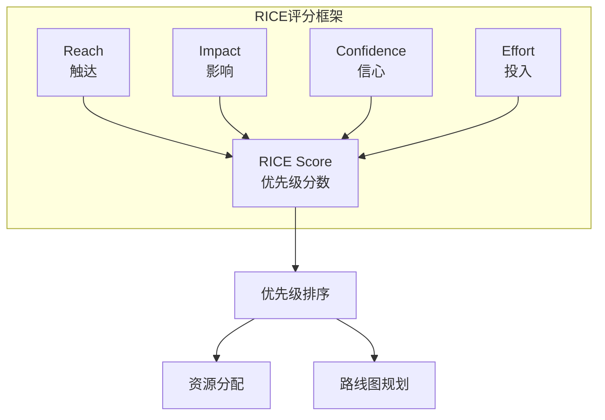
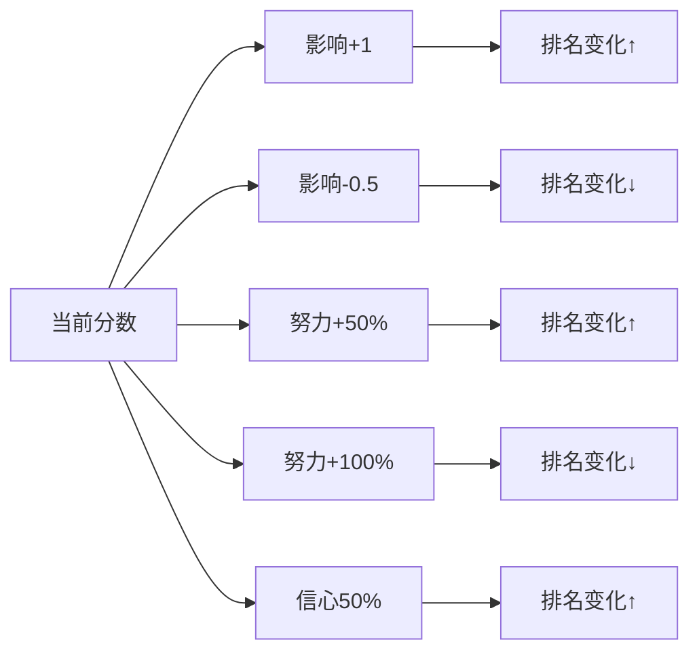
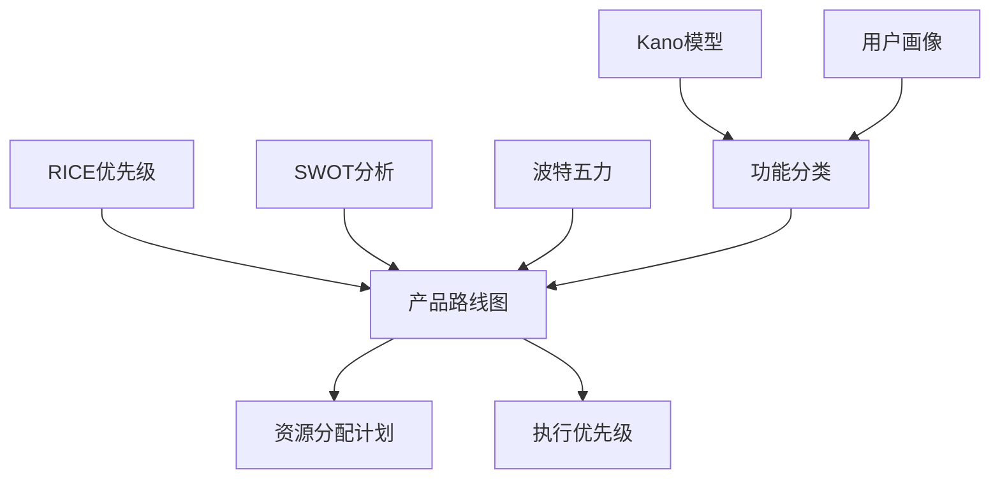

# RICE优先级排序法

<cite>
**本文档中引用的文件**
- [rice.md](file://niopd/commands/ST/rice.md)
- [README.md](file://README.md)
- [init.md](file://niopd/commands/SYS/init.md)
- [new-command.md](file://niopd/commands/SYS/new-command.md)
- [upgrade.md](file://niopd/commands/SYS/upgrade.md)
- [help.md](file://niopd/commands/SYS/help.md)
</cite>

## 目录
1. [简介](#简介)
2. [RICE模型的理论基础](#rice模型的理论基础)
3. [四个核心维度详解](#四个核心维度详解)
4. [计算逻辑与公式](#计算逻辑与公式)
5. [实施流程与最佳实践](#实施流程与最佳实践)
6. [量化优势分析](#量化优势分析)
7. [常见误用与规避策略](#常见误用与规避策略)
8. [与其他优先级方法的比较](#与其他优先级方法的比较)
9. [实际应用场景](#实际应用场景)
10. [总结与建议](#总结与建议)

## 简介

RICE优先级排序法是一种基于量化评估的产品管理工具，由Intercom的产品团队在2016年开发，旨在解决产品团队面临的数百个竞争性产品想法的优先级排序挑战。该方法通过将四个关键因素整合到单一的优先级分数中，为团队提供了客观的决策依据。

在NioPD（Nio Product Director）系统中，RICE方法被集成到战略分析（ST）模块中，通过`/niopd:ST:rice`命令为产品团队提供数据驱动的优先级决策支持。

## RICE模型的理论基础

### 发展历程

RICE模型的发展源于Intercom产品团队的实际需求。当时团队面临着数百个相互竞争的产品想法，传统的主观判断方法无法满足大规模决策的需求。为了解决这一挑战，Sean McBride领导的团队开发了RICE评分框架，该方法后来被公开分享，帮助其他产品团队做出更加客观的优先级决策。

### 核心原理

RICE提供了一个**定量评分框架**，将四个关键因素合并到单一的优先级分数中，实现了倡议项目的客观比较。该方法强制团队明确表达关于触达、影响、信心和投入方面的假设。

**图表来源**
- [rice.md](file://niopd/commands/ST/rice.md#L15-L40)

## 四个核心维度详解

### R - Reach（触达）

**定义**：在时间周期内将影响多少人或事件

**关键问题**：有多少人会在某个时间周期内受到这项工作的影响？

**测量方式**：绝对数量（例如："每季度500名客户"）

**时间周期**：通常按季度或月计算

**评分标准**：
- **高触达**：影响数千至上万人
- **中等触达**：影响数百至千人
- **低触达**：影响数十人以下

**示例**："每月2,000名用户将看到此功能"

### I - Impact（影响）

**定义**：对每个人的影响程度

**关键问题**：这对每个人会产生多大影响？

**评分尺度**：
- **3.0** = 巨大影响（Massive impact）
- **2.0** = 高影响（High impact）
- **1.0** = 中等影响（Medium impact）
- **0.5** = 低影响（Low impact）
- **0.25** = 微小影响（Minimal impact）

**焦点**：对您试图实现的目标的影响

**示例**："对转化率产生高影响（2）"

### C - Confidence（信心）

**定义**：我们对估计的确定程度

**关键问题**：我们对自己估计的信心有多大？

**评分尺度**：百分比（0-100%）
- **100%** = 高信心（强数据支持）
- **80%** = 中等信心（有一定数据）
- **50%** = 低信心（推测性）

**目的**：折扣不确定的倡议

**示例**："基于类似过往功能，80%的信心"

### E - Effort（投入）

**定义**：所需总团队时间

**关键问题**：需要多少总团队时间？

**测量单位**：人月（产品、设计、工程）

**包含内容**：整个团队的所有学科

**最小单位**：0.5人月（小于0.5的任何内容都四舍五入到0.5）

**示例**："3人月"（1名设计师 + 2名工程师工作1个月）

**章节来源**
- [rice.md](file://niopd/commands/ST/rice.md#L40-L88)

## 计算逻辑与公式

### RICE公式

**RICE Score = (Reach × Impact × Confidence) / Effort**

该公式的数学意义在于：
- **分子部分**：表示总体价值贡献（触达人数 × 每人影响 × 确信度）
- **分母部分**：表示资源消耗效率
- **最终结果**：单位投入带来的价值产出

### 计算示例

**倡议**：添加社交登录功能
- **触达**：每季度1,000名新用户
- **影响**：2（高 - 提升注册转化率）
- **信心**：80%（0.8）
- **投入**：2人月

**RICE分数** = (1,000 × 2 × 0.8) / 2 = **800**

### 分数解释

| 分数范围 | 优先级等级 | 推荐行动 |
|----------|------------|----------|
| 1000+ | 极高优先级 | 立即执行 |
| 500-999 | 高优先级 | 优先考虑 |
| 100-499 | 中等优先级 | 评估可行性 |
| 50-99 | 低优先级 | 考虑推迟 |
| <50 | 最低优先级 | 延迟或放弃 |

**章节来源**
- [rice.md](file://niopd/commands/ST/rice.md#L42-L88)

## 实施流程与最佳实践

### 使用场景

RICE方法适用于以下场景：
- 产品待办事项优先级排序
- 路线图规划
- 功能优先级确定
- 资源分配决策
- 季度规划
- 倡议比较分析

### 强大优势

1. **客观性和数据驱动**：提供可量化的决策依据
2. **强制显式估算**：要求团队明确表达假设
3. **易于理解和沟通**：简洁明了的计算公式
4. **考虑不确定性**（信心因子）：自然折扣不确定的倡议
5. **防止努力驱动优先级**：避免单纯以投入时间决定优先级

### 局限性

1. **需要估算工作**：需要团队投入时间进行评估
2. **"影响"可能主观**：影响程度的评估可能存在偏差
3. **不考虑战略契合度**：无法反映战略重要性
4. **不适合早期想法**：缺乏数据支持的想法难以评估
5. **应结合定性判断**：不能完全替代主观判断

### 最佳实践

1. **定义"影响"相对于当前目标**（如收入、参与度）
2. **为触达使用一致的时间周期**
3. **包含所有团队工作（不仅仅是工程）**
4. **对信心分数保持保守态度**
5. **作为团队审查和校准分数**
6. **结合定性因素（战略契合度、依赖关系）**

**章节来源**
- [rice.md](file://niopd/commands/ST/rice.md#L90-L126)

## 量化优势分析

### 数值化决策支持

RICE方法的核心优势在于将模糊的优先级判断转化为具体的数值。这种量化过程具有以下优势：

#### 1. **消除主观偏见**
- 将模糊的"重要性"判断转化为具体数字
- 减少个人偏好对决策的影响
- 提供可追溯的决策依据

#### 2. **促进团队共识**
- 统一的评分标准减少争论
- 可视化的比较矩阵便于讨论
- 明确的阈值指导决策

#### 3. **资源优化配置**
- 清晰识别高价值低投入的倡议
- 避免资源分散在低效项目上
- 支持容量规划和限制

### 敏感性分析

RICE方法允许进行敏感性分析，帮助理解关键假设的变化对优先级的影响：

**图表来源**
- [rice.md](file://niopd/commands/ST/rice.md#L372-L402)

### 优先级分层

基于RICE分数，可以建立清晰的优先级分层：

#### Tier 1: 承诺执行（RICE > 100）
- **特点**：高价值、低投入
- **行动**：立即启动执行
- **资源配置**：优先分配核心团队

#### Tier 2: 评估考虑（RICE 50-100）
- **特点**：中等价值、中等投入
- **行动**：在容量允许时考虑
- **决策因素**：战略契合度、依赖关系

#### Tier 3: 推迟处理（RICE < 50）
- **特点**：低价值、高投入
- **行动**：推迟到下次规划周期
- **理由**：资源有限，优先级较低

**章节来源**
- [rice.md](file://niopd/commands/ST/rice.md#L284-L370)

## 常见误用与规避策略

### 常见误用

#### 1. **过度依赖分数**
**问题**：单纯根据分数高低做决策
**规避**：结合定性因素和战略考量

#### 2. **不一致的评分标准**
**问题**：不同团队成员使用不同的评分尺度
**规避**：建立统一的评分指南和校准会议

#### 3. **忽视战略契合度**
**问题**：只关注RICE分数，忽略战略重要性
**规避**：建立战略评分矩阵

#### 4. **不准确的估算**
**问题**：随意猜测而非基于数据估算
**规避**：建立估算基准和历史数据参考

### 规避策略

#### 1. **建立评分校准机制**
- 定期进行团队评分校准
- 对比历史项目实际表现
- 建立领域专家咨询机制

#### 2. **结合定性判断**
- 战略契合度评分
- 技术可行性评估
- 市场时机考量

#### 3. **建立估算基准**
- 基于历史项目建立估算模板
- 制定标准的估算指南
- 维护项目成本数据库

#### 4. **定期回顾和调整**
- 定期回顾已执行项目的实际效果
- 根据学习结果调整评分标准
- 持续优化估算方法

**章节来源**
- [rice.md](file://niopd/commands/ST/rice.md#L90-L126)

## 与其他优先级方法的比较

### 方法对比

| 方法 | 核心维度 | 适用场景 | 优点 | 缺点 |
|------|----------|----------|------|------|
| **RICE** | 触达×影响×信心÷投入 | 大规模项目比较 | 量化程度高、考虑不确定性 | "影响"主观性强 |
| **MoSCoW** | 分类优先级 | 需求优先级 | 简单易懂 | 无法量化比较 |
| **WSJF** | 价值×频率÷时间 | SAFe经济优先级 | 考虑时间价值 | 复杂度较高 |
| **ICE** | 影响×信心÷容易度 | 快速评估 | 简化版RICE | 忽略触达因素 |
| **Kano** | 功能分类 | 特性优先级 | 用户体验导向 | 不适合战略决策 |

### 在NioPD中的集成

在NioPD系统中，RICE方法与其它战略分析工具形成互补：

**图表来源**
- [rice.md](file://niopd/commands/ST/rice.md#L110-L126)

### 推荐的组合使用

1. **第一步**：使用RICE进行初步量化排序
2. **第二步**：结合MoSCoW进行分类确认
3. **第三步**：应用Kano模型细化功能优先级
4. **第四步**：通过SWOT分析验证战略契合度

**章节来源**
- [rice.md](file://niopd/commands/ST/rice.md#L110-L126)

## 实际应用场景

### 产品路线图决策

在NioPD系统中，RICE方法主要用于支持产品路线图决策。通过`/niopd:ST:rice`命令，产品经理可以：

1. **输入倡议列表**：提供待评估的项目清单
2. **指定时间范围**：定义评估的时间周期
3. **进行量化评估**：为每个倡议打分
4. **生成优先级报告**：获得结构化的分析结果

### 资源分配优化

RICE方法特别适用于资源有限的环境：

- **识别高回报项目**：找出单位投入带来最大价值的项目
- **避免资源浪费**：推迟或取消低效项目
- **支持容量规划**：基于实际投入估算规划团队容量

### 团队协作支持

在NioPD的工作流中，RICE方法支持：

- **跨部门共识**：提供共同的决策语言
- **透明化过程**：所有假设和计算过程可见
- **持续改进**：基于实际执行结果优化估算

### 项目组合管理

对于大型产品团队，RICE方法可用于：

- **项目组合优化**：平衡不同类型项目
- **投资决策支持**：评估不同投资机会
- **风险分散**：避免过度集中在少数项目上

**章节来源**
- [rice.md](file://niopd/commands/ST/rice.md#L128-L164)

## 总结与建议

### 核心价值

RICE优先级排序法通过将四个关键因素整合到单一的量化评分中，为产品团队提供了强大的决策支持工具。其核心价值体现在：

1. **量化决策**：将模糊的优先级判断转化为具体数值
2. **强制显式**：要求团队明确表达关键假设
3. **促进共识**：提供统一的评估标准
4. **支持规划**：为资源分配和路线图制定提供依据

### 实施建议

1. **渐进式采用**：从少量项目开始，逐步扩大应用范围
2. **团队培训**：确保团队成员理解评分标准和计算方法
3. **持续优化**：基于实际执行结果不断改进估算方法
4. **结合工具**：利用NioPD等工具自动化计算和报告生成

### 未来发展方向

随着产品管理实践的发展，RICE方法可以进一步演进：

- **自动化估算**：利用机器学习提高估算准确性
- **实时更新**：基于实际数据动态调整优先级
- **多维度扩展**：考虑更多影响因素如风险、依赖关系
- **集成平台**：与项目管理工具深度集成

通过合理运用RICE优先级排序法，产品团队可以在复杂的决策环境中做出更加客观、高效的选择，为产品的成功奠定坚实的基础。