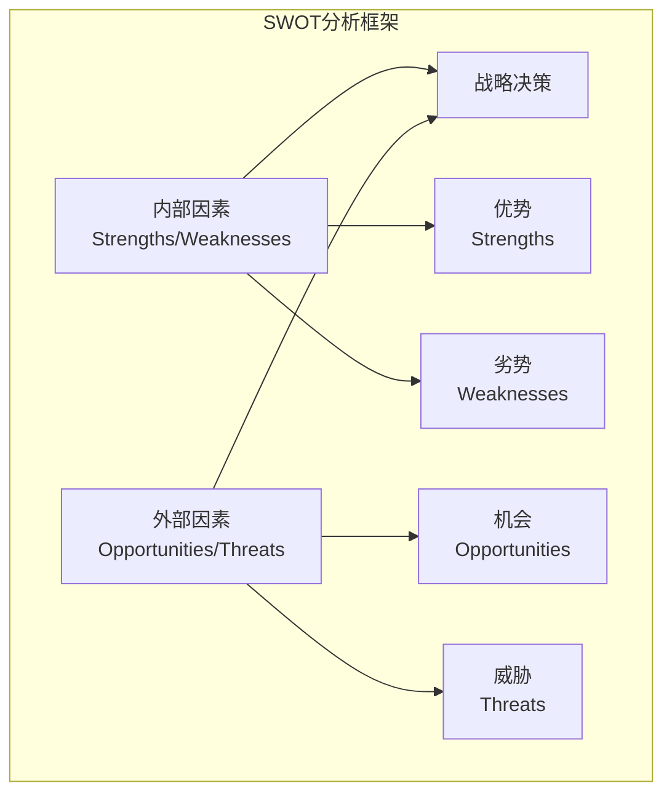
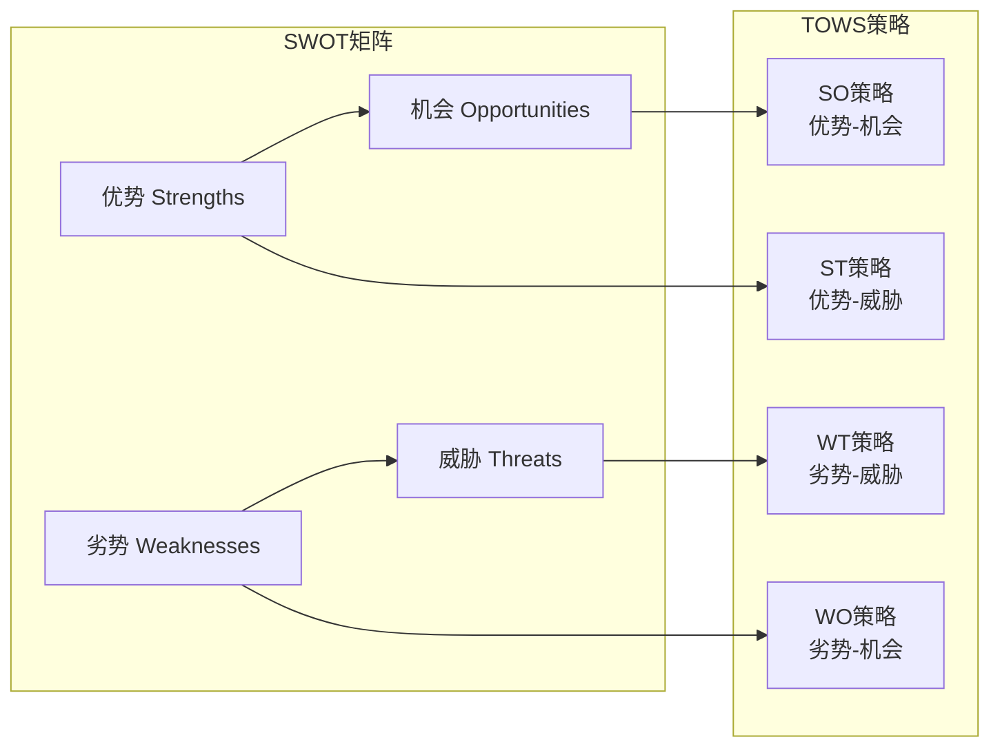
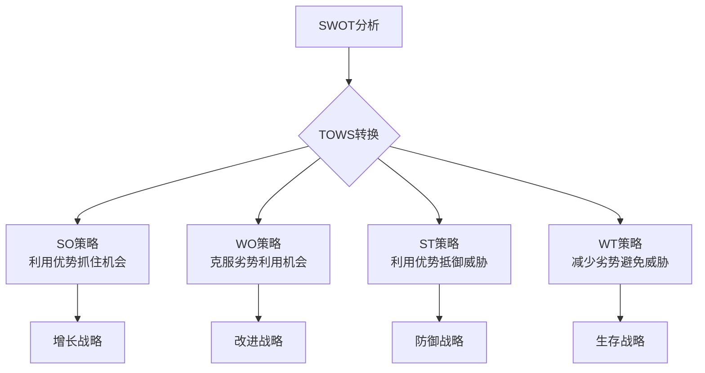
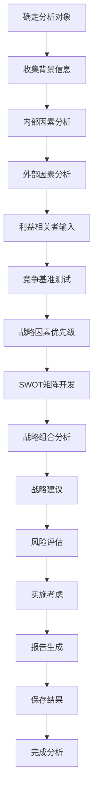
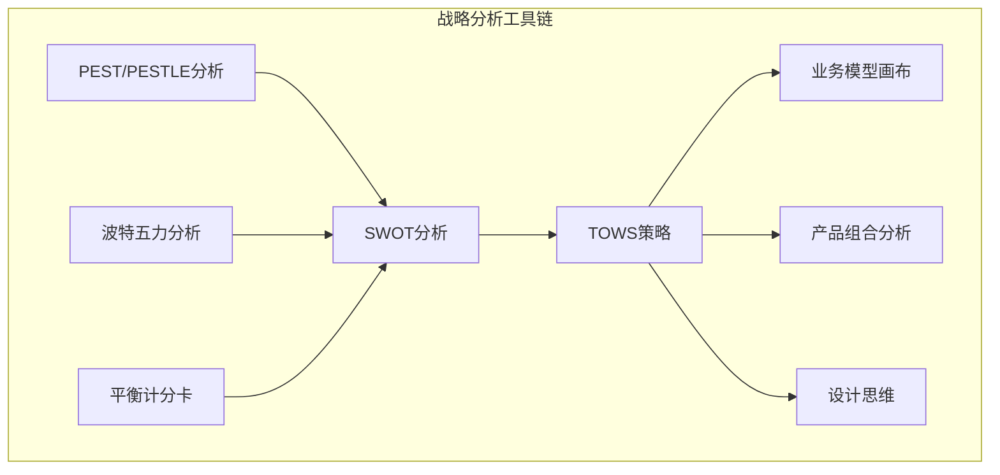
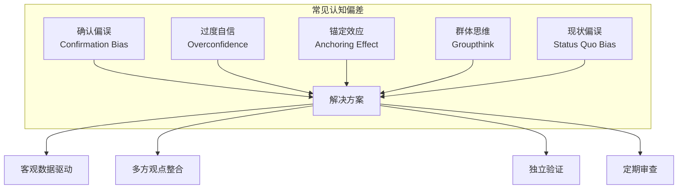
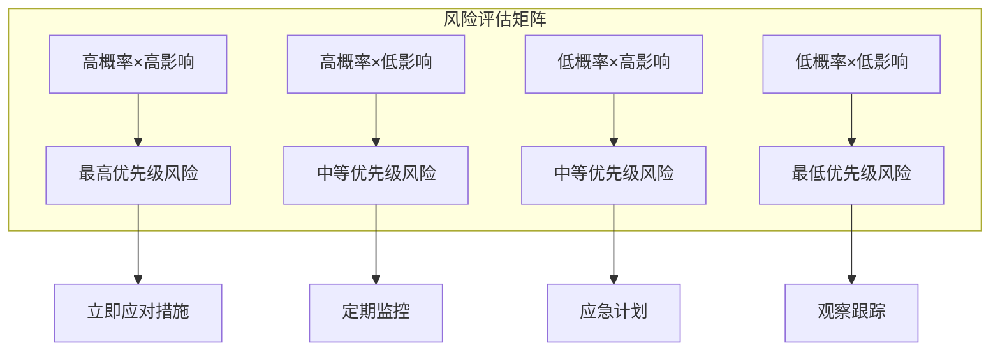

# SWOT分析：全面战略评估框架

<cite>
**本文档中引用的文件**
- [swot.md](file://niopd/commands/ST/swot.md)
- [pest.md](file://niopd/commands/ST/pest.md)
- [porters-five-forces.md](file://niopd/commands/ST/porters-five-forces.md)
- [balanced-scorecard.md](file://niopd/commands/ST/balanced-scorecard.md)
- [design-thinking.md](file://niopd/commands/ST/design-thinking.md)
- [portfolio.md](file://niopd/commands/ST/portfolio.md)
- [market-research-template.md](file://niopd/templates/market-research-template.md)
</cite>

## 目录
1. [引言](#引言)
2. [SWOT分析理论基础](#swot分析理论基础)
3. [SWOT矩阵结构与维度](#swot矩阵结构与维度)
4. [TOWS策略组合分析](#tows策略组合分析)
5. [实施步骤与最佳实践](#实施步骤与最佳实践)
6. [与其他战略工具的整合](#与其他战略工具的整合)
7. [新产品上市战略评估实例](#新产品上市战略评估实例)
8. [避免主观偏见的方法](#避免主观偏见的方法)
9. [风险评估与管理](#风险评估与管理)
10. [结论与建议](#结论与建议)

## 引言

SWOT分析是一种经典而强大的战略规划工具，由斯坦福研究学院的Albert Humphrey于1960年代末至1970年代初开发。作为一种结构化的战略情境分析框架，SWOT通过系统性地评估内部能力和外部市场因素，为战略制定提供重要依据。

在当今快速变化的商业环境中，SWOT分析的价值不仅在于其简单易用的特点，更在于它能够帮助组织：
- 全面识别内外部关键因素
- 建立战略优先级
- 发现增长机会
- 规避潜在风险
- 制定可执行的战略计划

## SWOT分析理论基础

### 核心原理

SWOT分析基于以下核心原则：
- **结构性分析**：将复杂的战略环境分解为四个可控维度
- **平衡视角**：同时考虑内部优势与外部机会，以及内部劣势与外部威胁
- **战略导向**：直接服务于战略决策制定过程
- **动态适应**：需要定期更新以反映环境变化

### 四个维度的定义

**图表来源**
- [swot.md](file://niopd/commands/ST/swot.md#L15-L30)

#### 内部因素（可控）

**优势（Strengths）**：
- 内部能力与资源，提供竞争优势
- 核心竞争力和独特优势
- 资源优势（财务、人力、技术）
- 运营效率和卓越表现
- 品牌价值和客户忠诚度

**劣势（Weaknesses）**：
- 内部限制和不足
- 与竞争对手的差距
- 运营低效环节
- 财务脆弱性
- 品牌或声誉问题
- 性能低下或客户不满领域

#### 外部因素（不可控）

**机会（Opportunities）**：
- 可被利用的外部有利条件
- 市场趋势和变化
- 技术进步
- 新兴市场需求
- 合作伙伴关系
- 有利的政策法规

**威胁（Threats）**：
- 外部挑战和风险
- 竞争压力和新进入者
- 市场颠覆
- 法规和合规风险
- 经济衰退
- 技术过时风险

## SWOT矩阵结构与维度

### 标准SWOT矩阵布局

**图表来源**
- [swot.md](file://niopd/commands/ST/swot.md#L27-L35)

### 战略组合分析

#### SO策略（优势-机会）
- **定义**：利用优势抓住机会
- **目标**：增长和扩张
- **典型场景**：现有优势应用于新兴市场

#### WO策略（劣势-机会）
- **定义**：克服劣势以利用机会
- **目标**：改进和转型
- **典型场景**：通过创新弥补资源不足

#### ST策略（优势-威胁）
- **定义**：利用优势抵御威胁
- **目标**：防御和保护
- **典型场景**：品牌优势对抗竞争

#### WT策略（劣势-威胁）
- **定义**：减少劣势和避免威胁
- **目标**：生存和调整
- **典型场景**：成本控制应对经济衰退

**章节来源**
- [swot.md](file://niopd/commands/ST/swot.md#L198-L260)

## TOWS策略组合分析

### TOWS矩阵扩展

Heinz Weihrich在1982年提出的TOWS矩阵强调了从SWOT到战略行动的转化过程：

**图表来源**
- [swot.md](file://niopd/commands/ST/swot.md#L27-L35)

### 战略选择矩阵

| 战略类型 | 风险水平 | 时间框架 | 资源需求 | 适用场景 |
|---------|---------|---------|---------|---------|
| SO策略 | 中等 | 中长期 | 高 | 强势企业扩张 |
| WO策略 | 低 | 中期 | 中等 | 改进型增长 |
| ST策略 | 低 | 中期 | 中等 | 防御性竞争 |
| WT策略 | 最低 | 短期 | 低 | 危机应对 |

## 实施步骤与最佳实践

### 完整实施流程

**图表来源**
- [swot.md](file://niopd/commands/ST/swot.md#L80-L120)

### 关键实施原则

#### 1. 具体性原则
- 避免模糊陈述
- 使用具体描述
- 提供可验证的证据

#### 2. 优先级原则
- 区分重要因素和次要因素
- 重点关注战略性因素
- 考虑影响程度和紧迫性

#### 3. 证据基础原则
- 基于数据和研究
- 使用可靠的信息来源
- 支持性证据和例子

#### 4. 可操作性原则
- 连接到具体战略
- 明确的行动计划
- 可衡量的结果预期

#### 5. 动态更新原则
- 定期刷新分析
- 跟踪关键指标
- 响应环境变化

**章节来源**
- [swot.md](file://niopd/commands/ST/swot.md#L35-L50)

## 与其他战略工具的整合

### 框架协同效应

**图表来源**
- [swot.md](file://niopd/commands/ST/swot.md#L45-L55)
- [pest.md](file://niopd/commands/ST/pest.md#L1-L20)
- [porters-five-forces.md](file://niopd/commands/ST/porters-five-forces.md#L1-L20)

### 工具互补关系

#### PEST/PESTLE分析
- **作用**：提供宏观环境洞察
- **输入**：政治、经济、社会、技术、法律、环境因素
- **与SWOT结合**：将外部宏观因素转化为具体机会和威胁

#### 波特五力分析
- **作用**：分析行业竞争结构
- **输入**：新进入威胁、供应商议价能力、买方议价能力、替代品威胁、竞争竞争
- **与SWOT结合**：识别行业特定的机会和威胁

#### 平衡计分卡
- **作用**：将战略转化为可执行指标
- **输入**：财务、客户、内部流程、学习与成长四个维度
- **与SWOT结合**：将战略因素转化为具体的KPI和目标

**章节来源**
- [pest.md](file://niopd/commands/ST/pest.md#L40-L60)
- [porters-five-forces.md](file://niopd/commands/ST/porters-five-forces.md#L40-L80)

## 新产品上市战略评估实例

### 案例背景设定

假设我们正在评估一款面向年轻消费者的智能家居设备的新产品上市策略。

### 内部分析（Strengths & Weaknesses）

#### 优势识别
1. **技术领先**：拥有专利的AI算法，提供更精准的家居控制
2. **品牌认知**：在科技消费群体中有良好的品牌形象
3. **研发能力**：强大的产品开发团队和快速迭代能力
4. **供应链优势**：成熟的制造能力和成本控制

#### 劣势识别
1. **市场经验**：在智能家居领域的品牌知名度较低
2. **渠道建设**：线下零售网络不够完善
3. **资金约束**：有限的研发预算
4. **服务网络**：售后服务体系有待完善

### 外部分析（Opportunities & Threats）

#### 机会识别
1. **市场趋势**：智能家居市场快速增长，预计未来五年复合增长率20%
2. **技术发展**：5G网络普及为智能设备提供更好连接
3. **消费者偏好**：年轻一代对科技产品的高接受度
4. **政策支持**：政府鼓励科技创新和智能制造

#### 威胁识别
1. **竞争激烈**：已有多个知名品牌占据市场份额
2. **技术壁垒**：专利纠纷可能影响产品上市
3. **经济波动**：宏观经济不确定性影响消费者支出
4. **安全风险**：网络安全事件可能损害品牌信任

### 战略组合分析

#### SO策略：技术优势抓住市场机会
- **策略**：利用AI技术优势，针对年轻消费者推出差异化产品
- **行动**：开发个性化功能，建立社区互动平台
- **预期**：在细分市场建立技术领导地位

#### WO策略：克服劣势利用市场机会
- **策略**：通过合作伙伴关系弥补渠道不足
- **行动**：与电商平台合作，建立线上销售网络
- **预期**：快速扩大市场覆盖面

#### ST策略：技术优势抵御竞争威胁
- **策略**：通过技术创新建立护城河
- **行动**：持续研发投入，申请更多专利
- **预期**：提高产品差异化程度

#### WT策略：减少劣势避免威胁
- **策略**：加强网络安全措施
- **行动**：聘请安全专家，建立安全认证体系
- **预期**：提升用户信任度

**章节来源**
- [swot.md](file://niopd/commands/ST/swot.md#L307-L347)

## 避免主观偏见的方法

### 认知偏差识别

### 减少偏见的具体方法

#### 1. 数据驱动决策
- **量化指标**：使用具体的数据和指标
- **基准对比**：与行业标准和竞争对手对比
- **历史趋势**：分析长期发展趋势而非短期波动

#### 2. 多角度评估
- **跨部门参与**：邀请不同职能团队参与分析
- **外部专家咨询**：引入行业专家和顾问意见
- **利益相关者访谈**：收集客户、合作伙伴反馈

#### 3. 结构化流程
- **标准化模板**：使用统一的分析框架和模板
- **同行评审**：让同事审查分析结果
- **独立验证**：委托第三方进行验证

#### 4. 定期更新机制
- **季度回顾**：每季度重新评估关键因素
- **环境扫描**：持续监控外部环境变化
- **灵活调整**：根据新信息及时调整策略

**章节来源**
- [swot.md](file://niopd/commands/ST/swot.md#L35-L50)

## 风险评估与管理

### 风险分类与评估

### 风险管理策略

#### 高优先级风险处理
1. **风险识别**：明确具体的风险因素
2. **影响评估**：量化潜在后果
3. **概率分析**：评估发生可能性
4. **应对策略**：制定具体缓解措施

#### 风险缓解措施
- **预防措施**：事前控制和预防
- **减轻措施**：降低风险影响
- **转移策略**：通过保险或外包转移
- **接受策略**：对于无法避免的风险

**章节来源**
- [swot.md](file://niopd/commands/ST/swot.md#L349-L359)

## 结论与建议

### SWOT分析的核心价值

SWOT分析作为战略规划的基础工具，具有以下核心价值：

1. **系统性思考**：提供全面的内外部因素审视
2. **战略聚焦**：帮助识别最关键的战略要素
3. **沟通工具**：促进团队共识和战略对齐
4. **行动计划**：从分析到具体行动的桥梁

### 实践建议

#### 对于战略规划者
- **定期更新**：至少每季度更新一次分析
- **动态调整**：根据环境变化及时调整重点
- **跨工具整合**：与其他战略工具协同使用
- **执行力关注**：重视从分析到执行的转化

#### 对于执行层
- **具体化行动**：将战略建议转化为具体任务
- **指标跟踪**：建立相应的KPI和监控体系
- **反馈循环**：建立执行效果的反馈机制
- **持续优化**：根据执行情况不断优化策略

### 未来发展方向

随着商业环境的快速变化，SWOT分析也在不断发展：

- **数字化转型**：结合大数据和人工智能技术
- **敏捷方法**：采用更灵活、迭代的分析方式
- **生态系统思维**：考虑更广泛的生态系统因素
- **可持续发展**：纳入ESG因素和长期价值创造

通过系统化地运用SWOT分析框架，组织可以更好地理解自身定位，把握市场机遇，规避潜在风险，从而制定出更加科学、有效的战略决策。