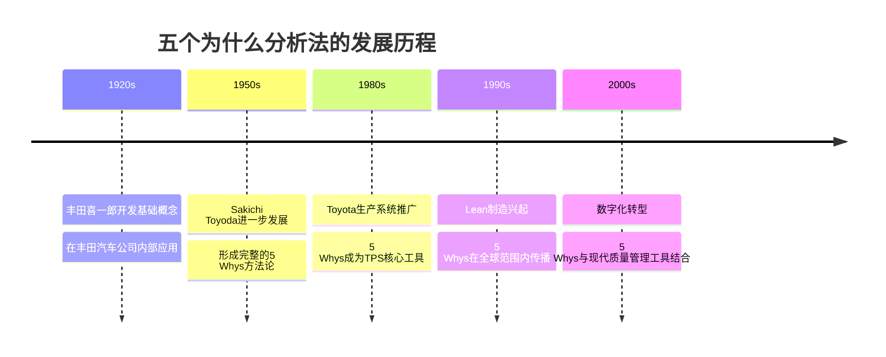
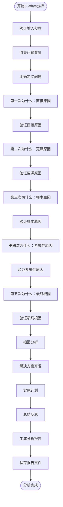
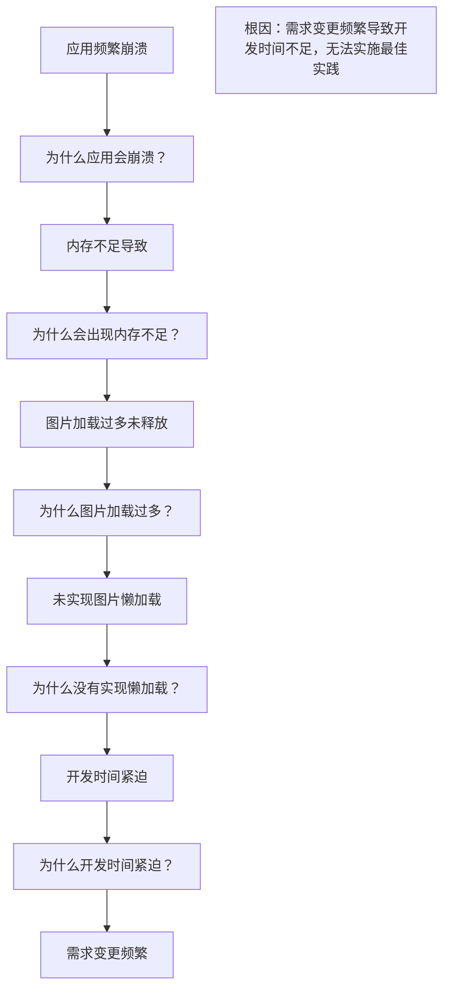
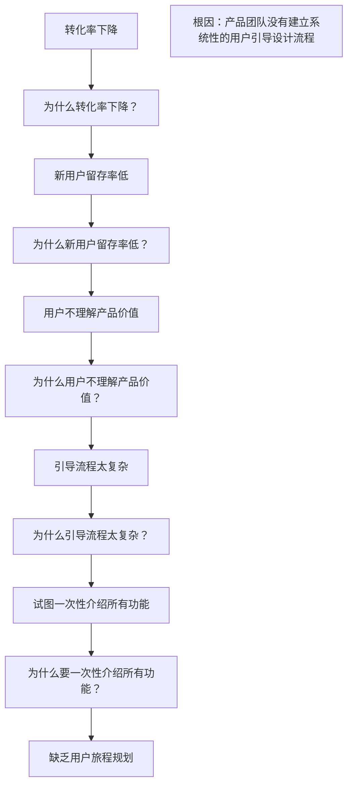
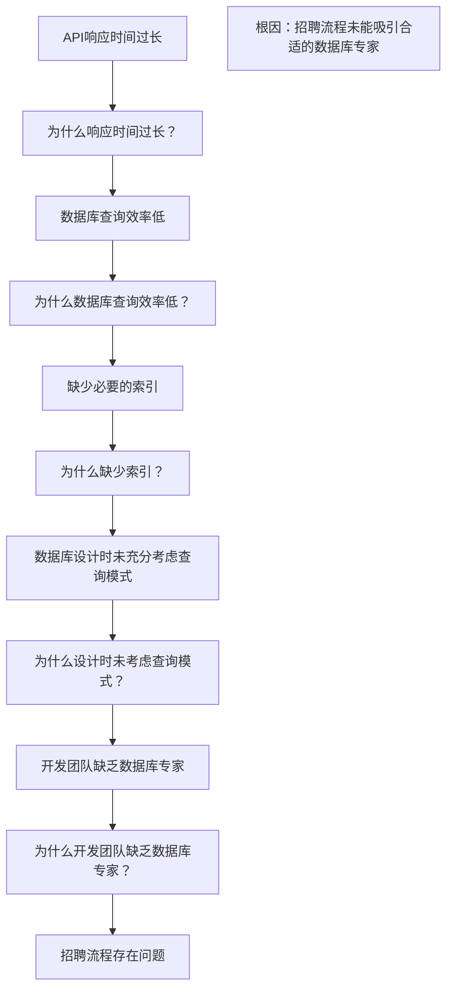
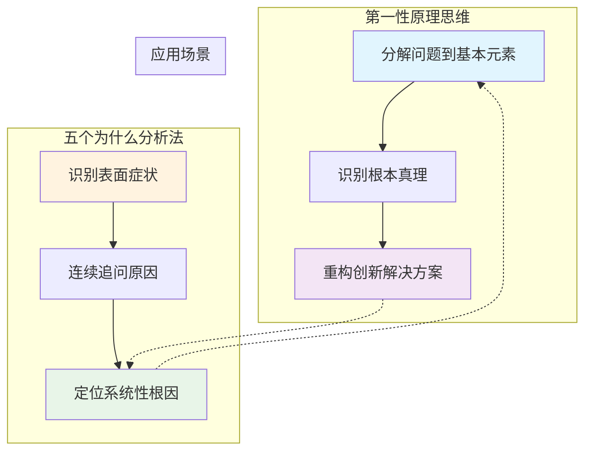

# 五个为什么分析法

<cite>
**本文档中引用的文件**
- [five-whys.md](file://niopd/commands/DT/five-whys.md)
- [first-principles.md](file://niopd/commands/DT/first-principles.md)
- [socratic-questioning.md](file://niopd/commands/DT/socratic-questioning.md)
- [process.md](file://niopd/commands/PD/process.md)
- [README.md](file://README.md)
</cite>

## 目录
1. [引言](#引言)
2. [五个为什么分析法的起源与发展](#五个为什么分析法的起源与发展)
3. [核心机制与理论基础](#核心机制与理论基础)
4. [在NioPD中的应用流程](#在niopd中的应用流程)
5. [实际产品开发中的故障排查案例](#实际产品开发中的故障排查案例)
6. [提问方向引导与逻辑偏差避免](#提问方向引导与逻辑偏差避免)
7. [与其他深度思考工具的关系](#与其他深度思考工具的关系)
8. [最佳实践与注意事项](#最佳实践与注意事项)
9. [总结](#总结)

## 引言

五个为什么分析法（5 Whys Analysis）是一种简单而强大的根因分析技术，通过连续追问"为什么"来穿透表层现象，定位问题的本质原因。这种方法最初由丰田汽车创始人丰田喜一郎提出，并在丰田生产系统中得到广泛应用，后来成为精益制造和质量管理的核心工具之一。

在现代产品管理实践中，五个为什么分析法被证明是解决复杂问题、识别系统性缺陷的有效方法。特别是在产品开发过程中，当遇到质量缺陷、流程瓶颈或用户体验问题时，五个为什么分析法能够帮助团队深入挖掘根本原因，制定有效的改进措施。

## 五个为什么分析法的起源与发展

### 丰田生产系统的基石

五个为什么分析法起源于日本，由丰田汽车公司的创始人丰田喜一郎（Kiichiro Toyoda）在20世纪初开发。这一方法最初是为了应对制造业中的质量问题而设计的，目的是帮助工程师和管理者超越表面的症状，找到导致问题的根本原因。



**图表来源**
- [five-whys.md](file://niopd/commands/DT/five-whys.md#L15-L20)

### 理论基础与哲学思想

五个为什么分析法基于几个重要的哲学和管理学原理：

1. **系统性思维**：认为问题往往不是孤立的，而是系统中相互关联的部分
2. **因果关系**：每个现象都有其背后的原因，通过层层追问可以找到根本原因
3. **持续改进**：通过不断发现问题和解决问题，推动系统持续改善
4. **团队协作**：根因分析应该是一个集体参与的过程，集思广益

**章节来源**
- [five-whys.md](file://niopd/commands/DT/five-whys.md#L15-L30)

## 核心机制与理论基础

### 基本原理

五个为什么分析法的核心原理可以用以下公式表示：

```
表面问题 = 直接原因 + 更深层原因 + 更更深层原因 + ...
```

通过连续追问"为什么"，团队可以从表面症状逐步深入到系统性的问题根源。

### 关键特征

五个为什么分析法具有以下五个关键特征：

1. **迭代式探究**：每个回答都是下一个问题的基础
2. **根因聚焦**：超越表面症状，关注系统性问题
3. **简洁性**：无需复杂的统计分析或昂贵的工具
4. **协作性**：最适合团队共同参与的活动
5. **行动导向**：最终导向具体的纠正和预防措施

### 应用场景

这种方法特别适用于以下情况：

- 制造业和服务交付中的质量问题
- 流程失败或效率低下
- 反复出现的系统性问题
- 需要快速根因分析的情况
- 团队合作的问题解决会议

**章节来源**
- [five-whys.md](file://niopd/commands/DT/five-whys.md#L25-L40)

## 在NioPD中的应用流程

### 命令语法与参数

在NioPD中，五个为什么分析法通过`/niopd:DT:five-whys`命令实现，支持以下参数：

| 参数 | 类型 | 描述 | 示例 |
|------|------|------|------|
| `--problem` | 字符串 | 要分析的问题描述 | `--problem="新用户激活率低"` |
| `--context` | 字符串 | 问题的上下文信息 | `--context="移动端应用"` |
| `--symptom` | 字符串 | 观察到的症状 | `--symptom="用户注册后立即退出"` |

### 完整的分析流程

NioPD的五个为什么分析遵循一个结构化的15步流程：



**图表来源**
- [five-whys.md](file://niopd/commands/DT/five-whys.md#L50-L245)

### 步骤详解

#### 第一步：确认和收集背景信息
- 确认分析的问题
- 收集问题的上下文信息
- 识别首次发现问题的症状

#### 第二步：建立5 Whys框架
- 解释5 Whys技术的基本原理
- 设置合理的期望值
- 鼓励系统性的思考方式

#### 第三步：问题定义
- 清晰地定义问题
- 确定问题的时间、地点和影响范围
- 验证问题的真实性

#### 第四步至第八步：连续追问为什么
每个"为什么"都遵循相同的模式：
1. 基于前一个回答提出新的问题
2. 等待用户回答
3. 验证答案的合理性
4. 寻求证据支持

#### 第九步：根因分析
- 分析识别出的根因
- 对根因进行分类（流程、人员、技术等）
- 探讨促成问题的因素

#### 第十步：解决方案开发
- 制定即时纠正措施
- 开发预防性措施
- 明确责任分工

#### 第十一步：实施计划
- 制定具体的实施步骤
- 确定时间表和资源需求
- 建立成功的衡量标准

**章节来源**
- [five-whys.md](file://niopd/commands/DT/five-whys.md#L50-L200)

## 实际产品开发中的故障排查案例

### 案例1：移动端应用崩溃问题

#### 问题描述
用户反馈移动端应用频繁崩溃，特别是在使用特定功能时。

#### 5 Whys分析过程



**图表来源**
- [five-whys.md](file://niopd/commands/DT/five-whys.md#L85-L111)

#### 解决方案
1. **即时措施**：临时增加内存监控和崩溃恢复机制
2. **预防措施**：
   - 实施图片懒加载功能
   - 建立更稳定的需求变更流程
   - 增加代码审查中的性能检查

### 案例2：用户转化率下降

#### 问题描述
电商平台的用户转化率在过去三个月持续下降。

#### 5 Whys分析过程



#### 解决方案
1. **即时措施**：简化当前的引导流程
2. **预防措施**：
   - 建立用户旅程映射流程
   - 制定渐进式功能介绍策略
   - 加强用户研究以指导产品设计

### 案例3：API响应时间过长

#### 问题描述
系统API的平均响应时间超过SLA要求。

#### 5 Whys分析过程



#### 解决方案
1. **即时措施**：手动添加关键查询的索引
2. **预防措施**：
   - 建立数据库性能监控机制
   - 改进招聘流程以吸引数据库专家
   - 实施代码审查中的数据库查询检查

**章节来源**
- [five-whys.md](file://niopd/commands/DT/five-whys.md#L150-L200)

## 提问方向引导与逻辑偏差避免

### 常见的逻辑偏差

在进行5 Whys分析时，团队容易陷入以下几种逻辑偏差：

1. **确认偏误（Confirmation Bias）**：只寻找支持预设答案的信息
2. **归因错误（Attribution Error）**：过度强调个人因素而忽视系统因素
3. **锚定效应（Anchoring Effect）**：过于依赖最初的假设
4. **虚假共识效应（False Consensus Effect）**：认为自己的观点是普遍正确的

### 有效的提问策略

#### 1. 开放式问题引导
使用开放式问题鼓励深入思考：

- "这个问题的根本原因可能是什么？"
- "除了我们想到的原因，还有哪些可能性？"
- "如果从完全不同的角度看待这个问题，会有什么发现？"

#### 2. 反向思考
尝试从相反的角度提问：

- "如果这个问题不存在，会是什么情况？"
- "什么情况下这个问题不会发生？"
- "如果我们希望这个问题发生，需要什么条件？"

#### 3. 系统性思考
关注系统层面的因素：

- "这个问题涉及哪些系统组件？"
- "有哪些外部因素可能影响这个问题？"
- "这个问题是否反映了更大的系统性问题？"

### 避免常见陷阱

#### 1. 避免过早停止
- **问题**：在第2-3个"Why"就停止
- **解决方案**：坚持追问直到找到系统性原因
- **提示**：告诉团队"我们已经问了X个为什么，让我们继续深入"

#### 2. 避免表面原因
- **问题**：停留在技术或操作层面
- **解决方案**：追问到组织、流程或文化层面
- **示例**：不要只问"为什么代码有bug"，要问"为什么代码质量控制不严格"

#### 3. 避免个人归因
- **问题**：将问题归咎于个人错误
- **解决方案**：关注系统性原因
- **示例**：不要说"某人犯了错"，要说"什么流程导致这个人犯错"

### 团队协作技巧

#### 1. 角色分配
- **主持人**：负责引导整个分析过程
- **记录员**：记录所有的问题和答案
- **观察员**：注意逻辑偏差和遗漏的方面
- **挑战者**：提出不同的观点和假设

#### 2. 时间管理
- 每个阶段设定时间限制
- 定期回顾已得出的结论
- 适时休息以保持思维清晰

#### 3. 知识共享
- 鼓励不同背景的团队成员参与
- 利用多样化的视角
- 建立跨部门的知识分享机制

**章节来源**
- [five-whys.md](file://niopd/commands/DT/five-whys.md#L238-L245)

## 与其他深度思考工具的关系

### 与第一性原理思维的互补性

五个为什么分析法与第一性原理思维（First Principles Thinking）在产品管理中形成良好的互补关系：



**图表来源**
- [first-principles.md](file://niopd/commands/DT/first-principles.md#L15-L30)
- [five-whys.md](file://niopd/commands/DT/five-whys.md#L15-L30)

#### 协作使用方法

1. **先使用5 Whys定位问题**：通过连续追问找到问题的根本原因
2. **再使用第一性原理重构解决方案**：基于根本原因，重新思考如何从根本上解决问题
3. **循环迭代**：可能需要多次循环这两个过程

### 与苏格拉底式提问的结合

苏格拉底式提问（Socratic Questioning）提供了更系统的提问框架：

| 提问类型 | 5 Whys中的应用 | 苏格拉底式提问的应用 |
|----------|----------------|---------------------|
| 清晰化 | 确认问题定义 | 明确关键术语的含义 |
| 假设探究 | 挑战隐含假设 | 识别和质疑分析前提 |
| 证据探究 | 验证因果关系 | 寻找支持结论的证据 |
| 视角探究 | 多角度思考 | 考虑不同利益相关者的观点 |
| 影响探究 | 分析系统影响 | 探讨解决方案的后果 |
| 元问题 | 反思分析过程 | 评估分析方法的有效性 |

### 与场景规划的整合

在复杂的产品问题中，可以将5 Whys与场景规划相结合：

1. **使用5 Whys识别当前问题的根本原因**
2. **基于根因分析构建不同的未来场景**
3. **评估每个场景下的风险和机遇**
4. **制定相应的应对策略**

**章节来源**
- [socratic-questioning.md](file://niopd/commands/DT/socratic-questioning.md#L15-L30)
- [five-whys.md](file://niopd/commands/DT/five-whys.md#L31-L35)

## 最佳实践与注意事项

### 实施前的准备工作

#### 1. 团队组建
- **多样性**：邀请来自不同部门的代表
- **专业知识**：确保有相关领域的专家参与
- **开放心态**：选择愿意接受新观点的团队成员

#### 2. 资料准备
- **历史数据**：收集相关的历史问题记录
- **系统文档**：准备系统架构和技术文档
- **用户反馈**：整理相关的用户投诉和建议

#### 3. 环境设置
- **安静的空间**：确保讨论不受干扰
- **必要的工具**：准备白板、便签纸、投影仪等
- **时间安排**：预留足够的时间进行深入讨论

### 分析过程中的注意事项

#### 1. 保持客观性
- **避免情绪化**：不要针对个人，专注于问题本身
- **平等对待**：给每个人发言的机会
- **记录事实**：基于可验证的信息进行分析

#### 2. 深度挖掘
- **持续追问**：不要满足于表面答案
- **系统思考**：考虑问题的各个方面
- **跨领域视角**：引入不同领域的知识

#### 3. 验证假设
- **寻求证据**：每个结论都需要事实支持
- **交叉验证**：通过不同途径验证同一结论
- **保持怀疑**：对任何结论都要保持批判性思维

### 结果应用与跟进

#### 1. 制定行动计划
- **明确责任**：为每个解决方案指定负责人
- **设定时间表**：制定具体的实施计划
- **资源配置**：确保有足够的资源支持

#### 2. 监控效果
- **建立指标**：定义衡量改进效果的指标
- **定期检查**：跟踪解决方案的实施进度
- **调整优化**：根据实际情况调整策略

#### 3. 知识传承
- **文档化**：将分析过程和结果记录下来
- **培训分享**：将经验传授给其他团队成员
- **流程固化**：将有效的做法纳入标准流程

### 常见问题与解决方案

#### 问题1：团队成员参与度不高
**解决方案**：
- 明确每个人的角色和贡献
- 建立激励机制
- 保持讨论的趣味性和互动性

#### 问题2：分析过程偏离主题
**解决方案**：
- 设定明确的讨论框架
- 定期回顾讨论的重点
- 适时打断偏离的话题

#### 问题3：解决方案难以实施
**解决方案**：
- 评估解决方案的可行性和成本
- 寻求管理层的支持
- 制定分阶段的实施计划

**章节来源**
- [five-whys.md](file://niopd/commands/DT/five-whys.md#L238-L245)

## 总结

五个为什么分析法作为一种简单而强大的根因分析工具，在产品管理实践中具有重要的应用价值。通过NioPD中的系统化实现，这一方法变得更加易于使用和标准化。

### 核心价值

1. **穿透表象**：帮助团队超越表面症状，找到真正的问题根源
2. **系统性思考**：促进对复杂问题的整体理解和系统性解决方案
3. **团队协作**：通过集体智慧提高分析质量和解决方案的可行性
4. **持续改进**：为组织的持续改进提供有力的工具支撑

### 实践建议

1. **持之以恒**：将5 Whys分析纳入日常问题解决流程
2. **团队培养**：通过培训提高团队的分析能力
3. **工具整合**：与其他分析工具结合使用，发挥协同效应
4. **文化培育**：在组织中建立重视根因分析的文化氛围

### 未来发展

随着人工智能和数据分析技术的发展，五个为什么分析法也在不断演进：

- **智能化辅助**：利用AI技术自动识别潜在的因果关系
- **大数据集成**：结合大数据分析提供更准确的根因识别
- **实时监控**：建立实时的问题检测和分析系统
- **预测性分析**：基于历史数据预测潜在问题

通过合理运用五个为什么分析法，产品管理团队能够更有效地识别和解决复杂问题，推动产品和服务的持续改进，最终实现更好的用户体验和业务成果。

**章节来源**
- [five-whys.md](file://niopd/commands/DT/five-whys.md#L240-L245)