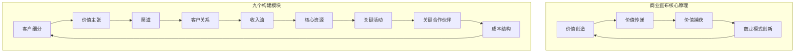
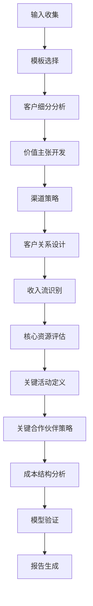

# 商业画布（Business Model Canvas）

<cite>
**本文档中引用的文件**
- [canvas.md](file://niopd/commands/ST/canvas.md)
- [swot.md](file://niopd/commands/ST/swot.md)
- [porters-five-forces.md](file://niopd/commands/ST/porters-five-forces.md)
- [design-thinking.md](file://niopd/commands/ST/design-thinking.md)
- [pest.md](file://niopd/commands/ST/pest.md)
- [portfolio.md](file://niopd/commands/ST/portfolio.md)
- [README.md](file://README.md)
</cite>

## 目录
1. [引言](#引言)
2. [商业画布的理论基础](#商业画布的理论基础)
3. [九大构建模块详解](#九大构建模块详解)
4. [商业画布的应用场景](#商业画布的应用场景)
5. [/niopd:ST:canvas指令详解](#niopdstcanvas指令详解)
6. [与其他战略工具的集成](#与其他战略工具的集成)
7. [初创企业案例演示](#初创企业案例演示)
8. [商业画布的迭代与优化](#商业画布的迭代与优化)
9. [最佳实践与注意事项](#最佳实践与注意事项)
10. [总结](#总结)

## 引言

商业画布（Business Model Canvas）是由Alexander Osterwalder在2005年开发的一种可视化战略管理模板，后来在他的2010年著作《商业模式新生代》中得到普及。作为一种强大的商业模式设计和创新工具，商业画布通过九个关键构建模块，帮助企业清晰地描述、设计、挑战和创新商业模式。

在现代商业环境中，企业面临着前所未有的竞争压力和市场不确定性。传统的商业模式往往难以适应快速变化的市场环境，而商业画布提供了一种简洁而有效的框架，帮助企业在复杂的商业环境中找到清晰的发展方向。

## 商业画布的理论基础

### 发展历程

商业画布的发展经历了从理论到实践的不断完善过程。Osterwalder的博士论文为这一概念奠定了理论基础，随后通过与Yves Pigneur的合作，在《商业模式新生代》一书中将其推广到全球。这本书在全球销售超过500万册，证明了这一工具的广泛影响力。

### 核心原理

商业画布的核心原理在于提供一个**视觉战略管理模板**，该模板描述、设计、挑战和创新商业模式。它映射了九个基本构建模块，展示了组织如何创造、传递和捕获价值的逻辑。



**图表来源**
- [canvas.md](file://niopd/commands/ST/canvas.md#L15-L30)

### 九个构建模块的分类

商业画布的九个构建模块可以分为两个主要部分：

**面向客户的模块（右侧）**：
1. **客户细分**：我们为谁创造价值？
2. **价值主张**：我们解决了什么问题？
3. **渠道**：我们如何接触客户？
4. **客户关系**：每个细分市场期望的关系是什么？
5. **收入流**：客户愿意为价值支付什么？

**基础设施模块（左侧）**：
6. **核心资源**：哪些资产是必不可少的？
7. **关键活动**：为了传递价值主张我们必须做什么？
8. **关键合作伙伴**：我们的关键合作伙伴和供应商是谁？
9. **成本结构**：主要成本是什么？

**章节来源**
- [canvas.md](file://niopd/commands/ST/canvas.md#L25-L40)

## 九大构建模块详解

### 1. 客户细分（Customer Segments）

客户细分是商业模式的基础，决定了企业的目标市场和价值创造对象。

#### 核心要素
- **人口统计特征**：年龄、性别、收入、教育程度
- **心理特征**：生活方式、价值观、个性
- **行为特征**：购买习惯、品牌忠诚度、使用频率
- **地理位置**：城市、地区、国家
- **需求特征**：未满足的需求、痛点、期望

#### 分析方法
- **细分标准**：基于需求相似性、购买行为、价值感知
- **细分策略**：集中化、差异化、复合化
- **验证方法**：市场调研、用户访谈、数据分析

#### 实践要点
- 区分现有客户和潜在客户
- 识别利基市场和主流市场
- 考虑客户群体的变化趋势
- 评估细分市场的吸引力和可接近性

### 2. 价值主张（Value Propositions）

价值主张是企业为客户提供的独特价值，是商业模式的核心竞争力。

#### 价值类型
- **功能性价值**：性能、质量、效率
- **情感价值**：设计、地位、体验
- **社会价值**：社区、责任、身份
- **经济价值**：成本节约、投资回报、性价比

#### 价值创造原则
- **差异化**：与竞争对手形成明显区别
- **相关性**：解决客户的真正痛点
- **可量化**：能够被客户理解和测量
- **可持续性**：能够在长期内维持竞争优势

#### 价值主张设计流程
1. 识别客户痛点和需求
2. 分析竞争对手的价值主张
3. 确定独特的价值定位
4. 设计可执行的价值交付方案
5. 验证价值主张的有效性

### 3. 渠道（Channels）

渠道是企业与客户沟通和交付价值的途径，直接影响客户体验和购买决策。

#### 渠道类型
- **自有渠道**：网站、实体店、销售团队
- **合作伙伴渠道**：分销商、零售商、平台
- **数字渠道**：社交媒体、电子邮件、移动应用
- **传统渠道**：印刷媒体、活动、直邮

#### 渠道选择原则
- **有效性**：能否有效触达目标客户
- **效率性**：成本效益比是否合理
- **客户体验**：是否提供良好的用户体验
- **可扩展性**：能否支持业务增长

#### 渠道组合策略
- **单一渠道**：专注一种渠道
- **多渠道**：多种渠道协同
- **全渠道**：无缝整合所有渠道
- **平台化**：构建生态系统

### 4. 客户关系（Customer Relationships）

客户关系定义了企业与不同客户细分之间建立的关系类型和深度。

#### 关系类型
- **个人协助**：专属支持、账户管理
- **自助服务**：在线门户、自动化系统
- **自动化服务**：通知、更新、推荐
- **社区建设**：用户群体、论坛、社交网络
- **共同创造**：客户参与开发过程

#### 关系管理策略
- **关系强度**：根据客户价值确定关系深度
- **关系频率**：定期互动和维护
- **关系个性化**：针对不同客户群体制定策略
- **关系生命周期**：从获取到忠诚的全过程管理

### 5. 收入流（Revenue Streams）

收入流展示了企业如何从客户那里获得收入，是商业模式的财务基础。

#### 收入类型
- **产品销售**：一次性销售、订阅模式、会员制
- **服务收费**：交易费、月费、使用费
- **授权和版税**：知识产权、技术许可
- **广告和赞助**：媒体平台、内容推广
- **数据和服务**：分析报告、咨询服务

#### 定价策略
- **成本加成定价**：基于成本加利润
- **价值定价**：基于客户感知价值
- **竞争定价**：参考市场价格
- **分层定价**：不同层次的服务定价
- **动态定价**：根据市场情况调整价格

### 6. 核心资源（Key Resources）

核心资源是企业运营所必需的关键资产，是商业模式的物质基础。

#### 资源类型
- **物理资源**：设施、设备、库存
- **金融资源**：资本、信用额度、投资
- **智力资源**：专利、商标、品牌、数据
- **人力资源**：员工、合作伙伴、网络
- **数字资源**：软件、平台、数据库

#### 资源评估标准
- **稀缺性**：是否难以复制
- **价值性**：是否创造显著价值
- **不可替代性**：是否有替代方案
- **可利用性**：是否易于使用和管理

### 7. 关键活动（Key Activities）

关键活动是企业必须执行的核心业务活动，是价值创造的具体体现。

#### 活动分类
- **生产活动**：制造、开发、内容创作
- **问题解决**：咨询、支持、定制化服务
- **平台管理**：市场平台、生态系统运营
- **关系建设**：销售、市场营销、合作伙伴关系
- **风险管理**：合规、安全、质量控制

#### 活动优先级
- **战略重要性**：对商业模式的核心贡献
- **资源投入**：所需的人力、财力、时间
- **执行难度**：技术复杂性和实施难度
- **创新潜力**：改进和创新的空间

### 8. 关键合作伙伴（Key Partnerships）

关键合作伙伴是企业建立的重要合作关系，有助于降低成本、增加资源和扩大市场。

#### 合作伙伴类型
- **供应商**：原材料、组件、服务提供商
- **战略联盟**：合资企业、合作伙伴关系
- **竞争合作**：合作竞争、协同效应
- **网络伙伴**：平台参与者、生态系统成员

#### 合作伙伴关系管理
- **价值评估**：合作伙伴带来的价值
- **风险控制**：合作中的潜在风险
- **治理机制**：合作关系的管理和协调
- **退出策略**：合作关系的终止和替代

### 9. 成本结构（Cost Structure）

成本结构反映了商业模式中的主要成本构成，是盈利能力和可持续性的关键因素。

#### 成本分类
- **固定成本**：租金、工资、保险
- **变动成本**：材料、交易费用、使用成本
- **规模经济**：批量折扣、规模效率
- **范围经济**：资源共享、交叉利用

#### 成本优化策略
- **成本驱动**：以低成本为目标的竞争策略
- **价值驱动**：以价值创造为导向的成本投入
- **流程优化**：提高运营效率
- **技术创新**：通过技术降低成本

**章节来源**
- [canvas.md](file://niopd/commands/ST/canvas.md#L114-L207)

## 商业画布的应用场景

### 新业务模型设计

商业画布最经典的用途是设计全新的商业模式。通过系统地思考九个构建模块，企业可以创造出独特的价值创造方式。

#### 设计流程
1. **市场洞察**：识别未满足的客户需求
2. **价值定位**：确定独特的价值主张
3. **渠道设计**：选择合适的客户接触方式
4. **收入模式**：设计可持续的盈利方式
5. **资源配置**：确定必要的核心资源
6. **活动规划**：定义关键业务活动
7. **合作伙伴**：寻找战略合作伙伴
8. **成本控制**：优化成本结构

### 现有业务模型创新

对于已经存在的业务，商业画布可以帮助识别改进机会和创新方向。

#### 创新切入点
- **客户细分**：发现新的客户群体
- **价值主张**：提供更好的解决方案
- **渠道优化**：改善客户体验
- **关系深化**：增强客户粘性
- **收入多元化**：拓展收入来源
- **资源重组**：优化资源配置
- **活动创新**：改进业务流程
- **合作拓展**：建立新的伙伴关系
- **成本削减**：提高运营效率

### 初创企业规划与验证

商业画布特别适合初创企业，帮助创业者快速梳理商业模式并进行市场验证。

#### 初创企业应用
- **MVP设计**：最小可行产品的商业模式
- **市场验证**：通过实验验证假设
- **融资准备**：向投资者展示商业模式
- **团队对齐**：确保团队对商业模式的理解一致
- **迭代优化**：基于反馈不断改进

### 战略对齐研讨会

商业画布可以作为战略规划的工具，帮助团队达成共识。

#### 团队协作
- **跨部门对齐**：确保各部门理解商业模式
- **战略共识**：就发展方向达成一致
- **行动计划**：将商业模式转化为具体行动
- **绩效指标**：建立商业模式的衡量标准

### 商业模式转型

面对市场变化，企业需要进行商业模式转型。

#### 转型策略
- **渐进式转型**：逐步调整现有模式
- **激进式转型**：彻底重构商业模式
- **平台化转型**：从产品转向平台
- **服务化转型**：从销售产品转向提供服务

**章节来源**
- [canvas.md](file://niopd/commands/ST/canvas.md#L32-L53)

## /niopd:ST:canvas指令详解

### 指令概述

/nioopd:ST:canvas是一个强大的商业画布生成工具，能够自动生成全面的商业模式画布分析。该指令基于商业画布的理论基础，提供了系统化的分析流程和可视化输出。

### 理论基础

该指令建立在Alexander Osterwalder的商业画布理论基础上，结合了其博士论文的研究成果和《商业模式新生代》中的实践经验。指令的设计遵循了商业画布的核心原则，即通过九个关键构建模块来描述、设计、挑战和创新商业模式。

### 核心功能

#### 自动化分析流程
指令提供了完整的自动化分析流程，从输入收集到最终报告生成：



**图表来源**
- [canvas.md](file://niopd/commands/ST/canvas.md#L85-L207)

#### 多种模板支持
指令支持多种商业画布模板，适应不同的应用场景：

1. **标准商业画布**：传统的九块画布
2. **精益画布**：Startup适应版
3. **价值主张画布**：客户中心价值聚焦
4. **商业创新画布**：创新导向扩展

### 使用方法

#### 基本语法
```
/nioopd:ST:canvas [--for=<initiative_name>|--for=<product_name>] [--template=<canvas_type>]
```

#### 参数说明
- `--for`：指定产品或项目的名称
- `--template`：指定使用的画布模板类型

#### 自动检测机制
如果未提供`--for`参数，指令会自动从当前目录名称检测产品或项目名称。

### 分析步骤详解

#### 步骤1：确认和收集上下文
- 确认请求：生成特定产品或项目的商业画布
- 收集基本信息：产品名称、项目背景
- 选择模板类型：根据需求选择合适的画布模板

#### 步骤2：画布模板选择
根据分析目的选择最适合的模板：
- **标准商业画布**：适用于全面的商业模式分析
- **精益画布**：适用于初创企业的快速验证
- **价值主张画布**：适用于客户价值的深度挖掘
- **商业创新画布**：适用于创新导向的商业模式设计

#### 步骤3：客户细分分析
深入分析目标客户群体：
- 识别主要客户细分
- 分析细分市场特征
- 评估市场吸引力
- 确定客户需求和痛点

#### 步骤4：价值主张开发
设计独特的价值主张：
- 明确解决的问题
- 确定核心优势
- 设计差异化价值
- 量化价值体现

#### 步骤5：渠道策略
制定有效的客户接触策略：
- 识别主要渠道
- 评估渠道效果
- 设计渠道组合
- 优化客户体验

#### 步骤6：客户关系设计
建立适当的客户关系：
- 确定关系类型
- 设计关系策略
- 优化关系管理
- 提升客户满意度

#### 步骤7：收入流识别
设计可持续的盈利模式：
- 识别收入来源
- 设计定价策略
- 优化收入结构
- 确保盈利性

#### 步骤8：核心资源评估
识别必要的核心资源：
- 物理资源
- 人力资源
- 技术资源
- 财务资源

#### 步骤9：关键活动定义
确定核心业务活动：
- 生产活动
- 服务活动
- 管理活动
- 创新活动

#### 步骤10：关键合作伙伴策略
建立战略合作伙伴关系：
- 识别关键合作伙伴
- 评估合作关系
- 设计合作模式
- 管理合作关系

#### 步骤11：成本结构分析
优化成本结构：
- 识别主要成本
- 分析成本构成
- 寻找成本优化机会
- 确保成本效益

#### 步骤12：商业模式验证
验证商业模式的可行性：
- 市场现实验证
- 竞争定位验证
- 财务可行性验证
- 运营可行性验证

### 输出格式

指令生成的商业画布采用Markdown格式，具有以下特点：

#### 可视化布局
```
┌─────────────────┬─────────────────────────────┬─────────────────┐
│   Key Partners  │        Key Activities       │ Key Resources   │
├─────────────────┼─────────────────────────────┼─────────────────┤
│                 │                             │                 │
│ [Partnerships]  │    [Core Activities]        │ [Assets]        │
│                 │                             │                 │
├─────────────────┼─────────────────────────────┼─────────────────┤
│ Cost Structure  │        Value Propositions   │ Revenue Streams │
├─────────────────┼─────────────────────────────┼─────────────────┤
│                 │                             │                 │
│  [Costs]        │    [Value Delivered]        │ [Income]        │
│                 │                             │                 │
├─────────────────┴─────────────────────────────┴─────────────────┤
│              Customer Relationships                             │
│                                                                 │
│              [Relationships]                                    │
├─────────────────┬─────────────────────────────┬─────────────────┤
│ Customer        │         Channels            │ Customer        │
│ Segments        │                             │ Segments        │
├─────────────────┼─────────────────────────────┼─────────────────┤
│                 │                             │                 │
│ [Buyers]        │      [Distribution]         │ [Buyers]        │
│                 │                             │                 │
└─────────────────┴─────────────────────────────┴─────────────────┘
```

**图表来源**
- [canvas.md](file://niopd/commands/ST/canvas.md#L221-L246)

#### 文件命名规范
生成的报告文件遵循统一的命名规范：
```
[YYYYMMDD]-[initiative_or_product_slug]-canvas-v[version].md
```

#### 保存位置
报告保存在`niopd-workspace/reports/`目录下，便于管理和查阅。

### 错误处理

指令具备完善的错误处理机制：

#### 输入验证
- 缺少主题时提示用户提供
- 无效模板时列出可用选项
- 数据不足时解释限制并建议替代方案

#### 研究限制
- 网络搜索能力受限时告知用户
- 推荐手动研究或使用现有数据

#### 文件访问
- 权限问题时显示适当错误消息

**章节来源**
- [canvas.md](file://niopd/commands/ST/canvas.md#L55-L83)
- [canvas.md](file://niopd/commands/ST/canvas.md#L248-L263)

## 与其他战略工具的集成

### SWOT分析集成

商业画布与SWOT分析的结合使用可以提供更全面的战略洞察能力。

#### SWOT分析的作用
- **识别优势**：明确商业画布中的强项
- **发现劣势**：识别需要改进的领域
- **把握机会**：发现外部有利条件
- **防范威胁**：识别潜在风险因素

#### 集成应用流程
1. **商业画布分析**：完成商业模式的初步设计
2. **SWOT分析**：评估内外部因素
3. **战略组合**：基于SWOT结果优化商业模式
4. **行动计划**：制定具体的改进措施

### 波特五力分析集成

波特五力分析为企业提供了行业竞争环境的深入理解。

#### 五力分析的应用
- **新进入者威胁**：影响客户细分和价值主张
- **供应商议价能力**：影响核心资源和成本结构
- **买家议价能力**：影响渠道策略和收入流
- **替代品威胁**：影响价值主张的差异化
- **竞争竞争**：影响商业模式的整体定位

#### 综合分析方法
1. **行业环境扫描**：使用波特五力分析行业结构
2. **商业模式适配**：根据竞争环境调整商业模式
3. **竞争优势构建**：基于五力分析确定竞争优势
4. **风险防控**：针对威胁因素制定应对策略

### PEST分析集成

宏观环境分析为商业模式提供了更广阔的视野。

#### PEST分析的影响
- **政治因素**：影响政策环境和监管要求
- **经济因素**：影响市场需求和购买力
- **社会因素**：影响消费者行为和偏好
- **技术因素**：影响创新能力和竞争格局
- **法律因素**：影响合规要求和风险
- **环境因素**：影响可持续发展和社会责任

#### 环境适应策略
1. **环境扫描**：识别宏观环境变化
2. **商业模式调整**：适应环境变化
3. **风险管理**：防范环境风险
4. **机会把握**：利用环境变化创造机会

### 设计思维集成

设计思维方法论强调以人为本的创新过程。

#### 设计思维的应用
- **用户研究**：深入了解客户需求
- **原型设计**：快速验证商业模式
- **用户测试**：获取真实反馈
- **迭代优化**：持续改进商业模式

#### 整合流程
1. **用户洞察**：通过设计思维理解用户
2. **价值设计**：基于用户需求设计价值
3. **商业模式验证**：通过原型测试商业模式
4. **持续创新**：基于用户反馈迭代优化

### 产品组合分析集成

对于拥有多个产品的企业，产品组合分析提供了战略决策支持。

#### 组合分析的应用
- **BCG矩阵**：评估各产品在商业模式中的地位
- **资源分配**：基于组合分析优化资源配置
- **战略调整**：根据组合表现调整商业模式
- **投资决策**：基于组合分析进行投资决策

**章节来源**
- [canvas.md](file://niopd/commands/ST/canvas.md#L38-L42)
- [swot.md](file://niopd/commands/ST/swot.md#L35-L45)
- [porters-five-forces.md](file://niopd/commands/ST/porters-five-forces.md#L35-L45)

## 初创企业案例演示

### 案例背景

让我们通过一个初创企业的实际案例来演示商业画布的应用过程。

#### 企业简介
**企业名称**：GreenTech Innovations  
**行业**：环保科技  
**产品**：智能家居能源管理系统  
**目标市场**：中高端家庭用户  
**核心价值**：通过智能技术实现家庭能源的高效利用

### 商业画布应用过程

#### 1. 客户细分分析

```mermaid
mindmap
root((客户细分))
环保意识强的家庭
年轻家庭25-35岁
中产阶级年收入50万+
对新技术接受度高
科技爱好者
IT从业者
创业者
极客文化追随者
房地产开发商
新房项目
绿色建筑认证
集成智能家居系统
```

**分析要点**：
- **年轻家庭**：注重生活品质和环保理念
- **科技爱好者**：追求技术创新和便捷体验
- **房地产开发商**：关注项目增值和市场竞争力

#### 2. 价值主张设计

**核心价值主张**：
- **节能降耗**：帮助家庭节省20-30%的能源开支
- **智能管理**：实时监控和优化能源使用
- **环保贡献**：减少碳足迹，支持可持续发展
- **便捷体验**：手机APP远程控制，语音助手集成

**差异化优势**：
- **算法优势**：基于机器学习的能源预测算法
- **硬件兼容**：支持多种智能家居设备
- **服务保障**：免费安装和终身技术支持

#### 3. 渠道策略

**主要渠道**：
- **线上渠道**：官网商城、电商平台、社交媒体
- **线下渠道**：家居卖场、装修公司、房地产项目
- **合作伙伴**：智能家居品牌、房地产开发商

**渠道组合**：
- **B2C模式**：直接面向终端用户
- **B2B模式**：与房地产开发商合作
- **OEM模式**：为智能家居品牌提供解决方案

#### 4. 客户关系

**关系类型**：
- **自助服务**：在线安装指南、FAQ、视频教程
- **个人协助**：技术客服、现场安装服务
- **社区建设**：用户论坛、环保社群、线上线下活动

**关系策略**：
- **新用户**：提供免费试用和优惠套餐
- **活跃用户**：VIP服务和专属优惠
- **忠实用户**：积分奖励和新产品优先体验

#### 5. 收入流

**收入来源**：
- **硬件销售**：智能电表、传感器、控制器
- **软件订阅**：高级功能、数据分析服务
- **安装服务**：专业安装和调试
- **维护服务**：年度维护和升级

**定价策略**：
- **硬件**：采用渗透定价策略
- **订阅**：采用分层定价模式
- **服务**：采用按次收费模式

#### 6. 核心资源

**物理资源**：
- **研发设施**：实验室、测试场地
- **生产设备**：生产线、组装车间
- **办公场所**：研发中心、销售办公室

**智力资源**：
- **核心技术**：能源管理算法、物联网技术
- **品牌价值**：环保品牌形象、技术领先声誉
- **专利保护**：核心技术专利

**人力资源**：
- **研发团队**：算法工程师、硬件工程师
- **销售团队**：区域销售经理、技术支持
- **管理团队**：CEO、CTO、CMO

#### 7. 关键活动

**研发活动**：
- **产品开发**：硬件设计、软件开发、算法优化
- **测试验证**：实验室测试、实地测试、用户反馈
- **技术升级**：持续的技术改进和功能增强

**运营活动**：
- **生产管理**：供应链管理、质量控制、库存管理
- **客户服务**：售前咨询、售后支持、用户培训
- **市场推广**：品牌建设、渠道拓展、用户教育

**战略活动**：
- **合作伙伴**：渠道合作、技术合作、品牌合作
- **市场研究**：用户调研、竞争分析、趋势预测
- **财务管理**：资金运作、成本控制、投资决策

#### 8. 关键合作伙伴

**供应商**：
- **硬件供应商**：芯片制造商、传感器供应商
- **软件供应商**：云计算服务商、数据分析平台
- **物流供应商**：仓储配送服务商

**战略合作伙伴**：
- **房地产开发商**：大型房企、绿色建筑项目
- **智能家居品牌**：知名家电厂商、系统集成商
- **行业协会**：环保组织、科技协会

**技术合作伙伴**：
- **研究机构**：高校实验室、科研机构
- **技术平台**：开源社区、技术联盟

#### 9. 成本结构

**固定成本**：
- **研发支出**：人员工资、设备折旧、材料费用
- **运营成本**：房租水电、办公费用、行政开支
- **市场费用**：广告宣传、展会费用、渠道建设

**变动成本**：
- **生产成本**：原材料采购、加工费用、包装费用
- **服务成本**：人工成本、差旅费用、培训费用
- **营销成本**：促销费用、客户获取成本

**成本优化**：
- **规模化生产**：降低单位成本
- **供应链优化**：提高采购效率
- **技术升级**：提高生产效率
- **流程优化**：减少浪费和重复工作

### 商业模式验证

#### 市场验证
- **用户测试**：小规模试点，收集用户反馈
- **竞争分析**：评估市场定位和竞争优势
- **财务预测**：验证商业模式的盈利性
- **风险评估**：识别潜在风险和应对措施

#### 迭代优化
基于验证结果，对商业模式进行持续优化：
- **价值主张**：根据用户反馈调整核心价值
- **渠道策略**：优化渠道组合和效果
- **定价策略**：调整价格结构和优惠政策
- **成本控制**：寻找新的成本优化机会

### 商业画布总结

通过完整的商业画布分析，GreenTech Innovations建立了清晰的商业模式框架：

```
┌─────────────────┬─────────────────────────────┬─────────────────┐
│   关键合作伙伴  │        关键活动           │   核心资源      │
├─────────────────┼─────────────────────────────┼─────────────────┤
│                 │                             │                 │
│ 供应商、合作伙伴│ 研发、生产、销售、服务      │ 硬件、软件、人才│
│                 │                             │                 │
├─────────────────┼─────────────────────────────┼─────────────────┤
│ 成本结构        │        价值主张           │   收入流        │
├─────────────────┼─────────────────────────────┼─────────────────┤
│                 │                             │                 │
│ 固定+变动成本   │ 节能降耗、智能管理、环保贡献│ 硬件销售、订阅  │
│                 │                             │                 │
├─────────────────┴─────────────────────────────┴─────────────────┤
│              客户关系                                           │
│                                                                 │
│              自助服务+个人协助+社区建设                        │
├─────────────────┬─────────────────────────────┬─────────────────┤
│ 客户细分         │         渠道                │ 客户细分         │
├─────────────────┼─────────────────────────────┼─────────────────┤
│                 │                             │                 │
│ 环保家庭、科技爱好者│ 线上+线下+合作伙伴     │ 环保家庭、科技爱好者│
│                 │                             │                 │
└─────────────────┴─────────────────────────────┴─────────────────┘
```

**图表来源**
- [canvas.md](file://niopd/commands/ST/canvas.md#L221-L246)

这个案例展示了商业画布在初创企业中的实际应用，通过系统化的分析过程，帮助企业明确了商业模式的各个组成部分，并为后续的执行和优化提供了清晰的指导。

**章节来源**
- [canvas.md](file://niopd/commands/ST/canvas.md#L85-L207)

## 商业画布的迭代与优化

### 迭代周期

商业画布不是一次性的静态工具，而是一个需要持续迭代和优化的动态过程。

#### 迭代频率
- **短期迭代**：每月或每季度的快速调整
- **中期迭代**：每半年的战略审视
- **长期迭代**：每年的战略规划周期

#### 迭代触发因素
- **市场变化**：新技术、新竞争者、消费者行为变化
- **业务发展**：产品线扩展、市场扩张、组织变革
- **绩效评估**：关键指标偏离、战略目标调整
- **外部事件**：政策变化、经济波动、突发事件

### 优化策略

#### 客户细分优化
- **细分细化**：从粗放式细分转向精细化
- **动态调整**：根据市场变化及时调整细分策略
- **交叉验证**：通过多种方法验证细分的有效性
- **价值评估**：定期评估细分市场的价值贡献

#### 价值主张优化
- **差异化强化**：突出核心竞争优势
- **价值量化**：将抽象价值转化为具体指标
- **情感连接**：增强品牌的情感价值
- **持续创新**：保持价值主张的创新性

#### 渠道优化
- **渠道整合**：实现多渠道的无缝衔接
- **体验优化**：提升客户在各渠道的体验
- **效率提升**：优化渠道运营效率
- **成本控制**：平衡渠道效果和成本

#### 收入模式优化
- **多元化**：拓展新的收入来源
- **定价优化**：基于价值重新设计定价
- **订阅模式**：探索订阅和会员制
- **增值服务**：提供高附加值服务

### 风险管理

#### 风险识别
- **市场风险**：需求变化、竞争加剧
- **技术风险**：技术过时、创新失败
- **运营风险**：供应链中断、质量事故
- **财务风险**：现金流问题、盈利能力下降

#### 风险应对
- **预防措施**：建立风险预警机制
- **缓冲策略**：建立应急储备
- **分散投资**：降低单一风险的影响
- **快速响应**：建立危机应对机制

### 创新驱动

#### 商业模式创新
- **颠覆性创新**：创造全新的价值主张
- **渐进性创新**：优化现有商业模式
- **平台创新**：构建生态系统
- **服务创新**：从产品向服务转型

#### 技术驱动创新
- **数字化转型**：利用数字技术优化商业模式
- **人工智能应用**：智能化决策和个性化服务
- **物联网应用**：连接物理世界和数字世界
- **区块链应用**：建立信任和透明度

### 可持续发展

#### 环境可持续性
- **绿色产品**：开发环保产品和服务
- **循环经济**：推动资源循环利用
- **碳中和**：实现碳排放的平衡
- **生态友好**：减少对环境的影响

#### 社会责任
- **包容性增长**：促进社会公平
- **社区参与**：积极参与社区建设
- **员工福祉**：关注员工发展和福利
- **道德经营**：坚持商业伦理

#### 经济可持续性
- **长期价值**：追求长期价值而非短期利益
- **资源效率**：提高资源利用效率
- **成本控制**：建立可持续的成本结构
- **盈利模式**：设计可持续的盈利模式

**章节来源**
- [canvas.md](file://niopd/commands/ST/canvas.md#L208-L219)

## 最佳实践与注意事项

### 最佳实践

#### 1. 用户中心设计
- **深入理解用户**：通过用户研究深入了解客户需求
- **价值驱动**：以创造客户价值为核心
- **体验优先**：关注客户在整个旅程中的体验
- **持续反馈**：建立用户反馈机制

#### 2. 数据驱动决策
- **量化分析**：基于数据进行决策
- **效果追踪**：建立关键指标体系
- **A/B测试**：通过实验验证假设
- **持续优化**：基于数据持续改进

#### 3. 系统性思考
- **整体视角**：从全局角度理解商业模式
- **相互关联**：认识到各构建模块的相互影响
- **动态平衡**：保持商业模式的动态平衡
- **长期视角**：考虑商业模式的长期可持续性

#### 4. 快速迭代
- **最小可行产品**：快速推出验证版本
- **用户反馈**：基于用户反馈快速迭代
- **敏捷方法**：采用敏捷开发方法
- **持续改进**：建立持续改进的文化

### 注意事项

#### 1. 避免过度简化
- **复杂性认识**：商业模式往往比画布显示的更复杂
- **细节关注**：注意各构建模块的细节和边界
- **动态变化**：认识到商业模式的动态变化特性
- **多维度分析**：从多个维度分析商业模式

#### 2. 防止教条主义
- **灵活应用**：根据实际情况灵活应用画布
- **工具意识**：认识到画布是工具而非目的
- **批判性思维**：保持批判性思维
- **创新精神**：鼓励创新和突破

#### 3. 避免孤立使用
- **综合运用**：与其他战略工具结合使用
- **互补分析**：通过多种分析方法互补
- **团队协作**：发挥团队的集体智慧
- **外部视角**：引入外部专家意见

#### 4. 注重执行
- **行动计划**：将商业模式转化为具体行动
- **资源配置**：确保必要的资源支持
- **绩效管理**：建立绩效管理体系
- **文化支持**：建立支持创新的文化

### 常见误区

#### 1. 认为画布是一次性工具
**误区**：认为完成画布分析就万事大吉
**正确做法**：将画布作为持续迭代的工具

#### 2. 忽视外部环境
**误区**：只关注内部因素，忽视外部环境
**正确做法**：结合PEST分析、波特五力等工具

#### 3. 过度依赖直觉
**误区**：完全依靠直觉而非数据
**正确做法**：平衡直觉和数据分析

#### 4. 忽视验证
**误区**：只做分析不做验证
**正确做法**：通过实验和测试验证假设

#### 5. 过于保守
**误区**：害怕冒险，不敢创新
**正确做法**：在可控范围内勇于尝试创新

### 成功要素

#### 1. 清晰的价值主张
- **独特性**：提供独特的价值
- **可传达**：能够清晰地传达给客户
- **可测量**：能够量化和评估
- **可持续**：能够在长期内维持

#### 2. 有效的执行团队
- **专业能力**：具备必要的专业技能
- **协作精神**：能够有效协作
- **执行力**：能够将计划付诸实施
- **学习能力**：能够快速学习和适应

#### 3. 适当的资源配置
- **资金支持**：确保必要的资金投入
- **人力资源**：配备合适的人才
- **技术支持**：提供必要的技术支撑
- **时间安排**：给予足够的时间窗口

#### 4. 有效的监控体系
- **关键指标**：建立关键绩效指标
- **定期评估**：定期评估商业模式效果
- **及时调整**：根据评估结果及时调整
- **持续优化**：建立持续优化机制

## 总结

商业画布作为一种强大的商业模式设计和创新工具，在现代商业环境中发挥着重要作用。通过九个关键构建模块的系统化分析，企业能够清晰地理解自己的商业模式，识别改进机会，并制定有效的战略。

### 核心价值

商业画布的核心价值体现在以下几个方面：

#### 1. 清晰性
- **可视化表达**：通过图形化的方式清晰表达复杂的商业模式
- **结构化思考**：帮助系统性地思考商业模式的各个方面
- **沟通工具**：作为团队沟通和对外展示的有效工具

#### 2. 实用性
- **快速设计**：能够在短时间内设计出商业模式
- **灵活应用**：适用于各种类型的组织和项目
- **迭代优化**：支持商业模式的持续迭代和优化

#### 3. 创新性
- **激发创意**：通过结构化思考激发创新思维
- **识别机会**：帮助识别新的商业机会
- **挑战现状**：鼓励挑战现有的商业模式

### 应用建议

#### 1. 结合实际
- **因地制宜**：根据具体情况灵活应用
- **持续迭代**：将画布作为持续迭代的工具
- **注重执行**：重视商业模式的落地执行

#### 2. 综合运用
- **工具结合**：与其他战略工具结合使用
- **多角度分析**：从多个角度分析商业模式
- **团队协作**：发挥团队的集体智慧

#### 3. 持续改进
- **定期审视**：定期审视和更新商业模式
- **快速响应**：快速响应市场变化
- **创新精神**：保持创新和进取的精神

### 未来展望

随着商业环境的不断变化，商业画布也在不断发展和完善。未来的商业画布可能会更加注重：

#### 1. 数字化
- **数据驱动**：更多地利用大数据和人工智能
- **实时更新**：支持实时的数据更新和分析
- **交互式体验**：提供更加交互式的使用体验

#### 2. 可持续性
- **ESG整合**：更多地考虑环境、社会和治理因素
- **长期视角**：更加注重商业模式的长期可持续性
- **社会责任**：强调企业的社会责任和使命

#### 3. 生态系统
- **平台思维**：更加注重平台和生态系统
- **网络效应**：考虑网络效应和临界点
- **协同创新**：促进多方协同创新

商业画布作为一种重要的战略管理工具，将继续在商业实践中发挥重要作用。通过不断的学习、应用和创新，企业可以更好地利用这一工具，设计出成功的商业模式，实现可持续的发展。

**章节来源**
- [canvas.md](file://niopd/commands/ST/canvas.md#L15-L30)
- [canvas.md](file://niopd/commands/ST/canvas.md#L32-L53)