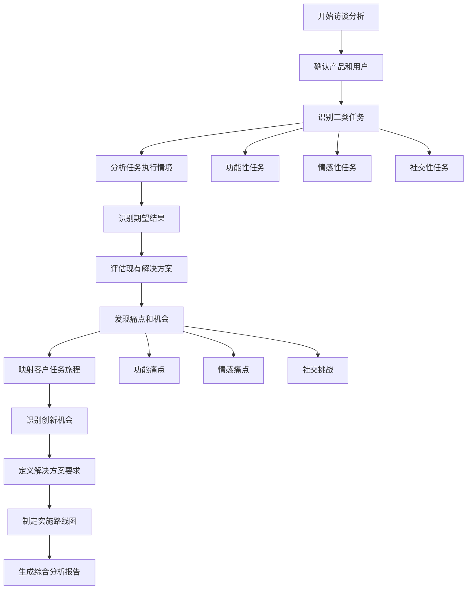
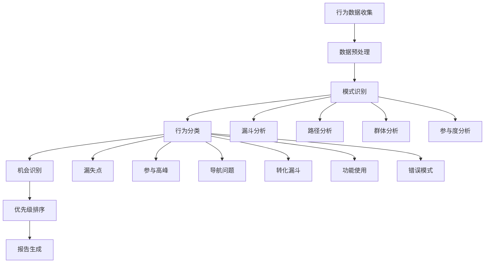
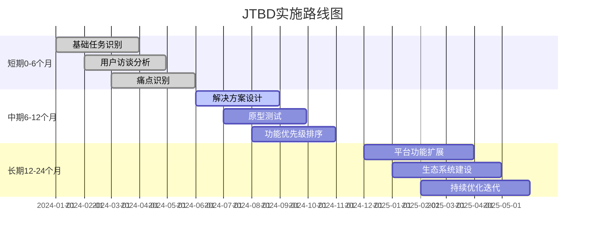

# 待办任务理论（Jobs to be Done）

<cite>
**本文档引用的文件**
- [jtbd.md](file://niopd/commands/UR/jtbd.md)
- [interview.md](file://niopd/commands/UR/interview.md)
- [behavior.md](file://niopd/commands/UR/behavior.md)
- [personas.md](file://niopd/commands/UR/personas.md)
- [kano.md](file://niopd/commands/UR/kano.md)
- [journey.md](file://niopd/commands/UR/journey.md)
- [interview-summary-template.md](file://niopd/templates/interview-summary-template.md)
</cite>

## 目录
1. [引言](#引言)
2. [理论基础](#理论基础)
3. [核心概念](#核心概念)
4. [三重任务维度](#三重任务维度)
5. [访谈分析流程](#访谈分析流程)
6. [行为数据分析](#行为数据分析)
7. [应用场景与实践](#应用场景与实践)
8. [工具与方法论](#工具与方法论)
9. [实施路线图](#实施路线图)
10. [总结与建议](#总结与建议)

## 引言

待办任务理论（Jobs to be Done，简称JTBD）是一种革命性的产品开发和创新框架，它彻底改变了我们理解用户需求的方式。该理论由哈佛商学院教授克莱顿·克里斯滕森（Clayton Christensen）提出，并通过"创新者的解决方案"一书广为人知。

JTBD理论的核心洞察是：**用户不是购买产品，而是"雇佣"产品来完成特定任务**。这一视角超越了传统的功能导向思维，让我们能够深入理解用户的真实需求和动机。

## 理论基础

### 发展历程

待办任务理论的发展经历了几个重要阶段：

1. **起源阶段**：克莱顿·克里斯滕森在20世纪90年代提出这一概念
2. **发展期**：通过"创新者的解决方案"等著作推广
3. **深化阶段**：Tony Ulwick发展了Outcome-Driven Innovation（ODI）方法
4. **应用阶段**：广泛应用于产品开发、市场营销和战略规划

### 核心原理

JTBD理论建立在以下核心原理之上：

- **任务雇佣模型**：用户"雇佣"产品来完成特定任务
- **结果导向**：关注用户期望的结果而非具体功能
- **情境依赖**：任务执行受具体情境影响
- **持续演进**：用户需求随时间和环境变化

**节来源**
- [jtbd.md](file://niopd/commands/UR/jtbd.md#L15-L35)

## 核心概念

### 任务陈述公式

JTBD理论使用标准化的任务陈述格式：

```
当我 [情境]
我想要 [动机]
这样我就能 [预期结果]
```

**示例对比**：
- ❌ 错误："用户想要一个更快的搜索功能"
- ✅ 正确："当我在移动设备上查找信息时，我想要快速找到答案，这样我就能不被打断地继续手头的工作"

### 关键术语定义

| 术语 | 定义 | 重要性 |
|------|------|--------|
| 任务（Job） | 用户寻求完成的进度或目标 | 核心概念 |
| 结果（Outcome） | 任务完成后的期望状态 | 驱动因素 |
| 约束（Constraint） | 影响任务执行的因素 | 实际限制 |
| 竞争方案（Competing Solutions） | 替代任务解决方案 | 市场竞争 |
| 雇佣标准（Hiring Criteria） | 选择解决方案的标准 | 决策依据 |

**节来源**
- [jtbd.md](file://niopd/commands/UR/jtbd.md#L36-L50)

## 三重任务维度

### 功能性任务（Functional Jobs）

功能性任务关注用户需要完成的具体实用任务：

**特点**：
- 实用性强，直接解决具体问题
- 可量化，有明确的成功标准
- 技术导向，关注性能指标

**分析要点**：
- 任务触发条件
- 执行步骤和流程
- 成功衡量标准
- 频率和持续时间

**示例**：
- "当我要准备一份报告时，我需要快速整理数据，这样我就能按时提交给上级"
- "当我要在线购物时，我需要安全支付，这样我就能放心完成交易"

### 情感性任务（Emotional Jobs）

情感性任务关注用户在任务执行过程中的情感体验：

**特点**：
- 主观性强，涉及个人感受
- 关注用户体验和满意度
- 品牌和信任相关

**分析要点**：
- 用户期望的情感状态
- 情感触发因素
- 当前情感体验
- 情感障碍和挑战

**示例**：
- "当我要做重要决策时，我需要感到自信，这样我就不怕承担后果"
- "当我要学习新技能时，我希望感到兴奋，这样我就能保持学习动力"

### 社交性任务（Social Jobs）

社交性任务关注用户希望在他人面前呈现的形象：

**特点**：
- 社会认同导向
- 外在表现和形象
- 同侪压力和认可

**分析要点**：
- 目标受众和观察者
- 社会地位和声誉
- 形象管理需求
- 社交风险规避

**示例**：
- "当我要参加重要会议时，我需要看起来专业，这样我就能获得同事的尊重"
- "当我要展示工作成果时，我希望显得有能力，这样我就能提升职业形象"

**节来源**
- [jtbd.md](file://niopd/commands/UR/jtbd.md#L51-L60)

## 访谈分析流程

### /niopd:UR:jtbd 指令的访谈分析流程

基于项目中的JTBD分析工具，以下是系统化的访谈分析流程：



**图表来源**
- [jtbd.md](file://niopd/commands/UR/jtbd.md#L122-L166)

### 访谈分析步骤详解

#### 第一步：确认基本信息
- 确定分析的产品名称
- 明确目标用户群体
- 界定使用场景和上下文

#### 第二步：识别任务类型
通过系统化提问识别三种任务类型：

**功能性任务识别**：
- "使用[产品]时，您主要想完成什么具体任务？"
- "在执行这些任务时，您最看重哪些方面？"

**情感性任务识别**：
- "在使用[产品]的过程中，您希望有什么样的感受？"
- "什么样的体验会让您觉得满意？"

**社交性任务识别**：
- "使用[产品]时，您希望别人如何看待您？"
- "在社交场合中，您希望通过[产品]传达什么信息？"

#### 第三步：分析任务执行情境
- 触发事件和时机
- 执行地点和环境
- 时间约束和紧迫性
- 资源可用性

#### 第四步：识别期望结果
按照不同维度分类识别期望结果：

**速度和时间维度**：
- 最小化完成时间
- 最大化响应速度
- 最小化等待时间

**质量和准确性维度**：
- 最小化错误率
- 最大化结果质量
- 最小化风险

**便利性和效率维度**：
- 最小化操作步骤
- 最大化自动化程度
- 最小化学习成本

**节来源**
- [jtbd.md](file://niopd/commands/UR/jtbd.md#L122-L140)

## 行为数据分析

### /niopd:UR:behavior 指令的应用

行为数据分析提供了量化的方法来理解用户任务执行模式：



**图表来源**
- [behavior.md](file://niopd/commands/UR/behavior.md#L40-L60)

### 行为模式分类

| 模式类型 | 描述 | 业务影响 | 改进机会 |
|----------|------|----------|----------|
| 漏失点 | 用户放弃任务的关键节点 | 流量损失，转化率下降 | 优化关键步骤 |
| 参与高峰 | 用户投入最多的时间点 | 高价值时刻 | 加强体验 |
| 导航问题 | 用户困惑或走错的路径 | 用户流失 | 简化流程 |
| 转化漏斗 | 完成目标的步骤序列 | 整体转化效果 | 优化流程 |
| 功能使用 | 特定功能的使用模式 | 功能价值体现 | 深化功能 |
| 错误模式 | 重复出现的失败序列 | 用户不满 | 错误预防 |

**节来源**
- [behavior.md](file://niopd/commands/UR/behavior.md#L150-L200)

## 应用场景与实践

### 产品改版案例

#### 案例1：电商平台改版

**原始问题**："我们的购物车转化率低"

**JTBD分析**：
- **功能性任务**：用户需要快速完成购买
- **情感性任务**：用户希望感到安全和信任
- **社交性任务**：用户希望展示购物品味

**发现的痛点**：
- 支付流程复杂，导致用户放弃
- 缺少信任标志，用户担心安全
- 购物车显示不直观，用户不确定价值

**解决方案**：
- 简化支付流程，减少步骤
- 添加安全认证标识
- 优化购物车界面，突出总价值

#### 案例2：教育平台升级

**原始问题**："学生学习完成率低"

**JTBD分析**：
- **功能性任务**：学生需要掌握知识
- **情感性任务**：学生希望感到成就感
- **社交性任务**：学生希望展示学习能力

**发现的痛点**：
- 学习内容碎片化，难以形成体系
- 缺少即时反馈，学生感到迷茫
- 学习进度不透明，缺乏激励

**解决方案**：
- 设计完整的学习路径
- 添加即时反馈机制
- 实现学习进度可视化

### 新功能设计案例

#### 案例3：协作工具的新功能

**任务识别**：
- **功能性任务**：团队需要高效沟通
- **情感性任务**：团队成员希望感到被重视
- **社交性任务**：团队希望展示专业能力

**功能设计原则**：
- **功能性**：支持多种沟通方式，提高效率
- **情感性**：添加鼓励和认可功能，增强归属感
- **社交性**：集成专业形象展示功能

**节来源**
- [jtbd.md](file://niopd/commands/UR/jtbd.md#L616-L660)

## 工具与方法论

### 相关框架整合

JTBD理论可以与其他用户研究方法有效结合：

```mermaid
mindmap
root((待办任务理论))
Personas
人物画像补充
用户特征描述
决策背景分析
Kano Model
功能分类
优先级排序
差异化定位
Journey Mapping
用户旅程
痛点识别
机会发现
Switch Interview
方案比较
雇佣标准
竞争分析
```

**图表来源**
- [jtbd.md](file://niopd/commands/UR/jtbd.md#L55-L60)

### /niopd:UR:interview 指令

访谈分析工具提供了系统化的质性研究方法：

**核心方法论**：
- **内容解析**：将访谈内容分解为可分析单元
- **关键点提取**：识别重要的声明和洞见
- **主题分析**：将相关点归类为连贯的主题
- **引证选择**：挑选最具代表性的原话证据
- **洞见合成**：连接主题到战略含义

**分析类型**：
- **显性需求**：明确表达的要求
- **隐性需求**：从行为和挑战中推断的需求
- **痛点**：沮丧和障碍
- **行为模式**：用户实际的工作方式
- **决策标准**：影响选择的因素
- **情感反应**：感觉和态度

**节来源**
- [interview.md](file://niopd/commands/UR/interview.md#L15-L35)

### /niopd:UR:personas 指令

人物画像工具帮助团队建立用户同理心：

**核心元素**：
- **人口统计学**：年龄、职业、位置、教育
- **心理统计学**：价值观、态度、动机、个性
- **行为**：使用模式、工作流、偏好
- **目标**：想要实现的目标
- **痛点**：挫折和挑战
- **需求**：要求和期望结果

**应用场景**：
- 产品决策指导
- 设计方向确定
- 营销信息制定
- 销售策略制定
- 客户成功支持

**节来源**
- [personas.md](file://niopd/commands/UR/personas.md#L15-L40)

### /niopd:UR:kano 指令

Kano模型用于分类产品特性：

**五种特性类别**：

| 类别 | 特征 | 满意度关系 | 行动建议 |
|------|------|------------|----------|
| 必需质量 | 缺失导致不满，存在无增益 | 必须实现 | 基础要求 |
| 一维质量 | 线性关系 - 更多 = 更满意 | 投资比例匹配竞争 | 性能优势 |
| 魅力质量 | 出现创造高满意度 | 差异化来源 | 竞争优势 |
| 中性质量 | 对满意度无影响 | 降级或移除 | 低优先级 |
| 反向质量 | 出现导致不满 | 消除 | 立即移除 |

**节来源**
- [kano.md](file://niopd/commands/UR/kano.md#L15-L50)

## 实施路线图

### 分阶段实施策略



### 具体行动计划

#### 阶段1：基础任务识别（0-6个月）
**关键活动**：
- 进行用户访谈，识别核心任务
- 建立任务数据库
- 初步痛点识别

**成功指标**：
- 完成至少10次深度访谈
- 识别出3-5个核心功能性任务
- 建立初步的用户画像

#### 阶段2：解决方案设计（6-12个月）
**关键活动**：
- 基于JTBD分析设计解决方案
- 创建功能原型
- 进行可用性测试

**成功指标**：
- 开发出至少2个解决方案原型
- 用户测试通过率达到80%
- 确定最终设计方案

#### 阶段3：平台功能扩展（12-24个月）
**关键活动**：
- 实施核心解决方案
- 扩展相关功能
- 建设生态系统

**成功指标**：
- 核心功能上线并稳定运行
- 用户满意度提升15%
- 新功能采用率达到30%

**节来源**
- [jtbd.md](file://niopd/commands/UR/jtbd.md#L141-L166)

## 总结与建议

### 核心价值

待办任务理论为企业带来了以下核心价值：

1. **深度理解用户**：超越表面功能需求，洞察真实动机
2. **创新机会识别**：发现未满足的用户需求和市场空白
3. **产品战略指导**：基于用户任务制定清晰的产品发展方向
4. **资源优化配置**：优先投资于真正有价值的改进
5. **竞争优势构建**：通过差异化满足独特用户需求

### 实施建议

#### 组织层面
- **文化转变**：从功能导向转向结果导向
- **跨部门协作**：确保产品、设计、市场团队协同工作
- **持续学习**：定期培训团队掌握JTBD方法

#### 团队层面
- **建立用户同理心**：通过人物画像和旅程地图培养用户视角
- **数据驱动决策**：结合定量和定性研究结果
- **快速验证**：通过原型和测试快速验证假设

#### 工具使用建议
- **综合运用**：将JTBD与Kano模型、人物画像等方法结合使用
- **迭代优化**：持续收集用户反馈并调整策略
- **跟踪进展**：建立关键指标监控JTBD实施效果

### 未来展望

随着技术的发展和用户需求的变化，JTBD理论将继续演进：

- **智能化应用**：利用AI技术自动识别用户任务
- **实时反馈**：建立动态的任务识别和响应机制
- **生态系统思维**：考虑更广泛的用户任务生态系统
- **个性化服务**：针对不同用户群体制定专门的任务解决方案

通过系统性地应用待办任务理论，企业能够更好地理解用户，创造真正有价值的产品和服务，从而在激烈的市场竞争中建立持久的竞争优势。