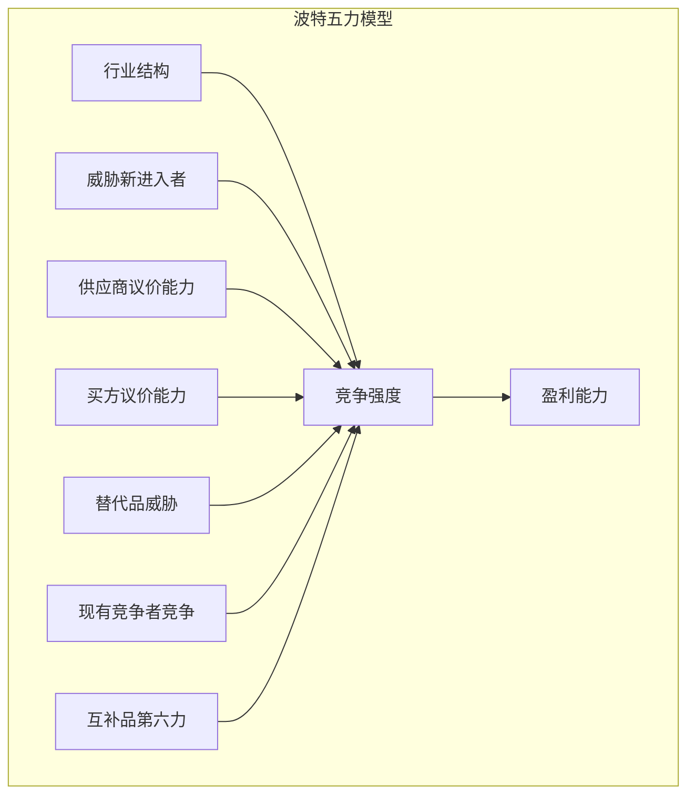
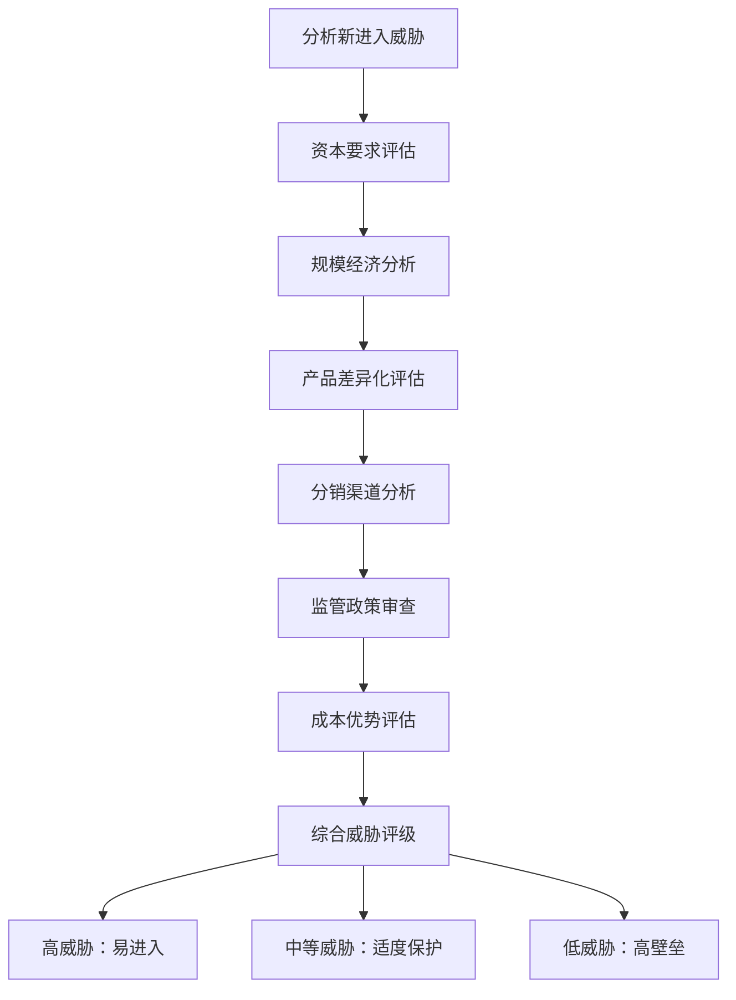
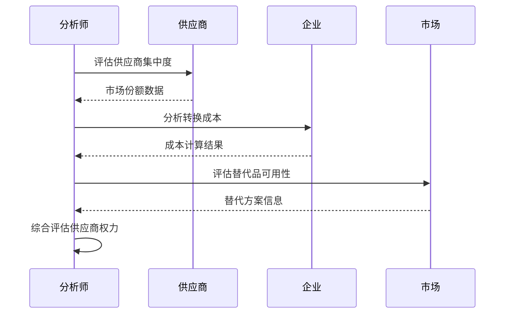
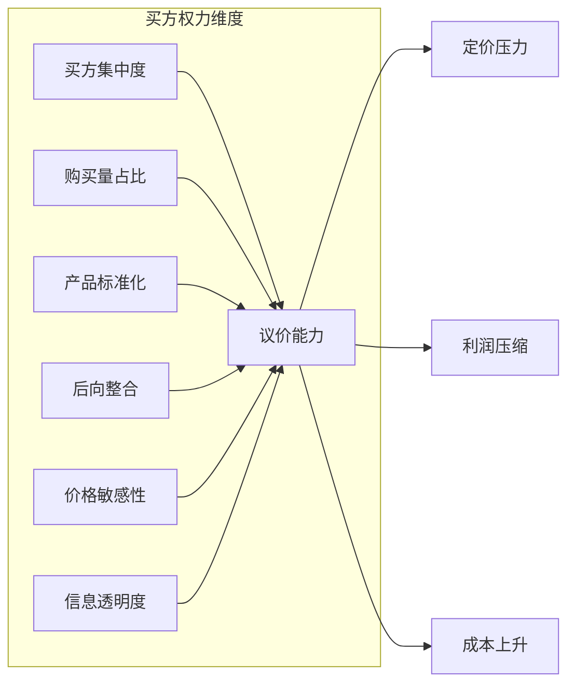
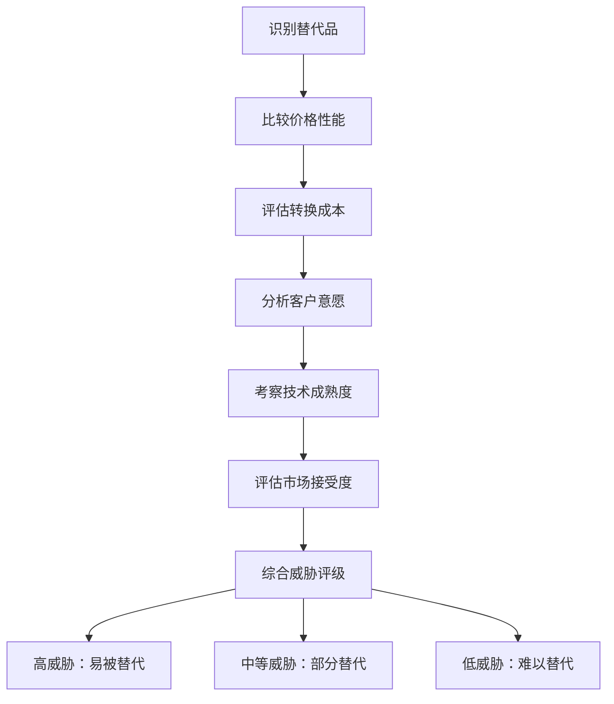
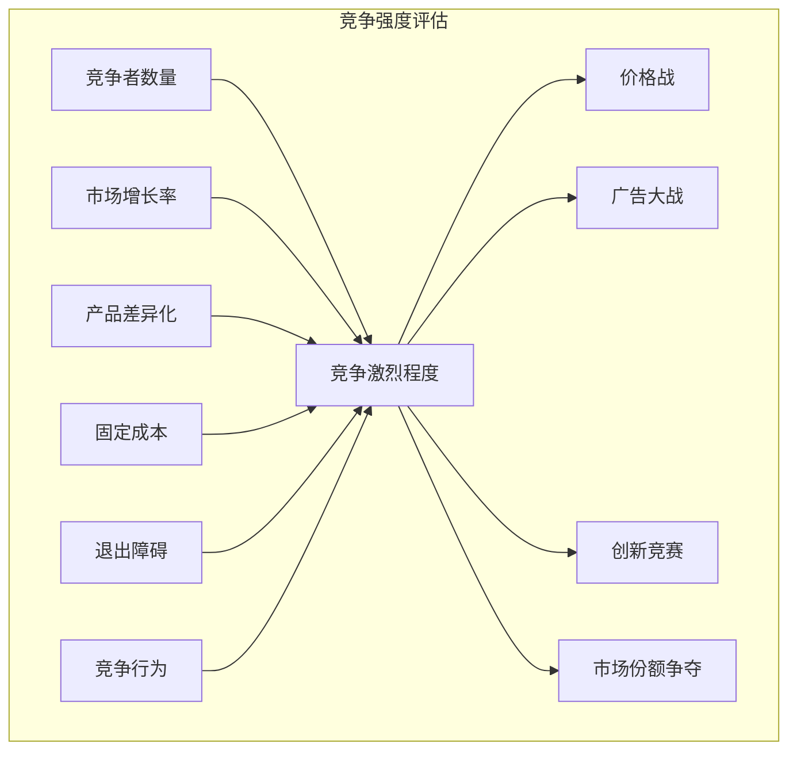
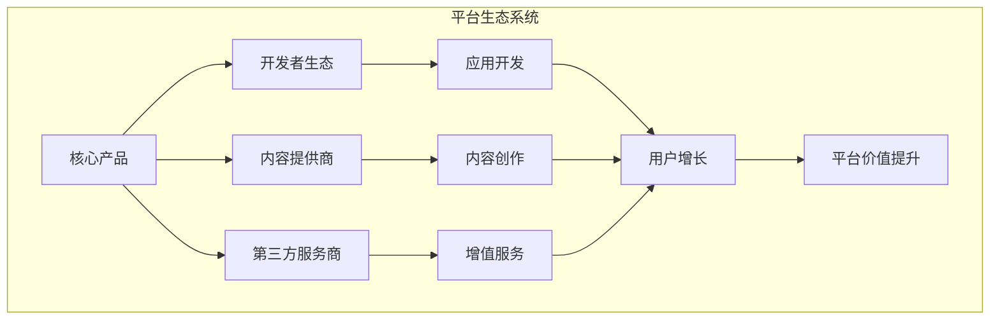
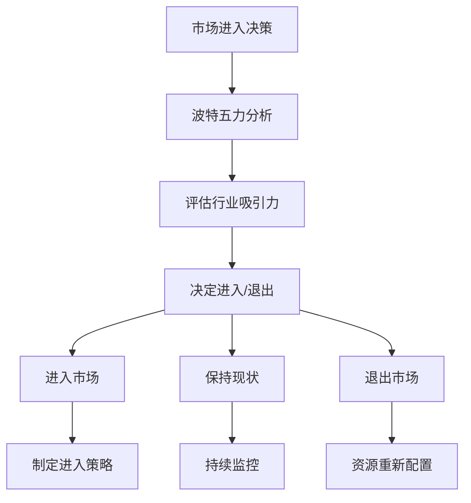
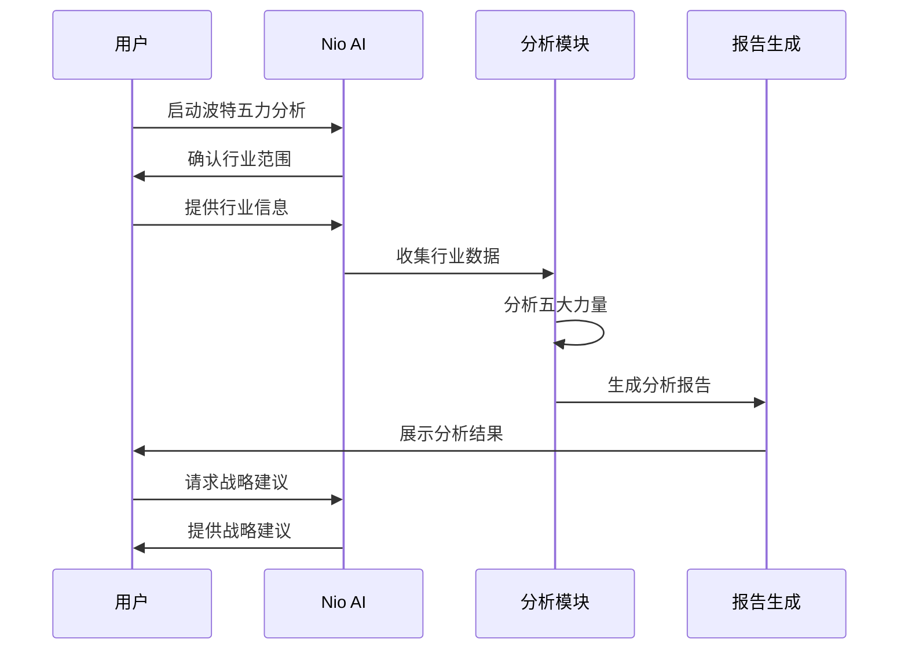

# 波特五力模型

<cite>
**本文档中引用的文件**
- [porters-five-forces.md](file://niopd/commands/ST/porters-five-forces.md)
- [README.md](file://README.md)
- [market-research-template.md](file://niopd/templates/market-research-template.md)
- [competitor-analysis-template.md](file://niopd/templates/competitor-analysis-template.md)
</cite>

## 目录
1. [引言](#引言)
2. [理论基础](#理论基础)
3. [五大竞争力量详解](#五大竞争力量详解)
4. [第六力：互补品](#第六力互补品)
5. [应用场景与战略意义](#应用场景与战略意义)
6. [实施指南](#实施指南)
7. [分析模板与工具](#分析模板与工具)
8. [真实市场分析案例](#真实市场分析案例)
9. [局限性与注意事项](#局限性与注意事项)
10. [总结](#总结)

## 引言

波特五力模型是由哈佛商学院教授迈克尔·波特（Michael E. Porter）在1979年首次提出，并在1980年的著作《竞争战略》中进一步阐述的商业战略分析框架。该模型被认为是商业战略领域最具影响力的分析工具之一，为企业提供了系统性分析行业竞争结构和盈利能力的科学方法。

在NioPD产品管理工具包中，波特五力模型被集成到ST（战略分析）指令集中，通过智能化的交互式分析流程，帮助企业产品经理和战略决策者深入了解市场吸引力、评估竞争格局，并为进入新市场提供战略指导。

## 理论基础

### 核心原理

波特五力模型的核心原理是通过分析五个关键的竞争力量来评估行业的吸引力和盈利能力。这些力量共同决定了行业的整体竞争强度，从而影响企业的盈利潜力。



**图表来源**
- [porters-five-forces.md](file://niopd/commands/ST/porters-five-forces.md#L10-L25)

### 模型演进

波特最初提出了五个核心力量，后来又补充了第六个重要的力量——互补品/补充品（Complementors）。这一补充特别适用于数字时代平台生态系统的发展。

**章节来源**
- [porters-five-forces.md](file://niopd/commands/ST/porters-five-forces.md#L10-L45)

## 五大竞争力量详解

### 1. 威胁新进入者（Threat of New Entrants）

新进入者的威胁是衡量行业壁垒的重要指标，直接影响现有企业的市场份额和盈利能力。

#### 关键因素分析

| 因素类别 | 具体要素 | 对行业的影响 |
|---------|----------|-------------|
| **资本要求** | 初始投资、设备成本、研发投入 | 高资本要求形成进入壁垒 |
| **规模经济** | 生产规模与成本的关系 | 规模越大，新进入者越难 |
| **产品差异化** | 品牌忠诚度、专利保护 | 差异化程度越高，威胁越低 |
| **分销渠道** | 渠道控制、合作伙伴关系 | 控制渠道增加进入难度 |
| **政府政策** | 许可证要求、环保法规 | 政策限制形成壁垒 |
| **转换成本** | 客户转向新供应商的成本 | 高转换成本降低威胁 |

#### 分析流程



**图表来源**
- [porters-five-forces.md](file://niopd/commands/ST/porters-five-forces.md#L117-L141)

#### 战略应对

- **建立品牌忠诚度**：通过持续的品牌建设和客户体验提升转换成本
- **实现规模经济**：通过扩大生产规模降低成本，形成成本优势
- **构建分销网络**：建立强大的销售和分销渠道网络
- **申请专利保护**：通过知识产权保护核心技术
- **设置转换成本**：设计难以替代的产品和服务

**章节来源**
- [porters-five-forces.md](file://niopd/commands/ST/porters-five-forces.md#L117-L141)

### 2. 供应商议价能力（Bargaining Power of Suppliers）

供应商的议价能力反映了上游企业在供应链中的影响力，直接影响企业的成本结构和利润空间。

#### 供应商权力分析框架

| 权力维度 | 评估要点 | 影响程度 |
|---------|----------|----------|
| **供应商集中度** | 市场中供应商的数量和市场份额 | 高集中度增加供应商权力 |
| **输入独特性** | 供应商提供的产品或服务的独特性 | 高独特性增加议价能力 |
| **转换成本** | 更换供应商的财务和技术成本 | 高转换成本降低企业议价能力 |
| **前向整合威胁** | 供应商成为竞争对手的可能性 | 威胁越大，供应商权力越强 |
| **供应商重要性** | 供应商产品对最终产品质量的影响 | 影响越大，权力越强 |
| **替代品可用性** | 是否存在替代供应商 | 替代品多，供应商权力弱 |

#### 供应商权力评估流程



**图表来源**
- [porters-five-forces.md](file://niopd/commands/ST/porters-five-forces.md#L143-L167)

#### 应对策略

- **多元化供应商**：避免过度依赖单一供应商
- **垂直整合**：在适当情况下向前整合
- **建立长期合作关系**：通过战略合作降低交易成本
- **开发替代供应商**：培养备用供应渠道
- **标准化采购流程**：提高议价能力和效率

**章节来源**
- [porters-five-forces.md](file://niopd/commands/ST/porters-five-forces.md#L143-L167)

### 3. 买方议价能力（Bargaining Power of Buyers）

买方的议价能力体现了下游客户对企业产品或服务的价格敏感性和选择权，直接影响企业的定价能力和利润空间。

#### 买方权力决定因素

| 权力来源 | 具体表现 | 对企业的影响 |
|---------|----------|-------------|
| **买方集中度** | 大客户数量和采购量占比 | 集中度高，买方权力大 |
| **购买量占比** | 产品成本在买方预算中的比重 | 比重高，议价能力强 |
| **产品标准化** | 产品差异化程度和替代性 | 标准化程度高，买方权力强 |
| **后向整合威胁** | 买方自行生产的能力 | 有整合威胁，买方权力增加 |
| **价格敏感性** | 买方对价格变动的反应程度 | 敏感性强，议价能力突出 |
| **信息获取能力** | 买方掌握市场信息的程度 | 信息充分，议价能力增强 |

#### 买方权力分析矩阵



**图表来源**
- [porters-five-forces.md](file://niopd/commands/ST/porters-five-forces.md#L169-L202)

#### 增强企业议价能力的方法

- **产品差异化**：通过创新和品牌建设减少价格敏感性
- **锁定客户**：通过长期合同和捆绑销售增加粘性
- **提升服务质量**：通过卓越的服务体验增加客户价值
- **建立客户社区**：通过社群效应增加客户忠诚度
- **提供增值服务**：通过附加价值降低价格敏感性

**章节来源**
- [porters-five-forces.md](file://niopd/commands/ST/porters-five-forces.md#L169-L202)

### 4. 替代品威胁（Threat of Substitutes）

替代品威胁是指其他产品或服务能够满足相同客户需求的可能性，这种威胁限制了企业的定价能力和市场份额。

#### 替代品威胁评估框架

| 评估维度 | 分析要点 | 影响权重 |
|---------|----------|----------|
| **价格性能比** | 替代品相对于原产品的性价比 | 核心指标 |
| **转换成本** | 客户转向替代品的财务和时间成本 | 重要指标 |
| **客户意愿** | 客户尝试替代品的倾向性 | 心理因素 |
| **技术成熟度** | 替代品的技术可靠性和稳定性 | 技术因素 |
| **市场接受度** | 替代品在市场上的普及程度 | 市场因素 |
| **竞争优势** | 企业相对于替代品的差异化优势 | 竞争因素 |

#### 替代品威胁分析流程



**图表来源**
- [porters-five-forces.md](file://niopd/commands/ST/porters-five-forces.md#L143-L167)

#### 应对替代品威胁的策略

- **持续创新**：通过技术创新保持产品领先
- **建立生态系统**：构建难以被替代的完整解决方案
- **提升客户粘性**：通过服务和体验锁定客户
- **快速响应市场变化**：及时调整产品策略
- **加强品牌建设**：通过品牌忠诚度抵御替代品

**章节来源**
- [porters-five-forces.md](file://niopd/commands/ST/porters-five-forces.md#L143-L167)

### 5. 现有竞争者竞争（Competitive Rivalry）

行业内现有企业的竞争强度是影响行业利润水平的关键因素，决定了市场竞争的激烈程度。

#### 竞争强度决定因素

| 因素类别 | 具体指标 | 对竞争的影响 |
|---------|----------|-------------|
| **竞争者数量** | 市场中参与者的总数 | 数量越多，竞争越激烈 |
| **市场增长率** | 行业整体的增长速度 | 增长率低，竞争更激烈 |
| **产品差异化** | 产品间的差异程度 | 差异化低，竞争更白热化 |
| **固定成本** | 企业的固定成本负担 | 固定成本高，竞争压力大 |
| **退出障碍** | 企业退出市场的难易程度 | 障碍高，竞争更持久 |
| **竞争行为** | 企业的竞争策略和行动 | 激进竞争导致恶性循环 |

#### 竞争强度评估矩阵



**图表来源**
- [porters-five-forces.md](file://niopd/commands/ST/porters-five-forces.md#L482-L508)

#### 管理竞争强度的策略

- **差异化战略**：通过独特价值主张避免价格竞争
- **专注细分市场**：在特定领域建立竞争优势
- **成本领先**：通过效率优势维持竞争力
- **建立品牌壁垒**：通过品牌建设形成护城河
- **战略合作**：通过合作减少恶性竞争

**章节来源**
- [porters-five-forces.md](file://niopd/commands/ST/porters-five-forces.md#L482-L508)

## 第六力：互补品（Complementors）

在数字时代的背景下，波特补充了第六个重要的竞争力量——互补品。这一力量在平台经济和生态系统中尤为重要。

### 互补品的概念与重要性

互补品是指那些与企业产品配合使用，能够增加产品价值的产品或服务。在平台经济中，互补品的重要性体现在：

- **价值创造**：互补品能够显著提升核心产品的价值
- **生态系统构建**：形成良性循环的商业生态系统
- **市场扩展**：通过互补品吸引新的用户群体
- **锁定效应**：增加用户转换成本

### 互补品分析框架

| 分析维度 | 评估要点 | 战略意义 |
|---------|----------|----------|
| **互补品类型** | 硬件、软件、服务等 | 了解生态系统构成 |
| **控制权** | 企业是否控制关键互补品 | 决定议价能力 |
| **丰富度** | 互补品的数量和质量 | 影响生态系统吸引力 |
| **协同效应** | 互补品与核心产品的配合程度 | 评估价值创造能力 |
| **开放性** | 生态系统的开放程度 | 影响第三方参与 |

### 平台生态系统分析



**章节来源**
- [porters-five-forces.md](file://niopd/commands/ST/porters-five-forces.md#L510-L519)

## 应用场景与战略意义

### 主要应用场景

波特五力模型在以下场景中发挥重要作用：

#### 1. 市场进入决策



#### 2. 竞争战略制定

- **成本领先战略**：通过降低单位成本应对竞争压力
- **差异化战略**：通过产品特色减少替代品威胁
- **集中化战略**：专注于特定细分市场避免全面竞争
- **一体化战略**：通过垂直整合降低供应商和买方权力

#### 3. 投资决策支持

- **行业选择**：评估不同行业的投资价值
- **并购评估**：分析目标公司的竞争地位
- **风险评估**：识别潜在的市场风险因素

#### 4. 业务模式创新

- **平台战略**：构建生态系统，利用互补品力量
- **订阅模式**：通过长期合同增加客户粘性
- **生态系统建设**：通过互补品创造新的价值

**章节来源**
- [porters-five-forces.md](file://niopd/commands/ST/porters-five-forces.md#L47-L56)

### 战略启示

波特五力模型提供了三个层次的战略思考：

1. **定位优势**：寻找竞争力量最弱的领域
2. **变革力量**：识别能够改变竞争格局的因素
3. **塑造力量**：主动采取行动改善竞争环境

**章节来源**
- [porters-five-forces.md](file://niopd/commands/ST/porters-five-forces.md#L57-L65)

## 实施指南

### 分析流程

波特五力分析遵循系统化的实施流程：



**图表来源**
- [porters-five-forces.md](file://niopd/commands/ST/porters-five-forces.md#L94-L115)

### 关键步骤

#### 1. 行业界定与范围确认

- **明确行业边界**：确定分析的具体行业范围
- **地理市场选择**：确定分析的地理范围（本地、全国、全球）
- **细分市场定位**：识别具体的市场细分

#### 2. 力量评估与趋势分析

- **当前状态评估**：对每个力量进行现状评估
- **趋势预测**：分析力量变化的趋势
- **动态平衡**：理解力量间的相互作用

#### 3. 综合评估与战略建议

- **整体吸引力评估**：基于五大力量的综合评估
- **关键驱动因素**：识别最重要的影响因素
- **战略定位建议**：提供具体的竞争策略

**章节来源**
- [porters-five-forces.md](file://niopd/commands/ST/porters-five-forces.md#L94-L234)

### 参数配置

NioPD的波特五力分析支持灵活的参数配置：

```bash
/niopd:ST:porters-five-forces --for=<行业名称> \
                             --market=<市场背景> \
                             --region=<地理区域>
```

**章节来源**
- [porters-five-forces.md](file://niopd/commands/ST/porters-five-forces.md#L66-L75)

## 分析模板与工具

### 标准分析模板

NioPD提供了完整的波特五力分析模板，包含：

#### 1. 执行摘要

- **行业吸引力评级**：高度吸引/中度吸引/中性/中度不吸引/高度不吸引
- **预期盈利能力**：高/中/低
- **关键发现**：最重要的力量影响
- **战略建议**：进入/增长/持有/收割/退出的建议

#### 2. 力量详细分析

每个力量都有详细的分析维度和评估框架：

- **威胁新进入者**：资本要求、规模经济、产品差异化、分销渠道、监管壁垒
- **供应商议价能力**：供应商集中度、输入独特性、转换成本、前向整合威胁
- **买方议价能力**：买方集中度、购买量占比、产品标准化、后向整合威胁
- **替代品威胁**：价格性能比、转换成本、客户意愿、技术成熟度
- **现有竞争者竞争**：竞争者数量、市场增长率、产品差异化、固定成本

#### 3. 战略建议框架

基于力量分析提供具体的战略建议：

- **威胁缓解策略**：针对高威胁力量的应对措施
- **优势强化策略**：利用自身优势改善竞争地位
- **市场定位策略**：在有利的市场位置建立竞争优势
- **生态系统建设**：在适用的情况下构建互补品生态系统

**章节来源**
- [porters-five-forces.md](file://niopd/commands/ST/porters-five-forces.md#L235-L470)

### 配套分析工具

波特五力分析可以与其他战略工具结合使用：

#### 1. PESTLE分析

- **政治因素**：政策法规对竞争力量的影响
- **经济因素**：宏观经济环境的变化
- **社会因素**：消费者行为的变化
- **技术因素**：技术创新对替代品的影响
- **法律因素**：知识产权保护
- **环境因素**：可持续发展要求

#### 2. SWOT分析

- **优势**：利用内部优势应对竞争压力
- **劣势**：识别需要改进的弱点
- **机会**：利用外部机会改善竞争地位
- **威胁**：防范外部威胁的影响

#### 3. 价值链分析

- **内部优势识别**：找出内部竞争优势
- **成本结构优化**：降低固定成本压力
- **差异化来源**：发现独特的价值创造点

**章节来源**
- [porters-five-forces.md](file://niopd/commands/ST/porters-five-forces.md#L66-L75)

## 真实市场分析案例

### 案例1：智能手机行业分析

#### 行业背景
智能手机行业是一个高度竞争的市场，受到技术创新和消费者偏好的快速变化影响。

#### 力量分析

| 力量 | 当前状态 | 趋势 | 影响 |
|------|----------|------|------|
| 新进入者威胁 | 中等 | 降低 | 由于高研发成本和品牌壁垒 |
| 供应商议价能力 | 低 | 稳定 | 多家供应商竞争 |
| 买方议价能力 | 高 | 增加 | 消费者选择众多 |
| 替代品威胁 | 中等 | 增加 | 可穿戴设备等 |
| 竞争者竞争 | 高 | 增加 | 主要厂商激烈竞争 |

#### 战略启示
- **差异化**：通过独特的功能和设计避免价格竞争
- **生态系统**：构建应用商店和开发者生态
- **品牌建设**：通过品牌忠诚度降低买方议价能力
- **技术创新**：持续投入研发保持技术领先

### 案例2：电动汽车行业分析

#### 行业特点
电动汽车行业正处于快速增长期，受到政策支持和技术进步的推动。

#### 力量分析

| 力量 | 当前状态 | 趋势 | 影响 |
|------|----------|------|------|
| 新进入者威胁 | 中等 | 增加 | 政策鼓励新企业进入 |
| 供应商议价能力 | 中等 | 降低 | 电池技术逐渐成熟 |
| 买方议价能力 | 中等 | 增加 | 价格敏感度提高 |
| 替代品威胁 | 低 | 降低 | 燃油车转型困难 |
| 竞争者竞争 | 高 | 增加 | 传统车企和新势力竞争 |

#### 战略启示
- **垂直整合**：控制电池等关键部件供应链
- **充电网络**：建设充电基础设施形成壁垒
- **技术创新**：在电池技术和自动驾驶方面领先
- **政策利用**：充分利用政府补贴和优惠政策

### 案例3：在线教育平台分析

#### 行业背景
在线教育行业受益于技术进步和疫情期间的特殊需求。

#### 力量分析

| 力量 | 当前状态 | 趋势 | 影响 |
|------|----------|------|------|
| 新进入者威胁 | 高 | 增加 | 技术门槛相对较低 |
| 供应商议价能力 | 低 | 稳定 | 内容供应商众多 |
| 买方议价能力 | 中等 | 增加 | 价格敏感度提高 |
| 替代品威胁 | 中等 | 增加 | 传统教育机构转型 |
| 竞争者竞争 | 高 | 增加 | 市场参与者众多 |

#### 战略启示
- **内容差异化**：提供独特和高质量的教学内容
- **用户体验**：优化平台界面和交互体验
- **品牌建设**：建立良好的品牌形象和口碑
- **技术投入**：利用AI和大数据提升教学效果

## 局限性与注意事项

### 模型局限性

#### 1. 静态视角

波特五力模型提供的是静态的行业快照，无法完全反映动态的市场变化：

- **行业边界模糊**：随着技术融合，传统行业边界变得模糊
- **跨界竞争**：新兴技术可能导致跨行业竞争
- **生态系统变化**：平台经济中的竞争格局快速变化

#### 2. 宏观因素忽视

模型主要关注微观竞争层面，忽视了宏观环境的影响：

- **政策法规变化**：政府政策对行业竞争格局的重大影响
- **经济周期**：宏观经济环境对竞争强度的影响
- **技术革命**：颠覆性技术可能重塑整个行业

#### 3. 特殊行业适用性

某些行业类型对波特五力模型的适用性有限：

- **网络型业务**：平台经济中的双边市场特性
- **共享经济**：共享模式下的竞争逻辑
- **订阅经济**：订阅模式对客户粘性的影响

### 实施注意事项

#### 1. 动态监控

波特五力分析应该是一个持续的过程，需要定期更新：

- **定期复审**：至少每年重新评估一次
- **趋势跟踪**：关注行业发展趋势和变化
- **竞争情报**：持续收集竞争对手信息

#### 2. 数据质量

保证分析的质量需要高质量的数据支持：

- **可靠数据源**：使用权威的行业报告和数据
- **实时信息**：关注最新的市场动态
- **定量与定性结合**：平衡数据分析和专家判断

#### 3. 战略连接

将波特五力分析与具体战略相结合：

- **战略匹配**：确保分析结果与实际战略需求对接
- **行动计划**：将分析转化为具体的行动方案
- **效果评估**：建立评估机制跟踪战略效果

**章节来源**
- [porters-five-forces.md](file://niopd/commands/ST/porters-five-forces.md#L66-L75)

## 总结

波特五力模型作为商业战略分析的经典框架，在理解和评估行业竞争结构方面具有重要价值。通过系统分析威胁新进入者、供应商议价能力、买方议价能力、替代品威胁和现有竞争者竞争这五大力量，企业能够：

### 核心价值

1. **系统性思维**：提供全面的行业竞争分析框架
2. **战略指导**：为企业战略决策提供依据
3. **风险识别**：帮助识别潜在的市场风险
4. **机会发现**：发现未被充分开发的市场机会

### 实践应用

在NioPD产品管理工具包中，波特五力模型通过智能化的交互式分析流程，使复杂的战略分析变得更加 accessible 和 actionable。无论是市场进入决策、竞争战略制定还是投资评估，波特五力模型都能提供有价值的洞见。

### 未来发展

随着商业环境的不断变化，波特五力模型也在持续演进：

- **数字化转型**：适应数字经济时代的竞争特点
- **生态系统思维**：重视平台经济和互补品的作用
- **可持续发展**：考虑环境和社会因素的影响
- **全球化视野**：适应全球化的竞争格局

通过持续学习和实践，企业能够更好地运用波特五力模型这一强大工具，在复杂多变的商业环境中制定有效的竞争战略。