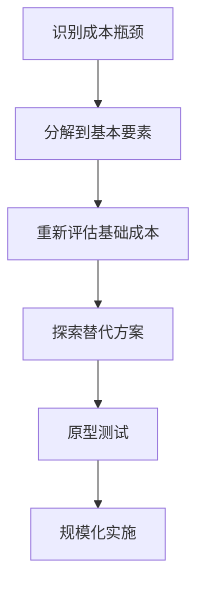
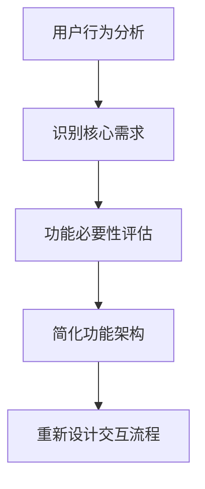
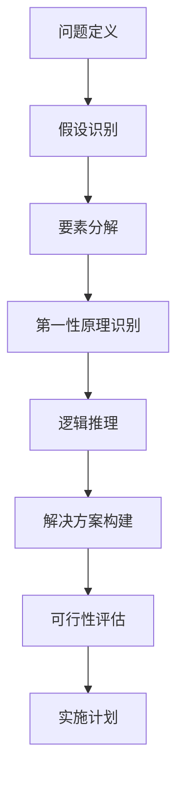
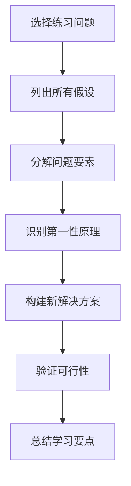

# 第一性原理思维

<cite>
**本文档引用的文件**
- [first-principles.md](file://niopd/commands/DT/first-principles.md)
- [five-whys.md](file://niopd/commands/DT/five-whys.md)
- [socratic-questioning.md](file://niopd/commands/DT/socratic-questioning.md)
- [README.md](file://README.md)
</cite>

## 目录
1. [引言](#引言)
2. [第一性原理思维的理论基础](#第一性原理思维的理论基础)
3. [NioPD中第一性原理指令的实际应用](#niopd中第一性原理指令的实际应用)
4. [商业决策中的第一性原理实践](#商业决策中的第一性原理实践)
5. [产品设计中的第一性原理应用](#产品设计中的第一性原理应用)
6. [常见误区与优化建议](#常见误区与优化建议)
7. [与其他思维工具的比较](#与其他思维工具的比较)
8. [建立底层逻辑推理能力](#建立底层逻辑推理能力)
9. [总结](#总结)

## 引言

第一性原理思维是一种革命性的思维方式，它要求我们摆脱常规思维模式的束缚，将复杂问题分解到最基本的构成元素，然后从这些根本真理出发重新构建解决方案。这种方法不仅在科学发现和技术革新中发挥着关键作用，也在现代商业决策和产品管理中展现出强大的价值。

NioPD（Nio Product Development）作为一款智能产品管理助手，将第一性原理思维这一古老而强大的方法论融入到其核心功能中，通过专门的指令系统帮助用户在面对复杂问题时能够跳出传统思维框架，找到创新的解决方案。

## 第一性原理思维的理论基础

### 哲学起源与发展

第一性原理思维可以追溯到古希腊哲学，特别是亚里士多德的形而上学思想。亚里士多德将第一原则定义为"事物被认识的第一个基础"，这是任何知识体系中最基本、不可再分的真理。

在现代，这一概念得到了埃隆·马斯克等创新者的复兴和发扬。马斯克将第一性原理思维应用于火箭制造、电动汽车等多个领域，通过回归物质的基本属性来重新思考工程和商业问题。

### 核心原则与特征

第一性原理思维具有以下关键特征：

1. **去伪存真**：识别并消除表面的假设和惯例
2. **分解重构**：将复杂问题拆解为基础元素，然后重新组装
3. **创新突破**：创造不受传统约束的新解决方案
4. **逻辑严密**：基于绝对真实的前提进行推理
5. **系统性**：采用结构化的方法论

### 应用场景

第一性原理思维特别适用于以下情况：

- **颠覆性创新机会**：当现有解决方案无法满足需求时
- **突破行业限制**：面对传统思维无法解决的问题
- **挑战固有商业模式**：重新思考业务的根本逻辑
- **复杂工程设计**：需要深度理解和创新的领域
- **战略决策**：需要全新视角的重大决策

**章节来源**
- [first-principles.md](file://niopd/commands/DT/first-principles.md#L10-L58)

## NioPD中第一性原理指令的实际应用

### 指令结构与参数

NioPD提供了专门的`/niopd:DT:first-principles`指令，支持灵活的问题分析：

```bash
/niopd:DT:first-principles [--problem=<problem_statement>] [--domain=<problem_domain>] [--assumptions=<assumptions_list>]
```

### 使用流程详解

NioPD的第一性原理分析遵循系统化的13步流程：

#### 第一步：问题识别与上下文收集
- 明确指定的问题陈述
- 确定问题所属的领域或专业背景
- 识别初始假设和预设观念

#### 第二步：建立第一性原理框架
解释第一性原理思维的本质：
"第一性原理思维涉及将复杂问题分解为其最基本的构成元素，然后从那里重新构建。我们将挑战传统智慧，从基本真理出发重建解决方案。"

#### 第三步：问题定义与范围界定
引导用户明确：
- 具体要解决的问题是什么
- 受影响的利益相关者是谁
- 当前问题的影响程度
- 成功的标准应该是什么

#### 第四步：假设识别与挑战
帮助用户识别：
- 明确的假设
- 潜在的隐性假设
- 行业"最佳实践"

#### 第五步：问题分解
指导用户将问题分解为：
- 关键组成部分
- 根本原因
- 相互关系

#### 第六步：第一性原理识别
寻找：
- 基本科学原理
- 数学定律
- 经济学原理
- 经验证实的事实

#### 第七步：从第一性原理推理
基于基本真理进行逻辑推导：
- 发现新的途径
- 移除约束条件
- 探索新可能性

#### 第八步：解决方案重构
基于第一性原理推理构建：
- 创新方案
- 解决方案的特点

#### 第九步：实施计划
制定：
- 实施步骤
- 所需资源
- 时间表

#### 第十步：洞察总结
反思：
- 新发现的见解
- 对问题理解的演进
- 突破性想法

#### 第十一步：关键洞察文档化
总结session的主要洞察：
- 挑战的假设
- 识别的第一性原理
- 开发的创新解决方案

#### 第十二步：后续建议
推荐行动：
- 进一步研究特定原理
- 原型化解决方案
- 将洞察应用到相关问题
- 使用其他思维框架探索

#### 第十三步：生成报告
创建详细的markdown报告，包含完整的分析过程和结论。

### 实际调用示例

```bash
# 基本用法
/niopd:DT:first-principles --problem="降低云存储成本"

# 包含领域和假设的完整分析
/niopd:DT:first-principles --problem="提高电动汽车续航里程" --domain="新能源汽车" --assumptions="电池技术已达到极限"
```

**章节来源**
- [first-principles.md](file://niopd/commands/DT/first-principles.md#L60-L246)

## 商业决策中的第一性原理实践

### 案例分析：埃隆·马斯克的创新实践

#### SpaceX的火箭成本优化

**传统思维**：火箭发射成本高昂是因为技术复杂，无法大幅降低。

**第一性原理分析**：
1. **分解问题**：将火箭分解为基本材料成分
2. **识别第一性原理**：铝、钛、碳纤维等原材料的成本
3. **重新思考**：为什么不能重复使用火箭？
4. **创新解决方案**：开发可回收的猎鹰系列火箭

**结果**：将发射成本降低了90%，彻底改变了航天产业。

#### 特斯拉的电动汽车革命

**传统思维**：电动汽车成本高，电池技术限制了续航。

**第一性原理分析**：
1. **分解电池**：将电池分解为化学成分
2. **识别第一性原理**：锂、镍、钴等材料的成本
3. **重新思考**：能否简化电池设计？
4. **创新解决方案**：开发更高效的电池管理系统和轻量化车身设计

### 商业决策中的应用模式

#### 1. 成本优化决策

**问题识别**：传统成本削减方法效果有限

**第一性原理分析**：
- 分解成本结构到原材料和工艺
- 重新评估供应链效率
- 考虑替代材料和制造方法
- 重新设计产品生命周期

**实施路径**：


#### 2. 市场定位决策

**问题识别**：现有市场定位过于保守

**第一性原理分析**：
- 重新思考消费者真正的需求
- 分析价值主张的基础
- 重新定义目标客户群
- 构建全新的品牌叙事

#### 3. 产品创新决策

**问题识别**：现有产品线缺乏差异化

**第一性原理分析**：
- 重新思考产品功能的本质
- 分析用户真实痛点
- 探索技术融合的可能性
- 构建全新的用户体验

**章节来源**
- [first-principles.md](file://niopd/commands/DT/first-principles.md#L40-L58)

## 产品设计中的第一性原理应用

### 从用户需求到产品功能的重构

#### 用户体验设计的第一性原理

**传统思维**：遵循行业标准的设计模式

**第一性原理分析**：
1. **分解用户体验**：视觉、交互、情感三个维度
2. **识别基本需求**：可用性、效率、愉悦感
3. **重新设计**：基于认知科学和人机交互原理

#### 功能设计的第一性原理

**问题**：功能过多导致用户困惑

**分析流程**：


### 技术架构的第一性原理

#### 数据架构设计

**传统思维**：采用标准化的数据仓库架构

**第一性原理分析**：
- 重新思考数据的本质和价值
- 基于实时性和准确性的需求重新设计
- 考虑边缘计算和分布式架构的可行性

#### 系统集成的第一性原理

**问题**：系统集成复杂度高

**解决方案**：
1. **分解系统边界**：识别真正的集成需求
2. **重新设计接口**：基于API-first原则
3. **考虑微服务架构**：基于业务能力重组

### 产品路线图的第一性原理

#### 价值驱动的产品规划

**传统思维**：按功能模块规划产品路线图

**第一性原理分析**：
- 重新思考用户价值的真正来源
- 基于用户旅程的价值流规划
- 考虑技术演进的长期影响

**章节来源**
- [draft-prd.md](file://niopd/commands/PD/draft-prd.md#L179-L199)

## 常见误区与优化建议

### 常见误区

#### 1. 将第一性原理简单等同于"打破常规"

**误区表现**：
- 仅仅为了创新而创新
- 忽视实际可行性的考量
- 过度理想化解决方案

**正确做法**：
- 基于扎实的事实和数据
- 考虑技术和经济可行性
- 保持现实主义的判断

#### 2. 忽视专业知识的重要性

**误区表现**：
- 轻视领域专家的知识
- 过度依赖非专业人士的意见
- 忽视技术发展的历史积累

**正确做法**：
- 尊重专业领域的知识体系
- 结合专家经验和第一性原理
- 在继承基础上寻求创新

#### 3. 追求完美解决方案

**误区表现**：
- 期望一次分析就找到终极答案
- 对不完美的解决方案感到沮丧
- 过度追求理论上的完美

**正确做法**：
- 接受渐进式的改进过程
- 将第一性原理作为起点而非终点
- 通过迭代不断优化

### 优化建议

#### 1. 建立系统化的分析框架

**建议结构**：


#### 2. 培养跨学科思维能力

**方法**：
- 学习基础科学原理
- 了解经济学基本规律
- 掌握心理学洞察
- 熟悉技术发展趋势

#### 3. 建立验证机制

**验证方法**：
- 通过实验验证假设
- 收集用户反馈
- 进行小规模试点
- 建立迭代改进机制

#### 4. 团队协作优化

**最佳实践**：
- 组建跨职能团队
- 建立开放的讨论文化
- 鼓励质疑和挑战
- 建立知识共享机制

**章节来源**
- [first-principles.md](file://niopd/commands/DT/first-principles.md#L239-L246)

## 与其他思维工具的比较

### 与五个为什么的比较

#### 相似之处
- 都强调深入挖掘根本原因
- 都采用逐步深入的方法
- 都有助于系统性问题解决

#### 不同之处

| 特征 | 第一性原理思维 | 五个为什么 |
|------|---------------|-----------|
| **方法论** | 归纳法，从具体到抽象 | 演绎法，从现象到原因 |
| **适用场景** | 复杂创新问题 | 重复性质量问题 |
| **时间投入** | 较长，需要深度思考 | 较短，快速定位 |
| **结果类型** | 创新解决方案 | 根本原因识别 |
| **团队规模** | 更适合跨学科团队 | 更适合问题解决团队 |

### 与苏格拉底式提问的比较

#### 相似之处
- 都强调批判性思维
- 都重视假设的检验
- 都鼓励深度思考

#### 不同之处

| 特征 | 第一性原理思维 | 苏格拉底式提问 |
|------|---------------|---------------|
| **目标导向** | 解决具体问题 | 探索概念理解 |
| **结构化程度** | 高度结构化 | 更开放灵活 |
| **知识基础** | 基于事实和原理 | 基于概念和定义 |
| **应用场景** | 商业决策、产品设计 | 教育、哲学探讨 |
| **输出形式** | 具体解决方案 | 概念澄清和洞见 |

### 与设计思维的比较

#### 协同优势
- **第一性原理**：提供创新的起点
- **设计思维**：确保解决方案的人性化
- **结合使用**：既创新又实用

**协同流程**：


**章节来源**
- [five-whys.md](file://niopd/commands/DT/five-whys.md#L1-L50)
- [socratic-questioning.md](file://niopd/commands/DT/socratic-questioning.md#L1-L50)

## 建立底层逻辑推理能力

### 思维训练方法

#### 1. 基础知识积累

**科学基础**：
- 学习物理学基本原理
- 掌握数学逻辑方法
- 了解经济学基本规律
- 熟悉心理学洞察

**专业技能**：
- 深入理解所在行业的知识体系
- 掌握数据分析方法
- 学习系统思维
- 培养批判性思维

#### 2. 实践练习

**日常练习**：
- 对日常问题进行第一性原理分析
- 挑战自己的假设和信念
- 参与跨学科讨论
- 阅读经典著作

**结构化练习**：


#### 3. 反思与改进

**反思清单**：
- 我是否真的理解了问题的本质？
- 我的假设有哪些可能是错误的？
- 是否存在更好的第一性原理？
- 解决方案是否真正解决了根本问题？

### 团队建设

#### 1. 知识共享文化

**建立机制**：
- 定期的知识分享会
- 跨部门的学习小组
- 第一性原理案例库
- 最佳实践分享平台

#### 2. 协作工具

**推荐工具**：
- NioPD第一性原理指令
- 思维导图软件
- 协作白板工具
- 知识管理平台

#### 3. 绩效评估

**评估维度**：
- 第一性原理思维的应用频率
- 创新解决方案的数量和质量
- 团队协作的效果
- 实际成果的转化率

### 持续改进机制

#### 1. 反馈循环

**PDCA循环**：
- **Plan**：制定第一性原理分析计划
- **Do**：实施分析过程
- **Check**：评估结果和过程
- **Act**：改进方法和流程

#### 2. 知识更新

**持续学习**：
- 关注最新的科学研究
- 学习其他领域的思维方法
- 参与专业培训和研讨会
- 阅读经典和前沿著作

#### 3. 技术工具

**工具发展**：
- AI辅助的第一性原理分析
- 数据驱动的验证方法
- 虚拟现实的模拟环境
- 协作平台的智能化

**章节来源**
- [first-principles.md](file://niopd/commands/DT/first-principles.md#L174-L222)

## 总结

第一性原理思维作为一种强大的思维方式，在现代商业环境中展现出巨大的价值。通过NioPD提供的专门指令，我们可以系统化地应用这一方法论，解决复杂的产品管理和商业决策问题。

### 核心价值

1. **创新驱动力**：帮助我们突破传统思维的限制
2. **问题解决力**：提供系统化的问题分析方法
3. **决策质量**：基于事实和逻辑的决策支持
4. **竞争优势**：创造独特的价值主张

### 实践建议

1. **持之以恒**：第一性原理思维需要长期培养
2. **系统应用**：将其作为日常工作的一部分
3. **团队协作**：在团队中推广这一思维方式
4. **持续改进**：根据实践经验不断完善方法

### 未来展望

随着人工智能技术的发展，第一性原理思维的应用将更加智能化和普及化。NioPD这样的工具将帮助更多企业和个人掌握这一强大的思维方法，推动创新和进步。

通过深入理解和实践第一性原理思维，我们不仅能够更好地应对当前的挑战，还能够预见未来的机遇，创造出真正有价值的产品和服务。