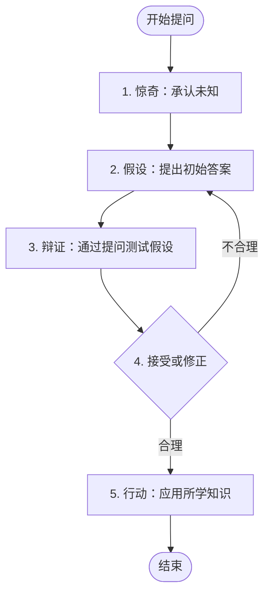
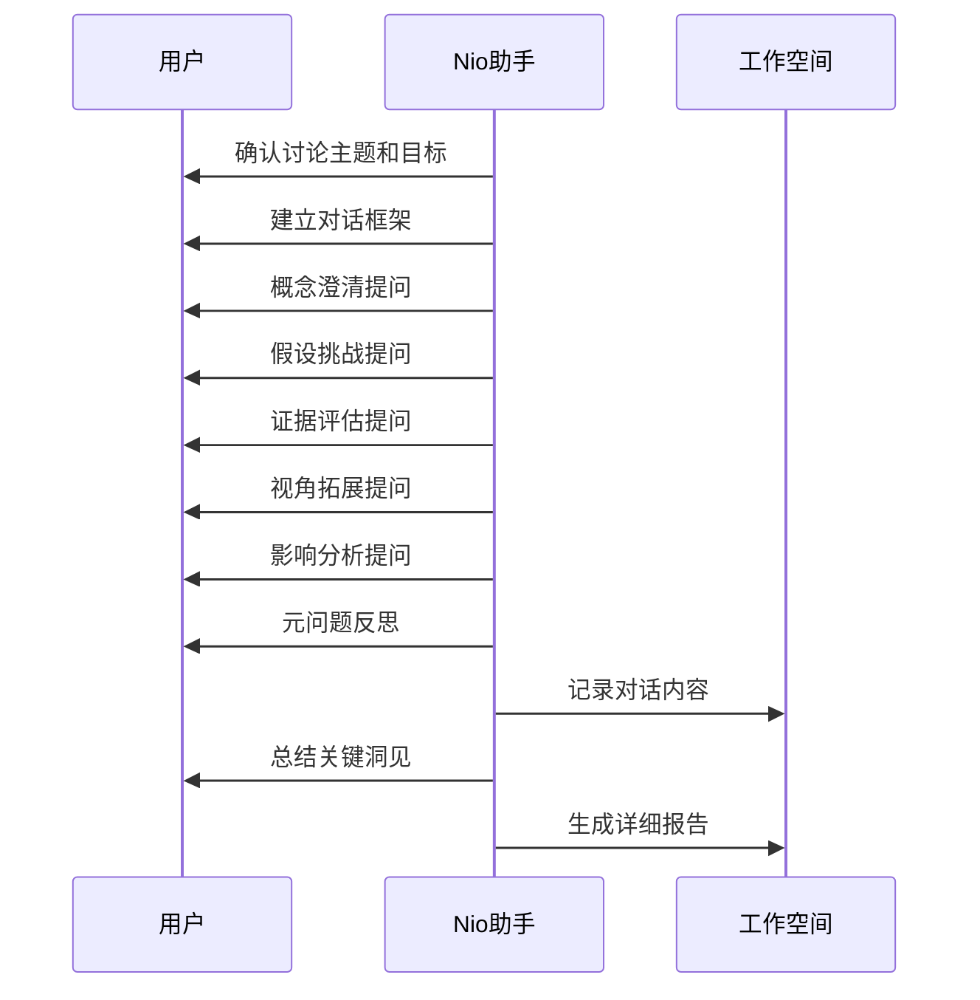
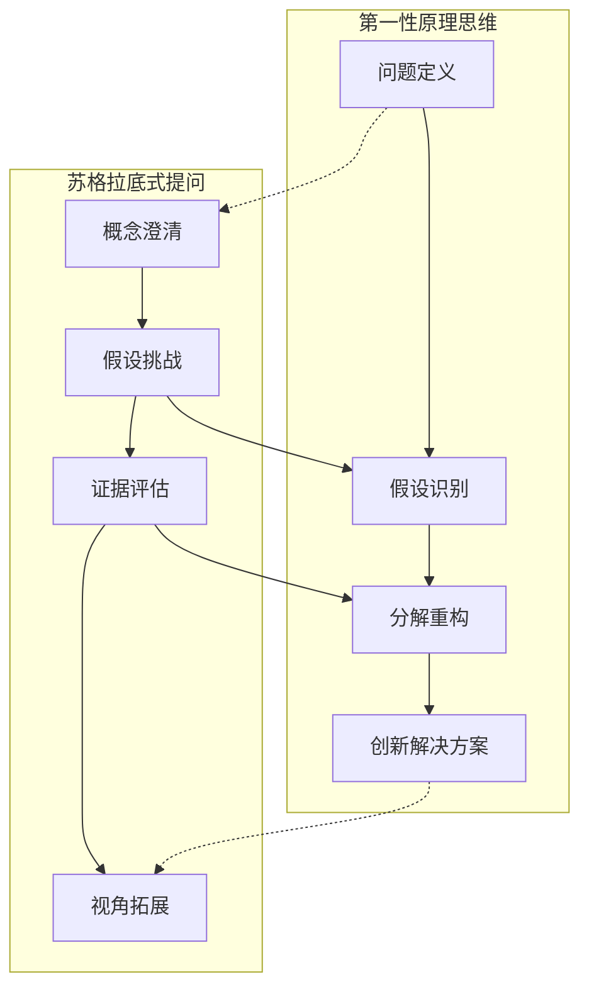

# 苏格拉底式提问

<cite>
**本文档中引用的文件**
- [socratic-questioning.md](file://niopd/commands/DT/socratic-questioning.md)
- [first-principles.md](file://niopd/commands/DT/first-principles.md)
- [five-whys.md](file://niopd/commands/DT/five-whys.md)
- [scenarios.md](file://niopd/commands/DT/scenarios.md)
- [hi.md](file://niopd/commands/BS/hi.md)
- [README.md](file://README.md)
</cite>

## 目录
1. [引言](#引言)
2. [哲学基础与历史渊源](#哲学基础与历史渊源)
3. [核心原理与方法论](#核心原理与方法论)
4. [六种提问类型详解](#六种提问类型详解)
5. [应用场景与价值](#应用场景与价值)
6. [/niopd:DT:socratic-questioning指令解析](#niopd-dt-socratic-questioning指令解析)
7. [与其他深度思考工具的关系](#与其他深度思考工具的关系)
8. [典型问题模板与应用示例](#典型问题模板与应用示例)
9. [实施指南与最佳实践](#实施指南与最佳实践)
10. [总结与展望](#总结与展望)

## 引言

苏格拉底式提问是一种源自古希腊哲学的深度思考方法，通过系统性提问引导人们挑战假设、审视信念，并在对话中发现真理。在当今快速变化的商业环境中，这种方法对于激发深度思考、促进批判性思维具有重要意义。

NioPD（Nio Product Director）将这一古老的哲学智慧转化为现代产品管理工具，通过AI驱动的苏格拉底式提问，帮助产品经理和团队在复杂决策中保持清醒的头脑，发现被忽视的假设，并培养持续质疑的精神。

## 哲学基础与历史渊源

### 古典起源

苏格拉底式提问以古希腊哲学家苏格拉底（约公元前470-399年）命名，他是西方哲学的奠基人之一。这种方法的核心在于**elenchus**（辩证法），即通过假装无知的方式，通过提问揭示对话者观点中的矛盾，从而帮助他们通过自己的推理发现真理。

### 核心理念

苏格拉底的方法体现了几个重要的哲学理念：

1. **认识你自己**：承认自己的无知是智慧的开始
2. **理性对话**：通过逻辑论证而非权威来寻求真理
3. **批判性思维**：不断质疑和检验我们的信念
4. **道德责任**：追求真理是为了更好的生活

### 教育影响

苏格拉底式提问在教育领域产生了深远影响：

- **法学教育**：耶鲁大学法学院的案例教学法
- **医学教育**：诊断推理训练
- **商业教育**：哈佛商学院的案例研究
- **哲学教育**：分析性辩论的传统

**章节来源**
- [socratic-questioning.md](file://niopd/commands/DT/socratic-questioning.md#L10-L30)

## 核心原理与方法论

### 五大步骤流程

苏格拉底式提问遵循一个系统化的流程：



**图表来源**
- [socratic-questioning.md](file://niopd/commands/DT/socratic-questioning.md#L18-L28)

### 关键特征

苏格拉底式提问具有以下核心特征：

1. **引导式发现**：通过提问引导学习者自我发现
2. **批判性思维**：系统性评估各种观点
3. **对话式探究**：基于对话的 inquiry 过程
4. **智力谦逊**：承认知识的局限性
5. **迭代精进**：逐步改进理解的过程

### 应用场景

这种方法适用于多种场景：

- **挑战深层假设**：揭示固有的偏见和盲点
- **复杂问题分析**：从多角度探索复杂议题
- **团队学习**：促进集体知识发展
- **战略决策**：系统性分析重大选择
- **隐性偏见识别**：发现潜在的认知偏差

**章节来源**
- [socratic-questioning.md](file://niopd/commands/DT/socratic-questioning.md#L32-L68)

## 六种提问类型详解

### 1. 澄清性问题（Clarification Questions）

**目的**：明确概念和术语的含义

**典型问题**：
- "你所说的'X'具体指什么？"
- "这个概念有哪些关键组成部分？"
- "能否给我一个具体的例子来说明？"
- "这个说法中的隐含意义是什么？"

**应用场景**：
- 解决沟通误解
- 明确项目范围
- 界定关键术语
- 验证理解准确性

### 2. 假设探究（Probing Assumptions）

**目的**：识别和挑战隐含前提

**典型问题**：
- "这里基于哪些假设？"
- "为什么我们认为这些假设成立？"
- "如果反转这个假设会怎样？"
- "有什么证据反驳我们的假设？"

**应用场景**：
- 战略规划讨论
- 产品决策分析
- 市场定位研究
- 竞争分析

### 3. 证据探究（Probing Reasons and Evidence）

**目的**：评估支持观点的证据质量

**典型问题**：
- "你依据什么得出这个结论？"
- "这个证据有多可靠？"
- "还有哪些相反的证据？"
- "什么样的证据会让你改变看法？"

**应用场景**：
- 数据驱动决策
- 风险评估
- 投资分析
- 产品验证

### 4. 视角探究（Viewpoints and Perspectives）

**目的**：考虑不同的立场和观点

**典型问题**：
- "从另一个角度看会怎样？"
- "谁会受益于这个观点成立？"
- "反对意见可能会说什么？"
- "不同文化背景下会如何看待这个问题？"

**应用场景**：
- 跨文化团队协作
- 用户体验设计
- 市场策略制定
- 冲突解决

### 5. 影响探究（Implications and Consequences）

**目的**：分析观点的长远影响

**典型问题**：
- "如果我们接受这个观点，意味着什么？"
- "这个决定的短期和长期后果是什么？"
- "可能会产生哪些意想不到的结果？"
- "这个决策会影响哪些相关方？"

**应用场景**：
- 战略规划
- 产品路线图
- 风险管理
- 社会影响评估

### 6. 元问题（Questions about Questions）

**目的**：反思提问过程本身

**典型问题**：
- "为什么这个问题值得探讨？"
- "这是最合适的问题吗？"
- "还有哪些更重要的问题应该被问？"
- "这个问题的提问方式是否有效？"

**应用场景**：
- 项目回顾
- 方法论反思
- 决策质量评估
- 团队学习

**章节来源**
- [socratic-questioning.md](file://niopd/commands/DT/socratic-questioning.md#L30-L40)

## 应用场景与价值

### 产品需求讨论

在产品需求讨论中，苏格拉底式提问可以帮助团队：

- **挖掘真实需求**：通过追问揭示用户深层次的需求
- **挑战假设**：识别产品假设的有效性
- **平衡利益相关方**：理解不同视角的价值
- **避免过度设计**：聚焦真正重要的功能

### 用户反馈分析

在分析用户反馈时，这种方法能够：

- **识别核心问题**：区分表面抱怨和根本痛点
- **理解背景因素**：了解用户行为的深层原因
- **发现新机会**：从反馈中发现未被满足的需求
- **验证假设**：检验产品改进的效果

### 战略决策制定

在制定战略决策时，苏格拉底式提问提供：

- **系统性思考**：全面考虑各种可能性
- **风险识别**：预见潜在的负面影响
- **创新启发**：激发新的战略思路
- **共识建立**：促进团队对决策的理解

### 团队建设与知识管理

这种方法在团队建设和知识管理方面的价值：

- **促进学习文化**：鼓励持续学习和反思
- **提高决策质量**：通过集体智慧改善决策
- **知识传承**：将隐性知识显性化
- **团队凝聚力**：通过共同思考加强联系

**章节来源**
- [socratic-questioning.md](file://niopd/commands/DT/socratic-questioning.md#L42-L52)

## /niopd:DT:socratic-questioning指令解析

### 命令结构与参数

```bash
/niopd:DT:socratic-questioning [--topic=<discussion_topic>] [--goal=<discussion_goal>] [--perspective=<initial_viewpoint>]
```

### 核心功能模块

#### 1. 上下文收集与确认

系统首先确认讨论的基本信息：

- **话题确认**：明确讨论的主题
- **目标设定**：确定讨论的具体目标
- **视角了解**：了解参与者的初始立场

#### 2. 对话引导流程

整个对话遵循系统化的引导流程：



**图表来源**
- [socratic-questioning.md](file://niopd/commands/DT/socratic-questioning.md#L70-L122)

#### 3. 深度对话技巧

系统采用多种对话技巧：

- **渐进式提问**：从浅入深的问题设计
- **开放式引导**：鼓励深入思考的回答
- **反馈循环**：基于回答调整后续问题
- **情感智能**：识别和回应情绪状态

#### 4. 知识捕获机制

每次对话都会自动捕获：

- **关键洞察**：重要的思考成果
- **假设识别**：被挑战的隐含前提
- **新视角**：获得的不同看法
- **行动计划**：基于讨论的后续行动

### 报告生成与归档

对话结束后，系统自动生成结构化报告：

```markdown
# 苏格拉底式提问会话：[主题]

## 会话背景
- **主题**：[讨论主题]
- **目标**：[讨论目标]
- **初始视角**：[起始观点]
- **日期**：[当前日期]

## 关键洞察探索

### 概念澄清
- [主要定义和澄清]

### 假设挑战
- [识别的假设及质疑]

### 证据评估
- [支持和反驳的证据]

### 替代视角
- [考虑的不同观点]

### 影响分析
- [探讨的后果和影响]

### 元问题反思
- [关于提问过程的思考]

## 总结与收获
- [关键洞察总结]
- [学习要点]
- [后续行动建议]

## 下一步
- [推荐的跟进措施]
```

**章节来源**
- [socratic-questioning.md](file://niopd/commands/DT/socratic-questioning.md#L150-L247)

## 与其他深度思考工具的关系

### 与第一性原理的协同作用

苏格拉底式提问与第一性原理思维相辅相成：



**图表来源**
- [first-principles.md](file://niopd/commands/DT/first-principles.md#L15-L30)
- [socratic-questioning.md](file://niopd/commands/DT/socratic-questioning.md#L18-L28)

### 与五个为什么的互补关系

这两种方法在根因分析方面形成互补：

- **苏格拉底提问**：从多个角度审视问题
- **五个为什么**：深入挖掘单一问题的根本原因

### 与场景规划的结合应用

在场景规划中运用苏格拉底式提问：

- **不确定性分析**：通过提问识别关键不确定性
- **情景构建**：挑战不同情景的合理性
- **影响评估**：系统性分析各种情景的影响

**章节来源**
- [first-principles.md](file://niopd/commands/DT/first-principles.md#L15-L30)
- [five-whys.md](file://niopd/commands/DT/five-whys.md#L15-L30)
- [scenarios.md](file://niopd/commands/DT/scenarios.md#L15-L30)

## 典型问题模板与应用示例

### 产品战略讨论模板

#### 概念澄清阶段
1. "当我们谈论'用户体验优化'时，具体指的是哪些方面？"
2. "这个'市场领导者'的定义包含了哪些关键指标？"
3. "'竞争优势'在这里特指什么类型的差异化？"

#### 假设挑战阶段
1. "我们假设'价格敏感度高'，但有什么证据表明这个假设可能不成立？"
2. "如果'技术壁垒'并不是主要障碍，我们的战略应该如何调整？"
3. "为什么我们认为'早期采用者'会成为主要用户群？"

#### 证据评估阶段
1. "支持'市场规模将持续增长'这一观点的数据来自哪里？"
2. "有哪些研究或案例可以证明我们的技术方案更优？"
3. "竞争对手的类似举措取得了怎样的效果？"

#### 视角拓展阶段
1. "如果从'企业客户'的角度来看，这个产品的主要价值是什么？"
2. "技术专家可能会如何看待我们提出的功能要求？"
3. "从监管合规的角度，这个方案存在哪些潜在风险？"

### 用户反馈分析模板

#### 深度挖掘阶段
1. "当用户说'界面太复杂'时，他们具体指的是哪个功能区域？"
2. "用户提到'响应速度慢'，是指整体应用还是特定功能？"
3. "'缺少个性化设置'这个反馈背后，用户的真正需求是什么？"

#### 假设验证阶段
1. "我们假设'用户不愿意付费'，但有什么迹象表明这个假设可能错误？"
2. "如果'免费试用期过短'是问题，那'30天试用'是否足够？"
3. "为什么我们认为'移动端优先'的策略是正确的？"

#### 解决方案共创阶段
1. "如果我们不采用'订阅模式'，还有哪些商业模式值得探索？"
2. "如何在保持功能完整性的同时简化用户界面？"
3. "什么类型的个性化功能最能满足用户的核心需求？"

### 团队决策场景模板

#### 战略方向讨论
1. "当我们说'要成为行业领导者'时，具体的目标市场份额是多少？"
2. "这个'技术创新'的投资回报周期预期是多久？"
3. "'快速迭代'和'稳健发展'这两个策略之间是否存在权衡？"

#### 资源分配决策
1. "如果我们将预算从研发转向市场营销，最大的机会成本是什么？"
2. "为什么我们认为'重点市场'的选择是合理的？"
3. "在有限资源下，如何确定优先级的判断标准？"

#### 风险评估讨论
1. "这个'技术风险'最有可能在哪个阶段显现？"
2. "如果'政策法规'发生变化，我们的应对预案是什么？"
3. "哪些外部因素是我们无法控制的，但需要纳入考虑？"

**章节来源**
- [socratic-questioning.md](file://niopd/commands/DT/socratic-questioning.md#L88-L150)

## 实施指南与最佳实践

### 准备阶段

#### 明确目标
- **具体化目标**：将模糊的讨论目标转化为具体问题
- **设定预期**：明确期望的讨论成果
- **选择参与者**：邀请具有不同视角的相关人员

#### 环境准备
- **物理环境**：创造舒适的对话空间
- **心理环境**：营造开放、安全的讨论氛围
- **时间安排**：预留充足的时间进行深度讨论

### 对话实施阶段

#### 建立信任基础
1. **表达尊重**：认可每个人的观点价值
2. **保持中立**：避免预设立场影响讨论
3. **鼓励参与**：确保每个人都有发言机会

#### 控制对话节奏
1. **适时暂停**：给参与者思考的时间
2. **引导深入**：当讨论趋于表面时深入挖掘
3. **防止跑题**：及时将讨论带回主题

#### 处理冲突情况
1. **识别分歧**：明确存在的不同观点
2. **寻找共识**：找出共同认可的基础
3. **包容差异**：尊重不同的思维方式

### 后续跟进阶段

#### 知识整理
- **记录要点**：及时记录重要的讨论成果
- **分类整理**：将信息按照主题进行分类
- **可视化呈现**：使用图表等方式呈现复杂信息

#### 行动计划制定
- **明确责任**：确定各项行动的负责人
- **设定时间表**：制定具体的执行时间线
- **建立监控机制**：跟踪执行进度和效果

#### 知识共享
- **内部传播**：将讨论成果分享给相关人员
- **文档归档**：保存完整的讨论记录
- **经验总结**：提炼可复用的方法论

### 常见陷阱与避免方法

#### 1. 过度批判
**表现**：提问带有攻击性或贬低性
**避免方法**：保持建设性和同理心

#### 2. 信息不足
**表现**：提问过于宽泛或缺乏背景
**避免方法**：充分了解背景信息后再提问

#### 3. 忽视情感因素
**表现**：只关注逻辑论证而忽视情绪
**避免方法**：注意参与者的情绪反应

#### 4. 缺乏后续
**表现**：讨论结束后没有跟进
**避免方法**：建立明确的后续行动计划

**章节来源**
- [socratic-questioning.md](file://niopd/commands/DT/socratic-questioning.md#L240-L247)

## 总结与展望

### 核心价值总结

苏格拉底式提问作为一种深度思考工具，在现代产品管理中展现出独特的价值：

1. **认知提升**：帮助人们超越表面认知，达到深层理解
2. **决策质量**：通过系统性思考提高决策的科学性
3. **团队协作**：促进团队成员之间的深度交流
4. **创新激发**：打破常规思维，发现新的可能性

### 技术发展趋势

随着人工智能的发展，苏格拉底式提问的应用将更加智能化：

- **AI辅助提问**：智能系统能够根据上下文生成恰当的问题
- **个性化引导**：根据参与者的风格调整提问方式
- **数据分析整合**：结合大数据提供更有说服力的证据
- **实时反馈**：即时分析讨论效果并调整策略

### 实践建议

对于希望掌握苏格拉底式提问的团队和个人：

1. **持续练习**：将这种方法融入日常工作
2. **反思改进**：定期回顾使用效果并优化方法
3. **知识分享**：与团队成员分享经验和技巧
4. **跨领域应用**：尝试在不同场景中使用这种方法

### 未来展望

苏格拉底式提问将继续在以下领域发挥重要作用：

- **复杂问题解决**：面对日益复杂的商业和社会问题
- **创新人才培养**：培养具有批判性思维的人才
- **组织学习能力**：提升组织的整体学习和适应能力
- **社会对话质量**：改善公共讨论的质量和效果

通过系统性地运用苏格拉底式提问，组织和个人都能够更好地应对不确定性，做出更明智的决策，并在快速变化的世界中保持竞争力。正如苏格拉底所说："未经审视的人生不值得过"，同样，未经审视的决策也不值得执行。

**章节来源**
- [socratic-questioning.md](file://niopd/commands/DT/socratic-questioning.md#L32-L40)
- [README.md](file://README.md#L50-L70)