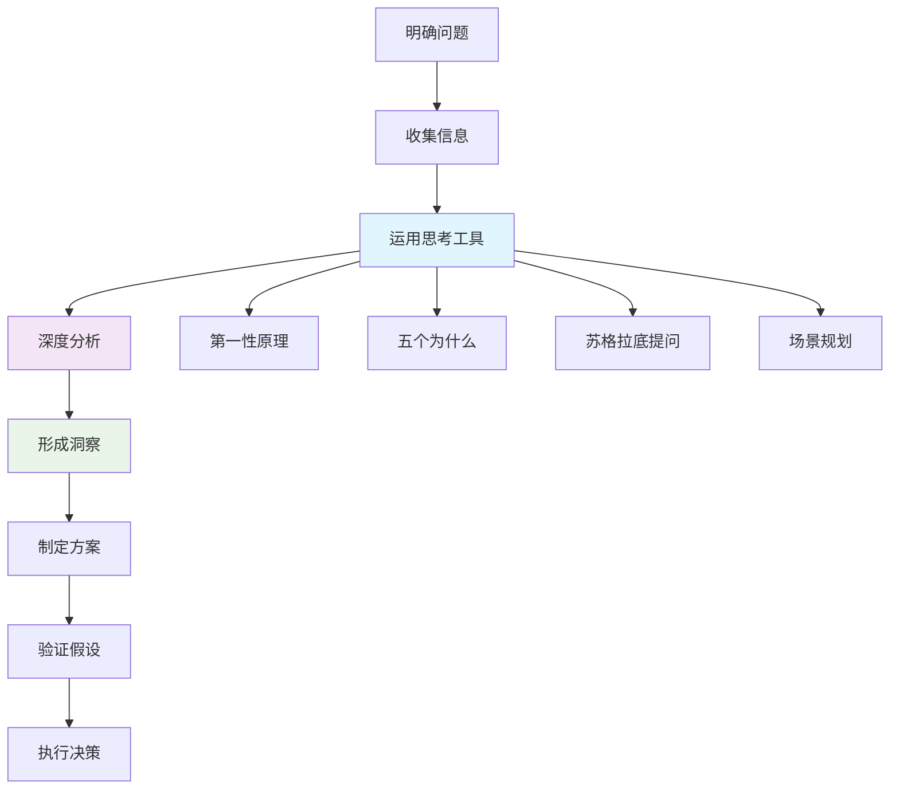
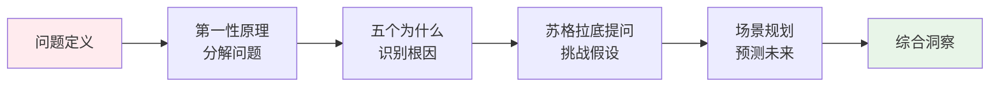
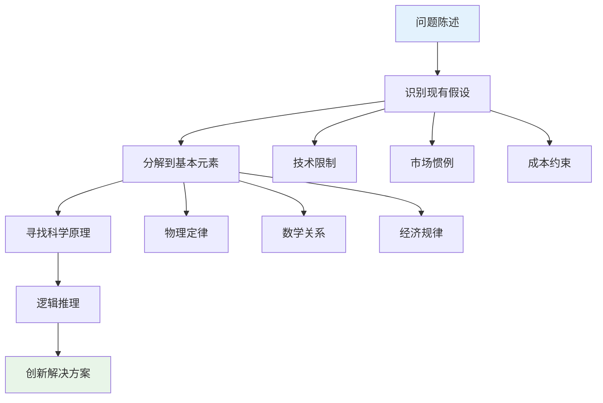
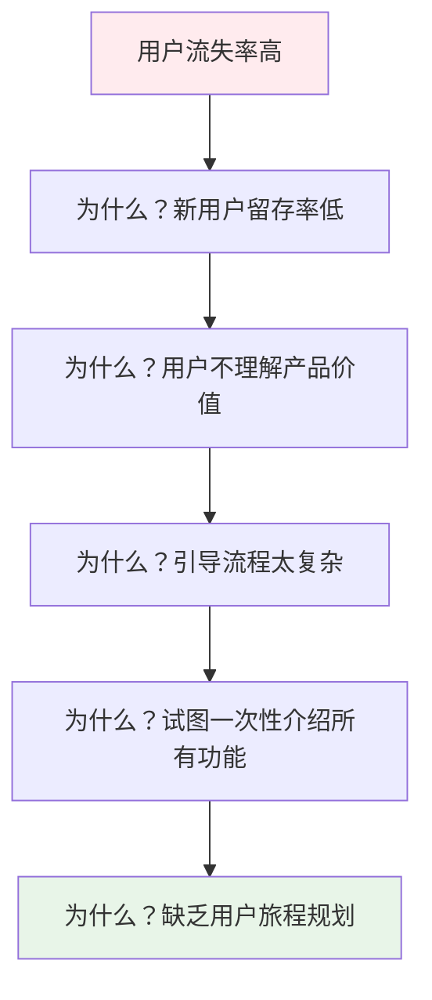
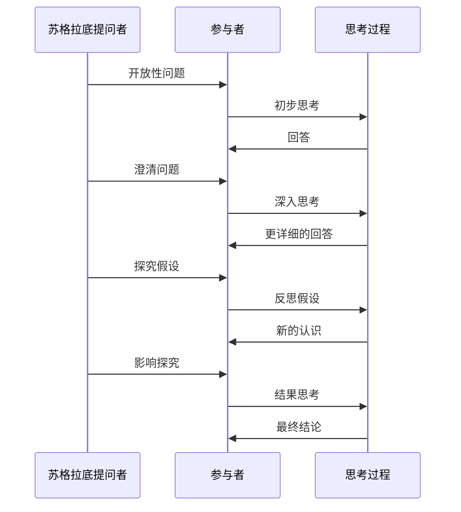
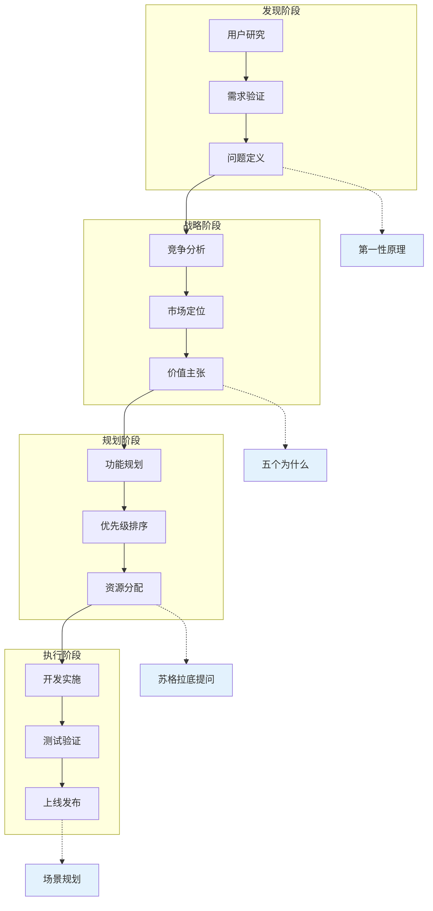
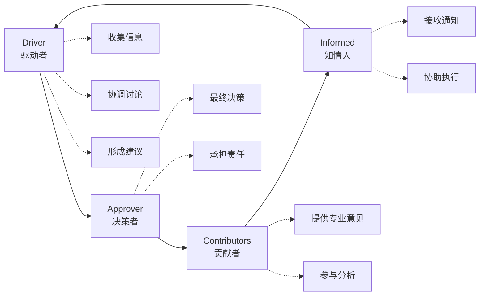

# 思考优先原则

<cite>
**本文档中引用的文件**
- [first-principles.md](file://niopd/commands/DT/first-principles.md)
- [five-whys.md](file://niopd/commands/DT/five-whys.md)
- [socratic-questioning.md](file://niopd/commands/DT/socratic-questioning.md)
- [scenarios.md](file://niopd/commands/DT/scenarios.md)
- [daci-framework.md](file://niopd/commands/PM/daci-framework.md)
- [risk-analysis.md](file://niopd/commands/PM/risk-analysis.md)
- [swot.md](file://niopd/commands/ST/swot.md)
- [porters-five-forces.md](file://niopd/commands/ST/porters-five-forces.md)
- [workflow.md](file://niopd/commands/PD/workflow.md)
- [README.md](file://README.md)
</cite>

## 目录
1. [引言](#引言)
2. [思考优先原则概述](#思考优先原则概述)
3. [深度思考工具集](#深度思考工具集)
4. [第一性原理思维](#第一性原理思维)
5. [五个为什么分析法](#五个为什么分析法)
6. [苏格拉底式提问](#苏格拉底式提问)
7. [场景规划与假设分析](#场景规划与假设分析)
8. [思考优先原则在产品管理中的应用](#思考优先原则在产品管理中的应用)
9. [决策框架与认知工具](#决策框架与认知工具)
10. [实际案例分析](#实际案例分析)
11. [最佳实践与建议](#最佳实践与建议)
12. [总结](#总结)

## 引言

在快速变化的商业环境中，传统的思维方式往往导致表面化的解决方案和无效的执行。NioPD的"思考优先"原则强调，在采取行动之前，必须通过深度思考工具集进行全面的分析和验证。这一原则不仅帮助团队避免认知偏差，更能激发创新思维，确保决策的质量和执行的有效性。

## 思考优先原则概述

### 核心理念

思考优先原则建立在以下核心理念之上：

1. **深度分析优于快速反应**：在做出决策前，投入充分的时间进行系统性思考
2. **质疑假设而非接受现状**：主动挑战既有的前提和信念
3. **系统性思维而非碎片化处理**：从整体角度理解问题和机会
4. **创新导向而非保守执行**：鼓励突破常规的创造性解决方案

### 实施原则

**图表来源**
- [first-principles.md](file://niopd/commands/DT/first-principles.md#L1-L50)
- [five-whys.md](file://niopd/commands/DT/five-whys.md#L1-L50)

## 深度思考工具集

NioPD提供了四个核心的深度思考工具，每个工具都有其独特的应用场景和优势：

### 工具集概览

| 工具名称 | 应用场景 | 核心特点 | 输出成果 |
|---------|---------|---------|---------|
| 第一性原理 | 复杂问题解决 | 从基本事实重建 | 创新解决方案 |
| 五个为什么 | 根因分析 | 迭代追问到底 | 根本原因识别 |
| 苏格拉底提问 | 假设挑战 | 系统性质疑 | 深度理解 |
| 场景规划 | 不确定性应对 | 多未来探索 | 战略韧性 |

### 工具协同效应

**图表来源**
- [first-principles.md](file://niopd/commands/DT/first-principles.md#L20-L30)
- [five-whys.md](file://niopd/commands/DT/five-whys.md#L20-L30)

## 第一性原理思维

### 理论基础

第一性原理思维源于古希腊哲学，特别是亚里士多德对"第一原则"的定义——"事物被认识的第一基础"。这一方法论在现代被埃隆·马斯克等创新者广泛应用。

### 核心机制

第一性原理思维遵循以下步骤：

1. **识别假设**：明确当前认为理所当然的所有前提
2. **问题分解**：将复杂问题拆解到最基本的组成部分
3. **重构解决方案**：基于基本事实重新构建创新方案
4. **逻辑推理**：从基础真理出发进行逻辑推导

### 应用场景

#### 技术创新案例
- **SpaceX火箭成本优化**：不问"火箭要多少钱"，而问"火箭的原材料值多少钱"
- **特斯拉电池革命**：重新思考电池化学成分和制造工艺

#### 商业模式创新
- **共享经济**：重新定义所有权概念
- **订阅服务**：改变传统购买模式

### 工具使用指南

**图表来源**
- [first-principles.md](file://niopd/commands/DT/first-principles.md#L60-L120)

**章节来源**
- [first-principles.md](file://niopd/commands/DT/first-principles.md#L1-L247)

## 五个为什么分析法

### 历史背景

五个为什么分析法由丰田汽车创始人丰田喜一郎开发，成为丰田生产系统的核心工具之一。

### 分析流程

该方法通过连续的"为什么"提问，从表面现象深入到根本原因：

1. **定义问题**：明确需要分析的具体问题
2. **第一次为什么**：找出直接原因
3. **第二次为什么**：挖掘更深层次的原因
4. **第三次为什么**：识别系统性因素
5. **第四次为什么**：发现组织层面问题
6. **第五次为什么**：找到根本原因

### 应用优势

- **简单易用**：无需复杂工具和数据分析
- **团队协作**：适合集体讨论和知识共享
- **成本效益**：快速识别问题根源
- **预防措施**：防止问题再次发生

### 实际应用示例

**图表来源**
- [five-whys.md](file://niopd/commands/DT/five-whys.md#L40-L80)

**章节来源**
- [five-whys.md](file://niopd/commands/DT/five-whys.md#L1-L246)

## 苏格拉底式提问

### 哲学基础

苏格拉底提问法源于古希腊哲学家苏格拉底的对话方法，通过系统性提问引导思考者发现真理。

### 提问类型

1. **澄清性问题**："What do you mean by...?"
2. **假设探究**："What are we assuming here?"
3. **证据探究**："How do you know?"
4. **视角探究**："What is an alternative?"
5. **影响探究**："What follows from this?"
6. **元问题**："Why are we asking this?"

### 应用价值

- **批判性思维**：培养系统性分析能力
- **认知挑战**：暴露隐藏的偏见和假设
- **深度理解**：促进对复杂概念的掌握
- **创新启发**：激发新的思考路径

### 实践指导

**图表来源**
- [socratic-questioning.md](file://niopd/commands/DT/socratic-questioning.md#L60-L120)

**章节来源**
- [socratic-questioning.md](file://niopd/commands/DT/socratic-questioning.md#L1-L248)

## 场景规划与假设分析

### 理论基础

场景规划起源于壳牌公司在20世纪70年代的军事战略研究，后来发展成为应对不确定性的战略工具。

### 核心流程

1. **识别关键不确定性**：选择最具影响力的未知因素
2. **构建场景矩阵**：通常采用2x2矩阵形式
3. **发展场景叙事**：为每个场景创造详细的故事
4. **分析战略影响**：评估不同场景下的战略选择

### 应用价值

- **风险管理**：提前识别潜在威胁和机遇
- **战略韧性**：准备多种应对方案
- **长期规划**：在不确定性中保持方向感
- **组织学习**：提高对未来趋势的敏感度

### 场景类型

| 场景类型 | 时间范围 | 应用领域 | 关键特征 |
|---------|---------|---------|---------|
| 探索性场景 | 中长期 | 创新战略 | "What could happen?" |
| 规范性场景 | 中期 | 战略目标 | "What should happen?" |
| 预测性场景 | 短中期 | 风险管理 | "What will likely happen?" |
| 操作性场景 | 短期 | 日常运营 | 具体行动计划 |

**章节来源**
- [scenarios.md](file://niopd/commands/DT/scenarios.md#L1-L300)

## 思考优先原则在产品管理中的应用

### 产品管理流程中的思考优先

**图表来源**
- [workflow.md](file://niopd/commands/PD/workflow.md#L60-L80)

### 在不同阶段的应用

#### 1. 产品发现阶段
- **用户研究**：使用苏格拉底提问挑战用户反馈的假设
- **需求验证**：运用第一性原理重新定义用户需求
- **机会识别**：通过场景规划探索新兴市场机会

#### 2. 战略规划阶段
- **竞争分析**：利用SWOT和波特五力分析深层竞争格局
- **市场定位**：通过五个为什么识别真正的市场痛点
- **价值主张**：基于第一性原理构建独特价值

#### 3. 执行规划阶段
- **功能优先级**：使用DACI框架明确决策责任
- **风险评估**：结合场景规划和风险分析
- **资源配置**：通过系统性思考优化资源分配

**章节来源**
- [workflow.md](file://niopd/commands/PD/workflow.md#L60-L120)

## 决策框架与认知工具

### DACI决策框架

DACI框架为复杂的跨职能决策提供了清晰的角色分工：

**图表来源**
- [daci-framework.md](file://niopd/commands/PM/daci-framework.md#L40-L80)

### 风险分析工具

系统性的风险分析确保决策的稳健性：

#### 风险评估矩阵

| 影响程度 | 低 | 中 | 高 | 很高 |
|---------|----|----|----|-----|
| **极高概率** | 9 | 18 | 27 | 36 |
| **高概率** | 7 | 14 | 21 | 28 |
| **中概率** | 5 | 10 | 15 | 20 |
| **低概率** | 3 | 6 | 9 | 12 |
| **极低概率** | 1 | 2 | 3 | 4 |

### 认知偏差防范

思考优先原则特别注重识别和防范认知偏差：

- **确认偏误**：通过苏格拉底提问挑战既有观点
- **锚定效应**：运用第一性原理摆脱初始假设
- **现状偏误**：借助场景规划预见变革可能性
- **群体思维**：通过独立思考避免盲从

**章节来源**
- [daci-framework.md](file://niopd/commands/PM/daci-framework.md#L1-L302)
- [risk-analysis.md](file://niopd/commands/PM/risk-analysis.md#L1-L237)

## 实际案例分析

### 案例1：产品功能优化

#### 问题背景
某电商平台发现新用户转化率低于预期，传统分析显示可能是用户体验问题。

#### 思考优先应用

1. **第一性原理分析**：
   - 重新思考"什么是好的用户体验"
   - 分解到用户心理、技术实现、业务目标的基本要素
   - 发现根本问题是用户信任缺失

2. **五个为什么分析**：
   - 为什么用户不信任？→ 缺乏真实评价
   - 为什么缺乏真实评价？→ 用户不愿分享负面体验
   - 为什么用户不愿分享？→ 担心被报复
   - 为什么会有报复风险？→ 匿名机制不完善
   - 为什么匿名机制不完善？→ 技术和运营流程缺失

3. **苏格拉底提问**：
   - "我们真的相信匿名就能解决问题吗？"
   - "除了匿名，还有哪些方式能建立用户信任？"
   - "如果完全不匿名，会有什么后果？"

#### 解决方案
基于深度分析，团队开发了"真实用户故事"功能，通过算法过滤虚假评价，同时建立社区信任机制。

### 案例2：市场进入决策

#### 问题背景
公司考虑进入智能家居市场，但面临激烈的竞争和不确定的回报。

#### 思考优先应用

1. **场景规划**：
   - 技术发展：快速迭代 vs 渐进演进
   - 市场接受度：早期采用者 vs 大众市场
   - 竞争格局：寡头垄断 vs 多元竞争

2. **波特五力分析**：
   - 新进入者威胁：高（技术壁垒低）
   - 供应商议价：中（标准化组件）
   - 购买者议价：高（价格敏感）
   - 替代品威胁：中（生态系统依赖）
   - 行业竞争：激烈（巨头林立）

3. **SWOT分析**：
   - 优势：技术积累、品牌影响力
   - 劣势：缺乏硬件经验、渠道建设
   - 机会：物联网发展趋势、垂直整合
   - 威胁：巨头战略布局、技术标准竞争

#### 决策结果
经过系统性分析，决定采取"差异化切入"策略，专注于特定细分市场，避免与巨头正面竞争。

### 案例3：组织变革

#### 问题背景
传统制造业企业面临数字化转型压力，但内部存在严重抵触情绪。

#### 思考优先应用

1. **苏格拉底提问**：
   - "我们真的认为传统模式不可行吗？"
   - "数字化转型的本质是什么？"
   - "成功的转型应该带来什么改变？"

2. **场景规划**：
   - 保守场景：维持现状，逐步改进
   - 积极场景：全面数字化，重塑业务模式
   - 平衡场景：渐进式转型，保留核心优势

3. **风险分析**：
   - 技术风险：系统集成难度
   - 组织风险：文化冲突和人才流失
   - 市场风险：竞争对手快速跟进

#### 实施策略
基于分析结果，制定了"试点先行、逐步推广"的转型策略，同时建立了变革管理机制。

## 最佳实践与建议

### 实施原则

#### 1. 建立思考文化
- **领导示范**：管理层带头使用深度思考工具
- **时间保障**：为思考和分析预留专门时间
- **容错机制**：鼓励尝试，容忍合理的失败
- **知识共享**：建立思考方法的知识库

#### 2. 工具组合使用
- **单一工具局限性**：每种工具都有适用场景和局限
- **协同效应**：多种工具配合使用效果更佳
- **阶段递进**：根据问题复杂度选择合适的工具序列

#### 3. 持续改进
- **定期回顾**：定期评估思考工具的效果
- **反馈循环**：收集使用者的反馈和建议
- **方法优化**：根据实践经验不断改进方法

### 常见误区

#### 1. 过度依赖单一工具
- **问题**：只使用一种工具可能导致片面结论
- **解决方案**：建立工具组合使用的方法论

#### 2. 忽视执行环节
- **问题**：思考充分但执行不到位
- **解决方案**：将思考成果转化为具体的行动计划

#### 3. 缺乏量化评估
- **问题**：思考过程难以衡量效果
- **解决方案**：建立关键指标评估思考质量

### 成功要素

#### 组织层面
- **高层支持**：获得管理层的明确支持
- **资源投入**：提供必要的培训和工具
- **文化培育**：营造鼓励深度思考的环境
- **激励机制**：奖励高质量的思考成果

#### 个人层面
- **批判性思维**：培养质疑和反思的习惯
- **系统性思考**：学会从整体角度看待问题
- **持续学习**：不断更新知识和技能
- **开放心态**：愿意接受不同的观点

## 总结

思考优先原则代表了一种全新的工作方式，它要求我们在行动之前投入充分的时间和精力进行深度思考。通过第一性原理、五个为什么、苏格拉底提问和场景规划等工具，我们可以：

### 核心收益

1. **提高决策质量**：通过系统性分析避免错误决策
2. **激发创新思维**：打破常规思维模式，发现新的机会
3. **降低执行风险**：提前识别和应对潜在问题
4. **增强战略韧性**：在不确定性中保持清晰的方向

### 实施建议

1. **循序渐进**：从简单的工具开始，逐步扩展到复杂的分析
2. **团队协作**：鼓励团队成员共同参与思考过程
3. **持续实践**：将深度思考融入日常工作流程
4. **效果评估**：定期评估思考工具的效果并进行调整

### 未来展望

随着人工智能和大数据技术的发展，思考优先原则将得到进一步强化。智能工具可以帮助我们更快地收集信息、分析数据，但人类的判断力、创造力和价值观仍然是不可替代的。思考优先原则为我们提供了一个框架，让我们能够在技术进步的同时，保持深度思考的能力。

通过坚持思考优先原则，组织和个人都能够：
- 在复杂环境中做出更好的决策
- 发现真正的创新机会
- 建立可持续的竞争优势
- 应对未来的各种挑战

这不仅是提高工作效率的方法，更是提升生活质量的艺术。正如爱因斯坦所说："我们不能用制造问题的同一水平思维来解决问题。"