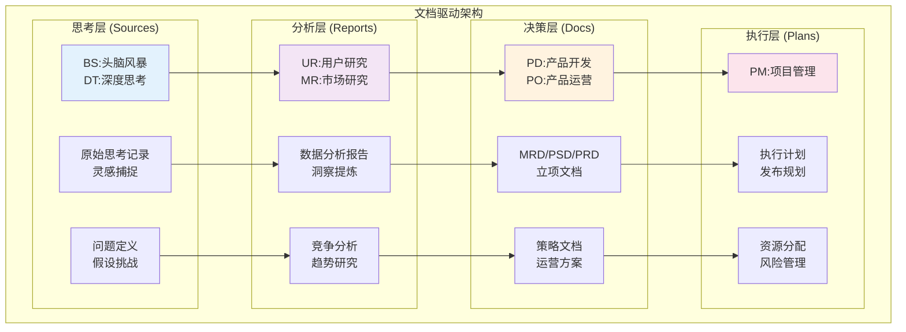
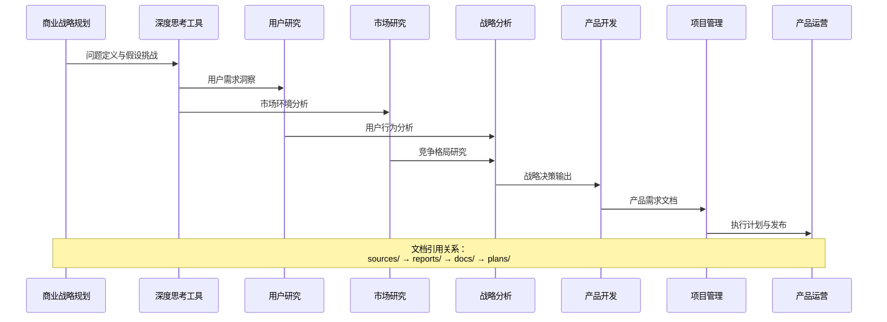
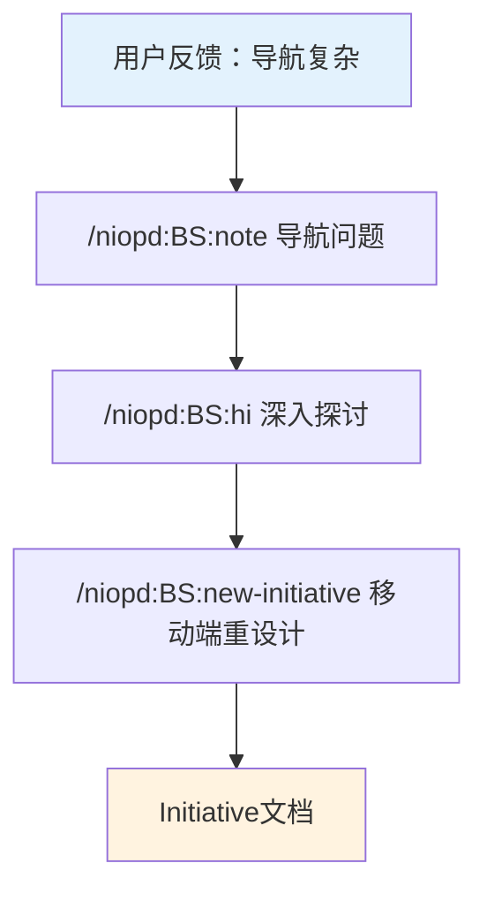
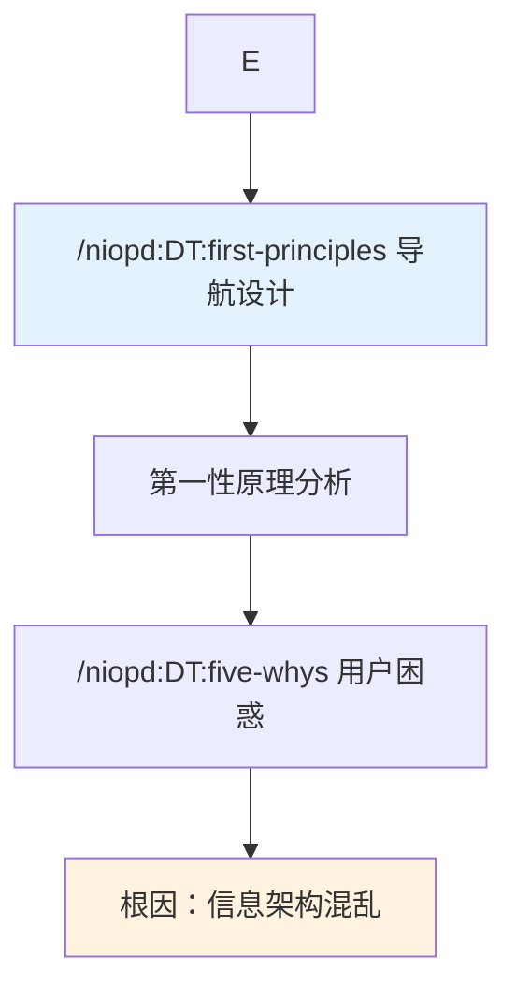
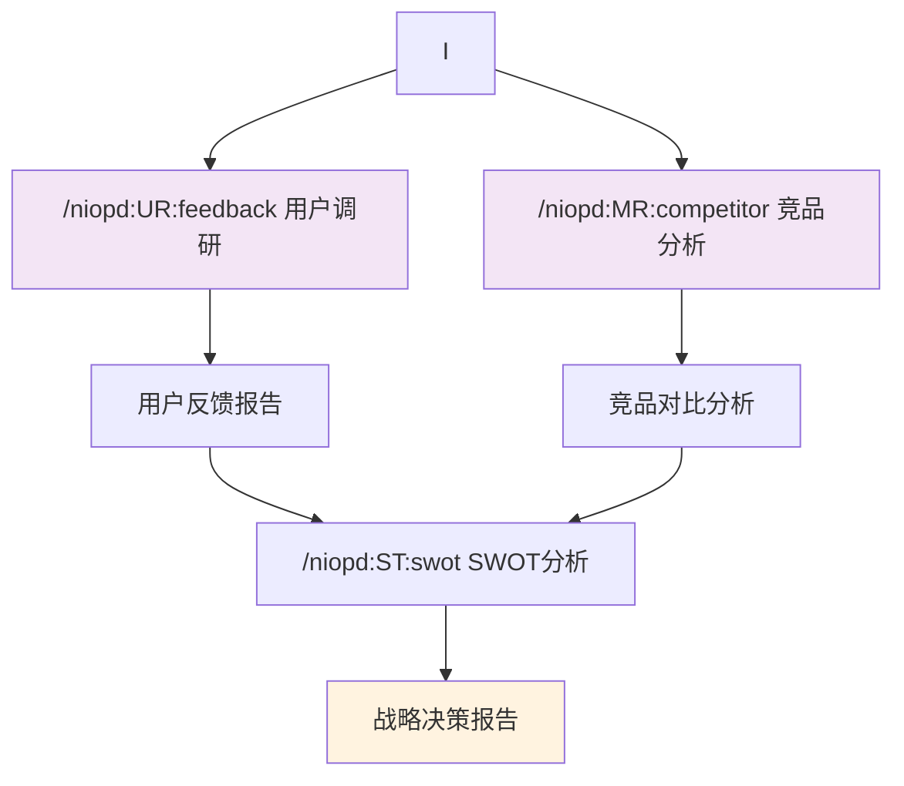
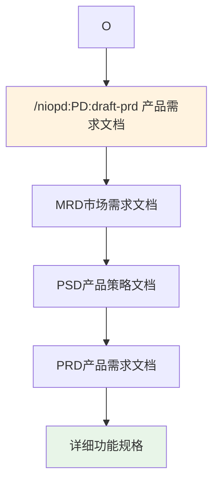
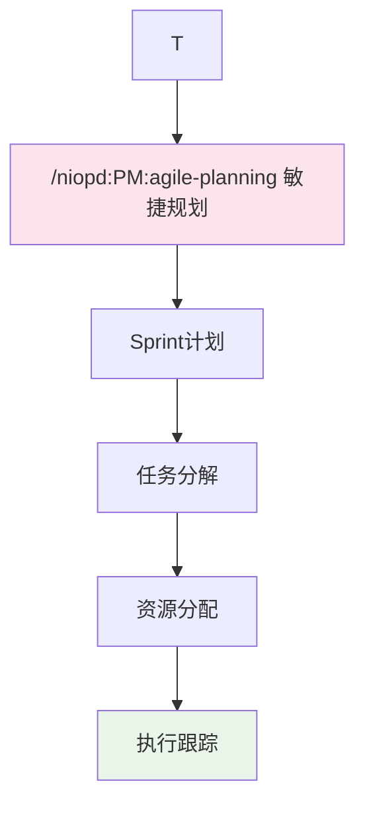
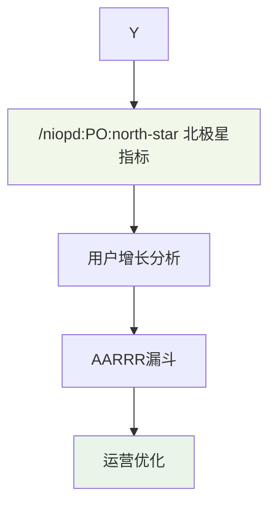

# NioPD文档驱动架构深度解析

<cite>
**本文档引用的文件**
- [README.md](file://README.md)
- [feature-planning.md](file://niopd/commands/BS/feature-planning.md)
- [first-principles.md](file://niopd/commands/DT/first-principles.md)
- [compare-products.md](file://niopd/commands/MR/compare-products.md)
- [draft-prd.md](file://niopd/commands/PD/draft-prd.md)
- [agile-planning.md](file://niopd/commands/PM/agile-planning.md)
- [feedback.md](file://niopd/commands/UR/feedback.md)
- [swot.md](file://niopd/commands/ST/swot.md)
- [north-star.md](file://niopd/commands/PO/north-star.md)
- [initiative-template.md](file://niopd/templates/initiative-template.md)
- [prd-template.md](file://niopd/templates/prd-template.md)
</cite>

## 目录
1. [引言](#引言)
2. [架构概览](#架构概览)
3. [核心目录层级](#核心目录层级)
4. [文档流转机制](#文档流转机制)
5. [指令系统与方法论](#指令系统与方法论)
6. [工作流实例分析](#工作流实例分析)
7. [架构优势与价值](#架构优势与价值)
8. [实施指南](#实施指南)
9. [总结](#总结)

## 引言

NioPD（Nio Product Director）是一个革命性的AI驱动产品管理工具包，其核心创新在于建立了完整的文档驱动架构。这种架构不仅仅是文件管理，更是一种系统化的产品开发方法论，通过四个层次的文档体系实现了从战略思考到产品交付的全流程闭环。

本文档将深入剖析NioPD的文档驱动架构，详细解释sources/、reports/、docs/、plans/四个目录的层级关系和数据流转逻辑，展示这种架构如何确保决策可追溯、知识可复用，并支持团队协作。

## 架构概览

NioPD的文档驱动架构基于产品管理的完整生命周期，采用分层文档体系，每个层级都有明确的职责和输出规范。



**图表来源**
- [README.md](file://README.md#L1-L100)
- [feature-planning.md](file://niopd/commands/BS/feature-planning.md#L1-L50)

### 四层架构的核心原则

1. **文档即知识**：每个文档都是知识的载体，记录思考过程和决策依据
2. **层级递进**：从非结构化思考到结构化决策，再到执行计划
3. **方法论驱动**：每个层级都基于成熟的产品管理方法论
4. **可追溯性**：文档间的引用关系确保决策可追溯

## 核心目录层级

### Sources/ - 思考源材料层

**用途**：存储原始思考记录、头脑风暴结果、深度思考分析

**输出指令**：BS（商业战略规划）、DT（深度思考工具）

**典型文件格式**：
- `[YYYYMMDD]-[主题]-brainstorm-v[版本].md`
- `[YYYYMMDD]-[问题]-first-principles-v[版本].md`
- `[YYYYMMDD]-[分析]-five-whys-v[版本].md`
- `note-[日期].md`

**特点与价值**：
- **非结构化记录**：允许自由思考，不做预设
- **原始素材积累**：为后续分析提供丰富素材
- **思考过程追踪**：记录决策的演进轨迹
- **灵感捕捉**：随时随地记录创意和观察

**Section sources**
- [feature-planning.md](file://niopd/commands/BS/feature-planning.md#L1-L156)
- [first-principles.md](file://niopd/commands/DT/first-principles.md#L1-L247)

### Reports/ - 数据分析报告层

**用途**：存储基于数据和方法论的结构化分析报告

**输出指令**：UR（用户研究）、MR（市场研究）、ST（战略分析）

**典型文件格式**：
- `[YYYYMMDD]-[项目]-feedback-summary-v[版本].md`
- `[YYYYMMDD]-[产品]-competitor-analysis-v[版本].md`
- `[YYYYMMDD]-[项目]-swot-analysis-v[版本].md`
- `[YYYYMMDD]-[项目]-user-personas-v[版本].md`

**特点与价值**：
- **结构化分析**：基于成熟方法论的系统性分析
- **数据支撑**：以事实和数据为基础的决策依据
- **洞察提炼**：从海量信息中提取关键洞见
- **框架应用**：运用SWOT、波特五力、Kano模型等经典框架

**Section sources**
- [feedback.md](file://niopd/commands/UR/feedback.md#L1-L285)
- [compare-products.md](file://niopd/commands/MR/compare-products.md#L1-L335)
- [swot.md](file://niopd/commands/ST/swot.md#L1-L408)

### Docs/ - 决策文档层

**用途**：存储权威性的产品决策文档和运营方案

**输出指令**：PD（产品开发）、PO（产品运营）

**文档层级结构**：
```
Initiative (立项文档)
   ↓
MRD (市场需求文档)
   ↓
PSD (产品策略文档)
   ↓
PRD (产品需求文档)
   ↓
FAQ / 运营文档
```

**典型文件格式**：
- `[YYYYMMDD]-[项目]-initiative-v[版本].md`
- `[YYYYMMDD]-[项目]-mrd-v[版本].md`
- `[YYYYMMDD]-[项目]-psd-v[版本].md`
- `[YYYYMMDD]-[项目]-prd-v[版本].md`
- `[YYYYMMDD]-[项目]-faq-v[版本].md`

**特点与价值**：
- **权威性定义**：明确的产品规格和需求定义
- **多方对齐**：确保跨职能团队的理解一致性
- **版本管理**：支持文档的迭代和完善
- **利益相关方沟通**：为决策者提供清晰的行动指导

**Section sources**
- [draft-prd.md](file://niopd/commands/PD/draft-prd.md#L1-L252)
- [initiative-template.md](file://niopd/templates/initiative-template.md#L1-L89)
- [prd-template.md](file://niopd/templates/prd-template.md#L1-L125)

### Plans/ - 执行计划层

**用途**：存储项目执行计划、发布计划、风险管理等

**输出指令**：PM（项目管理）

**典型文件格式**：
- `[YYYYMMDD]-[项目]-pid-v[版本].md`
- `[YYYYMMDD]-[项目]-release-plan-v[版本].md`
- `[YYYYMMDD]-[项目]-sprint-plan-v[版本].md`
- `[YYYYMMDD]-[项目]-risk-analysis-v[版本].md`

**特点与价值**：
- **执行导向**：聚焦于具体的行动计划
- **时间线管理**：明确的时间节点和里程碑
- **资源规划**：人力、技术和财务资源的合理分配
- **风险控制**：系统性的风险识别和缓解策略

**Section sources**
- [agile-planning.md](file://niopd/commands/PM/agile-planning.md#L1-L515)

## 文档流转机制

### 层级间的数据流转

NioPD的文档流转遵循严格的逻辑顺序，确保每个阶段都有充分的输入和输出。



**图表来源**
- [feature-planning.md](file://niopd/commands/BS/feature-planning.md#L20-L50)
- [draft-prd.md](file://niopd/commands/PD/draft-prd.md#L50-L100)

### 引用机制与知识传承

每个层级的文档都可以被后续层级引用，形成知识传承链：

1. **Sources → Reports**：原始思考为分析提供素材
2. **Reports → Docs**：分析结果支撑决策制定
3. **Docs → Plans**：决策文档指导具体执行
4. **Plans → Docs**：执行反馈优化运营策略

**Section sources**
- [draft-prd.md](file://niopd/commands/PD/draft-prd.md#L100-L150)

## 指令系统与方法论

### BS - 商业战略规划

**核心方法论**：头脑风暴（Brainstorming）+ 第一性原理

**典型工作流程**：
1. **灵感捕捉**：`/niopd:BS:note` 记录日常想法
2. **深度对话**：`/niopd:BS:hi` 进行苏格拉底式提问
3. **机会识别**：`/niopd:BS:feature-planning` 基于反馈生成想法
4. **立项启动**：`/niopd:BS:new-initiative` 创建项目文档

**Section sources**
- [feature-planning.md](file://niopd/commands/BS/feature-planning.md#L50-L156)

### DT - 深度思考工具

**核心方法论**：第一性原理思维、五个为什么、苏格拉底式提问

**应用场景**：
- **问题解决**：`/niopd:DT:first-principles` 找到根本原因
- **根因分析**：`/niopd:DT:five-whys` 深挖问题本质
- **假设挑战**：`/niopd:DT:socratic-questioning` 推动思维突破
- **未来规划**：`/niopd:DT:scenarios` 应对不确定性

**Section sources**
- [first-principles.md](file://niopd/commands/DT/first-principles.md#L50-L247)

### UR - 用户研究

**核心方法论**：Jobs-to-be-Done理论、Kano模型、主题分析

**分析维度**：
- **用户反馈**：`/niopd:UR:feedback` 结构化分析
- **行为研究**：`/niopd:UR:behavior` 数据驱动洞察
- **访谈分析**：`/niopd:UR:interview` 深度理解
- **用户画像**：`/niopd:UR:personas` 目标用户定义
- **旅程映射**：`/niopd:UR:journey` 用户体验全景

**Section sources**
- [feedback.md](file://niopd/commands/UR/feedback.md#L50-L285)

### MR - 市场研究

**核心方法论**：竞争分析、市场定位、趋势研究

**分析框架**：
- **竞品分析**：`/niopd:MR:competitor` 深度竞品研究
- **对比分析**：`/niopd:MR:compare` 多维度对比
- **市场定位**：`/niopd:MR:positioning` 差异化策略
- **定价策略**：`/niopd:MR:pricing` 价值定价分析
- **趋势研究**：`/niopd:MR:trends` 未来发展方向

**Section sources**
- [compare-products.md](file://niopd/commands/MR/compare-products.md#L50-L335)

### ST - 战略分析

**核心方法论**：SWOT分析、波特五力、商业画布

**分析工具**：
- **SWOT分析**：`/niopd:ST:swot` 综合评估内外部因素
- **竞争分析**：`/niopd:ST:porters-five-forces` 行业竞争格局
- **商业画布**：`/niopd:ST:canvas` 业务模式验证
- **优先级评估**：`/niopd:ST:rice` RICE评分框架
- **风险评估**：`/niopd:ST:pest` 宏观环境分析

**Section sources**
- [swot.md](file://niopd/commands/ST/swot.md#L50-L408)

### PD - 产品开发

**核心方法论**：MRD/PSD/PRD文档体系

**文档层级**：
1. **MRD（市场需求文档）**：市场分析和机会识别
2. **PSD（产品策略文档）**：产品愿景和战略规划
3. **PRD（产品需求文档）**：详细的功能需求定义

**Section sources**
- [draft-prd.md](file://niopd/commands/PD/draft-prd.md#L50-L252)

### PM - 项目管理

**核心方法论**：敏捷项目管理、DACI框架

**管理维度**：
- **敏捷规划**：`/niopd:PM:agile-planning` Sprint计划制定
- **资源管理**：`/niopd:PM:resources` 团队能力规划
- **风险管理**：`/niopd:PM:risk-analysis` 风险识别和缓解
- **进度跟踪**：`/niopd:PM:kpis` 关键指标监控

**Section sources**
- [agile-planning.md](file://niopd/commands/PM/agile-planning.md#L50-L515)

### PO - 产品运营

**核心方法论**：北极星指标、AARRR模型

**运营框架**：
- **北极星指标**：`/niopd:PO:north-star` 单一核心指标
- **用户增长**：`/niopd:PO:aarrr-metrics` 用户生命周期分析
- **客户成功**：`/niopd:PO:customer-success` 用户价值实现
- **运营优化**：`/niopd:PO:stakeholder-update` 沟通和反馈

**Section sources**
- [north-star.md](file://niopd/commands/PO/north-star.md#L50-L306)

## 工作流实例分析

### 完整的产品开发流程示例

让我们通过一个完整的移动端重设计项目来展示文档如何在不同层级间流转：

#### 第一阶段：商业战略规划（BS）



**图表来源**
- [feature-planning.md](file://niopd/commands/BS/feature-planning.md#L100-L156)

#### 第二阶段：深度思考与问题定义（DT）



**图表来源**
- [first-principles.md](file://niopd/commands/DT/first-principles.md#L100-L200)

#### 第三阶段：用户研究与市场分析（UR/MR）



**图表来源**
- [feedback.md](file://niopd/commands/UR/feedback.md#L100-L200)
- [swot.md](file://niopd/commands/ST/swot.md#L100-L200)

#### 第四阶段：产品开发与决策（PD）



**图表来源**
- [draft-prd.md](file://niopd/commands/PD/draft-prd.md#L150-L252)

#### 第五阶段：项目管理与执行（PM）



**图表来源**
- [agile-planning.md](file://niopd/commands/PM/agile-planning.md#L100-L300)

#### 第六阶段：产品运营与优化（PO）



**图表来源**
- [north-star.md](file://niopd/commands/PO/north-star.md#L100-L200)

### 文档流转路径示例

一个完整的项目文档流转路径如下：

```
1. sources/20241030-mobile-redesign-brainstorm.md      (BS:hi)
2. sources/20241030-mobile-redesign-first-principles.md (DT)
3. sources/20241030-mobile-redesign-five-whys.md       (DT)
4. reports/20241031-mobile-redesign-user-feedback.md   (UR)
5. reports/20241031-mobile-redesign-competitor.md      (MR)
6. reports/20241101-mobile-redesign-swot.md            (ST)
7. docs/20241102-mobile-redesign-initiative-v1.md      (BS)
8. docs/20241103-mobile-redesign-mrd-v1.md             (PD)
9. docs/20241104-mobile-redesign-psd-v1.md             (PD)
10. docs/20241105-mobile-redesign-prd-v1.md            (PD)
11. plans/20241106-mobile-redesign-pid-v1.md           (PM)
12. plans/20241107-mobile-redesign-release-plan-v1.md  (PM)
13. docs/20241108-mobile-redesign-faq-v1.md            (PO)
```

**Section sources**
- [README.md](file://README.md#L200-L400)

## 架构优势与价值

### 决策可追溯性

**优势**：
- **思考轨迹可视化**：每个决策都有对应的思考过程记录
- **假设验证**：可以追溯每个假设的来源和验证过程
- **责任明确**：谁在何时做出了什么决策一目了然
- **审计友好**：完整的决策链条便于内部审计和外部审查

**价值体现**：
- **风险控制**：出现问题时能够快速定位原因
- **知识传承**：新成员能够快速理解项目背景
- **持续改进**：基于历史决策优化未来的判断

### 知识可复用性

**优势**：
- **模板化文档**：标准化的文档模板确保一致性
- **模块化内容**：独立的分析报告可以在不同项目中复用
- **知识沉淀**：团队积累的经验和洞察不断丰富
- **最佳实践**：从历史项目中提炼的方法论

**价值体现**：
- **效率提升**：避免重复劳动，快速启动新项目
- **质量保证**：基于成功经验的复制和优化
- **团队成长**：通过复用学习和提升

### 团队协作支持

**优势**：
- **统一语言**：标准化的文档格式和术语体系
- **透明沟通**：所有相关信息都在文档中可见
- **角色对齐**：不同角色都能理解项目的整体情况
- **进度同步**：实时了解项目各阶段的进展

**价值体现**：
- **减少沟通成本**：不需要频繁的会议和邮件
- **提高协作效率**：明确的责任分工和期望
- **增强信任**：透明的决策过程建立团队信任

### 方法论驱动的质量保障

**优势**：
- **科学决策**：基于成熟的方法论和框架
- **系统性分析**：避免片面和主观判断
- **全面覆盖**：涵盖产品管理的各个维度
- **持续优化**：基于实证数据的迭代改进

**价值体现**：
- **降低失败风险**：系统性分析减少盲点
- **提升成功率**：科学方法提高决策质量
- **竞争优势**：专业的方法论形成壁垒

## 实施指南

### 初期部署

1. **工作区初始化**
   ```bash
   /niopd:SYS:init
   ```
   创建标准化的四目录结构

2. **团队培训**
   - 理解文档驱动理念
   - 学习各层级的职责和产出
   - 掌握核心指令的使用方法

3. **流程建立**
   - 制定文档命名规范
   - 建立版本管理机制
   - 设计团队协作流程

### 持续优化

1. **定期回顾**
   - 每月检查文档质量
   - 评估流程的有效性
   - 收集团队反馈

2. **工具集成**
   - 与现有工具链整合
   - 自动化重复性任务
   - 建立知识库系统

3. **文化培育**
   - 倡导文档意识
   - 鼓励知识分享
   - 建立激励机制

### 最佳实践

1. **及时记录**：发现问题立即记录，避免遗忘
2. **结构化思考**：使用标准框架确保分析完整性
3. **版本管理**：重要的文档要及时保存版本
4. **跨层级引用**：充分利用文档间的引用关系
5. **定期同步**：保持团队对项目状态的同步理解

## 总结

NioPD的文档驱动架构代表了产品管理方法论的重大创新。通过精心设计的四层文档体系，它不仅解决了传统产品管理中的信息孤岛问题，更重要的是建立了一个完整的知识生态系统。

这种架构的核心价值在于：

**1. 方法论的具象化**：将抽象的产品管理方法论转化为可操作的文档模板和工作流程

**2. 知识的结构化**：通过标准化的文档格式，将隐性知识转化为显性知识

**3. 协作的平台化**：为团队提供统一的知识共享和协作平台

**4. 决策的透明化**：确保每个决策都有充分的思考过程和数据支撑

对于现代企业而言，这种文档驱动的架构不仅是工具的选择，更是产品管理理念的革新。它帮助企业从"经验驱动"转向"知识驱动"，从"偶然成功"走向"系统性成功"。

随着AI技术的发展，NioPD这样的智能工具将进一步释放文档驱动架构的潜力，让知识管理变得更加智能、高效和人性化。这不仅改变了产品经理的工作方式，更为整个企业的知识管理和创新体系带来了革命性的变革。