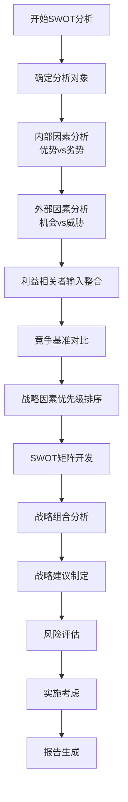
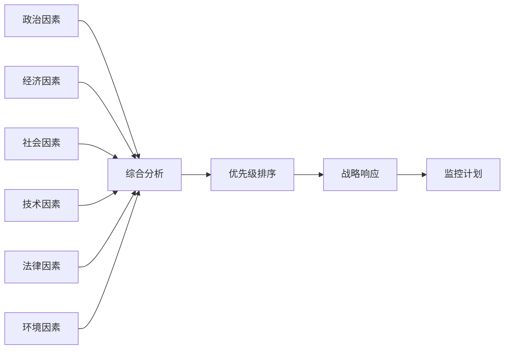
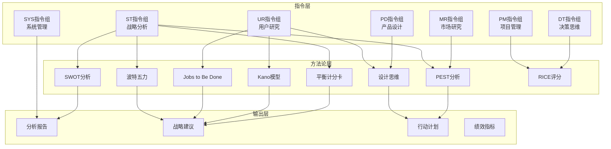
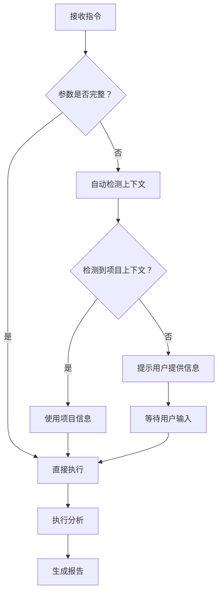
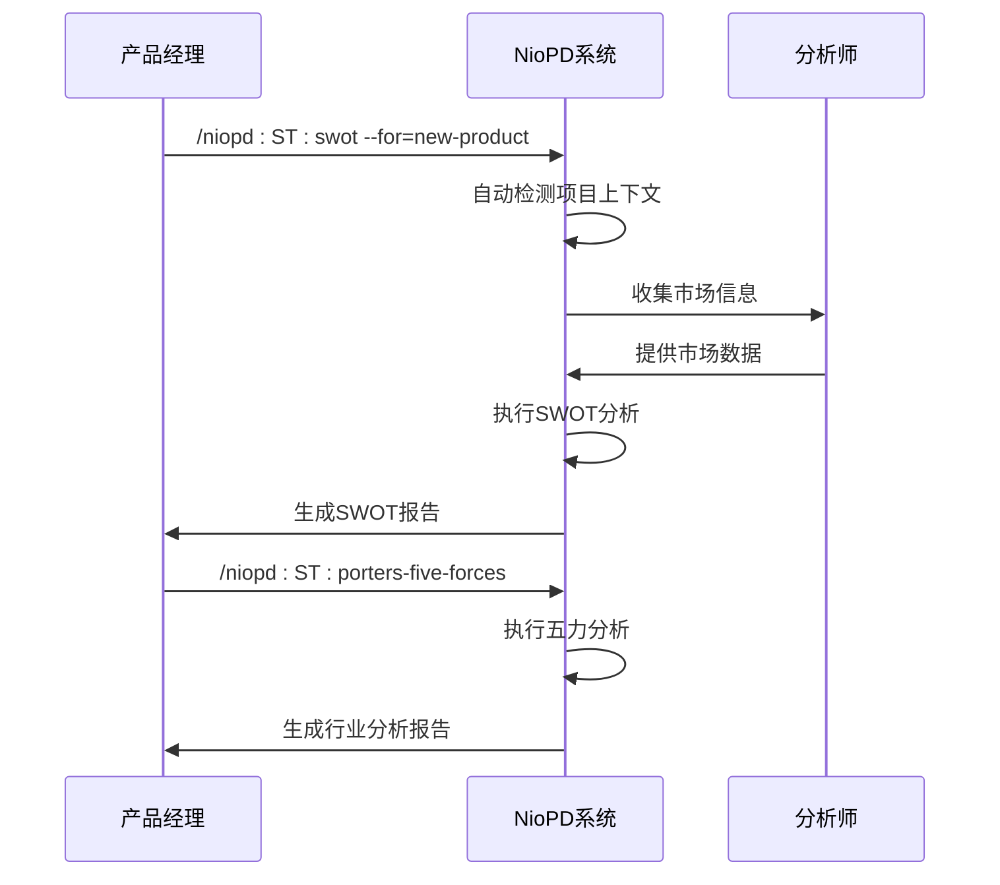

# 方法论内置体系

<cite>
**本文档引用的文件**
- [swot.md](file://niopd/commands/ST/swot.md)
- [porters-five-forces.md](file://niopd/commands/ST/porters-five-forces.md)
- [jtbd.md](file://niopd/commands/UR/jtbd.md)
- [kano.md](file://niopd/commands/UR/kano.md)
- [balanced-scorecard.md](file://niopd/commands/ST/balanced-scorecard.md)
- [pest.md](file://niopd/commands/ST/pest.md)
- [design-thinking.md](file://niopd/commands/ST/design-thinking.md)
- [personas.md](file://niopd/commands/UR/personas.md)
- [risk-analysis.md](file://niopd/commands/PM/risk-analysis.md)
- [portfolio.md](file://niopd/commands/ST/portfolio.md)
- [rice.md](file://niopd/commands/ST/rice.md)
- [kpis.md](file://niopd/commands/PM/kpis.md)
- [market-research-template.md](file://niopd/templates/market-research-template.md)
</cite>

## 目录
1. [引言](#引言)
2. [方法论内置体系概述](#方法论内置体系概述)
3. [核心方法论详解](#核心方法论详解)
4. [架构设计与实现](#架构设计与实现)
5. [指令集成机制](#指令集成机制)
6. [应用场景与实践](#应用场景与实践)
7. [最佳实践指南](#最佳实践指南)
8. [总结](#总结)

## 引言

NioPD（Nio Product Development）是一个创新的战略分析平台，它将经典的产品管理方法论系统性地内置到具体的指令中。这种方法论内置体系通过结构化的分析框架和标准化的操作流程，显著降低了学习成本，确保了最佳实践的一致性应用。

该体系的核心价值在于：
- **知识标准化**：将复杂的理论转化为可操作的指令
- **决策质量提升**：通过结构化分析提高决策的科学性
- **执行效率优化**：减少重复性工作，聚焦于关键洞察
- **团队协作增强**：提供统一的语言和工具集

## 方法论内置体系概述

### 设计理念

NioPD的方法论内置体系采用"理论指导实践，实践验证理论"的设计理念。每种方法论都经过精心筛选和适配，确保既能保持理论的完整性，又能满足实际业务需求。

```mermaid
graph TB
subgraph "理论基础层"
A[SWOT分析] --> B[波特五力模型]
B --> C[Jobs to Be Done理论]
C --> D[Kano模型]
D --> E[平衡计分卡]
E --> F[设计思维]
end
subgraph "指令实现层"
G[/niopd:ST:swot] --> H[/niopd:ST:porters-five-forces]
H --> I[/niopd:UR:jtbd]
I --> J[/niopd:UR:kano]
J --> K[/niopd:ST:balanced-scorecard]
K --> L[/niopd:ST:design-thinking]
end
subgraph "应用场景层"
M[战略规划] --> N[市场分析]
N --> O[产品设计]
O --> P[风险管理]
P --> Q[绩效管理]
end
A --> G
B --> H
C --> I
D --> J
E --> K
F --> L
G --> M
H --> N
I --> O
J --> O
K --> Q
L --> O
```

**图表来源**
- [swot.md](file://niopd/commands/ST/swot.md#L1-L50)
- [porters-five-forces.md](file://niopd/commands/ST/porters-five-forces.md#L1-L50)
- [jtbd.md](file://niopd/commands/UR/jtbd.md#L1-L50)

### 核心特征

1. **模块化设计**：每个方法论作为独立的功能模块
2. **指令驱动**：通过明确的命令格式调用特定分析
3. **参数化配置**：支持灵活的输入参数定制
4. **自动化输出**：生成标准化的分析报告
5. **上下文感知**：智能识别和利用项目上下文

**章节来源**
- [swot.md](file://niopd/commands/ST/swot.md#L1-L100)
- [porters-five-forces.md](file://niopd/commands/ST/porters-five-forces.md#L1-L100)

## 核心方法论详解

### SWOT分析：ST:swot

SWOT分析是NioPD中最基础也是最重要的战略分析工具之一。该方法论源自Albert Humphrey在斯坦福研究所的研究，已成为全球最广泛使用的战略规划工具。

#### 理论基础

SWOT分析的核心原理是通过结构化框架进行战略情境分析，同时考察内部因素（优势和劣势）和外部因素（机会和威胁），为战略制定提供依据。

#### 实现特点

1. **自动检测机制**：智能识别当前目录名称作为分析对象
2. **市场研究集成**：自动包含市场背景信息收集
3. **TOWS矩阵扩展**：提供策略组合分析
4. **优先级排序**：支持因素重要性和影响度评估

#### 应用场景

- 战略规划周期
- 新产品/倡议评估
- 竞争定位分析
- 并购尽职调查
- 商业模式评估

#### 结构化流程



**图表来源**
- [swot.md](file://niopd/commands/ST/swot.md#L150-L300)

**章节来源**
- [swot.md](file://niopd/commands/ST/swot.md#L1-L407)

### 波特五力模型：ST:porters-five-forces

波特五力模型由Michael E. Porter提出，是分析行业竞争力和盈利能力潜力的重要框架。该模型通过五个竞争力量来评估市场吸引力。

#### 理论基础

波特五力模型分析以下五个方面：
1. **新进入者的威胁**：资本要求、规模经济、品牌忠诚度等
2. **供应商的议价能力**：供应商集中度、输入独特性、转换成本等
3. **购买者的议价能力**：买家集中度、产品标准化、转换成本等
4. **替代品的威胁**：相对价格性能、转换成本、客户倾向等
5. **现有竞争者的竞争程度**：竞争对手数量、行业增长、固定成本等

#### 实现特色

1. **动态分析能力**：支持行业变化趋势分析
2. **互补产品考量**：纳入平台生态系统概念
3. **综合评分系统**：提供行业吸引力评级
4. **战略定位建议**：基于力量分析的定位策略

#### 应用价值

- 行业分析和市场进入决策
- 竞争战略制定
- 投资决策评估
- 战略定位分析

**章节来源**
- [porters-five-forces.md](file://niopd/commands/ST/porters-five-forces.md#L1-L662)

### Jobs to Be Done理论：UR:jtbd

Jobs to Be Done（JTBD）理论由Clayton Christensen提出，强调客户不是购买产品，而是雇佣产品来完成特定任务。这一理论为企业提供了理解客户需求的深度视角。

#### 理论基础

JTBD框架的核心要素：
- **功能工作**：实际要完成的任务
- **情感工作**：客户想要的感受
- **社会工作**：客户希望被如何看待

#### 分析维度

1. **工作陈述公式**："当[情境]，我想[动机]，所以我可以[预期结果]"
2. **客户旅程映射**：从触发事件到完成工作的全过程
3. **痛点识别**：功能、情感和社会层面的挑战
4. **创新机会发现**：未满足需求和改进空间

#### 实践应用

- 产品策略定义
- 创新机会识别
- 功能优先级排序
- 竞争分析（理解工作竞争）

**章节来源**
- [jtbd.md](file://niopd/commands/UR/jtbd.md#L1-L667)

### Kano模型：UR:kano

Kano模型由Noriaki Kano开发，用于分类产品特性对客户满意度的影响类型。该模型揭示了特性与满意度之间非线性的关系。

#### 五类特性分类

1. **必须质量（基本需求）**：缺失导致不满，存在不增加满意
2. **一维质量（性能需求）**：线性关系，越多越满意
3. **魅力质量（兴奋需求）**：存在创造满意，不存在不影响
4. **无差异质量**：对满意度无影响
5. **反向质量**：存在反而降低满意度

#### 应用价值

- 特性优先级排序
- 路线图规划
- 客户期望管理
- 差异化机会识别

#### 调查方法

每个特性通过两个问题评估：
1. 如果该特性存在，你会有什么感受？
2. 如果该特性不存在，你会有什么感受？

**章节来源**
- [kano.md](file://niopd/commands/UR/kano.md#L1-L672)

### 平衡计分卡：ST:balanced-scorecard

平衡计分卡由Robert Kaplan和David Norton开发，将组织愿景和战略转化为全面的绩效衡量体系。

#### 四个视角

1. **财务视角**：股东如何看待我们？
2. **客户视角**：客户如何看待我们？
3. **内部流程视角**：我们必须在哪些方面优秀？
4. **学习与成长视角**：我们能否持续改进和创造价值？

#### 实现特点

1. **战略地图可视化**：展示视角间的因果关系
2. **指标链接机制**：建立目标间的逻辑联系
3. **四步实施过程**：翻译、沟通、规划、反馈
4. **OKR集成**：支持现代目标管理体系

#### 应用场景

- 战略计划实施
- 绩效管理体系
- 组织对齐
- 变革管理
- 年度目标设定

**章节来源**
- [balanced-scorecard.md](file://niopd/commands/ST/balanced-scorecard.md#L1-L481)

### PEST分析：ST:pest

PEST分析提供宏观环境扫描的系统框架，涵盖政治、经济、社会、技术、法律和环境六个维度。

#### 六大维度

1. **政治因素**：政府稳定性、政策、贸易法规
2. **经济因素**：经济增长、通货膨胀、就业率
3. **社会因素**：人口统计、文化态度、生活方式
4. **技术因素**：创新速度、研发投入、数字化
5. **法律因素**：劳动法、消费者保护、数据隐私
6. **环境因素**：气候变化、可持续发展、资源稀缺

#### 分析流程



**图表来源**
- [pest.md](file://niopd/commands/ST/pest.md#L100-L200)

**章节来源**
- [pest.md](file://niopd/commands/ST/pest.md#L1-L799)

### 设计思维：ST:design-thinking

设计思维是一种以人为本的创新方法论，通过五个阶段解决复杂问题。

#### 五大阶段

1. **同理心（Empathize）**：深入了解用户
2. **定义（Define）**：形成问题陈述
3. **构思（Ideate）**：产生创意方案
4. **原型（Prototype）**：构建可测试的模型
5. **测试（Test）**：验证解决方案

#### 核心原则

- **以人为本**：从人的需求出发
- **展示而非讲述**：通过原型沟通
- **行动导向**：实验和迭代
- **跨领域合作**：多样化的视角
- **过程意识**：有意识地运用方法

#### 应用价值

- 复杂问题解决
- 创新挑战应对
- 新产品/服务开发
- 客户体验改善
- 组织转型

**章节来源**
- [design-thinking.md](file://niopd/commands/ST/design-thinking.md#L1-L741)

## 架构设计与实现

### 指令系统架构

NioPD采用模块化的指令系统架构，每种方法论都有对应的独立指令：



**图表来源**
- [swot.md](file://niopd/commands/ST/swot.md#L1-L30)
- [porters-five-forces.md](file://niopd/commands/ST/porters-five-forces.md#L1-L30)
- [jtbd.md](file://niopd/commands/UR/jtbd.md#L1-L30)

### 参数化设计

每种指令都支持灵活的参数配置：

| 参数 | 类型 | 描述 | 示例 |
|------|------|------|------|
| `--for` | 字符串 | 分析对象名称 | `--for=dark-mode-feature` |
| `--market` | 字符串 | 市场上下文 | `--market="mobile apps"` |
| `--customer` | 字符串 | 客户群体 | `--customer="enterprise"` |
| `--context` | 字符串 | 使用场景 | `--context="work environment"` |
| `--organization` | 字符串 | 组织名称 | `--organization="Nio"` |
| `--method` | 字符串 | 分析方法 | `--method=BCG` |

### 自动化流程

系统实现了完整的自动化流程：

1. **输入验证**：参数检查和默认值处理
2. **上下文识别**：自动检测项目和环境信息
3. **数据收集**：智能搜索和整合相关信息
4. **分析执行**：按照方法论标准流程运行
5. **报告生成**：自动生成结构化分析报告
6. **存储管理**：按约定格式保存结果

**章节来源**
- [swot.md](file://niopd/commands/ST/swot.md#L100-L200)
- [porters-five-forces.md](file://niopd/commands/ST/porters-five-forces.md#L100-L200)

## 指令集成机制

### 命令格式规范

所有方法论指令遵循统一的格式规范：

```
/niopd:[类别]:[方法名] [--参数=value] [--参数2=value2]
```

### 上下文感知

系统具备智能的上下文感知能力：



**图表来源**
- [swot.md](file://niopd/commands/ST/swot.md#L150-L200)

### 错误处理机制

系统实现了完善的错误处理和用户引导：

1. **参数验证**：检查必需参数的完整性
2. **数据可用性检查**：验证所需数据的存在
3. **用户引导**：提供清晰的输入指导
4. **容错处理**：在数据不足时提供替代方案
5. **进度反馈**：实时显示分析状态

**章节来源**
- [swot.md](file://niopd/commands/ST/swot.md#L350-L407)
- [porters-five-forces.md](file://niopd/commands/ST/porters-five-forces.md#L650-L662)

## 应用场景与实践

### 战略规划场景

在战略规划过程中，NioPD的方法论内置体系发挥着关键作用：

#### 场景1：新产品发布前评估



**图表来源**
- [swot.md](file://niopd/commands/ST/swot.md#L200-L300)
- [porters-five-forces.md](file://niopd/commands/ST/porters-five-forces.md#L200-L300)

#### 场景2：市场进入决策

1. **PEST分析**：评估宏观环境
2. **波特五力**：分析行业竞争
3. **SWOT分析**：评估企业能力
4. **风险评估**：识别潜在风险

### 用户研究场景

在用户研究方面，系统提供了完整的用户洞察能力：

#### 用户画像构建

通过结合JTBD理论和Kano模型：

1. **Jobs to Be Done分析**：理解用户深层需求
2. **Kano模型评估**：分类功能特性
3. **用户画像生成**：创建详细的用户描述
4. **需求优先级排序**：指导产品开发

**章节来源**
- [jtbd.md](file://niopd/commands/UR/jtbd.md#L100-L200)
- [kano.md](file://niopd/commands/UR/kano.md#L100-L200)
- [personas.md](file://niopd/commands/UR/personas.md#L100-L200)

### 产品管理场景

在产品管理生命周期中，各种方法论提供持续的价值：

#### 产品路线图规划

1. **RICE评分**：优先级排序
2. **平衡计分卡**：目标对齐
3. **风险分析**：潜在问题识别
4. **KPI跟踪**：绩效监控

#### 产品组合管理

1. **BCG矩阵**：产品分类
2. **GE矩阵**：综合评估
3. **生命周期分析**：阶段判断
4. **资源分配**：投资决策

**章节来源**
- [rice.md](file://niopd/commands/ST/rice.md#L100-L200)
- [portfolio.md](file://niopd/commands/ST/portfolio.md#L100-L200)

## 最佳实践指南

### 学习路径建议

为了最大化方法论内置体系的价值，建议按照以下路径学习：

#### 初级阶段（1-3个月）

1. **熟悉基础指令**：掌握ST:swot和UR:jtbd
2. **理解核心概念**：学习各方法论的基本原理
3. **实践简单案例**：在模拟项目中应用
4. **观察输出格式**：了解报告结构

#### 中级阶段（3-6个月）

1. **深入特定领域**：选择感兴趣的领域深入
2. **组合使用方法**：尝试多种方法论协同
3. **优化参数配置**：根据经验调整参数
4. **分享实践经验**：与团队交流心得

#### 高级阶段（6个月以上）

1. **方法论创新**：结合实际情况创新应用
2. **流程优化**：建立标准化工作流程
3. **培训他人**：成为团队的方法论专家
4. **持续改进**：不断优化使用效果

### 实施最佳实践

#### 数据准备

1. **确保数据质量**：使用准确可靠的数据源
2. **补充背景信息**：提供充分的上下文信息
3. **定期更新数据**：保持信息的时效性
4. **验证数据一致性**：确保不同来源的数据一致

#### 分析质量控制

1. **多角度验证**：从不同维度验证结论
2. **专家咨询**：必要时寻求领域专家意见
3. **同行评审**：让同事审查分析结果
4. **持续学习**：关注方法论的最新发展

#### 结果应用

1. **制定行动计划**：将分析结果转化为具体行动
2. **建立跟踪机制**：监控实施效果
3. **反馈循环**：根据结果调整策略
4. **知识沉淀**：积累经验和教训

### 常见问题与解决方案

#### 问题1：分析结果不够准确

**解决方案**：
- 检查输入数据的质量和完整性
- 考虑更多相关因素
- 结合定性分析补充定量结果
- 寻求专家意见

#### 问题2：多个方法论结果冲突

**解决方案**：
- 分析冲突的根本原因
- 识别哪个方法论更适用当前场景
- 综合考虑不同视角
- 建立权重机制平衡结果

#### 问题3：实施效果不明显

**解决方案**：
- 明确具体的行动步骤
- 建立责任和时间表
- 设置可测量的里程碑
- 定期回顾和调整

**章节来源**
- [swot.md](file://niopd/commands/ST/swot.md#L300-L407)
- [porters-five-forces.md](file://niopd/commands/ST/porters-five-forces.md#L500-L600)

## 总结

NioPD的方法论内置体系代表了产品管理方法论应用的重大创新。通过将经典理论转化为可操作的指令，该体系实现了：

### 核心价值

1. **知识普及化**：降低专业门槛，让更多人能够有效使用高级分析工具
2. **实践标准化**：确保最佳实践的一致性应用
3. **效率提升**：通过自动化减少重复性工作
4. **质量保证**：结构化流程确保分析的严谨性
5. **协作增强**：提供统一的分析语言和工具

### 发展前景

随着人工智能技术的发展和产品管理实践的演进，NioPD的方法论内置体系将继续演进：

1. **智能化增强**：利用AI提高数据分析的深度和广度
2. **个性化定制**：根据不同组织的特点优化方法论应用
3. **实时化分析**：支持动态和实时的决策支持
4. **生态系统整合**：与其他工具和平台的深度集成
5. **社区化发展**：建立更广泛的用户社区和知识共享

### 实践建议

对于希望充分利用这一体系的组织和个人，建议：

1. **循序渐进**：从基础方法论开始，逐步深入
2. **实践导向**：在实际项目中应用和验证
3. **持续学习**：关注方法论的最新发展
4. **团队协作**：建立共同的方法论使用文化
5. **效果评估**：定期评估使用效果并优化流程

通过系统性地应用NioPD的方法论内置体系，组织可以显著提升战略决策的质量，优化产品开发流程，最终实现更好的商业成果。