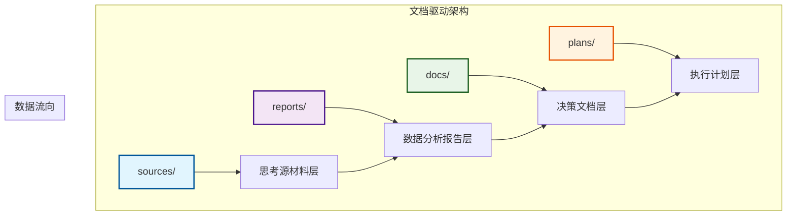
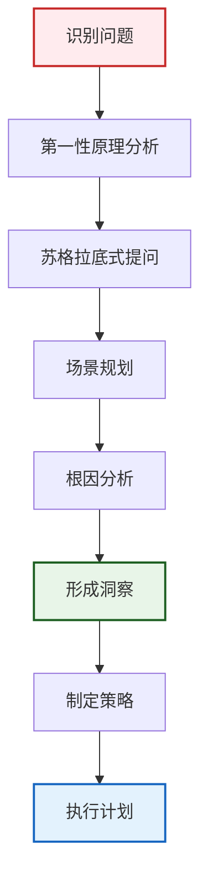
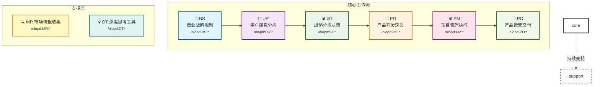
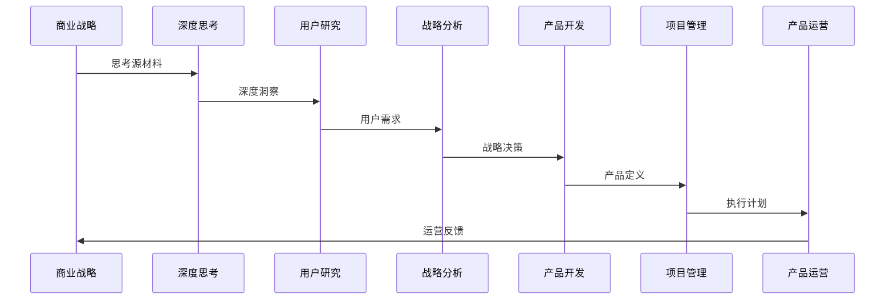

# 核心理念与设计哲学

<cite>
**本文档引用的文件**
- [README.md](file://README.md)
- [niopd/templates/README.md](file://niopd/templates/README.md)
- [niopd/.claude-plugin/plugin.json](file://niopd/.claude-plugin/plugin.json)
- [niopd/commands/DT/first-principles.md](file://niopd/commands/DT/first-principles.md)
- [niopd/commands/ST/swot.md](file://niopd/commands/ST/swot.md)
- [niopd/commands/UR/jtbd.md](file://niopd/commands/UR/jtbd.md)
- [niopd/commands/PD/draft-prd.md](file://niopd/commands/PD/draft-prd.md)
- [niopd/commands/PM/agile-planning.md](file://niopd/commands/PM/agile-planning.md)
- [niopd/commands/ST/porters-five-forces.md](file://niopd/commands/ST/porters-five-forces.md)
- [niopd/commands/UR/kano.md](file://niopd/commands/UR/kano.md)
- [niopd/commands/PO/north-star.md](file://niopd/commands/PO/north-star.md)
</cite>

## 目录
1. [引言](#引言)
2. [核心理念概述](#核心理念概述)
3. [文档驱动的产品管理](#文档驱动的产品管理)
4. [方法论与最佳实践内置](#方法论与最佳实践内置)
5. [思考优先执行其次](#思考优先执行其次)
6. [工作流架构与协同机制](#工作流架构与协同机制)
7. [实际工作流示例](#实际工作流示例)
8. [总结](#总结)

## 引言

NioPD（Nio Product Director）是一个为 Claude Code 设计的智能化产品管理工具包，集成了69个专业化指令，覆盖从商业战略规划到产品交付运营的完整产品开发生命周期。该项目的核心设计理念体现了现代产品管理的最佳实践，通过系统化的方法论和深度思考工具，帮助产品经理构建高质量的产品解决方案。

## 核心理念概述

NioPD 的设计基于三个核心理念，这些理念相互支撑，形成了独特的产品管理方法论：

### 四大工作原则

1. **同理心倾听** - 充分理解用户的观点和上下文
2. **苏格拉底式提问** - 通过提问引导用户自我发现
3. **第一性原理** - 帮助用户将问题分解到本质
4. **按需建议** - 仅在明确请求时提供具体建议

### 核心价值主张

NioPD 通过以下方式改变产品经理的工作方式：
- **📝 知识捕获**：自动记录思考过程和决策，构建知识体系
- **⚡ 工作流加速**：自动化重复性任务，如 MRD/PSD/PRD 生成和反馈分析
- **📊 决策增强**：提供 SWOT、波特五力、Kano 等 20+ 战略框架和分析工具
- **📁 上下文维护**：保持所有项目信息的组织和可追溯性
- **🎯 方法论驱动**：内置产品管理界经证的最佳实践和方法论

## 文档驱动的产品管理

### 文档目录结构设计

NioPD 采用独特的文档目录结构，每个目录对应文档生命周期的不同阶段：



**图表来源**
- [README.md](file://README.md#L197-L240)

### sources/ - 思考源材料层

**用途**：存储原始思考记录、头脑风暴结果、深度思考分析

**输出指令**：BS、DT

**典型文件**：
- `[date]-brainstorm-discussion.md` - 头脑风暴记录
- `[date]-first-principles-thinking.md` - 第一性原理分析
- `[date]-five-whys-analysis.md` - 根因分析
- `[date]-scenario-planning.md` - 场景规划
- `note.md` - 日常想法和灵感记录

**特点**：
- 非结构化，记录思考过程
- 为后续分析提供原始素材
- 可追溯决策来源

### reports/ - 数据分析报告层

**用途**：存储基于数据和方法论的结构化分析报告

**输出指令**：UR、MR、ST

**典型文件**：
- `[date]-user-feedback-summary.md` - 用户反馈分析报告
- `[date]-competitor-analysis.md` - 竞品分析报告
- `[date]-market-trends.md` - 市场趋势报告
- `[date]-swot-analysis.md` - SWOT 分析报告
- `[date]-user-personas.md` - 用户画像
- `[date]-kano-analysis.md` - Kano 模型分析

**特点**：
- 结构化分析报告
- 基于方法论框架
- 支撑战略决策

### docs/ - 决策文档层

**用途**：存储核心产品决策文档和运营方案

**输出指令**：PD、PO

**文档层级**：

```
Initiative (立项文档)
   ↓
MRD (市场需求文档)
   ↓
PSD (产品策略文档)
   ↓
PRD (产品需求文档)
   ↓
FAQ / 运营文档
```

**典型文件**：
- `[date]-<initiative>-initiative-v1.md` - 项目立项文档
- `[date]-<initiative>-mrd-v1.md` - 市场需求文档
- `[date]-<initiative>-psd-v1.md` - 产品策略文档
- `[date]-<initiative>-prd-v1.md` - 产品需求文档
- `[date]-<initiative>-faq-v1.md` - 常见问题文档

**特点**：
- 权威性的产品定义
- 多版本管理（v1, v2...）
- 文档间引用关联
- 利益相关方对齐

### plans/ - 执行计划层

**用途**：存储项目执行计划、发布计划、风险管理等

**输出指令**：PM

**典型文件**：
- `[date]-<initiative>-pid-v1.md` - 项目立项文档（PID）
- `[date]-<initiative>-release-plan-v1.md` - 发布计划
- `[date]-<initiative>-roadmap-v1.md` - 产品路线图
- `[date]-<initiative>-sprint-plan-v1.md` - 敏捷冲刺计划
- `[date]-<initiative>-risk-analysis-v1.md` - 风险分析报告

**特点**：
- 执行导向
- 时间线明确
- 资源和依赖管理
- 可跟踪和更新

**章节来源**
- [README.md](file://README.md#L197-L300)

## 方法论与最佳实践内置

### 深度思考工具集

NioPD 内置了多种深度思考工具，帮助用户突破表面问题，找到根本原因和创新解决方案：

#### 第一性原理思维

**核心思想**：将问题分解到最基本的事实和假设，从零开始重新构建解决方案

**应用场景**：
- 面对"不可能"的挑战时
- 现有解决方案成本/复杂度过高时
- 需要创新突破时

**分析流程**：
1. 识别并定义当前假设
2. 将问题分解到基本事实
3. 从基本事实创建新解决方案

#### 苏格拉底式提问

**核心思想**：通过系统性提问引导思考，挑战假设和前提条件

**六大提问类型**：
1. **澄清性问题**："你说的X具体是什么意思?"
2. **假设探究**："这基于什么假设?"
3. **证据探究**："有什么证据支持这个?"
4. **视角探究**："从用户角度看呢?"
5. **影响探究**："如果这样做会怎样?"
6. **元问题**："为什么这个问题重要?"

#### 场景规划

**核心思想**：构建多个可能的未来场景，为每种场景制定应对策略

**应用步骤**：
1. 识别关键不确定性因素
2. 构建 2-4 个差异化场景
3. 分析每个场景的影响
4. 制定应对策略

### 战略分析框架

#### SWOT 分析

**核心原则**：提供结构化框架进行战略情境分析

**SWOT 矩阵**：
- **Strengths**: 内部优势
- **Weaknesses**: 内部劣势
- **Opportunities**: 外部机会
- **Threats**: 外部威胁

**TOWS 矩阵**：
- SO 策略：利用优势抓住机会
- WO 策略：克服劣势抓住机会
- ST 策略：利用优势缓解威胁
- WT 策略：最小化劣势避免威胁

#### 波特五力分析

**核心思想**：分析行业竞争力和盈利能力潜力

**五力模型**：
1. **新进入者威胁**
2. **供应商议价能力**
3. **买家议价能力**
4. **替代品威胁**
5. **行业内竞争**

### 用户研究方法论

#### Jobs-to-be-Done (JTBD)

**核心洞察**：用户不是购买产品，而是"雇佣"产品来完成特定任务

**JTBD 陈述句式**：
```
当我 [情境]
我想要 [动机]
这样我就能 [预期结果]
```

#### Kano 模型

**五类功能**：
1. **基本型需求**：必须有，没有会不满
2. **期望型需求**：越多越好，影响满意度
3. **兴奋型需求**：意外惊喜，超预期
4. **无差异需求**：有没有都无所谓
5. **反向需求**：有了反而不满

### 产品运营框架

#### 北星指标

**核心原则**：单一指标捕捉核心客户价值

**北星指标标准**：
- **Captures Value**：代表客户受益
- **Actionable**：指导决策
- **Universal**：适用于全公司
- **Predictive**：预测业务成果
- **Measurable**：可量化追踪

**章节来源**
- [niopd/commands/DT/first-principles.md](file://niopd/commands/DT/first-principles.md#L1-L50)
- [niopd/commands/ST/swot.md](file://niopd/commands/ST/swot.md#L1-L50)
- [niopd/commands/UR/jtbd.md](file://niopd/commands/UR/jtbd.md#L1-L50)
- [niopd/commands/PO/north-star.md](file://niopd/commands/PO/north-star.md#L1-L50)

## 思考优先执行其次

### DT 工具集的设计理念

NioPD 强调"思考优先，执行其次"的原则，通过 DT（深度思考）工具集在决策前引导深度分析：



**图表来源**
- [niopd/commands/DT/first-principles.md](file://niopd/commands/DT/first-principles.md#L60-L120)

### 思考优先的具体体现

#### 1. 第一性原理思维的应用

**经典案例**：
- **SpaceX 火箭成本**：不问"火箭要多少钱"，而问"火箭的原材料值多少钱"
- **电动车电池**：不问"电池为什么贵"，而问"电池由什么组成，每种材料多少钱"

**实施步骤**：
1. **识别假设**：列出所有当前假设
2. **分解问题**：将复杂问题拆解到基本元素
3. **重构解决方案**：从基本事实重新构建
4. **验证创新**：确保新方案的有效性

#### 2. 苏格拉底式提问的运用

**提问策略**：
- **挑战假设**：质疑默认前提
- **探索证据**：要求具体支持
- **分析后果**：考虑长期影响
- **比较视角**：从不同角度审视

#### 3. 场景规划的前瞻性

**规划维度**：
- **技术趋势**：新兴技术影响
- **市场变化**：消费者行为转变
- **竞争格局**：行业结构演变
- **外部环境**：政策法规变化

### 思考与执行的平衡

**思考阶段**：
- 深度分析问题本质
- 探索多种解决方案
- 评估潜在风险和收益
- 形成战略共识

**执行阶段**：
- 制定具体行动计划
- 分配资源和责任
- 建立监控和反馈机制
- 持续优化调整

**章节来源**
- [niopd/commands/DT/first-principles.md](file://niopd/commands/DT/first-principles.md#L174-L222)
- [niopd/commands/DT/socratic-questioning.md](file://niopd/commands/DT/socratic-questioning.md#L70-L122)

## 工作流架构与协同机制

### 核心工作流架构

NioPD 遵循一个清晰的产品开发流程，其中 BS→UR→ST→PD→PM→PO 形成主线，MR 作为并行的市场情报收集，DT 作为思维工具可在任何阶段使用：



**图表来源**
- [README.md](file://README.md#L100-L150)

### 各阶段详解

| 阶段 | 命名空间 | 目的 | 输出目录 | 核心方法论 |
|------|---------|------|---------|-----------|
| **SYS** | 系统管理 | 工作区初始化、系统配置 | - | 工程化管理 |
| **BS** | 商业战略规划 | 从想法生成到产品方向规划 | `sources/` | Brain Storming |
| **DT** | 深度思考工具 | 任何阶段的思维工具 | `sources/` | 第一性原理、五个为什么 |
| **MR** | 市场研究 | 全过程提供市场洞察 | `reports/` | 竞品分析、市场定位 |
| **UR** | 用户研究分析 | 深入了解用户需求、行为、痛点 | `reports/` | JTBD、Kano、用户画像 |
| **ST** | 战略分析决策 | 基于数据和框架的战略决策 | `reports/` | SWOT、波特五力、商业画布 |
| **PD** | 产品开发定义 | 转化洞察为具体产品需求 | `docs/` | MRD/PSD/PRD 文档层级 |
| **PM** | 项目管理执行 | 规划、执行和跟踪项目进展 | `plans/` | PID、敏捷、DACI |
| **PO** | 产品运营交付 | 产品发布和持续优化 | `docs/` | AARRR、北极星指标 |

### 协同工作机制

#### 1. 文档间的引用关联

每个阶段的输出都是下一阶段的输入，形成知识积累：



**图表来源**
- [README.md](file://README.md#L240-L280)

#### 2. 跨阶段的知识传递

- **BS→DT**：从想法到深度思考
- **DT→UR**：从假设到用户验证
- **UR→ST**：从用户洞察到战略决策
- **ST→PD**：从战略到产品定义
- **PD→PM**：从产品到项目执行
- **PM→PO**：从执行到运营优化

#### 3. 动态调整机制

工作流具有灵活性，可以根据实际情况进行调整：

- **并行分析**：MR 和 DT 可以在任何阶段并行进行
- **迭代优化**：发现问题可以回退到上游阶段
- **知识复用**：历史分析结果可以在新项目中复用

**章节来源**
- [README.md](file://README.md#L100-L200)

## 实际工作流示例

### 示例项目：移动端重设计

让我们通过一个具体的移动端重设计项目来展示 NioPD 理念如何在实践中协同工作：

#### 第一阶段：商业战略规划 (BS)

**活动**：
- `/niopd:BS:hi` - 与 Nio 进行头脑风暴对话
- `/niopd:BS:note` - 记录灵感和观察
- `/niopd:BS:new-initiative` - 创建项目立项文档

**输出**：
- `sources/20241030-mobile-redesign-brainstorm.md`
- `sources/20241030-mobile-redesign-first-principles.md`
- `docs/20241102-mobile-redesign-initiative-v1.md`

#### 第二阶段：深度思考 (DT)

**活动**：
- `/niopd:DT:first-principles` - 第一性原理分析
- `/niopd:DT:five-whys` - 根因分析
- `/niopd:DT:socratic-questioning` - 苏格拉底式提问

**输出**：
- `sources/20241030-mobile-redesign-first-principles.md`
- `sources/20241030-mobile-redesign-five-whys.md`

#### 第三阶段：用户研究 (UR)

**活动**：
- `/niopd:UR:feedback` - 用户反馈分析
- `/niopd:UR:jtbd` - Jobs-to-be-Done 分析
- `/niopd:UR:kano` - Kano 模型分析

**输出**：
- `reports/20241031-mobile-redesign-user-feedback.md`
- `reports/20241031-mobile-redesign-jtbd.md`
- `reports/20241031-mobile-redesign-kano.md`

#### 第四阶段：市场研究 (MR)

**活动**：
- `/niopd:MR:competitor` - 竞品分析
- `/niopd:MR:positioning` - 市场定位
- `/niopd:MR:trends` - 市场趋势研究

**输出**：
- `reports/20241031-mobile-redesign-competitor.md`
- `reports/20241031-mobile-redesign-positioning.md`

#### 第五阶段：战略分析 (ST)

**活动**：
- `/niopd:ST:swot` - SWOT 分析
- `/niopd:ST:porters-five-forces` - 波特五力分析

**输出**：
- `reports/20241101-mobile-redesign-swot.md`
- `reports/20241101-mobile-redesign-porters-five-forces.md`

#### 第六阶段：产品开发 (PD)

**活动**：
- `/niopd:PD:draft-prd` - 产品需求文档
- `/niopd:PD:stories` - 用户故事
- `/niopd:PD:journey` - 用户旅程地图

**输出**：
- `docs/20241103-mobile-redesign-mrd-v1.md`
- `docs/20241104-mobile-redesign-psd-v1.md`
- `docs/20241105-mobile-redesign-prd-v1.md`

#### 第七阶段：项目管理 (PM)

**活动**：
- `/niopd:PM:agile-planning` - 敏捷规划
- `/niopd:PM:release` - 发布计划
- `/niopd:PM:kpis` - 关键指标

**输出**：
- `plans/20241106-mobile-redesign-pid-v1.md`
- `plans/20241107-mobile-redesign-release-plan-v1.md`

#### 第八阶段：产品运营 (PO)

**活动**：
- `/niopd:PO:north-star` - 北星指标
- `/niopd:PO:customer-success` - 客户成功
- `/niopd:PO:stakeholder-update` - 利益相关方更新

**输出**：
- `docs/20241108-mobile-redesign-faq-v1.md`

### 文档流转示例

一个完整的产品开发流程文档流转如下：

```
1. sources/20241030-mobile-redesign-brainstorm.md      (BS:hi)
2. sources/20241030-mobile-redesign-first-principles.md (DT)
3. reports/20241031-mobile-redesign-user-feedback.md   (UR)
4. reports/20241031-mobile-redesign-competitor.md      (MR)
5. reports/20241101-mobile-redesign-swot.md            (ST)
6. docs/20241102-mobile-redesign-initiative-v1.md      (BS)
7. docs/20241103-mobile-redesign-mrd-v1.md             (PD)
8. docs/20241104-mobile-redesign-psd-v1.md             (PD)
9. docs/20241105-mobile-redesign-prd-v1.md             (PD)
10. plans/20241106-mobile-redesign-pid-v1.md           (PM)
11. plans/20241107-mobile-redesign-release-plan-v1.md  (PM)
12. docs/20241108-mobile-redesign-faq-v1.md            (PO)
```

### 实践中的协同效应

#### 1. 知识积累与复用

- **历史项目复用**：之前的竞品分析可以直接用于新项目
- **模板化文档**：标准化的 PRD 模板提高效率
- **最佳实践传承**：成功的策略被记录和传播

#### 2. 跨团队协作

- **统一语言**：所有团队使用相同的方法论术语
- **透明沟通**：文档记录确保信息同步
- **责任明确**：每个阶段都有明确的负责人

#### 3. 质量保证

- **多轮验证**：每个阶段都有质量检查点
- **交叉验证**：不同方法论相互印证
- **持续改进**：基于反馈不断优化流程

**章节来源**
- [README.md](file://README.md#L267-L300)

## 总结

NioPD 的三大核心设计理念——文档驱动的产品管理、方法论与最佳实践内置、思考优先执行其次——形成了一个完整的产品管理生态系统。这种设计不仅提高了工作效率，更重要的是培养了系统性思维和深度分析能力。

### 核心优势

1. **系统性**：从战略到执行的完整覆盖
2. **方法论驱动**：基于经过验证的最佳实践
3. **知识积累**：文档化的知识管理体系
4. **灵活适应**：支持不同项目和团队需求
5. **持续改进**：基于反馈的迭代优化

### 应用价值

- **提升决策质量**：通过深度思考和多维度分析
- **提高执行效率**：标准化流程和自动化工具
- **促进团队协作**：统一的方法论和沟通语言
- **建立知识资产**：可追溯的历史记录和最佳实践
- **培养专业能力**：系统性思维和方法论应用

NioPD 不仅仅是一个工具包，更是一种产品管理哲学的体现。它通过系统化的方法论和深度思考工具，帮助产品经理在复杂的产品开发过程中做出更好的决策，创造更有价值的产品。