# docs目录：决策文档层核心架构深度解析

<cite>
**本文档引用的文件**
- [init.md](file://niopd/commands/SYS/init.md)
- [draft-prd.md](file://niopd/commands/PD/draft-prd.md)
- [north-star.md](file://niopd/commands/PO/north-star.md)
- [draft-mrd.md](file://niopd/commands/PD/draft-mrd.md)
- [draft-psd.md](file://niopd/commands/PD/draft-psd.md)
- [prd-template.md](file://niopd/templates/prd-template.md)
- [initiative-template.md](file://niopd/templates/initiative-template.md)
- [prd-daily-template.md](file://niopd/templates/prd-daily-template.md)
- [project-update-template.md](file://niopd/templates/project-update-template.md)
- [README.md](file://README.md)
</cite>

## 目录
1. [引言](#引言)
2. [项目结构概览](#项目结构概览)
3. [docs目录的核心地位](#docs目录的核心地位)
4. [文档层次架构](#文档层次架构)
5. [文件命名规范与版本控制](#文件命名规范与版本控制)
6. [核心文档类型详解](#核心文档类型详解)
7. [文档流转机制](#文档流转机制)
8. [跨团队协作模式](#跨团队协作模式)
9. [文档审批流程建议](#文档审批流程建议)
10. [与plans目录的联动机制](#与plans目录的联动机制)
11. [可追溯性与变更追踪](#可追溯性与变更追踪)
12. [最佳实践与建议](#最佳实践与建议)
13. [总结](#总结)

## 引言

docs目录作为NioPD系统中的决策文档层，承载着产品开发（PD）和产品运营（PO）过程中产生的所有正式决策文档。它不仅是产品生命周期中最重要的权威性文档存储中心，更是确保产品战略、市场需求、产品设计和运营策略能够有效传递至执行层的关键枢纽。

在现代产品管理实践中，决策文档的质量直接影响产品的成功率。NioPD通过精心设计的docs目录结构，实现了决策的集中化、标准化和可追溯性管理，为企业提供了完整的决策文档管理体系。

## 项目结构概览

基于init.md中定义的目录结构，NioPD采用分层架构设计，将不同类型的文档按照其作用和生命周期进行分类存储：

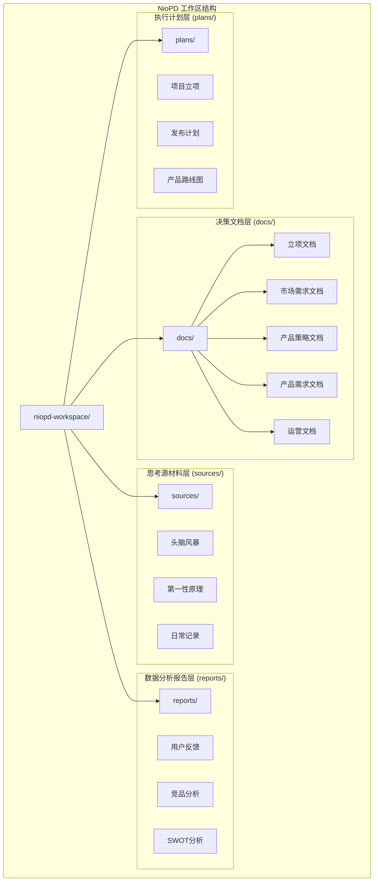

**图表来源**
- [init.md](file://niopd/commands/SYS/init.md#L25-L35)

**章节来源**
- [init.md](file://niopd/commands/SYS/init.md#L25-L35)

## docs目录的核心地位

### 权威性决策中心

docs目录是NioPD系统中最具权威性的决策文档存储中心。在这里产生的文档具有以下特征：

- **唯一性**：每个决策都有对应的官方文档记录
- **完整性**：涵盖从战略到执行的全链路决策
- **可追溯性**：每个决策都能追溯到其产生背景和依据
- **法律效力**：作为产品开发和运营的正式依据

### 产品生命周期决策枢纽

docs目录贯穿产品从概念到上市的整个生命周期，确保每个阶段的决策都能得到有效记录和传承：

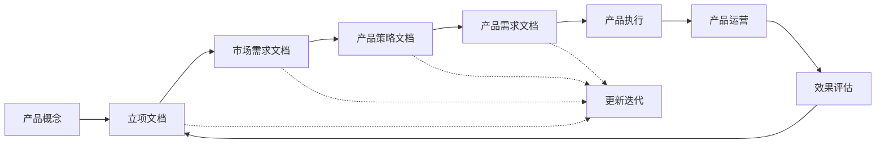

**图表来源**
- [README.md](file://README.md#L240-L256)

### 跨团队协作桥梁

docs目录作为产品团队、工程团队、运营团队之间的协作桥梁，确保各方对产品决策的理解保持一致：

- **产品团队**：负责战略决策和需求定义
- **工程团队**：基于PRD进行技术实现
- **运营团队**：基于FAQ和运营文档进行产品推广
- **市场团队**：基于MRD和PSD进行市场定位

**章节来源**
- [init.md](file://niopd/commands/SYS/init.md#L100-L150)

## 文档层次架构

NioPD采用三层文档架构，每层文档都有明确的职责和目标受众：

### 第一层：Initiative（立项文档）

立项文档是产品决策的起点，定义了项目的初始目标和范围：

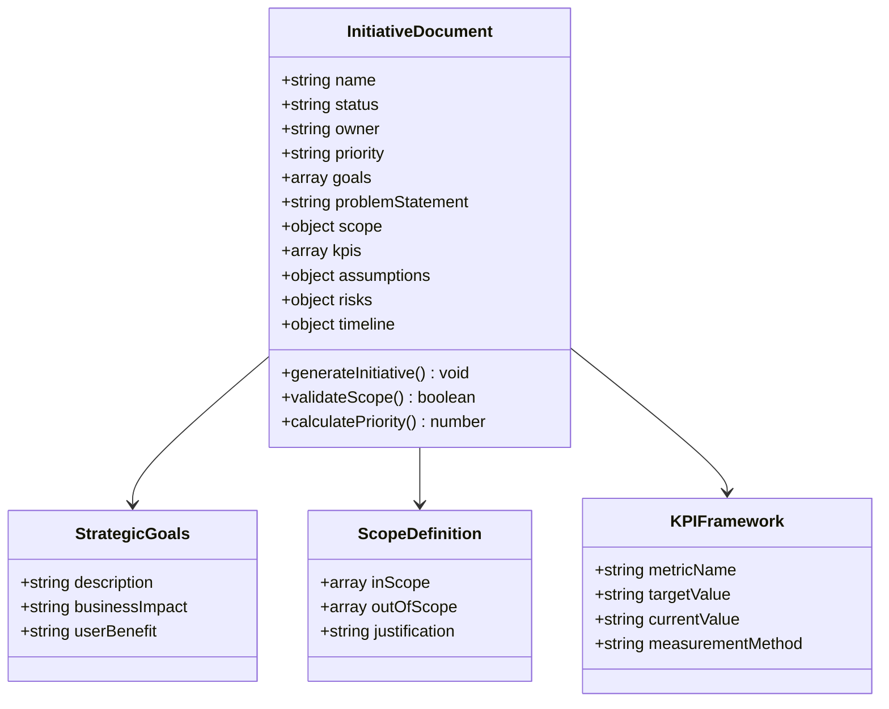

**图表来源**
- [initiative-template.md](file://niopd/templates/initiative-template.md#L1-L89)

### 第二层：MRD（市场需求文档）

市场需求文档从市场视角回答"为什么做"的问题，为产品决策提供市场依据：

**核心要素**：
- **市场分析**：市场规模、增长趋势、细分市场
- **竞争分析**：竞争对手定位、优势劣势、市场空白
- **用户洞察**：目标用户画像、痛点分析、需求优先级
- **商业假设**：收入模型、成本结构、盈利预测

### 第三层：PSD（产品策略文档）

产品策略文档连接战略分析与产品执行，定义"怎么做"的战略选择：

**关键内容**：
- **产品定位**：差异化策略、价值主张、品牌定位
- **功能策略**：核心功能优先级、功能组合、技术路径
- **路线图规划**：阶段目标、里程碑、资源分配
- **成功度量**：关键成功指标、风险缓解措施

### 第四层：PRD（产品需求文档）

产品需求文档是最详细的执行层文档，回答"做什么"的具体要求：

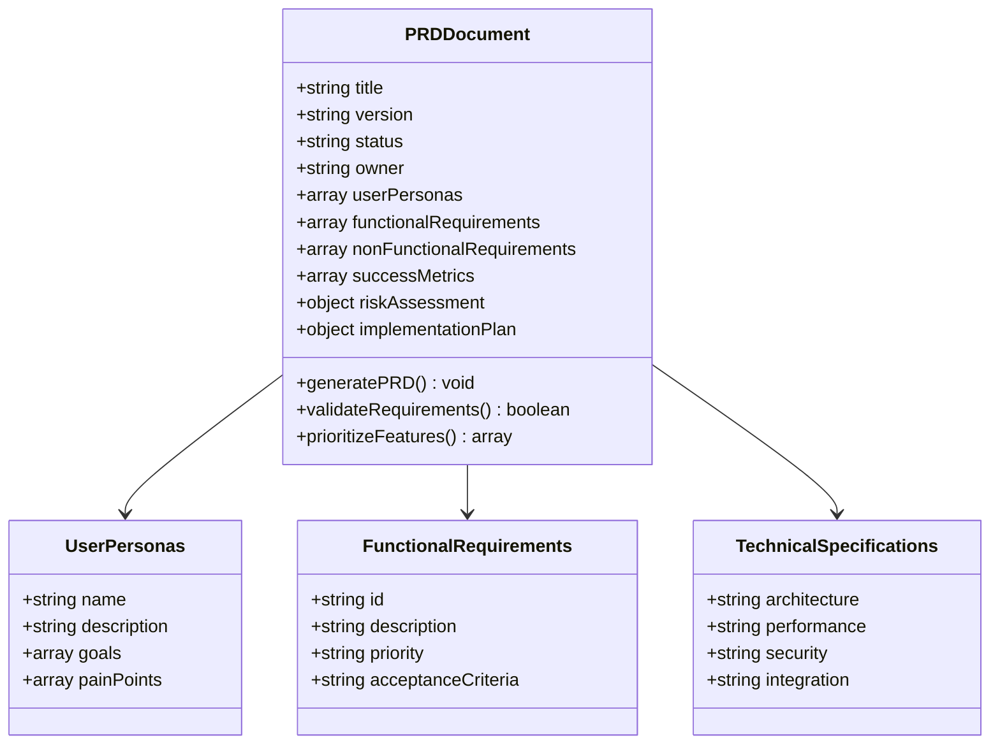

**图表来源**
- [prd-template.md](file://niopd/templates/prd-template.md#L1-L125)

### 第五层：FAQ/运营文档

运营文档支持产品的日常运营和用户服务：

**主要类型**：
- **常见问题解答**：用户使用中的常见问题和解决方案
- **运营指南**：产品推广、用户培训、客服支持的操作指南
- **监控指标**：产品性能、用户行为、业务指标的监控文档

**章节来源**
- [draft-mrd.md](file://niopd/commands/PD/draft-mrd.md#L17-L63)
- [draft-psd.md](file://niopd/commands/PD/draft-psd.md#L1-L32)
- [prd-template.md](file://niopd/templates/prd-template.md#L1-L125)

## 文件命名规范与版本控制

### 标准命名模式

NioPD采用统一的文件命名规范，确保文档的可识别性和版本管理：

```
[YYYYMMDD]-<initiative_slug>-<document_type>-v[version].md
```

**组成部分说明**：

1. **日期部分**（YYYYMMDD）：文档创建的确切日期
2. **项目标识符**（initiative_slug）：项目名称的简短化表示
3. **文档类型**：MRD、PSD、PRD、initiative等
4. **版本号**：v0、v1、v2等递增版本

### 版本控制策略

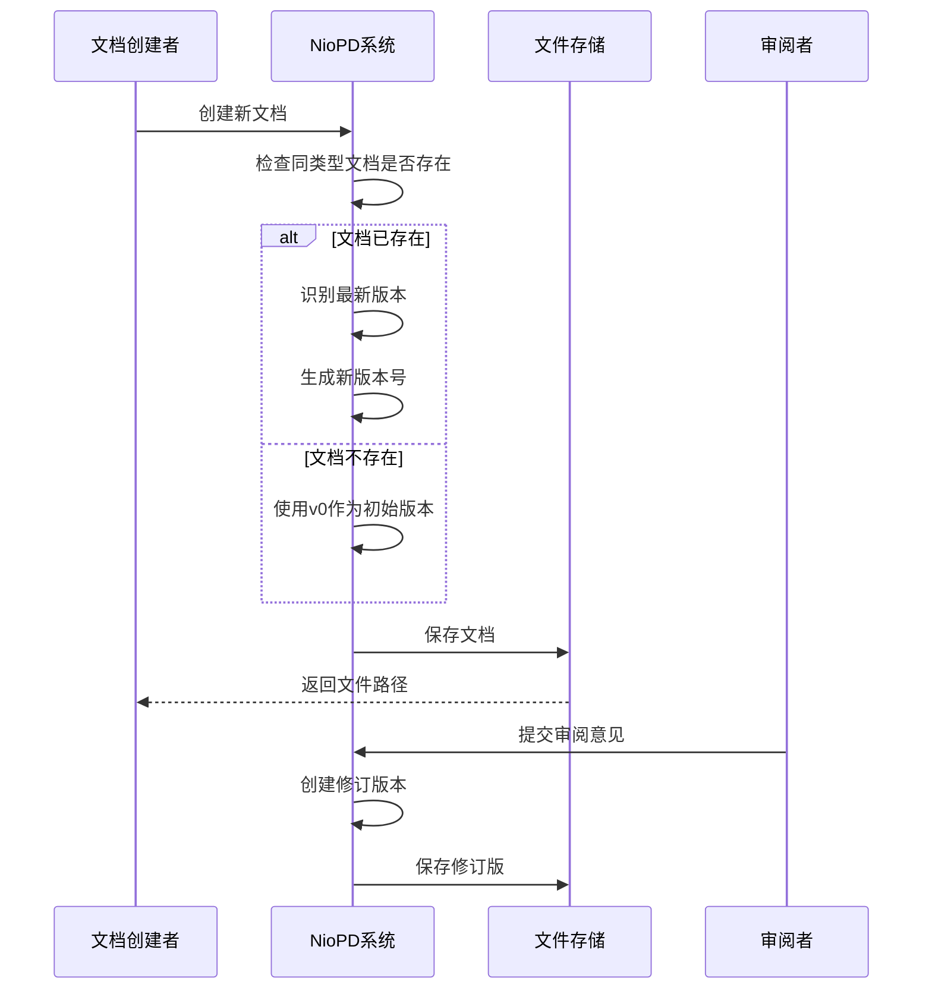

**图表来源**
- [init.md](file://niopd/commands/SYS/init.md#L153-L166)

### 自动化归档机制

NioPD系统具备自动化归档能力，在后台静默完成以下操作：

1. **目录检查**：确保目标目录存在
2. **讨论记录保存**：保存重要的决策讨论摘要
3. **分析报告存档**：自动保存研究和分析结果
4. **PRD草稿保存**：完成PRD创作后自动保存完整文档

**章节来源**
- [init.md](file://niopd/commands/SYS/init.md#L153-L166)

## 核心文档类型详解

### PRD（产品需求文档）

PRD是产品开发过程中最重要的执行层文档，详细定义了产品功能和技术要求：

#### 标准结构

PRD遵循标准化模板，包含以下核心章节：

| 章节 | 内容要点 | 目标受众 | 关键输出 |
|------|----------|----------|----------|
| 概述 | 功能简介和问题解决 | 产品经理、团队成员 | 快速理解功能价值 |
| 问题陈述 | 用户或业务痛点 | 产品团队、利益相关者 | 明确需求背景 |
| 用户画像 | 目标用户和使用场景 | 设计团队、产品经理 | 用户需求理解 |
| 功能需求 | 具体的功能列表 | 工程团队、测试团队 | 开发依据 |
| 非功能需求 | 性能、安全、可用性 | 技术团队 | 质量标准 |
| 成功指标 | 衡量成功的KPI | 产品团队、运营团队 | 效果评估 |
| 技术考虑 | 架构和约束 | 技术负责人 | 实现指导 |
| 实施计划 | 开发时间线和资源 | 项目经理、团队领导 | 执行计划 |
| 风险评估 | 潜在风险和应对 | 风险经理、产品经理 | 风险管理 |

#### 生成流程

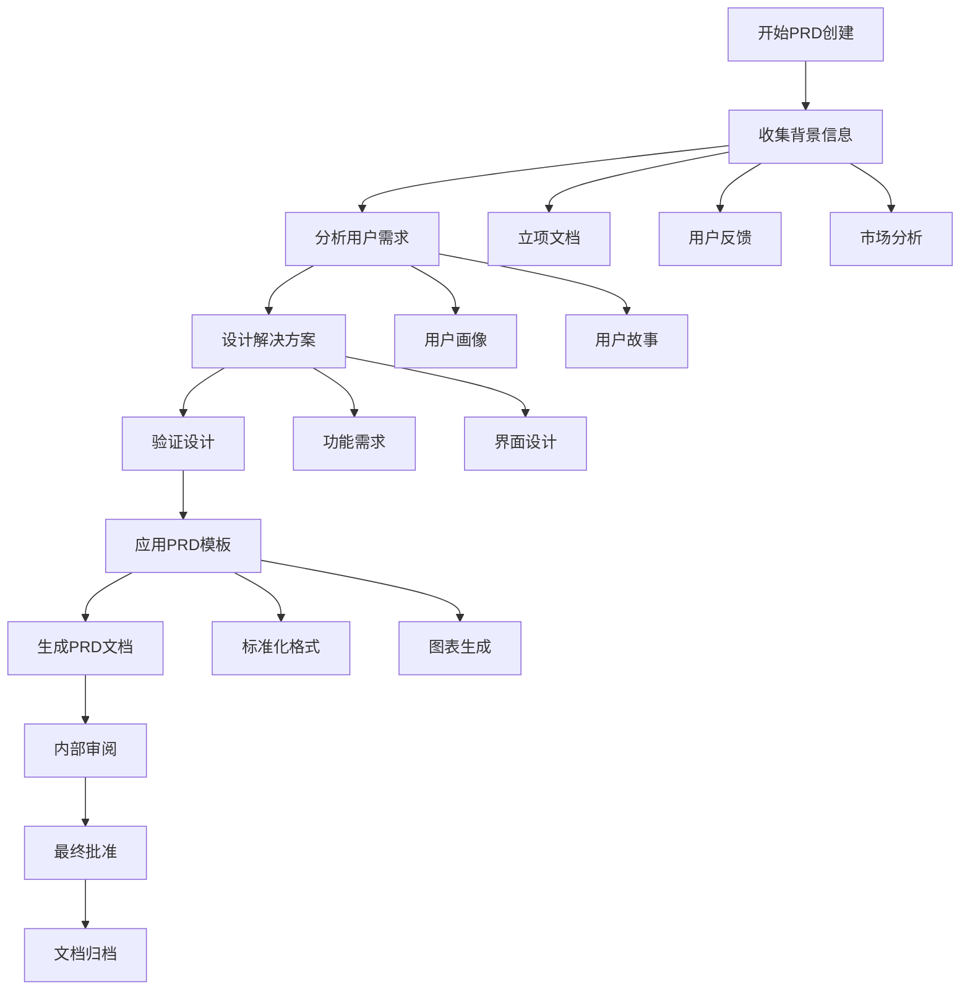

**图表来源**
- [draft-prd.md](file://niopd/commands/PD/draft-prd.md#L201-L228)

### MRD（市场需求文档）

MRD从市场视角定义产品需求，为产品决策提供市场依据：

#### 核心要素

**市场分析维度**：
- **市场规模**：总市场容量、服务市场、目标市场
- **市场趋势**：增长驱动因素、技术变革、消费者行为变化
- **市场细分**：用户群体划分、需求差异、购买动机
- **竞争格局**：主要竞争对手、市场份额、竞争策略

**用户洞察**：
- **用户画像**：人口统计、行为特征、心理特征
- **痛点分析**：当前解决方案的不足、未满足的需求
- **需求优先级**：不同需求的重要性和紧急程度

**商业假设**：
- **收入模型**：定价策略、盈利模式、收入预测
- **成本结构**：开发成本、运营成本、营销费用
- **关键假设**：市场接受度、技术可行性、法规影响

### PSD（产品策略文档）

PSD作为战略桥梁，连接市场分析和产品执行：

#### 策略制定流程

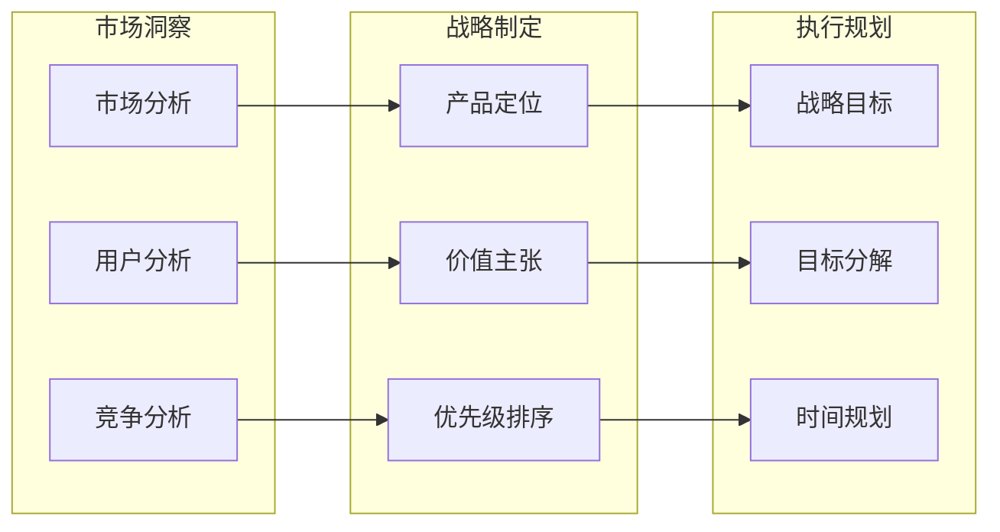

**图表来源**
- [draft-psd.md](file://niopd/commands/PD/draft-psd.md#L1-L32)

### 北极星指标文档

北极星指标文档定义了产品成功的核心度量标准：

#### 北极星指标框架

**指标选择标准**：

1. **捕获价值**：反映客户获得的核心价值
2. **可行动**：能够指导具体的产品和业务决策
3. **通用性**：适用于所有产品团队和职能部门
4. **预测性**：能够预测长期业务成果
5. **可测量性**：清晰定义、可靠数据、实时跟踪

#### 实施框架

北极星指标文档包含以下关键组件：

- **指标定义**：精确的计算方法和数据来源
- **支撑指标**：输入、输出和结果指标体系
- **实施路线图**：从当前状态到目标状态的行动计划
- **团队对齐**：跨职能团队的共识和责任分工
- **风险管理**：潜在风险和应对策略

**章节来源**
- [draft-prd.md](file://niopd/commands/PD/draft-prd.md#L1-L252)
- [north-star.md](file://niopd/commands/PO/north-star.md#L1-L306)

## 文档流转机制

### 从思考到决策的完整流程

NioPD的文档流转遵循严格的顺序和质量控制机制：

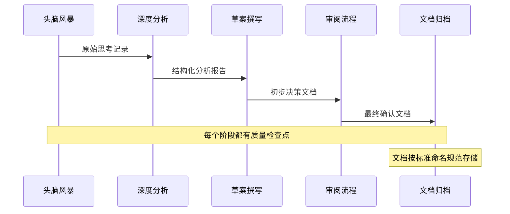

**图表来源**
- [README.md](file://README.md#L267-L300)

### 文档间的引用关系

docs目录中的文档之间存在明确的引用关系，形成完整的决策链条：

#### 立项到PRD的引用链

1. **Initiative → MRD**
   - 立项文档中的目标和范围为MRD提供战略依据
   - KPI设定为MRD的成功度量提供基准

2. **MRD → PSD**
   - 市场分析结果指导产品策略制定
   - 竞争分析为差异化策略提供依据

3. **PSD → PRD**
   - 战略目标分解为具体的功能需求
   - 技术路径和资源约束纳入PRD考虑

4. **PRD → FAQ**
   - PRD中的功能说明为FAQ提供内容基础
   - 用户常见问题基于PRD的功能设计

### 自动化文档生成

NioPD系统具备智能文档生成功能，能够根据已有信息自动生成相关文档：

#### 智能模板匹配

系统会根据文档类型和内容特征，自动匹配最适合的模板：

- **PRD生成**：基于MRD和PSD的内容自动生成PRD
- **FAQ创建**：基于PRD的功能说明生成常见问题
- **更新文档**：基于历史版本自动生成更新版本

#### 内容复用机制

为了提高效率和一致性，系统支持内容复用：

- **模板库**：标准化的文档模板
- **片段库**：常用段落和表述的代码片段
- **引用机制**：跨文档的智能引用和链接

**章节来源**
- [README.md](file://README.md#L267-L300)

## 跨团队协作模式

### 多角色协同工作流程

docs目录的设计充分考虑了多角色协作的需求，建立了清晰的协作机制：

#### 角色定义与职责

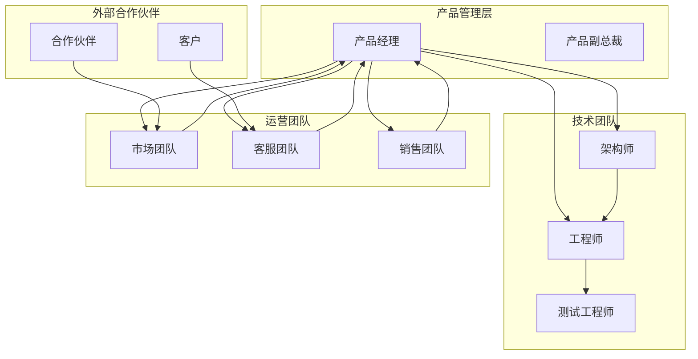

#### 协作流程设计

1. **同步机制**：定期的文档审查会议和状态更新
2. **异步协作**：基于评论和批注的在线协作
3. **版本控制**：确保所有团队成员看到最新的决策版本
4. **权限管理**：根据角色设置不同的编辑和查看权限

### 决策透明度保障

docs目录通过以下机制确保决策过程的透明度：

#### 决策记录机制

- **背景记录**：每个决策都记录其产生的背景和原因
- **讨论过程**：保留关键讨论的摘要和结论
- **替代方案**：记录被放弃的方案及其原因
- **最终决定**：明确标注最终的决策结果

#### 可追溯性设计

- **版本历史**：完整的版本变更记录
- **修改痕迹**：每次修改的时间、作者和原因
- **引用关系**：文档间的引用和依赖关系
- **审计轨迹**：完整的访问和修改日志

**章节来源**
- [init.md](file://niopd/commands/SYS/init.md#L100-L150)

## 文档审批流程建议

### 分层审批机制

基于docs目录的文档层次结构，建议建立分层审批流程：

#### 审批层级设计

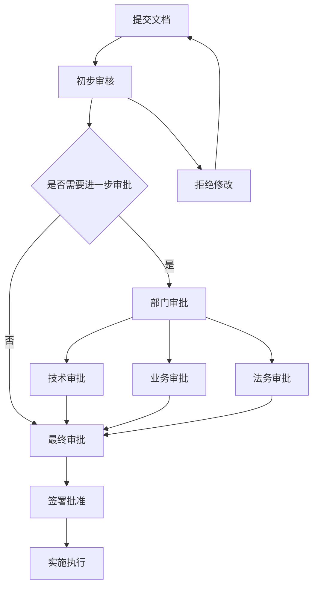

#### 审批标准

**Initiative文档**：
- **技术可行性**：技术团队确认实现可能性
- **业务价值**：业务团队评估投资回报
- **资源匹配**：资源团队确认资源可用性

**MRD文档**：
- **市场准确性**：市场团队验证数据准确性
- **竞争分析**：竞争情报团队确认分析深度
- **用户洞察**：用户体验团队验证用户研究质量

**PRD文档**：
- **需求完整性**：产品经理确认需求覆盖度
- **技术可行性**：技术负责人确认实现难度
- **测试可测性**：测试团队确认验收标准

### 审批工具集成

建议集成现代化的文档审批工具：

#### 在线协作平台

- **版本对比**：直观的版本差异展示
- **评论系统**：针对具体段落的评论功能
- **状态跟踪**：审批进度的实时跟踪
- **通知机制**：审批状态变更的及时通知

#### 自动化检查

- **格式验证**：确保文档符合标准格式
- **完整性检查**：验证必填字段的完整性
- **逻辑一致性**：检查文档内部逻辑的一致性
- **合规性审查**：验证是否符合公司政策和法规要求

**章节来源**
- [draft-prd.md](file://niopd/commands/PD/draft-prd.md#L230-L233)

## 与plans目录的联动机制

### 文档联动架构

docs目录与plans目录形成完整的决策到执行闭环：

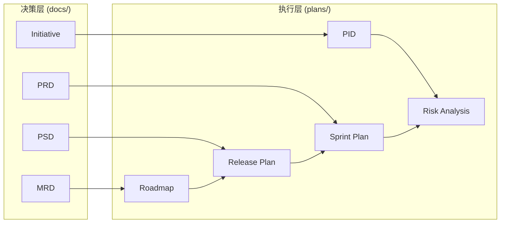

**图表来源**
- [README.md](file://README.md#L267-L300)

### 决策传递机制

#### 从战略到执行的映射

1. **战略目标分解**：MRD中的市场目标分解为具体的执行任务
2. **功能优先级**：PSD中的功能策略转化为PRD中的具体需求
3. **资源分配**：PRD中的技术要求指导资源计划
4. **时间安排**：PRD中的实施计划形成详细的执行计划

#### 关键接口设计

**MRD → Roadmap**：
- 市场机会 → 产品功能优先级
- 竞争压力 → 开发时间表
- 用户需求 → 功能特性列表

**PSD → Release Plan**：
- 产品定位 → 版本特性规划
- 技术路径 → 开发资源分配
- 风险评估 → 应急预案

**PRD → Sprint Plan**：
- 功能需求 → 开发任务拆分
- 技术约束 → 开发排期
- 质量标准 → 测试计划

### 协同工作机制

#### 定期同步会议

建议建立定期的跨层协调会议：

- **周会**：plans团队向docs团队同步执行进展
- **月会**：评估执行效果与预期目标的偏差
- **季度会**：重新审视战略方向和执行计划

#### 反馈循环机制

建立从执行层向决策层的反馈通道：

1. **执行问题反馈**：执行过程中遇到的问题和挑战
2. **市场反馈收集**：产品上市后的市场反应
3. **用户使用数据**：实际用户的使用情况和体验
4. **效果评估报告**：基于数据的绩效评估结果

**章节来源**
- [README.md](file://README.md#L267-L300)

## 可追溯性与变更追踪

### 完整的变更历史

docs目录通过标准化的命名规范和版本控制机制，确保每个决策都有完整的可追溯性：

#### 变更追踪机制

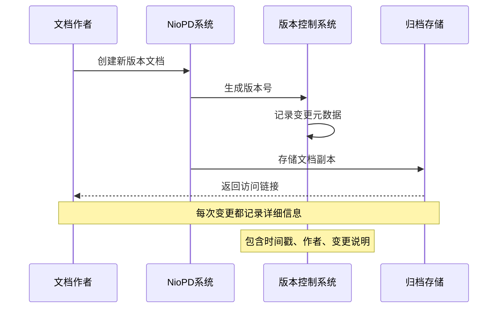

#### 变更元数据管理

每个文档版本都包含丰富的元数据：

| 元数据项 | 描述 | 示例值 |
|----------|------|--------|
| 创建时间 | 文档首次创建的时间 | 2024-01-15 10:30:00 |
| 最后修改 | 最近一次修改的时间 | 2024-01-20 14:45:00 |
| 修改作者 | 负责修改的人员 | 张三 |
| 变更说明 | 修改的具体内容 | 更新了用户画像部分 |
| 版本号 | 当前版本编号 | v2.1 |
| 上一版本 | 前一版本的引用 | [20240115-product-mrd-v2.md] |
| 审核状态 | 当前的审核状态 | 已批准 |

### 决策溯源机制

#### 背景信息追踪

每个文档都与其产生的背景信息保持关联：

- **立项文档**：记录项目的初始目标和假设
- **市场分析**：关联相关的市场研究报告
- **用户研究**：链接相关的用户访谈和调研数据
- **竞争分析**：引用相关的竞品分析报告

#### 影响链追踪

系统能够追踪文档变更的影响范围：

1. **直接影响**：直接受到变更影响的文档
2. **间接影响**：通过中间文档间接影响的文档
3. **潜在影响**：可能受到影响但尚未确认的文档

### 审计与合规支持

#### 合规性检查

docs目录的设计考虑了企业合规性要求：

- **访问控制**：基于角色的文档访问权限管理
- **修改审计**：完整的修改操作日志
- **版本备份**：定期的版本备份和恢复机制
- **合规报告**：自动生成的合规性审计报告

#### 知识产权保护

- **版权声明**：文档的版权归属标识
- **保密级别**：文档的保密等级标记
- **使用限制**：文档使用的具体限制条款
- **分发控制**：文档分发的权限管理

**章节来源**
- [init.md](file://niopd/commands/SYS/init.md#L153-L166)

## 最佳实践与建议

### 文档质量保证

#### 编写标准

1. **结构化写作**：严格遵循既定的文档模板和结构
2. **清晰表达**：使用简洁明了的语言，避免歧义
3. **数据支持**：所有主张都有相应的数据或研究支持
4. **可验证性**：关键声明都可以通过数据或事实验证

#### 内容质量控制

- **同行评审**：重要文档必须经过至少一位同事的评审
- **专家咨询**：复杂技术文档应咨询相关领域的专家
- **用户验证**：用户相关的内容应经过目标用户的验证
- **业务验证**：业务相关内容应得到业务团队的认可

### 团队协作优化

#### 知识共享机制

1. **定期培训**：组织文档编写的技能培训
2. **最佳实践分享**：定期分享优秀的文档案例
3. **经验总结**：项目结束后进行文档经验总结
4. **工具使用培训**：确保团队熟练使用文档工具

#### 知识传承策略

- **文档生命周期管理**：明确文档的创建、维护、更新和归档流程
- **知识地图构建**：建立文档间的关联关系图谱
- **隐性知识显性化**：将团队成员的经验转化为可共享的知识
- **持续改进机制**：基于使用反馈不断优化文档体系

### 技术工具支持

#### 自动化工具推荐

1. **文档管理系统**：支持版本控制和协作的文档平台
2. **模板引擎**：自动生成标准化文档模板
3. **内容管理系统**：支持内容的分类、检索和管理
4. **协作工具**：支持多人同时编辑和评论的工具

#### 集成建议

- **CI/CD集成**：将文档生成和发布集成到CI/CD流水线
- **数据源集成**：与市场研究、用户调研等数据源集成
- **项目管理集成**：与项目管理工具的无缝对接
- **知识库集成**：与企业知识库的统一管理

### 持续改进建议

#### 定期评估机制

建议建立定期的文档体系评估机制：

1. **使用率分析**：分析各类文档的使用频率和效果
2. **满意度调查**：收集用户对文档质量和可用性的反馈
3. **效率评估**：评估文档工作流的效率和瓶颈
4. **价值评估**：评估文档对业务的实际贡献

#### 优化方向

- **简化流程**：减少不必要的审批环节和文档数量
- **增强协作**：改善跨团队的协作体验
- **提升质量**：建立更严格的质量控制标准
- **扩大覆盖**：确保所有重要决策都有相应的文档记录

**章节来源**
- [init.md](file://niopd/commands/SYS/init.md#L100-L150)
- [draft-prd.md](file://niopd/commands/PD/draft-prd.md#L230-L233)

## 总结

docs目录作为NioPD系统的核心决策文档层，体现了现代产品管理的最佳实践。它不仅是一个简单的文件存储系统，更是一个完整的决策管理体系，具有以下核心价值：

### 架构优势

1. **层次化设计**：从战略到执行的完整文档层次，确保决策的连贯性和一致性
2. **标准化流程**：统一的命名规范和版本控制机制，确保文档的可追溯性
3. **自动化支持**：智能的文档生成和归档机制，提高工作效率
4. **跨团队协作**：清晰的角色分工和协作机制，促进团队协同

### 实践价值

1. **决策透明**：完整的决策记录和可追溯性，提高决策质量
2. **知识传承**：系统化的知识管理，确保组织经验的有效传承
3. **执行保障**：从决策到执行的完整闭环，确保战略落地
4. **合规支持**：完善的审计和合规机制，满足企业治理要求

### 发展方向

随着产品管理实践的不断发展，docs目录体系也应持续演进：

- **智能化增强**：利用AI技术提升文档生成和分析能力
- **协作体验优化**：改进多人协作和实时编辑体验
- **集成度提升**：与更多工具和系统的深度集成
- **个性化定制**：根据不同团队和项目的特点进行定制化调整

通过持续优化和完善docs目录体系，企业可以建立起更加高效、透明和可持续的产品决策管理体系，为产品的成功奠定坚实的基础。