# plans目录

<cite>
**本文档中引用的文件**
- [init.md](file://niopd/commands/SYS/init.md)
- [roadmap.md](file://niopd/commands/PM/roadmap.md)
- [release.md](file://niopd/commands/PM/release.md)
- [resources.md](file://niopd/commands/PM/resources.md)
- [dependencies.md](file://niopd/commands/PM/dependencies.md)
- [kpis.md](file://niopd/commands/PM/kpis.md)
- [agile-planning.md](file://niopd/commands/PM/agile-planning.md)
- [risk-analysis.md](file://niopd/commands/PM/risk-analysis.md)
- [draft-pid.md](file://niopd/commands/PM/draft-pid.md)
- [feature-metrics.md](file://niopd/commands/PM/feature-metrics.md)
- [daci-framework.md](file://niopd/commands/PM/daci-framework.md)
</cite>

## 目录
1. [简介](#简介)
2. [目录结构与功能定位](#目录结构与功能定位)
3. [初始化流程与自动建立机制](#初始化流程与自动建立机制)
4. [核心执行计划文件](#核心执行计划文件)
5. [动态更新机制](#动态更新机制)
6. [与敏捷开发周期的集成](#与敏捷开发周期的集成)
7. [KPIs与里程碑追踪](#kpis与里程碑追踪)
8. [资源分配与依赖管理](#资源分配与依赖管理)
9. [透明化项目管理最佳实践](#透明化项目管理最佳实践)
10. [闭环反馈系统中的作用](#闭环反馈系统中的作用)
11. [总结](#总结)

## 简介

plans目录是NioPD（Nio产品总监）系统中专门用于存放项目管理执行计划与进度跟踪文件的核心目录。作为连接战略决策（docs目录）与实际交付的关键枢纽，plans目录承载着项目从概念到落地的完整执行蓝图，是确保项目成功交付的重要基础设施。

该目录遵循严格的命名规范和版本控制机制，确保所有执行计划文件都具有可追溯性和一致性。通过自动化的工作流程和标准化的模板，plans目录为跨职能团队提供了统一的项目管理平台，实现了透明化的项目治理和高效的协作机制。

## 目录结构与功能定位

### 核心架构设计

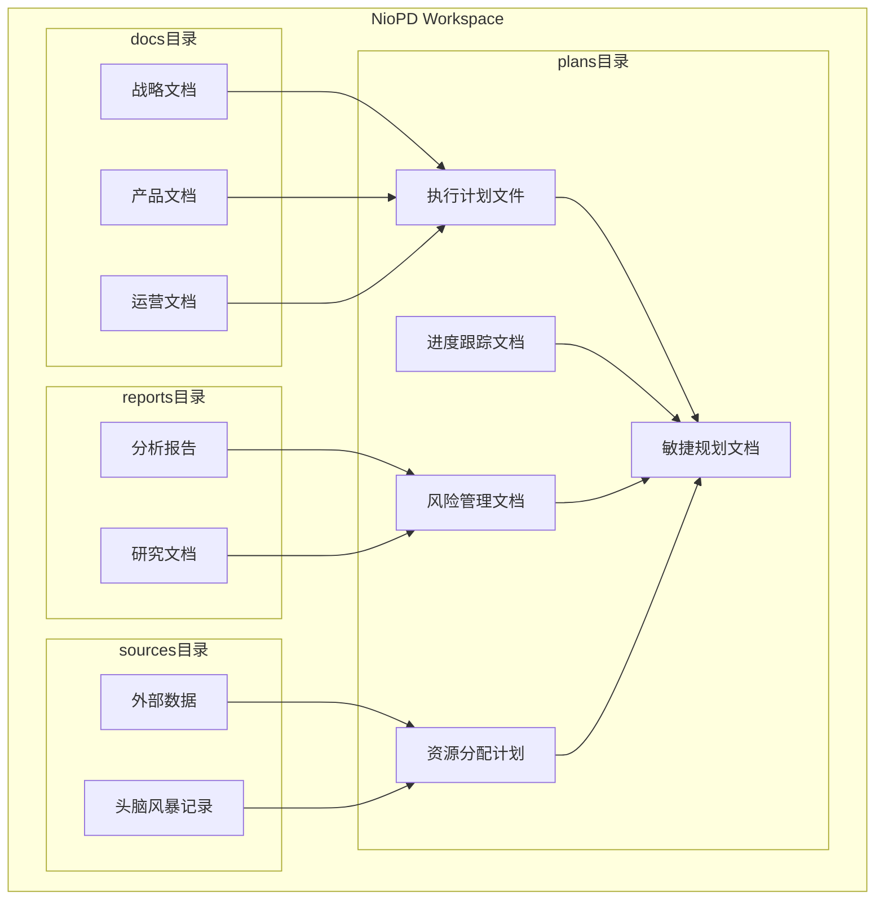

**图表来源**
- [init.md](file://niopd/commands/SYS/init.md#L30-L40)

### 功能定位矩阵

| 文件类型 | 主要用途 | 更新频率 | 关键特性 |
|---------|---------|---------|---------|
| 产品路线图 | 战略规划与方向指引 | 季度/年度 | 可视化甘特图、主题分组 |
| 发布计划 | 产品上线与版本管理 | 项目周期 | 时间节点、功能清单 |
| 资源计划 | 人力与预算分配 | 项目启动/变更 | 角色定义、容量分析 |
| 依赖映射 | 项目关系与风险识别 | 持续更新 | 依赖矩阵、风险评估 |
| KPI报告 | 绩效监控与进度跟踪 | 周期性 | 数值指标、趋势分析 |
| 敏捷计划 | 迭代开发与团队协作 | Sprint周期 | 任务分解、进度可视化 |

**章节来源**
- [roadmap.md](file://niopd/commands/PM/roadmap.md#L1-L50)
- [release.md](file://niopd/commands/PM/release.md#L1-L50)
- [resources.md](file://niopd/commands/PM/resources.md#L1-L50)

## 初始化流程与自动建立机制

### 自动化初始化过程

根据init.md中的规定，plans目录会在系统初始化时自动建立，作为NioPD工作空间的重要组成部分。初始化流程严格遵循预定义的目录结构规范，确保所有必要的子目录都得到正确配置。

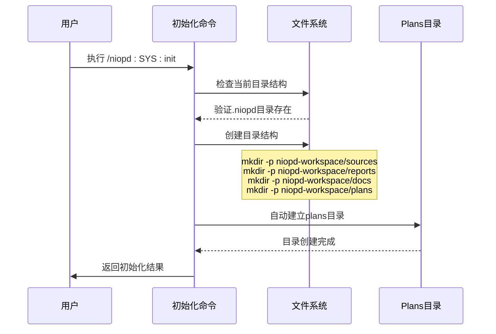

**图表来源**
- [init.md](file://niopd/commands/SYS/init.md#L30-L40)

### 目录验证与创建

系统在每次执行PM相关命令前都会验证plans目录的存在状态，如果目录不存在则会自动创建，确保后续操作能够正常进行。

**章节来源**
- [init.md](file://niopd/commands/SYS/init.md#L30-L40)
- [agile-planning.md](file://niopd/commands/PM/agile-planning.md#L129-L130)

## 核心执行计划文件

### 产品路线图（Roadmap）

产品路线图是plans目录中最核心的战略执行文件之一，它将抽象的产品愿景转化为具体的执行时间表。

#### 核心功能特性

- **战略主题映射**：将项目按战略主题进行分组，确保资源的合理分配
- **时间轴可视化**：使用Mermaid语法生成直观的甘特图
- **依赖关系管理**：识别和可视化项目间的相互依赖
- **资源约束考虑**：在规划中纳入团队能力和可用性限制

#### 文件命名规范

```
[YYYYMMDD]-product-roadmap-v[version].md
```

#### 内容结构

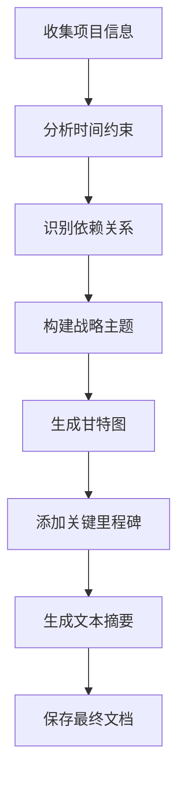

**图表来源**
- [roadmap.md](file://niopd/commands/PM/roadmap.md#L50-L100)

**章节来源**
- [roadmap.md](file://niopd/commands/PM/roadmap.md#L1-L166)

### 发布计划（Release Plan）

发布计划详细规划了产品的版本发布流程，涵盖从开发到上线的全过程协调要求。

#### 关键要素

- **发布范围定义**：明确包含的功能、修复和改进
- **利益相关者识别**：确定各团队的角色和责任
- **资源评估**：分析所需的人力、技术和基础设施资源
- **风险评估**：识别潜在的技术和业务风险
- **质量保证计划**：制定测试策略和验收标准

#### 发布策略矩阵

| 策略类型 | 适用场景 | 风险水平 | 实施复杂度 |
|---------|---------|---------|-----------|
| 大爆炸发布 | 小型项目、快速迭代 | 高 | 低 |
| 分阶段发布 | 中大型项目、高风险 | 中 | 中 |
| 蓝绿部署 | 生产环境稳定性要求高 | 低 | 高 |
| 灰度发布 | 用户基数大、风险敏感 | 低 | 中 |
| 功能开关 | 渐进式功能启用 | 低 | 中 |

**章节来源**
- [release.md](file://niopd/commands/PM/release.md#L1-L425)

### 敏捷规划（Agile Planning）

敏捷规划为团队提供了结构化的迭代开发框架，支持Scrum和Kanban等多种敏捷方法论。

#### 敏捷生命周期

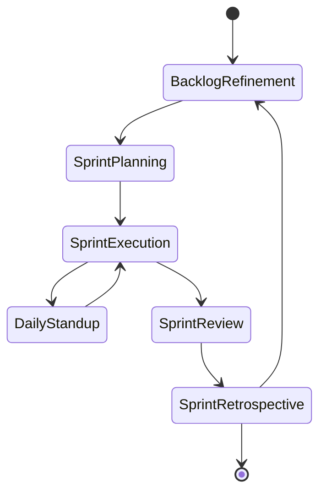

**图表来源**
- [agile-planning.md](file://niopd/commands/PM/agile-planning.md#L50-L100)

#### 核心活动

- **Sprint规划**：确定迭代目标和可交付成果
- **每日站会**：同步进展、识别障碍
- **Sprint评审**：演示成果、收集反馈
- **Sprint回顾**：总结经验、持续改进

**章节来源**
- [agile-planning.md](file://niopd/commands/PM/agile-planning.md#L1-L515)

## 动态更新机制

### 版本控制与命名规范

plans目录中的所有文件都遵循严格的命名规范，确保版本的可追溯性和一致性：

```
[YYYYMMDD]-[slug]-[document-type]-v[version].md
```

#### 命名规则详解

| 组件 | 格式 | 示例 | 说明 |
|------|------|------|------|
| 日期 | YYYYMMDD | 20241201 | 文件创建或最后修改日期 |
| 滑块 | lowercase-hyphenated | dark-mode-feature | 项目或功能名称的简化形式 |
| 文档类型 | kebab-case | roadmap, release-plan, kpi-report | 具体的文档类别 |
| 版本号 | v[number] | v0, v1, v2 | 版本递增标识符 |

### 自动化更新流程

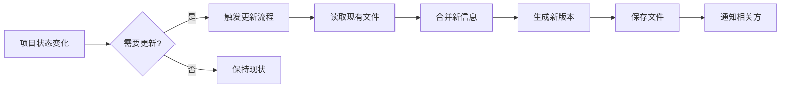

**图表来源**
- [draft-pid.md](file://niopd/commands/PM/draft-pid.md#L210-L220)

### 冲突解决机制

当多个团队成员同时更新同一份计划文件时，系统采用以下机制：

1. **版本比较**：自动检测文件差异
2. **冲突标记**：突出显示不一致的内容
3. **合并建议**：提供智能合并选项
4. **人工审核**：关键变更需要手动确认

**章节来源**
- [draft-pid.md](file://niopd/commands/PM/draft-pid.md#L210-L240)

## 与敏捷开发周期的集成

### 敏捷生命周期映射

plans目录中的各种计划文件与敏捷开发周期紧密集成，形成完整的项目管理闭环：

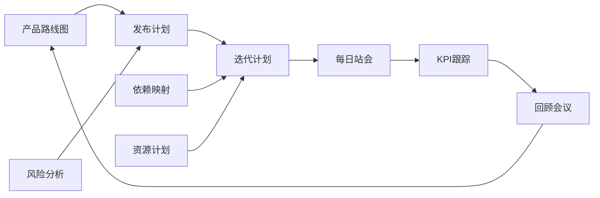

**图表来源**
- [agile-planning.md](file://niopd/commands/PM/agile-planning.md#L400-L450)

### 迭代规划流程

每个Sprint的规划都基于plans目录中的现有文档进行：

1. **路线图对齐**：确保Sprint目标与长期战略一致
2. **发布计划参考**：避免与即将发布的功能冲突
3. **资源计划验证**：确认团队能力匹配工作量
4. **依赖关系检查**：识别可能的阻塞点

### 持续改进循环

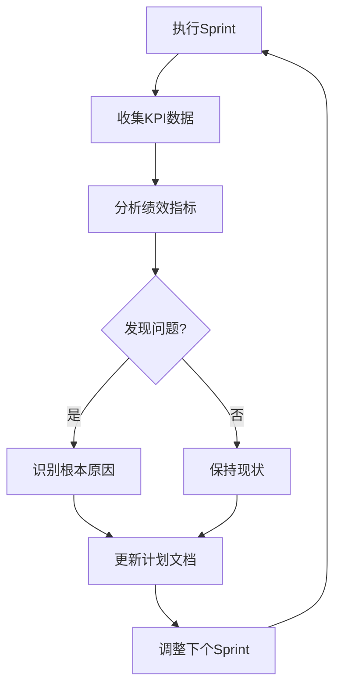

**图表来源**
- [kpis.md](file://niopd/commands/PM/kpis.md#L100-L150)

**章节来源**
- [agile-planning.md](file://niopd/commands/PM/agile-planning.md#L400-L515)

## KPIs与里程碑追踪

### KPI体系设计

KPI（关键绩效指标）是plans目录中最重要的监控工具，用于量化项目进展和业务成果。

#### KPI分类体系

| 类别 | 指标类型 | 示例 | 监控频率 |
|------|---------|------|---------|
| 进度指标 | Leading | Sprint完成率、故事点速度 | 每日/每周 |
| 质量指标 | Lagging | 缺陷密度、测试覆盖率 | 每次发布 |
| 效率指标 | Balanced | 循环时间、交付频率 | 每月 |
| 业务指标 | Strategic | 用户增长率、收入贡献 | 每季度 |

#### KPI状态评估

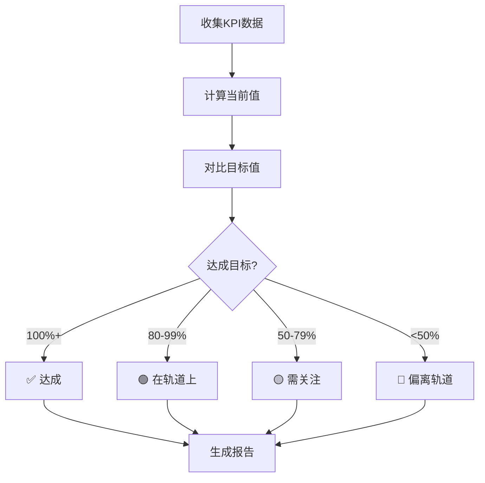

**图表来源**
- [kpis.md](file://niopd/commands/PM/kpis.md#L150-L200)

### 里程碑管理系统

里程碑是项目执行过程中的重要时间节点，plans目录通过专门的文档来跟踪这些关键事件：

#### 里程碑类型

- **技术里程碑**：核心功能开发完成
- **业务里程碑**：市场推广启动
- **管理里程碑**：阶段审查和批准
- **交付里程碑**：客户验收和上线

#### 里程碑追踪模板

每个里程碑都包含以下关键信息：

| 字段 | 描述 | 示例 |
|------|------|------|
| 名称 | 里程碑的具体名称 | Alpha版本发布 |
| 目标日期 | 计划完成日期 | 2024-12-15 |
| 当前状态 | 实际完成状态 | 已完成/进行中/延迟 |
| 关键交付物 | 必须完成的成果 | 功能文档、测试报告 |
| 风险因素 | 可能影响进度的因素 | 技术难题、资源不足 |

**章节来源**
- [kpis.md](file://niopd/commands/PM/kpis.md#L1-L293)

## 资源分配与依赖管理

### 资源规划框架

资源计划文档详细描述了项目所需的各种资源及其分配策略，确保项目团队能够高效运作。

#### 资源类型矩阵

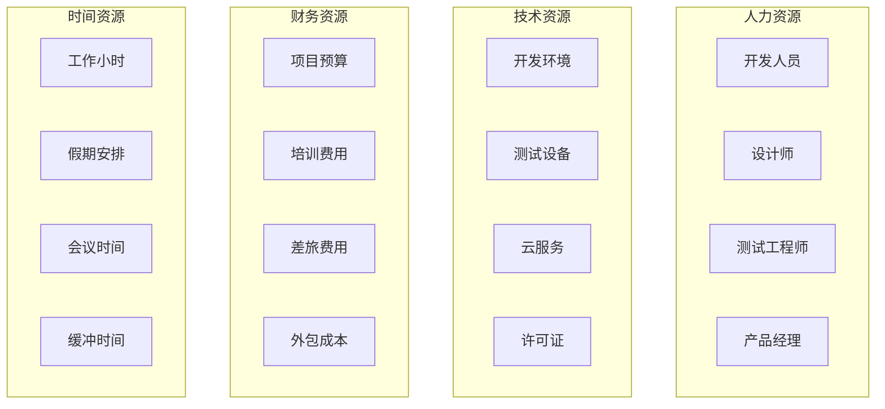

**图表来源**
- [resources.md](file://niopd/commands/PM/resources.md#L50-L100)

#### 资源分配策略

1. **资源平衡**：避免过度分配，确保团队可持续工作
2. **技能匹配**：根据任务要求分配合适的人才
3. **容量规划**：考虑团队成员的可用性和其他承诺
4. **弹性设计**：预留缓冲资源应对意外情况

### 依赖关系管理

依赖映射文档帮助项目团队理解和管理项目内外的各种依赖关系。

#### 依赖类型分类

| 依赖类型 | 描述 | 风险等级 | 管理策略 |
|---------|------|---------|---------|
| 技术依赖 | 系统组件间的关系 | 高 | 内部协调 |
| 组织依赖 | 团队间的协作关系 | 中 | 明确职责 |
| 外部依赖 | 第三方服务或供应商 | 高 | 合同管理 |
| 时间依赖 | 任务的时间顺序关系 | 中 | 关键路径管理 |

#### 依赖风险评估

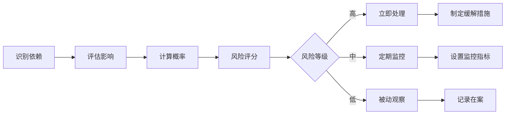

**图表来源**
- [dependencies.md](file://niopd/commands/PM/dependencies.md#L100-L150)

**章节来源**
- [resources.md](file://niopd/commands/PM/resources.md#L1-L284)
- [dependencies.md](file://niopd/commands/PM/dependencies.md#L1-L239)

## 透明化项目管理最佳实践

### 跨职能团队协同工作

plans目录通过标准化的文档格式和清晰的角色定义，促进了不同职能团队之间的有效协作。

#### DACI框架应用

DACI（Driver, Approver, Contributor, Informed）框架是plans目录中常用的决策管理方法：

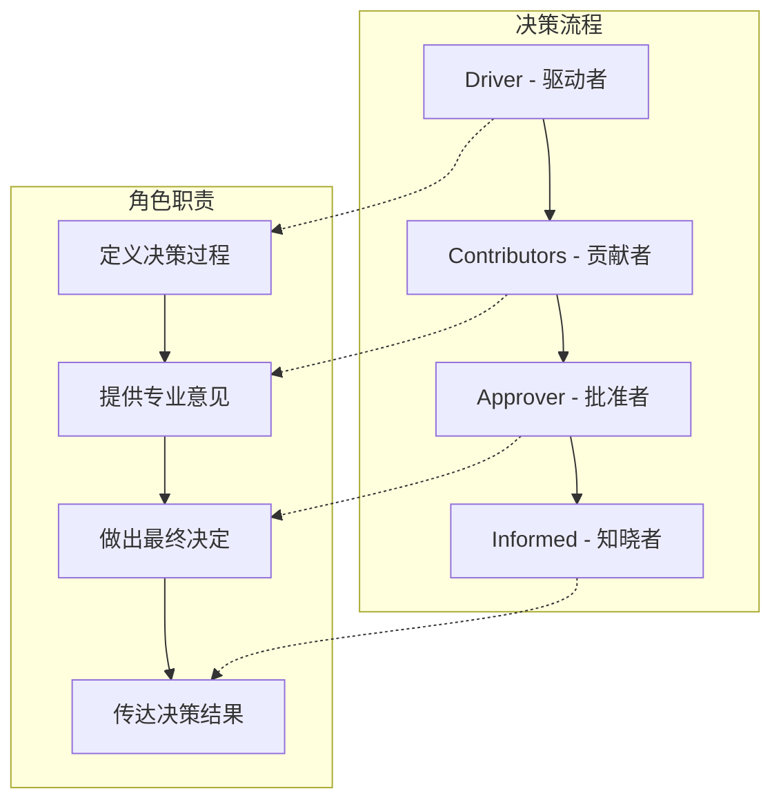

**图表来源**
- [daci-framework.md](file://niopd/commands/PM/daci-framework.md#L100-L150)

#### 协作机制设计

1. **透明沟通**：所有计划文件都保持公开访问
2. **定期同步**：建立固定的团队会议机制
3. **问题升级**：明确的问题解决和升级流程
4. **知识共享**：鼓励团队成员分享经验和最佳实践

### 可视化管理工具

plans目录中的各种文档都支持多种可视化表达方式：

- **甘特图**：展示项目时间线和里程碑
- **燃尽图**：跟踪Sprint进度
- **依赖矩阵**：可视化项目关系
- **KPI仪表板**：实时监控项目健康度

**章节来源**
- [daci-framework.md](file://niopd/commands/PM/daci-framework.md#L1-L302)

## 闭环反馈系统中的作用

### 风险管理闭环

风险分析文档构成了plans目录中的重要风险管理闭环，确保项目风险得到持续监控和有效应对。

#### 风险管理流程

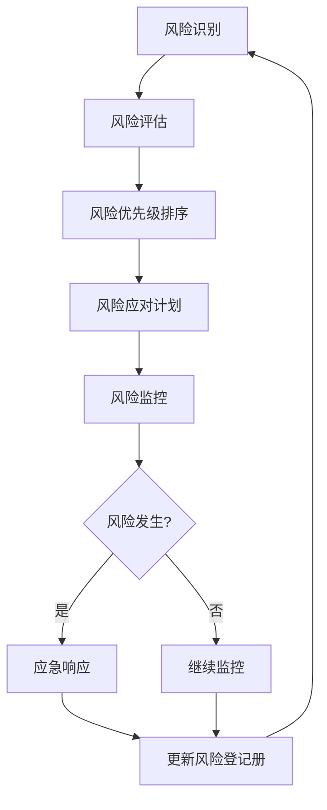

**图表来源**
- [risk-analysis.md](file://niopd/commands/PM/risk-analysis.md#L150-L200)

#### 风险应对策略矩阵

| 风险类型 | 应对策略 | 具体措施 | 负责人 |
|---------|---------|---------|-------|
| 技术风险 | 减轻 | 技术验证、原型开发 | 技术负责人 |
| 资源风险 | 转移 | 外包协议、备用资源 | 项目经理 |
| 时间风险 | 避免 | 关键路径优化 | 项目总监 |
| 质量风险 | 接受 | 加强测试覆盖 | QA经理 |

### 性能优化闭环

KPI跟踪系统形成了项目性能的持续优化闭环：

1. **指标设定**：基于SMART原则定义可衡量的目标
2. **数据收集**：自动化和手动相结合的数据采集
3. **趋势分析**：识别性能模式和异常情况
4. **根因分析**：深入探究问题的根本原因
5. **改进措施**：制定针对性的优化方案
6. **效果验证**：评估改进措施的实际效果

### 知识积累与传承

plans目录不仅是项目执行的工具，更是组织知识的重要载体：

- **经验总结**：记录项目中的成功经验和失败教训
- **最佳实践**：积累经过验证的方法和技巧
- **模板库**：提供标准化的文档模板和工作流程
- **培训材料**：为新团队成员提供学习资源

**章节来源**
- [risk-analysis.md](file://niopd/commands/PM/risk-analysis.md#L1-L237)

## 总结

plans目录作为NioPD系统中的执行计划层，体现了现代项目管理的最佳实践和技术创新。它不仅是一个简单的文件存储位置，更是一个完整的项目管理生态系统，连接着战略规划、团队执行和业务成果。

### 核心价值

1. **战略执行桥梁**：将高层战略转化为具体可执行的计划
2. **团队协作平台**：促进跨职能团队的有效沟通和协作
3. **透明治理工具**：确保项目状态和决策过程的完全透明
4. **持续改进引擎**：通过数据驱动的反馈循环不断优化项目管理实践

### 技术特色

- **自动化程度高**：从初始化到日常维护都高度自动化
- **标准化程度强**：统一的命名规范和文档结构
- **集成度良好**：与其他NioPD目录无缝集成
- **扩展性强**：支持自定义和个性化配置

### 未来发展方向

随着AI技术的发展和项目管理实践的演进，plans目录将继续演进，可能的发展方向包括：

- **智能化预测**：利用机器学习算法预测项目风险和进度
- **实时协作**：支持多用户实时编辑和评论功能
- **移动端支持**：提供移动设备上的项目管理体验
- **集成第三方工具**：与Jira、Confluence等工具深度集成

plans目录的设计理念和实现方式为现代项目管理提供了宝贵的参考，展示了如何通过技术手段提升项目管理的效率和效果。它不仅是一个工具，更是一种思维方式的转变，推动项目管理向更加科学、透明和高效的方向发展。