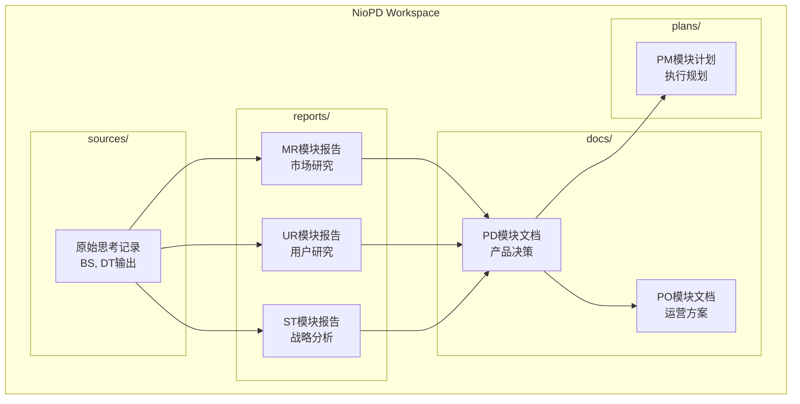
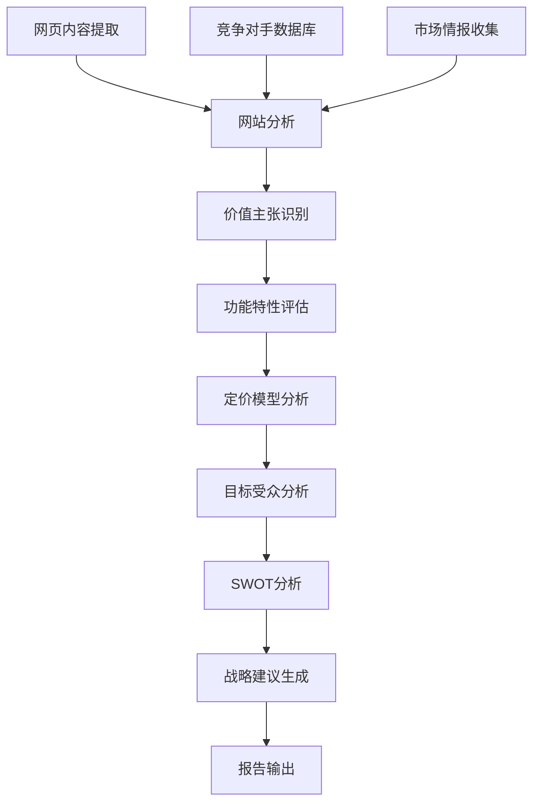
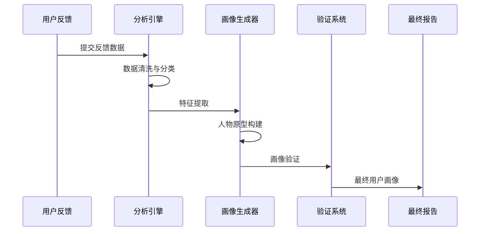
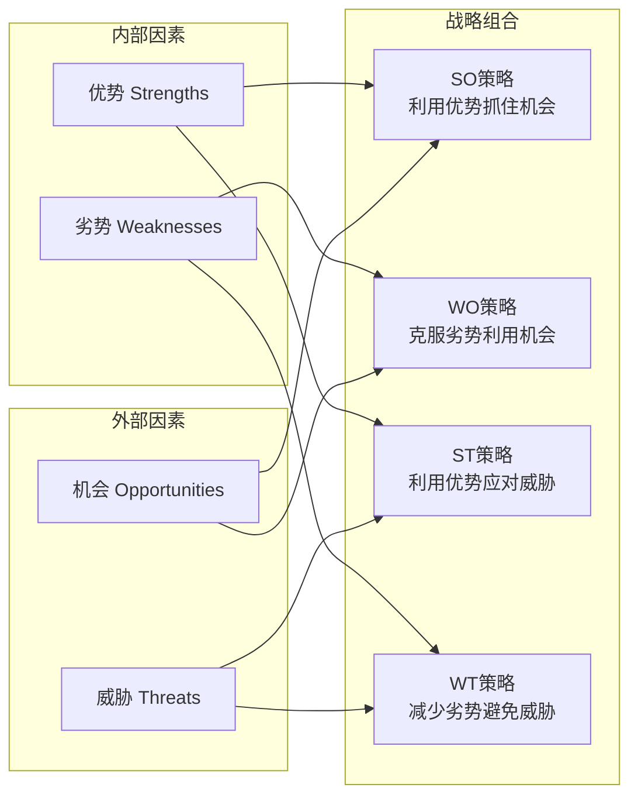
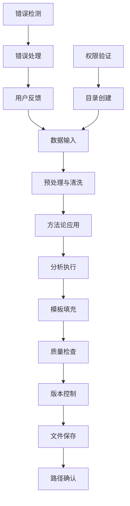
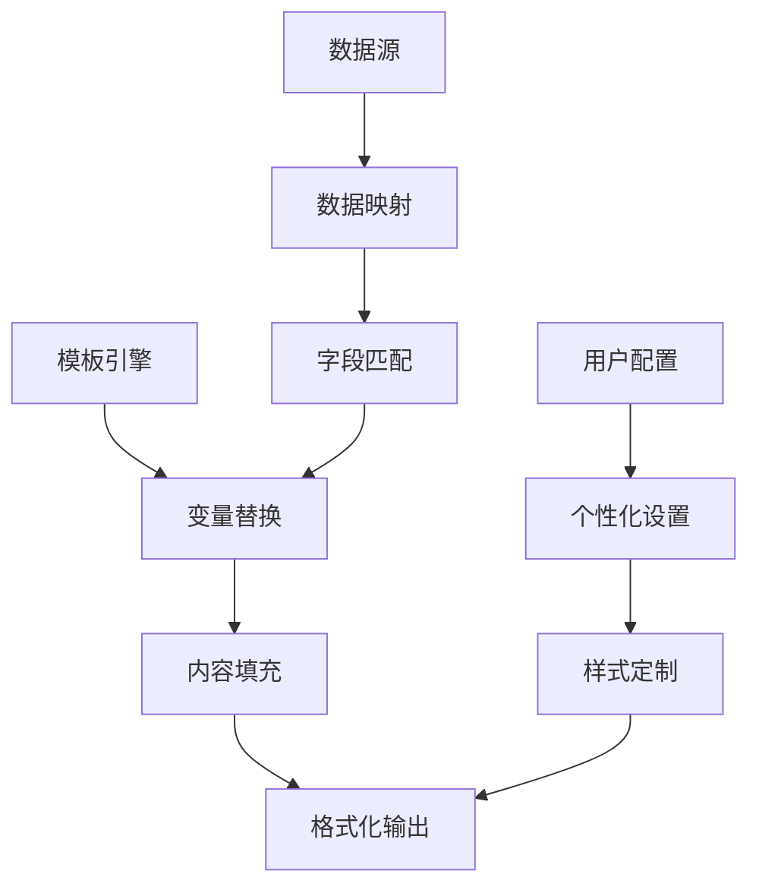
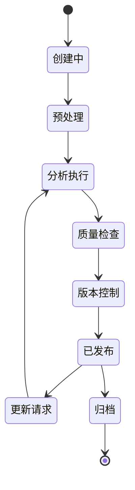
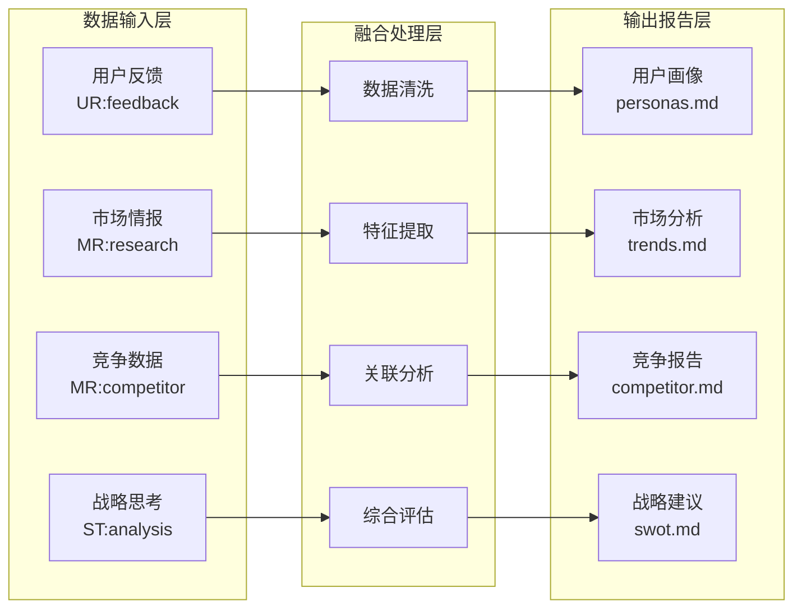

# reports目录

<cite>
**本文档中引用的文件**
- [init.md](file://niopd/commands/SYS/init.md)
- [market-research-template.md](file://niopd/templates/market-research-template.md)
- [competitor.md](file://niopd/commands/MR/competitor.md)
- [personas.md](file://niopd/commands/UR/personas.md)
- [swot.md](file://niopd/commands/ST/swot.md)
- [persona-template.md](file://niopd/templates/persona-template.md)
- [competitor-analysis-template.md](file://niopd/templates/competitor-analysis-template.md)
- [README.md](file://README.md)
</cite>

## 目录

1. [简介](#简介)
2. [目录结构与设计理念](#目录结构与设计理念)
3. [核心分析模块](#核心分析模块)
4. [报告生成流程](#报告生成流程)
5. [标准模板系统](#标准模板系统)
6. [生命周期管理](#生命周期管理)
7. [跨模块协作机制](#跨模块协作机制)
8. [质量控制与评估](#质量控制与评估)
9. [常见问题解答](#常见问题解答)
10. [最佳实践指南](#最佳实践指南)

## 简介

reports目录是NioPD系统中的数据分析报告层，专门负责存储由市场研究（MR）、用户研究（UR）和战略分析（ST）模块生成的结构化分析报告。作为连接原始输入（sources）与最终决策（docs）之间的重要桥梁，reports目录承载着系统化、方法论驱动的分析成果，为产品决策提供坚实的证据基础。

该目录采用统一的命名规范和版本控制机制，确保报告的可追溯性和持续演进。通过标准化的模板系统和严格的生成流程，reports目录保证了分析报告的一致性、专业性和实用性。

## 目录结构与设计理念

### 核心架构



**图表来源**
- [init.md](file://niopd/commands/SYS/init.md#L69-L80)
- [README.md](file://README.md#L180-L240)

### 设计原则

reports目录遵循以下核心设计原则：

1. **方法论驱动**：所有报告都基于成熟的分析框架和方法论
2. **结构化输出**：采用标准化模板确保报告的一致性
3. **可追溯性**：通过时间戳和版本号实现完整的变更追踪
4. **跨模块集成**：支持多源数据融合和综合分析
5. **决策支撑**：直接服务于产品战略制定和业务决策

**章节来源**
- [init.md](file://niopd/commands/SYS/init.md#L69-L80)

## 核心分析模块

### 市场研究（MR）模块

MR模块专注于外部市场环境分析，生成涵盖竞争格局、市场趋势、用户行为等维度的深度洞察报告。

#### 主要报告类型

| 报告名称 | 文件路径 | 分析维度 | 输出格式 |
|----------|----------|----------|----------|
| 竞品分析 | `niopd/commands/MR/competitor.md` | 产品定位、定价策略、功能特性 | 结构化分析报告 |
| 市场趋势 | `niopd/commands/MR/trends.md` | 行业发展、技术演进、消费者变化 | 趋势分析报告 |
| 市场细分 | `niopd/commands/MR/segmentation.md` | 用户群体、地理分布、行为特征 | 分析报告 |
| 定价分析 | `niopd/commands/MR/pricing.md` | 价格策略、价值主张、市场定位 | 定价策略报告 |
| 产品对比 | `niopd/commands/MR/compare-products.md` | 多产品横向比较 | 对比分析报告 |

#### 竞品分析报告示例



**图表来源**
- [competitor.md](file://niopd/commands/MR/competitor.md#L1-L50)

**章节来源**
- [competitor.md](file://niopd/commands/MR/competitor.md#L1-L282)

### 用户研究（UR）模块

UR模块聚焦于用户洞察和体验分析，通过定性定量研究生成用户画像、行为模式和需求洞察能力。

#### 核心功能

1. **用户画像生成**：基于反馈数据创建详细的用户角色
2. **行为模式分析**：识别用户的使用习惯和决策路径
3. **需求优先级排序**：通过Kano模型等工具确定功能优先级
4. **用户体验评估**：分析用户满意度和痛点识别

#### 用户画像生成流程



**图表来源**
- [personas.md](file://niopd/commands/UR/personas.md#L1-L100)

**章节来源**
- [personas.md](file://niopd/commands/UR/personas.md#L1-L576)

### 战略分析（ST）模块

ST模块提供企业级战略视角，通过多种分析框架为企业决策提供战略性指导。

#### 主要分析工具

| 分析工具 | 应用场景 | 输出形式 | 关键维度 |
|----------|----------|----------|----------|
| SWOT分析 | 战略定位 | 四象限矩阵 | 内部优势/劣势 vs 外部机会/威胁 |
| PEST分析 | 宏观环境 | 环境扫描报告 | 政治、经济、社会、技术因素 |
| 波特五力 | 行业竞争 | 竞争态势分析 | 新进入者、替代品、供应商议价能力等 |
| 平衡计分卡 | 绩效管理 | 战略地图 | 财务、客户、内部流程、学习成长 |
| 商业画布 | 业务模型 | 价值主张分析 | 价值主张、客户关系、渠道等 |

#### SWOT分析深度解析



**图表来源**
- [swot.md](file://niopd/commands/ST/swot.md#L1-L100)

**章节来源**
- [swot.md](file://niopd/commands/ST/swot.md#L1-L408)

## 报告生成流程

### 标准化生成流程

reports目录中的所有报告都遵循统一的生成流程，确保质量和一致性：



### 命名规范与版本控制

reports目录采用严格的命名规范和版本控制机制：

#### 文件命名模式
```
[YYYYMMDD]-[initiative_slug]-[report_type]-v[version].md
```

#### 示例文件名
- `20241101-mobile-redesign-competitor-analysis-v1.md`
- `20241102-mobile-redesign-user-personas-v2.md`
- `20241103-mobile-redesign-swot-analysis-v1.md`

#### 版本迭代规则
1. **首次生成**：v0 → v1
2. **常规更新**：v1 → v2，依此类推
3. **重大重构**：保留历史版本，创建新版本号
4. **自动检测**：系统自动检测同类型报告的存在性

**章节来源**
- [init.md](file://niopd/commands/SYS/init.md#L150-L195)

## 标准模板系统

### 模板架构体系

reports目录支持多种标准化模板，每种模板针对特定类型的分析需求：

#### 市场研究模板
- **市场研究模板**：`niopd/templates/market-research-template.md`
- **竞品分析模板**：`niopd/templates/competitor-analysis-template.md`

#### 用户研究模板
- **用户画像模板**：`niopd/templates/persona-template.md`
- **反馈总结模板**：`niopd/templates/feedback-summary-template.md`

#### 战略分析模板
- **SWOT分析模板**：内置在各ST模块命令中
- **PEST分析模板**：`niopd/templates/pest-analysis-template.md`

### 模板定制化机制



**章节来源**
- [market-research-template.md](file://niopd/templates/market-research-template.md#L1-L125)
- [persona-template.md](file://niopd/templates/persona-template.md#L1-L246)
- [competitor-analysis-template.md](file://niopd/templates/competitor-analysis-template.md#L1-L68)

## 生命周期管理

### 报告生命周期阶段

reports目录中的报告经历完整的生命周期管理：



### 版本演进机制

#### 自动版本控制
1. **日期同步**：版本号与创建日期绑定
2. **冲突检测**：同类型报告自动检测版本冲突
3. **增量更新**：支持基于历史版本的增量修改
4. **向后兼容**：确保新版本与旧版本的兼容性

#### 维护周期
- **定期审查**：每季度进行报告有效性审查
- **数据更新**：根据最新市场数据更新报告内容
- **方法论升级**：随着分析方法改进更新模板
- **删除清理**：过期或无效报告的清理机制

**章节来源**
- [init.md](file://niopd/commands/SYS/init.md#L150-L195)

## 跨模块协作机制

### 数据融合与共享

reports目录作为多模块协作的核心枢纽，实现了高效的跨模块数据融合：



### 模块间依赖关系

#### UR模块依赖关系
- **依赖MR**：市场趋势、竞争分析数据
- **依赖ST**：战略定位、SWOT分析结果
- **输出PD**：用户需求、使用场景

#### MR模块依赖关系
- **依赖UR**：用户画像、行为模式数据
- **依赖ST**：行业分析、宏观环境数据
- **输出ST**：市场定位、竞争策略

#### ST模块依赖关系
- **依赖UR**：用户洞察、需求分析
- **依赖MR**：市场数据、竞争情报
- **输出PD**：战略文档、决策依据

**章节来源**
- [personas.md](file://niopd/commands/UR/personas.md#L150-L250)
- [swot.md](file://niopd/commands/ST/swot.md#L200-L300)

## 质量控制与评估

### 质量标准体系

reports目录建立了完善的质量控制体系：

#### 内容质量标准
1. **完整性**：涵盖分析框架的所有关键要素
2. **准确性**：数据来源可靠，分析逻辑严谨
3. **时效性**：反映最新的市场状况和研究成果
4. **实用性**：直接服务于产品决策需求

#### 方法论质量标准
1. **框架适用性**：选择适合分析主题的方法论
2. **执行规范性**：严格按照方法论要求执行分析
3. **结果可靠性**：确保分析结果的可重复性和可信度
4. **结论合理性**：基于证据得出合理的战略建议

### 评估指标体系

| 评估维度 | 权重 | 具体指标 | 评分标准 |
|----------|------|----------|----------|
| 数据质量 | 30% | 数据准确性、完整性、时效性 | 优秀(90-100)、良好(80-89)、合格(60-79)、不合格(<60) |
| 分析深度 | 25% | 观点独到性、洞察深度、创新性 | 同上 |
| 方法论应用 | 25% | 框架适用性、执行规范性、结果可靠性 | 同上 |
| 实用价值 | 20% | 决策支持程度、可操作性、影响力 | 同上 |

### 持续改进建议

1. **定期审计**：每半年进行一次报告质量审计
2. **同行评议**：建立跨模块的报告评审机制
3. **用户反馈**：收集报告使用者的反馈意见
4. **最佳实践**：总结优秀报告的共同特征

## 常见问题解答

### Q1: 如何确保报告的质量和一致性？

**A1**: reports目录通过以下机制确保质量：
- **标准化模板**：所有报告使用预定义的模板结构
- **方法论约束**：严格遵循各分析领域的专业方法论
- **自动化检查**：系统自动验证报告完整性
- **人工审核**：重要报告需经过专家审核

### Q2: 报告更新频率应该是怎样的？

**A2**: 报告更新频率取决于具体类型：
- **市场趋势报告**：每月更新，跟踪最新市场动态
- **用户画像**：每季度更新，反映用户行为变化
- **竞争分析**：每两周更新，监控主要竞争对手
- **战略分析**：每季度更新，配合公司战略周期

### Q3: 如何处理多源数据融合的问题？

**A3**: reports目录采用以下策略：
- **数据标准化**：统一不同数据源的格式和标准
- **权重分配**：根据数据源的可靠性分配权重
- **冲突解决**：建立明确的冲突解决机制
- **透明标注**：清晰标注数据来源和处理过程

### Q4: 报告的版本管理如何进行？

**A4**: 版本管理遵循以下原则：
- **自动版本**：每次更新自动生成新版本
- **语义版本**：重大更新使用主版本号递增
- **变更记录**：详细记录每次变更的原因和内容
- **历史追溯**：保持完整的版本历史可追溯

### Q5: 如何评估报告的有效性？

**A5**: 有效性评估包括：
- **决策影响**：报告是否直接影响了产品决策
- **执行效果**：基于报告制定的策略是否取得预期效果
- **用户满意度**：报告使用者的满意度评价
- **业务指标**：相关业务指标的变化情况

## 最佳实践指南

### 报告创作最佳实践

1. **明确目标**：在开始分析前明确报告的具体用途和目标受众
2. **数据验证**：确保所有使用的数据都是准确、最新的
3. **方法透明**：清楚说明分析方法和假设条件
4. **结论务实**：基于证据得出合理结论，避免过度推测
5. **行动导向**：提供具体的、可执行的建议

### 数据收集最佳实践

1. **多源验证**：从多个独立来源收集数据以提高可靠性
2. **时间序列**：收集足够的时间序列数据以识别趋势
3. **样本代表性**：确保样本能够代表目标群体
4. **偏见识别**：主动识别和减少潜在的数据偏见

### 分析执行最佳实践

1. **框架选择**：根据分析主题选择最适合的方法论框架
2. **步骤记录**：详细记录分析过程以便复现和验证
3. **假设检验**：对关键假设进行验证和讨论
4. **边界条件**：考虑分析结果的适用边界和限制

### 报告呈现最佳实践

1. **结构清晰**：使用清晰的标题层次和逻辑结构
2. **可视化辅助**：适当使用图表和可视化元素
3. **重点突出**：将最重要的发现放在显眼位置
4. **语言简洁**：使用简洁明了的语言表达复杂概念

### 维护更新最佳实践

1. **定期审查**：建立定期的报告审查和更新机制
2. **版本标记**：清晰标记报告的版本和更新日期
3. **变更说明**：详细记录每次更新的原因和具体内容
4. **影响评估**：评估更新对现有决策的影响

通过遵循这些最佳实践，reports目录能够持续产生高质量、高价值的分析报告，为NioPD系统的战略决策提供强有力的支持。