# sources目录

<cite>
**本文档中引用的文件**
- [init.md](file://niopd/commands/SYS/init.md)
- [feature-planning.md](file://niopd/commands/BS/feature-planning.md)
- [market-opportunity.md](file://niopd/commands/BS/market-opportunity.md)
- [note.md](file://niopd/commands/BS/note.md)
- [new-initiative.md](file://niopd/commands/BS/new-initiative.md)
- [hi.md](file://niopd/commands/BS/hi.md)
- [first-principles.md](file://niopd/commands/DT/first-principles.md)
- [five-whys.md](file://niopd/commands/DT/five-whys.md)
- [scenarios.md](file://niopd/commands/DT/scenarios.md)
- [socratic-questioning.md](file://niopd/commands/DT/socratic-questioning.md)
- [README.md](file://README.md)
</cite>

## 目录

1. [简介](#简介)
2. [设计目的与核心价值](#设计目的与核心价值)
3. [在NioPD四层架构中的角色](#在niopd四层架构中的角色)
4. [目录结构与文件组织](#目录结构与文件组织)
5. [核心功能模块](#核心功能模块)
6. [文件命名规范与版本控制](#文件命名规范与版本控制)
7. [使用场景与最佳实践](#使用场景与最佳实践)
8. [与其他目录的协作关系](#与其他目录的协作关系)
9. [设计哲学与思想溯源](#设计哲学与思想溯源)
10. [总结与展望](#总结与展望)

## 简介

sources目录是NioPD（Nio Product Director）系统中最重要的思考源材料层，位于整个产品管理知识体系的最底层。这个目录专门用于存储外部数据、头脑风暴记录、深度思考分析等原始输入材料，为上层的决策文档提供丰富的思想源泉和事实依据。

sources目录体现了NioPD系统"先思考再执行"的核心设计哲学，通过系统化的思考记录和知识积累，确保每一个产品决策都有可追溯的思想源头和充分的论证基础。

## 设计目的与核心价值

### 核心设计目标

sources目录的设计遵循以下核心原则：

1. **思想溯源**：为所有产品决策提供可追溯的思想源头
2. **知识积累**：建立系统的思考记录和知识管理体系
3. **创新促进**：通过多样化思考工具激发创新灵感
4. **协作支持**：为团队协作提供共享的思考平台

### 核心价值体现

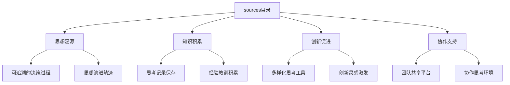

**图表来源**
- [init.md](file://niopd/commands/SYS/init.md#L27-L31)
- [hi.md](file://niopd/commands/BS/hi.md#L96-L97)

## 在NioPD四层架构中的角色

### 四层架构概览

NioPD采用分层架构设计，将产品管理过程分为四个层次，每个层次承担不同的职责：

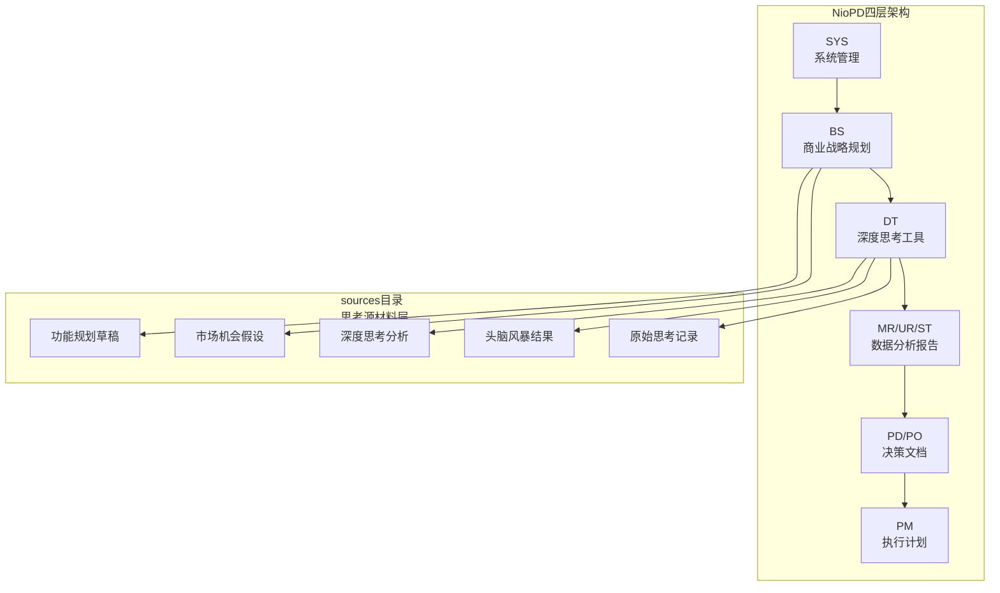

**图表来源**
- [README.md](file://README.md#L163-L195)
- [init.md](file://niopd/commands/SYS/init.md#L27-L31)

### sources目录的具体角色

在四层架构中，sources目录承担以下关键角色：

1. **原始输入层**：为上层决策提供未经加工的原始思考材料
2. **思想沉淀层**：将零散的思考转化为系统化的知识记录
3. **创新孵化器**：通过多样化思考工具培育创新想法
4. **协作基础层**：为团队协作提供共享的思考基础

**章节来源**
- [init.md](file://niopd/commands/SYS/init.md#L27-L31)
- [README.md](file://README.md#L197-L240)

## 目录结构与文件组织

### 目录创建机制

sources目录通过系统初始化自动创建，遵循标准化的目录结构：

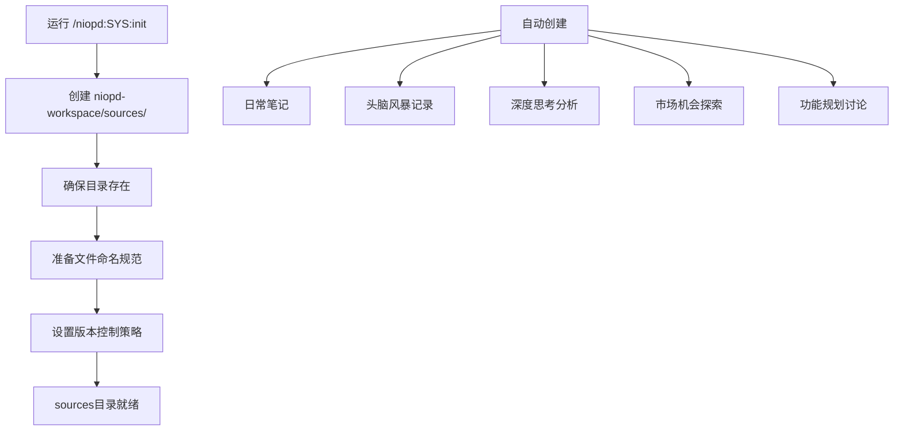

**图表来源**
- [init.md](file://niopd/commands/SYS/init.md#L27-L31)
- [hi.md](file://niopd/commands/BS/hi.md#L96-L97)

### 文件类型分类

sources目录包含多种类型的文件，每种文件服务于不同的思考场景：

| 文件类型 | 描述 | 使用场景 | 示例文件名 |
|---------|------|---------|-----------|
| **日常笔记** | 记录即时想法和灵感 | 日常思考记录 | `note.md` |
| **头脑风暴** | 商业战略规划讨论 | 新产品创意生成 | `[YYYYMMDD]-brainstorm-discussion-v0.md` |
| **深度思考** | 第一性原理分析 | 根本问题解决 | `[YYYYMMDD]-first-principles-thinking-v0.md` |
| **根因分析** | 5 Whys技术应用 | 问题根源挖掘 | `[YYYYMMDD]-five-whys-analysis-v0.md` |
| **场景规划** | 未来情景分析 | 长期战略思考 | `[YYYYMMDD]-scenario-planning-v0.md` |
| **概念澄清** | Socratic提问探讨 | 深度理解构建 | `[YYYYMMDD]-socratic-questioning-v0.md` |
| **市场机会** | 市场机会识别 | 商业机会评估 | `[YYYYMMDD]-market-opportunity-v0.md` |
| **功能规划** | 功能创意生成 | 产品功能设计 | `[YYYYMMDD]-feature-planning-v0.md` |

**章节来源**
- [note.md](file://niopd/commands/BS/note.md#L1-L87)
- [hi.md](file://niopd/commands/BS/hi.md#L1-L101)
- [first-principles.md](file://niopd/commands/DT/first-principles.md#L1-L247)
- [five-whys.md](file://niopd/commands/DT/five-whys.md#L1-L246)
- [scenarios.md](file://niopd/commands/DT/scenarios.md#L1-L300)
- [socratic-questioning.md](file://niopd/commands/DT/socratic-questioning.md#L1-L248)

## 核心功能模块

### 商业战略规划模块（BS）

商业战略规划模块专注于从想法生成到产品方向规划的全过程，主要包含以下功能：

#### 特征规划功能
特征规划功能通过分析用户反馈、内部观察和历史PRD，系统性地生成新产品创意：

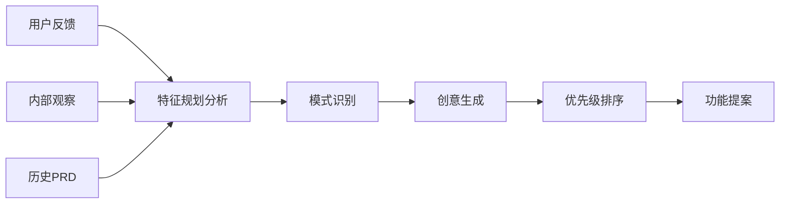

**图表来源**
- [feature-planning.md](file://niopd/commands/BS/feature-planning.md#L15-L45)

#### 市场机会分析
市场机会分析模块提供系统性的市场gap识别和机会评估：

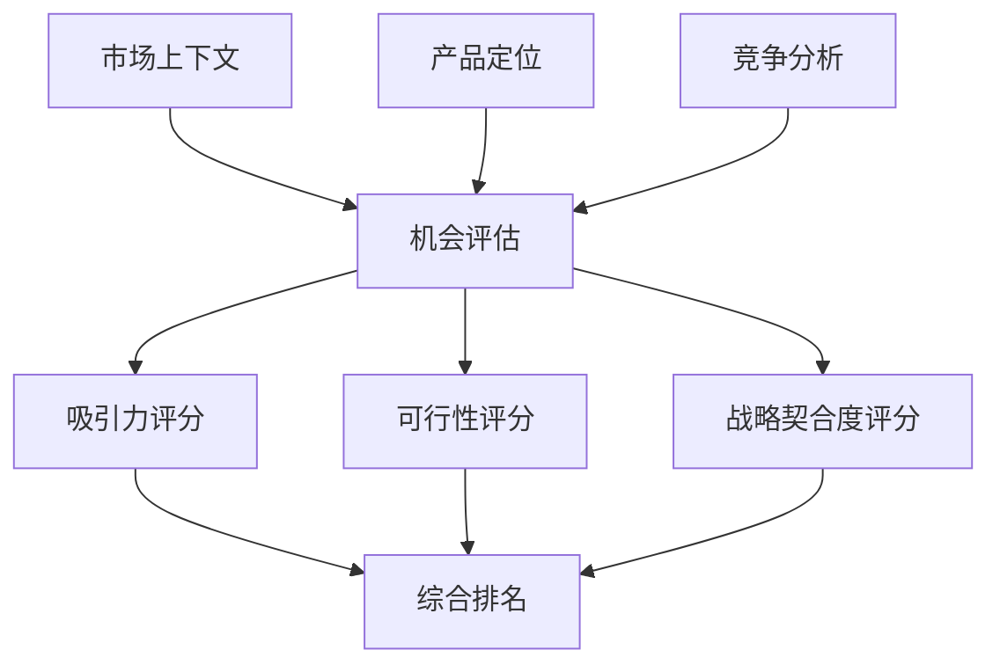

**图表来源**
- [market-opportunity.md](file://niopd/commands/BS/market-opportunity.md#L25-L55)

**章节来源**
- [feature-planning.md](file://niopd/commands/BS/feature-planning.md#L1-L156)
- [market-opportunity.md](file://niopd/commands/BS/market-opportunity.md#L1-L266)

### 深度思考工具模块（DT）

深度思考工具模块提供多种系统性的思考方法，帮助用户突破常规思维模式：

#### 第一性原理思考
第一性原理思考引导用户将复杂问题分解为基础元素，然后从基本真理重新构建解决方案：

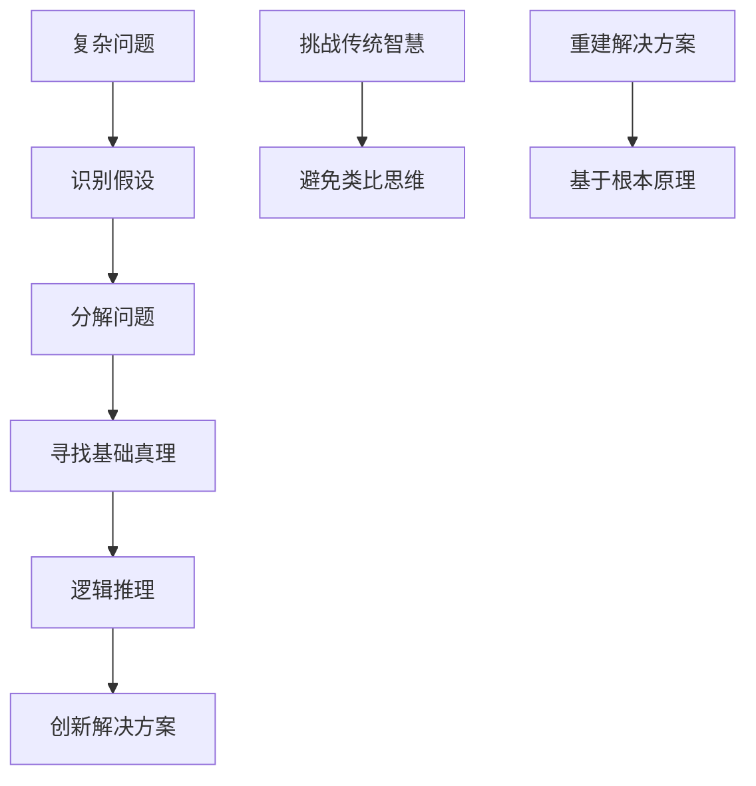

**图表来源**
- [first-principles.md](file://niopd/commands/DT/first-principles.md#L15-L45)

#### 5 Whys根因分析
5 Whys技术通过连续提问"为什么"来识别问题的根本原因：

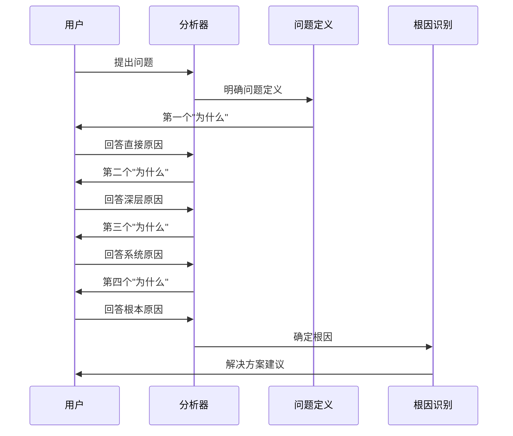

**图表来源**
- [five-whys.md](file://niopd/commands/DT/five-whys.md#L45-L85)

#### 场景规划
场景规划帮助用户探索多个未来可能性，制定更具韧性的战略：

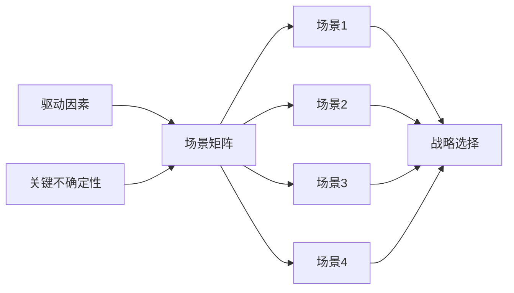

**图表来源**
- [scenarios.md](file://niopd/commands/DT/scenarios.md#L25-L55)

**章节来源**
- [first-principles.md](file://niopd/commands/DT/first-principles.md#L1-L247)
- [five-whys.md](file://niopd/commands/DT/five-whys.md#L1-L246)
- [scenarios.md](file://niopd/commands/DT/scenarios.md#L1-L300)

## 文件命名规范与版本控制

### 标准命名模式

NioPD采用统一的文件命名规范，确保文件的可读性和可管理性：

```
[YYYYMMDD]-<identifier>-<document-type>-v[version].md
```

#### 命名要素说明

| 组件 | 格式 | 示例 | 说明 |
|------|------|------|------|
| **日期部分** | `YYYYMMDD` | `20241030` | 当前日期，便于时间排序 |
| **标识符** | 小写字母+连字符 | `mobile-redesign` | 项目或主题的URL友好名称 |
| **文档类型** | 方法论缩写 | `brainstorm`, `first-principles`, `five-whys` | 表明文件内容类型 |
| **版本号** | `v[数字]` | `v0`, `v1`, `v2` | 版本控制，v0表示初始版本 |

### 版本控制策略

#### 自动版本管理
系统自动处理版本号递增：

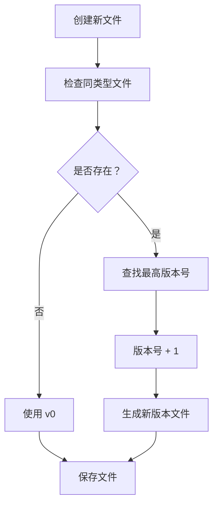

**图表来源**
- [init.md](file://niopd/commands/SYS/init.md#L150-L170)

#### 版本演进原则
1. **增量改进**：每次修改都创建新版本而非覆盖
2. **历史保留**：保留完整的思考演进轨迹
3. **可追溯性**：通过版本号追踪文档发展过程
4. **质量保证**：只有经过验证的版本才进入正式使用

**章节来源**
- [init.md](file://niopd/commands/SYS/init.md#L150-L170)

## 使用场景与最佳实践

### 典型使用场景

#### 场景1：新产品创意生成
当团队需要产生新产品创意时，可以使用以下流程：

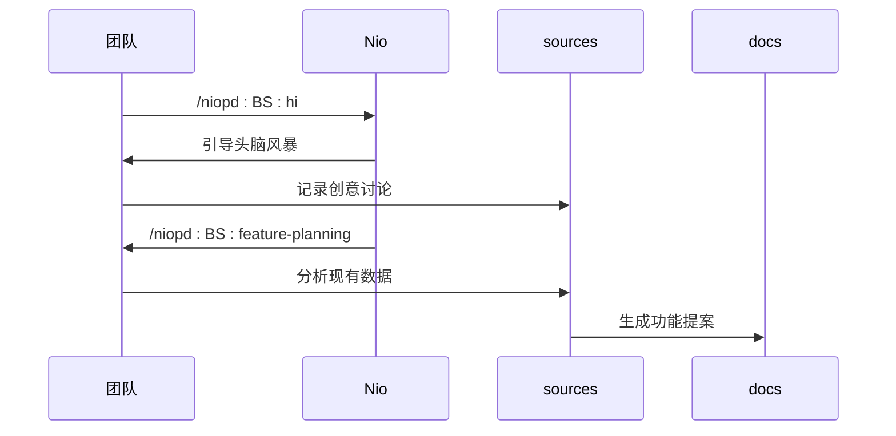

**图表来源**
- [hi.md](file://niopd/commands/BS/hi.md#L1-L101)
- [feature-planning.md](file://niopd/commands/BS/feature-planning.md#L1-L156)

#### 场景2：市场机会识别
市场机会识别通常遵循以下步骤：

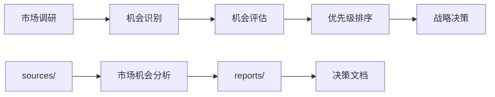

**图表来源**
- [market-opportunity.md](file://niopd/commands/BS/market-opportunity.md#L1-L266)

#### 场景3：问题根因分析
复杂问题的根因分析流程：

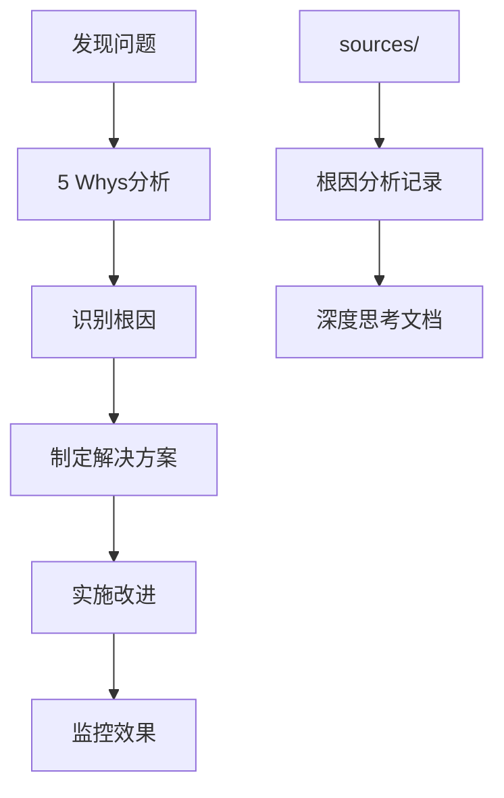

**图表来源**
- [five-whys.md](file://niopd/commands/DT/five-whys.md#L1-L246)

### 最佳实践建议

#### 1. 日常思考记录
- **及时性**：发现问题或产生想法时立即记录
- **简洁性**：保持记录简洁明了，突出重点
- **完整性**：记录思考的背景、过程和结论
- **定期回顾**：定期回顾思考记录，发现模式和趋势

#### 2. 头脑风暴管理
- **结构化引导**：使用系统化的方法引导讨论
- **多元化视角**：鼓励不同观点的碰撞
- **记录完整**：完整记录讨论过程和结论
- **后续跟进**：将讨论成果转化为具体行动

#### 3. 深度思考应用
- **系统性方法**：严格按照方法论要求进行思考
- **批判性思维**：勇于质疑和挑战既有假设
- **跨领域借鉴**：从其他领域寻找启发
- **持续迭代**：不断深化和细化思考

#### 4. 团队协作
- **共享开放**：鼓励团队成员分享思考记录
- **相互启发**：通过阅读他人思考获得启发
- **集体智慧**：利用团队的集体智慧提升思考质量
- **知识传承**：将思考成果转化为团队知识资产

**章节来源**
- [note.md](file://niopd/commands/BS/note.md#L1-L87)
- [hi.md](file://niopd/commands/BS/hi.md#L1-L101)
- [new-initiative.md](file://niopd/commands/BS/new-initiative.md#L1-L214)

## 与其他目录的协作关系

### 流转关系图

sources目录与其他目录之间存在清晰的流转关系，形成完整的产品管理知识链：

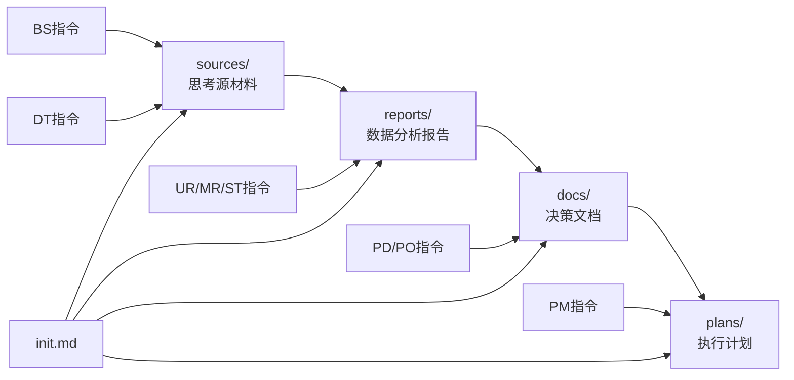

**图表来源**
- [init.md](file://niopd/commands/SYS/init.md#L27-L31)
- [README.md](file://README.md#L163-L195)

### 协作机制

#### 从sources到reports
sources目录中的思考记录通过数据分析和方法论应用，转化为结构化的分析报告：

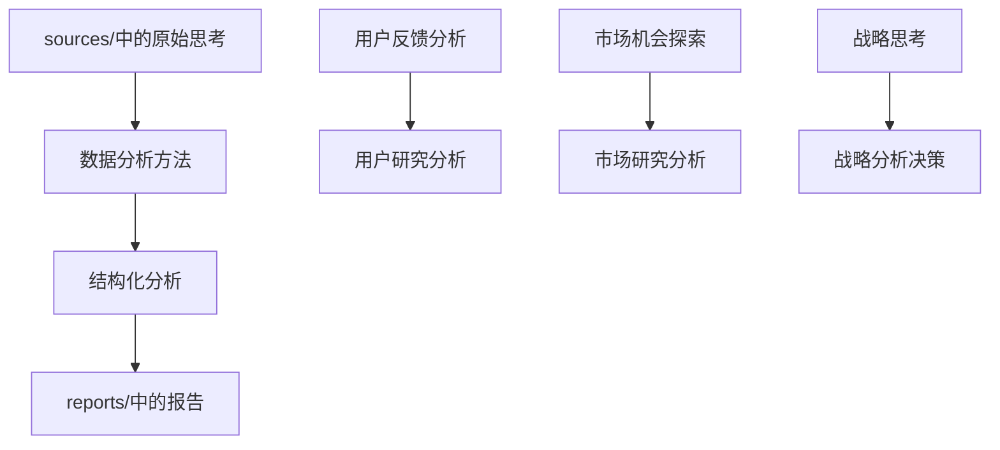

**图表来源**
- [feature-planning.md](file://niopd/commands/BS/feature-planning.md#L75-L105)
- [market-opportunity.md](file://niopd/commands/BS/market-opportunity.md#L256-L266)

#### 从reports到docs
reports目录中的分析报告进一步转化为具体的决策文档：

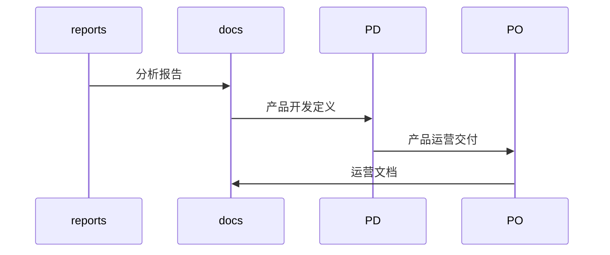

**图表来源**
- [README.md](file://README.md#L197-L240)

**章节来源**
- [init.md](file://niopd/commands/SYS/init.md#L27-L31)
- [feature-planning.md](file://niopd/commands/BS/feature-planning.md#L75-L105)
- [market-opportunity.md](file://niopd/commands/BS/market-opportunity.md#L256-L266)

## 设计哲学与思想溯源

### 核心设计哲学

sources目录的设计体现了深刻的哲学思想和方法论基础：

#### 1. "先思考再执行"哲学
这一哲学强调思考的重要性，认为任何有效的行动都必须建立在充分思考的基础上：

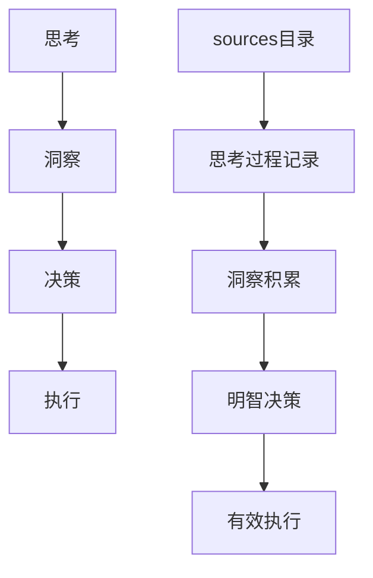

**图表来源**
- [init.md](file://niopd/commands/SYS/init.md#L120-L140)

#### 2. 知识管理哲学
sources目录体现了现代知识管理的核心理念：

- **分布式认知**：将思考过程外化，减轻认知负担
- **渐进式积累**：通过持续记录实现知识的渐进式增长
- **协作共享**：促进团队间的知识共享和协作
- **可追溯性**：确保决策过程的透明和可追溯

#### 3. 创新方法论
sources目录整合了多种创新方法论：

```mermaid
mindmap
root((创新方法论))
第一性原理
基础元素分解
重构解决方案
突破传统思维
5 Whys
根因分析
系统性思考
持续追问
场景规划
多元未来
战略韧性
风险应对
Socratic提问
批判性思维
假设挑战
深度理解
```

**图表来源**
- [first-principles.md](file://niopd/commands/DT/first-principles.md#L15-L45)
- [five-whys.md](file://niopd/commands/DT/five-whys.md#L15-L45)
- [scenarios.md](file://niopd/commands/DT/scenarios.md#L15-L45)
- [socratic-questioning.md](file://niopd/commands/DT/socratic-questioning.md#L15-L45)

### 思想溯源

sources目录的设计深受以下思想的影响：

#### 1. 古典哲学传统
- **苏格拉底方法**：通过提问揭示真理
- **亚里士多德逻辑**：基于第一原理的推理
- **柏拉图理念**：追求本质和真理

#### 2. 现代认知科学
- **认知负荷理论**：将思考外化减轻认知负担
- **分布式认知**：将思考过程分布到外部环境中
- **反思性实践**：通过反思提升实践质量

#### 3. 知识管理理论
- **隐性知识显性化**：将隐性思考转化为显性记录
- **知识螺旋**：通过经验反思实现知识增长
- **社会建构主义**：通过协作构建知识

**章节来源**
- [first-principles.md](file://niopd/commands/DT/first-principles.md#L15-L45)
- [five-whys.md](file://niopd/commands/DT/five-whys.md#L15-L45)
- [scenarios.md](file://niopd/commands/DT/scenarios.md#L15-L45)
- [socratic-questioning.md](file://niopd/commands/DT/socratic-questioning.md#L15-L45)

## 总结与展望

### 核心价值总结

sources目录作为NioPD系统的基础层，具有以下核心价值：

1. **思想溯源保障**：为所有产品决策提供可追溯的思想源头
2. **知识积累基础**：建立系统化的思考记录和知识管理体系
3. **创新促进机制**：通过多样化思考工具激发创新灵感
4. **协作支持平台**：为团队协作提供共享的思考基础

### 发展方向

随着NioPD系统的不断发展，sources目录将在以下方面持续演进：

#### 1. 智能化增强
- **AI辅助思考**：利用AI技术提供思考建议和灵感
- **模式识别**：自动识别思考模式和趋势
- **智能推荐**：根据当前思考内容推荐相关工具和方法

#### 2. 协作能力提升
- **实时协作**：支持多人同时参与思考过程
- **知识图谱**：构建思考内容的知识图谱
- **社区建设**：建立更广泛的思考交流社区

#### 3. 工具生态完善
- **多样化工具**：引入更多思考和分析工具
- **集成优化**：更好地与其他目录和工具集成
- **用户体验**：持续优化使用体验和效率

### 实践建议

对于希望充分利用sources目录价值的用户，建议：

1. **养成记录习惯**：将思考过程及时记录下来
2. **系统性使用**：根据具体需求选择合适的思考工具
3. **持续改进**：根据使用体验不断优化思考方法
4. **团队推广**：在团队中推广思考记录的文化

sources目录不仅是NioPD系统的重要组成部分，更是现代产品管理中思考文化的重要体现。通过系统化的思考记录和知识管理，它为创造卓越的产品决策提供了坚实的基础。