# NioPD目录结构详解

<cite>
**本文档中引用的文件**
- [init.md](file://niopd/commands/SYS/init.md)
- [README.md](file://README.md)
- [feature-planning.md](file://niopd/commands/BS/feature-planning.md)
- [draft-mrd.md](file://niopd/commands/PD/draft-mrd.md)
- [agile-planning.md](file://niopd/commands/PM/agile-planning.md)
- [swot.md](file://niopd/commands/ST/swot.md)
- [customer-success.md](file://niopd/commands/PO/customer-success.md)
- [templates/README.md](file://niopd/templates/README.md)
</cite>

## 目录

1. [概述](#概述)
2. [四层目录结构设计](#四层目录结构设计)
3. [sources/ - 思考源材料层](#sources--思考源材料层)
4. [reports/ - 数据分析报告层](#reports--数据分析报告层)
5. [docs/ - 决策文档层](#docs--决策文档层)
6. [plans/ - 执行计划层](#plans--执行计划层)
7. [初始化流程详解](#初始化流程详解)
8. [文档命名规范](#文档命名规范)
9. [文档流转机制](#文档流转机制)
10. [项目一致性价值](#项目一致性价值)

## 概述

NioPD（Nio Product Director）采用独特的四层目录结构设计，代表了产品管理生命周期的完整演进过程。这种结构不仅仅是文件组织方式，更是产品思维从发散到收敛、从抽象到具体的系统化表达。

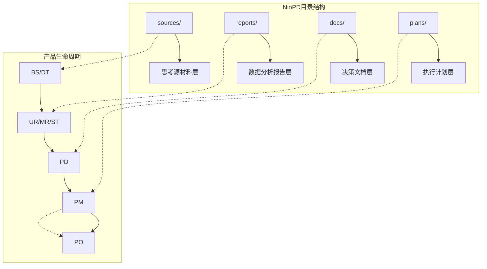

**图表来源**
- [init.md](file://niopd/commands/SYS/init.md#L25-L35)
- [README.md](file://README.md#L163-L195)

## 四层目录结构设计

### 设计理念

NioPD的四层目录结构遵循"思考→分析→决策→执行"的产品管理流程，每一层都有明确的职责和产出：

1. **sources/** - 原始思考记录，存储头脑风暴和深度思考的素材
2. **reports/** - 结构化分析报告，基于数据和方法论的洞察
3. **docs/** - 权威性决策文档，支撑产品战略和运营
4. **plans/** - 执行导向计划，指导项目落地实施

### 层级关系

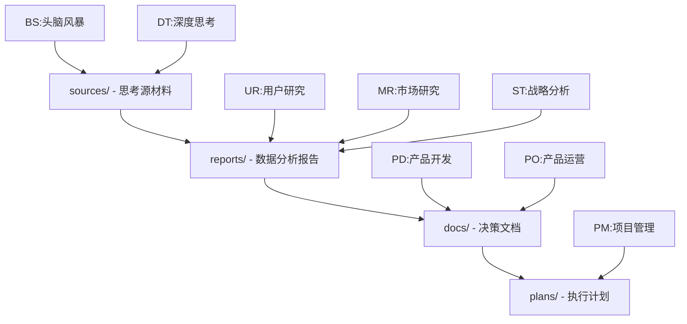

**节来源**
- [init.md](file://niopd/commands/SYS/init.md#L123-L151)
- [README.md](file://README.md#L163-L195)

## sources/ - 思考源材料层

### 创建目的

sources/目录是产品管理过程中原始思考和创意的发源地，存储各种形式的思考记录和灵感素材。

### 存储内容类型

| 指令类别 | 典型文件 | 内容描述 | 生成方式 |
|---------|---------|---------|---------|
| BS - 商业战略 | `[date]-brainstorm-discussion.md` | 头脑风暴讨论记录 | `/niopd:BS:hi` |
| BS - 商业战略 | `[date]-feature-planning.md` | 功能规划想法 | `/niopd:BS:feature-planning` |
| DT - 深度思考 | `[date]-first-principles-thinking.md` | 第一性原理分析 | `/niopd:DT:first-principles` |
| DT - 深度思考 | `[date]-five-whys-analysis.md` | 五个为什么分析 | `/niopd:DT:five-whys` |
| DT - 深度思考 | `[date]-socratic-questioning.md` | 苏格拉底式提问 | `/niopd:DT:socratic-questioning` |
| DT - 深度思考 | `[date]-scenario-planning.md` | 场景规划分析 | `/niopd:DT:scenarios` |
| BS - 日常记录 | `note.md` | 日常想法和灵感 | `/niopd:BS:note` |

### 由哪些指令生成

sources/目录主要由以下指令生成：

- **BS系列指令**：商业战略规划相关的头脑风暴和想法生成
- **DT系列指令**：深度思考工具，包括第一性原理、五个为什么等
- **UR系列指令**：用户研究中的初步洞察和观察

### 在产品生命周期中的作用

sources/是产品管理的"第一性原理"阶段，确保所有后续决策都有坚实的思考基础：

**节来源**
- [feature-planning.md](file://niopd/commands/BS/feature-planning.md#L15-L35)
- [init.md](file://niopd/commands/SYS/init.md#L25-L35)

## reports/ - 数据分析报告层

### 创建目的

reports/目录存储基于数据和方法论的结构化分析报告，为产品决策提供科学依据和战略支撑。

### 存储内容类型

| 指令类别 | 典型文件 | 分析维度 | 输出价值 |
|---------|---------|---------|---------|
| UR - 用户研究 | `[date]-user-feedback-summary.md` | 用户反馈主题分析 | 用户需求洞察 |
| UR - 用户研究 | `[date]-user-personas.md` | 用户画像构建 | 目标用户理解 |
| UR - 用户研究 | `[date]-user-journey.md` | 用户旅程映射 | 痛点识别 |
| MR - 市场研究 | `[date]-competitor-analysis.md` | 竞品对比分析 | 市场定位 |
| MR - 市场研究 | `[date]-market-trends.md` | 市场趋势研究 | 机会识别 |
| ST - 战略分析 | `[date]-swot-analysis.md` | SWOT分析 | 战略决策 |
| ST - 战略分析 | `[date]-porters-five-forces.md` | 五力分析 | 行业洞察 |
| ST - 战略分析 | `[date]-business-model-canvas.md` | 商业画布 | 业务模式 |

### 由哪些指令生成

reports/目录由以下指令生成：

- **UR系列指令**：用户研究相关的分析和洞察
- **MR系列指令**：市场研究相关的竞争和趋势分析
- **ST系列指令**：战略分析相关的框架和模型应用

### 在产品生命周期中的作用

reports/是连接原始思考和最终决策的桥梁，确保决策基于充分的数据和分析：

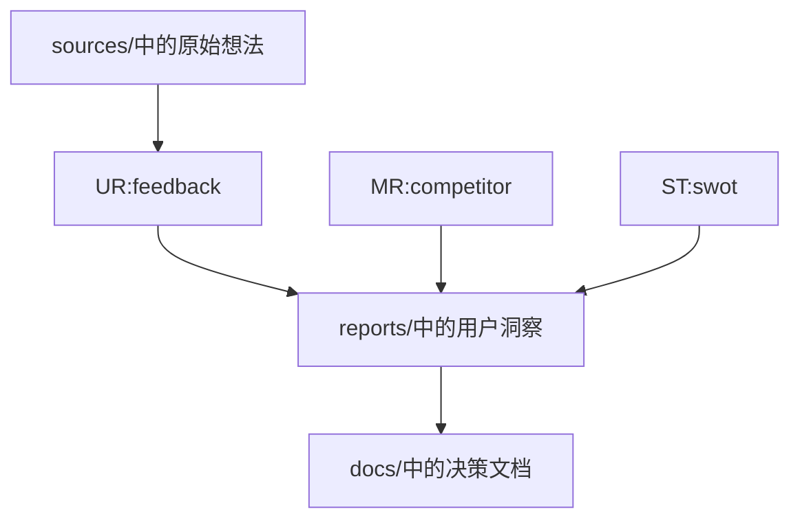

**节来源**
- [swot.md](file://niopd/commands/ST/swot.md#L15-L35)
- [customer-success.md](file://niopd/commands/PO/customer-success.md#L15-L35)

## docs/ - 决策文档层

### 创建目的

docs/目录存储权威性的产品决策文档和运营方案，这些文档具有法律和业务约束力，是产品战略和执行的正式依据。

### 存储内容类型

#### 产品开发文档层级

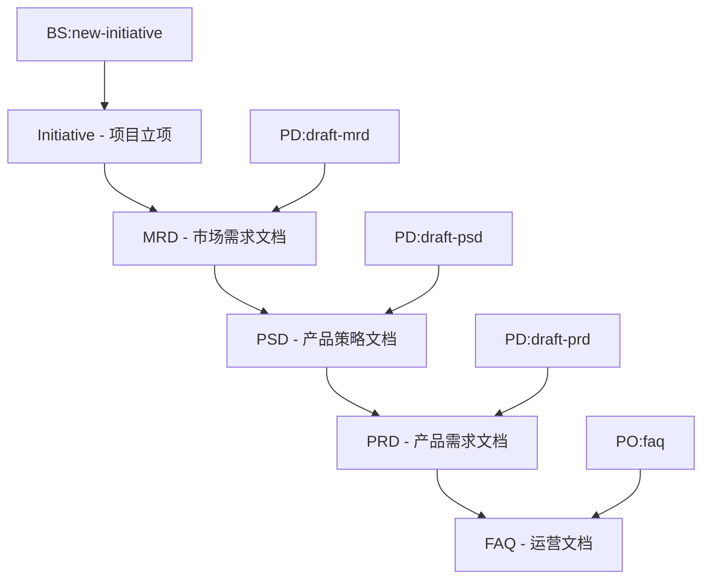

**图表来源**
- [draft-mrd.md](file://niopd/commands/PD/draft-mrd.md#L25-L45)

#### 典型文件示例

| 文档类型 | 文件格式 | 内容重点 | 读者对象 |
|---------|---------|---------|---------|
| 项目立项 | `[date]-<initiative>-initiative-v1.md` | 项目背景、目标、范围 | 项目团队、管理层 |
| 市场需求 | `[date]-<initiative>-mrd-v1.md` | 市场分析、用户需求、竞争定位 | 产品团队、市场团队 |
| 产品策略 | `[date]-<initiative>-psd-v1.md` | 产品愿景、战略目标、优先级 | 产品管理、工程领导 |
| 产品需求 | `[date]-<initiative>-prd-v1.md` | 详细功能需求、用户故事 | 开发团队、设计师 |
| 运营文档 | `[date]-<initiative>-faq-v1.md` | 用户指南、常见问题 | 客户支持、用户 |

### 由哪些指令生成

docs/目录主要由以下指令生成：

- **PD系列指令**：产品开发相关的文档生成
- **PO系列指令**：产品运营相关的文档生成

### 在产品生命周期中的作用

docs/是产品管理的"权威决策"阶段，确保所有团队成员对产品方向有一致的理解：

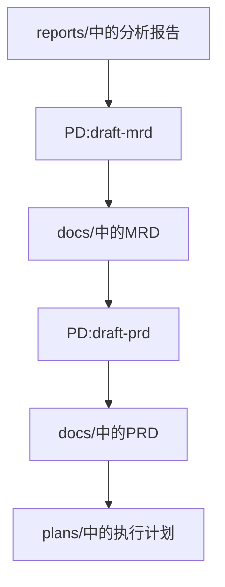

**节来源**
- [draft-mrd.md](file://niopd/commands/PD/draft-mrd.md#L15-L35)
- [README.md](file://README.md#L240-L256)

## plans/ - 执行计划层

### 创建目的

plans/目录存储项目执行计划、发布计划、风险管理等，是产品管理的"行动指南"，确保战略决策能够有效落地。

### 存储内容类型

| 指令类别 | 典型文件 | 计划维度 | 执行价值 |
|---------|---------|---------|---------|
| PM - 项目管理 | `[date]-<initiative>-pid-v1.md` | 项目立项文档 | 项目启动基础 |
| PM - 项目管理 | `[date]-<initiative>-release-plan-v1.md` | 发布计划 | 时间线管理 |
| PM - 项目管理 | `[date]-<initiative>-roadmap-v1.md` | 产品路线图 | 战略执行 |
| PM - 项目管理 | `[date]-<initiative>-sprint-plan-v1.md` | 敏捷冲刺计划 | 迭代执行 |
| PM - 项目管理 | `[date]-<initiative>-risk-analysis-v1.md` | 风险分析报告 | 风险管理 |
| PM - 项目管理 | `[date]-<initiative>-agile-planning-v1.md` | 敏捷规划 | 团队协作 |

### 由哪些指令生成

plans/目录主要由以下指令生成：

- **PM系列指令**：项目管理相关的计划和规划
- **PD系列指令**：产品开发中的执行计划生成

### 在产品生命周期中的作用

plans/是产品管理的"执行落地"阶段，将战略决策转化为可操作的行动计划：

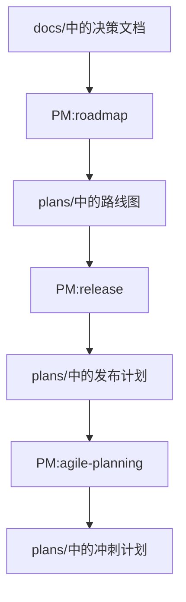

**节来源**
- [agile-planning.md](file://niopd/commands/PM/agile-planning.md#L15-L35)
- [README.md](file://README.md#L267-L300)

## 初始化流程详解

### /niopd:SYS:init - 工作区初始化

初始化流程是NioPD系统的核心入口，负责创建标准的四层目录结构。

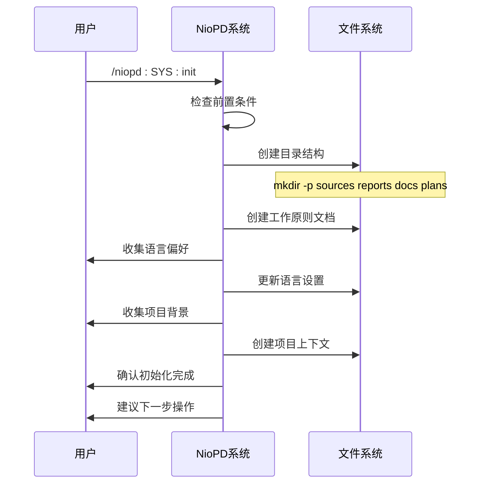

**图表来源**
- [init.md](file://niopd/commands/SYS/init.md#L25-L80)

### 目录结构创建

初始化过程创建以下标准目录：

1. **niopd-workspace/sources/** - 思考源材料层
2. **niopd-workspace/reports/** - 数据分析报告层  
3. **niopd-workspace/docs/** - 决策文档层
4. **niopd-workspace/plans/** - 执行计划层

### 项目上下文建立

初始化不仅创建目录，还建立完整的项目上下文：

- **工作原则文档**：定义NioPD系统的基本原则和工作方式
- **通信偏好设置**：记录用户的首选语言
- **项目背景信息**：存储项目的基本信息和目标

**节来源**
- [init.md](file://niopd/commands/SYS/init.md#L40-L80)

## 文档命名规范

### 标准命名模式

所有NioPD文件遵循统一的命名规范：`[YYYYMMDD]-<identifier>-<document-type>-v[version].md`

### 命名元素解析

| 元素 | 格式 | 示例 | 说明 |
|------|------|------|------|
| 日期部分 | YYYYMMDD | 20241030 | 文件创建日期 |
| 标识符 | <initiative> | mobile-redesign | 项目或功能名称 |
| 文档类型 | <type> | mrd, prd, roadmap | 文档类别 |
| 版本号 | v[0-9]+ | v0, v1, v2 | 版本控制 |

### 版本控制机制

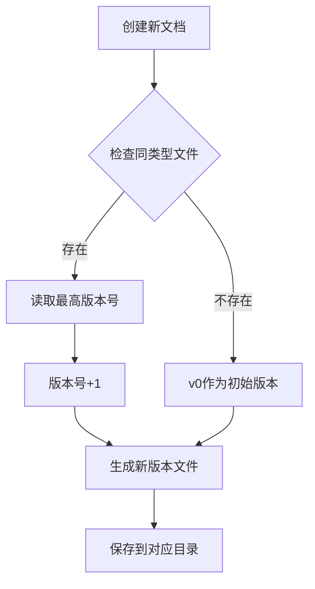

**图表来源**
- [init.md](file://niopd/commands/SYS/init.md#L153-L166)

### 实际示例

典型的文件命名示例：

- `20241030-mobile-redesign-brainstorm-v0.md` - 思考源材料
- `20241031-mobile-redesign-user-feedback-v1.md` - 数据分析报告
- `20241102-mobile-redesign-mrd-v1.md` - 决策文档
- `20241106-mobile-redesign-release-plan-v0.md` - 执行计划

**节来源**
- [init.md](file://niopd/commands/SYS/init.md#L153-L166)

## 文档流转机制

### 生命周期演进

NioPD文档遵循严格的生命周期演进模式，确保知识的积累和传承：

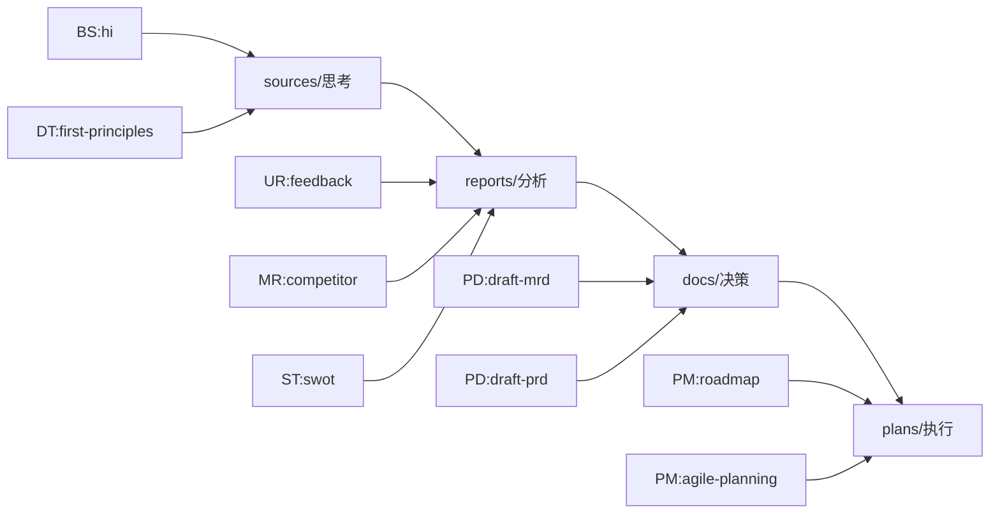

**图表来源**
- [README.md](file://README.md#L267-L300)

### 上下文关联

每个文档都与其相关联的其他文档建立明确的引用关系：

1. **来源追踪**：文档开头注明引用的原始资料
2. **版本管理**：版本号反映文档的演进历程
3. **依赖关系**：文档间的逻辑依赖关系清晰可见

### 知识积累机制

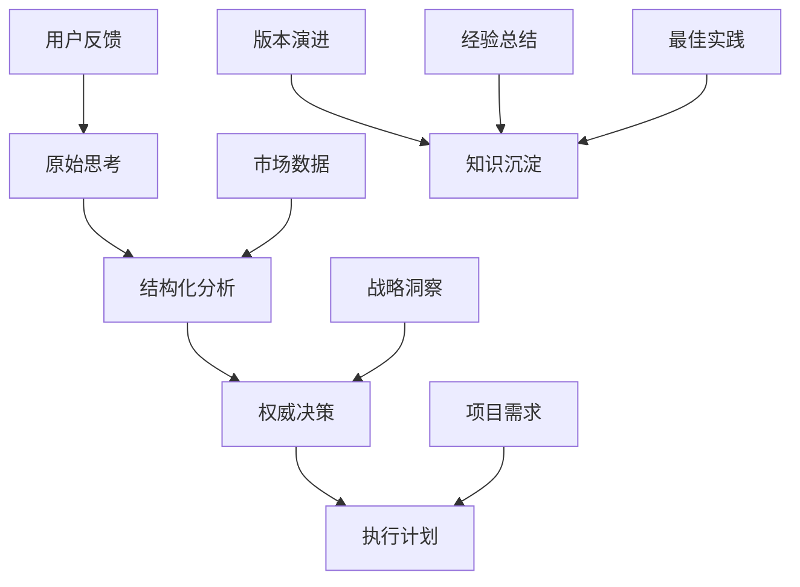

**节来源**
- [README.md](file://README.md#L163-L195)

## 项目一致性价值

### 统一的工作标准

NioPD的四层目录结构确保了项目的一致性和可预测性：

| 方面 | 价值体现 | 具体表现 |
|------|---------|---------|
| 文档质量 | 标准化模板 | 统一的文档结构和格式 |
| 知识管理 | 可追溯性 | 完整的思考和决策过程记录 |
| 团队协作 | 信息对齐 | 所有成员基于相同信息库工作 |
| 项目执行 | 可预测性 | 清晰的文档流转路径 |
| 知识传承 | 可复用性 | 历史经验和最佳实践积累 |

### 质量保证机制

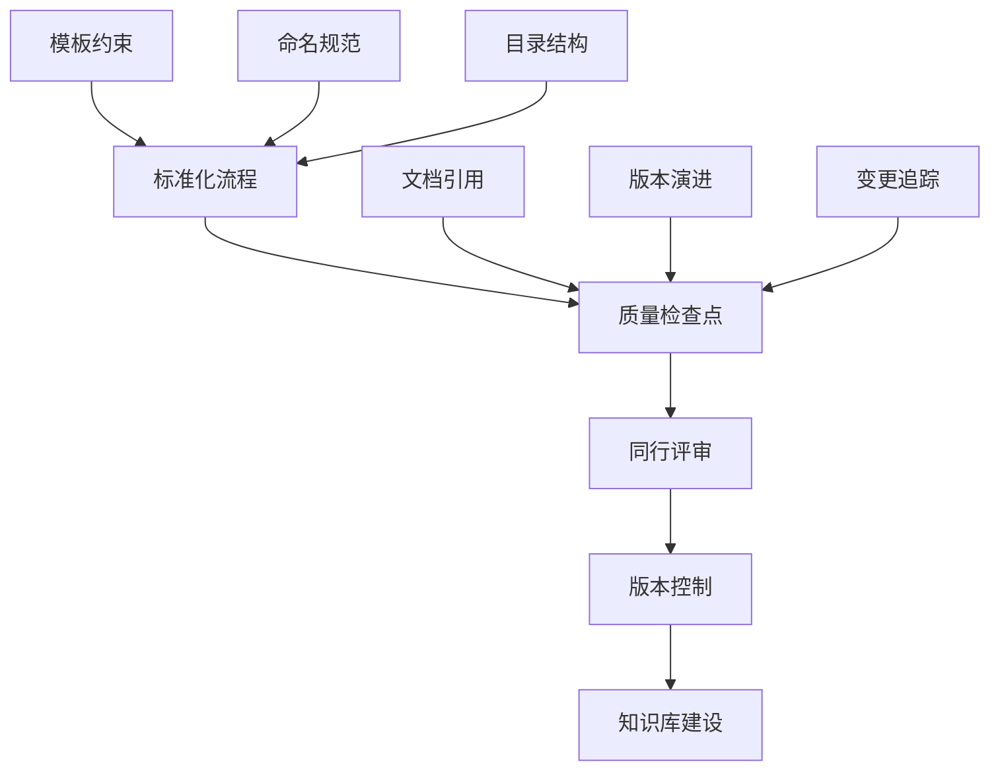

### 长期价值

1. **知识资产积累**：每个项目都成为组织的知识财富
2. **经验传承**：新团队可以快速理解项目背景和决策过程
3. **效率提升**：标准化流程减少沟通成本和重复工作
4. **质量保障**：完整的文档记录确保决策的可追溯性
5. **学习平台**：为团队成员提供学习和成长的机会

**节来源**
- [init.md](file://niopd/commands/SYS/init.md#L97-L121)

## 结论

NioPD的四层目录结构设计不仅仅是一个文件组织方案，更是一个完整的知识管理体系。它体现了现代产品管理的最佳实践，将传统的文档管理提升到了知识管理的新高度。

通过这种结构化的设计，NioPD实现了：

- **从思考到执行的完整闭环**：确保每个想法都能得到充分的思考和验证
- **从数据到决策的科学转化**：基于充分的数据和分析做出明智决策
- **从战略到执行的有效落地**：将高层战略转化为可操作的行动计划
- **从项目到知识的有效积累**：将项目经验转化为组织的知识资产

这种设计使得产品管理不再是孤立的任务执行，而是一个系统化、科学化、可持续的知识创造和传承过程。